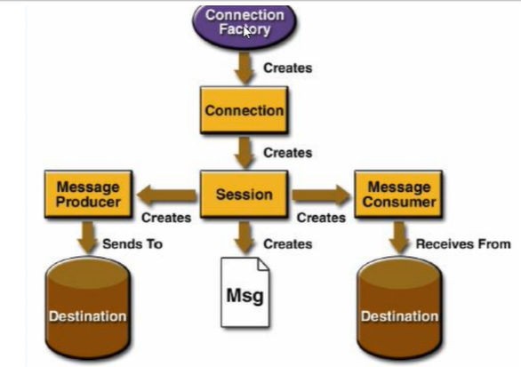
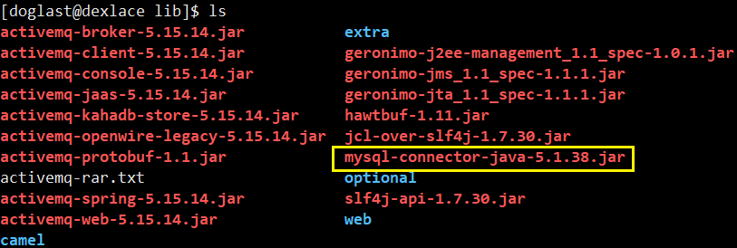

# activeMQ笔记

## 一、MQ介绍

mq（message queue）：面向消息的中间件（message-oriented middleware）是指==利用高效可靠的消息传递机制与平台无关的数据交流==，并基于==数据通信==来进行==分布式系统的集成==。

通过提供消息传递和消息排队模型在==分布式环境==下提供==应用解耦==，==弹性伸缩，冗余存储、流量削峰，异步通信，数据同步等功能==。

发送者把消息发送给消息服务器，消息服务器将消息存放在==若干队列/主题topic==中，在合适的时候，消息服务器回将消息转发给接受者。在这个过程中，发送和接收是异步的，也就是发送无需等待，而且发送者和接受者的生命周期也没有必然的关系；尤其在==发布pub/订阅sub模式下==，也可以完成==一对多的通信==，即让一个消息有多个接受者。
### 1.1 为什么需要MQ
==引入MQ之前我们碰到的问题==

系统之间接口耦合比较严重
==每新增一个下游功能，都要对上游的相关接口进行改造；==
举个例子：如果系统A要发送数据给系统B和系统C，发送给每个系统的数据可能有差异，因此系统A对要发送给每个系统的数据进行了组装，然后逐一发送；
当代码上线后又新增了一个需求：
把数据也发送给D，新上了一个D系统也要接受A系统的数据，此时就需要修改A系统，让他感知到D系统的存在，同时把数据处理好再给D。在这个过程你会看到，每接入一个下游系统，都要对系统A进行代码改造，开发联调的效率很低。其整体架构如下图：

> <font color=red>引入MQ之后能解决</font>

1. 要做到系统解耦，当新的模块接进来时，可以做到代码改动最小，==**能解耦**==。
2. 设置流量缓冲池，可以让后端系统按照自身吞吐能力进行消费，不被冲垮；==**能削峰**==。
3. 强弱依赖梳理能将非关键调用链路的操作异步化并提升整体系统的吞吐能力；==**能异步**==。

> 特点：
>
> 1. ==采用异步处理模式==
>
>    消息发送者可以发送一个消息而无须等待响应。消息发送者将消息发送到一条虚拟的通道（主题或者队列）上；
>    消息接收者则订阅或者监听该通道。一条消息可能最终转发给一个或者多个消息接收者，这些消息接收者都无需对消息发送者做出同步回应。整个过程都是异步的。
>
> 2. ==应用系统之间耦合==
>
> ​       发送者和接受者不必了解对方，只需要消息确认。
> ​       发送者和接受不必同时在线。

### 1.2 安装和使用

>  解压就可，安装略

==启动==

> 进入bin目录下，./activemq start启动activeMQ

==查看是否成功启动==

```bash
ps -ef|grep activemq|grep -v grep
```


==根据启动端口查看==


==进一步可以验证==

```bash
netstat -anp|grep 61616
```

ActiveMQ默认启动端口为`61616`，启动进程编号4536和上一步相呼应。


==进一步可以验证==

```bash
lsof -i:61616
```


==关闭activemq==

```bash
./activemq stop
```

==重启activemq==

```bash
./activemq restart
```

==带日志的启动==

```bash
./activemq start > 目标文件
```

此时ActiveMQ启动日志信息不再控制台打印，而是持久化到了指定的日志文件

<font color=red>指定配置文件方式启动</font>

```bash
./activemq start xbean:file:/配置文件路径
```

<font color=red>客户端访问服务器</font>

> 客户端和服务器之间互相能ping通
> 直接==服务器的ip和端口号8161==
>
> 注意：输入的用户名和密码默认都是==admin==

## 二、基础编码

### 2.1 JMS规范框架

MQ遵循了JAVA EE的==JMS（Java Message Service）==规范，JMS规范架构如下：



ConnectionFactory加载MQ连接驱动，并创建Connnection连接对象（类似连接数据库时加载JDBC驱动，生成java.sql.Connection对象），由==Connection对象创建Session会话对象，Session可以创建Message（消息）==，Message Producer（消息生产者）和Message Consumer（消息消费者）。Message Producer（消息生产者）将Message（消息）发送到Destination（目的地），Message Consumer（消息消费者）从Destination（目的地）中接受消息。
Destination即==消息队列（Queue）==和==主题（Topic）==，存在一下两者模式：

> <font color=red>队列1对1模式</font>


消息发送者（Sender）==将消息发送到队列（Queue）==，==接受者（Receiver）从队列中接受消息==，一个发送者发送给一个接收者。

> <font color=red>主题1对n模式</font>


消息发布者（Publisher）==将消息发布到指定的主题（Topic）==，订阅该主题的==所有订阅者（Subscriber）从该主题中接受消息==，一个发布者的消息可以被多个订阅者接受。

### 2.2 队列之生产者生产消息

```java
public class JmsProducer {
    public static final String ACTIVEMQ_URL = "tcp://192.168.205.103:61616";
    public static final String QUEUE_NAME = "queue01";

    public static void main(String[] args) throws JMSException {

        // 1 创建连接工厂,按照给定的url地址，采用默认的用户名和密码
        ActiveMQConnectionFactory activeMQConnectionFactory = new ActiveMQConnectionFactory(ACTIVEMQ_URL);
        // 2. 通过连接工厂，获取连接connection,并启动访问
        Connection connection = activeMQConnectionFactory.createConnection();
        connection.start();
        // 3.创建会话session
        // 第一个 参数事务
        // 第二个  签收，这里选择自动签收
        Session session = connection.createSession(false, Session.AUTO_ACKNOWLEDGE);
        // 4.创建目的地（具体是队列还是主题topic）
        Queue queue = session.createQueue(QUEUE_NAME);
        // 5.创建消息的生产者
        MessageProducer producer = session.createProducer(queue);
        // 6 通过使用messageProducer生产3条消息发送到MQ的队列里面
        for (int i = 0; i < 3; ++i) {
            // 7 创建消息
            TextMessage textMessage = session.createTextMessage("msg---" + i);
            // 8.通过messageProducer发送给mq
            producer.send(textMessage);
        }
        //9 关闭资源
        producer.close();
        session.close();
        connection.close();

        System.out.println("****消息发布到MQ完成");


    }
}
```


### 2.3 队列之消费者消费消息（同步阻塞）

```java
public class JmsConsumer {
    public static final String ACTIVEMQ_URL = "tcp://192.168.205.103:61616";
    public static final String QUEUE_NAME = "queue01";

    public static void main(String[] args) throws JMSException, IOException {
        // 1 创建连接工厂,按照给定的url地址，采用默认的用户名和密码
        ActiveMQConnectionFactory activeMQConnectionFactory = new ActiveMQConnectionFactory(ACTIVEMQ_URL);
        // 2. 通过连接工厂，获取连接connection,并启动访问
        Connection connection = activeMQConnectionFactory.createConnection();
        connection.start();
        // 3.创建会话session
        // 第一个 参数事务
        // 第二个  签收，这里选择自动签收
        Session session = connection.createSession(false, Session.AUTO_ACKNOWLEDGE);
        // 4.创建目的地（具体是队列还是主题topic）
        Queue queue = session.createQueue(QUEUE_NAME);
        // 5.创建消息的生产者

        MessageConsumer consumer = session.createConsumer(queue);
        // 6 通过使用messageProducer生产3条消息发送到MQ的队列里面
        while (true) {
            TextMessage message = (TextMessage) consumer.receive();
            if (null != message) {
                System.out.println("****消费者接收消息：" + message.getText());

            } else {
                break;
            }
        }


     
        consumer.close();
        session.close();
        connection.close();


    }
}
```


### 2.4 队列之消费者消费消息（异步非阻塞）

```java
public class JMSConsumerForListener {
    // ActiveMQ服务地址
    public static final String ACTIVEMQ_URL = "tcp://192.168.205.103:61616";
    // 消息队列名称，取消息必须和存消息的队列名称一致
    public static final String QUEUE_NAME = "queue01";

    public static void main(String[] args) throws Exception {
        // 1.创建给定ActiveMQ服务连接工厂，使用默认的用户名和密码
        ActiveMQConnectionFactory activeMQConnectionFactory = new ActiveMQConnectionFactory(ACTIVEMQ_URL);
        // 2.通过连接工厂，创建连接对象并启动访问
        Connection connection = activeMQConnectionFactory.createConnection();
        connection.start();
        // 3.创建会话，第一个参数为是否开启事务，第二个参数为签收
        Session session = connection.createSession(false, Session.AUTO_ACKNOWLEDGE);
        // 4.创建目的地（队列或者主题）
        Queue queue = session.createQueue(QUEUE_NAME);
        // 5.创建消费者
        MessageConsumer consumer = session.createConsumer(queue);

        /*
            异步非阻塞式方式监听器(onMessage)
            订阅者或消费者通过创建的消费者对象,给消费者注册消息监听器setMessageListener,
            当消息有消息的时候,系统会自动调用MessageListener类的onMessage方法
            我们只需要在onMessage方法内判断消息类型即可获取消息
         */
        consumer.setMessageListener(message -> {
            if (message != null && message instanceof TextMessage) {
                TextMessage textMessage = (TextMessage) message;
                try {
                    System.out.println("监听器接受到的消息：" + textMessage.getText());
                } catch (JMSException e) {
                    e.printStackTrace();
                }
            }
        });
        /*
            由于是异步接受消息，会发生监听器没监听到消息之前程序就已经运行完毕，
            所以通过此行代码阻塞程序等到监听器监听并回调，可在控制台输入任意字符并回车结束程序运行
         */
        System.in.read();
        // 关闭资源
        consumer.close();
        session.close();
        connection.close();
    }
}


```

### 2.5 JMS开发编码总结

>  被消费的消息不会被别的消费者消费，一般生产的消息均分给多个消费者消费


点对点的消息传递域的特点如下：

1. ==每条消息只能有一个消费者==，类似1对1的关系。好比个人快递自己领取自己的
2. 消息的生产者和消息的消费者之间==没有时间上的相关性==，无论消费者在生产者发送消息的时候是否属于运行状态，消费者都可以提取消息。好比我们发送短信，发送者发送后不见得接收者会即收即看。
3. 消息==被消费后队列不会再存储==，所以消费者不会消费已经被消费掉的消息

### 2.6 主题之生产者生产消息

>  ==Topic topic = session.createTopic(TOPIC_NAME);==

```java
package com.scct.activemq.producer_topic;

import org.apache.activemq.ActiveMQConnectionFactory;

import javax.jms.*;

/**
 * @Author: xiaogongbing
 * @Description:
 * @Date: 2021/3/13
 */
public class JmsProducer_Topic {
    public static final String ACTIVEMQ_URL = "tcp://192.168.205.103:61616";
    public static final String TOPIC_NAME = "topic01";

    public static void main(String[] args) throws JMSException {

        // 1 创建连接工厂,按照给定的url地址，采用默认的用户名和密码
        ActiveMQConnectionFactory activeMQConnectionFactory = new ActiveMQConnectionFactory(ACTIVEMQ_URL);
        // 2. 通过连接工厂，获取连接connection,并启动访问
        Connection connection = activeMQConnectionFactory.createConnection();
        connection.start();
        // 3.创建会话session
        // 第一个 参数事务
        // 第二个  签收，这里选择自动签收
        Session session = connection.createSession(false, Session.AUTO_ACKNOWLEDGE);
        // 4.创建目的地（具体是队列还是主题topic）
        Topic topic = session.createTopic(TOPIC_NAME);
        // 5.创建消息的生产者
        MessageProducer producer = session.createProducer(topic);
        // 6 通过使用messageProducer生产6条消息发送到MQ的队列里面
        for (int i =1; i <=6; ++i) {
            // 7 创建消息
            TextMessage textMessage = session.createTextMessage("topic msg---" + i);
            // 8.通过messageProducer发送给mq
            producer.send(textMessage);
        }
        //9 关闭资源
        producer.close();
        session.close();
        connection.close();
        System.out.println("****TOPIC消息发布到MQ完成");
    }
}
```

### 2.7 主题之消费者消费消息（异步非阻塞）

> 所以说和队列的编码类似

```java
package com.scct.activemq.consumer_topic;

import org.apache.activemq.ActiveMQConnectionFactory;

import javax.jms.*;
import java.io.IOException;

/**
 * @Author: xiaogongbing
 * @Description:
 * @Date: 2021/3/13
 */
public class JmsConsumer_Topic {

    public static final String ACTIVEMQ_URL = "tcp://192.168.205.103:61616";
    public static final String TOPIC_NAME = "topic01";

    public static void main(String[] args) throws JMSException, IOException {
        System.out.println("我是2号消费者");
        // 1 创建连接工厂,按照给定的url地址，采用默认的用户名和密码
        ActiveMQConnectionFactory activeMQConnectionFactory = new ActiveMQConnectionFactory(ACTIVEMQ_URL);
        // 2. 通过连接工厂，获取连接connection,并启动访问
        Connection connection = activeMQConnectionFactory.createConnection();
        connection.start();
        // 3.创建会话session
        // 第一个 参数事务
        // 第二个  签收，这里选择自动签收
        Session session = connection.createSession(false, Session.AUTO_ACKNOWLEDGE);
        // 4.创建目的地（具体是队列还是主题topic）
        Topic topic = session.createTopic(TOPIC_NAME );
        // 5.创建消息的生产者

        MessageConsumer consumer = session.createConsumer(topic);
        // 6 通过使用messageConsumer监听并消费消息
        consumer.setMessageListener(new MessageListener() {
            @Override
            public void onMessage(Message message) {
                if (null != message && message instanceof TextMessage) {
                    TextMessage textMessage=(TextMessage) message;
                    try {
                        System.out.println("消费者接收到Topic消息："+textMessage.getText());
                    } catch (JMSException e) {
                        e.printStackTrace();
                    }
                }
            }
        });

        System.in.read();
        consumer.close();
        session.close();
        connection.close();
    }
}

```

### 2.8 主题之消费者消费消息（同步阻塞）

```java
public class JMSSubscriber {
    // ActiveMQ服务地址
    public static final String ACTIVEMQ_URL = "tcp://192.168.205.103:61616";
    // 主题名称，取消息必须和存消息的主题名称一致
    public static final String TOPIC_NAME = "topic01";

    public static void main(String[] args) throws Exception {
        // 1.创建给定ActiveMQ服务连接工厂，使用默认的用户名和密码
        ActiveMQConnectionFactory activeMQConnectionFactory = new ActiveMQConnectionFactory(ACTIVEMQ_URL);
        // 2.通过连接工厂，创建连接对象并启动访问
        Connection connection = activeMQConnectionFactory.createConnection();
        connection.start();
        // 3.创建会话，第一个参数为是否开启事务，第二个参数为签收
        Session session = connection.createSession(false, Session.AUTO_ACKNOWLEDGE);
        // 4.创建目的地（队列或者主题）
        Topic topic = session.createTopic(TOPIC_NAME);
        // 5.创建消费者
        MessageConsumer consumer = session.createConsumer(topic);

        while (true) {
            // 接受消息根据生产者发送消息类型强类型转换
            TextMessage message = (TextMessage) consumer.receive();
            if (message != null) {
                String text = message.getText();
                System.out.println(text);
            } else {
                break;
            }
        }
        consumer.close();
        session.close();
        connection.close();
    }
}
```

### 2.9 Queue和Topic对比

| 比较项目                          | Topic模式                                                    | Queue模式                                                    |
| --------------------------------- | ------------------------------------------------------------ | ------------------------------------------------------------ |
| <font color=red>工作模式</font>   | =="订阅-发布"模式==，如果==当前没有订阅者，消息将会被丢弃==，如果有多个订阅者，那么这些订阅者都会收到消息 | =="负载均衡"模式==，如果当前没有消费者，消息也不会丢弃；如果有多个消费者，那么一条消息也只会发送给其中一个消费者，并且要求消费者ack信息 |
| <font color=red>有无状态</font>   | ==无状态==                                                   | Queue数据默认==会在mq服务器上已文件形式保存==，比如Active MQ一般保存在==$AMQ_HOME\data\kr-store\data==下面，也可以配置成DB存储 |
| <font color=red>传递完整性</font> | 如果==没有订阅者，消息会被丢弃==                             | ==消息不会被丢弃==                                           |
| <font color=red>处理效率</font>   | 由于消息要按照订阅者的数量进行复制，所以==处理性能会随着订阅者的增加而明显降低==，并且还要结合不同消息协议自身的性能差异 | 由于==一条消息只发送给一个消费者==，所以就算消费者再多，性能也不会有明显降低。当然不同消息协议的具体性能也是有差异的 |

## 三、JMS

### 3.1 简介

JMS（Java Message Service）：即Java消息服务，指的是两个应用程序之间==进行异步通信的API==，它为标准协议和消息服务提供了一组通用接口，包括==创建、发送、读取消息等==，用于支持Java应用程序开发。在JavaEE中，当两个应用程序使用JMS进行通信时，它们之间不是直接相连的，而是==通过一个共同的消息收发服务组件==关联起来以达到==解耦/异步削峰==的效果。


### 3.2 常见MQ产品比较

| 特性              | ActiveMQ       | RabbitMQ   | Kafka            | RocketMQ       |
| ----------------- | -------------- | ---------- | ---------------- | -------------- |
| PRODUCER-CUMSUMER | 支持           | 支持       | 支持             | 支持           |
| PUBLISH-SUBSCRIBE | 支持           | 支持       | 支持             | 支持           |
| REQUEST-REPLY     | 支持           | 支持       |                  | 支持           |
| API完备性         | 支持           | 支持       | 支持             | 支持           |
| PRODUCER-CUMSUMER | 高             | 高         | 高               | 低（静态配置） |
| 多语言支持        | 支持，Java优先 | 语言无关   | 支持，Java优先   | 支持           |
| 单机吞吐量        | 万级           | 万级       | 十万级           | 单片万级       |
| 消息延迟          | -              | 微秒级     | 毫秒级           | -              |
| 可用性            | 高（主从）     | 高（主从） | 非常高（分布式） | 高             |
| 消息丢失          | -              | 低         | 理论上不会丢失   | -              |
| 消息重复          | -              | 可控制     | 理论上不会重复   | -              |
| 文档的完备性      | 高             | 高         | 高               | 中             |
| 提供快速入门      | 有             | 有         | 有               | 无             |
| 首次部署难度      | -              | 低         | 中               | 高             |

### 3.3 JMS中的角色

- JMS Provider：实现JMS接口和规范的消息中间件，即==MQ服务器==
- JMS Producer：==消息生产者==，创建和发送JMS消息的客户端应用
- JMS Consumer：==消息消费者==，接受和处理JMS消息的客户端应用
- JMS Message：==消息==

### 3.4 JMS Message结构

> <font color=red>消息头</font>

- JMS Destination：消息发送的目的地，主要是指Queue和Topic
- JMS Delivery Mode：消息持久化和非持久化模式
  持久性的消息：应该被传送“一次仅仅一次”，这就意味着如果JMS提供者出现故障，该消息并不会丢失，它会在服务器恢复之后再次传递。
  非持久的消息：最多会传递一次，这意味着服务器出现故障，该消息将会永远丢失。
- JMS Expiration：消息过期时间
  可以设置消息在一定时间后过期，默认是永不过期。
  消息过期时间，等于Destination的send方法中的timeToLive值加上发送时刻的GMT时间值。
  如果timeToLive值等于0，则JMSExpiration被设为0，表示该消息永不过期。
  如果发送后，在消息过期时间之后还没有被发送到目的地，则该消息被清除
- JMS Priority：消息优先级
  消息优先级，从0-9十个级别，0-4是普通消息5-9是加急消息。
  JMS不要求MQ严格按照这十个优先级发送消息但必须保证加急消息要先于普通消息到达。默认是4级。（比如优先级9加急消息不一定要早于优先级8的加急消息先发送，但是这两条加急消息一定比优先级4普通消息先发送。）
- JMS MessageID：消息唯一标识，由MQ产生

> ==消息属性==

1. TextMessage：普通字符串（String）消息
2. MapMessage：Map类型的消息，key为String类型，值为Java基本类型
3. BytesMessage：二进制数组消息
4. StreamMessage：Java数据流消息，用标准流操作来顺序填充和读取
5. ObjectMessage：对象消息，包含一个可序列化的Java对象

> ==消息体==

对消息的一种描述，达到==识别、去重、重点标注==等操作

### 3.5 JMS的可靠性
==Persistent（持久性）==：包括持久的Queue和持久的Topic。

==Transaction（事务性）==：消息发送后并且提交事务后，消息才被真正提交到队列中。在生产端，当消息需要批量提交时，要么全部成功提交，要么事务回滚，全部不提交。在消费端，只有当消费者提交事务后，消息才算真正的出队，否则即使是队列的消息也会被重复消费，事务保证了消息一定会被消费者消费。

==Acknowledge（签收）==：客户端只有对消息签收后，队列中的消息才会真正的出队。签收方式：==自动签收（默认），手动签收，允许消息重复签收，事务级别签收==。

- ==非事务性自动签收==：消息被自动签收。
- ==事务性自动签收==：客户端==只有提交事务后==消息==自动签收才生效==。
- ==非事务性手动签收==：客户端需要==手动调用签收方法==，消息才会出队。
- ==事务性手动签收==：事务提交后，消息会被自动被签收（即使是手动签收方式），事务不提交，消息即使手动签收，也签收不成功，仍然存在消息重复消费的问题。

==签收和事务的关系==：在事务会话中，当一个事务被成功提交则消息被自动签收，如果事务回滚，则消息被再次传送；非事务会话中，消息何时被确认取决于创建会话时的签收模式（Acknowledge Mode）。

==事务偏生产者，签收偏消费者==。

### 3.6 JMS的点对点（Queue）
点对点模型是基于队列的，生产者发送消息到队列，消费者从队列接收消息，==队列的存在使得消息的异步传输成为可能==。和我们平时给朋友发送短信类似。

如果在==Session关闭时==有==部分消息被收到但还没有被签收（acknowledge）==，那当消费者下次连接到相同的队列时，这些消息==还会被再次接收==

==队列可以长久的保存消息直到消费者收到消息==。消费者不需要因为担心消息会丢失而时刻和队列保持激活的链接状态，充分体现了异步传输模式的优势

### 3.7 JMS的发布和订阅（Topic）
> ==非持久性订阅：==

非持久订阅只有当客户端处于激活状态，也就是==和MQ保持连接状态==才能收发到某个主题的消息。如果消费者==处于离线状态==，生产者发送的主题消息==将会丢失作废==，消费者永远不会收到。简而言之，先订阅注册才能接受到发布，只给订阅者发布消息。

> ==持久性订阅：==

客户端==首先向MQ注册一个自己的身份ID识别号==，当这个客户端处于离线时，生产者会为这个ID保存所有发送到主题的消息，当客户再次连接到MQ的时候，会根据消费者的ID得到所有当自己处于离线时发送到主题的消息。非持久订阅状态下，不能恢复或重新派送一个未签收的消息。持久订阅==才能恢复或重新派送一个未签收的消息。==

### 3.8 ActiveMQ的broker

==相当于一个内嵌式ActiveMQ服务器实例==。其实就是实现了==用代码的形式启动ActiveMQ将MQ嵌入到Java代码中==，以便随时用随时启动，在用的时候再去启动这样能节省了资源，也保证了可用性。

用ActiveMQ Broker作为独立的消息服务器来构建Java应用。ActiveMQ也支持在vm中通信基于嵌入的broker，能够无缝的集成其他java应用。

换言之，类似SpringBoot内嵌了一个Tomcat服务器。

```xml
<!-- https://mvnrepository.com/artifact/org.apache.activemq/activemq-all -->
        <dependency>
            <groupId>org.apache.activemq</groupId>
            <artifactId>activemq-all</artifactId>
            <version>5.15.11</version>
        </dependency>
        <!-- https://mvnrepository.com/artifact/org.apache.xbean/xbean-spring -->
        <dependency>
            <groupId>org.apache.xbean</groupId>
            <artifactId>xbean-spring</artifactId>
            <version>4.15</version>
        </dependency>
        <!--这是启动broker服务需要依赖的jar包-->
        <dependency>
            <groupId>com.fasterxml.jackson.core</groupId>
            <artifactId>jackson-databind</artifactId>
            <version>2.10.1</version>
        </dependency>
```

java代码如下：

```java
package com.scct.activemq.broker;

import org.apache.activemq.broker.BrokerService;

/**
 * @Author: xiaogongbing
 * @Description:
 * @Date: 2021/3/14
 */
public class EmbedBroker {
    public static void main(String[] args) throws Exception {
        // 创建broker服务实例
        BrokerService brokerService = new BrokerService();
        brokerService.setPopulateJMSXUserID(true);
        // 绑定地址，此处不是再使用linux服务器上的ip地址
        brokerService.addConnector("tcp://127.0.0.1:61616");
        // 启动服务
        brokerService.start();


    }
}
```

启动main函数，再命令行上输入`jps -l`出现你编写的类名，则表示broker服务启动成功。


## 四、ActiveMQ的整合

### 4.1 ActiveMQ与Spring的整合

> ==环境依赖==

```xml
        <dependency>
            <groupId>org.apache.activemq</groupId>
            <artifactId>activemq-all</artifactId>
            <version>5.15.14</version>
        </dependency>

        <!--activemq连接池依赖-->
        <dependency>
            <groupId>org.apache.activemq</groupId>
            <artifactId>activemq-pool</artifactId>
            <version>5.15.10</version>
        </dependency>

        <dependency>
            <groupId>org.springframework</groupId>
            <artifactId>spring-context</artifactId>
            <version>5.2.1.RELEASE</version>
        </dependency>
```

> ==applicationContex.xml配置文件==

```xml
<?xml version="1.0" encoding="UTF-8"?>
<beans xmlns="http://www.springframework.org/schema/beans"
       xmlns:xsi="http://www.w3.org/2001/XMLSchema-instance"
       xmlns:context="http://www.springframework.org/schema/context"
       xsi:schemaLocation="http://www.springframework.org/schema/beans http://www.springframework.org/schema/beans/spring-beans.xsd http://www.springframework.org/schema/context https://www.springframework.org/schema/context/spring-context.xsd">

    <!--开启包的自动扫描-->
    <context:component-scan base-package="com.scct.activemq.spring"></context:component-scan>

    <!--配置连接工厂-->
    <bean id="jmsFactory" class="org.apache.activemq.pool.PooledConnectionFactory" destroy-method="stop">
        <property name="connectionFactory">
            <!--真正可以生产Connection的ConnectionFactory,由对应的JMS服务商提供-->
            <bean class="org.apache.activemq.spring.ActiveMQConnectionFactory">
                <property name="brokerURL" value="tcp://192.168.205.103:61616"/>
            </bean>
        </property>
        <!--配置最大连接数-->
        <property name="maxConnections" value="100"/>
    </bean>

    <!--这个是队列目的地,点对点的Queue-->
    <bean id="destinationQueue" class="org.apache.activemq.command.ActiveMQQueue">
        <!--通过构造注入队列名称-->
        <constructor-arg index="0" value="spring-active-queue"/>
    </bean>

    <!--这个是队列目的地,发布订阅的主题Topic-->
    <bean id="destinationTopic" class="org.apache.activemq.command.ActiveMQTopic">
        <!--通过构造器注入主题名称-->
        <constructor-arg index="0" value="spring-active-topic"/>
    </bean>

    <!--Spring提供的JMS工具类,他可以进行消息发送,接收等，类似JDBCTemplate-->
    <bean id="jmsTemplate" class="org.springframework.jms.core.JmsTemplate">
        <!--传入连接工厂-->
        <property name="connectionFactory" ref="jmsFactory"/>
        <!--传入默认目的地，可以是queue，也可以是topic-->
        <property name="defaultDestination" ref="destinationTopic"/>
        <!--消息自动转换器-->
        <property name="messageConverter">
            <bean class="org.springframework.jms.support.converter.SimpleMessageConverter"/>
        </property>
    </bean>


</beans>

```

#### 4.1.1 生产者的代码

就是这么简单

``` java
package com.scct.activemq.spring;

import org.apache.xbean.spring.context.ClassPathXmlApplicationContext;
import org.springframework.beans.factory.annotation.Autowired;
import org.springframework.context.ApplicationContext;
import org.springframework.jms.core.JmsTemplate;
import org.springframework.jms.core.MessageCreator;
import org.springframework.stereotype.Service;

import javax.jms.JMSException;
import javax.jms.Message;
import javax.jms.Session;
import javax.jms.TextMessage;

/**
 * @Author: xiaogongbing
 * @Description:
 * @Date: 2021/3/16
 */
@Service
public class SpringMQ_Producer {
    @Autowired
    private JmsTemplate jmsTemplate;

    public static void main(String[] args) {
       ApplicationContext context = new ClassPathXmlApplicationContext("applicationContext.xml");
       SpringMQ_Producer producer = context.getBean(SpringMQ_Producer.class);
        producer.jmsTemplate.send(new MessageCreator() {
            @Override
            public Message createMessage(Session session) throws JMSException {
                TextMessage textMessage = session.createTextMessage("****Spring和ActiveMQ的整合case****");
                return textMessage;
            }
        });

        System.out.println("****send task over");


    }
}

```

#### 4.1.2 消费者代码

简单

```java
package com.scct.activemq.spring;

import org.apache.xbean.spring.context.ClassPathXmlApplicationContext;
import org.springframework.beans.factory.annotation.Autowired;
import org.springframework.context.ApplicationContext;
import org.springframework.jms.core.JmsTemplate;
import org.springframework.stereotype.Service;

/**
 * @Author: xiaogongbing
 * @Description:
 * @Date: 2021/3/16
 */
@Service
public class SpringMQ_Consumer {
    @Autowired
    private JmsTemplate jmsTemplate;

    public static void main(String[] args) {
        ApplicationContext ctx=new ClassPathXmlApplicationContext("applicationContext.xml");

       SpringMQ_Consumer  consumer =(SpringMQ_Consumer ) ctx.getBean("springMQ_Consumer");

        String retValue = (String) consumer.jmsTemplate.receiveAndConvert();


        System.out.println("消费者收到的消息：" + retValue);
    }
}

```

#### 4.1.3 消费者监听

> 不用去运行消费者直接能够获得

> ==直接注册自己定义的监听器，修改applicationContext.xml配置文件==

```xml
<!--  配置Jms消息监听器
     可以不启动消费者  直接消费消息-->
    <bean id="defaultMessageListenerContainer" class="org.springframework.jms.listener.DefaultMessageListenerContainer">
        <!--  Jms连接的工厂     -->
        <property name="connectionFactory" ref="jmsFactory"/>
        <!--   设置默认的监听目的地     -->
        <property name="destination" ref="destinationTopic"/>
        <!--public class MyMessageListener implements MessageListerer-->
        <property name="messageListener" ref="myMessageListener"/>
    </bean>
<!--或者直接@Component注解MyMessageListener类-->
<!--    <bean id="myMessageListener" class="com.scct.activemq.spring.MyMessageListener">-->

<!--    </bean>-->
```

> ==新建MyMessageListener类，实现MessageListerer类==

```java
package com.scct.activemq.spring;

import lombok.SneakyThrows;
import org.springframework.stereotype.Component;

import javax.jms.JMSException;
import javax.jms.Message;
import javax.jms.MessageListener;
import javax.jms.TextMessage;

/**
 * @Author: xiaogongbing
 * @Description:
 * @Date: 2021/3/17
 */
@Component
public class MyMessageListener implements MessageListener {

    @Override
    public void onMessage(Message message) {
        if (null!=message&&message instanceof TextMessage){
            TextMessage textMessage = (TextMessage) message;
            try {
                System.out.println(textMessage.getText());
            } catch (JMSException e) {
                e.printStackTrace();
            }
        }

    }
}

```

### 4.2 ActiveMQ与Springboot的整合

#### 4.2.1 队列生产者

> ==pom文件==

```xml
   <parent>
        <groupId>org.springframework.boot</groupId>
        <artifactId>spring-boot-starter-parent</artifactId>
        <version>2.2.1.RELEASE</version>
    </parent>

    <dependencies>


    <!--boot启动器-->
    <dependency>
        <groupId>org.springframework.boot</groupId>
        <artifactId>spring-boot-starter</artifactId>
    </dependency>
        <!--activemq启动器-->
        <dependency>
            <groupId>org.springframework.boot</groupId>
            <artifactId>spring-boot-starter-activemq</artifactId>
        </dependency>
    <dependency>
        <groupId>org.springframework.boot</groupId>
        <artifactId>spring-boot-starter-web</artifactId>
    </dependency>
    <!--测试启动器-->
    <dependency>
        <groupId>org.springframework.boot</groupId>
        <artifactId>spring-boot-starter-test</artifactId>
        <scope>test</scope>
    </dependency>
    <dependency>
        <groupId>junit</groupId>
        <artifactId>junit</artifactId>
        <scope>test</scope>
    </dependency>

    </dependencies>
```

> ==application.yml配置==

```yml
server:
  port: 7777
spring:
  activemq:
    #你的activemq连接地址
    broker-url: tcp://192.168.205.103:61616
    #账号
    user: admin
    #密码
    password: admin
  jms:
    #指定连接的是队列(Queue)还是主题(Topic)，false代表队列,true代表主题
    # 默认是false
    pub-sub-domain: false


# 自定义的队列和主题的名字
queue:
  name: boot-queue-test

```

> 启动类,主要是==@EnableJms注解==

```java
package com.scct.boot.activemq;

import org.springframework.boot.SpringApplication;
import org.springframework.boot.autoconfigure.SpringBootApplication;
import org.springframework.jms.annotation.EnableJms;
import org.springframework.scheduling.annotation.EnableScheduling;

/**
 * @Author: xiaogongbing
 * @Description:
 * @Date: 2021/3/17
 */
@SpringBootApplication
@EnableJms
public class BootActiveMQMain {
    public static void main(String[] args) {
        SpringApplication.run(BootActiveMQMain.class,args);
    }
}

```

> ==配置类==

```java
package com.scct.boot.activemq.config;


import org.apache.activemq.command.ActiveMQQueue;
import org.apache.activemq.command.ActiveMQTopic;
import org.springframework.beans.factory.annotation.Value;
import org.springframework.context.annotation.Bean;
import org.springframework.context.annotation.Configuration;

import javax.jms.Queue;
import javax.jms.Topic;


/**
 * @Author: xiaogongbing
 * @Description:
 * @Date: 2021/3/17
 */
@Configuration
public class ActiveMQConfig {

    @Value("${queue.name}")
    private String queueName;


    @Bean
    public Queue activeQueue(){
        return  new ActiveMQQueue(queueName);
    }

}

```


> ==业务类==

```java
package com.scct.boot.activemq.service;

import org.springframework.beans.factory.annotation.Autowired;
import org.springframework.jms.annotation.JmsListener;
import org.springframework.jms.core.JmsMessagingTemplate;
import org.springframework.scheduling.annotation.Scheduled;
import org.springframework.stereotype.Service;

import javax.jms.JMSException;
import javax.jms.Queue;
import java.util.UUID;

/**
 * @Author: xiaogongbing
 * @Description:
 * @Date: 2021/3/17
 */
@Service
public class QueueProduceService {


    @Autowired
    private JmsMessagingTemplate jmsMessagingTemplate;

    @Autowired
    private Queue queue;

    public void productMessage() throws JMSException {
        // 生产者生产并发送消息，此方法是send方法的加强版
        jmsMessagingTemplate.convertAndSend(queue, "生产者发送消息的消息为：" + UUID.randomUUID());
        System.out.println("I am sending ......");
    }

}


```

> 测试

```java
package com.scct.boot.activemq;

import com.scct.boot.activemq.service.QueueProduceService;
import org.junit.Test;
import org.junit.runner.RunWith;
import org.springframework.beans.factory.annotation.Autowired;
import org.springframework.boot.test.context.SpringBootTest;
import org.springframework.test.context.junit4.SpringJUnit4ClassRunner;

import javax.jms.JMSException;

/**
 * @Author: xiaogongbing
 * @Description:
 * @Date: 2021/3/17
 */
@SpringBootTest(classes = BootActiveMQMain.class)
@RunWith(SpringJUnit4ClassRunner.class)
public class TestActiveMQ {
    @Autowired
    private QueueProduceService queueProduceService;

    @Test
    public void testSend() throws JMSException{
        queueProduceService.productMessage();
    }
}

```

以上是生产者代码

> ==<font color=red>定时任务需求</font>==

只需要在主启动类上加上==@EnableScheduling==

再==在业务类中==的定时任务方法中加上==@Scheduled(fixedDelay = 毫秒数)==

```java
@Scheduled(fixedDelay = 3000)
    public void productMsgScheduled(){
        jmsMessagingTemplate.convertAndSend(queue,"****scheduled: "+ UUID.randomUUID());
        System.out.println("produceMsgScheduled send ok");
    }
```

#### 4.2.2 队列消费者

> 消费者的代码与生产者代码相差无几，除了业务类不同而已,下面是监听模式

```java
package com.scct.boot.activemq.service;

import org.springframework.jms.annotation.JmsListener;
import org.springframework.stereotype.Service;

import javax.jms.JMSException;
import javax.jms.TextMessage;

/**
 * @Author: xiaogongbing
 * @Description:
 * @Date: 2021/3/17
 */
@Service
public class QueueConsumerService {
    /**
     * 监听接收的方法，监听的目的地名称为${queue.name}配置
     */
    @JmsListener(destination = "${queue.name}")
    public void receive(TextMessage textMessage) throws JMSException {
        String text = textMessage.getText();
        System.out.println("***消费者收到的消息:    " + text);
    }

}

```

#### 4.2.3 主题生产者

>  与队列的不同之处一：==application.xml配置文件==,

```yml
spring:
  activemq:
  jms:
    #指定连接的是队列(Queue)还是主题(Topic)，false代表队列,true代表主题
    # 默认是false
    pub-sub-domain: true
topic:
  name: boot-topic-test
```

> 与队列的不同之处一：==配置类==

```java
package com.scct.boot.activemq.config;


import org.apache.activemq.command.ActiveMQQueue;
import org.apache.activemq.command.ActiveMQTopic;
import org.springframework.beans.factory.annotation.Value;
import org.springframework.context.annotation.Bean;
import org.springframework.context.annotation.Configuration;

import javax.jms.Queue;
import javax.jms.Topic;


/**
 * @Author: xiaogongbing
 * @Description:
 * @Date: 2021/3/17
 */
@Configuration
public class ActiveMQConfig {

   
    @Value("${topic.name}")
    private String topicName;

    @Bean
    public Topic activeTopic(){
        return  new ActiveMQTopic(queueName);
    }

}

```

> 与队列的业务不同之处：==即注入topic而已==,其实都一样，其api都差不多，无论是定时任务还是非定时

```java
package com.scct.activemq.springboot.topic;

import org.springframework.beans.factory.annotation.Autowired;
import org.springframework.jms.core.JmsMessagingTemplate;
import org.springframework.scheduling.annotation.Scheduled;
import org.springframework.stereotype.Service;

import javax.jms.Topic;
import java.util.UUID;

/**
 * @author pyh
 * @date 2021/1/17 15:14
 */
@Service
public class TopicProviderService {
    @Autowired
    private JmsMessagingTemplate jmsMessagingTemplate;

    @Autowired
    private Topic topic;
    
    /*
       非定时消息生产者而已，需要自己去调用     */
 
     public void productTopicMessage() throws JMSException {
        // 生产者生产并发送消息，此方法是send方法的加强版
        jmsMessagingTemplate.convertAndSend(topic"生产者发送消息的消息为：" + UUID.randomUUID());
        System.out.println("I am sending ......");
    }

    /**
     * 每隔3秒定时发布主题消息
     当然  定时任务需要在主启动类上加@EnableScheduling注解
     */
    @Scheduled(fixedDelay = 3000)
    public void productTopic() {
        jmsMessagingTemplate.convertAndSend(topic, "发布者发布主题消息：" + UUID.randomUUID());
    }
}
```

#### 4.2.4 主题消费者

基本没差别

```java
package com.scct.activemq.springboot.topic;

import org.springframework.jms.annotation.JmsListener;
import org.springframework.stereotype.Service;

import javax.jms.JMSException;
import javax.jms.TextMessage;

/**
 * @author pyh
 * @date 2021/1/17 15:15
 */
@Service
public class TopicConsumerService {

    /**
     * 开启监听器监听主题消息
     *
     * @param textMessage
     * @throws JMSException
     */
    @JmsListener(destination = "${topic.name}")
    public void receive(TextMessage textMessage) throws JMSException {
        String text = textMessage.getText();
        System.out.println("订阅者订阅到的消息：" + text);
    }
}
```

### 五、ActiveMQ的传输协议

#### 5.1 协议种类

> ==1、TCP（Transmission Control Protocol）==

- TCP是Broker默认配置的协议，默认监听端口是==61616==。
- 在网络传输数据前，必须要先序列化数据，消息是通过一个叫==wire protocol==的来序列化成字节流。默认情况下，ActiveMQ把wire protocol叫做==OpenWire==，它的目的是促使网络上的效率和数据快速交互。
- TCP连接的URI形式如：==tcp://HostName:port?key=value&key=value===，后面的参数是可选的。

> > TCP传输的的优点：

- TCP协议传输可靠性高，稳定性强
- 高效率：字节流方式传递，效率很高
- 有效性、可用性：应用广泛，支持任何平台

> ==2、NIO（New I/O API Protocol）==

- NIO协议和TCP协议类似，但NIO更侧重于底层的访问操作。它允许开发人员对同一资源可有更多的client调用和服务器端有更多的负载。
- 一般情况下，大量的Client去连接Broker是被操作系统的线程所限制的。因此，==NIO的实现比TCP需要更少的线程去运行==，==<font color=red>所以建议使用NIO协议</font>==。
- NIO连接的URI形式：==nio://hostname:port?key=value&key=value==

> ==3、AMQP（Advanced Message Queuing Protocol）==

一个提供统一消息服务的==应用层标准高级消息队列协议==，是应用层协议的一个开放标准，为面向消息的中间件设计。基于此协议的客户端与消息中间件可传递消息，并不受客户端/中间件不同产品，不同开发语言等条件限制。

> ==4、STOMP（Streaming Text Orientation Message Protocol）==

STOMP是流文本定向消息协议，是一种为MOM(Message Oriented Middleware，面向消息中间件)设计的简单文本协议。

> ==5、SSL（Secure Sockets Layer Protocol）==

SSL传输允许客户端使用TCP上的SSL连接到远程ActiveMQ代理。SSL传输允许客户端使用TCP套接字上的SSL连接到远程ActiveMQ代理。
连接的URL形式： ==ssl://hostname:port?key=value==

> ==6、MQTT（Message Queuing Telemetry Transport）==

MQTT，即消息队列遥测传输，是IBM开发的一个即时通讯协议，有可能成为物联网的重要组成部分。该协议支持所有平台，几乎可以把所有联网物品和外部连接起来，被用来当作传感器和致动器(比如通过Twitter让房屋联网)的通信协议。

> ==7、VM==

VM本身不是协议。VM传输允许客户机在VM内部彼此连接，而不需要网络通信的开销。

所使用的连接不是套接字连接，而是使用直接方法调用来启用高性能嵌入式消息传递系统。

第一个使用VM连接的客户机将引导一个嵌入式代理。后续的连接将连接到同一代理。

一旦所有到代理的VM连接都关闭了，嵌入式代理将自动关闭。

打开ActiveMQ安装目录所在的`/conf/activemq.xml`找到`transportConnectors`标签，内容如下：

```xml
<transportConnectors>
	<!-- DOS protection, limit concurrent connections to 1000 and frame size to 100MB -->
    <transportConnector name="openwire" uri="tcp://0.0.0.0:61616?maximumConnections=1000&amp;wireFormat.maxFrameSize=104857600"/>
    <transportConnector name="amqp" uri="amqp://0.0.0.0:5672?maximumConnections=1000&amp;wireFormat.maxFrameSize=104857600"/>
    <transportConnector name="stomp" uri="stomp://0.0.0.0:61613?maximumConnections=1000&amp;wireFormat.maxFrameSize=104857600"/>
    <transportConnector name="mqtt" uri="mqtt://0.0.0.0:1883?maximumConnections=1000&amp;wireFormat.maxFrameSize=104857600"/>
    <transportConnector name="ws" uri="ws://0.0.0.0:61614?maximumConnections=1000&amp;wireFormat.maxFrameSize=104857600"/>
</transportConnectors>
```

#### 5.2 NIO协议配置

由ActiveMQ安装目录所在的/conf/activemq.xml的配置文件可知，ActiveMQ默认出厂配置并不是NIO网络模型，而是BIO网络模型，若想使用NIO网络模型，需要transportConnectors标签加入以下配置，端口可以自定义（如果不指定端口，默认使用BIO网络IO模型端口，比如OpenWire、STOMP、AMQP等）：

```xml
<transportConnector name="nio" uri="nio://0.0.0.0:61618?trace=true" />
```

配置完后，使用命令`./activemq restart`重启ActiveMQ，打开控制台的==Connections看到Connector NIO一栏==则表示配置成功。

NIO配置文件修改后，连接ActiveMQ的url由原来的`tcp://your ip:61616`改成`nio://your ip:61618`即可。

#### 5.3 NIO使用增强

在我们没有配置NIO时，端口使用的是以TCP为协议基础的`BIO + TCP`模式，当配置了NIO并且URI格式以“nio”开头后，此时端口使用的是以TCP协议为基础的NIO网络模型，即`NIO + TCP`。

怎么能做到让这个端口既支持NIO网络模型，又让他支持多个协议呢（即不仅仅是TCP协议）？

> 1、在ActiveMQ安装目录所在的`/conf/activemq.xml`的配置文件的`transportConnectors`中加入以下一行配置（端口可自行指定）。

```xml
<transportConnector name="auto+nio" uri="auto+nio://0.0.0.0:5678" />
```

配置完后，启动ActiveMQ，并在控制台访问，在Connections菜单出现Connector auto+nio一栏则表示配置成功。

> 2、==修改连接服务的URI==

连接ActiveMQ服务的URI格式：==[协议名称]://[your ip]:5678==

由上一步可知，使用auto关键字配置了5678端口，当我们在5678端口使用指定的协议名称时，==ActiveMQ会自动使用该协议的NIO网络模型==，不再是原来的BIO网络模型，由此达到NIO网络模型支持多协议的作用。

比如当我们在5678使用TCP协议时，则==URI应该配置为：tcp://your ip://5678==，则此时5678使用的是以TCP协议为基础的NIO网络模型。

==注：不同的网络协议使用不同的客户端代码，即jar不同，api也不同。==

### 六、ActiveMQ的持久化机制

ActiveMQ的消息持久化机制有==JDBC，AMQ，KahaDB和LevelDB==，无论使用哪种持久化方式，消息的存储逻辑都是一致的。

就是在发送者将消息发送出去后，消息中心==首先将消息存储到本地数据文件、内存数据库或者远程数据库等==。再试图==将消息发给接收者==，==成功==则将消息从存储中==删除==，==失败==则==继续尝试发送==。

消息中心启动以后，要==先检查指定的存储位置是否有未成功发送的消息==，如果有，则会先把存储位置中的消息发出去。

#### 6.1 持久化方式总览

> AMQ

AMQ 消息存储是一种基于==文件存储形式==，它具有写入速度快和容易恢复的特点。消息存储在一个个文件中文件的默认大小为32M，当一个文件中的==消息已经全部被消费，那么这个文件将被标识为可删除==，在下一个清除阶段，这个文件被删除。AMQ适用于==ActiveMQ5.3之前的版本==

> KahaDB

KahaDB消息存储是基于日志文件的存储方式，它是==5.4版本之后默认存储方式==。

在ActiveMQ安装目录的`conf/activemq.xml`文件配置了ActiveMQ的默认持久化方式。


其中，directory属性值配置了KahaDB持久化方式日志所在目录，即`data/kahadb`


- KahaDB可用于任何场景，提高了性能和恢复能力。消息存储使用一个==事务日志(如上图的db-4.log)==和仅仅用一个==索引文件(如上图的db.data)==来存储它所有的地址。
  ==事务日志用于保存持久化数据==，相当于新华字典==内容==；==索引文件作为索引==指向事务日志，相当于新华字典==目录==。
  - ==db-number.log（事务日志）==
    KahaDB存储消息到预定大小的数据纪录文件中，文件名为db-number.log。当数据文件已满时，一个新的文件会随之创建，number数值也会随之递增，它随着消息数量的增多，如每32M一个文件，文件名按照数字进行编号，如db-1.log，db-2.log······。当不再有引用到数据文件中的任何消息时，文件会被删除或者归档。
  - ==db.data（索引文件）==
    该文件包含了持久化的BTree索引，索引了消息数据记录中的消息，它是消息的索引文件，本质上是B-Tree（B树），使用B-Tree作为索引指向db-number.log里面存储消息。
  - ==db.free==
    记录当前db.data文件里面哪些页面是空闲的，文件具体内容是所有空闲页的ID，方便下次记录数据时，从空闲的页面开始建立索引，保证索引的连续型且没有碎片。
  - ==db.redo==
    用来进行消息恢复，如果KahaDB消息存储再强制退出后启动，用于恢复BTree索引。
  - ==lock==
    文件锁，表示当前kahadb独写权限的broker。

> LevelDB（了解）

LevelDB文件系统是从==ActiveMQ5.8==之后引进的，它和KahaDB很相似，也是==基于文件的本地数据库存储形式==，但是它提供比KahaDB==更快的持久性==，但它不再使用自定义B-Tree实现来索引预写日志，而是使用==基于LevelDB的索引==。相对于KahaDB它具有如下更好的优点：

- 快速更新（无需进行随机磁盘更新）
- 并发读取
- 使用硬链接快速索引快照

为什么LevelDB比KahaDB有着更好的性能，为什么现在使用KahaDB使用广泛呢？按照官网的说法是：LevelDB存储已被弃用，不再支持或推荐使用，==Replicated LevelDB（可复制的LevelDB）有望取代LevelDB==。推荐的存储方式是KahaDB。参考官网地址：http://activemq.apache.org/leveldb-store

如何配置LevelDB?在ActiveMQ安装目录的`conf/activemq.xml`找到`persistenceAdapter`地方将原来默认的kahaDB进行如下修改：

```xml
 <persistenceAdapter>
 		<!--<kahaDB directory="${activemq.data}/kahadb"/> -->
        <levelDB directory="${activemq.data}/leveldb"/>
 </persistenceAdapter>
```

> JDBC 稍后重点介绍

#### 6.2 ActiveMQ的JDBC持久化方式

实现步骤

> 步骤一： ==添加mysql驱动到ActiveMQ安装目录的lib文件夹中==



> 步骤二：
>
> 在ActiveMQ安装目录的`conf/activemq.xml`中找到`persistenceAdapter`标签替换有以下内容：

```xml
<persistenceAdapter>
        <!--<kahaDB directory="${activemq.data}/kahadb"/> -->
        <jdbcPersistenceAdapter dataSource="#mysql-ds" createTablesOnStartup="true" />
</persistenceAdapter>
```

dataSource属性值指定将要引用的持久化数据库的bean名称（后面会配置一个名为mysql-ds的bean）；createTablesOnStartup属性值

是否在启动的时候创建数据库表，默认是true，这样每次启动都会去创建表了，一般是==第一次启动的时候设置为true==，然后==再去改成==

==false==。

> 步骤三：在ActiveMQ安装目录的`conf/activemq.xml`中==添加数据源信息==

```xml
<bean id="mysql-ds" class="org.apache.commons.dbcp2.BasicDataSource" destroy-method="close">
		<!-- 数据库驱动名称，此处是mysql驱动名称-->
        <property name="driverClassName" value="com.mysql.jdbc.Driver"/>
        <!-- 连接数据库url，ip换成自己数据库所在的机器ip，数据库名为新建立数据库的名称-->
        <property name="url" value="jdbc:mysql://your ip:3306/your db's name?relaxAutoCommit=true&amp;serverTimezone=GMT"/>
        <!-- 连接数据库用户名-->
        <property name="username" value="your username"/>
        <!-- 连接数据库密码-->
        <property name="password" value="your password"/>
        <property name="poolPreparedStatements" value="true"/>
</bean>
```

ActiveMQ默认使用DBCP连接池，并且自带了DBCP连接池相关jar包，如果想要换成C3P0等连接池，需要自行引入相关jar包。其中bean的id属性值一定要和上面的dataSource属性值一样。

> 验证：启动ActiveMQ，能得到三张表


表创建后记得修改activemq.xml的jdbcPersistenceAdapter标签的==createTablesOnStartup属性值改为false==。

- ACTIVEMQ_MSGS：==消息表==，==Queue和Topic==都存在里面。
- ACTIVEMQ_ACKS：==订阅关系表==，如果是==持久化Topic==，订阅者和服务器的订阅关系保存在这个表。
- ACTIVEMQ_LOCK：在集群环境下才有用，只有一个Broker可以获取消息，称为Master Broker，其他的只能作为备份等待Master Broker不可用，才可能成为下一个Master Broker。这个表用于记录哪个Broker是当前的Master Broker。

==注意要允许开启远程连接mysql服务，具体解决方案百度==

> 测试一：队列测试

- 先启动队列生产者，由于==ActiveMQ默认是开启持久化方式==，启动成功后，表==ACTIVEMQ_MSGS==表数据会出现，此处不截图了
- 再启动队列消费者，==消息消费成功后==，==数据表的数据被清空了==

很简单的，显而易见的结论，不提

> 测试二：主题测试

- 先启动topic订阅者，再启动主题发布者，表==ACTIVEMQ_MSGS==表数据会出现，此处不截图了
- ==一定先启动订阅者，表示该topic存在订阅者==，否则发布的topic是不会持久化到数据库中，换句话说不存在订阅者的topic就是废消

​      息，没必要持久化到JDBC中。

> 结论如下：
>
> topic与queue不同，被消费的消息==不会在数据表中被删除==。

<font color=red>另注jdbc持久化方式+ActiveMQ Journal（日志）</font>

jdbc持久化方式将消息持久化到数据库中虽好，但是JDBC每次消息过来，都需要去写库读库。引入ActiveMQ Journal，使每次消息过来

之后在ActiveMQ和JDBC之间加一层高速缓存，使用高速缓存写入技术，大大提高了性能。

如：当有消息过来后，消息不会立马持久化到数据库中，==而是先保存到缓存中，被消费的消息也是先从缓存中读取，经过了指定的时间之后，才把缓存中的数据持久化到数据库中==。如果是queue，则只持久化未被消费的消息。

>  用法：在activemq.xml文件中，==将persistenceFactory替换掉persistenceAdapter内容==

```xml
<persistenceFactory>
    <journalPersistenceAdapterFactory
            journalLogFiles="5"
            journalLogFileSize="32768"
            useJournal="true"
            useQuickJournal="true"
            dataSource="#mysql-ds"
            dataDirectory="../activemq-data" />
</persistenceFactory>
```

dataSource属性值指定将要==引用的持久化数据库的bean名称==，==dataDirectory属性指定了Journal相关的日志保存位置==。成功启动后则会

发现多出一个activemq-data文件夹。

配置成功后，重启ActiveMQ服务。==启动队列生产生产消息，消息不会立即同步到数据库中==，如果过了一段时间后队列的消息还没被消

费，则会自动持久化到数据库中。

### 七、ActiveMQ的zookeeper集群

#### 7.1 集群原理

#### 7.2 集群安装

> 步骤一：zookeeper的集群安装略过，实在是太熟了

> 步骤二：activemq的单机安装，略

> 步骤三：需要==修改`conf/jetty.xml`中的bean id为`jettyPort`的bean的port属性值==，以达到分别==访问各个节点的控制台==的目的；
>
> 注意：==必须改，即使不在同一个机子上，也必须改==

> 步骤四：修改`activemq.xml`中的==brokerName==为同样的名字

> 步骤五：修改`activemq.xml`中的==persistenceAdapter==为以下内容

```xml
<persistenceAdapter>
   <replicatedLevelDB
		directory="${activemq.data}/leveldb"
		replicas="3"
		bind="tcp://192.168.205.104:63631"
		zkAddress="192.168.205.104:2181,192.168.205.105:2181,192.168.205.106:2181"
		hostname="192.168.205.104" 
		zkPath="/activemq/leveldb-stores"
	/>
</persistenceAdapter>

```

```xml
<persistenceAdapter>
   <replicatedLevelDB
		directory="${activemq.data}/leveldb"
		replicas="3"
		bind="tcp://192.168.205.105:63631"
		zkAddress="192.168.205.104:2181,192.168.205.105:2181,192.168.205.106:2181"
		hostname="192.168.205.105" 
		zkPath="/activemq/leveldb-stores"
	/>
</persistenceAdapter>

```

```xml
<persistenceAdapter>
   <replicatedLevelDB
		directory="${activemq.data}/leveldb"
		replicas="3"
		bind="tcp://192.168.205.106:63631"
		zkAddress="192.168.205.104:2181,192.168.205.105:2181,192.168.205.106:2181"
		hostname="192.168.205.106" 
		zkPath="/activemq/leveldb-stores"
	/>
</persistenceAdapter>

```


> 具体解释如下：
>
> ```properties
> directory：持久化数据路径
> 
> replicas：当前主从模型中的节点数，根据实际配置
> 
> bind：主从实例间的通讯端口。
> 
> zkAddress：zookeeper应用的安装位置，注意伪集群时的配置
> 
> hostname：ActiveMQ实例安装的实际linux主机名
> 
> zkPath：ActiveMQ的主从信息保存在zookeeper中的什么目录
> ```

> 步骤六：如果是==伪集群安装==，修改`activemq.xml`中的==tcp传输协议使用的默认61616端口==为==多个不同的端口==，本文非伪集群，不需要修改

#### 7.3 集群测试

> ==一、启动测试==

- 启动zookeeper集群，`zkServer.sh status` 查看启动情况
- 启动activemq集群，`activemq status` 查看启动情况
- 连接一台zookeeper服务器，`zkCli.sh  -server  zookeeper服务器地址：端口号`
- 查看acticvemq是否成功注册到zookeeper


可以看到三台activeMQ节点分别为：00000000000, 00000000001, 00000000002。

分别查看这三个节点的主从状态，`get /activemq/leveldb-stores/00000000000、get /activemq/leveldb-stores/00000000001、get /activemq/leveldb-stores/00000000002`。


可以看到仅仅00000000000节点的`elected`属性值不为null，则表示00000000000为Master，其他两个节点为Slave。


> ==二、可用性测试==

Slave不接受client连接，==client只与Master连接==，所以客户端连接的Broker应该==使用failover协议（失败转移）==。

由以上连接测试可知，==Master为00000000000节点，该节点访问消息端口为61616，访问控制台（client）端口为8161==。所以通过浏览器打开控制台只能使用8161，同样的，使用`lsof -i:<端口>`命令查看ActiveMQ服务启动情况，只能查看到==192.168.205.104:61616端口的服务在监听着。==


> ==三、代码连通性测试，以与springboot整合为例==
>
> 只需修改application.yml即可，即将==broker-url改成`failover:(tcp://192.168.205.104:61616,tcp://192.168.205.105:61616,tcp://192.168.205.106:61616)`==其余代码不用变

```yml
server:
  port: 7777
spring:
  activemq:
    #你的activemq连接地址
#    broker-url: tcp://192.168.205.103:61616
    broker-url: failover:(tcp://192.168.205.104:61616,tcp://192.168.205.105:61616,tcp://192.168.205.106:61616)
    #账号
    user: admin
    #密码
    password: admin
  jms:
    #指定连接的是队列(Queue)还是主题(Topic)，false代表队列,true代表主题
    # 默认是false
    pub-sub-domain: false
    template:
      delivery-mode: persistent


# 自定义的队列和主题的名字
queue:
  name: jdbc-queue

topic:
  name: boot-topic-test

```


==可知只连接master==


> ==四、测试master选举==


192.168.205.104机器上的activemq为master，61616端口正在监听，干掉监听的进程


==发现新王登基==


旧王重新上线，已经不复荣光，==生成新的节点，为slave==

