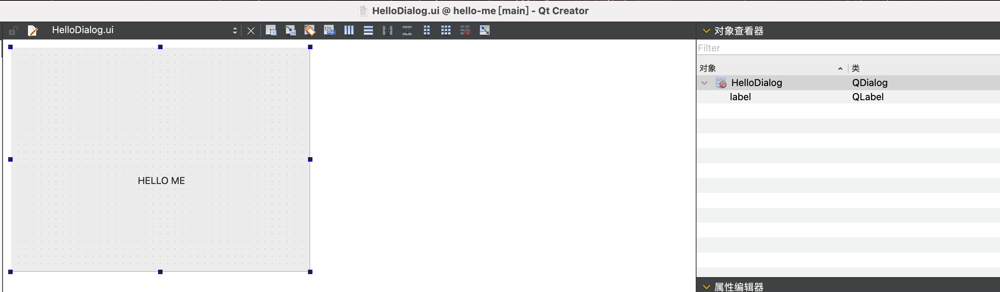
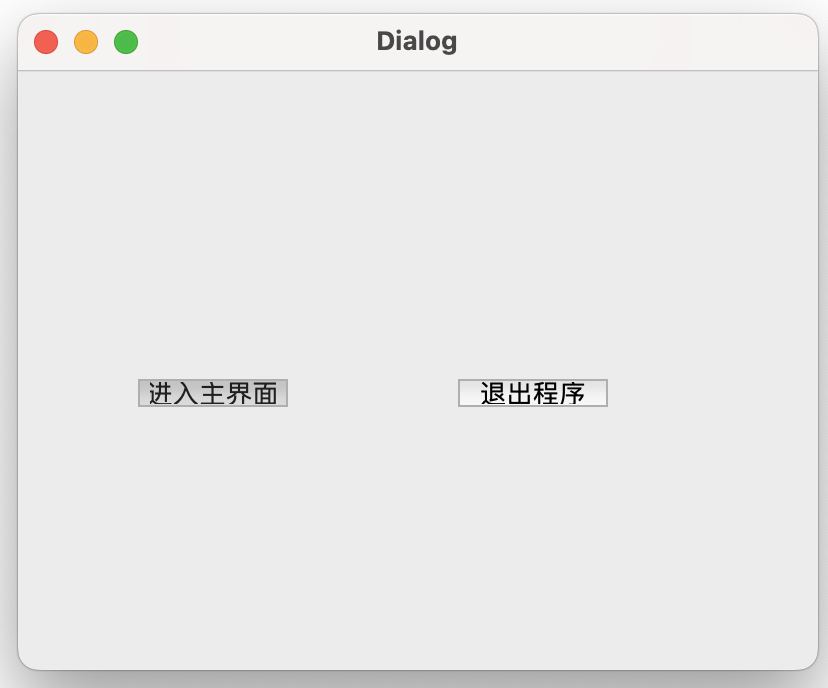
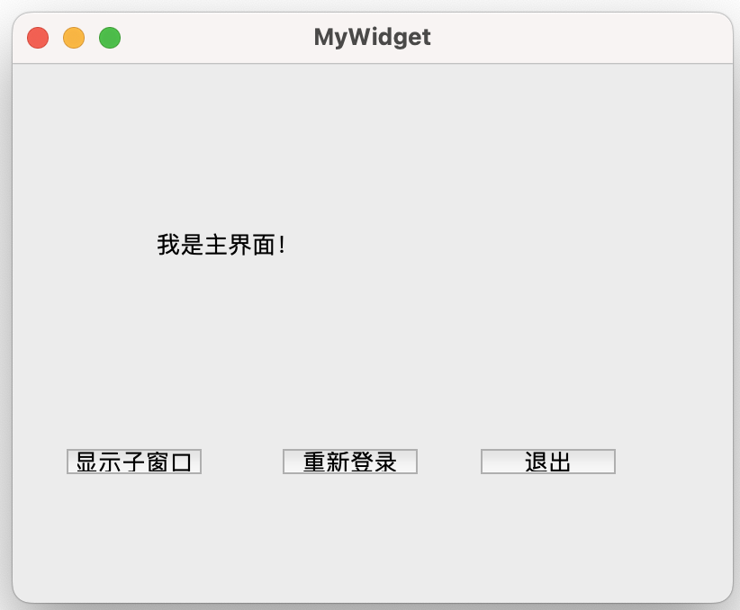
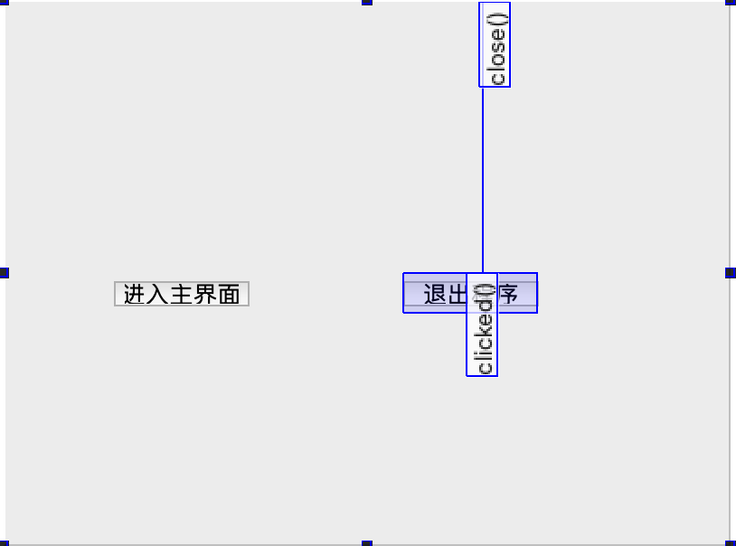
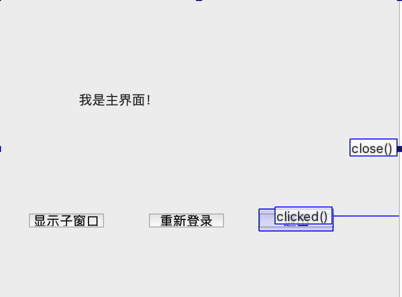

# QT笔记

## 一、前置入门

### 1.1 qmake

#### 1.1.1 基础

*qmake*使用储存在项目（.pro）文件中的信息来决定==Makefile文件中该生成什么==。

一个基本的项目文件包含关于应用程序的信息，比如，编译应用程序需要哪些文件，并且使用哪些配置设置。

```bash
SOURCES = hello.cpp
HEADERS = hello.h
CONFIG += qt warn_on release
```

- ==sources==

  这一行指定了实现应用程序的==源程序文件==,

  ```bash
  # 第一种 空格分隔
  SOURCES = hello.cpp main.cpp
  # 第二种
  SOURCES = hello.cpp \
  		main.cpp
  		# 第三种
  SOURCES += hello.cpp
  SOURCES += main.cpp
  ```

- header

  通常用来指定为这个应用程序创建的头文件,和头文件类似的配置

- config

  通常用来告诉*qmake*关于应用程序的配置信息

  ```bash
  CONFIG += qt warn_on release
  # CONFIG一行中的qt部分告诉qmake这个应用程序是使用Qt来连编的。这也就是说qmake在连接和为编译添加所需的包含路径的时候会考虑到Qt库的。
  
  # CONFIG一行中的warn_on部分告诉qmake要把编译器设置为输出警告信息的。
  
  # CONFIG一行中的release部分告诉qmake应用程序必须被连编为一个发布的应用程序。在开发过程中，程序员也可以使用debug来替换release，稍后会讨论这里的。
  
  # 项目文件就是纯文本（比如，可以使用像记事本、vim和xemacs这些编辑器）并且必须存为“.pro”扩展名。应用程序的执行文件的名称必须和项目文件的名称一样，但是扩展名是跟着平台而改变的。举例来说，一个叫做“hello.pro”的项目文件将会在Windows下生成“hello.exe”，而在Unix下生成“hello”。
  ```

==生成Makefile文件==

当你已经创建好你的项目文件，生成Makefile就很容易了，你所要做的就是先到你所生成的项目文件那里然后输入：

Makefile可以像这样由“.pro”文件生成：

```bash
    qmake -o Makefile hello.pro 
```

#### 1.1.2 详解

```bash
qmake [options] [files]
```

##### 1.1.2.1 常用选项

- **`-project`**

  - 从现有源文件==生成一个 .pro 文件==。例如：

    ```
    qmake -project
    ```

  - 这将在当前目录下生成一个新的 `.pro` 文件，包含当前目录中的所有源文件。

- **`-o file`**

  - ==指定输出文件==。例如：

    ```
    qmake -o Makefile myapp.pro
    ```

- **`-makefile`**

  - 生成 Makefile（这是默认行为）。可以显式指定：

    ```
    qmake -makefile
    ```

- **`-spec spec`**

  - 使用指定的编译器和平台配置。例如：

    ```
    qmake -spec linux-g++
    ```

  - `spec` 是平台规范，通常位于 Qt 安装目录的 `mkspecs` 子目录中。

- **`-config config`**

  - 使用指定的配置，例如 release或 debug：

    ```
    qmake -config release
    ```

##### 1.1.2.2 其他选项

- **`-v`**

  - 显示 qmake版本信息

    ```
    qmake -v
    ```

- **`-query`**

  - 查询 qmake配置变量的值。例如，查询 Qt 安装路径：

    ```
    qmake -query QT_INSTALL_PREFIX
    ```

- **`-set VARIABLE VALUE`**

  - 设置 qmake 配置变量的值。例如：

    ```
    qmake -set QMAKE_CC gcc
    ```

- **`-unset VARIABLE`**

  - 清除 qmake配置变量的值。例如：

    ```
    qmake -unset QMAKE_CC
    ```

- **`-r`**

  - 递归处理子目录，适用于包含多个子项目的顶层项目文件。例如：

    ```
    qmake -r
    ```

- **`-nopwd`**

  - 不添加当前工作目录到包含路径。

##### 1.1.2.3 使用示例

1. **生成项目文件**：

   ```
   qmake -project
   ```

2. **生成 Makefile**：

   ```
   qmake myapp.pro
   ```

3. **生成特定平台的 Makefile**：

   ```
   qmake -spec win32-g++
   ```

4. **使用自定义配置**：

   ```
   qmake -config debug
   ```

5. **生成并指定输出文件**：

   ```
   qmake -o MyMakefile myapp.pro
   ```

6. **查询 Qt 安装目录**：

   ```
   qmake -query QT_INSTALL_PREFIX
   ```

##### 1.1.2.4 常见变量

在 `.pro` 文件中，可以使用许多变量来控制构建过程。以下是一些常见的变量：

- **`TEMPLATE`**: 指定项目类型，如 `app`、`lib` 或 `subdirs`。

  ```
  TEMPLATE = app
  ```

- **`TARGET`**: 指定生成的目标文件名。

  ```
  TARGET = myapp
  ```

- **`SOURCES`**: 列出源文件。

  ```
  SOURCES += main.cpp other.cpp
  ```

- **`HEADERS`**: 列出头文件。

  ```
  HEADERS += main.h other.h
  ```

- **`FORMS`**: 列出 Qt 设计师表单文件（`.ui` 文件）。

  ```
  FORMS += mainwindow.ui
  ```

- **`RESOURCES`**: 列出 Qt 资源文件（`.qrc` 文件）。

  ```
  RESOURCES += resources.qrc
  ```

- **`QT`**: 指定使用的 Qt 模块，如 `core`、`gui`、`widgets`。

  ```
  QT += core gui widgets
  ```

- **`INCLUDEPATH`**: 添加头文件搜索路径。

  ```
  INCLUDEPATH += /usr/local/include
  ```

- **`LIBS`**: 添加库文件和库路径。

  ```
  LIBS += -L/usr/local/lib -lmylib
  ```

- **`CONFIG`**: 设置项目配置选项，如 `debug`、`release`、`console`。

  ```
  CONFIG += debug console
  ```

- **`DEFINES`**: 添加预处理器定义。

  ```
  DEFINES += MY_DEFINE
  ```

##### 1.1.2.5 高级配置

###### 1.1.2.5.1 使用条件语句

可以使用条件语句来控制配置：

```
win32 {
    SOURCES += win32_specific.cpp
} else: unix {
    SOURCES += unix_specific.cpp
}
```

###### 1.1.2.5.2 自定义命令

在 `.pro` 文件中添加自定义命令：

```
my_target.target = mytarget
my_target.commands = echo "Hello, World!"
QMAKE_EXTRA_TARGETS += my_target
```

#### 1.1.3 使用步骤

- 创建.pro文件，自己建或者`qmke -project`

  ```bash
  TEMPLATE = app
  TARGET = myapp
  SOURCES += main.cpp
  HEADERS += main.h
  QT += widgets
  ```

- 生成Makefile,在项目目录下运行 `qmake` 命令，使用 `.pro` 文件生成平台特定的 Makefile

  ```bash
  qmake myapp.pro
  # 如果希望指定输出文件名，可以使用 -o 选项：
  qmake -o Makefile myapp.pro
  ```

- 编译项目：使用生成的Makefile进行编译，对于大多数 Unix 系统，使用 `make` 命令：

  ```bash
  make
  ```

- 运行程序：编译成功后，可以在项目目录下找到生成的可执行文件。运行它：

  ```bash
  ./myapp
  # win
  myapp.exe
  
  ```

### 1.2 Makefile

需要了解两个概念，⼀个是==⽬标（target）==，另⼀个就是==依赖（dependency）==。⽬标就是指要⼲什么，或说运⾏ make 后⽣成什么，⽽依赖是告诉 make 如何去做以实现⽬标。在 Makefile 中，⽬标和依赖是通过规则（rule）来表达的。

#### 1.2.1 目标

```makefile
all:
	echo "Hello world"
```

```markdown
上面Makefile 中的 all 就是我们 的⽬标，⽬标放在‘：’的前⾯，其名字可以是由字⺟和下划线‘_’组成 。echo “Hello World”就是⽣成⽬标的命令，这些命令可以是任何你可以在你的环境中运⾏的命令以及 make 所定义的函数等等。all ⽬标的定义，其实是定义了如何⽣成 all ⽬标，这我们也称之为规则.
```

- makefile定义==多个目标==

```makefile
all:
	echo "Hello world"
test:
	echo "test game"
```

下面是运行的结果


由此可见，⼀个 Makefile 中可以定义多个⽬标。调⽤ make 命令时，我们得告诉它我们的⽬标是什么，即要它⼲什么。**当没有指明具体的⽬标是什么 时，那么 make 以 Makefile ⽂件中定义的第⼀个⽬标作为这次运⾏的⽬标**。这“第⼀个”⽬标也称之 为默认⽬标（和是不是all没有关系）。当 make 得到⽬标后，先找到定义⽬标的规则，然后运⾏规则中的命令来达到构建⽬标的⽬的。

在上面的指令中，多了很多的`echo "......"`的内容，这部分不是我们所期望的，如果要去掉，需要对上面的makefile进行一个改动，也就是==在命令前加上一个@，这个符号就是告诉make，在运行的时候这一行命令不显示出来==。

```makefile
all:
	@echo "Hello world"
test:
	@echo "test game"
```

紧接着对makefile进行如下的改动，==在all的后面加上test==

```makefile
all: test
	@echo "Hello world"
test:
	@echo "test game"
```

运行结果如下：


如上图所示，此时test也被构建了。

#### 1.2.2 依赖

如上面的makefile，all ⽬标后⾯的 test 是告诉 make，==all ⽬标依赖 test ⽬标，这⼀依赖⽬标在 Makefile 中⼜被称之为先决条件。==出现这种⽬标依赖关系时，make⼯具会按 从左到右的先后顺序先构建规则中所依赖的每⼀个⽬标。如果希望构建 all ⽬标，那么make 会在构建它之 前得先构建 test ⽬标，这就是为什么我们称之为先决条件的原因。

#### 1.2.3 规则

⼀个规则是由==⽬标（targets）、先决条件（prerequisites）以及命令（commands）==所组成的。

规则语法：

```makefile
targets : prerequisites
	command
...
```

如上， all 是⽬标，test 是 all ⽬标的依赖⽬标，⽽@echo “Hello World”则是⽤于⽣成 all ⽬标的命令。

#### 1.2.4 makefile原理

#### 1.2.5 变量

## 二、Hello World

### 2.1 无UI文件工程

pro文件

```bash
greaterThan(QT_MAJOR_VERSION, 4): QT += widgets

SOURCES += \
    main.cpp

FORMS +=

```

`main.cpp`

```cpp
#include <QApplication>
#include <QDialog>
#include <QLabel>


/**
 * @brief main
 * @param argc
 * @param argv
 * @return
 * 2-2 本工程演示以下几个要点
 * 1. 演示无ui文件下的工程
 * 2. 演示指定父窗口
 * 3. 演示一些其他设置
 */
int main(int argc, char *argv[])
{
    // 新建一个QApplication对象，用于管理应用程序资源，任何一个QT gui程序需要有
    // 一个QApplication对象 因为Qt程序可以接收命令行参数，所以它需要argc和argv两个参数
    // GUI 程序是 QApplication，非 GUI 程序是
//    QCoreApplication。QApplication 实际上是 QCoreApplication 的子类。）开始，后面才
//    是实际业务的代码。这个对象用于管理 Qt 程序的生命周期开启事件循环
    QApplication a(argc, argv);
    QDialog w;
    w.resize(400, 300);
    // 新建了一个QLabel对象，并将QDialog对象作为参数，表明了对话框是它的父窗口，也就是说这个标签放在对话框窗口中
    QLabel label(&w);
    label.move(120, 120);
    // 添加的QObject::tr()函数可以实现多语言支持，一般建议程序中所有要显示到界面上的字符串都使用tr()函数括起来
    label.setText(QObject::tr("Hello World! 你好Qt！！！"));
    // 默认可视部件对象都是不可见的，需要用show函数显示出来
    w.show();
    // 让QApplication对象进入事件循环，这样当Qt应用程序在运行时便可以接收产生的事件
    return a.exec();
}

```

### 2.2 有UI文件工程

####  2.2.1 详细版

- 添加.ui文件。向工程中继续添加文件。在模板中选择Qt中的==Qt Designer Form==

- 编辑UI文件，设置==属性、类==，并保存

  

- 使用Ctrl+Shift+B快捷键或者左下角的锤子图标来构建工程，即可在生成的目录中看到==由.ui文件生成对应的头文件==

- ==由于一般把UI文件改成了一个自定义的类==，所以一般建立一个对应的类与ui文件相关联（包括头文件与源文件）

  比如我们的ui文件绑定的是`HelloDialog`的类，我们便定义如下

  ```cpp
  // hellodialog.cpp
  #ifndef HELLODIALOG_H
  #define HELLODIALOG_H
  
  #include <QDialog>
  
  namespace Ui {
  class HelloDialog;
  }
  
  class HelloDialog : public QDialog
  {
      // 定义了Q_OBJECT宏，扩展了普通C++类的功能，比如下一章要讲的信号和槽功能。必须在类定义的最开始处来定义这个宏
      // 注意继承自Qt的内部文件，一定在类中加上Q_OBJECT的宏定义，Qt会使用MOC将改文件重新编译成moc_mainwindow.cpp文件，这个才是原始的C++类的文件。
      // 所以Qt内置的类文件都不是原生态的C++类，需要Qt编译器再处理，所以继承子Qt的类一定要添加该宏定义，否则编译一定不通过
  
      Q_OBJECT
  
  public:
      // 显式构造函数，参数是用来指定父窗口的，默认是没有父窗口的。
      explicit HelloDialog(QWidget *parent = 0);
      ~HelloDialog();
  
  private:
      Ui::HelloDialog *ui;
  };
  
  #endif // HELLODIALOG_H
  
  ```

  定义我们的构造函数和析构函数，使用==setupUi搭建界面与程序之间的桥梁==

  ```cpp
  
  #include "hellodialog.h"
  // 工程中的hellodialog.ui文件会被UIC编译生成ui_hellodialog.h
  #include "ui_hellodialog.h"
  
  
  // 继承的时候构造函数直接实例化对象成员函数列表
  HelloDialog::HelloDialog(QWidget *parent) :
      QDialog(parent),
      ui(new Ui::HelloDialog)
  {
      // HelloDialog自身已经有了一个对象
      // 为指定的widget设置一个ui界面
      // setupUi(this)是由.ui文件生成的类的构造函数，这个函数的作用是对界面进行初始化，
      // 它按照我们在Qt设计器里设计的样子把窗体画出来，把我们在Qt设计器里面定义的信号和槽建立起来。也可以说，setupUi 是我们画界面和写程序之间的桥梁
      ui->setupUi(this);
  }
  
  
  //HelloDialog::HelloDialog(QWidget *parent) :
  //    QDialog(parent)
  //{
  //    ui=new Ui::HelloDialog;
  //    ui->setupUi(this);
  //}
  
  HelloDialog::~HelloDialog()
  {
      delete ui;
  }
  
  ```

  - 最后是我们的main函数

    ```cpp
    #include "hellodialog.h"
    #include <QApplication>
    
    /**
     * 2-1 本工程演示以下几个要点
     * 1. Q_OBJECT 注意继承自Qt的内部文件，一定在类中加上Q_OBJECT的宏定义
     * 2. 复习命名空间的使用
     * 3. exec()的使用 让QApplication对象进入事件循环，这样当Qt应用程序在运行时便可以接收产生的事件
     * 4. 理解setupUi()函数
     * 5. explicit的用法
     *
     * @brief main
     * @param argc
     * @param argv
     * @return
     */
    int main(int argc, char *argv[])
    {
        // 新建一个QApplication对象，用于管理应用程序资源，任何一个QT gui程序需要有
        // 一个QApplication对象 因为Qt程序可以接收命令行参数，所以它需要argc和argv两个参数
        QApplication a(argc, argv);
        HelloDialog w;
        w.show();
    
        return a.exec();
    }
    
    ```

#### 2.2.2 简要版

其实就是在main函数中==new出一个ui绑定的对象==，并用==ui对象.setupUI(被绑定对象的引用)即可==

```cpp
#include "ui_hellodialog.h"

/**
 * @brief main
 * @param argc
 * @param argv
 * @return
 * 2-3 本工程演示以下几个要点
 * 1. 演示使用UI的情况下的工程
 * 2. 在使用UI的情况下会生成ui_xxx.h文件，使用ui中的内容只需要#include "ui_xxx.h"即可
 * 3. 可以去查看"ui_xxx.h"中的内容
 */
int main(int argc, char *argv[])
{
    QApplication a(argc, argv);
    QDialog w;
    // 是ui_xxx.h中的定义
    Ui::HelloDialog ui;
    ui.setupUi(&w);
    w.show();
    return a.exec();
}
```

## 三、窗口部件

### 3.1 QWidget

QWidget类是==所有用户界面对象的基类==，被称为==基础窗口部件==。QWidget继承自QObject类和QPaintDevice类，其中QObject类是所有支持Qt对象模型（Qt Object Model）的Qt对象的的基类，==QPaintDevice类是所有可以绘制的对象的基类==

```cpp
// 新建QWidget类对象，默认parent参数是0，所以它是个窗口
    QWidget *widget = new QWidget();
    // 设置窗口标题
    widget->setWindowTitle(QObject::tr("我是widget")); 
    // 新建QLabel对象，默认parent参数是0，所以它是个窗口
    QLabel *label = new QLabel();
    label->setWindowTitle(QObject::tr("我是label"));
    // 设置要显示的信息
    label->setText(QObject::tr("label:我是个窗口"));   
    // 改变部件大小，以便能显示出完整的内容
    label->resize(180, 20);  
    // label2指定了父窗口为widget，所以不是窗口
    QLabel *label2 = new QLabel(widget);
    label2->setText(QObject::tr("label2:我不是独立窗口，只是widget的子部件"));
    label2->resize(250, 20);
    // 在屏幕上显示出来
    label->show();       
    widget->show();

```

- label没有父窗口，label2有父窗口，窗口就是没有父部件的部件

- ==窗口类型==

  ```cpp
   new QWidget(QWidget * parent = 0, Qt::WindowFlags f = 0；);
  // 前面的parent就是指父窗口部件，默认值为0，表明没有父窗口；
  // f参数是Qt::WindowFlags类型的，它是一个枚举类型 比如
  QWidget *widget = new QWidget(0, Qt::Dialog);
  QWidget *widget = new QWidget(0, Qt::Dialog | Qt::FramelessWindowHint);
  QLabel *label = new QLabel(0, Qt::SplashScreen | Qt::WindowStaysOnTopHint);
  ```

- ==窗口几何布局==

  ```cpp
  #include <QApplication>
  #include <QWidget>
  #include <QDebug>
  
  
  /**
   * @brief main
   * @param argc
   * @param argv
   * @return
   * 3-2 演示窗口的几何布局
   */
  int main(int argc, char *argv[])
  {
      QApplication a(argc, argv);
  
      QWidget widget;
      widget.resize(400, 300);       // 设置窗口大小
      widget.move(200, 100);         // 设置窗口位置
      widget.show();
  
      int x = widget.x();
      qDebug("x: %d", x);            // 输出x的值
      int y = widget.y();
      qDebug("y: %d", y);
      QRect geometry = widget.geometry();
      QRect frame = widget.frameGeometry();
      // geometry()和frameGeometry()函数分别返回没有边框和包含边框的窗口框架矩形的值，
      // 其返回值是QRect类型的，就是一个矩形，它的形式是（位置坐标，大小信息），也就是（x，y，宽，高）。
      qDebug() << "geometry: " << geometry << "frame: " << frame;
  
      // 成为模态框  调用exec函数
      return a.exec();
  }
  
  ```

### 3.2 模态与非模态对话框

- `mywidget.h`

  ```cpp
  #ifndef MYWIDGET_H
  #define MYWIDGET_H
  
  #include <QWidget>
  
  namespace Ui {
  class MyWidget;
  }
  
  class MyWidget : public QWidget
  {
      Q_OBJECT
  
  public:
      explicit MyWidget(QWidget *parent = 0);
      ~MyWidget();
  
  private:
      Ui::MyWidget *ui;
  };
  
  #endif // MYWIDGET_H
  
  ```

- `mywidget.cpp`

  ```cpp
  #include "mywidget.h"
  #include "ui_mywidget.h"
  #include <QDialog>
  
  MyWidget::MyWidget(QWidget *parent) :
      QWidget(parent),
      ui(new Ui::MyWidget)
  {
        // 与界面关联
      ui->setupUi(this);
        // dialog与widget关联，指定父窗口
      QDialog *dialog = new QDialog(this);
        // 设置为模态框
      dialog->setModal(true);
      dialog->show();
  }
  
  MyWidget::~MyWidget()
  {
      delete ui;
  }
  
  ```

- `main.cpp`

  ```cpp
  #include "mywidget.h"
  #include <QApplication>
  
  /**
   * @brief main
   * @param argc
   * @param argv
   * @return
   * 3.3 演示模态对话框和非模态对话框
   */
  int main(int argc, char *argv[])
  {
      QApplication a(argc, argv);
      MyWidget w;
      w.show();
  
      // 要使一个对话框成为非模态对话框，我们就可以使用new操作来创建，然后使用show()函数来显示
      // 要想使一个对话框成为模态对话框，只需要调用它的exec()函数
  
      // 使用show()函数也可以建立模态对话框，只需在其前面使用setModal()函数即可。例如：
  
      /*QDialog *dialog = new QDialog(this);
      dialog->setModal(true);
      dialog->show();
  
          现在运行程序，可以看到生成的对话框是模态的。
          但是，它与用exec()函数时的效果是不一样的。
          这是因为调用完show()函数后会立即将控制权交给调用者，那么程序可以继续往下执行。
          而调用exec()函数却不是这样，它只有当对话框被关闭时才会返回。*/
  
      return a.exec();
  }
  
  ```

### 3.3 信号与槽

#### 3.3.1 直接关联

- 定义槽函数,`mywidget.h`

  ```cpp
  #ifndef MYWIDGET_H
  #define MYWIDGET_H
  
  #include <QWidget>
  
  namespace Ui {
  class MyWidget;
  }
  
  class MyWidget : public QWidget
  {
      Q_OBJECT
  
  public:
      explicit MyWidget(QWidget *parent = 0);
      ~MyWidget();
  
  private:
      Ui::MyWidget *ui;
  
      // 槽函数声明 槽一般使用slots关键字进行修饰（Qt 4中必须使用，Qt 5使用新connect语法时可以不用，为了与一般函数进行区别，建议使用），
      // 这里使用了public slots，表明这个槽可以在类外被调用
  public slots:
      void showChildDialog();
  
  };
  
  #endif // MYWIDGET_H
  
  ```

- 构造函数中connect

  ```cpp
  #include "mywidget.h"
  #include "ui_mywidget.h"
  #include <QDialog>
  
  MyWidget::MyWidget(QWidget *parent) :
      QWidget(parent),
      ui(new Ui::MyWidget)
  {
      ui->setupUi(this);
      // clicked()信号在QPushButton类中进行了定义，而connect()是QObject类中的函数，因为我们的类继承自QObject，所以可以直接使用它
      // connect()函数中的四个参数分别是：发送信号的对象、发送的信号、接收信号的对象和要执行的槽
        // ui下有一个showChildButton  发出了click信号 this对象接收  接收后执行槽函数showChildDialog
      connect(ui->showChildButton, &QPushButton::clicked,
              this, &MyWidget::showChildDialog);
  }
  
  MyWidget::~MyWidget()
  {
      delete ui;
  }
  
  /**
   * @brief MyWidget::showChildDialog
   * 槽函数的实现  创建并显示一个对话框
   */
  void MyWidget::showChildDialog()
  {
      QDialog *dialog = new QDialog(this);
      dialog->show();
  }
  
  ```

#### 3.3.2 在ui界面使用编辑信号与槽

- 就是选中->连接->配置连接即可

#### 3.3.3 在ui界面使用转到槽

- 选中转到槽，然后选择信号，会到槽函数中，然后在定义槽函数即可

#### 3.3.4 一个例子

- 首页



- 主页

  

- 首页布局：

  - 一个对话框，退出程序在信号与槽模式下，绑定了点击信号，并绑定close()
  - 进入主界面选了转到槽

  

  - 槽函数定义

    ```cpp
    /*************头文件**************/
    #ifndef MYDIALOG_H
    #define MYDIALOG_H
    
    #include <QDialog>
    
    namespace Ui {
    class MyDialog;
    }
    
    class MyDialog : public QDialog
    {
        Q_OBJECT
    
    public:
        explicit MyDialog(QWidget *parent = 0);
        ~MyDialog();
    
    private slots:
        void on_pushButton_clicked();
    
    private:
        Ui::MyDialog *ui;
    };
    
    #endif // MYDIALOG_H
    
    
    
    
    ```

    ```cpp
    /*****************源文件**************/
    #include "mydialog.h"
    #include "ui_mydialog.h"
    
    MyDialog::MyDialog(QWidget *parent) :
        QDialog(parent),
        ui(new Ui::MyDialog)
    {
        ui->setupUi(this);
    }
    
    MyDialog::~MyDialog()
    {
        delete ui;
    }
    
    void MyDialog::on_pushButton_clicked()
    {
        // accept()函数是QDialog类中的一个槽，对于一个使用exec()函数实现的模态对话框，执行了这个槽，就会隐藏这个模态对话框，并返回QDialog::Accepted值，我们就是要使用这个值来判断是哪个按钮被按下了
        accept();
    }
    ```

    ```cpp
    /**************main函数****************/
    #include "mywidget.h"
    #include <QApplication>
    #include "mydialog.h"
    
    int main(int argc, char *argv[])
    {
        QApplication a(argc, argv);
        MyWidget w;
        MyDialog dialog;                        // 新建MyDialog类对象
        if(dialog.exec()==QDialog::Accepted){   // 判断dialog执行结果
            w.show();              // 如果是按下了“进入主界面”按钮，则显示主界面
            return a.exec();                    // 程序正常运行
        }
        else return 0;                          // 否则，退出程序
    }
    
    ```

  - 主页面

    - 退出不说了

    - 显示子窗口和重新登录显示使用的是转到槽

      

    - 显示子窗口

      ```cpp
      /**
       * @brief MyWidget::on_showChildButton_clicked
       * 生成新对话框
       */
      void MyWidget::on_showChildButton_clicked()
      {
          QDialog *dialog = new QDialog(this);
          dialog->show();
      }
      ```

    - 重新登录

      ```cpp
      /**
       * @brief MyWidget::on_pushButton_clicked
       *
       */
      void MyWidget::on_pushButton_clicked()
      {
          // 先关闭主界面，其实它是隐藏起来了，并没有真正退出。然后新建MyDialog对象
          close();
          MyDialog dlg;
          // 如果按下了“进入主窗口”按钮，则再次显示主界面
          // 否则，因为现在已经没有显示的界面了，所以程序将退出
          if(dlg.exec() == QDialog::Accepted) show();
      }
      ```

### 3.4 各类对话框

```cpp
#include "mywidget.h"
#include "ui_mywidget.h"
#include <QDebug>
#include <QColorDialog>
#include <QFileDialog>
#include <QFontDialog>
#include <QInputDialog>
#include <QMessageBox>
#include <QProgressDialog>
#include <QErrorMessage>


MyWidget::MyWidget(QWidget *parent) :
    QWidget(parent),
    ui(new Ui::MyWidget)
{
    ui->setupUi(this);
    errordlg = new QErrorMessage(this);
}

MyWidget::~MyWidget()
{
    delete ui;
}

// 颜色对话框
void MyWidget::on_pushButton_clicked()
{
    //  QColor color = QColorDialog::getColor(Qt::red, this, tr("颜色对话框"),
    //                                          QColorDialog::ShowAlphaChannel);

    QColorDialog dialog(Qt::red, this);                // 创建对象
    dialog.setOption(QColorDialog::ShowAlphaChannel); // 显示alpha选项
    dialog.exec();                                    // 以模态方式运行对话框
    QColor color = dialog.currentColor();             // 获取当前颜色

    qDebug() << "color: " << color;
}

// 文件对话框
void MyWidget::on_pushButton_2_clicked()
{
    //    QString fileName = QFileDialog::getOpenFileName(this, tr("文件对话框"),
    //                             "D:", tr("图片文件(*png *jpg);;文本文件(*txt)"));

    //    qDebug() << "fileName:" << fileName;

    QStringList fileNames = QFileDialog::getOpenFileNames(this, tr("文件对话框"),
                                                          "D:", tr("图片文件(*png *jpg)"));
    qDebug()<< "fileNames:" << fileNames;
}

// 字体对话框
void MyWidget::on_pushButton_3_clicked()
{
    // ok用于标记是否按下了“OK”按钮
    bool ok;
    QFont font = QFontDialog::getFont(&ok, this);
    // 如果按下“OK”按钮，那么让“字体对话框”按钮使用新字体
    // 如果按下“Cancel”按钮，那么输出信息
    if (ok) ui->pushButton_3->setFont(font);
    else qDebug() << tr("没有选择字体！");
}

// 输入对话框
void MyWidget::on_pushButton_4_clicked()
{
    bool ok;
    // 获取字符串
    QString string = QInputDialog::getText(this, tr("输入字符串对话框"),
                                           tr("请输入用户名："), QLineEdit::Normal,tr("admin"), &ok);
    if(ok) qDebug() << "string:" << string;
    // 获取整数
    int value1 = QInputDialog::getInt(this, tr("输入整数对话框"),
                                      tr("请输入-1000到1000之间的数值"), 100, -1000, 1000, 10, &ok);
    if(ok) qDebug() << "value1:" << value1;
    // 获取浮点数
    double value2 = QInputDialog::getDouble(this, tr("输入浮点数对话框"),
                                            tr("请输入-1000到1000之间的数值"), 0.00, -1000, 1000, 2, &ok);
    if(ok) qDebug() << "value2:" << value2;
    QStringList items;
    items << tr("条目1") << tr("条目2");
    // 获取条目
    QString item = QInputDialog::getItem(this, tr("输入条目对话框"),
                                         tr("请选择或输入一个条目"), items, 0, true, &ok);
    if(ok) qDebug() << "item:" << item;
}

// 消息对话框
void MyWidget::on_pushButton_5_clicked()
{
    // 问题对话框
    int ret1 = QMessageBox::question(this, tr("问题对话框"),
                                     tr("你了解Qt吗？"), QMessageBox::Yes, QMessageBox::No);
    if(ret1 == QMessageBox::Yes) qDebug() << tr("问题！");
    // 提示对话框
    int ret2 = QMessageBox::information(this, tr("提示对话框"),
                                        tr("这是Qt书籍！"), QMessageBox::Ok);
    if(ret2 == QMessageBox::Ok) qDebug() << tr("提示！");
    // 警告对话框
    int ret3 = QMessageBox::warning(this, tr("警告对话框"),
                                    tr("不能提前结束！"), QMessageBox::Abort);
    if(ret3 == QMessageBox::Abort) qDebug() << tr("警告！");
    // 错误对话框
    int ret4 = QMessageBox::critical(this, tr("严重错误对话框"),
                                     tr("发现一个严重错误！现在要关闭所有文件！"), QMessageBox::YesAll);
    if(ret4 == QMessageBox::YesAll) qDebug() << tr("错误");
    // 关于对话框
    QMessageBox::about(this, tr("关于对话框"),
                       tr("yafeilinux致力于Qt及Qt Creator的普及工作！"));
}

// 进度对话框
void MyWidget::on_pushButton_6_clicked()
{
    QProgressDialog dialog(tr("文件复制进度"), tr("取消"), 0, 50000, this);
    dialog.setWindowTitle(tr("进度对话框"));     // 设置窗口标题
    dialog.setWindowModality(Qt::WindowModal);  // 将对话框设置为模态
    dialog.show();
    for(int i=0; i<50000; i++) {                // 演示复制进度
        dialog.setValue(i);                     // 设置进度条的当前值
        QCoreApplication::processEvents();      // 避免界面冻结
        if(dialog.wasCanceled()) break;         // 按下取消按钮则中断
    }
    dialog.setValue(50000);    // 这样才能显示100%，因为for循环中少加了一个数
    qDebug() << tr("复制结束！");
}

// 错误信息对话框
void MyWidget::on_pushButton_7_clicked()
{
    errordlg->setWindowTitle(tr("错误信息对话框"));
    errordlg->showMessage(tr("这里是出错信息！"));
}


QWizardPage * MyWidget::createPage1()  // 向导页面1
{
    QWizardPage *page = new QWizardPage;
    page->setTitle(tr("介绍"));
    return page;
}
QWizardPage * MyWidget::createPage2()  // 向导页面2
{
    QWizardPage *page = new QWizardPage;
    page->setTitle(tr("用户选择信息"));
    return page;
}
QWizardPage * MyWidget::createPage3()  // 向导页面3
{
    QWizardPage *page = new QWizardPage;
    page->setTitle(tr("结束"));
    return page;
}

// 向导对话框
void MyWidget::on_pushButton_8_clicked()
{
    QWizard wizard(this);
    wizard.setWindowTitle(tr("向导对话框"));
    wizard.addPage(createPage1());     // 添加向导页面
    wizard.addPage(createPage2());
    wizard.addPage(createPage3());
    wizard.exec();
}

```


