# 建立多表关系  
## 一、表与表之间关系回顾  
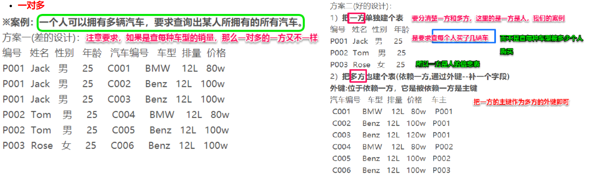  
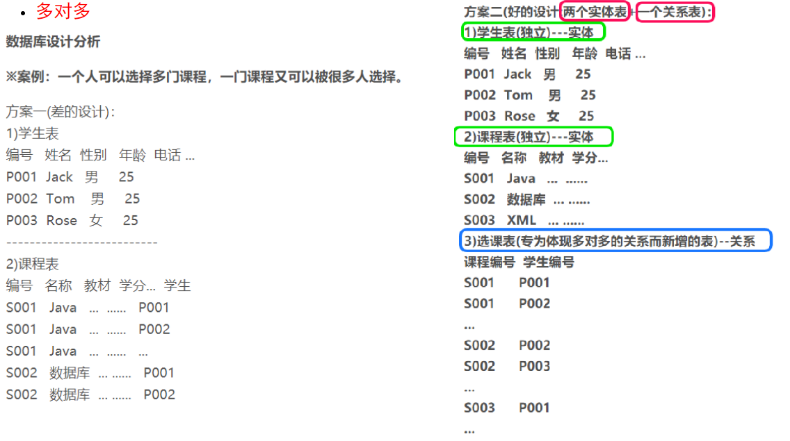  

## 二、一对多操作  
### 2.1 一对多关系配置  
#### 2.1.1 实体类中的体现  
"一"的一方  
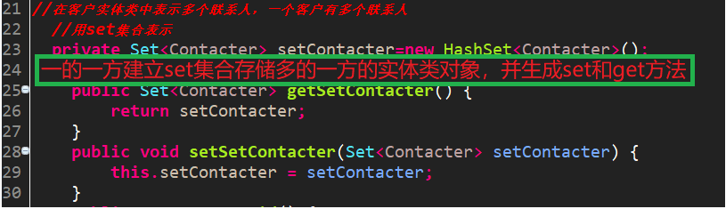  
"多"的一方  
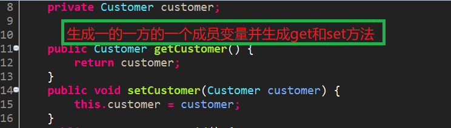  

#### 2.1.2 映射文件中的体现   
"一"的一方   

set标签；外键名称key标签；one-to-many;  
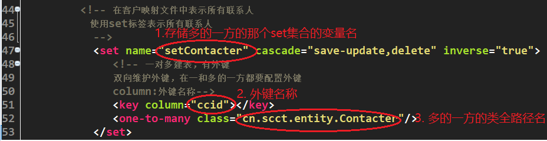  
"多"的一方  

  many-to-one;  
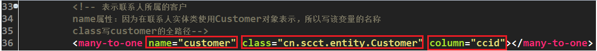  

#### 2.1.3 核心配置文件中的体现  
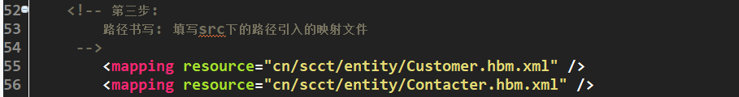  

**执行工具类就能生成以上两个表**  
### 2.2 一对多级联操作  
#### 2.2.1 一对多级联保存  
级联是有方向性的，所谓的方向性指的是，在保存一的一方级联多的一方和保存多的一方级联一的一方。  
##### 2.2.1.1 复杂朴素版  
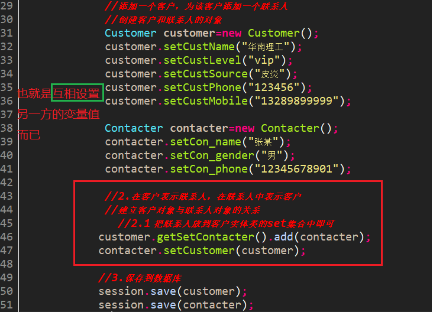  
##### 2.2.1.2 简化版  
一般在一的一方添加多的一方，只需要在一的一方的配置文件中的set标签中设置cascade属性为save-update  
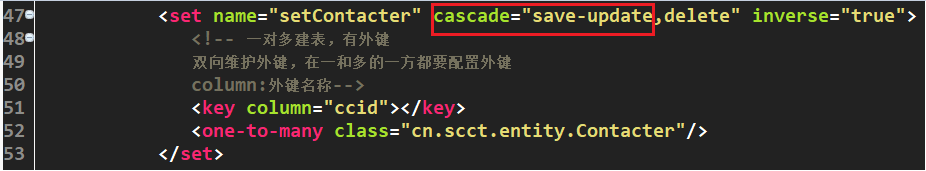  
然后代码就可以不要在多的一方设置一的一方的值了。  
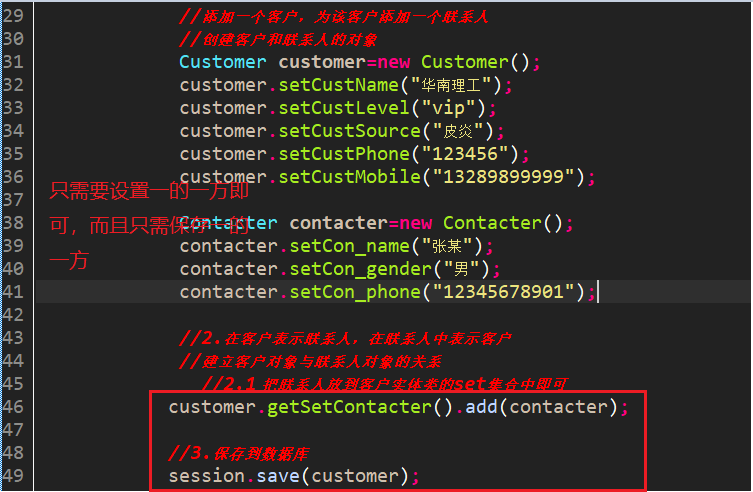  
**注意：如果也在多的一方设置cascade属性为save-update，那么保存多的一方也会保存一的一方，但是不常用**。  

#### 2.2.2 一对多级联删除  
原先的JDBC操作在删除一的一方时，必须在多的一方先删除以解除外键约束。  
但是在hibernate中没有这个必要。在一的一方配置set标签的cascade属性上加上delete属性值即可。完成的是**删除一必删除多。**  
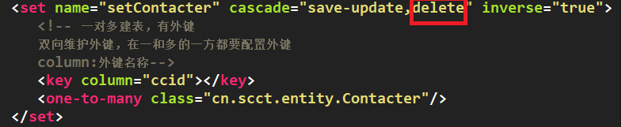  
删除的代码很简单，先查询获取再删除：  
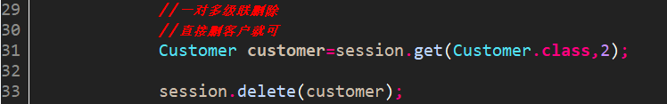  
也可以配置多的一方的`many-to-one`标签中设置`cascade属性`，加上`delete属性值`，这样，删除多的一方会删除一的一方，但是不常用。因为一的一方是主表。  

#### 2.2.3 一对多级联修改  
主表和从表默认双向都维护外键。  
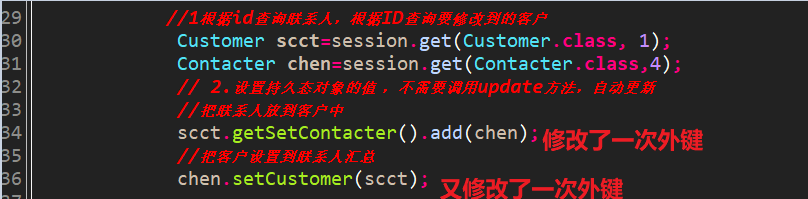  
我们一般让主表放弃外键维护，设置`inverse属性`为true。  
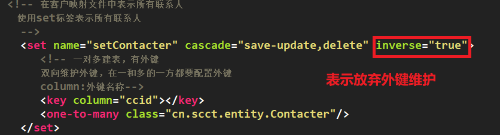  

## 三、多对多操作  
### 3.1 多对多建表  
#### 3.1.1 实体类创建  
按照一对多的多一方设置，即**每一方都要有一个set集合维护另一方的对象**  
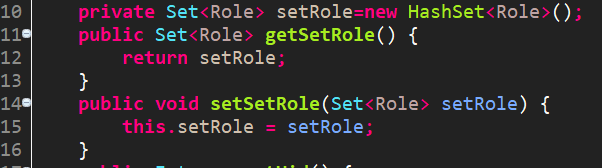   
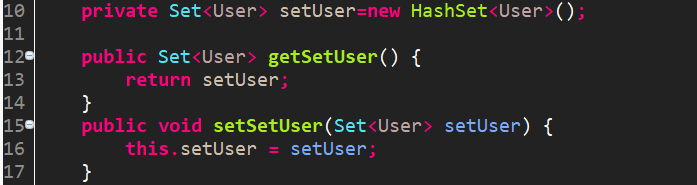

#### 3.1.2 配置文件设置  
##### 3.1.2.1 映射文件配置
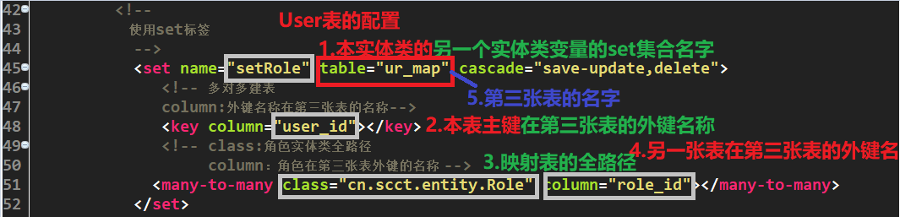  
另一张表同理  
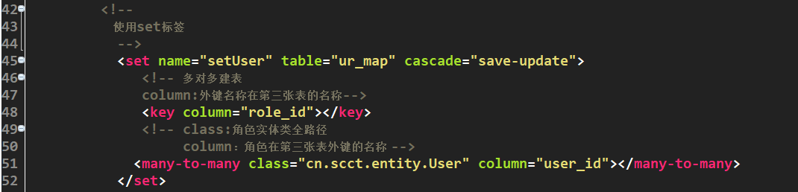  

##### 3.1.2.2 核心配置文件配置  
加上两个类的全路径名即可  
  

### 3.2 多对多级联操作  
#### 3.2.1 级联保存  
和一对多类似，配置一个表的save属性值为save-update，只需调用一个表的save操作即可。  
#### 3.2.2 级联删除  
同理，但基本不用啊，一般没有这种需求。  
#### 3.2.3 修改  
也就是`set集合的add和remove操作`罢了。不提。