# Hibernate查询与检索策略  
## 一、对象导航查询、OID查询与本地SQL查询  
### 1.1 对象导航图查询  
对象图导航查询方式<font color=red>根据已经加载的对象，导航到他的关联对象</font>。他是利用<font color=red>类与类之间的关系</font>来检索对象的。  
前面我们已经介绍过<font color=blue>一对多，多对多</font>的关系创建表原则。除了在实体类中创建相应的另一个实体类的对象（<font color=blue>在多的一方：单纯一个另外实体类的对象；在“一”的一方：另外一个实体类对象的集合，且需要生成各自的get和set方法</font>）之外，还要在各自的映射文件的`set`标签中中配置`one-to-many`(<font color=blue>在“一”的一方</font>)和`many-to-one`(<font color=blue>在“多”的一方</font>)。这样的话，我们只需<font color=blue>获取某一个实体类的对象，调用其对应于另一实体类的get方法</font>就能拿到。   
下图就是<font color=red>获得某一方的对象</font>(根据id查询)，再<font color=red>调用相应的get方法</font>获取另一方对象即可。  
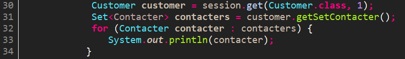  
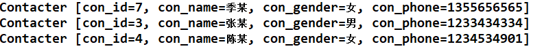  

### 1.2 OID(Object ID)查询  
OID查询指的是用Session的get()和load()方法加载某条记录对应的对象。就是上面的第一句代码。  
### 1.3 本地SQL查询  
可能有的应用程序可能需要根据底层数据库的SQL方言  
 ` SQLQuery sqlQuery=session.createSQLQuery("select   id，name，age，city from customer");`  
## 二、HQL(Hibernate Query Language)查询  
HQL(Hibernate Query Language)是而向对象的查询语言，它和SQL查询语言有些相似，但<font color=red>它使用的是类、对象和属性</font>的概念，而没有表和字段的概念。在Hibernate提供的各种检索方式中，HQL是官方推荐的查询语言，也是使用最广泛的一种检索方式。它通过<font color=red>操作Query对象</font>来操作hql语句。  
```java  
    Query query=session.createQuery("hql语句");
```
### 2.1 hql查询所有  
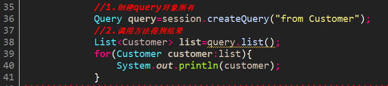  
### 2.2 hql条件查询  
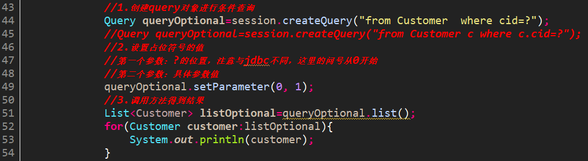   
### 2.3 hql模糊查询  
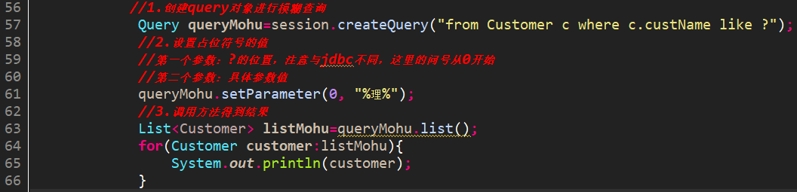  
### 2.4 hql排序查询  
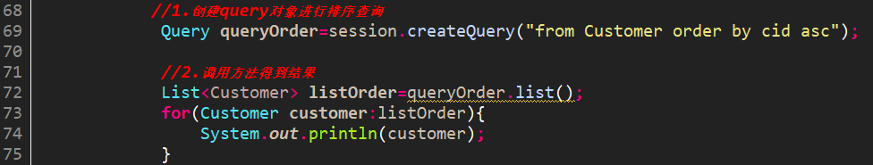  
### 2.5 hql分页查询  
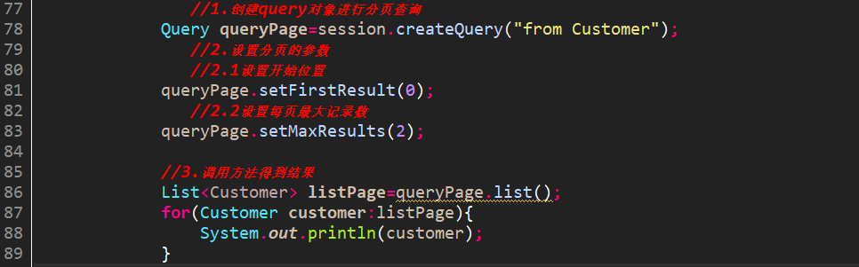  
### 2.6 hql投影查询(只要实体类的某几个属性而已)  
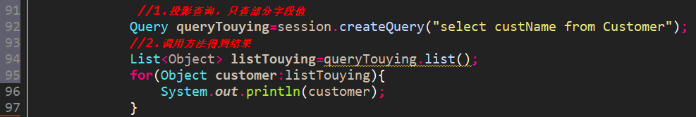  
### 2.7 hql聚合函数查询  
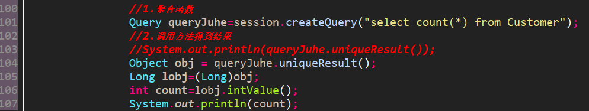  
## 三、QBC(Query By Criteria)查询  
不需要写sql语句或hql语句 
<font color=red>创建Criteria对象：</font> `Criteria criteria = session.createCriteria(实体类名.class);`  
<font color=red>创建条件对象：</font>`Criterion criterion=Restrictions.静态方法`  
<font color=red>添加查询条件：</font>`criteria.add(条件对象);`  
### 3.1 QBC查询所有  
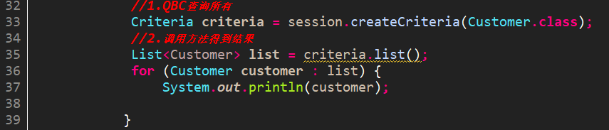  
### 3.2 QBC条件查询与模糊查询  
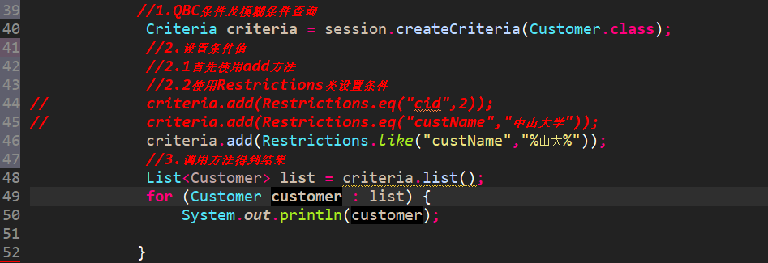  
### 3.3 QBC排序查询  
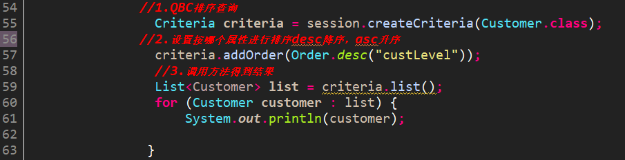  
### 3.4 QBC分页查询  
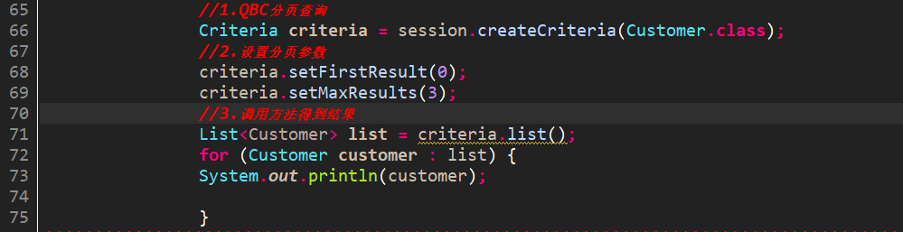  
### 3.5 QBC统计查询  
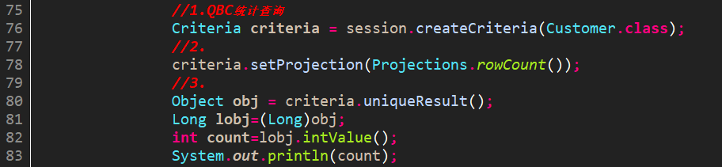  
### 3.6 QBC离线查询  
`DetachedCriteria`翻译为离线条件查询，因为它是可以脱离`Session`来使用的一种条件查询对象，我们都知道Criteria对象必须通过Session对象来创建。那么也就是说<font color=red>**必须先有Session才可以生成Criteria对象**</font>。而<font color=blue>**DetachedCriteria对象可以在其他层对条件进行封装。**</font>  
      这个对象也是比较有用的，尤其在SSH介绍以后这个对象经常会使用。它的主要优点是<font color=red>做一些特别复杂的条件查询</font>的时候，往往会**在WEB层向service层传递很多的参数，业务层又会将这些参数传递给DAO层，最后在DAO中拼接SQL完成查询**。<font color=blue>有了离线条件查询对象后，那么这些工作都可以不用关心了</font>，我们可以在WEB层将数据封装好，传递到业务层，再由业务层传递给DAO完成。  
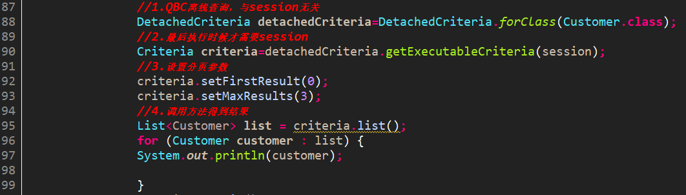  
## 四、HQL多表查询  
### 4.1 SQL多表查询回顾  
#### 4.1.1 内连接查询(求交集)  
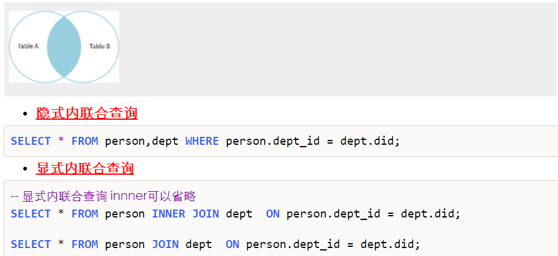  
#### 4.1.2 外连接查询(优先显示某个集合)  
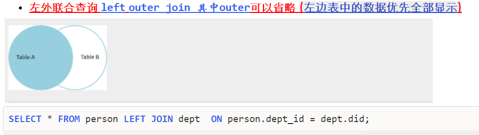  
  
### 4.2 HQL多表查询  
#### 4.2.1 内连接与迫切内连接  
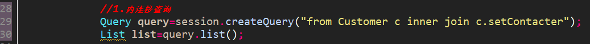  
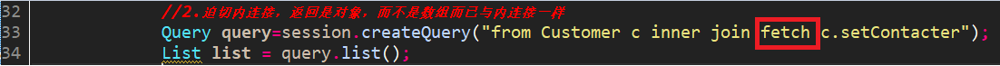  
#### 4.2.2 左外连接与迫切左外连接  
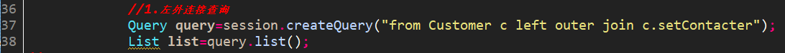  
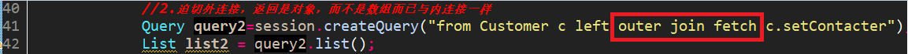  
#### 4.2.3 右外连接(注意没有迫切右外连接)  
略  
## 五、Hibernate检索策略  
### 5.1 立即查询(调用get方法)  
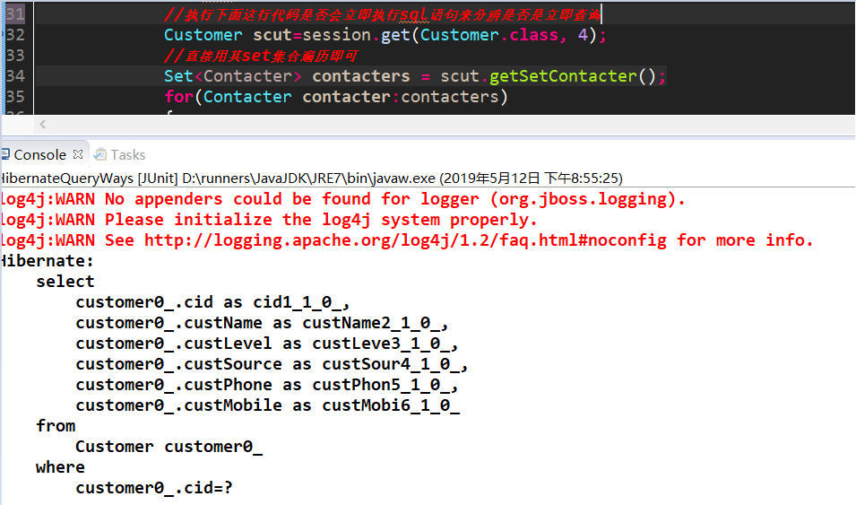  
### 5.2 延迟查询  
#### 5.2.1 类别级别延迟(调用load方法)  
根据id 查询返回实体对象，调用load方法不会立即发送语句  
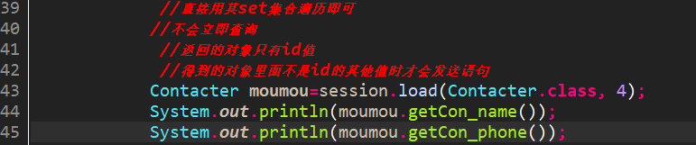  
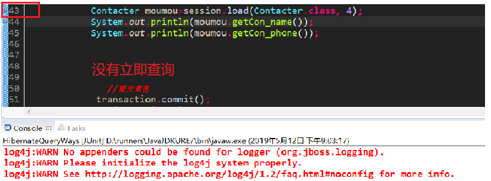  
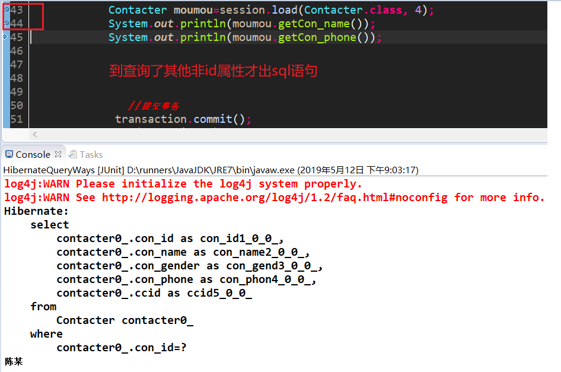  
#### 5.2.2 关联级别延迟  
查询<font color=red>某个主表对应的实体类对象，再查询对应从表的实体类对象的过程是否需要延迟</font>，称作关联级别延迟  
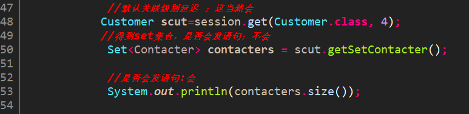  
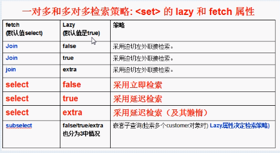  

## 六、Hibernate批量抓取  