# Redis的面试连环炮

## 面试题

- [Redis和Memcache有什么区别](##Redis和Memcache有什么区别)
- [Redis的线程模型是什么？](##Redis的线程模型是什么？)
- Redis的数据类型及应用场景？
- 为什么单线程的Redis比多线程的Memcache的效率要高？
- 为什么Redis是单线程但是还可以支撑高并发？
- Redis如何通过读写分离来承受百万的QPS
- Redis的持久化策略有哪些？AOF和RDB各有什么优缺点
- Redis的过期策略以及LRU算法
- 如何保证Redis的高并发和高可用？
- redis的主从复制原理能介绍一下么？
- redis的哨兵原理能介绍一下么？
- Redis主备切换的数据丢失问题：异步复制、集群脑裂
- Redis哨兵的底层原理

## 剖析

Redis最基本的一个内部原理和特点就是==NIO异步的单线程工作模型==。Memcache是早些年个大互联网公司常用的缓存方案，但是现在近几年都是使用的redis，没有什么公司使用Memcache了。

注意：==Redis中单个Value的大小最大为512MB，redis的key和string类型value限制均为512MB==

## Redis和Memcache的区别

从Redis作者给出的几个比较

- ==Redis拥有更多的数据结构==
  - Redis相比Memcache来说，拥有更多的数据结构和支持更丰富的数据操作，通常在Memcache里，你需要将数据拿到客户端来进行类似的修改，在set进去。这就大大增加了网络IO的次数和体积，在Redis中，这些复杂的操作通常和一般的set/get一样高效。所以，如果需要缓存能够支持更复杂的结构和操作，那么Redis是不错的选择
- ==Redis内存利用率对比==
  - 使用简单的key-value存储的话，Memcache的内存利用率更高，而Redis采用Hash结构来做key-value存储，由于其组合式的压缩，其内存利用率会高于Memcache
- ==性能对比==
  - 由于Redis只使用了单核，而Memcache可以使用多核，所以平均每核上Redis在存储小数据比Memcache性能更高，而在100K以上的数据中，Memcache性能更高，虽然Redis最近也在存储大数据的性能上进行优化，但是比起Memcache还有略有逊色。
- ==集群模式==
  - Memcache没有原生的集群模式，需要依赖客户端来实现往集群中分片写入数据，但是Redis目前是原生支持cluster模式的。


## Redis都有哪些数据类型，及使用场景

- String

  - 最基本的类型，就和普通的set 和 get，做简单的key - value 存储

- Hash

  - 这个是 类似于Map的一种结构，就是一半可以将结构化数据，比如对象（前提是这个对象没有嵌套其它对象）给缓存在redis中，每次读写redis缓存的时候，可以操作hash里面的某个字段

  ```
  key=150
  value={
    "id": 150,
    "name": "张三",
    "age": 20,  
  }
  ```

  - Hash类的数据结构，主要用来存放一些对象，把一些简单的对象给缓存起来，后续操作的时候，你可以直接仅仅修改这个对象中某个字段的值。

- List

  - 有序列表，可以通过list存储一些列表型的数据结构，类似粉丝列表，文章的评论列表之类的东西。
  - 可以通过lrange命令，从某个元素开始读取多少个元素，可以基于list实现分页查询，基于Redis实现简单的高性能分页，可以做类似微博那种下拉不断分页的东西，性能高，就是一页一页走。
  - 可以制作一个简单的消息队列，从list头插入，从list 的尾巴取出

- Set

  - 无序列表，自动去重
  - 直接基于Set将系统中需要去重的数据丢进去，如果你需要对一些数据进行快速的全局去重，就可以使用基于JVM内存里的HashSet进行去重，但是如果你的某个系统部署在多台机器上的话，只有使用Redis进行全局的Set去重
  - 可以基于set玩儿交集、并集、差集的操作，比如交集吧，可以把两个人的粉丝列表整一个交集，看看俩人的共同好友是谁？把两个大v的粉丝都放在两个set中，对两个set做交集

- Sort Set

  - 排序的set，去重但是可以排序，写进去的时候给一个分数，自动根据分数排序，这个可以玩儿很多的花样，最大的特点是有个分数可以自定义排序规则

  - 比如说你要是想根据时间对数据排序，那么可以写入进去的时候用某个时间作为分数，人家自动给你按照时间排序了

  - 排行榜：将每个用户以及其对应的什么分数写入进去，zadd board score username，接着zrevrange board 0 99，就可以获取排名前100的用户；zrank board username，可以看到用户在排行榜里的排名

```
zadd board 85 zhangsan
zadd board 72 wangwu
zadd board 96 lisi
zadd board 62 zhaoliu

96 lisi
85 zhangsan
72 wangwu
62 zhaoliu

zrevrange board 0 3

获取排名前3的用户

96 lisi
85 zhangsan
72 wangwu

zrank board zhaoliu

```


## Redis持久化对于生产环境的意义

故障发生时候会怎么样？

如何应对故障的发生？

### Redis持久化的意义

Redis持久化的意义，在于故障恢复，也属于高可用的一个环节。例如

当存放在内存中数据，会因为Redis的突然挂掉，而导致数据丢失

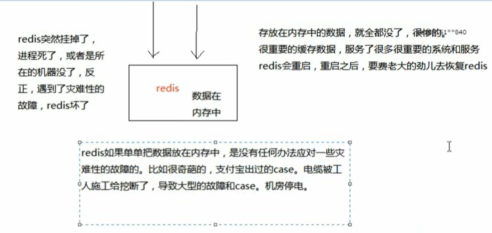

Redis的持久化，就是将内存中的数据，持久化到磁盘上中，然后将磁盘上的数据放到阿里云ODPS中


通过持久化将数据存储在磁盘中，然后定期比如说同步和备份到一些云存储服务上去。

### Redis中的RDB和AOF两种持久化机制

当出现Redis宕机时，我们需要做的是重启redis，尽快让他对外提供服务，缓存全部无法命中，在redis里根本找不到数据，这时候就会出现缓存雪崩的问题。所有的请求，没有在Redis中命中，就会去MySQL数据库这种数据源头中找，一下子MySQL无法承受高并发，那么系统将直接宕机。这个时候MySQL宕机，因为没办法从MySQL中将缓存恢复到Redis中，因为Redis中的数据是从MySQL中来的。

### RDB持久化机制

简单来说RDB：就是将Redis中的数据，每个一段时间，进行数据持久化

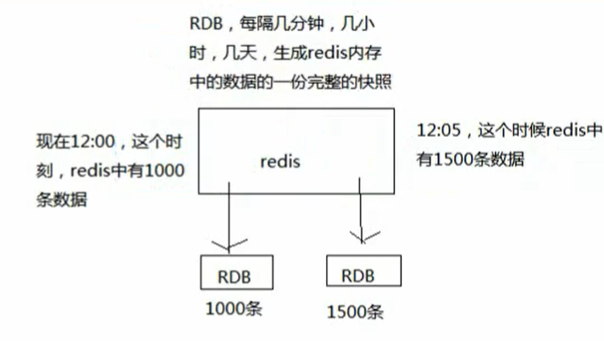

### AOF持久化机制

Redis将内存中的数据，存放到一个AOF文件中，但是因为Redis只会写一个AOF文件，因此这个AOF文件会越来越大。

AOF机制对每条写入命令作为日志，以append-only的模式写入一个日志文件中，在Redis重启的时候，可以通过回放AOF日志中的写入指令来重新构建整个数据集。

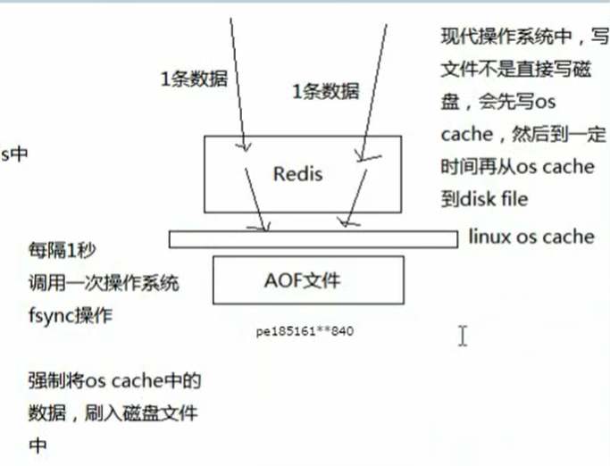

因为Redis中的数据是有一定限量的，不可能说Redis内存中的数据不限量增长，进而导致AOF无限量增长。

内存大小是一定的，到一定时候，Redis就会用缓存淘汰算法，LRU，自动将一部分数据从内存中给清除。

AOF，是存放每条写命令的，所以会不断的膨胀，当大到一定的时候，AOF做rewrite操作。

AOF rewrite操作，就会基于当时redis内存中的数据，来重新构造一个更小的AOF文件，然后将旧的膨胀的很大的文件给删了。

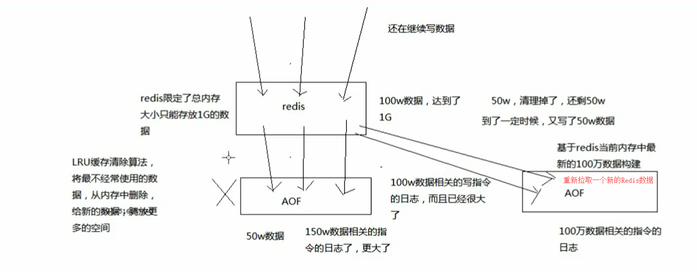

如果我们想要Redis仅仅作为纯内存的缓存来使用，那么可以禁止RDB和AOF所有的持久化机制

通过AOF和RDB，都可以将Redis内存中的数据给持久化到磁盘上面来，然后可以将这些数据备份到其它地方去，例如阿里云的OOS。

如果Redis挂了，服务器上的内存和磁盘上的数据都丢了，可以从云服务上拷贝回来之前的数据，放到指定的目录下，然后重新启动Redis，Redis就会自动根据持久化数据文件，去恢复内存中的数据，继续对外提供服务。

如果同时使用RDB和AOF两种持久化机制，那么在Redis重启的时候，会使用AOF来重新构建数据，因为AOF中的数据更加完整。

### RDB持久化机制的优点

- RDB会生成多个数据文件，每个数据文件都代表了某个时刻中Redis的数据，这种多个数据文件的方式，==非常适合做冷备份==，可以将这种完整的数据文件发送到一些远程的安全存储上去，例如阿里云ODPS分布式存储上，以预定好的备份策略来定期备份Redis中的数据
  - RDB也可以做冷备份，生成多个文件，每个文件代表了某个时刻的完整的数据快照
  - AOF也可以做冷备，只有一个文件，但是你可以每隔一段时间，去copy一份文件出来
  - RDB做冷备份的优势在于，可以由Redis去控制固定时长生成快照文件的事情，比较方便。AOF还需要自己写一些脚本去做这个事情，各种定时。
- RDB对Redis对外提供的读写服务，影响非常小，可以让Redis保持高性能，==因为Redis主进程只需要fork一个子进程，让子进程执行磁盘IO操作来进行RDB持久化即可==。
  - ==RDB每次写都是些Redis内存的，只是在一定的时间内，才将数据写入磁盘==
  - ==AOF每次都要写文件，虽然可以快速写入 OS Cache中，但是还是会有一定的时间开销，速度肯定比RDB略慢一点。==
- 相对于AOF持久化机制来说，直接基于RDB数据文件来重启和恢复Redis进程，更加快速。
  - RDB数据做冷备份，在最坏的情况下，提供数据恢复的时候，速度比AOF快。
  - AOF，存放的指令日志，做数据恢复的时候，其实是要回放和执行所有的指令日志，来恢复出来内存中的所有数据的，而RDB就是一份数据文件，恢复的时候，直接加载进内存即可。

综合上面可以知道：==RDB特别适合做冷备份==

### RDB持久化的缺点

- 如果想要在Redis故障时，尽可能的少丢失数据，那么RDB没有AOF好，一般来说，RDB数据快照文件，都是每隔5分钟，或者更长时间生成一次，这个时候就得接受一旦Redis经常宕机，那么丢失最近5分钟的数据。

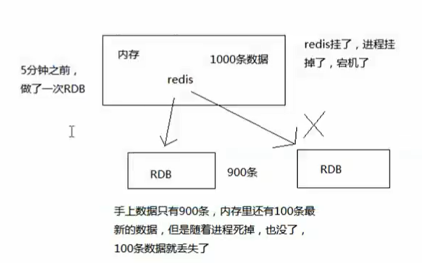

​		这个文件也是RDB最大的缺点，就是不适合做第一优先级的恢复方案，如果你依赖RDB做第一优先级方案，会导致数据丢失的比较多。


- RDB每次在fork子进程来执行RDB快照数据生成的时候，如果数据文件特别大，可能会导致对客户端提供的服务暂停数毫秒，或者甚至数秒
  - 一般不要让RDB的间隔太长，否则每次生成的RDB文件太长，会对Redis本身的性能会有影响


### AOF持久化的优点

- AOF可以更好的保护数据不丢失，一般AOF会间隔一秒，通过一个后台线程执行一次fsync操作，最多丢失1秒
- AOF日志文件==以append-only模式写入==，所有没有任何磁盘寻址开销，写入性能非常高，而且文件不容易破损，即使文件尾部破损，也很容易快速修复。
- AOF日志文件及时过大的时候，==出现后台的重写操作，也不会影响客户端的读写==，因为rewrite log 的时候，会对其中的数据进行压缩，创建出一份需要恢复数据的最小日志出来，再创建新日志文件的时候，老的日志文件还是照常写入，当新的merge后的日志文件ready的时候，再交换新老日志文件即可。
- ==AOF日志文件的命令通过非常可读的方式进行记录==，这个特性非常适合做灾难性的误删除的紧急恢复，比如某人不小心用了 flushall命令，清空了整个Redis数据，只要这个时候后台rewrite还没有发生，那么就可以立即拷贝AOF文件，将最后一条flushall命令删除了，然后再将该AOF文件放回去，就可以通过恢复机制，自动回复所有的数据。

### AOF持久化机制的缺点

- 对于同一份数据来说，==AOF日志通常比RDB数据快照文件更大==
- AOF开启后，支持写QPS会比RDB支持的写QPS低，因为AOF一般会配置成每秒fsync一次日志文件，因此这也就造成了性能不是很高。
  - 如果你要保证一条数据都不丢，也可以的，AOF的fsync设置成每次写入一条数据，fsync一次，这样Redis的QPS会大降。
- AOF这种较为复杂的==基于命令日志/merge/回放的方式==，比基于RDB每次持久化一份完整的数据快照的方式，更加脆弱一些，容易有BUG，不过AOF就是为了避免rewrite过程导致的BUG，因此每次rewrite并不是基于旧的指令来进行merge的，而是基于当时内存中数据进行指令的重新构建，这与健壮性会好一些。
- 唯一的缺点：==就是做数据恢复的时候，会比较慢，还有做冷备，定期的被封，不太方便，可能要自己手动写复杂的脚本去做==。


### RDB和AOF的选择

- 不要仅仅使用RDB，因为那样会导致你丢失很多的数据
- 也不要仅仅使用AOF，因为这样有两个问题
  - AOF做冷备，没有RDB冷备恢复快
  - RDB每次简单粗暴的生成数据快照，更加健壮，可以避免AOF这种复杂的被封和恢复机制的BUG
- 综合使用AOF和RDB两种持久化机制，用AOF来保证数据不丢失，作为数据恢复的第一选择，用RDB来做不同程度的冷备，在AOF文件都丢失或者损坏不可用的时候，可以使用RDB来进行快速的数据恢复。


## Redis的线程模型

### 文件事件处理器

Redis==基于reactor模式开发了网络事件处理器==，这个处理器叫做文件事件处理器，file event handler，这个文件事件处理器是单线程的，因此Redis才叫做单线程的模型，采用==IO多路复用机制同时监听多个socket==，根据socket上的事件来选择相应的事件处理器来处理这个事件。

文件事件处理器是单线程模式下运行的，但是通过==IO多路复用机制监听了多个socket==，可以实现高性能的网络通信模型，又可以跟内部的其它单线程的模块进行对接，保证了Redis内部的线程模型的简单性。

文件事件处理器的结构包含4个部分：==多个socket，IO多路复用程序，文件事件分派器，事件处理器等==。

多个socket可能并发的产生不同的操作，每个操作对应不同的文件事件，但是IO多路复用程序会监听多个socket，但是会把socket放入到一个队列中排队，每次从队列中取出一个socket给事件分派器，事件分派器把socket给对应的时间处理器。


每次我们一个socket请求过来 和 redis中的 server socket建立连接后，通过IO多路复用程序，就会往队列中插入一个socket，文件事件分派器就是将队列中的socket取出来，分派到对应的处理器，在处理器处理完成后，才会从队列中在取出一个。

这里也就是用一个线程，监听了客户端的所有请求，被称为Redis的单线程模型。


## 为什么Redis单线程模型效率这么高？

- 纯内存操作
- 核心是非阻塞的IO多路复用机制
- 单线程反而避免了多线程频繁上下文切换的问题


## Redis的过期策略

### Redis中的数据为什么会丢失

之前有同学问过我，说我们生产环境的redis怎么经常会丢掉一些数据？写进去了，过一会儿可能就没了。我的天，同学，你问这个问题就说明redis你就没用对啊。redis是缓存，你给当存储了是吧？

啥叫缓存？用内存当缓存。内存是无限的吗，内存是很宝贵而且是有限的，磁盘是廉价而且是大量的。可能一台机器就几十个G的内存，但是可以有几个T的硬盘空间。redis主要是基于内存来进行高性能、高并发的读写操作的。

那既然内存是有限的，比如redis就只能用10个G，你要是往里面写了20个G的数据，会咋办？当然会干掉10个G的数据，然后就保留10个G的数据了。那干掉哪些数据？保留哪些数据？当然是干掉不常用的数据，保留常用的数据了。所以说，这是缓存的一个最基本的概念，数据是会过期的，要么是你自己设置个过期时间，要么是redis自己给干掉。

```
set key value 过期时间（1小时）
set进去的key，1小时之后就没了，就失效了
```

### 数据明明都过期了，怎么还占用着内存啊？

还有一种就是如果你设置好了一个过期时间，你知道redis是怎么给你弄成过期的吗？什么时候删除掉？如果你不知道，之前有个学员就问了，为啥好多数据明明应该过期了，结果发现redis内存占用还是很高？那是因为你不知道redis是怎么删除那些过期key的。

redis 内存一共是10g，你现在往里面写了5g的数据，结果这些数据明明你都设置了过期时间，要求这些数据1小时之后都会过期，结果1小时之后，你回来一看，redis机器，怎么内存占用还是50%呢？5g数据过期了，我从redis里查，是查不到了，结果过期的数据还占用着redis的内存。

### 定期删除和惰性删除

我们Redis设置了过期时间，其实内部是 ==定期删除 + 惰性删除==两个再起作用的。

所谓定期删除，指的是redis默认是每隔100ms就随机抽取一些设置了过期时间的key，检查其是否过期，如果过期就删除。假设redis里放了10万个key，都设置了过期时间，你每隔几百毫秒，就检查10万个key，那redis基本上就死了，cpu负载会很高的，消耗在你的检查过期key上了。注意，这里可不是每隔100ms就遍历所有的设置过期时间的key，那样就是一场性能上的灾难。实际上redis是每隔100ms随机抽取一些key来检查和删除的。

但是问题是，定期删除可能会导致很多过期key到了时间并没有被删除掉，那咋整呢？所以就是惰性删除了。这就是说，在你获取某个key的时候，redis会检查一下 ，这个key如果设置了过期时间那么是否过期了？如果过期了此时就会删除，不会给你返回任何东西。

==并不是key到时间就被删除掉，而是你查询这个key的时候，redis再懒惰的检查一下==

通过上述两种手段结合起来，保证过期的key一定会被干掉。

很简单，就是说，==你的过期key，靠定期删除没有被删除掉，还停留在内存里，占用着你的内存呢，除非你的系统去查一下那个key，才会被redis给删除掉。==

但是实际上这还是有问题的，如果定期删除漏掉了很多过期key，然后你也没及时去查，也就没走惰性删除，此时会怎么样？如果大量过期key堆积在内存里，导致redis内存块耗尽了，咋整？

答案是：==走内存淘汰机制。==

### Redis内存淘汰机制

如果redis的内存占用过多的时候，此时会进行内存淘汰，有如下一些策略：

```
redis 10个key，现在已经满了，redis需要删除掉5个key

1个key，最近1分钟被查询了100次

1个key，最近10分钟被查询了50次

1个key，最近1个小时倍查询了1次
```

1）==noeviction==：当内存不足以容纳新写入数据时，新写入操作会报错，这个一般没人用吧，实在是太恶心了

2）==allkeys-lru==：当内存不足以容纳新写入数据时，在键空间中，==移除最近最少使用的key（这个是最常用的==

3）==allkeys-random==：当内存不足以容纳新写入数据时，在键空间中，随机移除某个key，这个一般没人用吧，为啥要随机，肯定是把最近最少使用的key给干掉啊

4）==volatile-lru==：当内存不足以容纳新写入数据时，==在设置了过期时间的键空间中==，移除最近最少使用的key（这个一般不太合适）

5）==volatile-random==：当内存不足以容纳新写入数据时，==在设置了过期时间的键空间中==，随机移除某个key

6）==volatile-ttl==：当内存不足以容纳新写入数据时，==在设置了过期时间的键空间中==，有更早过期时间的key优先移除

很简单，你写的数据太多，内存满了，或者触发了什么条件，redis lru，自动给你清理掉了一些最近很少使用的数据

## Redis中的LRU算法

Java版本的LRU

```java
public class LRUCache<K, V> extends LinkedHashMap<K, V> {
    
private final int CACHE_SIZE;

    // 这里就是传递进来最多能缓存多少数据
    public LRUCache(int cacheSize) {
        super((int) Math.ceil(cacheSize / 0.75) + 1, 0.75f, true); 
        // 这块就是设置一个hashmap的初始大小，同时最后一个true指的是让linkedhashmap按照访问顺序来进行排序，最近访问的放在头，最老访问的就在尾
        CACHE_SIZE = cacheSize;
    }

    @Override
    protected boolean removeEldestEntry(Map.Entry eldest) {
        return size() > CACHE_SIZE; // 这个意思就是说当map中的数据量大于指定的缓存个数的时候，就自动删除最老的数据
    }

```


## 如何保证Redis的高并发及高可用？

如何保证Redis的高并发和高可用？

redis的主从复制原理能介绍一下么？

redis的哨兵原理能介绍一下么？

### 剖析

就是如果你用redis缓存技术的话，肯定要考虑如何用redis来加多台机器，保证redis是高并发的，还有就是如何让Redis保证自己不是挂掉以后就直接死掉了，redis高可用

我这里会选用我之前讲解过这一块内容，redis高并发、高可用、缓存一致性

redis高并发：主从架构，一主多从，一般来说，很多项目其实就足够了，==单主用来写入数据，单机几万QPS，多从用来查询数据，多个从实例可以提供每秒10万的QPS。==

redis高并发的同时，还需要容纳大量的数据：一主多从，每个实例都容纳了完整的数据，比如redis主就10G的内存量，其实你就最对只能容纳10g的数据量。如果你的缓存要容纳的数据量很大，达到了几十g，甚至几百g，或者是几t，那你就需要redis集群，而且用redis集群之后，可以提供可能每秒几十万的读写并发。

redis高可用：==如果你做主从架构部署，其实就是加上哨兵就可以了==，就可以实现，任何一个实例宕机，自动会进行主备切换。

##  Redis如何通过读写分离来承受百万的QPS

### redis高并发跟整个系统的高并发之间的关系

redis，你要搞高并发的话，不可避免，要把底层的缓存搞得很好

mysql，高并发，做到了，那么也是通过一系列复杂的分库分表，订单系统，事务要求的，QPS到几万，比较高了

要做一些电商的商品详情页，真正的超高并发，QPS上十万，甚至是百万，一秒钟百万的请求量

光是redis是不够的，但是redis是整个大型的缓存架构中，支撑高并发的架构里面，非常重要的一个环节

首先，你的底层的缓存中间件，缓存系统，必须能够支撑的起我们说的那种高并发，其次，再经过良好的整体的缓存架构的设计（多级缓存架构、热点缓存），支撑真正的上十万，甚至上百万的高并发

### redis不能支撑高并发的瓶颈在哪里？

==因为单机的Redis，QPS只能在上万左右，成为了支撑高并发的瓶颈==。

### 如果redis要支撑超过10万+的并发，那应该怎么做？

单机的redis几乎不太可能说QPS超过10万+，除非一些特殊情况，比如你的机器性能特别好，配置特别高，物理机，维护做的特别好，而且你的整体的操作不是太复杂，单机在几万。

读写分离，一般来说，对缓存，一般都是用来支撑读高并发的，写的请求是比较少的，可能写请求也就一秒钟几千，一两千。大量的请求都是读，一秒钟二十万次读

==读写分离：主从架构 -> 读写分离 -> 支撑10万+读QPS的架构==


架构做成主从架构，一主多从，主服务器负责写，并且将数据同步到其它的slave节点，从节点负责读，所有的读请求全部走节点。

同时这样的架构，支持碎片扩容，就是说如果QPS在增加，也很简单，只需要增加  Redis Slave节点即可。

### Redis主从架构

==redis主从架构 -> 读写分离架构 -> 可支持水平扩展的读高并发架构==

#### 基本原理

- redis采用异步方式复制数据到slave节点，不过redis 2.8开始，slave node会周期性地确认自己每次复制的数据量
- 一个master node是可以配置多个slave node的
- slave node也可以连接其他的slave node
- slave node做复制的时候，是不会block master node的正常工作的
- slave node在做复制的时候，也不会block对自己的查询操作，它会用旧的数据集来提供服务; 但是复制完成的时候，需要删除旧数据集，加载新数据集，这个时候就会暂停对外服务了
- slave node主要用来进行横向扩容，做读写分离，扩容的slave node可以提高读的吞吐量

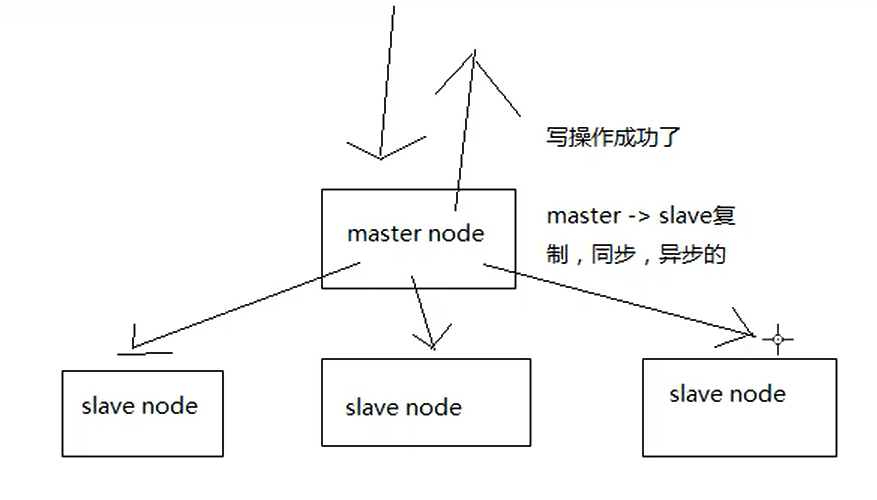

写操作存放在master node，同时在异步把master上的信息，同步到每个slave node上。

#### master持久化对于主从架构的安全保障的意义

如果采用了主从架构，那么建议必须开启master node的持久化！不建议用slave node作为master node的数据热备，因为那样的话，如果你关掉master的持久化，可能在master宕机重启的时候数据是空的，然后可能一经过复制，salve node数据也丢了

master -> RDB和AOF都关闭了 -> 全部在内存中

master宕机，重启，是没有本地数据可以恢复的，然后就会直接认为自己IDE数据是空的

master就会将空的数据集同步到slave上去，所有slave的数据全部清空

100%的数据丢失

master节点，必须要使用持久化机制

第二个，master的各种备份方案，要不要做，万一说本地的所有文件丢失了; 从备份中挑选一份rdb去恢复master; 这样才能确保master启动的时候，是有数据的

即使采用了后续讲解的高可用机制，slave node可以自动接管master node，但是也可能sentinal还没有检测到master failure，master node就自动重启了，还是可能导致上面的所有slave node数据清空故障


#### Redis主从复制原理

当==启动一个slave node==的时候，它会==发送一个PSYNC命令给master node==，如果这是slave node重新连接master node，那么master node仅仅会复制给slave部分缺少的数据; 否则如果是slave node第一次连接master node，那么会触发一次full resynchronization

开始full resynchronization的时候，master会启动一个后台线程，开始生成一份RDB快照文件，同时还会将从客户端收到的所有写命令缓存在内存中。RDB文件生成完毕之后，master会将这个RDB发送给slave，slave会先写入本地磁盘，然后再从本地磁盘加载到内存中。然后master会将内存中缓存的写命令发送给slave，slave也会同步这些数据。

slave node如果跟master node有网络故障，断开了连接，会自动重连。master如果发现有多个slave node都来重新连接，仅仅会启动一个rdb save操作，用一份数据服务所有slave node。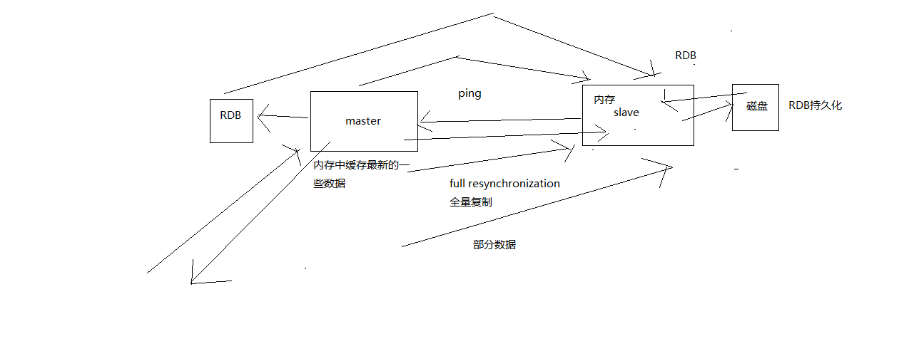

### 主从复制的断点续传

从redis 2.8开始，就支持主从复制的断点续传，如果主从复制过程中，网络连接断掉了，那么可以接着上次复制的地方，继续复制下去，而不是从头开始复制一份

master node会在内存中常见一个backlog，master和slave都会保存一个replica offset还有一个master id，offset就是保存在backlog中的。如果master和slave网络连接断掉了，slave会让master从上次的replica offset开始继续复制，但是如果没有找到对应的offset，那么就会执行一次resynchronization

### 无磁盘化复制

master在内存中直接创建rdb，然后发送给slave，不会在自己本地落地磁盘了

```
repl-diskless-sync
# 等待一定时长再开始复制，因为要等更多slave重新连接过来
repl-diskless-sync-delay
```


### Redis主从复制的完整复制流程

#### 主从复制流程图

- slave node启动，仅仅保存master node的信息，包括master node的host和ip，但是复制流程没开始master host和ip是从哪儿来的，redis.conf里面的slaveof配置的
- slave node内部有个定时任务，每秒检查是否有新的master node要连接和复制，如果发现，就跟master node建立socket网络连接
- slave node发送ping命令给master node
- 口令认证，如果master设置了requirepass，那么salve node必须发送masterauth的口令过去进行认证
- master node第一次执行全量复制，将所有数据发给slave node
- master node后续持续将写命令，异步复制给slave node


#### 数据同步相关核心机制

指的就是第一次slave连接msater的时候，执行的全量复制，那个过程里面你的一些细节的机制

- master和slave都会维护一个offset


master会在自身不断累加offset，slave也会在自身不断累加offset
slave每秒都会上报自己的offset给master，同时master也会保存每个slave的offset

这个倒不是说特定就用在全量复制的，主要是master和slave都要知道各自的数据的offset，才能知道互相之间的数据不一致的情况

- backlog


master node有一个backlog，默认是1MB大小
master node给slave node复制数据时，也会将数据在backlog中同步写一份
backlog主要是用来做全量复制中断候的增量复制的

- master run id


info server，可以看到master run id
如果根据host+ip定位master node，是不靠谱的，如果master node重启或者数据出现了变化，那么slave node应该根据不同的run id区分，run id不同就做全量复制
如果需要不更改run id重启redis，可以使用redis-cli debug reload命令

- psync


从节点使用psync从master node进行复制，psync runid offset master node会根据自身的情况返回响应信息，可能是FULLRESYNC runid offset触发全量复制，可能是CONTINUE触发增量复制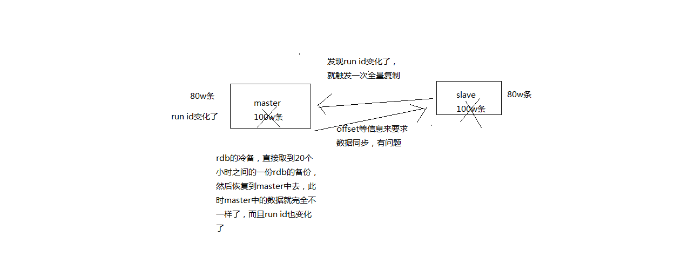

#### 全量复制

- master执行bgsave，在本地生成一份rdb快照文件
- master node将rdb快照文件发送给salve node，如果rdb复制时间超过60秒（repl-timeout），那么slave node就会认为复制失败，可以适当调节大这个参数
- 对于千兆网卡的机器，一般每秒传输100MB，6G文件，很可能超过60s
- master node在生成rdb时，会将所有新的写命令缓存在内存中，在salve node保存了rdb之后，再将新的写命令复制给salve node
- client-output-buffer-limit slave 256MB 64MB 60，如果在复制期间，内存缓冲区持续消耗超过64MB，或者一次性超过256MB，那么停止复制，复制失败
- slave node接收到rdb之后，清空自己的旧数据，然后重新加载rdb到自己的内存中，同时基于旧的数据版本对外提供服务

rdb生成、rdb通过网络拷贝、slave旧数据的清理、slave aof rewrite，很耗费时间

如果slave node开启了AOF，那么会立即执行BGREWRITEAOF，重写AOF

#### 增量复制

- 如果全量复制过程中，master-slave网络连接断掉，那么salve重新连接master时，会触发增量复制
- master直接从自己的backlog中获取部分丢失的数据，发送给slave node，默认backlog就是1MB
- msater就是根据slave发送的psync中的offset来从backlog中获取数据的

#### 异步复制

master每次接收到写命令之后，现在内部写入数据，然后异步发送给slave node

#### 心跳机制

master默认每隔10秒发送一次心跳，salve node每隔1秒发送一个心跳


### Redis主从架构如何才能做到99.99%的高可用性？

架构上，高可用性，99.99%的高可用性

99.99%，公式，系统可用的时间 / 系统故障的时间，365天，在365天 * 99.99%的时间内，你的系统都是可以哗哗对外提供服务的，那就是高可用性，99.99%

系统可用的时间 / 总的时间 = 高可用性，然后会对各种时间的概念，说一大堆解释

#### 系统可用性

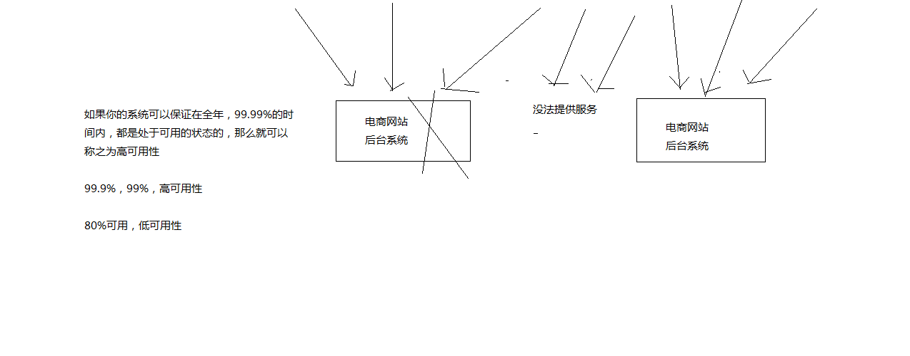

#### 系统处于不可用


#### Redis的不可用

一个slave宕机后，不会影响系统的可用性，还有其它slave在提供相同数据的情况下对外提供查询服务。

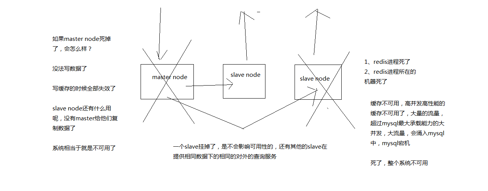

master宕机后，相当于系统不可用了。

#### Redis高可用的方案

当Redis的master节点宕机后，redis的高可用架构中，有一个故障转移，叫failover，也可以做主备切换。

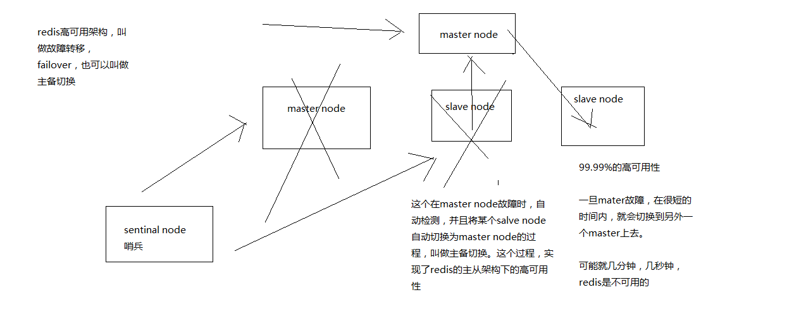

#### 总结

Redis实现高并发：一主多从，一般来说，很多项目其实就足够了，单主用来写数据，单机几万QPS，多从用来查询数据，多个从实例可以提供每秒10万QPS

Redis高并发的同时，还需要容纳大量的数据：一主多从，每个实例都容纳了完整的数据，比如Redis主就10G内存量，其实你就可以对只能容纳10G的数据量。如果你的缓存要容纳的数据量很大，达到了几十G，甚至几百G，那就需要使用到Redis集群，而且用Redis集群之后，提供可能每秒几十万的读写并发。

Redis高可用：如果用主从架构部署，在加上哨兵就可以实现任何一个实例宕机，就会自动进行主备切换。


## Redis哨兵架构

### 哨兵介绍

sentinal，中文名是哨兵

哨兵是redis集群架构中非常重要的一个组件，主要功能如下

- 集群监控，负责监控redis master和slave进程是否正常工作
- 消息通知，如果某个redis实例有故障，那么哨兵负责发送消息作为报警通知给管理员
- 故障转移，如果master node挂掉了，会自动转移到slave node上
- 配置中心，如果故障转移发生了，通知client客户端新的master地址

哨兵本身也是分布式的，作为一个哨兵集群去运行，互相协同工作

- 故障转移时，判断一个master node是宕机了，需要大部分的哨兵都同意才行，涉及到了分布式选举的问题
- 即使部分哨兵节点挂掉了，哨兵集群还是能正常工作的，因为如果一个作为高可用机制重要组成部分的故障转移系统本身是单点的，那就很坑爹了

目前采用的是sentinal 2版本，sentinal 2相对于sentinal 1来说，重写了很多代码，主要是让故障转移的机制和算法变得更加健壮和简单

### 哨兵的核心知识

- 哨兵至少需要3个实例，来保证自己的健壮性
- 哨兵 + redis主从的部署架构，是不会保证数据零丢失的，只能保证redis集群的高可用性
- 对于哨兵 + redis主从这种复杂的部署架构，尽量在测试环境和生产环境，都进行充足的测试和演练

### 为什么Redis的哨兵集群只有2个节点无法正常工作？

哨兵集群必须部署2个以上节点

如果哨兵集群仅仅部署了个2个哨兵实例，s1 和 s2，quorum=1

```
+----+         +----+
| M1 |---------| R1 |
| S1 |         | S2 |
+----+         +----+
```

Configuration: quorum = 1

master宕机，s1和s2中只要有1个哨兵认为master宕机就可以还行切换，同时s1和s2中会选举出一个哨兵来执行故障转移同时这个时候，需要majority，也就是大多数哨兵都是运行的，2个哨兵的majority就是2（2的majority=2，3的majority=2，5的majority=3，4的majority=2），2个哨兵都运行着，就可以允许执行故障转移但是如果整个M1和S1运行的机器宕机了，那么哨兵只有1个了，此时就没有majority来允许执行故障转移，虽然另外一台机器还有一个R1，但是故障转移不会执行

### 经典的3节点哨兵集群

```

       +----+
       | M1 |
       | S1 |
       +----+
          |
+----+    |    +----+
| R2 |----+----| R3 |
| S2 |         | S3 |
+----+         +----+
```

Configuration: quorum = 2，majority

如果M1所在机器宕机了，那么三个哨兵还剩下2个，S2和S3可以一致认为master宕机，然后选举出一个来执行故障转移，同时3个哨兵的majority是2，所以还剩下的2个哨兵运行着，就可以允许执行故障转移


### Redis主备切换的数据丢失问题：异步复制、集群脑裂

主备切换的过程，可能会导致数据丢失

#### 异步复制导致的数据丢失

因为master -> slave的复制是异步的，所以可能有部分数据还没复制到slave，master就宕机了，此时这些部分数据就丢失了。


#### 脑裂导致的数据丢失

脑裂，也就是说，某个master所在机器突然脱离了正常的网络，跟其他slave机器不能连接，但是实际上master还运行着，此时哨兵可能就会认为master宕机了，然后开启选举，将其他slave切换成了master

这个时候，集群里就会有两个master，也就是所谓的脑裂。此时虽然某个slave被切换成了master，但是可能client还没来得及切换到新的master，还继续写向旧master的数据可能也丢失了

因此旧master再次恢复的时候，会被作为一个slave挂到新的master上去，自己的数据会清空，重新从新的master复制数据


同时原来的master节点上的，client像 旧的 master中写入数据，当网络分区恢复正常后，client写的数据就会因为复制，导致数据的丢失。

#### 解决异步复制和脑裂导致数据丢失

```
min-slaves-to-write 1
min-slaves-max-lag 10
```

要求至少有1个slave，数据复制和同步的延迟不能超过10秒

如果说一旦所有的slave，数据复制和同步的延迟都超过了10秒钟，那么这个时候，master就不会再接收任何请求了，上面两个配置可以减少异步复制和脑裂导致的数据丢失

- 减少异步复制的数据丢失


有了min-slaves-max-lag这个配置，就可以确保说，一旦slave复制数据和ack延时太长，就认为可能master宕机后损失的数据太多了，那么就拒绝写请求，这样可以把master宕机时由于部分数据未同步到slave导致的数据丢失降低的可控范围内


- 减少脑裂的数据丢失


如果一个master出现了脑裂，跟其他slave丢了连接，那么上面两个配置可以确保说，如果不能继续给指定数量的slave发送数据，而且slave超过10秒没有给自己ack消息，那么就直接拒绝客户端的写请求，这样脑裂后的旧master就不会接受client的新数据，也就避免了数据丢失，上面的配置就确保了，如果跟任何一个slave丢了连接，在10秒后发现没有slave给自己ack，那么就拒绝新的写请求，因此在脑裂场景下，最多就丢失10秒的数据

### Redis哨兵的底层原理

#### sdown和odown转换机制

sdown和odown两种失败状态

sdown是主观宕机，就一个哨兵如果自己觉得一个master宕机了，那么就是主观宕机

odown是客观宕机，如果quorum数量的哨兵都觉得一个master宕机了，那么就是客观宕机

sdown达成的条件很简单，如果一个哨兵ping一个master，超过了is-master-down-after-milliseconds指定的毫秒数之后，就主观认为master宕机

sdown到odown转换的条件很简单，如果一个哨兵在指定时间内，收到了quorum指定数量的其他哨兵也认为那个master是sdown了，那么就认为是odown了，客观认为master宕机

#### 哨兵集群的自动发现机制

哨兵互相之间的发现，是通过redis的pub/sub系统实现的，每个哨兵都会往__sentinel__:hello这个channel里发送一个消息，这时候所有其他哨兵都可以消费到这个消息，并感知到其他的哨兵的存在

每隔两秒钟，每个哨兵都会往自己监控的某个master+slaves对应的__sentinel__:hello channel里发送一个消息，内容是自己的host、ip和runid还有对这个master的监控配置

每个哨兵也会去监听自己监控的每个master+slaves对应的__sentinel__:hello channel，然后去感知到同样在监听这个master+slaves的其他哨兵的存在

每个哨兵还会跟其他哨兵交换对master的监控配置，互相进行监控配置的同步

#### slave配置的自动纠正

哨兵会负责自动纠正slave的一些配置，比如slave如果要成为潜在的master候选人，哨兵会确保slave在复制现有master的数据; 如果slave连接到了一个错误的master上，比如故障转移之后，那么哨兵会确保它们连接到正确的master上

#### slave->master选举算法

如果一个master被认为odown了，而且majority哨兵都允许了主备切换，那么某个哨兵就会执行主备切换操作，此时首先要选举一个slave来，会考虑slave的一些信息

- 跟master断开连接的时长
- slave优先级
- 复制offset
- run id

如果一个slave跟master断开连接已经超过了down-after-milliseconds的10倍，外加master宕机的时长，那么slave就被认为不适合选举为master

```
(down-after-milliseconds * 10) + milliseconds_since_master_is_in_SDOWN_state
```

接下来会对slave进行排序

- 按照slave优先级进行排序，slave priority越低，优先级就越高
- 如果slave priority相同，那么看replica offset，哪个slave复制了越多的数据，offset越靠后，优先级就越高
- 如果上面两个条件都相同，那么选择一个run id比较小的那个slave

#### quorum和majority

每次一个哨兵要做主备切换，首先需要quorum数量的哨兵认为odown，然后选举出一个哨兵来做切换，这个哨兵还得得到majority哨兵的授权，才能正式执行切换

如果quorum < majority，比如5个哨兵，majority就是3，quorum设置为2，那么就3个哨兵授权就可以执行切换

但是如果quorum >= majority，那么必须quorum数量的哨兵都授权，比如5个哨兵，quorum是5，那么必须5个哨兵都同意授权，才能执行切换

#### configuration epoch

哨兵会对一套redis master+slave进行监控，有相应的监控的配置

执行切换的那个哨兵，会从要切换到的新master（salve->master）那里得到一个configuration epoch，这就是一个version号，每次切换的version号都必须是唯一的

如果第一个选举出的哨兵切换失败了，那么其他哨兵，会等待failover-timeout时间，然后接替继续执行切换，此时会重新获取一个新的configuration epoch，作为新的version号

#### configuraiton传播

哨兵完成切换之后，会在自己本地更新生成最新的master配置，然后同步给其他的哨兵，就是通过之前说的pub/sub消息机制，这里之前的version号就很重要了，因为各种消息都是通过一个channel去发布和监听的，所以一个哨兵完成一次新的切换之后，新的master配置是跟着新的version号的，其他的哨兵都是根据版本号的大小来更新自己的master配置的
