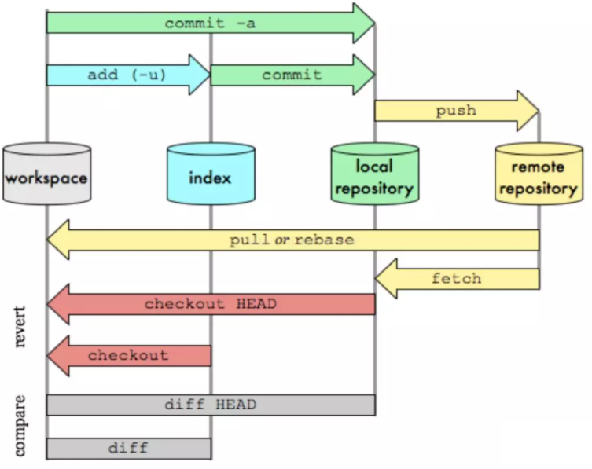

一、版本控制

> ==版本迭代==

- 实现跨区域多人协同开发
- 追踪和记载一个或者多个文件的历史记录
- 组织和保护你的源代码和文档
- 统计工作量
- 并行开发、提高开发效率
- 跟踪记录整个软件的开发过程
- 减轻开发人员的负担，节省时间，同时降低人为错误

简单说就是用于管理多人协同开发项目的技术。

没有进行版本控制或者版本控制本身缺乏正确的流程管理，在软件开发过程中将会引入很多问题，如软件代码的一致性、软件内容的冗余、软件过程的事物性、软件开发过程中的并发性、软件源代码的安全性，以及软件的整合等问题。

无论是工作还是学习，或者是自己做笔记，都经历过这样一个阶段！我们就迫切需要一个版本控制工具！

> ==常见的版本控制工具==

我们学习的东西，一定是当下最流行的！

主流的版本控制器有如下这些：

- **Git**
- **SVN**（Subversion）
- **CVS**（Concurrent Versions System）
- **VSS**（Micorosoft Visual SourceSafe）
- **TFS**（Team Foundation Server）
- Visual Studio Online

> ==版本控制分类==

**1、本地版本控制**

记录文件每次的更新，可以对每个版本做一个快照，或是记录补丁文件，适合个人用，如RCS。


**2、集中版本控制  SVN**

所有的版本数据都保存在服务器上，协同开发者从服务器上同步更新或上传自己的修改


==所有的版本数据都存在服务器上==，用户的本地只有自己以前所同步的版本，==如果不连网的话，用户就看不到历史版本，也无法切换版本验证问题，或在不同分支工作==。而且，所有数据都==保存在单一的服务器上==，有很大的风险这个服务器会损坏，这样就会丢失所有的数据，当然可以定期备份。==代表产品：SVN、CVS、VSS==

**3、分布式版本控制 Git**

每个人都拥有全部的代码！安全隐患！

==所有版本信息仓库全部同步到本地的每个用户==，这样就可以在本地查看所有版本历史，可以==离线在本地提交==，只需==在连网时push到相应的服务器或其他用户那里==。由于每个用户那里保存的都是所有的版本数据，只要有一个用户的设备没有问题就可以恢复所有的数据，但这增加了本地存储空间的占用。

不会因为服务器损坏或者网络问题，造成不能工作的情况！


==Git与SVN的主要区别==

SVN是==集中式版本控制系统，版本库是集中放在中央服务器的==，而工作的时候，用的都是自己的电脑，所以首先要从中央服务器得到最新的版本，然后工作，完成工作后，需要把自己做完的活推送到中央服务器。==集中式版本控制系统是必须联网才能工作，对网络带宽要求较高。==

Git是==分布式版本控制系统，没有中央服务器，每个人的电脑就是一个完整的版本库==，工作的时候不需要联网了，因为版本都在自己电脑上。协同的方法是这样的：比如说自己在电脑上改了文件A，其他人也在电脑上改了文件A，这时，你们两之间只需把各自的修改推送给对方，就可以互相看到对方的修改了。Git可以直接看到更新了哪些代码和文件！

**Git是目前世界上最先进的分布式版本控制系统。**

## 二、聊聊Git历史

同生活中的许多伟大事物一样，Git 诞生于一个极富纷争大举创新的年代。

Linux 内核开源项目有着为数众广的参与者。绝大多数的 Linux 内核维护工作都花在了提交补丁和保存归档的繁琐事务上(1991－2002年间)。到 2002 年，整个项目组开始启用一个专有的分布式版本控制系统 BitKeeper 来管理和维护代码。

Linux社区中存在很多的大佬！破解研究 BitKeeper ！

到了 2005 年，==开发 BitKeeper 的商业公司同 Linux 内核开源社区的合作关系结束==，他们收回了 ==Linux 内核社区免费使用 BitKeeper 的权力==。这就迫使 Linux 开源社区(特别是 Linux 的缔造者 Linus Torvalds)基于使用 BitKeeper 时的经验教训，开发出自己的版本系统。（2周左右！） 也就是后来的 Git！

**Git是目前世界上最先进的分布式版本控制系统。**

Git是免费、开源的，最初Git是为辅助 Linux 内核开发的，来替代 BitKeeper！

## 三、Git环境配置

官网下载太慢，我们可以使用淘宝镜像下载：http://npm.taobao.org/mirrors/git-for-windows/

> 启动Git

安装成功后在开始菜单中会有Git项，菜单下有3个程序：任意文件夹下右键也可以看到对应的程序！


**Git Bash：**Unix与Linux风格的命令行，使用最多，推荐最多

**Git CMD：**Windows风格的命令行

**Git GUI**：图形界面的Git，不建议初学者使用，尽量先熟悉常用命令

> ==Git配置==

### 3.1 仓库配置

> 表示当前仓库的配置信息
>
> 在当前==仓库的./git隐藏目录下==的config文件夹下


```bash
git config --local -l|--list
```


### 3.2 全局配置

>如下图，在.gitconfig文件中


```bash
git config --global -l|--list
```


### 3.3 系统配置

> 如图所示，在安装目录的etc文件夹下，为gitconfig文件


```bash
git config --system -l|--list
```


对于git来说，配置文件的权重是==仓库>全局>系统==

```bash
# 查看所有配置信息
git config -l
```

### 3.4 其它配置相关的命令

```bash
#编辑  其实就是-e
git config [-local|-global|-system] -e
# 使用git config命令增加一个配置项 (默认是添加在local配置中)
git config [-local|-global|-system] --add section.key value
# 注意add后面的section,key,value一项都不能少，否则添加失败。比如我们执行：           
    #   git config --add cat.name tom
#  使用git config命令获取一个配置项  -get  (默认是获取local配置中内容)
git config [-local|-global|-system] -get section.key
# 使用git config命令删除一个配置项
git config [-local|-global|-system] -unset section.key
```

### 3.5 设置签名

当你安装Git后首先要做的事情是==设置你的用户名称==和==e-mail地址==。这是非常重要的，因为每次Git提交都会使用该信息。它被永远的嵌入到了你的提交中：

```bash
git config --global user.name "dexlace"
git config --global user.email 111111111@qq.com
```

只需要做一次这个设置，如果你==传递了--global 选项==，因为Git将总是会==使用该信息来处理你在系统中所做的一切操作==。如果你希望在一个特定的项目中使用不同的名称或e-mail地址，你可以在该项目中运行该命令而不要--global选项。总之--global为全局配置，不加为某个项目的特定配置。

> 其实签名一般有两种

> 一种是==项目级别、仓库级别==：仅在当前本地库范围有效

```bash
git config  user.name "dexlace"
git config  user.email 111111111@qq.com
```

二是：系统级别，登录当前操作系统的用户范围，路径在==C:\Users\Administrator,==文件名为==.gitconfig==

其实一般使用系统级别，即==加上--global==

> 签名优先级：

> 就近原则：项目级别优先于系统用户级别，二者都有时采用项目级别的签名

> ==二者都没有不允许==

## 四、Git基本理论(重要）

Git本地有三个工作区域：==工作目录（Working Directory）、暂存区(Stage/Index)、资源库(Repository或Git Directory)==。如果在加上==远程的git仓库(Remote Directory)==就可以分为四个工作区域。文件在这四个区域之间的转换关系如下：


- ==Workspace：工作区==，就是你平时存放项目代码的地方
- ==Index / Stage：暂存区==，用于临时存放你的改动，事实上它==只是一个文件，保存即将提交到文件列表信息==
- ==Repository：仓库区（或本地仓库）==，就是安全存放数据的位置，这里面有你提交到所有版本的数据。其中HEAD指向最新放入仓库的版本
- ==Remote：==远程仓库，托管代码的服务器，可以简单的认为是你项目组中的一台电脑用于远程数据交换

> 工作流程

git的工作流程一般是这样的：

１、在工作目录中==添加、修改文件；==

２、将需要进行版本管理的文件==放入暂存区域；==

３、将暂存区域的文件==提交到git仓库。==

因此，git管理的文件有三种状态：==已修改（modified）,已暂存（staged）,已提交(committed)==



## 五、Git项目搭建


### 5.1 本地仓库搭建

创建本地仓库的方法有两种：一种是创建全新的仓库，另一种是克隆远程仓库。

> 创建全新的仓库，需要用GIT管理的==项目的根目录==执行：

```bash
# 在当前目录新建一个Git代码库
$ git init
```

2、执行后可以看到，仅仅在项目目录==多出了一个.git目录==，关于版本等的所有信息都在这个目录里面。

### 5.2 克隆远程仓库

> 另一种方式是==克隆远程目录==，将远程服务器上的仓库完全镜像一份至本地！

```bash
 # 克隆一个项目和它的整个代码历史(版本信息)
$ git clone [url]  # https://gitee.com/kuangstudy/openclass.git
```

## 六、Git重要操作

### 6.1 文件的四种状态

版本控制就是对文件的版本控制，要对文件进行修改、提交等操作，首先要知道文件当前在什么状态，不然可能会提交了现在还不想提交的文件，或者要提交的文件没提交上。

- ==Untracked==: 未跟踪, 此文件在文件夹中, 但==并没有加入到git库, 不参与版本控制==. 通过<font color=red>git add 状态变为Staged.</font>
- ==Unmodify==: 文件==已经入库, 未修改==, 即版本库中的文件快照内容与文件夹中完全一致. 这种类型的文件有两种去处, 如果它被修改, 而变为Modified. 如果<font color=red>使用git rm移出版本库, 则成为Untracked文件</font>
- ==Modified==: ==文件已修改, 仅仅是修改, 并没有进行其他的操作==. 这个文件也有两个去处, <font color=red>通过git add可进入暂存staged状态</font>, 使用git checkout 则丢弃修改过, 返回到unmodify状态, 这个git checkout即从库中取出文件, 覆盖当前修改 !
- ==Staged==: ==暂存状态. 执行git commit则将修改同步到库中,== 这时==库中的文件==和==本地文件==又变为==一致==, 文件为Unmodify状态. <font color=red>执行git reset HEAD filename取消暂存, 文件状态为Modified</font>

### 6.2 查看文件状态

```bash

#查看指定文件状态
git status [filename]

#查看所有文件状态
git status

# git add .                  添加所有文件到暂存区
# git commit -m "消息内容"    提交暂存区中的内容到本地仓库 -m 提交信息
```

### 6.3 忽略文件

> 忽略文件

有些时候我们不想把某些文件纳入版本控制中，比如数据库文件，临时文件，设计文件等

在==主目录下建立".gitignore"文件==，此文件有如下规则：

1. 忽略文件中的空行或以井号（#）开始的行将会被忽略。
2. ==可以使用Linux通配符==。例如：==星号（*）代表任意多个字符，问号（？）代表一个字符，方括号（[abc]）代表可选字符范围，大括号（{string1,string2,...}）代表可选的字符串等。==
3. 如果名称的最前面有一个==感叹号（!）==，表示==例外规则==，将不被忽略。
4. 如果名称的==最前面是一个路径分隔符（/）==，表示要忽略的文件在此目录下，而子目录中的文件不忽略。
5. 如果名称的==最后面是一个路径分隔符（/）==，表示要忽略的是此目录下该名称的子目录，而非文件（默认文件或目录都忽略）。

>*.txt        *#忽略所有 .txt结尾的文件,这样的话上传就不会被选中！*
>
>!lib.txt     *#但lib.txt除外*
>
>/temp        *#仅忽略项目根目录下的TODO文件,不包括其它目录temp*
>
>build/       *#忽略build/目录下的所有文件*
>
>doc/*.txt    *#会忽略 doc/notes.txt 但不包括 doc/server/arch.txt*

### 6.4 查看历史记录

> 先准备工作如下：
>
> 新建一个仓库，并git init
>
> 创建一个test001.txt
>
> 先add
>
> 再commit
>
> 即如下操作：


```bash
git log
```


```bash
git log --pretty=oneline #查看历史记录的简洁的版本
```


```bash
#如果只想查找指定用户的提交日志可以使用命令：git log --author , 例如，比方说我们要找 Git 源码中 Linus 提交的部分：
 git log --author=Linus --oneline -5
```

```bash
# 查看所有分支的所有操作记录（包括已经被删除的 commit 记录和 reset 的操作）
git reflog
```


### 6.5 版本回退

> ==基于索引值操作【推荐】==

```bash
git reset --hard 局部索引值
```


> ==使用^符号：只能后退==

```bash
git reset --hard HEAD^
# 一个^表示后退一步，n个表示后退n步
```

> ==使用~符号：只能后退==

```bash
git reset --hard HEAD~n
# 表示后退n步
```

### 6.6 分支管理


> 同时并行推进多个功能开发，提高开发效率
>
> 各个分支在开发过程，如果某一个分支开发失败，不会对其他分支有任何影响。失败的分支删除重新开始即可。

> ==创建分支==

```bash
git branch 分支名
```

> ==查看分支==

```bash
git branch -v
```

> ==切换分支==

```bash 
git checkout 分支名
```

> 合并分支
>
> 第一步：切换到接受修改的分支
>
> ​               主要是：
>
> ​                          checkout ;add;commit
>
> 第二步：执行merge命令
>
> ​                            git   merge 有新内容的分支

```bash
git checkout 有新内容的分支
```

### 6.7 解决冲突


> 冲突解决
>
> 第一步：编辑文件，==删除特殊符号== 
>
> 第二步：把文件==修改到满意的程度，保存退出==
>
>  第三步：==git add [文件名]==
>
>  第四步：==git commit -m "日志信息"==
>
> 注意：==此时 commit 一定不能带具体文件名==

### 6.8 远程仓库

> ==git remote命令==

```bash
# 显示所有远程仓库
# origin 为远程地址的别名，默认都是origin
git remote -v
```


```bash
git remote show [remote]
# 例如
    git remote show git@github.com:dexlace/springcloud-config.git
```


git remote可以使得本地仓与远程仓关联

> ==git push命令==

```bash
# 远程主机名一定是要的
# 本地分支名一定是要的
# 远程分支名如果和本地分支名一样，则可以省略远程分支名
git push  远程主机名 本地分支名：远程分支名
```


## 七、使用码云

> [电脑中找不到.ssh文件的解决办法](https://www.cnblogs.com/tzxy/p/11719746.html)
>
> 打开GIT bash
> 写上命令：
> 1.git config --global user.name “XXX”
> xxx代表你的用户名
>
> 2.git config --global user.email "XXX@XXX.com"
> 输入邮箱
>
> 3.生成一个新的SSH密钥
> 打开 Git Bash，输入如下命令，然后连续按三个回车即可：
> ssh-keygen -t rsa -C "your_email@example.com"
> 然后会出来提示Enter file in which to save the key 后面是一个路径，你就会找到你想要的.ssh文件夹了


github操作类似

## 八、IDEA中集成Git

> 最主要是：新建项目，绑定git，克隆==远程git文件==到项目中即可

注意观察idea中的变化

> 修改文件，使用IDEA操作git。

- 添加到暂存区
- commit 提交
- push到远程
