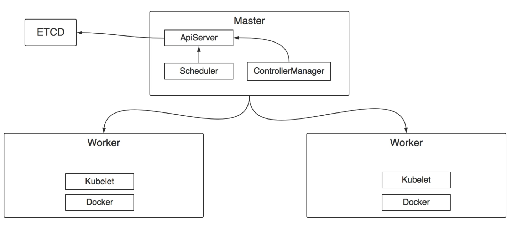

### 1. 什么是pod

Pod 是最小的可部署单元，它可以包含==一个或多个容器==。Pod 是 Kubernetes 调度的==基本单位==，用于运行==应用程序、服务或进程==

1. **容器组合**：Pod 可以包含一个或多个容器，这些容器共享==网络命名空间、IPC（进程间通信）和其他资源==。它们可以在同一主机上运行，并可以相互通信。
2. **单一 IP 地址**：Pod 有==一个单一的 IP 地址==，这些 IP 地址由 Kubernetes 分配给每个 Pod。这简化了与 Pod 通信的网络配置。
3. **生命周期**：Pod 具有相对短暂的生命周期。Pod 可以==由 Kubernetes 自动创建、删除和重新创建，==以响应需求、故障或调度策略的变化。
4. **共享资源**：==Pod 内的容器可以共享某些资源==，例如存储卷（Volumes），这使得它们可以共享文件或其他数据。
5. **调度**：==Pod 是 Kubernetes 中的调度单位==。Kubernetes Scheduler 负责将 Pod 分配给集群中的节点，并考虑资源需求、亲和性（Affinity）和互斥性（Anti-Affinity）等因素。
6. **多容器模式**：Pod 中的多个容器通常用于共享资源或协同工作。例如，一个容器可能负责处理请求，而另一个容器则负责收集日志。
7. **生命周期管理**：Kubernetes 提供了一些控制器，如 ==ReplicaSet、Deployment 等==，用于管理 Pod 的生命周期。这些控制器负责确保所需数量的 Pod 在任何时间点都处于运行状态，并在需要时创建、删除或替换 Pod。
8. **环境变量和卷**：==Pod 可以定义环境变量，这些变量可供容器内的应用程序使用==。此外，Pod 还可以定义存储卷，这些卷可以在容器之间共享数据，或者用于持久化数据。

### 2. 什么是ReplicaSet(RS)

在 Kubernetes 中，ReplicaSet（RS）是一种控制器对象，用于确保在集群中运行指定数量的 Pod 副本

下面是一个简单的图解，解释 ReplicaSet 的概念：

                         -------------------------
                        |          ReplicaSet       |
                        |-----------------------|
                        |   Desired Replicas: 3   |
                        |   Selector: app=nginx   |
                        |-----------------------|
                                /        \
                      --------          --------
                     | Pod A  |        | Pod B  |
                     |--------|        |--------|
                     |  app=nginx       app=nginx |
                     |--------|        |--------|
                      --------          --------

在这个图示中：

- ReplicaSet 控制一组 Pod 的运行，以确保有指定数量的 Pod 副本在运行。
- ReplicaSet 通过 Selector 与要管理的 Pod 相关联。==在此示例中，Selector 为 "app=nginx"，意味着 ReplicaSet 管理所有带有标签 "app=nginx" 的 Pod。==
- ReplicaSet 还指定了所需的副本数量，即 Desired Replicas。在此示例中，==所需副本数量为 3==。
- 当 ReplicaSet 检测到当前运行的 Pod 副本数量与所需数量不匹配时，它会采取适当的措施来调整 Pod 的数量。例如，如果当前只有 2 个 Pod 运行，但所需的是 3 个，ReplicaSet 将启动一个新的 Pod 副本，以确保总数达到所需数量。

总的来说，ReplicaSet 是 Kubernetes 中用于确保容器副本数量的重要控制器之一。它使得应用程序可以具有高可用性和弹性，因为即使某些节点或 Pod 发生故障，ReplicaSet 也会自动调整以确保所需的副本数量得到维持。

### 3. 什么是Deployment

在 Kubernetes 中，Deployment 是一种用于==管理 Pod 的高级控制器==。它提供了一种声明式的方式来定义 Pod 副本的创建和更新策略。Deployment 的主要目的是简化应用程序的部署和更新过程，并提供了一些强大的功能，如滚动更新、回滚和扩缩容。

以下是关于 Kubernetes 中 Deployment 的一些重要概念和特性：

1. **声明式配置：** 使用 Deployment，你可以通过定义一个 YAML 或 JSON 文件来描述你想要的应用程序的状态。这种声明式的配置方式使得你==只需说明你想要的最终状态==，而不必关心具体的操作步骤。
2. **副本控制：** Deployment 管理着一个或多个 Pod 副本的集合。你可以==指定 Deployment 中所需的副本数量==，并且 Deployment 会确保这个数量的 Pod 副本一直运行着。
3. **滚动更新：** Deployment 支持==滚动更新策略==，可以实现无缝地将应用程序从旧版本更新到新版本。它逐步替换旧版本的 Pod，确保整个更新过程不会导致应用程序的中断或故障。
4. **回滚：** 如果在进行滚动更新时出现了问题，Deployment 允许你回滚到之前的稳定版本。这样可以降低更新过程中出现的风险，并确保应用程序的可用性。
5. **自动扩缩容：** Deployment 还可以根据定义的资源利用率或其他指标来==自动扩展或缩小 Pod 的数量==。这使得应用程序可以根据负载的变化自动调整，确保足够的资源供应。
6. **服务发现和负载均衡：** Deployment 创建的 Pod 可以通过 Service 进行访问。==Service 提供了一种稳定的访问方式，并在后端的多个 Pod 之间进行负载均衡。==

总的来说，Deployment 是 Kubernetes 中用于==管理应用程序部署和更新的重要组件之一==。它简化了部署过程，提高了应用程序的可靠性和可维护性，同时还提供了一些强大的功能来管理 Pod 的生命周期。

### 4. 什么是Service

在 Kubernetes 中，Service 是一种用于==暴露应用程序的网络端点的抽象==。它定义了一组 Pod，并提供了一个统一的访问入口，使得其他应用程序可以与这组 Pod 进行通信，而不必关心具体的 Pod IP 地址变化或副本数量。以下是关于 Kubernetes 中 Service 的一些重要概念和特性：

1. **稳定的网络端点：** Service 提供了一个稳定的虚拟 IP 地址和端口，它代表了一组 Pod。其他应用程序可以通过这个虚拟 IP 地址访问 Service，而不必知道具体的 Pod IP 地址或副本数量。
2. **负载均衡：** Service 在后端的多个 Pod 之间进行负载均衡，以确保流量被平均分配到每个 Pod 上。这使得应用程序可以水平扩展，提高了整个系统的可伸缩性和性能。
3. **服务发现：** Service 允许其他应用程序发现和访问它所代表的 Pod。这种服务发现机制使得应用程序可以更加灵活地构建分布式系统，而无需硬编码特定的 Pod IP 地址。
4. **内部和外部服务：** Kubernetes 中的 Service 可以分为内部和外部服务。内部服务（ClusterIP）只在集群内部可访问，外部服务（NodePort、LoadBalancer、ExternalName）则允许从集群外部访问 Service。
5. **多种选择的暴露方式：** Kubernetes 提供了多种不同的方式来暴露 Service。NodePort 将 Service 暴露在每个节点的固定端口上，LoadBalancer 则使用云服务提供商的负载均衡器来暴露 Service，而 ExternalName 允许将 Service 映射到集群外部的 DNS 记录。
6. **连接不同的服务：** Service 可以通过标签选择器连接到不同的 Pod，从而允许将多个服务连接起来以构建复杂的应用程序架构。

总的来说，Service 是 Kubernetes 中用于暴露应用程序的网络端点的关键组件。它简化了应用程序之间的通信，并提供了一种灵活的方式来构建可扩展和可靠的分布式系统。

