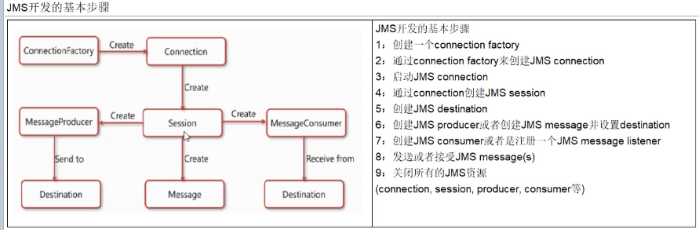
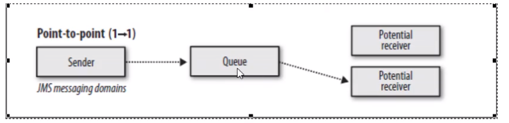
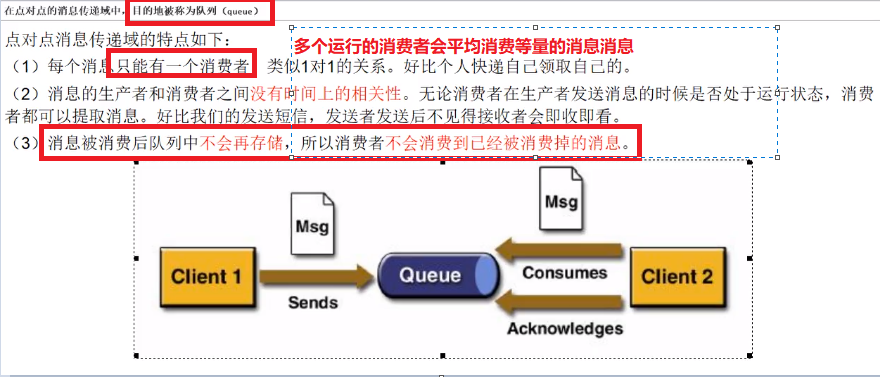
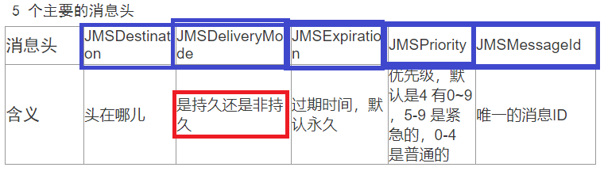
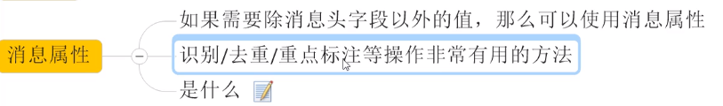

# ActiveMQ学习笔记
## 一.   初步安装使用
    
  ActiveMQ 的官网  ： http://activemq.apache.org
```cshell
    
    MQ  ：   消息中间件/消息队列   
    
    为什么要使用 MQ ？
    解决了耦合调用、异步模型、抵御洪峰流量，保护了主业务，消峰。
   
    
    直接进入myactivemq 的 文件下的activemq 下的 bin 目录，使用 ./activemq  start  命令启动  
    
    检查activemq 是否启动的三种方法：   也是三种查看后台进程的方法
     ps -ef|grep activemq|grep -v grep      // grep -v  grep 可以不让显示grep 本来的信息

          netstat -anp|grep 61616    // activemq 的默认后台端口是61616

                            lsof -i:61616
    
    
    让启动的日志信息不在控制台打印，而放到专门的文件中：
                                 ./activemq start >  /myactivemq/myrunmq.log 
```  
## 二、部署和代码尝试

 部署在linux 上的acvtiveMQ 要可以通过前台windows 的页面访问，必须把linux 的IP和 windows的 IP 地址配置到同一个网关下 。这种情况一般都是修改 linux 的IP 地址，修改网卡文件对应的IP 地址  
    修改linux 的ip 地址：
cd   /etc/sysconfig/network-scripts

vi  ifcfg-eth0 
    

    
    这是修改之后的网卡文件配置，IP 地址为：192.168.17.3  (因为我的windows 的IP 地址为192.168.17.1，将他们配置在了同一个网关下)
    
    
    
    配置成功后 ，可以用 windows ping  linux ， linux  ping  windows  ，当全部ping 通后，可以使用图形化界面访问activeMQ
    // ActiveMQ 的前台端口为 8161  ， 提供控制台服务       后台端口为61616 ，提供 JMS 服务 

     // 192.168.17.3   为 linux 的IP 地址， 使用 IP+端口 访问了ActiveMQ ， 登陆之后的样子如上。（能访问成功首先得在linux 上启动activeMQ 的服务），首次登录的默认账户密码为    账号：admin   密码：admin 
    访问不到的坑： 1   可能是你的linux 和 windows 没有在一个网关下 
                     2   可能你windows 的防火墙或者 linux 的防火墙没有关掉（是的，先得关掉防火墙）
                     3   你忘记启动activemq 的服务了 
                      4  你启动失败了，可能是你得java 环境没配好，必须是jdk 8 或者以上
    
  
```java
package cn.scct.helloworld;


import org.apache.activemq.ActiveMQConnectionFactory;

import javax.jms.*;

public class JmsProduce {
            //  linux 上部署的activemq 的 IP 地址 + activemq 的端口号，如果用自己的需要改动
    public static final String ACTIVEMQ_URL = "tcp://192.168.150.128:61616";
    // public static final String ACTIVEMQ_URL = "nio://192.168.17.3:61608";
    public static final String QUEUE_NAME = "myqueue";


    public static void main(String[] args) throws  Exception{

        // 1 按照给定的url创建连接工程，这个构造器采用默认的用户名密码
        ActiveMQConnectionFactory activeMQConnectionFactory = new ActiveMQConnectionFactory(ACTIVEMQ_URL);

        // 设置允许有数据丢失
      // activeMQConnectionFactory.setUseAsyncSend(true);

        // 2 通过连接工厂连接 connection  和 启动
        Connection connection = activeMQConnectionFactory.createConnection();
        //  启动
        connection.start();
        // 3 创建回话  session
        // 两个参数，第一个事务， 第二个签收
        Session session = connection.createSession(false,Session.AUTO_ACKNOWLEDGE);
        // 4 创建目的地 （两种 ： 队列/主题   这里用队列）
        Queue queue = session.createQueue(QUEUE_NAME);
        // 5 创建消息的生产者
        MessageProducer messageProducer = session.createProducer(queue);
        // 非持久化消息 和持久化消息演示
        messageProducer.setDeliveryMode(DeliveryMode.PERSISTENT);   // 持久化  如果开启
                                                        //       就会存入文件或数据库中

        // 6 通过messageProducer 生产 6 条 消息发送到消息队列中
        for (int i = 1; i < 7; i++) {
            // 7  创建字消息
            TextMessage textMessage = session.createTextMessage("msg--" + i);
            // 8  通过messageProducer发布消息
            messageProducer.send(textMessage);
        }
        // 9 关闭资源
        messageProducer.close();
        session.close();
        connection.close();
       // session.commit();
        System.out.println("  **** send MQ finished ****");
    }
}

```  
```java

package cn.scct.helloworld;


import org.apache.activemq.ActiveMQConnectionFactory;

import javax.jms.*;

// 消息的消费者  也就是回答消息的系统
public class JmsConsumer {
    public static final String ACTIVEMQ_URL = "tcp://192.168.150.128:61616";

    public static final String QUEUE_NAME = "myqueue";

    public static void main(String[] args) throws Exception{
        System.out.println(" 这里是 2号 消费者 ");

        // 1 按照给定的url创建连接工程，这个构造器采用默认的用户名密码
        ActiveMQConnectionFactory activeMQConnectionFactory = new ActiveMQConnectionFactory(ACTIVEMQ_URL);
        // 2 通过连接工厂连接 connection  和 启动
        javax.jms.Connection connection = activeMQConnectionFactory.createConnection();
        //  启动
        connection.start();
        // 3 创建回话  session
        // 两个参数，第一个事务， 第二个签收
        Session session = connection.createSession(false, Session.AUTO_ACKNOWLEDGE);
        // 4 创建目的地 （两种 ： 队列/主题   这里用队列）
        Queue queue = session.createQueue(QUEUE_NAME);
        // 5 创建消息的消费者
        MessageConsumer messageConsumer = session.createConsumer(queue);

//
//          同步阻塞方式reveive()   空参数的receive方法是阻塞，有参数的为等待时间
//          订阅者或消费者使用MessageConsumer 的receive() 方法接收消息，receive 在接收之前一直阻塞
    /*    while(true){
        // 这里是 TextMessage 是因为消息发送者是 TextMessage ， 接受处理的
        // 也应该是这个类型的消息
            TextMessage message = (TextMessage)messageConsumer.receive(4000L);  // 4秒
            if (null != message){
                System.out.println("****consumer："+message.getText());
            }else {
                break;
            }
        }*/


        // 通过监听的方式来消费消息
        // 通过异步非阻塞的方式消费消息
        // 通过messageConsumer 的setMessageListener 注册一个监听器，
        // 当有消息发送来时，系统自动调用MessageListener 的 onMessage 方法处理消息
        messageConsumer.setMessageListener(new MessageListener(){

            @Override
            public void onMessage(Message message) {
                if (null != message && message instanceof TextMessage) {
                    TextMessage textMessage = (TextMessage) message;
                    try {
                        System.out.println("****消费者的消息：" + textMessage.getText());
                    } catch (JMSException e) {
                        e.printStackTrace();
                    }
                }
            }
        });
/*
        1.先生产   只启动1号消费者  消费者能消费消息吗
            Y
        2.先生产  先启动1号消费者，再启动2号消费者，问题：2号消费者还能消费消息吗？
           N
        3.先启动2个消费者，再生产六条消息，请问消费情况如何？
            一人一半
*/


        // 保证控制台不灭  不然activemq 还没连上就关掉了连接
        System.in.read();
        messageConsumer.close();
        session.close();
        connection.close();
    }
}

```  
  
## 三、消息队列总结  
  
  
## 四、订阅  
  
  
```java
package cn.scct.topic;


import org.apache.activemq.ActiveMQConnectionFactory;

import javax.jms.*;

public class JmsProduceTopic {
            //  linux 上部署的activemq 的 IP 地址 + activemq 的端口号，如果用自己的需要改动
    public static final String ACTIVEMQ_URL = "tcp://192.168.150.128:61616";
    // public static final String ACTIVEMQ_URL = "nio://192.168.17.3:61608";
    public static final String TOPIC_NAME = "topic01";


    public static void main(String[] args) throws  Exception{

        // 1 按照给定的url创建连接工程，这个构造器采用默认的用户名密码
        ActiveMQConnectionFactory activeMQConnectionFactory = new ActiveMQConnectionFactory(ACTIVEMQ_URL);
        // 2 通过连接工厂连接 connection  和 启动
        Connection connection = activeMQConnectionFactory.createConnection();
        //  启动
        connection.start();
        // 3 创建回话  session
        // 两个参数，第一个事务， 第二个签收
        Session session = connection.createSession(false, Session.AUTO_ACKNOWLEDGE);
        // 4 创建目的地 （两种 ： 队列/主题   这里用主题）
        Topic topic = session.createTopic(TOPIC_NAME);
        // 5 创建消息的生产者
        MessageProducer messageProducer = session.createProducer(topic);

        for (int i = 1; i < 4 ; i++) {
            // 7  创建字消息
            TextMessage textMessage = session.createTextMessage("topic_name--" + i);
            // 8  通过messageProducer发布消息
            messageProducer.send(textMessage);

            MapMessage mapMessage = session.createMapMessage();
            //    mapMessage.setString("k1","v1");
            //     messageProducer.send(mapMessage);
        }
        // 9 关闭资源
        messageProducer.close();
        session.close();
        connection.close();

        System.out.println("  topic01 message send to MQ finished");
    }
}

```  
```java
package cn.scct.topic;


import org.apache.activemq.ActiveMQConnectionFactory;

import javax.jms.*;

// 消息的消费者  也就是回答消息的系统
public class JmsConsumerTopic {
    public static final String ACTIVEMQ_URL = "tcp://192.168.150.128:61616";

    public static final String TOPIC_NAME = "topic01";

    public static void main(String[] args) throws Exception{
        System.out.println(" NO.2 consumer ");

        // 1 按照给定的url创建连接工程，这个构造器采用默认的用户名密码
        ActiveMQConnectionFactory activeMQConnectionFactory = new ActiveMQConnectionFactory(ACTIVEMQ_URL);
        // 2 通过连接工厂连接 connection  和 启动
        javax.jms.Connection connection = activeMQConnectionFactory.createConnection();
        //  启动
        connection.start();
        // 3 创建回话  session
        // 两个参数，第一个事务， 第二个签收
        Session session = connection.createSession(false, Session.AUTO_ACKNOWLEDGE);
        // 4 创建目的地 （两种 ： 队列/主题   这里用主题）
        Topic topic = session.createTopic(TOPIC_NAME);
        // 5 创建消息的消费者
        MessageConsumer messageConsumer = session.createConsumer(topic);

        messageConsumer.setMessageListener( (message) -> {
            if (null != message  && message instanceof TextMessage){
                TextMessage textMessage = (TextMessage)message;
                try {
                    System.out.println("consumer recieve the topic from MQ:"+textMessage.getText());
                }catch (JMSException e) {
                }
            }
            if (null != message  && message instanceof MapMessage){
                MapMessage mapMessage = (MapMessage)message;
                try {
                    System.out.println("consumer recieve the topic of map type from MQ :"+mapMessage.getString("k1"));
                }catch (JMSException e) {
                }
            }

        });


        // 保证控制台不灭  不然activemq 还没连上就关掉了连接
        System.in.read();
        messageConsumer.close();
        session.close();
        connection.close();
    }
}

```  
  
## 五、 JMS（Java消息服务）  
  
  
  
### 5.1 JMS四大组成部分  
  
### 5.2 JMS消息  
#### 5.2.1 消息头
  
#### 5.2.2 消息体  
  
#### 5.2.3 消息属性
  
  
### 5.3 如何保证消息的可靠性  
#### 5.3.1 持久化  
```java
// 在队列为目的地的时候持久化消息
messageProducer.setDeliveryMode(DeliveryMode.PERSISTENT);

// 队列为目的地的非持久化消息
messageProducer.setDeliveryMode(DeliveryMode.NON_PERSISTENT);
```  
 持久化的消息，服务器宕机后消息依旧存在，<font color=red>**只是没有入队**，当服务器再次启动，消息仍旧会被消费。</font>  
但是<font color=red>非持久化的消息，服务器宕机后消息永远丢失</font>。   
而当你没有注明是否是持久化还是非持久化时，<font color=red>**队列**默认是持久化的消息。</font>  
对于目的地为主题（topic）来说，<font color=red>默认就是非持久化的</font>，让主题的订阅持久化的意义在于：<font color=red>对于订阅了公众号的人来说，当用户手机关机，在开机后仍然可以接受到关注公众号之前发送的消息。</font>  
- 持久化主题生产者  
  
- 主题消费者  
  
注意`recieve（时间）`方法可以设置在线时间  
  
#### 5.3.2  事务  
 createSession的第一个参数为true 为开启事务，开启事务之后必须在将消息提交，才可以在队列中看到消息  
```java
Session session = connection.createSession(true, Session.AUTO_ACKNOWLEDGE);
```  
   提交：  
```java
session.commit(); 
```
  事务开启的意义在于，如果对于<font color=red>多条必须同批次传输的消息</font>，可以使用事务，如果一条传输失败，可以将事务回滚，再次传输，保证数据的完整性。  
  对于<font color=red>消息消费者来说</font>，开启事务的话，可以<font color=red>避免消息被多次消费，以及后台和服务器数据的不一致性。</font>  
  举个栗子：  
如果<font color=red>消息消费的  createSession  设置为 ture  ，但是没有 commit</font > ，此时就会造成非常严重的后果，那就是<font color=red>在后台看来消息已经被消费，但是对于服务器来说并没有接收到消息被消费，此时就有可能被多次消费。</font>  
#### 5.3.3 签收  
**非事务** ：  
```java
Session.AUTO_ACKNOWLEDGE      自动签收，默认

Session.CLIENT_ACKNOWLEDGE     手动签收
```
手动签收需要acknowledge   
```java  
textMessage.aacknowledge();
```
 
  而**对于开启事务**时，设置<font color=red>手动签收和自动签收没有多大的意义</font>，都默认自动签收，也就是说<font color=red>事务的优先级更高一些</font>。
```  
Session session = connection.createSession(true,Session.AUTO_ACKNOWLEDGE);
//Session session = connection.createSession(true,Session.CLIENT_ACKNOWLEDGE);   //  也是自动签收   

        ……

session.commit();  
```
 但是<font color=red>开启事务没有commit 任就会重复消费</font>  
### 5.4 broker（了解）  
小知识：  broker   
broker 就是实现了用代码形式启动 ActiveMQ 将 MQ 内嵌到 Java 代码中，可以随时启动，节省资源，提高了可靠性。  
就是将 MQ 服务器作为了 Java 对象   

使用多个配置文件启动 activemq   
`cp activemq.xml  activemq02.xml `   

// 以active02 启动mq 服务器  
`./activemq start xbean:file:/myactivemq/apache-activemq-5.15.9/conf/activemq02.xml `  

 <font color=red>把小型 activemq 服务器嵌入到 java 代码： 不再使用linux 的服务器</font>  
  需要的包：  
```java
<dependency>
  <groupId>com.fasterxml.jackson.core</groupId>
  <artifactId>jackson-databind</artifactId>
  <version>2.9.5</version>
</dependency>
```
代码实现：  
```java
public class Embebroker {
    public static void main(String[] args) throws Exception {
        // broker 服务
        BrokerService brokerService = new BrokerService();
        // 把小型 activemq 服务器嵌入到 java 代码
        brokerService.setUseJmx(true);
        // 原本的是 192.……  是linux 上的服务器，而这里是本地windows 的小型mq 服务器
        brokerService.addConnector("tcp://localhost:61616");
        brokerService.start();
    }
}
```
  
