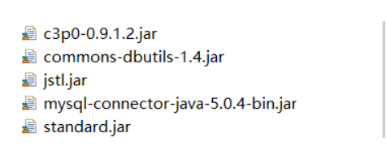
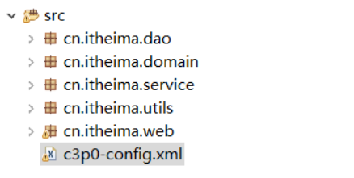

# 用EL和JSTL显示商品信息  
  
## 一、案例图解  
  
## 二、环境搭建  
1. 先导入包:操作数据库的mysql驱动包、c3p0连接池包、DBUtils包、JSTL相关的包(两个,jstl.jar和standard.jar)  
  
  
  
2. 导入c3p0配置文件到src目录下  
  
  
  
3. 建包web包、service包、dao包、domain包、dbutils包,web包处理请求，建立servlet；service包建立类，处理业务；dao包建立类，执行sql语句；domain包封装实体类；dbutils包封装数据库操作(此包每时每刻都要用基本)。  
  
  
## 三、代码详解
### 3.1 web层  
  
### 3.2 service层  
  
### 3.3 dao层  
  
### 3.4 jsp页面显示代码改写  
找到每个商品显示的div代码，用JSTL代码替代，以显示动态资源  
  
  
  
  
注意写路径的时候最好在前面加上`${pageContext.request.contextPath}`  
## 四、注意  
运行时是访问web层的servlet以间接访问显示商品的那个jsp页面  