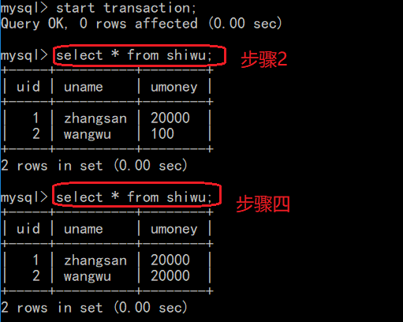

# 事务  
## 一、事务概述  
### 1.1 什么是事务  
事务：一件事情有n个组成单元，要么这n个组成单元同时成功，要不n个单元就同时失败。  
### 1.2mysql的事务  
默认的事务：一条sql语句就是一个事务，默认开启事务并提交事务  
手动事务：  
1）显示的开启一个事务：`start transaction`  
2）事务提交：`commit`代表从开启事务到事务提交中间的所有的sql都认为有效,只有提交了才真正的更新数据库  
3）事务的回滚：`rollback` 代表事务的回滚从开启事务到事务回滚中间的所有的sql操作都认为无效数据库没有被更新  
   
没有提交，直接回滚，撤回上述操作  

## 二、JDBC事务操作  
  
默认是自动事务：  
执行sql语句：executeUpdate()  ---- 每执行一次executeUpdate方法 代表事务自动提交  
通过jdbc的API手动事务（conn为Connection对象）：  
开启事务：`conn.setAutoComnmit(false);`  
提交事务：`conn.commit();`  
回滚事务：`conn.rollback();`  
**注意Connection对象为同一个，处理同一个事务时**  
## 三、DBUtils事务操作  
DBUtils要通过操作QueryRunner来执行sql语句  
有参构造：`QueryRunner runner = new QueryRunner(DataSource dataSource);`  
有参构造将数据源(连接池)作为参数传入QueryRunner，执行sql语句时不需要传入Connection对象，其会默认从连接池中取出一个连接，但是连接池如何确定同一个Connection呢？，所以该方法不行，**不能用于传递事务**，也就是说我们无法确定同一个连接。  
无参构造：`QueryRunner runner = new QueryRunner();`  
上述无参构造方法没有使用连接，我们需要手动获得一个连接，并在执行sql语句的相关函数中作为参数传递，但这正好满足了事务控制。  
  
**哎，让我们看看很容易的封装DBUtils、C3P0连接池的封装的工具类吧，是在太简单了，只是你xxx的忘了，生无可恋脸**  
  
C3P0配置文件：  
  
**真是伤透了心**  
## 四、事务的特性和隔离级别  
### 4.1 事务的特性(ACID)  
**原子性（Atomicity）**  
原子性是指事务是一个不可分割的工作单位，事务中的操作要么都发生，要么都不发生。   
**一致性（Consistency）**  
一个事务中，事务前后数据的完整性必须保持一致，可以用转账的例子举例。  
**隔离性（Isolation）**  
多个事务，事务的隔离性是指多个用户并发访问数据库时，一个用户的事务不能被其它用户的事务所干扰，多个并发事务之间数据要相互隔离。  
**持久性（Durability）**  
持久性是指一个事务一旦被提交，它对数据库中数据的改变就是永久性的，接下来即使数据库发生故障也不应该对其有任何影响。  
### 4.2 并发访问问题(由隔离性引起)  
如果不考虑隔离性，会发生以下问题：  
**脏读**  
B事务读取到了A事务尚未提交的数据  
**不可重复读**  
一个事务中两次读取的数据的内容不一致   
**幻读/虚读**  
一个事务中两次读取的数据的数量不一致  
### 4.3 隔离级别  
1）`read uncommitted` : 读取尚未提交的数据 ：哪个问题都不能解决  
2）`read committed`：读取已经提交的数据 ：可以解决脏读 ---- oracle默认的  
3）`repeatable read`：重读读取：可以解决脏读和不可重复读 ---mysql默认的  
4）`serializable`：串行化：可以解决脏读不可重复读和虚读---相当于锁表  
### 4.4 演示脏读与不可重复读  
由于mysql默认的隔离级别为`repeatable read`，所以演示之前要重设隔离级别  
查看mysql数据库默认的隔离级别：`select @@tx_isolation`  
设置隔离级别：`set session transaction isolation level read uncommitted`（以设置为读取尚未提交的数据为例）  
开启两个命令行，都设置为`read uncommitted`隔离级别  
两个都开启事务，一个修改数据，一个仅仅查询数据  

  
步骤12说明隔离级别低，没有提交的数据也能读到，脏读；24说明不可重复性，在一次事务中得到的结果不一样。