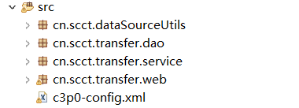

# 转账与ThreadLocal对象  
## 一、转账初级  
### 1.1 案例分析 
  
### 1.2 环境搭建  
1. 先导入包:操作数据库的mysql驱动包、c3p0连接池包、DBUtils包  
2. 按照三层架构建包  
   
3. 建一个转账的简单表单页面  
  
### 1.3 代码详解  
#### 1.3.1 web层  
  
#### 1.3.2 service层  
  
注意，为什么要在finally那里提交事务，是为了确保事务能够关闭。  
#### 1.3.3 dao层  
本层很简单  
  
### 1.4 结果  
略，没有遗漏同一个connection这种问题，事务控制也正确。再次提醒对DBUtils的记忆，本版本还是很简单。通过c3p0连接池，结合DBUtils，执行sql语句。  
  
## 二、 转账高级与ThreadLocal对象  
### 2.1 不足之处  
1. 为什么在service层中和dao层中都用到了一个Connection，这种跨层的数据不是污染了MVC架构吗？  
2. 我们希望三层能够共享数据，如果需要共享数据的话，可以实现不通过传参的方法共享数据。
3. 这明显是单线程程序，为啥不考虑在线程中同步更新一个数据。  
### 2.2 ThreadLocal对象  
ThreadLocal一般称为**线程本地变量**，它是一种特殊的线程绑定机制，将变量与线程绑定在一起，为每一个线程维护一个独立的变量副本。通过ThreadLocal可以将对象的可见范围限制在同一个线程内。  ThreadLocal从本质上讲，无非是提供了一个“线程级”的变量作用域，它是一种线程封闭（每个线程独享变量）技术，更直白点讲，ThreadLocal可以理解为将对象的作用范围限制在一个线程上下文中，使得变量的作用域为“线程级”。
#### 2.2.1 重新封装自己的DataSourceUtils包  
  
  
最关键的代码是`getCurrentConnection()`  
  
#### 2.2.2 重写service层  
  
#### 2.2.3 重写dao层  
  

