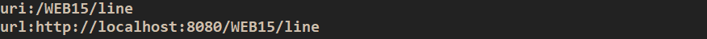
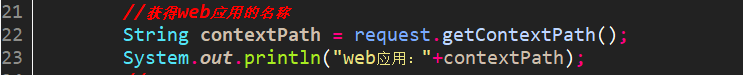
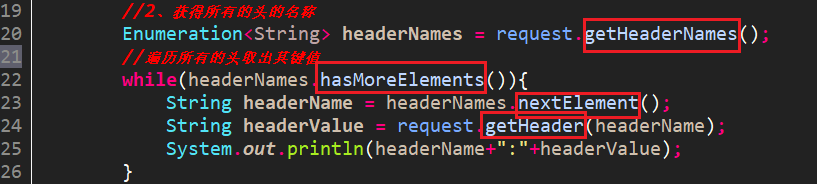
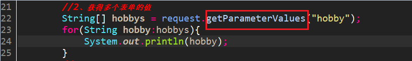
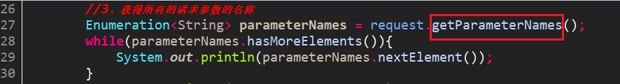
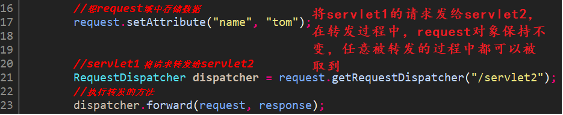
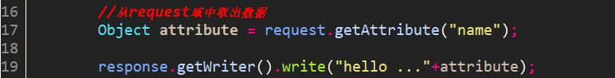

## 0. 概述  
我们在创建Servlet时会覆盖service()方法，或doGet()/doPost(),这些方法都有两个参数，一个为代表请求的request和代表响应response。service方法中的request的类型是ServletRequest，而doGet/doPost方法的request的类型是HttpServletRequest，HttpServletRequest是ServletRequest的子接口，功能和方法更加强大。  

## 1. 获得请求行  
### 1.1 获得请求方式  
  
### 1.2 获得请求url及uri  
  
  
### 1.3 获得web应用的名称  
  
  
### 1.4 获得地址后参数的字符串  
  
显然，post方式访问得到null值，get方式才能得到后面的参数值。  
  
### 1.5 获得客户机的IP信息  
  
## 2. 获取请求头  
### 2.1 获得指定头的键值对  
  
### 2.2 获得所有的头键名并遍历  
  
## 3. 根据请求头设计防盗链技术  
如果资源被别的资源以链接技术访问，在发送给本资源的请求会有一个referer的请求头。但是链接所指向的内容是有价值的，不经允许不能在别的网站跳转访问的需求是存在的，为此，我们需要设计防盗链技术。  
比如我们在一个html文档中放一个链接标签指向我们的referer资源，而我们的refer资源设计了防盗链技术。如下：  
  
通过判断referer头的值是否以某个地址开头，否则访问失败。  
## 4. 获取请求体  
### 4.1 获取单个参数的值  

### 4.2 获取一对多的参数值  
  
### 4.3 获取所有请求参数名称  
  
### 4.4 获取所有请求参数的名称及值  
  
再次提醒：**getParameter是得到请求体中的参数，getAttribute是得到域中的数据**
## 5. 转发与重定向的区别  
  
注意：转发与重定向的区别：  
		1. 重定向两次请求，转发一次请求  
		2. 重定向地址栏的地址变化，转发地址不变  
		3. 重新定向可以访问外部网站, 转发只能访问内部资源  
		4. 转发的性能要优于重定向     
## 6. Request的其它作用  
### 6.1 Request域对象 
request对象也是一个存储数据的区域对象，所以也具有如下方法：  
setAttribute(String name, Object o)  
getAttribute(String name)  
removeAttribute(String name)  
注意：request域的作用范围：一次请求中  
### 6.2 转发  
  
Servlet2处理，但浏览器地址栏地址还是Servlet1上的。  
  
## 7.注意事项  
### 7.1 ServletContext域与Request域的生命周期比较   
**ServletContext**：  
创建：服务器启动  
销毁：服务器关闭  
域的作用范围：整个web应用  
**request**：  
创建：访问时创建request  
销毁：响应结束request销毁  
域的作用范围：一次请求中  
### 7.2 服务器地址与客户端地址  
**客户端地址：**  
是客户端去访问服务器的地址，服务器外部的地址，特点：写上web应用名称  
直接输入地址：重定向  
**服务器端地址：**  
服务器内部资源的跳转的地址，特点：不需要写web应用的名称  
比如：转发  