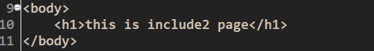
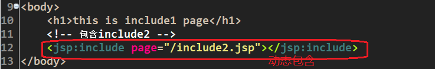
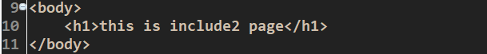

# JSP
## 1. JSP运行原理  
JSP全名是Java Servlet Pages,它是建立在Servlet规范之上的动态网页开发技术。在JSP文件中，HTML代码与Java代码共同存在，其中，HTML代码用来实现网页中静态内容的显示，Java代码用来实现网页中动态内容的显示。为了与传统HTML有所区别，JSP文件的扩展名为.jsp。  
JSP技术所开发的Web应用程序是基于Java的，它可以用一种简捷而快速的方法从Java程序生成Web页面，其使用上具有如下几点特征:  
1. <font color=red>跨平台</font>:由于JSP是基于Java语言的，它可以使用Java API，所以它也是跨一平台的，可以应用于不同的系统中，如Windows, Linux等。当从一个平台移植到另一个平台时，JSP和JavaBean的代码并不需要重新编译，这是因为Java的字节码是与平台无关的，这也应验了Java语言“一次编译，到处运行”的特点。  
2.  <font color=red>业务代码相分离</font>:在使用JSP技术开发Web应用时，可以将界面的开发与应用程序的开发分离开。开发人员使用HTML来设计界面，使用JSP标签和脚本来动态生成页面上的内容。在服务器端，JSP引擎(或容器，本书中指Tomcat)负责解析JSP标签和脚本程序，生成所请求的内容，并将执行结果以HTML页而的形式返回到浏览器。  
3.  <font color=red>组件重用</font>:JSP中可以使用JavaBean编写业务组件，也就是使用一个JavaBean类封装业务处理代码或者作为一个数据存储模型，在JSP页而中，甚至在整个项目中，都可以重复使用这个JavaBean,同时，JavaBean也可以应用到其他Java应用程序中。  
4.  <font color=red>预编译</font>:预编译就是在用户<font color=red>第一次通过浏览器访问JSP页面时</font>，服务器将对JSP页而代码进行编译，并且仅执行一次编译。编译好的代码将被保存，在用户下一次访问时，会直接执行编译好的代码。这样不仅节约了服务器的CPU资源，还大大的提升了客户端的访问速度。  
  
JSP运行原理如下：  
JSP的工作模式是请求/响应模式，客户端首先发出HTTP请求，JSP程序收到请求后进行处理并返回处理结果。在一个JSP文件第一次被请求时，JSP引擎(容器)把该JSP文件转换成为一个Servlet，而这个引擎本身也是一个Servlet。JSP的运行过程如下图所示。  
  
1). 首先客户端通过浏览器向服务器发出请求，在该请求中包含了请求的资源的路径，这样当服务器接收到该请求后就可以知道被请求的内容。  
  
    
  
2). 如上二图所示，服务器将以.jsp结尾的文件转换成一个servlet   
3). 在转换过程中，如果发现JSP文件中存在任何语法错误，则中断转换过程，并向服务端和客户端返回出错信息,如果转换成功，则JSP容器将生成的Java源文件编译成相应的字节码文件*.class。  
   
4)在Tomcat的work目录下如上所示，会出现.jsp的转换文件,其已经被翻译为java代码。  
## 2. JSP脚本与注释  
### 2.1 脚本  
1. <font color=red>全局脚本</font>`<%！java代码%>`：被翻译为servlet成员的位置  
2. <font color=red>局部脚本</font>`<%java代码%>`：内部的java代码翻译到service方法的内部  
3. <font color=red>脚本段脚本</font>` <%=java变量或表达式>`： 会被翻译成service方法内部out.print()  ，可以快速获取变量或返回值，不要在java变量或表达式后面加分号  
### 2.2 注释 
1. <font color=red>Html注释</font>：`<!--注释内容-->`：翻译后的servlet、页面显示的html源码  
2. <font color=red>java注释</font>：`//单行注释  /*多行注释*/ `：翻译后的servlet  
3. <font color=red>jsp注释</font>：`<%--注释内容--%> `：只在jsp源码中可见  
## 3. JSP指令  
jsp的指令是指导jsp翻译和运行的命令，jsp包括三大指令：  
1. <font color=red>page指令</font> --- 属性最多的指令（实际开发中page指令默认）  
属性最多的一个指令，根据不同的属性，指导整个页面特性  
格式：`<%@ page 属性名1= "属性值1" 属性名2= "属性值2" ...%>`  
常用属性如下：  
<font color=red>language</font>：jsp脚本中可以嵌入的语言种类  
<font color=red>pageEncoding</font>：当前jsp文件的本身编码---<font color=blue>内部可以包含contentType</font>  
<font color=red>contentType</font>：response.setContentType(text/html;charset=UTF-8)  
<font color=red>session</font>：是否jsp在翻译时自动创建session  
<font color=red>import</font>：导入java的包  
<font color=red>errorPage</font>：当当前页面出错后跳转到哪个页面  
<font color=red>isErrorPage</font>：当前页面是一个处理错误的页面  

2. <font color=red>include指令</font>  
页面包含（静态包含）指令，可以将一个jsp页面包含到另一个jsp页面中  
格式：`<%@ include file="被包含的文件地址"%>` 

3. <font color=red>taglib指令</font>  
在jsp页面中引入标签库（jstl标签库、struts2标签库）  
格式：`<%@ taglib uri="标签库地址" prefix="前缀"%>`  
## 4. JSP九大内置对象  
  
### 4.1 out对象  
  
  
如果设置out缓冲区为0kb，则out缓冲区的内容会自动插队复制到response缓冲区，此时输出为  
  
out的类型：JspWriter  
out作用就是想客户端输出内容----out.write()  
out缓冲区默认8kb 可以设置成0 代表关闭out缓冲区 内容直接写到respons缓冲器  
### 4.2 pageContext对象  
jsp页面的上下文对象，作用如下：  
<font color=red>page对象与pageContext对象不是一回事</font>  
1）<font color=red>pageContext是一个域对象</font>  
```java
setAttribute(String name,Object obj)  
getAttribute(String name)  
removeAttrbute(String name)  
```  

2）<font color=red>pageContext可以向指定的其他域中存取数据</font>  
```java
setAttribute(String name,Object obj,int scope)  
getAttribute(String name,int scope)  
removeAttrbute(String name,int scope)  
findAttribute(String name)  
```  
<font color=red>依次从pageContext域，request域，session域，application域中获取属性</font>，在某个域中获取后将不在向后寻找  

四大作用域的总结：  
page域：<font color=red>当前jsp页面范围</font>  
request域：<font color=red>一次请求</font>  
session域：<font color=red>一次会话</font>  
application域：<font color=red>整个web应用</font>  
   
3）获得其他8大对象  
例如： pageContext.getRequest()  
pageContext.getSession()  
## 5. 静态包含与动态包含  
### 5.1 静态包含 
  
  
结果  
  
并只有一个java文件，即两个jsp文件合在一起再翻译成java代码。  
### 5.2 动态包含  
  
  
有两个java文件，都会被翻译。  
  
<font color=red size=5>请求转发：</font>`<jsp:forward page="要转发的资源" />`