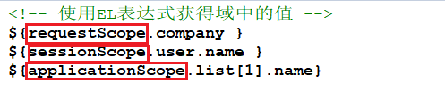
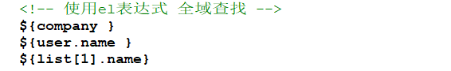
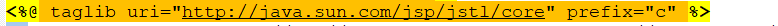
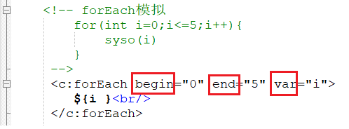
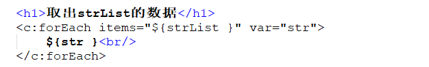
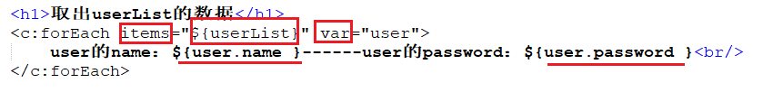
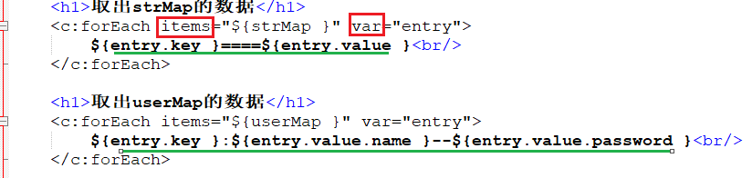

# EL与JSTL  
## 一、EL技术(主要是取值，不能进行逻辑判断)  
### 1.1 EL表达式概述  
EL(Express Lanuage)表达式可以嵌入在jsp页面内部，减少jsp脚本的编写，EL出现的目的是<font color=red>要替代jsp页面中脚本的编写</font>。  
### 1.2 EL表达式从域中取数据  
   
<font size=4 color=blue>**普通java脚本从域中取值:**</font>  
    
<font size=4 color=blue>**使用EL表达式:${域名.键名}**</font>  
```jsp
EL获得pageContext域中的值：${pageScope.key};
EL获得request域中的值：${requestScope.key};
EL获得session域中的值：${sessionScope.key};
EL获得application域中的值：${applicationScope.key};
```  
  
### 1.3 使用EL表达式实现全域查找  
EL从四个域中获得某个值`${key};`---依次<font color=red>从pageContext域，request域，session域，application域</font>中获取属性，在某个域中获取后将不再向后寻找。  
  
### 1.5 EL内置对象  
  
<font  size=5>再次提醒：**getParameter是得到<font color=red>请求体中的参数</font>，getAttribute是得到<font color=red>域中的数据**</font></font>  
EL表达式在获取Map的值或Bean的属性值是，可以<font color=red>使用“点”的方法</font>，也<font color=red>可以使用“下标”</font>的方法。  
`${initParam.a}与${initParam['a']}`，它们是完成的东西相同的。但是，如果Map的键或Bean的属性名中包含下划线或横岗时，那么就必须使用“下标”方法，例如：`${initParam['a_a']} ` 
### 1.6 EL执行运算表达式  
  
## 二、JSTL技术  
### 2.1 JSTL概述  
JSTL（JSP Standard Tag Library)，JSP标准标签库，可以嵌入在jsp页面中<font color=red>使用标签的形式完成业务逻辑</font>等功能。jstl出现的目的同el一样<font color=red>也是要代替jsp页面中的脚本代码</font>。JSTL<font color=red>标准标签库有5个子库</font>，但随着发展，目前常使用的是他的核心库。  
  
### 2.2 JSTL下载与导入  
<font color=blue size=4>**JSTL下载:**</font>  
从Apache的网站下载JSTL的JAR包。进入[下载链接](http://archive.apache.org/dist/jakarta/taglibs/standard/binaries/)网址下载JSTL的安装包。jakarta-taglibs-standard-1.1.2.zip，然后将下载好的JSTL安装包进行解压，此时，在lib目录下可以看到两个JAR文件，分别为<font color=red>jstl.jar和standard.jar</font>。其中，<font color=red>jstl.jar文件包含JSTL规范中定义的接口和相关类</font>，<font color=red>standard.jar文件包含用于实现JSTL的.class文件</font>以及JSTL中<font color=red>5个标签库描述符文件（TLD）</font>  
<font color=blue size=4>**JSTL导入:**</font>  
一般导入核心库，最常用，别的基本不用了  
  
### 2.3 JSTL核心库的常用标签  
#### 2.3.1 if标签  
  
  
<font color=blue size=4>**注意：没有else标签**</font>  
#### 2.3.2 forEach标签  
  
begin属性：begin属性用于指定从集合中第几个元素开始进行迭代，begin的索引值从0开始，如果没有指定items属性，就从begin指定的值开始迭代，直到迭代结束为止  
end属性：类推  
<font color=red>**var属性**</font>：用于指将当前<font color=red>迭代到的元素保存到page域中的名称</font>;  
<font color=red>**items属性**</font>：表示一个<font color=red>集合或者数组</font>  
step属性：顾名思义  
  
<font  size=4 color=red>**1.取List**</font>   
  
  
  
  
<font  size=4 color=red>**2.取自定义对象的List集合**</font>
  
    
    
  
<font  size=4 color=red>**3.取Map**</font>  
  
  
  