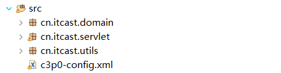
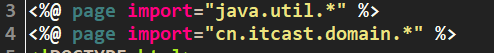

# 用JSP显示商品信息  
  
## 一、案例图解  
  
## 二、环境搭建  
1. 先导入包:操作数据库的mysql驱动包、c3p0连接池包、DBUtils包  
  

  
2. 导入c3p0配置文件到src目录下  
  
  
  
3. 建包servlet包(service包、dao包,没用三层架构，故缺之)、domain包、dbutils包,servlet包一包三用；domain包封装实体类；dbutils包封装数据库操作(此包每时每刻都要用基本)。  
  

## 三、代码详解
### 3.1 servlet包  
  
### 3.2jsp页面显示代码改写  
找到每个商品显示的div代码，用jsp代码替代，以显示动态资源  
  
  
  
  
注意写路径的时候最好在前面加上`${pageContext.request.contextPath}`  
## 四、注意  
运行时是访问web层的servlet以间接访问显示商品的那个jsp页面 
