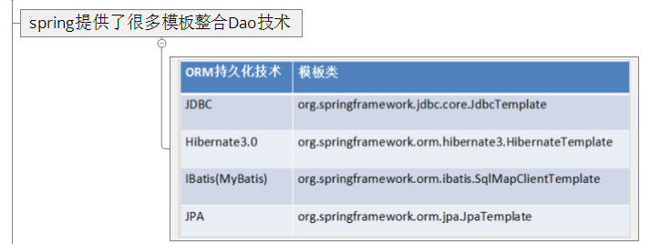
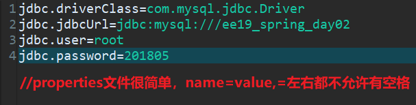
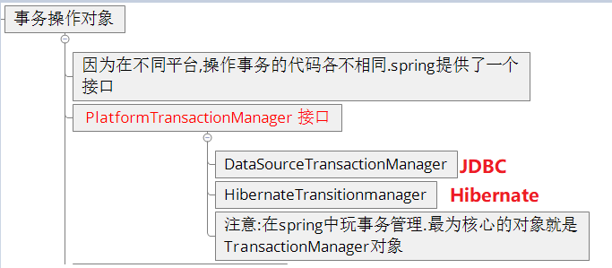

# Spring学习日志三  
## 一、 Spring整合JDBC  
  
现在学的是JDBC的整合。  
现说明本文所需要导入的包：  
  
### 1.1 介绍JdbcTemplate核心API  
#### 1.1.1 基本介绍  
  
#### 1.1.2 详细介绍  
### 1.2 基于DBCP整合Dao层  
#### 1.2.1 封装一个实体类  
  
#### 1.2.2 写Dao层  
  
#### 1.2.3 注册Dao层  
  
#### 1.2.4 测试  
  
结果就不演示了，没有啥必要，这个内容就是更改一下对应数据库某个表ID为1的数据而已。  
### 1.3 基于C3P0整合Dao层  
仅仅是配置不一样而已。  
  
### 1.4 Dao层继承JdbcSupport  
  
随之而来的便宜就是不用再Dao层注入JdbcTemplate属性了。  
  
### 1.5 读properties文件  
这是我们jdbc的properties文件，用来存放数据库连接的一些信息  
  
在spring中使用该properties文件  
  
## 二、Spring中的事务管理  
  
  
本节需要导入的包：  
  
本节需要导入的约束：  
  
### 2.1 编码方式管理(不推荐)  
#### 2.1.1 编写dao层  
  
#### 2.1.2 编写service层  
  
#### 2.1.3 编写配置文件  
  
#### 2.1.4 测试  
  
### 2.2 xml配置方式(推荐)  
#### 2.2.1 service层  
  
#### 2.2.2 配置文件更改  
  
  
### 2.3 注解配置(推荐，最简洁)  
#### 2.3.1 service层  
  
#### 2.3.2 xml配置文件更改  
