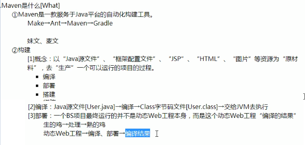
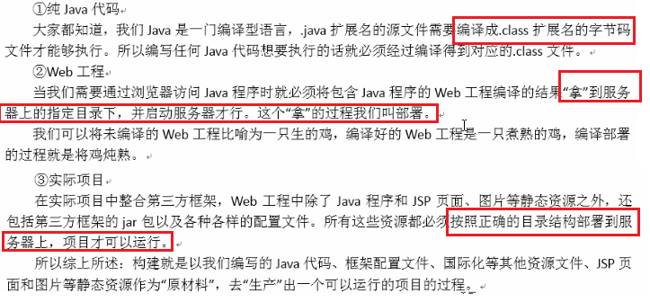
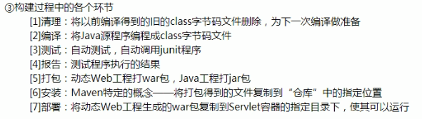

# 自动构建工具：Maven基础Eclipse版  
## 1. Maven的简介  
  
### 1.1 Maven的概念  
maven是一个`Java语言编写`的开源项目管理工具，是Apache软件基金会的顶级项目.主要用于`项目构建，依赖管理，项目信息管理`,是现今最流行的`Java项目构建工具`.  
### 1.2 项目构建的概念  
项目构建是一个项目从编写源代码到编译、测试、运行、打包、部署的过程。  
  
  
  
  
## 2. Maven的安装配置及目录结构  
首先，确保`JAVA_HOME`正确配置  
然后解压Maven安装包到某个非中文路径下  
配置Maven的环境变量MAVEN_HOME  
验证：mvn -v  
  
## 3. Maven的仓库  
  
  
## 4. Maven工程的目录结构  
  
  
## 5. Maven的常用命令  
  
## 6. Maven的生命周期(其功能由插件完成)  
### 6.1 clean生命周期  
  
### 6.2 default生命周期  
  
### 6.3 site生命周期  
  
### 6.4 命令行与生命周期  
  
## 7. Maven的概念模型  
  
## 8. 在Eclipse中创建Maven项目  
### 8.1 配置本地maven和设置仓库地址  
  
  
### 8.2 根据向导创建maven项目  
  
### 8.3 处理红色叉号  
  
### 8.4 重建仓库索引  
  
### 8.5 修改JRE运行环境  
  
### 8.6 修改tomcat配置  
  
### 8.7 依赖范围：scope属性  
  
### 8.8 依赖管理：处理版本冲突  
#### 8.8.1 依赖传递  
  
#### 8.8.2 版本冲突  
  
##### 8.8.2.1 第一声明优先原则  
  
##### 8.8.2.2 路径优先原则  
  
##### 8.8.2.3 排除原则  
  
##### 8.8.2.4 版本锁定原则  
  
## 9. Maven分模块开发  
## 10. Maven私服  
