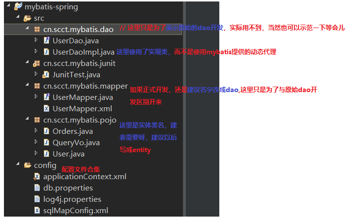

# Mybatis学习日志  
原生JDBC程序问题总结：  
```java  
Public static void main(String[] args) {
            Connection connection = null;
            PreparedStatement preparedStatement = null;
            ResultSet resultSet = null;

            try {
                //加载数据库驱动
                Class.forName("com.mysql.jdbc.Driver");

                //通过驱动管理类获取数据库链接
                connection =  DriverManager.getConnection("jdbc:mysql://localhost:3306/mybatis?characterEncoding=utf-8", "root", "mysql");
                //定义sql语句 ?表示占位符
            String sql = "select * from user where username = ?";
                //获取预处理statement
                preparedStatement = connection.prepareStatement(sql);
                //设置参数，第一个参数为sql语句中参数的序号（从1开始），第二个参数为设置的参数值
                preparedStatement.setString(1, "王五");
                //向数据库发出sql执行查询，查询出结果集
                resultSet =  preparedStatement.executeQuery();
                //遍历查询结果集
                while(resultSet.next()){
                    System.out.println(resultSet.getString("id")+"  "+resultSet.getString("username"));
                }
            } catch (Exception e) {
                e.printStackTrace();
            }finally{
                //释放资源
                if(resultSet!=null){
                    try {
                        resultSet.close();
                    } catch (SQLException e) {
                        // TODO Auto-generated catch block
                        e.printStackTrace();
                    }
                }
                if(preparedStatement!=null){
                    try {
                        preparedStatement.close();
                    } catch (SQLException e) {
                        // TODO Auto-generated catch block
                        e.printStackTrace();
                    }
                }
                if(connection!=null){
                    try {
                        connection.close();
                    } catch (SQLException e) {
                        // TODO Auto-generated catch block
                        e.printStackTrace();
                    }
                }

            }

        }
```  
上面代码有如下几个问题：  
<font color=red >1. 数据库连接</font>，使用时创建，不使用就关闭，<font color=red>对数据库进行频繁连接开启和关闭，造成数据库资源的浪费</font>   
<font color=blue >解决</font>：使用<font color=blue>数据库连接池</font>管理数据库连接  
<font color=red >2. 将sql 语句硬编码到Java代码中</font>，如果sql语句修改，需要对java代码重新编译，不利于系统维护   
<font color=blue >解决：将sql语句设置在xml配置文件中</font>，即使sql变化，也无需重新编译  
<font color=red >3. 向preparedStatement中设置参数</font>，对<font color=red >占位符位置和设置参数值</font>，硬编码到Java文件中，不利于系统维护  
<font color=blue >解决</font>：将sql语句及占位符，<font color=blue >参数全部配置在xml文件中</font>  
<font color=red >4. 从resutSet中遍历结果集数据时</font>，存在硬编码，将获取表的字段进行硬编码，不利于系统维护。   
<font color=blue >解决：将查询的结果集，自动映射成java对象</font>  
## 一、Mybatis简介与下载  
### 1.1 什么是mybatis  
  
### 1.2 为什么是mybatis  
  
  
### 1.3 mybatis的历史  
  
### 1.4 mybatis简单原理  
  
### 1.5 mybatis目录结构  
  
## 二、Mybatis入门程序  
### 2.1 导包  
暂时只需要导入mybatis核心包和mysql驱动包和一个日志包  
  
项目目录结构：  
  
### 2.2 编写实体类及对应表  
```java  
package cn.scct.mybatis.entity;

public class Employee {
	
	private Integer id;
	private String lastName;
	private String email;
	private String gender;
	
	
	public Integer getId() {
		return id;
	}
	public void setId(Integer id) {
		this.id = id;
	}
	public String getLastName() {
		return lastName;
	}
	public void setLastName(String lastName) {
		this.lastName = lastName;
	}
	public String getEmail() {
		return email;
	}
	public void setEmail(String email) {
		this.email = email;
	}
	public String getGender() {
		return gender;
	}
	public void setGender(String gender) {
		this.gender = gender;
	}
	@Override
	public String toString() {
		return "Employee [id=" + id + ", lastName=" + lastName + ", email="
				+ email + ", gender=" + gender + "]";
	}
	
	

}

```  
  
### 2.3 编写全局配置文件  
文件名任意，官方的名字是`SqlMapConfig.xml`  
  
### 2.4 编写sql语句映射文件  
  
### 2.5 测试  
#### 2.5.1 不写dao层测试  
  
  
  
#### 2.5.2 写dao层测试  
  
## 三、Mybatis全局配置文件详解  
注意配置选项是有顺序的，可以缺，顺序不能乱  
### 3.1 引入dtd约束  
配置本地的dtd，不讲吧，记住namespace选择url  
### 3.2 properties属性  
  
### 3.3 settings属性  
  
### 3.3 typeAliases属性  
  
  
  
  
  
  
### 3.5 plugin介绍(暂时介绍，后面会详解)  
  
### 3.6 environment属性  
  
  
  
  
### 3.7 databaseProvider属性  
  
  
  
### 3.8 mapper映射属性  
  

## 四、Mybatis映射文件配置详解  
### 4.0 insert、delete、update和select元素  
  
  
  
### 4.1 参数处理  
#### 4.1.1 单个参数处理  
  
  
#### 4.1.2 多个参数处理  
##### 4.1.2.1 常见两种参数处理方法  
  
##### 4.1.2.2 传入pojo参数  
  
##### 4.1.2.3 传入自定义map参数  
  
### 4.2 ${}和#{}的区别  
  
### 4.3 查询结果集返回值处理  
#### 4.3.1 返回list和map  
  
  
  
#### 4.3.2 简单自定义封装结果集  
  
  
#### 4.3.3 自定义多对一级联查询结果集封装规则  
  
#### 4.3.4 使用association实现多对一分步查询结果集封装  
  
#### 4.3.5 多对一的分步查询中的懒加载设置  
  
#### 4.3.6 一对多的结果集封装  
  
#### 4.3.7 一对多分步查询结果集封装  
  
#### 4.3.8 鉴别器  
  
## 五、 动态sql语句  
  
### 5.1 查询sql之if和where  
  
### 5.2 查询sql之trim  
  
### 5.4 查询sql之choose  
  
### 5.5 更新sql之set  
  
### 5.6 批量查询之foreach  
  
### 5.7 批量保存之foreach  
  
### 5.7 sql片段  
  
### 5.8 内置参数  
  
## 六、Mybatis缓存  
### 6.1 一级缓存  
  
### 6.2 二级缓存  
  
### 6.3 缓存相关设置  
  
### 6.4 第三方缓存整合  
  
  
## 七、 Mybatis整合Spring  
### 7.1 导包和目录结构说明  
  
  
### 7.2 整合思路分析  
  
### 7.3 Mybatis配置文件  
#### 7.3.1 全局配置文件sqlMapConfig.xml  
  
#### 7.3.2 映射配置文件及其对应接口  
  
  
### 7.4 spring配置文件applicationContext.xml  
#### 7.4.1 配置连接池  
  
#### 7.4.2 配置SqlSessionFactory  
  
#### 7.4.3 方案一：原始dao开发  
  
  
#### 7.4.4  方案二：使用mapper接口的动态代理开发  
  
### 7.5 测试  
  


