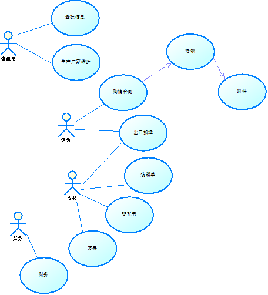
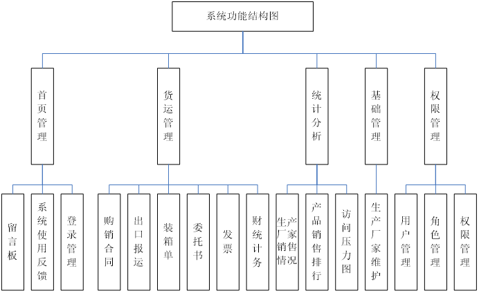

# 第一天 国际物流 杰信商贸 + 搭建环境
## 1.项目背景  
杰信项目物流行业的项目，杰信商贸是国际物流行业一家专门从事进出口玻璃器皿贸易的公司。公司总部位于十一个朝代的帝王之都西安，业务遍及欧美。随着公司不断发展壮大，旧的信息系统已无法满足公司的快速发展需求，妨碍公司成长，在此背景下，公司领导决定研发《杰信商贸综合管理平台》。
《杰信商贸综合管理平台》分三期完成。一期完成仓储管理（包括：采购单、仓库、货物、条形码、入库、出库、退货、盘点、库存、库存上限报警、统计查询）和展会管理（包括：展会管理、出单管理），形成货物统一数字化管理。二期完成货运全流程管理，包括购销合同、出货表统计、出口报运单、HOME装箱单、装箱单、委托书、发票、财务统计等。三期完成决策分析（包括：成本分析图、销售情况统计、重点客户、经营情况同期比对统计、工作绩效），为公司经营决策提供数据支持。  
## 2.【面试】拿到新框架，如何下手
当到一家新的软件公司，公司给你一个新框架，让你完成一个简单模块的CRUD操作，你怎样完成？  
	步骤：  
- 大概浏览一下说明的文档，了解软件解决什么问题，解决用户的什么需求  
- 找jar，浏览它的核心框架，核心技术freemake（看到不了解的，百度，了解它的作用即可）  
- 画图，画系统架构的草图  
- 系统都是分层体系，都从后往前画。  
- 看数据库配置文件，了解系统所连接的数据库，账号，密码  
- 持久层  
- Dao 数据库访问层  
- Service 业务层  
- Controller/action 控制层  
- Jsp 视图层  
找权限管理部门表，一般都是一个单表的CRUD操作。  
找到模板，仿造模板，根据草图一步一步实现  
遇到新的不了解的技术，应该怎么处理？百度，了解其作用即可。然后仿写。  
了解业务，UML 用例图  
业界画用例图 Rational rose UML: 非常强大的工具（大公司）用例图、类图、序列图、状态图（复杂状态流转时才画）  
用PowerDesigner 画数据库建模  
PD,ROSE都可以生产伪代码，但在实际业务中无人问津。  
## 3.用例图
- **角色**：代表系统中的一类用户  
- **用例**：代表业务功能  
- **连线关系**：哪个角色操作哪些用例  
画图的目的：为了开发人员了解整个系统的概貌，当画很多细节时，就会干扰我们对图的了解。  
  
## 4.系统功能结构图
- 功能点（分层，主次）演化成主菜单，左侧菜单，功能点
- 了解系统的所有功能
- 按功能点分配工作
- 用户报价的依据（按模块报价）  
  
## 5. 新项目怎么着手  
  
## 6. Pom.xml配置时的规则
1）先配置重要的依赖，例如：springmvc、spring、mybatis  
2）次重要依赖，例如：c3p0、mysql  
3）剩余的依赖，例如：log4j、junit、jstl、poi等  
## 7. 业界开发流程  
1、需求调研，编写《需求说明书》，功能的描述，创建表的草稿结构  
2、编写《概要说明书》，数据库建模，界面原型  
3、编写《详细说明书》  
4、开发  
## 8. 业务-生产厂家表	  
表名：FACTORY_C  
  
  
## 9.【面试】编号的类型
int			数据记录比较少，性能最高  
long			数据记录比较多  
varchar		表示一些有业务含义的编码。最典型的代理主键uuid  
  
## 10.【面试】数据库中有布尔类型吗？
数据库底层没有直接的boolean类型。都是变相实现。  
Mysql   
  
  
# 第二天   
  
POI业界相当流行，历史悠久。POI OOXML在性能上大大改进。  
JXL新锐，大数据量导出性能上优于POI。  
  
# 第三天  
## 1. 面试: UML图、E-R图、PDM图区别  
UML图，最全，**类图，序列图**。  
PDM数据库建模，表，表之间的关系。  
E-R图，实体和关系模型。简单的业务，E-R和PDM模型很相似。（小公司）它能直接显示实体之间是什么关系（一对一、一对多、多对多）

字段怎么来的？  
从需求中挖掘。用户表述的关键字、用户给定文档（电子、纸质）、业务组交谈。  

定论：  
不要相信用户所说的唯一性。不要用它来创建主键。字段设置唯一性约束。  

## 2. 面试系统中图片如何存储？
1）	数据库大字段  
2）	将图片文件存在服务器上，数据库字段只存访问路径（推荐）  
## 3. 数据库的设计原则：三范式
1）	所有表都要有主键  
2）	列字段内容不能重复  
3）	列字段的内容不能从别的内容中加工的。不能产生冗余的字段  
## 4. 企业中主流设计原则：反三范式
历史烙印  
物理内存、硬盘空间极其昂贵。在设计中节省空间首要指标。  
现今设计的节省时间，提高效率，提高用户的使用满意度。查询速度快，页面展现快。  

数据库设计是最关键，它在项目中性能优化中起决定性作用。  

1）	冗余设计  
2）	预处理，分次计算-分步计算  

在合同新增货物时，保存数量、单价等基础信息，多做一个事情，计算金额=数据*单价，然后保存到金额字段中。在页面读取时，例如：合同列表页面，就能直接读取值。这样用户使用展现速度提高百倍。  

缺点：信息在数据库中不唯一，需要对多处维护。  

反三范式：目的，利用空间换时间。  

## 5. 【面试】外键什么时候创建？
需求调研 --  分析设计  -- 编码不 – 测试不  -- 试运行阶段（BUG）不-- 正式上线 要   -- 维护要  
## 6.【面试】varchar(10) 和char(10)有什么区别？存入abc字符串。
Varchar变长，实际存储3位；  
Char定长，实际存储10位；其它空着以空格填充  

