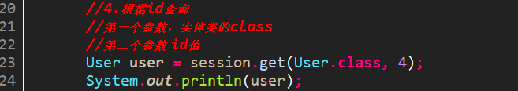
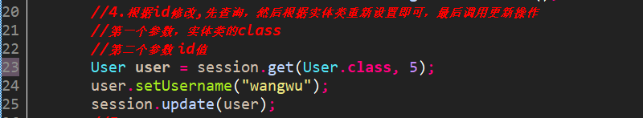
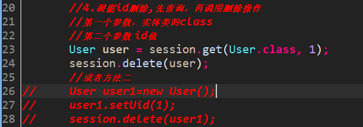
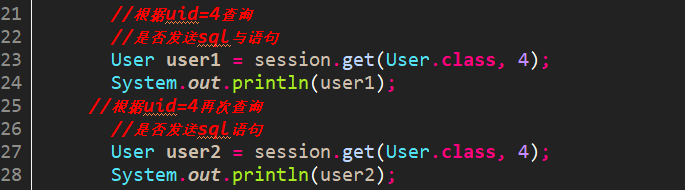
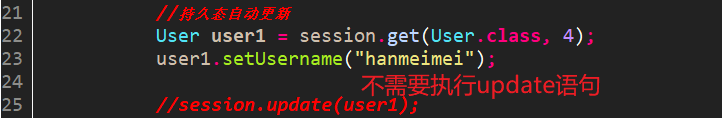
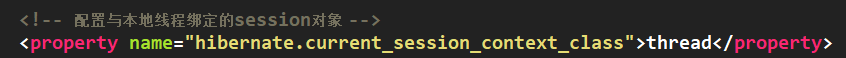
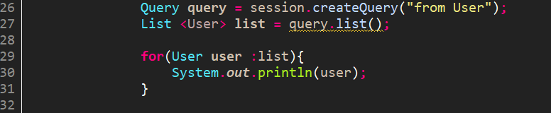

## 一、实体类(持久化类)的编写规则  
1. 实体类的属性都是私有的  
2. 提供空参构造器 
3. 所有属性都有公开的get和set方法  
4. 要有一个属性与表的主键对应  
5. 实体类的属性建议我们使用基本数据类型的包装类，包装类可以表示空  
  
6. 实体类尽量不要使用final进行修饰  
## 二、Hibernate主键生成策略  
**自然主键：**  
把具有业务含义的字段作为主键，称之为自然主键。不常用，同名咋办？给数据库维护增加难度。  
**代理主键：**  
把不具备业务含义的字段作为主键，称之为代理主键。该字段一般取名为"ID"，通常为整数类型，因为整数类型比字符串类型要节省很多数据库空间。  
  
## 三、实体类的crud操作  
### 3.1 save方法实现添加操作  
  
### 3.2 get方法实现根据id查询  
  
### 3.3 update方法实现更新操作  
  
### 3.4 delete方法实现删除操作  
   
上述除了添加操作，基本都要进行查询操作  
## 四、实体类(持久化类)的三种状态  
### 4.1 瞬时态  
 瞬时态也称为临时态或者自由态，瞬时态的实例是由new命令创建、开辟内存空间的对象，**不存在持久标识(相当于主键值)**，尚未与Hibernate Session关联，在数据库中也没有记录，失去引用后将被JVM回收。瞬时状态的对象在内存中是孤立存在的，与数据库中的数据无任何关联，仅是一个信息携带的载体。  
 
### 4.2 持久态  
持久态的对象存在持久化标识，加入到了Session缓存中，并且相关联的Session没有关闭，在数据库中有对应的记录，每条记录只对应唯一的持久化对象，需要注意的是，持久态对象是在事务还未提交前变成持久态的。  
  
### 4.3 托管态  
托管态也称离线态或者游离态，当某个持久化状态的实例与Session的关联被关闭时就变成了托管态。托管态对象存在持久化标识，并且仍然与数据库中的数据存在关联，只是失去了与当前Session的关联，托管状态对象发生改变时Hibernate不能检测到。  
  
## 五、 Hibernate一级缓存  
缓存是计算机领域非常通用的概念。它介于应用程序和永久性数据存储源(如硬盘上的文件或者数据库)之间，其作用是降低应用程序直接读写永久性数据存储源的频率，从而提高应用的运行性能。缓存中的数据是数据存储源中数据的拷贝。缓存的物理介质通常是内存。  
Hibernate的缓存分为一级缓存和二级缓存，Hibernate的这两级缓存都位于持久化层，存储的都是数据库数据的备份。其中第一级缓存为Hibernate的内置缓存，不能被卸载。  
1. 一级缓存默认是打开的。  
2. 一级缓存使用范围是session域，从session打开到session关闭期间。  
3. 一级缓存存的数据是持久化数据。  
二级缓存由redis解决。是sessionFactory范围的。  
### 5.1 验证一级缓存的存在  
根据**两次查询同一个对象时是否都会出现sql语句输出**确定是否存在一级缓存  
  
  
  
很明显，第一次查询有sql语句输出，第二次查询没有，说明有一级缓存的存在  
### 5.2 一级缓存的执行过程  
  
### 5.3 一级缓存的特性演示  
**特性：****持久态自动更新数据库**  
  
  
  
## 六、 Hibernate的事务编写规范  
  
**Hibernate绑定session**  
1. session类似于jdbc的connection  
2. 与本地线程绑定session对象类似于jdbc中ThreadLocal对象绑定connection  
3. 获取与本地线层相关的session  
1）在核心配置文件中配置  
  
2）调用sessionFactory里面的方法`getCurrentSession()`得到  
  
从此这个工具类完整了好像  
  
从此若非单元测试，可以不写sessionFactory对象，否则会造成内存溢出。  
## 七、 Hibernate其他API（针对查询所有）  
### 7.1 Query对象  
1. 使用hql（hibernate query language）语句实现  
2. sql操作表名及其字段，hql操作实体类及其属性  
3. 查询所有的hql语句：`from 实体类名称`  
    
  
### 7.2 Criteria对象  
1. 无需写sql和hql语句  
  
### 7.3 SQLQuery对象  
1. 调用底层sql语句  
  
或者  

