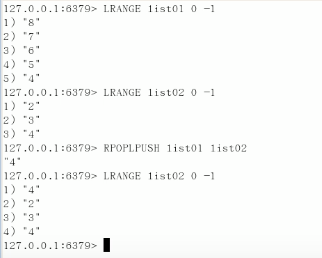

# Redis学习笔记    
## 一、Redis介绍  
  
## 二、Redis安装(linux环境)与启动和连接  
### 2.1 安装  
1. 安装gcc：`yum install gcc-c++`  
2. 解压redis-3.0.0.tar.gz,进入解压的文件夹，编译：`make`  
3. 还在该解压文件夹下，安装：`make PREFIX=/usr/local/redis install`  
4. 在解压的文件夹下复制`redis.config`到`usr/local/redis`下  
### 2.2 启动  
#### 2.2.1 前端模式启动(不推荐)  
否则将需要开两个终端  
方法：到安装目录`/usr/local/redis`下，执行`bin`文件夹下的服务器启动脚本：`./bin/redis-server`  
#### 2.2.2 后台模式启动  
修改`redis.config`文件：`vim redis.config`；然后修改`daemonize no`为`daemonize yes`  
指定`redis.config`文件启动服务器：`./bin/redis-server  ./redis-conf`  
查看默认端口：`ps -ef | grep -i redis`，默认端口号是6379  
停止redis：`./bin/redis-cli shutdown`  
### 2.3 连接客户端  
`./bin/redis-cli`  
  
  
### 2.4 启动杂项知识总结  
  
## 三、Redis数据类型  
### 3.1 Redis五大数据类型  
- **String类型**  
String是redis最基本的类型，你可以理解成与Memcached一模一样的类型，一个key对应一个value。  
String类型是二进制安全的。意思是redis的string可以包含任何数据。比如jpg图片或者序列化的对象 。  
String类型是Redis最基本的数据类型，一个redis中字符串value最多可以是512M。    
- **Hash类型**  
Redis hash 是一个键值对集合。  
Redis hash是一个string类型的field和value的映射表，hash特别适合用于存储对象。  
类似Java里面的Map<String,Object>  
- **List类型**  
Redis 列表是简单的字符串列表，按照插入顺序排序。
你可以添加一个元素导列表的头部（左边）或者尾部（右边）。  
它的底层实际是个链表   
- **Set类型**  
Redis的Set是string类型的无序集合。它是通过HashTable实现实现的。  
- **ZSet(sorted set：有序集合)**  
Redis zset 和 set 一样也是string类型元素的集合,且不允许重复的成员。  
不同的是每个元素都会关联一个double类型的分数。  
redis正是通过分数来为集合中的成员进行从小到大的排序。zset的成员是唯一的,但分数(score)却可以重复。  
### 3.2 Redis的键  
  

### 3.3 Redis的String类型  
  
### 3.4 Redis的List类型  

  
  
  
  
  
  
  
  
### 3.5 Redis的Set类型  
  
  
  
  
  
### 3.6 Redis的Map类型  
  
  
  
  
  
### 3.7 Redis的ZSet类型  
  
  
  
## 四、Redis的配置文件   
安装包解压文件中有原始配置文件redis-conf  
   
### 4.1 数据的单位units（如果用到注意单位）  
  
### 4.2 INCLUDES包含  
  
### 4.3 GENERAL通用  
#### 4.3.1 daemonize  
Redis默认不是以守护（后台）进程的方式运行，可以通过该配置项修改，使用yes启用守护进程
  
#### 4.3.2 pidfile（一般默认）  
当Redis以守护进程方式运行时，Redis默认会把pid写入/var/run/redis.pid文件，可以通过pidfile指定  
pidfile /var/run/redis.pid  
  
#### 4.3.3 port（一般默认）  
指定Redis监听端口，默认端口为6379，作者在自己的一篇博文中解释了为什么选用6379作为默认端口，因为6379在手机按键上MERZ对应的号码，而MERZ取自意大利歌女Alessia Merz的名字  
  port 6379  
  
#### 4.3.4 绑定的主机地址
  bind 127.0.0.1  #表示绑定本机，这是个本机回环地址  
    
#### 4.3.5 tcp-backlog（一般默认）  
设置tcp的backlog，backlog其实是一个连接队列，backlog队列总和=未完成三次握手队列 + 已经完成三次握手队列。
在高并发环境下你需要一个高backlog值来避免慢客户端连接问题。注意Linux内核会将这个值减小到/proc/sys/net/core/somaxconn的值，所以需要确认增大somaxconn和tcp_max_syn_backlog两个值来达到想要的效果。  
#### 4.3.6 timeout（高并发时可能需要改）  
timeout 0 #表示disable，即时刻与客户端连接，当客户端silent时。  
#### 4.3.7 tcp-keepalive （高并发时可能需要修改）  
tcp-keepalive 0  
TCP连接保活策略，可以通过tcp-keepalive配置项来进行设置，单位为秒，假如设置为60秒，则server端会每60秒向连接空闲的客户端发起一次ACK请求，以检查客户端是否已经挂掉，对于无响应的客户端则会关闭其连接。所以关闭一个连接最长需要120秒的时间。如果设置为0，则不会进行保活检测。  
#### 4.3.8 loglevel（一般默认）  
  
#### 4.3.9 logfile（生产环境一般需要改）
logfile ""  
redis也支持通过logfile配置项来设置日志文件的生成位置。如果设置为空字符串，则redis会将日志输出到标准输出。假如你在daemon情况下将日志设置为输出到标准输出，则日志会被写到/dev/null中。  
#### 4.3.10 日志其他三个默认选项  
如果希望日志打印到syslog中，也很容易，通过syslog-enabled来控制。另外，syslog-ident还可以让你指定syslog里的日志标志；而且还支持指定syslog设备，值可以是USER或LOCAL0-LOCAL7。具体可以参考syslog服务本身的用法。  
  
#### 4.3.11 databases（一般默认）  
databases 16#16个数据库  
这16个数据库的编号将是0到15。默认的数据库是编号为0的数据库。用户可以使用select <DBid>来选择相应的数据库。  
### 4.4 SNAPSHOTTING（详解见持久化一节）
### 4.5 REPLICATION  （详见主从复制一节）
### 4.6 SECURITY  
#### 4.6.1 requirepass（默认没有设置密码）  
我们可以要求redis客户端在向redis-server发送请求之前，先进行密码验证。当你的redis-server处于一个不太可信的网络环境中时，相信你会用上这个功能。由于redis性能非常高，所以每秒钟可以完成多达15万次的密码尝试，所以你最好设置一个足够复杂的密码，否则很容易被黑客破解。  
requirepass zhimakaimen #比如配置为zhimakaimen  
#### 4.6.2 rename-command（可以修改、禁用redis指令）  
redis允许我们对redis指令进行更名，比如将一些比较危险的命令改个名字，避免被误执行。比如可以把CONFIG命令改成一个很复杂的名字，这样可以避免外部的调用，同时还可以满足内部调用的需要：  
rename-command CONFIG b840fc02d524045429941cc15f59e41cb7be6c89  #修改CONFIG指令  
rename-command CONFIG "" #禁用了CONFIG指令  
### 4.7 LIMITS  
#### 4.7.1 maxclients （默认为10000）  
我们可以设置redis同时可以与多少个客户端进行连接。默认情况下为10000个客户端。当你无法设置进程文件句柄限制时，redis会设置为当前的文件句柄限制值减去32，因为redis会为自身内部处理逻辑留一些句柄出来。
如果达到了此限制，redis则会拒绝新的连接请求，并且向这些连接请求方发出“max number of clients reached”以作回应。  
#### 4.7.2 maxmemory  
我们甚至可以设置redis可以使用的内存量。一旦到达内存使用上限，redis将会试图移除内部数据，移除规则可以通过maxmemory-policy来指定。如果redis无法根据移除规则来移除内存中的数据，或者我们设置了“不允许移除”，那么redis则会针对那些需要申请内存的指令返回错误信息，比如SET、LPUSH等。但是对于无内存申请的指令，仍然会正常响应，比如GET等。  
注意单位  
#### 4.7.3 maxmemory-policy（过期策略）  
- volatile-lru  
使用LRU算法移除过期集合中的key，key是可以设置是否过期，过期多长的，在持久化那一章将讲到。  
- allkeys-lru  
使用LRU算法移除所有key  
- volatile-random  
在过期集合中移除随机的key  
- allkeys-random  
移除随机的key  
- volatile-ttl  
移除那些TTL值最小的key，即那些最近才过期的key。  
- noeviction  
不进行移除。针对写操作，只是返回错误信息。  
### 4.8 APPEND ONLI MODE（详见持久化一节）  
### 4.9 常见配置总结  
参数说明  
redis.conf 配置项说明如下：  
1. Redis默认不是以守护进程的方式运行，可以通过该配置项修改，使用yes启用守护进程  
  daemonize no
2. 当Redis以守护进程方式运行时，Redis默认会把pid写入/var/run/redis.pid文件，可以通过pidfile指定  
  pidfile /var/run/redis.pid
3. 指定Redis监听端口，默认端口为6379，作者在自己的一篇博文中解释了为什么选用6379作为默认端口，因为6379在手机按键上MERZ对应的号码，而MERZ取自意大利歌女Alessia Merz的名字  
  port 6379
4. 绑定的主机地址  
  bind 127.0.0.1
5. 当 客户端闲置多长时间后关闭连接，如果指定为0，表示关闭该功能  
  timeout 300
6. 指定日志记录级别，Redis总共支持四个级别：debug、verbose、notice、warning，默认为notice  
  loglevel verbose
7. 日志记录方式，默认为标准输出，如果配置Redis为守护进程方式运行，而这里又配置为日志记录方式为标准输出，则日志将会发送给/dev/null  
  logfile stdout
8. 设置数据库的数量，默认数据库为0，可以使用SELECT <dbid>命令在连接上指定数据库id  
  databases 16
9. 指定在多长时间内，有多少次更新操作，就将数据同步到数据文件，可以多个条件配合  
 save  seconds  changes  
  Redis默认配置文件中提供了三个条件：  
  save 900 1  
  save 300 10  
  save 60 10000  
  分别表示900秒（15分钟）内有1个更改，300秒（5分钟）内有10个更改以及60秒内有10000个更改。  
 
10. 指定存储至本地数据库时是否压缩数据，默认为yes，Redis采用LZF压缩，如果为了节省CPU时间，可以关闭该选项，但会导致数据库文件变的巨大  
  rdbcompression yes
11. 指定本地数据库文件名，默认值为dump.rdb  
  dbfilename dump.rdb
12. 指定本地数据库存放目录  
  dir ./
13. 设置当本机为slav服务时，设置master服务的IP地址及端口，在Redis启动时，它会自动从master进行数据同步  
  slaveof <masterip> <masterport>
14. 当master服务设置了密码保护时，slav服务连接master的密码  
  masterauth <master-password>
15. 设置Redis连接密码，如果配置了连接密码，客户端在连接Redis时需要通过AUTH <password>命令提供密码，默认关闭  
  requirepass foobared
16. 设置同一时间最大客户端连接数，默认无限制，Redis可以同时打开的客户端连接数为Redis进程可以打开的最大文件描述符数，如果设置 maxclients 0，表示不作限制。当客户端连接数到达限制时，Redis会关闭新的连接并向客户端返回max number of clients reached错误信息  
  maxclients 128
17. 指定Redis最大内存限制，Redis在启动时会把数据加载到内存中，达到最大内存后，Redis会先尝试清除已到期或即将到期的Key，当此方法处理 后，仍然到达最大内存设置，将无法再进行写入操作，但仍然可以进行读取操作。Redis新的vm机制，会把Key存放内存，Value会存放在swap区  
  maxmemory <bytes>
18. 指定是否在每次更新操作后进行日志记录，Redis在默认情况下是异步的把数据写入磁盘，如果不开启，可能会在断电时导致一段时间内的数据丢失。因为 redis本身同步数据文件是按上面save条件来同步的，所以有的数据会在一段时间内只存在于内存中。默认为no  
  appendonly no
19. 指定更新日志文件名，默认为appendonly.aof  
   appendfilename appendonly.aof
20. 指定更新日志条件，共有3个可选值：   
  no：表示等操作系统进行数据缓存同步到磁盘（快） 
  always：表示每次更新操作后手动调用fsync()将数据写到磁盘（慢，安全） 
  everysec：表示每秒同步一次（折衷，默认值）
  appendfsync everysec
 
21. 指定是否启用虚拟内存机制，默认值为no，简单的介绍一下，VM机制将数据分页存放，由Redis将访问量较少的页即冷数据swap到磁盘上，访问多的页面由磁盘自动换出到内存中（在后面的文章我会仔细分析Redis的VM机制）  
   vm-enabled no
22. 虚拟内存文件路径，默认值为/tmp/redis.swap，不可多个Redis实例共享  
   vm-swap-file /tmp/redis.swap
23. 将所有大于vm-max-memory的数据存入虚拟内存,无论vm-max-memory设置多小,所有索引数据都是内存存储的(Redis的索引数据 就是keys),也就是说,当vm-max-memory设置为0的时候,其实是所有value都存在于磁盘。默认值为0  
   vm-max-memory 0
24. Redis swap文件分成了很多的page，一个对象可以保存在多个page上面，但一个page上不能被多个对象共享，vm-page-size是要根据存储的 数据大小来设定的，作者建议如果存储很多小对象，page大小最好设置为32或者64bytes；如果存储很大大对象，则可以使用更大的page，如果不 确定，就使用默认值  
   vm-page-size 32
25. 设置swap文件中的page数量，由于页表（一种表示页面空闲或使用的bitmap）是在放在内存中的，，在磁盘上每8个pages将消耗1byte的内存。  
   vm-pages 134217728
26. 设置访问swap文件的线程数,最好不要超过机器的核数,如果设置为0,那么所有对swap文件的操作都是串行的，可能会造成比较长时间的延迟。默认值为4  
   vm-max-threads 4
27. 设置在向客户端应答时，是否把较小的包合并为一个包发送，默认为开启  
  glueoutputbuf yes
28. 指定在超过一定的数量或者最大的元素超过某一临界值时，采用一种特殊的哈希算法  
  hash-max-zipmap-entries 64
  hash-max-zipmap-value 512
29. 指定是否激活重置哈希，默认为开启（后面在介绍Redis的哈希算法时具体介绍）  
  activerehashing yes
30. 指定包含其它的配置文件，可以在同一主机上多个Redis实例之间使用同一份配置文件，而同时各个实例又拥有自己的特定配置文件  
  include /path/to/local.conf  
## 五、 持久化之RDB（Redis DataBase）  
### 5.1 RDB是什么  
在指定的时间间隔内将内存中的数据集快照写入磁盘，也就是行话讲的Snapshot快照，它恢复时是将快照文件直接读到内存里  
Redis会单独创建（`fork fork的作用是复制一个与当前进程一样的进程。新进程的所有数据（变量、环境变量、程序计数器等）
数值都和原进程一致，但是是一个全新的进程，并作为原进程的子进程。`）一个子进程来进行持久化，会先将数据写入到一个临时文件中，待持久化过程都结束了，再用这个临时文件替换上次持久化好的文件。整个过程中，主进程是不进行任何IO操作的，这就确保了极高的性能。如果需要进行大规模数据的恢复，且对于数据恢复的完整性不是非常敏感，那RDB方式要比AOF方式更加的高效。**RDB的缺点**是最后一次持久化后的数据可能丢失。  
### 5.2 相关配置（SNAPSHOTTING）  
#### 5.2.1 备份策略（save）  
- save  时间(单位秒)  键值改变次数  
  
#### 5.2.2 备份文件名（dbfilename）和备份位置（dir）  
默认备份位置：dir ./ 表示当前目录  
默认备份名称： dbfilename  dump.rdb  
#### 5.2.3 备份失败策略（stop-writes-on-bgsave-error）  
如果用户开启了RDB快照功能，那么在redis持久化数据到磁盘时如果出现失败，默认情况下，redis会停止接受所有的写请求。这样做的好处在于可以让用户很明确的知道内存中的数据和磁盘上的数据已经存在不一致了。如果redis不顾这种不一致，一意孤行的继续接收写请求，就可能会引起一些灾难性的后果。如果下一次RDB持久化成功，redis会自动恢复接受写请求。  
当然，如果你不在乎这种数据不一致或者有其他的手段发现和控制这种不一致的话，你完全可以关闭这个功能，以便在快照写入失败时，也能确保redis继续接受新的写请求。  
当然，前提是内存还存在空间读取数据，毕竟redis是内存数据库。  
stop-writes-on-bgsave-error  yes  # 表示一旦持久化磁盘失败，就停止所有写的请求  
#### 5.2.4 快照是否压缩策略（rdbcompression）  
对于存储到磁盘中的快照，可以设置是否进行压缩存储。如果是的话，redis会采用LZF算法进行压缩。如果你不想消耗CPU来进行压缩的话，可以设置为关闭此功能，但是存储在磁盘上的快照会比较大。  
rdbcompression yes  
#### 5.2.5 数据校验算法是否开启策略（rdbchecksum）  
我们还可以让redis使用CRC64算法来进行数据校验，但是这样做会增加大约10%的性能消耗，如果你希望获取到最大的性能提升，可以关闭此功能。  
rdbchecksum yes  
### 5.3 使用示例  
按照5.2中的配置（主要是修改了一个save 120 10，也就是2分钟改变了10次就会备份一次dump.rdb），演示过程如下  
  
### 5.4 触发快照的其它三种方法（默认使用配置文件配置快照）  
  
### 5.5 RDB的优缺点与动态停止方法  
  
## 六、持久化之AOF（Append Only File）  
### 6.1 AOF是什么 
以日志的形式来记录每个写操作，将Redis执行过的所有写指令记录下来(读操作不记录)，只许追加文件但不可以改写文件，redis启动之初会读取该文件重新构建数据，换言之，redis重启的话就根据日志文件的内容将写指令从前到后执行一次以完成数据的恢复工作。  
### 6.2 相关配置（APPEND ONLY MODE）
#### 6.2.1 AOF是否开启配置（appendonly）及命名（appendfilename）  
追加文件（Append Only File）是一种更好的保持数据一致性的方式。即使当服务器断电时，也仅会有1秒钟的写请求丢失，当redis进程出现问题且操作系统运行正常时，甚至只会丢失一条写请求。
我们建议大家，AOF机制和RDB机制可以同时使用，不会有任何冲突。  
- appendonly yes #yes为开启  
- appendfilename "appendonly.aof" #默认为appendonly.aof
#### 6.2.2 AOF同步策略（默认为appendfsync everysec）  
redis支持三种不同的模式：
*  no：不调用fsync()。而是让操作系统自行决定sync的时间。这种模式下，redis的性能会最快。
*  always：在每次写请求后都调用fsync()。这种模式下，redis会相对较慢，但数据最安全。
*  everysec：每秒钟调用一次fsync()。这是性能和安全的折衷。

当fsync方式设置为always或everysec时，如果后台持久化进程需要执行一个很大的磁盘IO操作，那么redis可能会在fsync()调用时卡住。目前尚未修复这个问题，这是因为即使我们在另一个新的线程中去执行fsync()，也会阻塞住同步写调用。  
#### 6.2.3 AOF重写策略  
定义：AOF采用文件追加的方式持久化数据，所以文件会越来越大，为了避免这种情况发生，增加了重写机制   
当AOF文件的大小超过了配置所设置的阙值时，Redis就会启动AOF文件压缩，只保留可以恢复数据的最小指令集，可以使用命令`bgrewriteaof`  
在一个子进程中进行aof的重写，从而不阻塞主进程对其余命令的处理，同时解决了aof文件过大问题。
触发机制：Redis会记录上次重写时的AOF文件大小，默认配置时当AOF文件大小是上次rewrite后大小的一倍且文件大于64M时触发  
auto-aof-rewrite-percentage 100 （一倍）  
auto-aof-rewrite-min-size 64mb  
#### 6.2.4 AOF时重写时是否开启同步策略（默认为否）  
当fsync方式设置为always或everysec时，如果后台持久化进程需要执行一个很大的磁盘IO操作，那么redis可能会在fsync()调用时卡住。目前尚未修复这个问题，这是因为即使我们在另一个新的线程中去执行fsync()，也会阻塞住同步写调用。  
为了缓解这个问题，我们可以使用下面的配置项，这样的话，当BGSAVE或BGWRITEAOF运行时，fsync()在主进程中的调用会被阻止。这意味着当另一路进程正在对AOF文件进行重构时，redis的持久化功能就失效了，就好像我们设置了“appendsync none”一样。如果你的redis有时延问题，那么请将下面的选项设置为yes。否则请保持no，因为这是保证数据完整性的最安全的选择。  
no-appendfsync-on-rewrite no

### 6.3 使用示例  
  
### 6.4 aof文件与rdb文件加载顺序及aof的修复  
  
### 6.5 aof与rdb优劣对比  
  
## 七、RDB与AOF使用建议  
  
因为RDB文件只用作后备用途，**建议只在Slave上持久化RDB文件**，而且只要15分钟备份一次就够了，只保留save 900 1这条规则。  

如果Enalbe AOF，好处是在最恶劣情况下也只会丢失不超过两秒数据，启动脚本较简单只load自己的AOF文件就可以了。代价一是带来了持续的IO，二是AOF rewrite的最后将rewrite过程中产生的新数据写到新文件造成的阻塞几乎是不可避免的。只要硬盘许可，应该尽量减少AOF rewrite的频率，AOF重写的基础大小默认值64M太小了，可以设到5G以上。默认超过原大小100%大小时重写可以改到适当的数值。

如果不Enable AOF ，**仅靠Master-Slave Replication 实现高可用性也可以**。能省掉一大笔IO也减少了rewrite时带来的系统波动。代价是如果Master/Slave同时倒掉，会丢失十几分钟的数据，启动脚本也要比较两个Master/Slave中的RDB文件，**载入较新的那个**。新浪微博就选用了这种架构。  
## 八、Redis的事务  
### 8.1 是什么  
可以一次执行多个命令，本质是一组命令的集合。一个事务中的所有命令都会序列化，按顺序地串行化执行而不会被其它命令插入，不许加塞  
一个队列中，一次性、顺序性、排他性的执行一系列命令  
### 8.2 使用方法
#### 8.2.1 正常执行  
  
#### 8.2.2 放弃事务  
  
#### 8.2.3 全体连坐  
  
#### 8.2.4 冤头债主  
  
#### 8.2.5 watch监控  
##### 8.2.5.1 悲观锁与乐观锁  
悲观锁(Pessimistic Lock), 顾名思义，就是很悲观，每次去拿数据的时候都认为别人会修改，所以每次在拿数据的时候都会上锁，这样别人想拿这个数据就会block直到它拿到锁。传统的关系型数据库里边就用到了很多这种锁机制，比如行锁，表锁等，读锁，写锁等，都是在做操作之前先上锁。  
乐观锁(Optimistic Lock), 顾名思义，就是很乐观，每次去拿数据的时候都认为别人不会修改，所以不会上锁，但是在更新的时候会判断一下在此期间别人有没有去更新这个数据，可以使用版本号等机制。乐观锁适用于多读的应用类型，这样可以提高吞吐量。  
乐观锁策略:**提交版本必须大于记录当前版本才能执行更新**  
##### 8.2.5.2 watch与unwatch  
  
EXEC或者DISCARD都能代替事务执行过程中的unwatch，所有监控锁都会取消  
这说明是乐观锁  
  
### 8.3 事务总结  
  
## 九、消息发布订阅简介  
## 十、Redis 的主从复制  
### 10.1 是什么,能干啥  
也就是我们所说的主从复制，主机数据更新后根据配置和策略，  
自动同步到备机的master/slaver机制，Master以写为主，Slave以读为主   
**主从复制，容灾分离**  
### 10.2 相关基本配置  
  

### 10.3 如何使用  
凡是没有特别说明，默认使用10.2的相关配置。  
#### 10.3.1 一主二仆  
  
默认以上配置的情况下，**主机断开，，从机永不上位。**  
**主机回归，从机及时跟进。**  
**从机断开回归，为奴需要继续“进行为奴操作”。**  
#### 10.3.2 薪火相传  
  
#### 10.3.3 咸鱼翻身  
   
#### 10.3.4 哨兵模式（咸鱼翻身的自动版）  
  
怎么设置哨兵：  
- 新建sentinel.conf文件；
-  填写：sentinel monitor 被监控数据库名字(自己起名字) 127.0.0.1 6379 1   
注意，上面监控的是主机，1表示主机挂了从机需要大于多少票上位  
- 运行：`redis-sentinel /path/to/sentinel.conf`  
注意，一组sentinel能同时监控多个Master。  

### 10.4 复制原理  
  
缺点：由于所有的写操作都是先在Master上操作，然后同步更新到Slave上，所以从Master同步到Slave机器有一定的延迟，当系统很繁忙的时候，延迟问题会更加严重，Slave机器数量的增加也会使这个问题更加严重。  
## 十一、使用Java操作Redis  
### 11.1 测试连通  
  
防火墙配置放通 redis 端口（6379）  

firewall-cmd --permanent --zone=public --add-port=6379/tcp  

firewall-cmd --reload  

注意linux完整登录redis客户端命令是这样的：`redis-cli  -h 127.0.0.1(主机地址) -p 6379(端口) -a password(密码)`  
登录出错时用`auth 密码`命令  
  
### 11.2 测试API  
  

