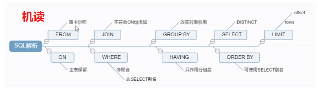
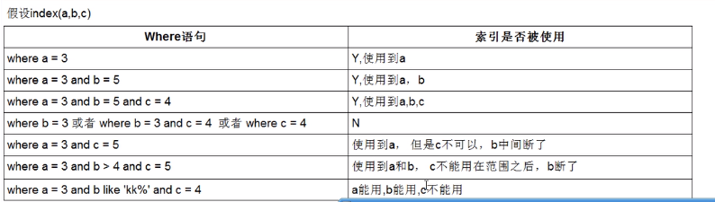

# MySql高级  
## 一、MySql基础  
1.MySQL版本：
	5.x:
	5.0-5.1:早期产品的延续，升级维护
	5.4 - 5.x :  MySQL整合了三方公司的新存储引擎 （推荐5.5）
	
	安装：rpm -ivh rpm软件名
	如果安装时 与某个软件  xxx冲突，则需要将冲突的软件卸载掉：
		yun -y remove xxx
	安装时 有日志提示我们可以修改密码：/usr/bin/mysqladmin -u root password 'new-password'
	
	注意： 
		如果提示“GPG keys...”安装失败，解决方案：
			rpm -ivh rpm软件名  --force --nodoeps
		
	验证：
	mysqladmin --version

	启动mysql应用： service mysql start
	关闭： service mysql stop
	重启： service mysql restart
	
	在计算机reboot后 登陆MySQL :  mysql
	可能会报错：   "/var/lib/mysql/mysql.sock不存在"  
	--原因：是Mysql服务没有启动
	解决 ：  启动服务： 1.每次使用前 手动启动服务   /etc/init.d/mysql start
		  	 2.开机自启   chkconfig mysql on     ,  chkconfig mysql off    
		检查开机是否自动启动： ntsysv		
		
	给mysql 的超级管理员root 增加密码：/usr/bin/mysqladmin -u root password root
					
	登陆：
	mysql -u root -p


	数据库存放目录：
	ps -ef|grep mysql  可以看到：
		数据库目录：     datadir=/var/lib/mysql 
		pid文件目录： --pid-file=/var/lib/mysql/bigdata01.pid

		MySQL核心目录：
			/var/lib/mysql :mysql 安装目录
			/usr/share/mysql:  配置文件
			/usr/bin：命令目录（mysqladmin、mysqldump等）
			/etc/init.d/mysql启停脚本
			
	  MySQL配置文件
			 my-huge.cnf	高端服务器  1-2G内存
			 my-large.cnf   中等规模
			 my-medium.cnf  一般
			 my-small.cnf   较小
			但是，以上配置文件mysql默认不能识别，默认只能识别 /etc/my.cnf
			采用 my-huge.cnf ：
			cp /usr/share/mysql/my-huge.cnf /etc/my.cnf
			注意：mysql5.5默认配置文件/etc/my.cnf；Mysql5.6 默认配置文件/etc/mysql-default.cnf
			
	默认端口3306
	mysql字符编码：
		sql  :  show variables like '%char%' ;
		可以发现部分编码是 latin,需要统一设置为utf-8
		设置编码：
		vi /etc/my.cnf:
		[mysql]
		default-character-set=utf8
		[client]
		default-character-set=utf8
		
		[mysqld]
		character_set_server=utf8
		character_set_client=utf8
		collation_server=utf8_general_ci

	重启Mysql:  service mysql restart
		sql  :  show variables like '%char%' ;
	注意事项：修改编码 只对“之后”创建的数据库生效，因此 我们建议 在mysql安装完毕后，第一时间 统一编码。
	
	mysql:清屏    ctrl+L    , system clear
		
2.原理
	  MYSQL逻辑分层 ：连接层 服务层 引擎层 存储层

	  InnoDB(默认) ：事务优先 （适合高并发操作；行锁）
	  MyISAM ：性能优先  （表锁）

	查询数据库引擎：  支持哪些引擎？ show engines ;
			查看当前使用的引擎   show variables like '%storage_engine%' ;
	
	指定数据库对象的引擎：
	create table tb(
		id int(4) auto_increment ,
		name varchar(5),
		dept varchar(5) ,
		primary key(id)		
	)ENGINE=MyISAM AUTO_INCREMENT=1
	 DEFAULT CHARSET=utf8   ;
  
## 二、sql性能下降的原因  
### 2.1 查询语句写的烂  
### 2.2 索引失效  
### 2.3 关联查询有太多的join（设计缺陷或者不得已的需求）
### 2.4 服务器调优及各个参数设置（缓冲、线程数等）
## 三、通用的Join查询  
### 3.1 SQL执行顺序  
  
  
### 3.2 七种join查询  
#### 3.2.1 A LFFT JOIN B  
  

```sql
SELECT FROM <select_list>
table_a a LEFT JOIN table_b b
ON a.key=b.key;
```  
#### 3.2.2 A RIGHT JOIN B  
  
```sql
SELECT FROM <select_list> 
table_a a RIGHT JOIN table_b b
ON a.key=b.key;
```  
#### 3.2.3 A-A交B：A左联合B，取出对应B的信息为空的部分  
  
```SQL
SELECT FROM <select_list>
table_a a LEFT JOIN table_b b
ON a.key=b.key
WHERE b.key is null;
```  
  
#### 3.2.4 B-A交B：A右联合B，取出对应A的信息为空的部分  
  
```SQL
SELECT FROM <select_list>
table_a a RIGHT JOIN table_b b
ON a.key=b.key
WHERE a.key is null;
```  
#### 3.2.5 A交B：内连接即可呀  
  
```SQL
SELECT FROM <select_list>
table_a a INNER JOIN table_b b
ON a.key=b.key;
```  
#### 3.2.6 A与B的并集（这里只用mysql的查询语句）  
  
```sql
SELECT FROM <select_list> table_a a LEFT JOIN table_b b ON a.key=b.key
UNION
SELECT FROM <select_list> table_a a RIGHT JOIN table_b b ON a.key=b.key;
```  
#### 3.2.7 A与B的并集减去交集（A-A交B）并（B-A交B）  
  

```SQL
SELECT FROM <select_list> table_a a LEFT JOIN table_b b ON a.key=b.key WHERE b.key is null
UNION
SELECT FROM <select_list> table_a a RIGHT JOIN table_b b ON a.key=b.key WHERE a.key is null;;
```  
## 四、索引简介  
### 4.1 是什么  
  
### 4.2 优势  
  
### 4.3 劣势  
  
### 4.4 mysql索引分类  
分类：
		<font color=blue>主键索引</font>：  不能重复。id    不能是null  
		<font color=blue>唯一索引</font> ：不能重复。id    <font color=red>可以是null</font>  
		<font color=blue>单值索引</font>： 单列， age ;一个表可以多个单值索引,name。  
		<font color=blue>复合索引</font> ：多个列构成的索引 （相当于 二级目录 ：  z: zhao）  (name,age)   (a,b,c,d,...,n)    
```mysql
	创建索引：
		方式一：
		create 索引类型  索引名  on 表(字段)
		单值：
		create index   dept_index on  tb(dept);
		唯一：
		create unique index  name_index on tb(name) ;
		复合索引
		create index dept_name_index on tb(dept,name);


		方式二：alter table 表名 索引类型  索引名（字段）
		
		单值：
		alter table tb add index dept_index(dept) ;
		唯一：
		alter table tb add unique index name_index(name);
		复合索引
		alter table tb add index dept_name_index(dept,name);

		注意：如果一个字段是primary key，则改字段默认就是 主键索引	
	

		删除索引：
		drop index 索引名 on 表名 ;
		drop index name_index on tb ;

		查询索引：
		show index from 表名 ;
		show index from 表名 \G
```  
### 4.5 mysql索引结构  

### 4.6 哪些情况需要建立索引  
  
### 4.7 哪些情况不需要建立索引  
  
## 五、sql性能分析  
### 5.1 能干啥  
  
  
### 5.2 名词解释  
#### 5.2.1 id和table  
表示执行顺序，相同的话执行顺序由上至下，不同的话id值越大，执行顺序越优先  
  
  
#### 5.2.2 select_type
查询的类型，主要是用于区分<font color=red>普通查询、联合查询、子查询</font>等复杂的查询。  
  
<font color=blue>SIMPLE</font>：简单的select查询，<font color=red>查询中不包含子查询或者union。</font>  
  
<font color=blue>PRIMARY</font>：查询中<font color=red>包含任何复杂的子部分</font>，**最外层查询**则被标记为primary。  
  
<font color=blue>SUBQUERY</font>：<font color=red>在select或where列表中包含了子查询</font>。  
  
<font color=blue>DERIVED</font>：<font color=red>在from列表中包含的子查询被标记为derived(衍生)</font>，mysql或递归执行这些子查询，把结果放在**临时表**里。  
  
  
<font color=blue>UNION</font>：<font color=red>若第二个select出现在union之后</font>，则被标记为union；若union包含在**from子句的子查询中**，**外层select将被标记为derived**。  
  
<font color=blue>UNION RESULT</font>：<font color=red>从union表获取结果的select</font>。  
  
  
#### 5.2.3 type  
- system与const  
  
  
  
    
- eq_ref  
  
也就是说<font color=purper>**查的字段是主键索引或唯一索引，且不能返回空值**</font>  
  
  
**确切的说是：满足条件的该字段的所有，并且该字段每个值对应的记录唯一，如果上面的teacher表有6条记录，并且有6个tcid字段，但是teacherCard表中有缺了三条与之对应的记录，那么查出来只有3条tcid的记录，并且每条记录唯一，其他该有的3条记录为空，则此时的type类型时ref**  
  
- ref  
  
**也就是说<font color=purper>明确指定了索引的值</font>，但得到了多条数据，且索引不是唯一索引或者主键索引**  
  
  
- range  
  
**也就是说<font color=purper>对索引搞了个范围</font>**  
  
  
- index  
  
**也就是说和<font color=purper>前面三种相比索引没有查询条件</font>，以至于全索引扫描。**  
  
  

- all 
  
**也就是说索引都没用上**  
  
  
#### 5.2.4 possible_key和key  
  
#### 5.2.5 key_len：索引的长度  
  
  
  
#### 5.2.6 ref：当前表的参考字段  
  
#### 5.2.7 rows：被优化后查询到的记录条数  
#### 5.2.8 Extra  
  
  
  
  
  
  
## 六、sql优化分析  
- 开胃小菜  
  
### 6.1 单表优化  
  
  
### 6.2 多表优化  
  
  
### 6.3 索引失效与优化  
#### 6.3.1 常见索引使用注意事项  
  
  
在MySQL中，like ‘%string’会全表扫描,<font color=red>以like 'string%'可以用到索引</font>，如果一定要在使用‘%string%'
或’%string‘时避免全表扫描，<font color=red>需要建立覆盖索引。</font>  
  
字符串不加单引号会索引失效  
  
#### 6.3.2 常见补救措施（其实和上一节讲的是同一样东西）   
  
#### 6.3.3 一些其他优化方法  
##### 6.3.3.1 exist和in的用法  
  
##### 6.3.3.2 order by优化  
using filesort 有两种算法：<font color=red>双路排序、单路排序 （根据IO的次数）</font>  
	<font color=blue>MySQL4.1之前</font> 默认使用 双路排序；双路：扫描2次磁盘  
	1：从磁盘<font color=red>读取排序字段</font> ,对排序字段进行排序（<font color=red>在buffer中进行的排序</font>）   
	2：<font color=red>扫描其他字段</font>   
		--IO较消耗性能  
	<font color=blue>MySQL4.1之后 </font> 默认使用 <font color=red>单路排序  ： 只读取一次（全部字段）</font>，在buffer中进行排序。  
	但种单路排序 会有一定的隐患 （<font color=red>不一定真的是“单路|1次IO”，有可能多次IO</font>）。  
	原因：如果数据量特别大，则<font color=red>无法 将所有字段的数据 一次性读取完毕，因此 会进行“分片读取、多次读取”</font>。  
		注意：<font color=red>单路排序 比双路排序 会占用更多的buffer。</font>  
			单路排序在使用时，如果数据大，可以考虑调大buffer的容量大小： ` set max_length_for_sort_data = 1024`  单位byte

如果`max_length_for_sort_data`值太低，则`mysql会自动从 单路->双路`   （太低：需要排序的列的总大小超过了max_length_for_sort_data定义的字节数）   

	提高order by查询的策略：  
	a.选择使用单路、双路 ；调整buffer的容量大小；  
	b.避免select * ...    
	c.复合索引 不要跨列使用 ，避免using filesort  
	d.保证全部的排序字段 排序的一致性（都是升序 或 降序）  
## 七、 慢查询日志  
慢查询日志:MySQL提供的一种日志记录，<font color=red>用于记录MySQL种响应时间超过阀值的SQL语句</font> （long_query_time，默认10秒）  
		慢查询日志默认是关闭的；<font color=red>建议：开发调优是 打开，而 最终部署时关闭。</font>  
		检查是否开启了 慢查询日志 ：  ` show variables like '%slow_query_log%'` ;

	临时开启：
		set global slow_query_log = 1 ;  --在内存中开启
		exit
		service mysql restart  重启之后会关闭  

	永久开启：
		/etc/my.cnf 中追加配置：
		vi /etc/my.cnf 
		[mysqld]
		slow_query_log=1
		slow_query_log_file=/var/lib/mysql/localhost-slow.log

慢查询阀值：  
		`show variables like '%long_query_time%' ;`

	临时设置阀值：
		set global long_query_time = 5 ; --设置完毕后，重新登陆后起效 （不需要重启服务）

	永久设置阀值：
			
		/etc/my.cnf 中追加配置：
		vi /etc/my.cnf 
		[mysqld]
		long_query_time=3
select sleep(4);  
	select sleep(5);  
	select sleep(3);  
	select sleep(3);  
	--查询超过阀值的SQL：  `show global status like '%slow_queries%' ; `   
	  
	(2)通过mysqldumpslow工具查看慢SQL,可以通过一些过滤条件 快速查找出需要定位的慢SQL
	mysqldumpslow --help
	s：排序方式
	r:逆序
	l:锁定时间
	g:正则匹配模式		


	--获取返回记录最多的3个SQL
		mysqldumpslow -s r -t 3  /var/lib/mysql/localhost-slow.log

	--获取访问次数最多的3个SQL
		mysqldumpslow -s c -t 3 /var/lib/mysql/localhost-slow.log

	--按照时间排序，前10条包含left join查询语句的SQL
		mysqldumpslow -s t -t 10 -g "left join" /var/lib/mysql/localhost-slow.log
	
	语法：
		mysqldumpslow 各种参数  慢查询日志的文件  
## 八、 存储过程与存储函数（插入海量数据）  
　MySQL中提供<font color=red>存储过程与存储函数机制</font>，我们姑且将存储过程和存储函数合称为存储程序。与一般的SQL语句需要先编译然后立即执行不同，存储程序是<font color=red>一组为了完成特定功能的SQL语句集</font>，经编译后存储在数据库中，当用户通过<font color=red>指定存储程序的名字并给定参数（如果该存储程序带有参数）来调用才会执行</font>。  

　　存储程序就是一条或者多条SQL语句和控制语句的集合，我们可以将其看作<font color=red>MySQL的批处理文件</font>，当然，其作用不仅限于批处理。当想要在不同的应用程序或平台上执行相同的功能一段程序或者封装特定功能时，存储程序是非常有用的。数据库中的存储程序可以看做是面向对编程中面向对象方法，它允许控制数据的访问方式。  

　　<font color=red>存储函数</font>与<font color=red>存储过程</font>有如下区别：  

　　（1）<font color=red>**存储函数的限制比较多**,例如不能用临时表,只能用表变量</font>,**而存储过程的限制较少**，存储过程的实现功能要复杂些,而函数的实现功能针对性比较强。  

　　（2）<font color=red>返回值不同。**存储函数必须有返回值,且仅返回一个结果值**</font>；存储过程可以没有返回值,但是能返回结果集(out,inout)。  

　　（3）<font color=red>调用时的不同</font>。<font color=blue>**存储函数嵌入在SQL中使用**</font>,可以在select 存储函数名(变量值)；<font color=blue>**存储过程通过call语句调用 call 存储过程名。**</font>  

　　（4）<font color=red>参数的不同。</font><font color=blue>**存储函数的参数类型类似于IN参数，**</font>没有类似于OUT和INOUT的参数。<font color=blue>**存储过程的参数类型有三种，IN、out和INOUT：**</font>  

　　　　a. in：<font color=red>输入参数，</font>数据只是<font color=blue>**从外部传入内部**</font>使用(值传递),<font color=blue>**可以是数值也可以是变量**</font>  

　　　　b. out：<font color=red>输出参数</font>只允许过程内部使用(不用外部数据),给外部使用的(引用传递:外部的数据会被先清空才会进入到内部),<font color=blue>**只能是变量**</font>  

　　　　c. inout：<font color=red>既可以是输入参数也可以是输出参数</font>，外部<font color=blue>**可以在内部使用**,**内部修改的也可以给外部使用,典型的引用 传递,只能传递变量**。</font>  
　　　　  
### 8.1 存储过程  
 定义一个根据ID查询学生记录的存储过程。  
 ```Mysql  
 DROP PROCEDURE IF EXISTS getStuById;
 
DELIMITER //  -- 定义存储过程结束符号为//,否则会错，因为默认的结束符是分号
CREATE PROCEDURE getStuById(IN stuId INT(11),OUT stuName VARCHAR(255),OUT stuAge INT(11)) -- 定义输入与输出参数
COMMENT 'query students by their id'  -- 提示信息
SQL SECURITY DEFINER  -- DEFINER指明只有定义此SQL的人才能执行，MySQL默认也是这个
BEGIN
   SELECT name ,age INTO stuName , stuAge FROM t_student WHERE id = stuId; -- 分号要加
END // -- 结束符要加
DELIMITER ;  -- 重新定义存储过程结束符为分号
 ```    
```SQL
 语法： CREATE PROCEDURE sp_name(定义输入输出参数) [ 存储特性 ]  BEGIN SQL语句；  END

IN 表示输入参数，OUT表示输出参数，INOUT表示既可以输入也可以输出的参数。sp_name为存储过程的名字。

如果此存储过程没有任何输入输出，其实就没什么意义了，但是sp_name()的括号不能省略。
```  
   
### 8.2 存储函数  
存储函数与存储过程本质上是一样的，都是封装一系列SQL语句，简化调用。  

 我们自己编写的存储函数可以像MySQL函数那样自由的被调用。  
   
```Mysql
DROP FUNCTION IF EXISTS getStuNameById;
 
DELIMITER //
CREATE FUNCTION getStuNameById(stuId INT)  -- 默认是IN，但是不能写上去。stuId视为输入的临时变量
RETURNS VARCHAR(255)   -- 指明返回值类型
RETURN  (SELECT name FROM t_student WHERE id = stuId); //  -- 指明SQL语句,并使用结束标记。注意分号位置
DELIMITER ;

```  
  
### 8.3 创建变量  
这里的变量是用在存储过程中的SQL语句中的，<font color=red>变量的作用范围在BEGIN .... END 中。</font>  
没有DEFAULT子句，<font color=red>初始值为NULL。</font>  
定义变量的操作  
```SQL

DECLARE name,address VARCHAR;  -- 发现了吗，SQL中一般都喜欢先定义变量再定义类型，与Java是相反的。
DECLARE age INT DEFAULT 20; -- 指定默认值。若没有DEFAULT子句，初始值为NULL。
```  
<font color=red>为变量赋值</font>   
```SQL
SET name = 'jay';  -- 为name变量设置值

DECLARE var1,var2,var3 INT;
SET var1 = 10,var2 = 20;  -- 其实为了简化记忆其语法，可以分开来写
-- SET var1 = 10;
-- SET var2 = 20;
SET var3 = var1 + var2;
```
### 8.4 定义条件（待续）  
  <font color=red>定义条件CONDITION定义</font>的是：在执行存储过程中的SQL语句的时候，可能出现的问题。  

 <font color=red> 定义处理程序HANDLER</font>：定义遇到了指定问题应该如何处理，避免存储过程执行异常而停止。  

  定义条件与定义处理语句程序的位置<font color=red>应该在BEGIN ... END 之间。</font>  

  定义条件的语法：`DECLARE  condtion_name CONDTION  FOR  错误码(或者错误值)`  

   错误码可以视为一个错误的引用，比如404，它代表的就是找不到页面的错误，它的错误值可以视为NullPointerException。  
### 8.5 插入海量数据  
<font color=red>准备表</font>
```mysql  
a.模拟海量数据  存储过程（无return）/存储函数（有return）
	create database testdata ;
	use testdata
create table dept
(
dno int(5) primary key default 0,
dname varchar(20) not null default '',
loc varchar(30) default ''
)engine=innodb default charset=utf8;

create table emp
(
eid int(5) primary key,
ename varchar(20) not null default '',
job varchar(20) not null default '',
deptno int(5) not null default 0
)engine=innodb default charset=utf8;
```  
<font color=red>存储函数模拟员工名称</font>  
```SQL
通过存储函数 插入海量数据：
	创建存储函数：
		randstring(6)  ->aXiayx  用于模拟员工名称


	delimiter $ 
	create function randstring(n int)   returns varchar(255) 
	begin
		declare  all_str varchar(100) default 'abcdefghijklmnopqrstuvwxyzABCDEFGHIJKLMNOPQRSTUVWXYZ' ;
		declare return_str varchar(255) default '' ;
		declare i int default 0 ; 
		while i<n		 
		do									
			set return_str = concat(  return_str,      substring(all_str,   FLOOR(1+rand()*52)   ,1)       );
			set i=i+1 ;
		end while ;
		return return_str;
		
	end $ 
```  
```SQL
--如果报错：You have an error in your SQL syntax，说明SQL语句语法有错，需要修改SQL语句；

 如果报错This function has none of DETERMINISTIC, NO SQL, or READS SQL DATA in its declaration and binary logging is enabled (you *might* want to use the less safe log_bin_trust_function_creators variable)
	是因为 存储过程/存储函数在创建时 与之前的 开启慢查询日志冲突了 
	解决冲突：
	临时解决( 开启log_bin_trust_function_creators )
		show variables like '%log_bin_trust_function_creators%';
		set global log_bin_trust_function_creators = 1;
	永久解决：
	/etc/my.cnf 
	[mysqld]
	log_bin_trust_function_creators = 1
```  
```SQL
--产生随机整数
	create function ran_num() returns int(5)
	begin
		declare i int default 0;
		set i =floor( rand()*100 ) ;
		return i ;

	end $
```  
<font color=red>存储过程插入海量数据</font>  
```SQL
--通过存储过程插入海量数据：emp表中  ，  10000,   100000
	create procedure insert_emp( in eid_start int(10),in data_times int(10))
	begin 
		declare i int default 0;
		set autocommit = 0 ;
		
		repeat
			
			insert into emp values(eid_start + i, randstring(5) ,'other' ,ran_num()) ;
			set i=i+1 ;
			until i=data_times
		end repeat ;
		commit ;
	end $


	--通过存储过程插入海量数据：dept表中  
		create procedure insert_dept(in dno_start int(10) ,in data_times int(10))
		begin
			declare i int default 0;
			set autocommit = 0 ;
			repeat
			
				insert into dept values(dno_start+i ,randstring(6),randstring(8)) ;
				set i=i+1 ;
				until i=data_times
			end repeat ;
		commit ;
			

		end$


	--插入数据
		delimiter ; 
		call insert_emp(1000,800000) ;
		call insert_dept(10,30) ;
```
## 九、show profiles和全局查询日志  
```SQL
（1）profiles  
	show variables like '%profiling%';
	set profiling = on ; 
	show profiles  ：会记录所有profiling打开之后的  全部SQL查询语句所花费的时间。
	缺点：不够精确，只能看到 总共消费的时间，不能看到各个硬件消费的时间（cpu  io ）

	(2)--精确分析:sql诊断
	 show profile all for query 上一步查询的的Query_Id
	 show profile cpu,block io for query 上一步查询的的Query_Id

	(3)全局查询日志 ：记录开启之后的全部SQL语句。 
	（这次全局的记录操作 仅仅在调优、开发过程中打开即可，在最终的部署实施时 一定关闭）
		show variables like '%general_log%';
		
		--执行的所有SQL记录在表中
		set global general_log = 1 ;--开启全局日志
		set global log_output='table' ; --设置将全部的SQL记录在表中

		--执行的所有SQL记录在文件中
		set global log_output='file' ;
		set global general_log = on ;
		set global general_log_file='/tmp/general.log' ;
		

		开启后，会记录所有SQL ： 会被记录 mysql.general_log表中。
			select * from  mysql.general_log ;
```  
## 十、锁  
### 10.1 锁的分类和概述  
锁机制 ：解决因资源共享 而造成的并发问题。  
	示例：买最后一件衣服X  
	A:  	X	买 ：  X加锁 ->试衣服...下单..付款..打包 ->X解锁  
	B:	X       买：发现X已被加锁，等待X解锁，   X已售空  

分类：  
操作类型：  
a.<font color=red>读锁（共享锁）</font>： 对同一个数据（衣服），<font color=red>多个读操作可以同时进行，互不干扰。</font>  
b.<font color=red>写锁（互斥锁）</font>： 如果当前写操作没有完毕（买衣服的一系列操作），<font color=red>则无法进行其他的读操作、写操作</font>  

操作范围：  
a.<font color=red>表锁 </font>：一次性对一张表整体加锁。<font color=red>如MyISAM存储引擎使用表锁</font>，<font color=blue>开销小、加锁快；无死锁；但锁的范围大，容易发生锁冲突、并发度低。</font>  
b.<font color=red>行锁</font> ：一次性对一条数据加锁。<font color=red>如InnoDB存储引擎使用行锁</font>，<font color=blue>开销大，加锁慢；容易出现死锁；锁的范围较小，不易发生锁冲突，并发度高（很小概率 发生高并发问题：脏读、幻读、不可重复度、丢失更新等问题）。</font>  
c.<font color=red>页锁</font>  
### 10.2 表锁：以MyISAM引擎为例  
加读锁  
  
加写锁  
  
<font color=red>读锁会阻塞写，不会阻塞读；但写锁会把读和写都堵塞；拿到锁的会话只能处理该会话中的内容。</font>  
```SQL  
示例：

	（1）表锁 ：  --自增操作 MYSQL/SQLSERVER 支持；oracle需要借助于序列来实现自增
create table tablelock
(
id int primary key auto_increment , 
name varchar(20)
)engine myisam;


insert into tablelock(name) values('a1');
insert into tablelock(name) values('a2');
insert into tablelock(name) values('a3');
insert into tablelock(name) values('a4');
insert into tablelock(name) values('a5');
commit;

	增加锁：
	locak table 表1  read/write  ,表2  read/write   ,...

	查看加锁的表：
	show open tables ;

	会话：session :每一个访问数据的dos命令行、数据库客户端工具  都是一个会话

	===加读锁：
		会话0：
			lock table  tablelock read ;
			select * from tablelock; --读（查），可以
			delete from tablelock where id =1 ; --写（增删改），不可以

			select * from emp ; --读，不可以
			delete from emp where eid = 1; --写，不可以
			结论1：
			--如果某一个会话 对A表加了read锁，则 该会话 可以对A表进行读操作、不能进行写操作； 
			-- 且 该会话不能对其他表进行读、写操作。
			--即如果给A表加了读锁，则当前会话只能对A表进行读操作。

		会话1（其他会话）：
			select * from tablelock;   --读（查），可以
			delete from tablelock where id =1 ; --写，会“等待”会话0将锁释放


		会话1（其他会话）：
			select * from emp ;  --读（查），可以
			delete from emp where eno = 1; --写，可以
			结论2：
			--总结：
				会话0给A表加了锁；其他会话的操作：a.可以对其他表（A表以外的表）进行读、写操作
								b.对A表：读-可以；  写-需要等待释放锁。
		释放锁: unlock tables ;
```

```SQL
	===加写锁：
		会话0：
			lock table tablelock write ;
	
			当前会话（会话0） 可以对加了写锁的表  进行任何操作（增删改查）；
			但是不能 操作（增删改查）其他表
		其他会话：
			对会话0中加写锁的表 可以进行增删改查的前提是：等待会话0释放写锁
```  

**MySQL表级锁的锁模式**  
  
MyISAM在<font color=red>执行查询语句（SELECT）</font>前，会自动给涉及的所有表**加读锁**；  
  
在执行<font color=red>更新操作（DML）</font>前，会自动给涉及的表**加写锁**。  

所以对MyISAM表进行操作，会有以下情况：  
  
a、对MyISAM表的<font color=red>读操作（加读锁）</font>，不会阻塞其他进程（会话）对同一表的读请求，  
  
但会阻塞对同一表的写请求。只有当读锁释放后，才会执行其它进程的写操作。  

b、对MyISAM表的<font color=red>写操作（加写锁）</font>，会阻塞其他进程（会话）对同一表的读和写操作，  
  
只有当写锁释放后，才会执行其它进程的读写操作。  
```SQL
分析表锁定：
	查看哪些表加了锁：   show open tables ;  1代表被加了锁
	分析表锁定的严重程度： show status like 'table%' ;
			Table_locks_immediate :即可能获取到的锁数
			Table_locks_waited：需要等待的表锁数(如果该值越大，说明存在越大的锁竞争)
	一般建议：
		Table_locks_immediate/Table_locks_waited > 5000， 建议采用InnoDB引擎，否则MyISAM引擎
```
### 10.3 行锁：以InnoDB引擎为例  
<font color=red>演示</font>  
```SQL

（2）行表（InnoDB）
create table linelock(
id int(5) primary key auto_increment,
name varchar(20)
)engine=innodb ;
insert into linelock(name) values('1')  ;
insert into linelock(name) values('2')  ;
insert into linelock(name) values('3')  ;
insert into linelock(name) values('4')  ;
insert into linelock(name) values('5')  ;


--mysql默认自动commit;	oracle默认不会自动commit ;

为了研究行锁，暂时将自动commit关闭;  set autocommit =0 ; 以后需要通过commit


	会话0： 写操作
		insert into linelock values(	'a6') ;
	   
	会话1： 写操作 同样的数据
		update linelock set name='ax' where id = 6;

	对行锁情况：
		1.如果会话x对某条数据a进行 DML操作（研究时：关闭了自动commit的情况下），
		则其他会话必须等待会话x结束事务(commit/rollback)后  才能对数据a进行操作。
		2.表锁 是通过unlock tables，也可以通过事务解锁 ; 行锁 是通过事务解锁。

		

	行锁，操作不同数据：
	
	会话0： 写操作
	
		insert into linelock values(8,'a8') ;
	会话1： 写操作， 不同的数据
		update linelock set name='ax' where id = 5;
		行锁，一次锁一行数据；因此 如果操作的是不同数据，则不干扰。
```  
  
    
 <font color=red>没有索引的行锁会退化成表锁</font>  
``` sql

	行锁的注意事项：
	a.如果没有索引，则行锁会转为表锁
	show index from linelock ;
	alter table linelock add index idx_linelock_name(name);

	
	会话0： 写操作
		update linelock set name = 'ai' where name = '3' ;
		
	会话1： 写操作， 不同的数据
		update linelock set name = 'aiX' where name = '4' ;
	

	会话0： 写操作
		update linelock set name = 'ai' where name = 3 ;
		
	会话1： 写操作， 不同的数据
		update linelock set name = 'aiX' where name = 4 ;

		
	--可以发现，数据被阻塞了（加锁）
	-- 原因：如果索引类 发生了类型转换，则索引失效。 因此 此次操作，会从行锁 转为表锁。
```  
  
    
<font color=red>间隙锁：锁了一个不存在的范围，其他人在没拿到锁时不能更新不存在的范围的数据</font>  
``` sql
	b.行锁的一种特殊情况：间隙锁：值在范围内，但却不存在
	 --此时linelock表中 没有id=7的数据
	 update linelock set name ='x' where id >1 and id<9 ;  
	 --即在此where范围中，没有id=7的数据，则id=7的数据成为间隙。
	间隙：Mysql会自动给 间隙 加索 ->间隙锁。即 本题 会自动给id=7的数据加 间隙锁（行锁）。
	行锁：如果有where，则实际加索的范围 就是where后面的范围（不是实际的值）
``` 
  
  
    
<font color=red>查询时加行锁</font>
```sql
	
	如何仅仅是查询数据，能否加锁？ 可以   for update 
	研究学习时，将自动提交关闭：
		set autocommit =0 ;
		start transaction ;
		begin ;
	 select * from linelock where id =2 for update ;

	通过for update对query语句进行加锁。
``` 
  
   
     
     
<font color=red>行锁的优缺点及行锁分析</font>  
``` sql
	行锁：
	InnoDB默认采用行锁；
	缺点： 比表锁性能损耗大。
	优点：并发能力强，效率高。
	因此建议，高并发用InnoDB，否则用MyISAM。

	行锁分析：
	  show status like '%innodb_row_lock%' ;
		 Innodb_row_lock_current_waits :当前正在等待锁的数量  
		  Innodb_row_lock_time：等待总时长。从系统启到现在 一共等待的时间
		 Innodb_row_lock_time_avg  ：平均等待时长。从系统启到现在平均等待的时间
		 Innodb_row_lock_time_max  ：最大等待时长。从系统启到现在最大一次等待的时间
		 Innodb_row_lock_waits ：	等待次数。从系统启到现在一共等待的次数
```    
  
## 十一、主从复制  
```SQL  
主从复制  （集群在数据库的一种实现）
	windows:mysql 主
	linux:mysql从

	安装windows版mysql:
		如果之前计算机中安装过Mysql，要重新再安装  则需要：先卸载 再安装
		先卸载：
			通过电脑自带卸载工具卸载Mysql (电脑管家也可以)
			删除一个mysql缓存文件C:\ProgramData\MySQL
			删除注册表regedit中所有mysql相关配置
			--重启计算机
			
		安装MYSQL：
			安装时，如果出现未响应：  则重新打开D:\MySQL\MySQL Server 5.5\bin\MySQLInstanceConfig.exe

		图形化客户端： SQLyog, Navicat


		如果要远程连接数据库，则需要授权远程访问。 
		授权远程访问 :(A->B,则再B计算机的Mysql中执行以下命令)
		GRANT ALL PRIVILEGES ON *.* TO 'root'@'%' IDENTIFIED BY 'root' WITH GRANT OPTION;
		FLUSH PRIVILEGES;
	
		如果仍然报错：可能是防火墙没关闭 ：  在B关闭防火墙  service iptables stop 


	实现主从同步（主从复制）：图
		1.master将改变的数 记录在本地的 二进制日志中（binary log） ；该过程 称之为：二进制日志件事
		2.slave将master的binary log拷贝到自己的 relay log（中继日志文件）中
		3.中继日志事件，将数据读取到自己的数据库之中
	MYSQL主从复制 是异步的，串行化的， 有延迟
	
	master:slave = 1:n

	配置： 
	windows(mysql: my.ini)
	  linux(mysql: my.cnf)

	配置前，为了无误，先将权限(远程访问)、防火墙等处理：
		关闭windows/linux防火墙： windows：右键“网络”   ,linux: service iptables stop
		Mysql允许远程连接(windowos/linux)：
			GRANT ALL PRIVILEGES ON *.* TO 'root'@'%' IDENTIFIED BY 'root' WITH GRANT OPTION;
			FLUSH PRIVILEGES;
	

主机（以下代码和操作 全部在主机windows中操作）：
my.ini
[mysqld]
#id
server-id=1
#二进制日志文件（注意是/  不是\）
log-bin="D:/MySQL/MySQL Server 5.5/data/mysql-bin"
#错误记录文件
log-error="D:/MySQL/MySQL Server 5.5/data/mysql-error"
#主从同步时 忽略的数据库
binlog-ignore-db=mysql
#(可选)指定主从同步时，同步哪些数据库
binlog-do-db=test	

windows中的数据库 授权哪台计算机中的数据库 是自己的从数据库：	
 GRANT REPLICATION slave,reload,super ON *.* TO 'root'@'192.168.2.%' IDENTIFIED BY 'root';
 flush privileges ; 

	查看主数据库的状态（每次在左主从同步前，需要观察 主机状态的最新值）
		show master status;  （mysql-bin.000001、 107）

从机（以下代码和操作 全部在从机linux中操作）：


my.cnf
[mysqld]
server-id=2
log-bin=mysql-bin
replicate-do-db=test

linux中的数据 授权哪台计算机中的数控 是自己的主计算机
CHANGE MASTER TO 
MASTER_HOST = '192.168.2.2', 
MASTER_USER = 'root', 
MASTER_PASSWORD = 'root', 
MASTER_PORT = 3306,
master_log_file='mysql-bin.000001',
master_log_pos=107;
	如果报错：This operation cannot be performed with a running slave; run STOP SLAVE first
	解决：STOP SLAVE ;再次执行上条授权语句


开启主从同步：
	从机linux:
	start slave ;
	检验  show slave status \G	主要观察： Slave_IO_Running和 Slave_SQL_Running，确保二者都是yes；如果不都是yes，则看下方的 Last_IO_Error。
本次 通过 Last_IO_Error发现错误的原因是 主从使用了相同的server-id， 检查:在主从中分别查看serverid:  show variables like 'server_id' ;
	可以发现，在Linux中的my.cnf中设置了server-id=2，但实际执行时 确实server-id=1，原因：可能是 linux版Mysql的一个bug，也可能是 windows和Linux版本不一致造成的兼容性问题。
	解决改bug： set global server_id =2 ;

	stop slave ;
	 set global server_id =2 ;
	start slave ;
	 show slave status \G

	演示：
	主windows =>从

	windows:
	将表，插入数据  
	观察从数据库中该表的数据


数据库+后端

	spring boot（企业级框架,目前使用较多）  
```


