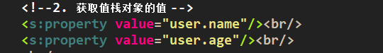

# OGNL表达式与值栈  
## 一、OGNL表达式  
 OGNL 的全称是对象图导航语言 ( Object-Graph Navigation Language )，它是一种功能强大的开源表达式语言，使用这种表达式语言，可以通过某种表达式语法，存取Java对象的任意属性，调用Java对象的方法，同时能够自动实现必要的类型转换。如果把表达式看作是一个带有语义的字符串，那么OGNL无疑成为了这个语义字符串与Java对象之间沟通的桥梁。  
### 1.1 OGNL三要素  
#### 1.1.1 表达式  
 表达式是整个OGNL的核心，OGNL会根据表达式去对象中取值。所有OGNL操作都是针对表达式解析后进行的。它表明了此次OGNL操作要"做什么"。表达式就是一个带有语法含义的字符串，这个字符串规定了操作的类型和操作的内容。OGNL支持大量的表达式语法，不仅支持这种“链式”对象访问路径，还支持在表达式中进行简单的计算。  
#### 1.1.2 根对象(Root)  
Root对象可以理解为OGNL的操作对象，表达式规定了“做什么”，而Root对象则规定了“对谁操作”。OGNL称为对象图导航语言，**所谓对象图，即以任意一个对象为根，通过OGNL可以访问与这个对象关联的其它对象。**  
#### 1.1.3 Context对象  
实际上OGNL的取值还需要一个上下文环境。设置了Root对象，OGNL可以对Root对象进行取值或写值等操作，Root对象所在环境就是OGNL的上下文环境(Context )。上下文环境规定了OGNL的操作“在哪进行”。上下文环境Context是一个Map类型的对象，在表达式中访问Context中的对象，需要使用“#”号加上对象名称，即“#对象名称”的形式。  
  
### 1.2 OGNL的使用  
struts2导入的相关包中已经包含了OGNL的包，不用格外导入。  
#### 1.2.1 OGNL环境准备  
  
#### 1.2.2 获取OGNL Root对象中的属性值  
  
#### 1.2.3 获取Context对象中的Map集合的属性值  
  
#### 1.2.4 设置Root和Context对象中各属性的值  

#### 1.2.5 利用OGNL表达式调用方法  
  
#### 1.2.6 利用OGNL表达式调用静态方法  
  
#### 1.2.7 利用OGNL表达式创建对象  
  
## 二、ognl表达式与struts2结合原理  
## 三、值栈概念和获取值栈  
  
## 四、值栈对象及其内部结构  
每次访问action时都会创建一个对象，每个action中只有一个值栈对象。  
  
  
  
  
  
## 五、Action向值栈中存数据  
### 5.1 向值栈中放数据的三种方法  
#### 5.1.1 set方法  
  
#### 5.1.2 push方法  
  
前两种方法会压栈到root空间上，后一种会放到action的属性中。  
#### 5.1.3 定义变量并生成get方法即可  
  
  
### 5.2 存放字符串、对象和list集合  
见5.1.3节即可。  
## 六、结果页面(jsp页面)从值栈中取数据  
先在值栈中放数据呗。  
  
因为放的数据都作为action的添加属性，及其属性值存在，所以用OGNL表达式直接获取即可。  
### 6.1 取字符串  
先添加OGNL的标签啊。  
  
  
### 6.2 取对象  
  
### 6.3 取list集合  
  
  

  
## 七、其它获取值栈数据的方法(针对set和push的方式)  
set和push把它放置于action之上，实时压栈。  
  
  
## 八、#在值栈中的应用  
当然是获取ActionContext中的数据了，它是一个map集合，参考OGNL的使用就知道其用法了。  
值栈中存了很多域对象，只要在我们获得了某个域对象，并设置了什么参数，就可以用OGNL表达式在页面中获取。  
比如我们粗鄙的获取原生request对象后设置值如下：  
  
那么就可以在结果页面中获得：  
  
  
值栈是用来放数据的，替代域对象。  
  
所以获取原生域对象是不齿的，struts2建议不放在Servlet域对象中，而只推荐放在值栈的root中。  
  