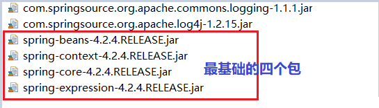
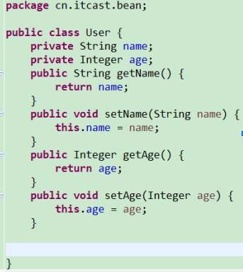

# spring学习日志一  
## 一、spring介绍  
### 1.1 spring简介  
  
  
### 1.2 为啥学spring  
  
## 二、spring环境搭建  
### 2.1 导包  
  
  
### 2.2 创建一个对象  
  
### 2.3 书写配置文件注册对象到容器  
位置任意(`建议放到src下`)  
配置文件名任意(建议`applicationContext.xml`)  
  
### 2.4 测试  
  
## 三、spring的几个思想及概念  
### 3.1 IOC思想  
  
简而言之，就是把<font color=red>我们创建对象的方式反转了</font>。以前对象的创建时由我们开发人员维护的。包括依赖关系也是自己注入的。使用spring之后，<font color=red>对象的创建以及依赖关系可以由spring完成创建以及注入</font>。反转控制就是反转了对象的创建方式。从我们自己创建反转给了程序(spring)。  
### 3.2 依赖性注入(DI,Dependency  Injection)  
<font color=red>依赖注入（DI）是控制反转（Ioc）的一种方式</font>。依赖注入这个词让人望而生畏，现在已经演变成一项复杂的编程技巧 或设计模式理念。但事实证明，依赖注入并不像它听上去那么复杂。 在项目中应用DI，你会发现你的代码会变得异常简单并且更容易理解 和测试。DI功能是如何实现的任何一个有实际意义的应用（肯定比Hello World示例更复杂）都会由两个或者更多的类组成，这些类相互之间进行协作来完成特定的业务逻辑。<font color=blue>按照传统的做法，每个对象负责管理与自己相互协作的对象（即它所依赖的对象）的引用，这将会导致高度耦合和难以测试的代码。</font>  
  
### 3.3 BeanFactory接口与ApplicationContext接口与Bean元素  
  
Spring有两个核心`接口`：`BeanFactory`和`ApplicationContext`，其中ApplicationContext是BeanFactory的`子接口`。  
他们都可代表<font color=purple>**Spring容器**</font>。  
  

Spring容器是<font color=red>生成Bean实例的工厂</font>，并且管理容器中的Bean。  
Bean是<font color=red>Spring管理的基本单位</font>，在基于Spring的Java EE应用中，<font color=red>所有的组件都被当成Bean处理，包括数据源、Hibernate的SessionFactory、事务管理器等</font>。在Spring中，Bean的是<font color=red>一个非常广义的概念，任何的Java对象、Java组件都被当成Bean处理</font>。  
 而且应用中的所有组件，都处于Spring的管理下，都被Spring以Bean的方式管理，<font color=blue>Spring负责创建Bean实例</font>，并管理他们的生命周期。Bean在Spring容器中运行，无须感受Spring容器的存在，一样可以接受Spring的依赖注入，包括<font color=blue>Bean属性的注入，协作者的注入、依赖关系的注入等</font>。  
Spring容器负责创建Bean实例，所以<font color=blue>需要知道每个Bean的实现类</font>，Java程序面向接口编程，无须关心Bean实例的实现类；但是Spring容器必须能够精确知道每个Bean实例的实现类，因此<font color=blue>Spring配置文件必须精确配置Bean实例的实现类</font>。  
## 四、spring配置详解  
业界一般命名为applicationContext.xml，位置任意。  
### 4.1 bean的实例化方式  
#### 4.1.1 默认构造  
只要创建了我们的实体类(bean，entity，这里其实可以弱化为任何类)，<font color=red>必有默认构造方法。</font>  
然后只需要我们在配置文件配置bean元素基本配置即可。  
```xml
    <bean name="给类取的名字"  class="类的全路径名"></bean>
```  
#### 4.1.2 静态工厂  
常用于spring整合其他框架(工具)  
  
配置时要<font color=red>指定静态工厂类创建对象的静态方法</font>：`factory-method`  
  
测试代码都是一样的，下面不会再提  

#### 4.1.3 实例工厂  
先有工厂实例对象，再有目标对象，不是静态方法  
  
  
### 4.2 bean的种类  
  
<font color=blue size=4>**普通bean**</font>: 之前操作的都是普通bean。`<bean name="" class="A">` ，<font color=red>spring直接创建A实例，并返回</font>。  
<font color=blue size=4>**FactoryBean**</font>：是一个<font color=red>特殊的bean</font>，具有<font color=red>工厂生成对象能力</font>，只能生成特定的对象。这个bean<font color=red>实现 FactoryBean接口，并覆盖 getObject() </font>，由<font color=green>getObject()的返回值特定bean</font>。
```
	<bean name="" class="FB"> 先创建FB实例，使用调用getObject()方法，并返回方法的返回值  
		FB fb = new FB();  
		return fb.getObject();  
```
<font color=blue size=4>**BeanFactory 和 FactoryBean 对比**</font>  
	BeanFactory：<font color=Orange>**工厂**</font>，用于**生成任意bean**。  
	FactoryBean：<font color=Orange>**特殊bean**</font>，用于生成另一个特定的bean。例如：ProxyFactoryBean ，<font color=red>此工厂bean用于生产代理</font>。比如<bean name="" class="....ProxyFactoryBean">获得代理对象实例。AOP使用  
### 4.3 bean的scope属性(作用域)  
  
### 4.4 bean的生命周期  
  
  
### 4.5 spring的分模块配置  
  

## 五、spring属性注入  
### 5.1 set方式注入  
  
  
### 5.2 构造函数注入  
  
  
### 5.3 p名称空间注入（了解）  
  
### 5.4 spel注入 （了解） 
  
### 5.5 复杂数据类型注入  
先提供一个bean  
  
#### 5.5.1 数组类型注入  
  
#### 5.5.2 List类型注入  
  
#### 5.5.3 Map类型注入  
  
#### 5.5.4 properties类型注入  
  
## 六、 导入约束步骤介绍  
  
  
  
  
  
## 七、谈依赖注入和控制反转的区别  
  