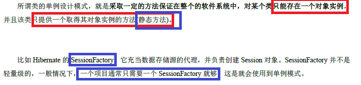

# 设计模式  
## 为什么要学设计模式  
  
  
## 一、设计模式的七大原则  
### 1.1 单一职责原则（鄙人称之为专一原则一）  
#### 基本介绍  
对类来说的，即<font color=red>一个类应该只负责一项职责</font>。如类A负责两个不同职责两个不同职责1，职责2。 当职责1需求变更而改变A时，可能造成职责2执行错误， 所以需要将类A的粒度分解为 A1，A2。  
#### 应用实例  

### 1.2 接口隔离原则（鄙人称之为专一原则二）  
  
  
### 1.3 依赖倒转原则（鄙人称之为接口使用原则）  
#### 基本介绍
依赖倒转原则 (Dependence Inversion )是指：  
  
1. 高层模块不应该依赖低层模块，<font color=red>二者都应该依赖其抽象</font>  
  
2.  抽象不应该依赖细节，<font color=red>细节应该依赖抽象</font>  
  
3.  依赖倒转(倒置 )的中心思想是<font color=red>面向接口编程</font>  
  
4. 依赖倒转原则是基于这样的设计理念：相对于细节的多变性，<font color=red>抽象东西要稳定多</font>。以抽象为基础搭建的架构比以细节为基础的架构要稳定得多。在 java 中，抽象指的是接口或抽象类，细节就具体实现类  
  
5. 使用接口或抽象类的目是制定好规范，而不涉及任何具体操作把展现细节任务交给他们的实现类去完成  
  
#### 应用实例  
  
#### 依赖(使用)关系的三种传递方式
##### 接口传递方式 
  
##### 构造方法传递方式  
  
##### setter方法传递方式  
  
#### 注意事项与细节  
依赖倒转原则的注意事项和细节 依赖倒转原则的注意事项和细节  
  
1. <font color=blue>低层模块</font>尽量<font color=red>都要有抽象类或接口</font>，或者都有，程序稳定性更好 .  
  
2. <font color=red>变量的声明类型尽是抽象或接口</font>, 这样我们的变量引用和实际对象间，就存在 一个缓冲层，利于程序 扩展 和优化  
  
3. <font color=red>继承时遵循里氏替换原则</font>  
  
### 1.4 里氏替换原则（鄙人称之为继承使用原则）  
OO 中的继承性思考和说明中的继承性思考和说明:  
  
1. 继承包含这样一层义：父类中凡是已经实现好的方 法， 实际上是<font color=red>在设定规范和契约</font>，虽然它不强制要求所有的子类必须遵循这些契约(<font color=red>遵循契约
 在此也就是不覆盖父类的方法</font>)，但是如果对些已经实现的方法任意修改(<font color=red>也就是覆盖</font>)，就会对整个继承体系造成破坏 。  
  
2. 继承在给程序设计带来便利的同时，也带来了弊端。比如<font color=red>使用继承会给程序侵 入性，程序的可移植降低，增加对象间耦合</font>。如果一个类被其他所继承则当<font color=red>这个类需要修改时，必须考虑到所有的子类</font>，并且父后涉及类的功能都有可产生故 障  
  
3. 问题提出：在编程中，如何正确的使用继承 ? => ? => 里氏替换原则  
  
#### 基本介绍 
1. 里氏替换原则 (Liskov Substitution Principle )在1988 年，由麻省理工学院的以为姓里 的 女士提出。  
  
2.  如果对每个类型 为T1 的对象 o1 ，都有类型为 T2 的对象 o2 ，使得以 T1 定义的所有程序 P在所有的对象 o1 都代换成 o2 时，程序 P的行为没有发生变化，那么类型 T2 是类型 T1 的子类型 。换 句话说，<font color=red>所有引用基类的地方必须能透明使其子对象</font> 。
  
3.  在使用继承时，遵循里氏替换原则<font color=red>在子类中尽量不要重写父类的方 法</font>  
  
4. 里氏替换原则告诉我们， <font color=red>继承实际上让两个类耦合性增强了</font>。在适当的情况下，可 以通过<font color=blue>**聚合，组合，依赖**</font>来解决问题。 .
#### 应用介绍  
  

### 1.5 开闭原则（鄙人称之为不修改但扩展原则）  
#### 基本介绍  
  
1. 开闭原则（ Open Closed Principle ）是编程中<font color=red>最基础、最重要的设计原则</font>  
  
2. 一个软件实体如类，模块和函数应该<font color=red>对扩展开放(对提供方 )，对修改关闭(对使用 方)</font>。用抽象构建框架，实现扩展细节 。
  
3. 当软件需要变化时，尽量通过<font color=blue>**扩展软件实体的行为**</font>来实现现变化，<font color=red>**而不是通过修改**</font>已有的代码来实现变化 。
  
4. 编程中遵循其它原则，以及使用设计模式的目<font color=red>就是遵循开闭原则</font>。  
  
#### 应用实例  
  
### 1.6 迪米特法则（鄙人称之为非局部变量原则）  
#### 基本介绍
1. 一个对象应该其他保持最少的了解  
  
2. 类与类关系越密切，耦合度大  
  
3. 迪米特法 则( Demeter Principle )又叫<font color=red>最少知道原则</font> ，即一个类对自己依赖的 知道越少好。也就是说，对于被依赖的类不管多么复杂都尽量将逻辑封装在内部。<font color=red>对外除了提供的 public 方法，不对外泄露任何信息</font>  
  
4. 迪米特法则还有个更简单的定义：只与直接朋友通信</font>  
  
5. <font color=red>**直接的朋友**</font> ：每个对象都会与其他象有耦合关系， 只要两个对象之间<font color=red>**有耦合**我们就说这两个对象之间是**朋友关系**</font>。耦合的方式很多，<font color=red>**依赖，关联，组合，聚合**等</font>。其中，我们称出现<font color=blue>**成员变量、方法参数、返回值**的类为直接朋友</font>，而出现<font color=red>在局部变量中的类</font>不是直接朋友。也就说，<font color=blue>陌生的类最好不要以局部变量的形式出现在类内部</font>。
#### 应用实例  
  
  
迪 米特法则 的 核心是<font color=red>降低类之间的耦合</font>  
但 是注意：由 于每个类都减少了不必要的依赖，因此迪米特 则只是要求降低  
类间对象间耦合关系， 并不是要求完全没有依赖关系  
### 1.7 合成复用原则（鄙人称之为最好合成与聚合原则）  
原则是尽量使用<font color=red>合成、聚合的方式</font>，而不是使用继承  
  
## 二、UML类图  
### 2.1 UML类图介绍  
  
  
  
  
### 2.2 类的依赖、泛化和实现  
#### 2.2.1 依赖：类中用到了对方，就存在依赖关系  
  
#### 2.2.2 泛化：就是继承关系，是依赖关系的特例  
  
#### 2.2.3 实现：类实现接口，同样是依赖关系的特例  
  

### 2.3 类的关联、聚合和组合  
#### 2.3.1 类的关联关系：也是依赖的一种特例  
  
#### 2.3.2 类的聚合关系：整体与部分可以分离  
  
#### 2.3.3 类的组合关系：整体与部分不可分离  
  

### 2.4 类图的六大关系总结  
## 三、设计模式概述和分类  
### 3.1 介绍  
  
### 3.2 分类  
#### 3.2.1 创建型模式  
- 单例模式  
- 抽象工厂模式  
- 原型模式  
- 建造者模式  
- 工厂模式  
#### 3.2.2 结构型模式  
- 适配器模式
- 桥接模式
- 装饰模式
- 组合模式
- 外观模式
- 享元模式
- 代理模式
#### 3.2.3 行为型模式  
- 模板方法模式
- 命令模式
- 访问者模式
- 迭代器模式
- 观察者模式
- 中介模式
- 备忘录模式
- 解释器模式
- 状态模式
- 策略模式
- 职责链模式
## 四、单例模式  
### 4.1 单例模式介绍  

### 4.2 单例设计模式的八种方法  
### 4.3 两种饿汉式（类加载的时候就会创建对象，完成实例化）  
因为<font color=red>类加载就创建，完成实例化，避免了线程同步的问题</font>，因为是立即的，马上的，相当于原子的  
#### 4.3.1 饿汉式一（使用静态变量）：内部静态方法返回静态变量  
  
#### 4.3.2 饿汉式二（使用静态代码块）：创建对象在静态代码块中，返回对象在静态方法中  
  
### 4.4 三种懒汉式（都不能用，要么效率太低，要么不安全，类加载的时候不会立即实例化）  
#### 4.4.1 懒汉式一：不同步，线程不安全（判断和创建过程没有加锁或者别的同步方法）
``` java
    public class SingletonTest03 {
    	public static void main(String[] args) {
    		System.out.println("懒汉式1 ， 线程不安全~");
    		Singleton instance = Singleton.getInstance();
    		Singleton instance2 = Singleton.getInstance();
    		System.out.println(instance == instance2); // true
    		System.out.println("instance.hashCode=" + instance.hashCode());
    		System.out.println("instance2.hashCode=" + instance2.hashCode());
    	}
    }

    class Singleton {
    	private static Singleton instance;
    	
    	private Singleton() {}
    	
    	//提供一个静态的公有方法，当使用到该方法时，才去创建 instance
    	//即懒汉式
    	public static Singleton getInstance() {
    		if(instance == null) {
    			instance = new Singleton();
    		}
    		return instance;
    	}
}
```  

起到了懒加载的作用  
多线程下，<font color=red>**如果一个线程进入了`if(instance == null)`判断停止了**</font>，还未来得及执行下去，那么其他线程进行判断，将会产生多个实例  
实际开发中，不要使用这种方式  

#### 4.4.2 懒汉式二：同步方法，线程安全（判断过程同步了创建的方法）   
  
```java
// 懒汉式(线程安全，同步方法)
    class Singleton {
    	private static Singleton instance;
    	
    	private Singleton() {}
    	
    	//提供一个静态的公有方法，加入同步处理的代码，解决线程安全问题
    	//即懒汉式
    	public static synchronized Singleton getInstance() {
    		if(instance == null) {
    			instance = new Singleton();
    		}
    		return instance;
    	}
    }
```
优缺点说明  

解决了线 程不安全问题  

效率太低了，每个线程在想获得类的实例时候，执行 getInstance() 方法都要进行同步。  
  
而其实这个方法只执行一次实例化代码就够了，后面的想获得该类实例，  
   
直接 return 就行了。<font color=red>**方法进行同步效率太低**</font>  
  
结论： 在实际开发中， 不推荐使用这种方 式  
#### 4.4.3 懒汉式三 ：同步代码块，线程安全，同样效率低  
```java  
// 懒汉式(线程安全，同步方法)
class Singleton {
	private static volatile Singleton instance;
	
	private Singleton() {}
	
	
	public static  Singleton getInstance() {
			
				if(instance == null) {
				    synchronized (Singleton.class) {
					instance = new Singleton();
				    }
			    }
			
		return instance;
	}
}
```  
### 4.5 双重检查（推荐使用）  
```java
public class Singleton {
    private static \*volatile*\ Singleton uniqueSingleton;

    private Singleton() {
    }

    public Singleton getInstance() {
        if (null == uniqueSingleton) {
            synchronized (Singleton.class) {
                if (null == uniqueSingleton) {
                    uniqueSingleton = new Singleton();   // error
                }
            }
        }
        return uniqueSingleton;
    }
}
```  
如果这样写，运行顺序就成了：  

- 检查变量是否被初始化(不去获得锁)，如果已被初始化则立即返回。  
- 获取锁。
- 再次检查变量是否已经被初始化，如果还没被初始化就初始化一个对象。
执行双重检查是因为，<font color=red>如果多个线程同时了通过了第一次检查，并且其中一个线程首先通过了第二次检查并实例化了对象，那么**剩余通过了第一次检查的线程就不会再去实例化对象**</font>。

这样，除了初始化的时候会出现加锁的情况，后续的所有调用都会避免加锁而直接返回，解决了性能消耗的问题。  
  
Double Check 概 念 是 多 线程开 发中常使用到的， 如代码中所示，我们进行了两次 if (singleton == null) 检查，这样就可以保证线程安全了 。  
  
这 样，实例化代码只用执行一次，后面再次访问时，判断 if (singleton == null)直接 return 实例化对 象，也避免的反复进行方法同步  

<font color=red>线程安全；延迟加载；效率较高</font>  
  
结论：在实际开发中，<font color=red>推荐使用这种单例设计模式</font>  
### 4.6 静态内部类（推荐使用）  
```java  
// 静态内部类完成， 推荐使用
class Singleton {
	private static volatile Singleton instance;
	
	//构造器私有化
	private Singleton() {}
	
	//写一个静态内部类,该类中有一个静态属性 Singleton
	private static class SingletonInstance {
		private static final Singleton INSTANCE = new Singleton(); 
	}
	
	//提供一个静态的公有方法，直接返回SingletonInstance.INSTANCE
	
	public static synchronized Singleton getInstance() {
		
		return SingletonInstance.INSTANCE;
	}
}
```  
<font color=red>静态内部类不会主动加载，又不是静态代码块</font>  
  
这 种方式采 用了类装载的机制来保证初始化实例时只有一个线程 。  

静 态内部类方式在 Singleton 类被装载时并不会立即实例化，<font color=red>而是在需要实例化时，调用 getInstance 方法</font>，才会装载 SingletonInstance 类，从而完成 Singleton 的实例化 。  
  
类 的<font color=red>**静态属性**只会在第一次加载类的时候初始化</font>，所以在这里， JVM 帮助我们保证了线程的安全性，在类进行初始化时，别的线程是无法进入的 。  
  
优 点：<font color=red>避免了线程不安全 ，利用静态内部类特点实现延 迟加载，效率 高</font>  
  
结 论：推荐使用  
### 4.7 枚举（推荐使用）  
```java  
public class SingletonTest08 {
	public static void main(String[] args) {
		Singleton instance = Singleton.INSTANCE;
		Singleton instance2 = Singleton.INSTANCE;
		System.out.println(instance == instance2);
		
		System.out.println(instance.hashCode());
		System.out.println(instance2.hashCode());
		
		instance.sayOK();
	}
}

//使用枚举，可以实现单例, 推荐
enum Singleton {
	INSTANCE; //属性
	public void sayOK() {
		System.out.println("ok~");
	}
}
```  
  
### 4.8 单例模式总结  
单例模式注意事项和细节说明
单例模式
注意事项和细节说明

单例模式保证了 系 统内存中该类只存在一个对象，节省了系统资源，对于一些需要频繁创建销毁的对象，使用单例模式可以提高系统性能

当想实例化一个单例类的时候，<font color=red>必须要记住使用相应的获取对象的方法，而不是使用new</font>  

单例模式使用的场景：需要<font color=red>频繁的进行创建和销毁的对象、创建对象时耗时过多或耗费资源过多</font>   
即：<font color=red>重量级对象 但又经常用到</font>的对 象、工 具类对象、频繁访问数据库或文 的对象 <font color=red>比如数据源、 session 工厂 等</font>  


## 五、工厂模式  
