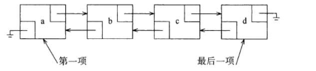
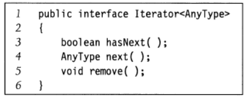
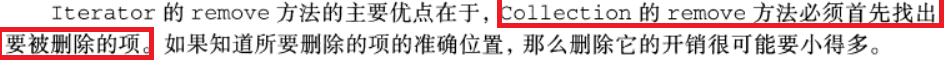
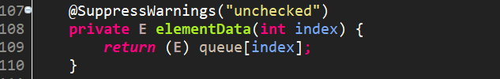
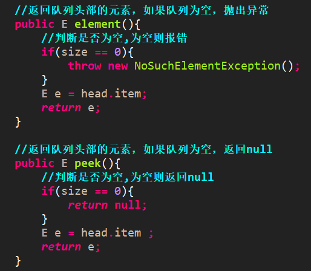

## 一、抽象数据类型  
抽象数据类型(abstract data type, ADT)是<font color=red>带有一组操作的一些对象的集合</font>。抽象数据类型是数学的抽象;在ADT的定义中<font color=red>没有具体提到关于这组操作是如何实现</font>。对于集合ADT，可以有像添(add ) ,删除(remove)以及包含(contain)这样一些操作。当然，也可以只要两种操作并(union)和查找(find )，这两种操作又在这个集合上定义了一种不同的ADT。对于每种ADT并不存在什么法则来告诉我们必须有哪些操作。  
## 二、数据的逻辑结构与物理结构  
### 2.1 逻辑结构
逻辑结构表示<font color=red>数据之间的逻辑关系</font>，有一对一，一对多，多对多的关系，有四种结构如下:  
<font color=red>**集合结构** </font>: 集合结构中的元素关系，<font color=blue>除了同属于一个集合</font>这个关系以外，再无其他关系。  
<font color=red>**线性结构**</font>：线性结构中，元素间的关系就是<font color=blue>一对一</font>，顾名思义，一条线性的结构。  
<font color=red>**树形结构**</font>：树形结构中，元素间的关系就是<font color=blue>一对多</font>，一颗大叔，伸展出的枝叶，也是类金字塔形。  
<font color=red>**图形结构**</font>：图形结构中，元素间的关系就是<font color=blue>多对多</font>，举例：一个人可以通过6个人间接认识到世界上的每一个人。类蛛网形。  
### 2.2 物理结构
物理结构就是讲究**内存的存储方式**：  
<font color=red>**顺序存储结构**</font>：是把数据元素存放在地址<font color=blue>连续存储单元里</font>。  
<font color=red>**链式存储结构**</font>：链式存储结构是把<font color=blue>数据元素存放在任意的存储单元里</font>，这组存储单元可以是连续的也可以是不连续的。这样的话链式存储结构的数据元素存储关系并不能反映其逻辑关系，因此需要用一个指针存放数据元素的地址，这样子通过地址就可以找到相关数据元素的位置。  
### 2.3 存取结构  
表示查询某种数据结构的某个元素的时间度量。  
与该数据长度有关：**顺序存取结构**。如链表  
与该数据长度无关：**随机存取结构**。如线性表的顺序存储结构  
## 三、线性表ADT  
线性表（List）：由<font color=red>零个或多个数据元素组成的有限序列</font>。  
1. 线性表是一个<font color=red>序列</font>。  
2. 0个元素构成的线性表是空表。  
3. 线性表中的<font color=red>第一个元素无前驱，最后一个元素无后继</font>，<font color=blue>其他元素有且只有一个前驱和后继</font>。  
4. 线性表是有长度的，其长度就是元素个数，且线性表的元素个数是有限的，也就是说，线性表的<font color=red>长度是有限的。</font>  
### 3.1 线性表的简单数组实现
Java中的数组根本不需要对表的大小进行估计，因为可以随时扩容。  
```java
    int[] arr=new int[10];
    ...
    //扩容arr
    int[] newArr=new int[arr.length*2];
    for(int i=0;i<arr.length;i++)
      newArr[i]=arr[i];
    arr=newArr;
```
查询快，插入和删除慢  
### 3.2 单链表  
  
链表由一系列节点组成，这些节点不必在内存中相连。每一个节点均存储<font color=red>本节点的元素值</font >和<font color=red>指向该元素后继元的节点的链( link )</font >。我们称之为next链。最后一个单元的next链引用null。  
查询需要找到头结点，时间复杂度为O(n),插入和删除也是O(n),因为都要遍历。但它<font color=red>适合大量的插入和删除操作</font >。  
### 3.3 双向链表  
  
## 四、Java Collections API中的线性表  
### 4.1 Collection接口  
Collections API位于java. util包中。集合(collection)的概念在Collection接口中得到抽象，它存储一组类型相同的对象。  
Collection接口**扩展**了Iterable接口。<font color=red>实现Iterable接口的那些类可以拥有增强的for循环</font>。  
  
### 4.2 Iterator接口  
<font color=blue>实现Iterable接口的集合必须提供一个称为iterator的方法</font>，该方法返回一个类型的对象。  
  
  
### 4.3 List接口  
```java
   public interface List<AnyType> extends Collection<AnyType>{
       AnyType get(int idx);
       AnyType set(int idx,AnyType newVal);
       void add(int idx,AnyType x);
       void remove(int idx);
       
       ListIterator<AnyType> listIterator(int pos);
   }
```
<font color=red></font> 
<font color=blue></font> 
List ADT的两种流行实现方式：  
<font color=red>**ArrayList类**</font>：提供<font color=blue>**可增长数组**</font>的实现方式，是线性表的<font color=blue>**顺序存储结构**</font>。优点：get和set方法花费常数时间，<font color=blue>**插入和删除代价昂贵**</font>。  
<font color=red>**LinkedList类**</font>：<font color=blue>双链表结构实现</font>，在**指定位置**<font color=blue>插入和删除很容易</font>，缺点是不容易作索引，<font color=blue>**调用get方法昂贵**</font>。  
  
### 4.4 ListIterator接口  
```java
    public interface ListIterator<AnyType> extends Iterator<AnyType>{
        boolean hasPrevious();
        AnyType previous();
    
        void add(AnyType x);
        void set(AnyType newVal);
    }
```
## 五、链表  
### 5.1 ArrayList  

### 5.2 LinkedList（JDK1.6：双向链表）  
```java
public class LinkedList<E>
    extends AbstractSequentialList<E>
    implements List<E>, Deque<E>, Cloneable, java.io.Serializable
      从这段代码中我们可以清晰地看出LinkedList继承AbstractSequentialList，实现List、Deque、Cloneable、Serializable。
      其中AbstractSequentialList提供了 List 接口的骨干实现，从而最大限度地减少了实现受“连续访问”数据存储（如链接列表）
      支持的此接口所需的工作,从而以减少实现List接口的复杂度。
      Deque一个线性 collection，支持在两端插入和移除元素，定义了双端队列的操作。
```
#### 5.2.1 属性
在LinkedList中提供了两个基本属性size、header。  
`private transient Entry header = new Entry(null, null, null);`  
`private transient int size = 0;`  
其中<font color=red>size表示的LinkedList的大小，header表示链表的表头，Entry为节点对象</font>。  
```java
private static class Entry<E> {
    E element;        //元素节点
    Entry<E> next;    //下一个元素
    Entry<E> previous;  //上一个元素

    Entry(E element, Entry<E> next, Entry<E> previous) {
        this.element = element;
        this.next = next;
        this.previous = previous;
    }
}
  上面为Entry对象的源代码，Entry为LinkedList的内部类，它定义了存储的元素。
  该元素的前一个元素、后一个元素，这是典型的双向链表定义方式
```
#### 5.2.2 构造方法  
```java
/**
     *  构造一个空列表。
     */
    public LinkedList() {
        header.next = header.previous = header;
    }
    
    /**
     *  构造一个包含指定 collection 中的元素的列表，这些元素按其 collection 的迭代器返回的顺序排列。
     */
    public LinkedList(Collection<? extends E> c) {
        this();
        addAll(c);
    }
```
LinkedList()构造一个空列表。里面没有任何元素，仅仅只是将header节点的前一个元素、后一个元素都指向自身。  
LinkedList(Collection<? extends E> c)： <font color=red>构造一个包含指定 collection 中的元素的列表</font>，这些元素按其 collection 的<font color=red>迭代器返回的顺序排列</font>  。该构造函数<font color=red>首先会调用LinkedList()</font>，<font color=red>构造一个空列表</font>，然后<font color=red>调用了addAll()方法</font>将Collection中的所有元素添加到列表中。以下是addAll()的源代码：
```java
/**
     *  添加指定 collection 中的所有元素到此列表的结尾，顺序是指定 collection 的迭代器返回这些元素的顺序。
     */
    public boolean addAll(Collection<? extends E> c) {
        return addAll(size, c);
    }
    
/**
 * 将指定 collection 中的所有元素从指定位置开始插入此列表。其中index表示在其中插入指定collection中第一个元素的索引
 */
public boolean addAll(int index, Collection<? extends E> c) {
    //若插入的位置小于0或者大于链表长度，则抛出IndexOutOfBoundsException异常
    if (index < 0 || index > size)
        throw new IndexOutOfBoundsException("Index: " + index + ", Size: " + size);
    Object[] a = c.toArray();
    int numNew = a.length;    //插入元素的个数
    //若插入的元素为空，则返回false
    if (numNew == 0)
        return false;
    //modCount:在AbstractList中定义的，表示从结构上修改列表的次数
    modCount++;
    //获取插入位置的节点，若插入的位置在size处，则是头节点，否则获取index位置处的节点
    Entry<E> successor = (index == size ? header : entry(index));
    //插入位置的前一个节点，在插入过程中需要修改该节点的next引用：指向插入的节点元素
    Entry<E> predecessor = successor.previous;
    //执行插入动作
    for (int i = 0; i < numNew; i++) {
        //构造一个节点e，这里已经执行了插入节点动作同时修改了相邻节点的指向引用
        //
        Entry<E> e = new Entry<E>((E) a[i], successor, predecessor);
        //将插入位置前一个节点的下一个元素引用指向当前元素
        predecessor.next = e;
        //修改插入位置的前一个节点，这样做的目的是将插入位置右移一位，保证后续的元素是插在该元素的后面，确保这些元素的顺序
        predecessor = e;
    }
    successor.previous = predecessor;
    //修改容量大小
    size += numNew;
    return true;
}
  在addAll()方法中，涉及到了两个方法，一个是entry(int index)，该方法为LinkedList的私有方法，
  主要是用来查找index位置的节点元素。

/**
     * 返回指定位置(若存在)的节点元素
     */
    private Entry<E> entry(int index) {
        if (index < 0 || index >= size)
            throw new IndexOutOfBoundsException("Index: " + index + ", Size: "
                    + size);
        //头部节点
        Entry<E> e = header;
        //判断遍历的方向
        if (index < (size >> 1)) {
            for (int i = 0; i <= index; i++)
                e = e.next;
        } else {
            for (int i = size; i > index; i--)
                e = e.previous;
        }
        return e;
    }
 
```
#### 5.2.3 增加方法  
```java
 add(E e): 将指定元素添加到此列表的结尾。

public boolean add(E e) {
    addBefore(e, header);
        return true;
    }
      该方法调用addBefore方法，然后直接返回true，对于addBefore()而已，它为LinkedList的私有方法。

private Entry<E> addBefore(E e, Entry<E> entry) {
        //利用Entry构造函数构建一个新节点 newEntry，
        Entry<E> newEntry = new Entry<E>(e, entry, entry.previous);
        //修改newEntry的前后节点的引用，确保其链表的引用关系是正确的
        newEntry.previous.next = newEntry;
        newEntry.next.previous = newEntry;
        //容量+1
        size++;
        //修改次数+1
        modCount++;
        return newEntry;
    }  
```
```java
add(int index, E element)：在此列表中指定的位置插入指定的元素。

  addAll(Collection<? extends E> c)：添加指定 collection 中的所有元素到此列表的结尾，顺序是指定 collection 的迭代器返回这些元素的顺序。

  addAll(int index, Collection<? extends E> c)：将指定 collection 中的所有元素从指定位置开始插入此列表。

  AddFirst(E e): 将指定元素插入此列表的开头。

  addLast(E e): 将指定元素添加到此列表的结尾。
```
#### 5.2.4 移除方法  
```java
 remove(Object o)：从此列表中移除首次出现的指定元素（如果存在）。该方法的源代码如下：

public boolean remove(Object o) {
        if (o==null) {
            for (Entry<E> e = header.next; e != header; e = e.next) {
                if (e.element==null) {
                    remove(e);
                    return true;
                }
            }
        } else {
            for (Entry<E> e = header.next; e != header; e = e.next) {
                if (o.equals(e.element)) {
                    remove(e);
                    return true;
                }
            }
        }
        return false;
    }
```
该方法首先会判断移除的元素是否为null，然后迭代这个链表找到该元素节点，最后调用remove(Entry e)，remove(Entry e)为私有方法，是LinkedList中所有移除方法的基础方法，如下：  
```java
private E remove(Entry<E> e) {
        if (e == header)
            throw new NoSuchElementException();

        //保留被移除的元素：要返回
        E result = e.element;
        
        //将该节点的前一节点的next指向该节点后节点
        e.previous.next = e.next;
        //将该节点的后一节点的previous指向该节点的前节点
        //这两步就可以将该节点从链表从除去：在该链表中是无法遍历到该节点的
        e.next.previous = e.previous;
        //将该节点归空
        e.next = e.previous = null;
        e.element = null;
        size--;
        modCount++;
        return result;
    }
```

## 六、栈  
## 七、 队列  
### 7.1 循环数组构造队列  
#### 7.1.1 构造队列及入队方法  
  
  
#### 7.1.2 出队方法  
  
  
#### 7.1.3 获得队头元素值的方法  
  
#### 7.1.4 获取任意位置元素  
  
### 7.2 单链表实现队列  
#### 7.2.1 构造方法和入队方法  
  
#### 7.2.2 出队方法  
  
#### 7.2.3 返回头部元素的方法  
  