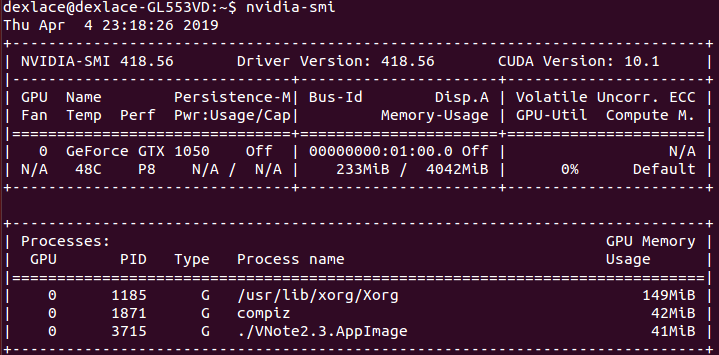
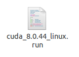
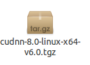
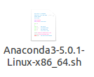

# tensorflow与caffe安装指南

## 一、显卡驱动安装
<font size=3 color=red>**1.** [NVIDIA显卡对应页面](https://www.nvidia.com/Download/index.aspx)查询电脑的显卡所对应的NVIDIA驱动</font>  
<font size=3>**2.** 安装相关依赖项(当然这并不是为了显卡驱动安装作准备)</font>  
```bshell
1 sudo apt-get install libprotobuf-dev libleveldb-dev libsnappy-dev libopencv-dev libhdf5-serial-dev protobuf-compiler
2 sudo apt-get install --no-install-recommends libboost-all-dev
3 sudo apt-get install libopenblas-dev liblapack-dev libatlas-base-dev
4 sudo apt-get install libgflags-dev libgoogle-glog-dev liblmdb-dev
```  
<font size=3>**3.** 安装驱动</font>  
```bshell
sudo apt-get purge nvidia-*    //这是卸载以前的nvidia驱动，也可以不卸载
sudo add-apt-repository pa:graphics-drivers/ppa   //为了使得ppa方式生效
sudo apt-get update   //更新源
sudo apt-get install nvidia-418  //418表示你自己显卡对应的驱动编号
```  
完成后，电脑重启，终端输入`sudo nvidia-smi`显示以下信息就表示驱动安装完成。  

## 二、CUDA与cudnn安装  
  
### 1.安装CUDA
<font size=3 color=red>**1).** 按照以上的对应关系，下载对应的cuda和cudnn版本,~~千万不要乱下载~~</font><font size=3>本文下载的是<font size=3 color=red>CUDA8.0,cudnn为6.0</font>，将安装的tensorflow版本是<font size=3 color=red>tensorflow-gpu-1.4.0</font></font>   
<font size=3 >**2).**  主要安装步骤</font>  
  
  + <font size=3 color=#0099ff>切换到文字界面：`ctrl+alt+f1~f6`</font > 
  + <font size=3 color=#0099ff>关闭图形界面：`sudo service lightdm stop`</font >  
  + <font size=3 color=#0099ff>切换到cuda安装包目录下，运行命令：`sudo sh ./cuda_8.0.44_linux.run `</font >  
      - <font size=3 color=red>注意安装过程中除了驱动不需要默认，选择no之外，其余都默认。</font >  
  + <font size=3 color=#0099ff>开启图形界面，先运行命令：`sudo service lightdm start `，然后按`ctrl+alt+f7`</font >  
  + <font size=3 color=#0099ff>在家目录下添加环境变量:`sudo gedit ~/.bashrc`,生效命令是:`source ～/.bashrc`</font >  
  ```bshell
export PATH=/usr/local/cuda-8.0/bin${PATH:+:${PATH}}
export LD_LIBRARY_PATH=/usr/local/cuda-8.0/lib64${LD_LIBRARY_PATH:+:${LD_LIBRARY_PATH}}
  ```  
  + <font size=3 color=#0099ff>在全局环境变量下添加环境变量：`sudo gedit /etc/profile`，在文档后添加如下语句；环境变量生效命令此时是:`source /etc/profile`</font >  
  ```bshell
 PATH=/usr/local/cuda/bin:$PATH  
 export PATH
  ```  
 + <font size=3 color=#0099ff>添加lib库路径，在 /etc/ld.so.conf.d/新建文件 cuda.conf(命令不提，玩linux难道连新建文件都不会？)添加内容如下；之后执行命令：`sudo ldconfig` 使其生效</font >  
 ```bshell
/usr/local/cuda/lib64
 ```  
+ <font size=3 color=#0099ff>测试CUDA的samples，命令如下;并下图显示关于GPU的一些信息说明安装成功；安装成功后nvcc -V可以查看版本</font >  
```bshell
cd /usr/local/cuda-8.0/samples/1_Utilities/deviceQuery
make
sudo ./deviceQuery
```  
  
### 2.安装cudnn  
<font size=3 color=#0000ff>1).按照以上的对应关系，本文cudnn版本是6.0，下载链接是[cudnn下载链接](https://developer.nvidia.com/rdp/cudnn-download%20)，需要注册 </font>  
<font size=3 color=#0000ff>2). 解压：`tar -zxvf cudnn-8.0-linux-x64-v6.0.tgz`</font>  
  
<font size=3 color=#0000ff>3). 拷贝以下文件到cuda对应目录下(解压后它自动被改名为cuda文件夹)，具体命令如下：</font>  
```bshell
sudo cp cuda/include/cudnn.h  /usr/local/cuda-8.0/include/ 
sudo cp cuda/lib64/libcudnn*  /usr/local/cuda-8.0/lib64/ 
sudo chmod a+r  /usr/local/cuda-8.0/include/cudnn.h 
sudo chmod a+r  /usr/local/cuda-8.0/lib64/libcudnn*
```
<font size=3 color=#0000ff>4). 进入/usr/local/cuda/lib64 目录下进行动态链接，具体命令如下：</font>  
```bshell
sudo ln -sf libcudnn.so.6.0.21 libcudnn.so.6
sudo ln -sf libcudnn.so.6 libcudnn.so
sudo ldconfig
```

## 三、Anaconda与Tensorflow安装及Pycharm安装  
### 1.安装Anaconda  
  
+ <font size=3 color=#0000ff>直接进入文件目录，上手一句`bash ./Anaconda3-5.0.1-Linux-x86_64.sh`直接安装就完事儿了，一路yes（保证了环境变量的添加），之后一句`source ~/.bashrc`激活环境变量即可</font>  
### 2.安装Tensorflow-gpu  
<font size=3 color=#0000ff>1). 由于我们将Anaconda的bin目录添加到了环境变量中，所以可以直接使用Anaconda的环境，直接一句`conda create -n tensorflow-gpu python=3.5` 将创建一个名为tensorflow-gpu的环境，其python版本为3.5。</font>  
<font size=3 color=#0000ff>2). 环境创建完成以后，我们通过一下代码关闭和开启环境。</font>  
```bshell
source activate tensorflow-gpu #激活环境
source deactivate tensorflow-gpu #关闭环境
```  
<font size=3 color=#0000ff>3). 在输入代码 `source activate tensorflow-gpu` 激活环境后，输入一下代码来安装tensorflow即可。</font>  
```bshell
source activate tensorflow-gpu
pip install tensorflow-gpu==1.4.0
```  
### 3.安装Pycharm  
<font size=3 color=#0000ff>1). 直接下载解压，进入bin目录下，然后直接一手`sh ./pycharm.sh`就完事儿了</font>  
<font size=3 color=#0000ff>2). 创建快捷方式，没有快捷方式肯定不舒服：在/usr/share/applications创建一个名为pycharm.desktop的文件并编辑如下：</font>  
```bshell
[Desktop Entry]
Version=1.0
Type=Application
Name=Pycharm
Icon=/home/dexlace/pycharm-community-2019.1/bin/pycharm.png  #这是解压目录，同下
Exec=sh /home/dexlace/pycharm-community-2019.1/bin/pycharm.sh
MimeType=application/x-py;
Name[en_US]=pycharm
```  
<font size=3 color=#0000ff>3). 直接复制快捷方式到桌面即可</font>  
<font size=3 color=red> ~~如果你知道怎么将Anaconda的tensorflow-gpu的环境加入pycharm中那我就不提，当然实际上我也不会提~~ </font>  
## 四、opencv编译  
<font size=3 color=#0000ff>1). [opencv3.0及编译时难以自动下载的插件链接](https://pan.baidu.com/s/1gZBQskfb4XYrfVA3MmrvAQ) 密码：d9oj</font>  
<font size=3 color=#0000ff>2). 解压后修改/opencv-3.0.0/modules/cudalegacy/src/graphcuts.cpp ，可能单独这个版本需要改，以上的好像提供了对cuda8.0以上的支持</font>  
```C++
#if !defined (HAVE_CUDA) || defined (CUDA_DISABLER)  //改成以下：
#if !defined (HAVE_CUDA) || defined (CUDA_DISABLER) || (CUDART_VERSION >= 8000)
```  
<font size=3 color=#0000ff>3). 进入解压目录，创建一个文件夹build，进入该文件夹目录，执行下列命令以进行<font color=red>配置</font></font>  
```bshell
cmake -D CMAKE_BUILD_TYPE=RELEASE -D CMAKE_INSTALL_PREFIX=/usr/local .. 
```  
<font size=3 color=#0000ff>4). 当看到<font color=red>配置</font>进程进行到要下载那个插件时，按住ctrl+z停止，并到命名随机的例如`/home/dexlace/opencv-3.0.0/3rdparty/ippicv/downloads/linux-8b449a536a2157bcad08a2b9f266828b` 这个文件夹下，将插件复制到该位置</font>  
<font size=3 color=#0000ff>5). 再次按照步骤3的命令进行<font color=red>配置</font></font>  
<font size=3 color=#0000ff>6). 命令：`make`进行 <font color=red>编译，</font>嫌慢可以`make -j4或j8`等，此处需要很久很久</font>  
<font size=3 color=#0000ff>7). <font color=red>安装</font>：`sudo make install` 这一步比较快，按照这个版本，这个步骤，比较顺利，寻寻腻腻别的版本，步骤，容易出错，其实关键是那个插件下载不来好像，本文不测试opencv的使用</font>  
## 五、caffe与pycaffe安装  
### 1.caffe的编译与安装  
<font size=3 color=#0000ff>1). [caffe源码下载链接](https://github.com/BVLC/caffe)下载caffe源码，解压</font>  
<font size=3 color=#0000ff>2). 进入解压目录，复制Makefileconfig</font>  
```bshell
sudo cp Makefile.config.example Makefile.config
```  
<font size=3 color=#0000ff>3). 修改复制后的Makefileconfig文件：</font>  
```bshell
sudo gedit Makefile.config #打开Makefile.config文件 
```  
+ <font size=3 color=#ff00ff>若使用cudnn：</font>  
```bshell
#取消以下注释
#USE_CUDNN := 1
```  
+ <font size=3 color=#ff00ff>opencv版本若为3：</font>  
```bshell
#取消以下注释
#OPENCV_VERSION := 3
```  
+ <font size=3 color=#ff00ff>如果使用python编写layer：</font>  
```bshell
#取消以下注释
#WITH_PYTHON_LAYER := 1
```  
+ <font size=3 color=#ff00ff>**最重要的一项**</font>  
```bshell
#将
INCLUDE_DIRS := $(PYTHON_INCLUDE) /usr/local/include
LIBRARY_DIRS := $(PYTHON_LIB) /usr/local/lib /usr/lib
#改为
INCLUDE_DIRS := $(PYTHON_INCLUDE) /usr/local/include  /usr/include/hdf5/serial
LIBRARY_DIRS := $(PYTHON_LIB) /usr/local/lib  /usr/lib  /usr/lib/x86_64-linux-gnu  /usr/lib/x86_64-linux-gnu/hdf5/serial 
```  
<font size=3 color=#0000ff>4). 修改复制后的makefile文件：</font>  
```bshell
#将
NVCCFLAGS +=-ccbin=$(CXX) -Xcompiler-fPIC $(COMMON_FLAGS)
#改为
NVCCFLAGS += -D_FORCE_INLINES -ccbin=$(CXX) -Xcompiler -fPIC $(COMMON_FLAGS)
```  
```bshell
#并将（主要对opencv3.0以上需要修改，大致在182行）
LIBRARIES+= glog gflags protobuf leveldb snappy lmdbboost_system m
#改为(注意一行没写完，用\续行)
LIBRARIES+= glog gflags protobuf leveldb snappy lmdbboost_system m hdf5_hl hdf5 m\
opencv_core opencv_highgui opencv_imgproc opencv_imgcodecs
```  
<font size=3 color=#0000ff>5). 编译及安装测试：</font>  
```bshell
make –j8
make test –j8
make runtest –j8
```  
<font size=3 color=red>**本人runtest时遇到一个错误：`error while loading shared libraries: libopencv_core.so.3.0: cannot open share`**，解决方案如下</font>  
```bshell
#从这个提示可以知道系统找不到libopencv_core.so.3.0在哪儿，而系统是通过/etc/ld.so.conf中的路径找.so这个文件的
#将libopencv_core.so.3.0的路径加入到.conf文件中就可以了
#.so文件一般存放在/usr/local/lib目录下
sudo gedit /etc/ld.so.conf 
#在该文件下添加并保存
/usr/local/lib
#并回到命令行执行
sudo ldconfig
#即可
```  
### 2.pycaffe的编译
<font size=3 color=#0000ff>1). 在caffe的解压目录下有一个python文件夹，进入有一个`requirements.tx`t的清单文件，我们需要按照这个文件安装相关依赖，不过在这之前需要安装`fortran`编译器（gfotran），具体代码如下：</font>  
```bshell
#安装fortran编译器
sudo apt-get install gfortran
#进入caffe解压目录的python文件夹目录中
for req in $(cat requirements.txt); do pip install $req; done
```  
<font size=3 color=#0000ff>2). 在该目录下，编译caffe的编译接口</font>  
```bshell
make pycaffe  -j8
```  
<font size=3 color=#0000ff>3). 配置环境变量并激活</font>  
```bshell
sudo gedit ~/.bashrc
#将
export PYTHONPATH=/home/dexlace/caffe-master/python:$PYTHONPATH  #即解压目录的python文件夹所在目录
#添加
#激活环境变量
source ～/.bashrc
```  

<font size=4 color=#ff00ff>注意：在终端导入caffe，注意进入python2.7的环境，不要进入Anaconda的python3和系统的python3环境</font> 

<font size=4 color=#ff00ff>注意：pycharm导入caffe，注意选择python2.7的环境，为了避免`sys.path.append(r'caffe下python文件的路径')`每次都要添加，可以将这个路径加到pycharm.sh中</font>