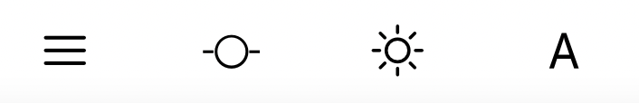
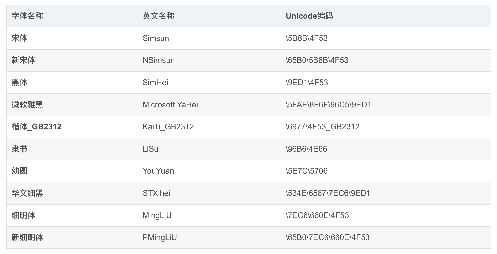
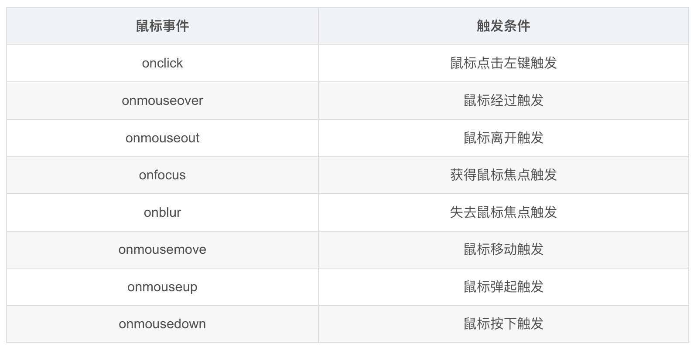
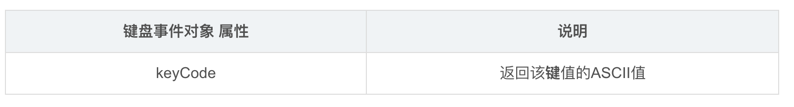

# vue笔记

## 0、安装node

https://nodejs.org/download/release/

自定义配置全局模块和缓存路径

```markdown
global：npm全局安装位置
cache：npm缓存路径
```

```markdown
npm install -g yarn
```

设置

```markdown
# npm config set prefix /Users/dexlace/nodejs/global
npm config set prefix /Users/dexlace/develop-software/nodejs/node_global
# npm config set cache /Users/dexlace/nodejs/cache
npm config set cache /Users/dexlace/develop-software/nodejs/node_cache
```

环境变量设置（zsh shell为例） 

```bash
# node的安装目录
export NODE_HOME=/usr/local/bin
export PATH=$NODE_HOME:$PATH
#  node global的路径
export NODE_GLOBAL=/Users/dexlace/nodejs/global
export PATH=$NODE_GLOBAL/bin:$PATH
```

更换镜像源

```bash
npm config set registry https://registry.npm.taobao.org
```

安装vue脚手架

```bash
npm install -g @vue/cli
```

```bash
vue create vue-pro-hello # 创建新项目
```

```bash
npm install   # 在当前目录中寻找 package.json 文件, 并将 dependencies 字段 里包含的所有模块 都进行下载
npm install xxx					# 安装到当前工作目录下
npm install xxx -g				# 安装到全局安装目录（可以在黑窗口里 使用模块带有的命令）
npm install npm@latest -g		# 更新npm, @后边也可以跟版本号
npm init						# 建一个 node项目,实质是添加了一个 package.json文件
npm uninstall xxx				# 删除这个模块
npm update xxx					# 更新某个包/模块
npm install xxx@版本号			# 下载指定版本	
npm view xxx versions			# 查看某个模块的所有版本号

# 全局安装模块路径
# npm install xxx -g 时的安装路径
npm config get prefix# default(AppData\Roaming\npm)
# 安装模块缓存路径
npm config get cache# default(AppData\Roaming\npm-cache)
npm config delete registry# 删除自己刚配置的registry设置
# 查看 npm 的配置
npm config ls -l
npm config list --json
# 查看全局安装了什么模块 --depth=0,不显示依赖模块
npm ls --depth=0 -g
# 查看当前项目下载了哪些模块
npm ls --depth=0
# 清除缓存	缓存都在全局那里 node_cache
npm cache clean --force
# 在仓库中 搜索与关键字匹配的包
# 对仓库中所有文件的包元数据执行线性、增量、词法排序搜索
npm search 关键字 --registry=http://registry.npmjs.org


```

安装node版本管理工具nvm

```bash
brew install nvm
# huan jing bian liang
export NVM_DIR="$HOME/.nvm"
[ -s "$(brew --prefix nvm)/nvm.sh" ] && . "$(brew --prefix nvm)/nvm.sh"
# 
source ~/.zshrc
#
nvm --version
```

使用nvm

```bash
nvm命令行操作命令
1：nvm nvm list 是查找本电脑上所有的node版本
 
- nvm list 查看已经安装的版本
- nvm list installed 查看已经安装的版本
- nvm list available 查看网络可以安装的版本
 
2：nvm install 安装最新版本nvm
 
3：nvm use <version> ## 切换使用指定的版本node
 
4：nvm ls 列出所有版本
 
5：nvm current显示当前版本
 
6：nvm alias <name> <version> ## 给不同的版本号添加别名
 
7：nvm unalias <name> ## 删除已定义的别名
 
8：nvm reinstall-packages <version> ## 在当前版本node环境下，重新全局安装指定版本号的npm包
 
9：nvm on 打开nodejs控制
 
10：nvm off 关闭nodejs控制
 
11：nvm proxy 查看设置与代理
 
12：nvm node_mirror [url] 设置或者查看setting.txt中的node_mirror，如果不设置的默认是 https://nodejs.org/dist/
　　nvm npm_mirror [url] 设置或者查看setting.txt中的npm_mirror：如果不设置的话默认的是： https://github.com/npm/npm/archive/.
 
13：nvm uninstall <version> 卸载制定的版本
 
14：nvm use [version] [arch] 切换制定的node版本和位数
 
15：nvm root [path] 设置和查看root路径
 
16：nvm version 查看当前的版本

```


使用idea开发vue，打开以上创建的项目


package.json中的修改运行可以直接跳转浏览器，主要是`--open`参数

```json
"scripts": {
    "serve": "vue-cli-service serve --open",
    "build": "vue-cli-service build",
    "lint": "vue-cli-service lint"
  },
```

## 0、vue2引入element_ui


```bash
npm i element-ui --save
```

```javascript
import Vue from 'vue'
import App from './App.vue'
import ElementUI from 'element-ui';
import 'element-ui/lib/theme-chalk/index.css';

Vue.use(ElementUI);

Vue.config.productionTip = false

new Vue({
  render: h => h(App),
}).$mount('#app')


```

### 0.1 创建index页面

- 在components下新建Index.vue

```vue
<template>
  <div>
    <h1>{{ msg }}</h1>
  </div>
</template>

<script>
export default {
  name: 'Index',
  props: {
    msg: String
  }
}
</script>

```

- 修改App.vue

```javascript
<template>
  <div id="app">
    
    <Index msg="这是修改后的主页面"/>  <!-- 修改一-->
  </div>
</template>

<script>
import Index from './components/Index.vue' // 修改二

export default {
  name: 'App',
  components: {
    Index  // 修改三
  }
}
</script>

<style>
#app {
  font-family: Avenir, Helvetica, Arial, sans-serif;
  -webkit-font-smoothing: antialiased;
  -moz-osx-font-smoothing: grayscale;
  text-align: center;
  color: #2c3e50;
  margin-top: 60px;
}
</style>

```

- 在该项目目录下创建`.eslintrc.js `,主要是关闭组件命名规则

```json
module.exports = {
    root: true,
    env: {
        node: true
    },
    'extends': [
        'plugin:vue/essential',
        'eslint:recommended'
    ],
    parserOptions: {
        parser: '@babel/eslint-parser'
    },
    rules: {
        'no-console': process.env.NODE_ENV === 'production' ? 'warn' : 'off',
        'no-debugger': process.env.NODE_ENV === 'production' ? 'warn' : 'off',
        //在rules中添加自定义规则
        //关闭组件命名规则
        "vue/multi-word-component-names":"off",
    },
    overrides: [
        {
            files: [
                '**/__tests__/*.{j,t}s?(x)',
                '**/tests/unit/**/*.spec.{j,t}s?(x)'
            ],
            env: {
                jest: true
            }
        }
    ]
}

```

官方推荐忽略个别组件名

```json
// 添加组件命名忽略规则
    "vue/multi-word-component-names": ["error",{
       "ignores": ["Index"]//需要忽略的组件名
    }]
```


### 0.2 主页面布局

| **组件名**       | **描述**                                                     |
| ---------------- | ------------------------------------------------------------ |
| `<el-container>` | 外层容器。当子元素中包含 `<el-header>`或 `<el-footer> `时，全部子元素会垂直上下排列，否则会水平左右排列。 |
| `<el-header>`    | 顶栏容器                                                     |
| `<el-aside>`     | 侧边栏容器                                                   |
| `<el-main>`      | 主要区域容器                                                 |
| `<el-footer>`    | 底栏容器                                                     |

```markdown
以上组件采用了 flex 布局，使用前请确定目标浏览器是否兼容。此外，<el-container> 的子元素只能是后四者，后四者的父元素也只能是 <el-container>。
```


#### 0.2.1 头部

- 修改Index.vue

```javascript
<template>
  <div>
    <el-container>
      <el-header><Header/></el-header>
      <el-container>
        <el-aside width="200px">Aside</el-aside>
        <el-main>Main</el-main>
      </el-container>
      <el-footer>Footer</el-footer>
    </el-container>
  </div>
</template>

<script>
import Header from "./Header";  // 修改一

export default {
  name: 'Index',    // 修改二 
  components:{Header},
  props: {
    msg: String
  }
}
</script>

<!--修改三-->
<style>
.el-header, .el-footer {
  background-color: #B3C0D1;
  color: #333;
  text-align: center;
  line-height: 60px;
}

.el-aside {
  background-color: #D3DCE6;
  color: #333;
  text-align: center;
  line-height: 200px;
}

.el-main {
  background-color: #E9EEF3;
  color: #333;
  text-align: center;

}

body > .el-container {
  margin-bottom: 40px;
}
</style>

```

- 新建Header.vue

```vue
<template>
    <div style="display:flex;">
        <div style="width: 200px;">头部</div>
        <div style="flex:1"></div>
        <div style="width: 100px;">欢迎</div>
    </div>
</template>

<script>
    export default {
        name: "Header"
    }
</script>

<style scoped>

</style>

```


- 再次修改Header.vue,补充头像等

```vue
<template>
  <header>
    <div>
      <h1 style="margin-top: -10px;color: #425049;font-size:30px; ">欢迎光临</h1>
    </div>
    <div class="opt-wrapper">
      <el-dropdown :hide-on-click="false">
        <div class="demo-basic--circle">
          <div class="block">
            <el-avatar :size="40" :src="avatar" :class="['avatar-info']">
            </el-avatar>
          </div>
        </div>
        <el-dropdown-menu slot="dropdown" style="margin-top:-30px;margin-left: -40px;">
          <el-dropdown-item><i class="el-icon-info"></i>个人中心</el-dropdown-item>
          <el-dropdown-item><i class="el-icon-switch-button"></i>退出登录</el-dropdown-item>
        </el-dropdown-menu>
      </el-dropdown>
    </div>
  </header>
</template>

<script>
export default {
  name: "Header",
  data() {
    return {
      // avatar: 'https://cube.elemecdn.com/3/7c/3ea6beec64369c2642b92c6726f1epng.png'
      avatar: require('@/assets/images/avator.png')
    }
  }
}
</script>

<style scoped>
header {
  display: flex;
  align-items: center;
  justify-content: space-between;
  color: #fff;
}
/*设定头像图片样式*/
.avatar-info {
  margin-top: 10px;
  margin-right: 40px;
  cursor: pointer;
}


</style>

```

#### 0.2.2 其他布局页面

- Main.vue,Footer.vue,Aside.vue

```vue
<template>
    <div>main div</div>
</template>

<script>
    export default {
        name: "Main"
    }
</script>

<style scoped>

</style>
```

其他类似不需多言

- Index.vue引入

```javascript
<template>
  <div class="container">
    <el-container style="height: 100%">
      <el-header><Header/></el-header>
      <el-container>
        <el-aside width="200px"><Aside/></el-aside>
        <el-main><Main/></el-main>
      </el-container>
      <el-footer><Footer/></el-footer>
    </el-container>
  </div>
</template>

<script>
import Header from "./Header";
import Aside from "./Aside";
import Main from "./Main";
import Footer from "./Footer";

export default {
  name: 'Index',
  components:{Header,Aside,Main,Footer},
  props: {
    msg: String
  }
}
</script>
<style>

.el-header, .el-footer {
  background-color: #B3C0D1;
  color: #333;
  text-align: center;
  line-height: 60px;
}

.el-aside {
  background-color: #D3DCE6;
  color: #333;
  text-align: center;
  line-height: 200px;
}

.el-main {
  background-color: #E9EEF3;
  color: #333;
  text-align: center;

}

body > .el-container {
  margin-bottom: 40px;
}

.container{
  position: absolute;
  top:0;
  left: 0;
  width: 100%;
  height:100%;
}
</style>

```

#### 0.2.3 Icon图标的使用

```html
<i class=“el-icon-XXX”></i>
<!--这里的XXX表示图标名，比如编辑用的 “edit” 用户头像的"user"-->
```

比如在Main.vue中编写如下代码：

```vue
<template>
    <div>
      <i class="el-icon-edit"></i>
      <i class="el-icon-user"></i>
    </div>
</template>
```

可以调整样式

```css
<style scoped>
.el-icon-user{
  font-size: 30px;
  color: green;
}
</style>
```


- 比如使用el-button图标

```vue
<el-button type=“primary” class=“el-icon-XXX”>按钮名称</el-button>
```

```markdown
type="primary"也可以不要，但是没那么好看，建议加上
XXX表示图标的名字
按钮名称自己定义
```

```vue
<template>
    <div>
        <el-button type="primary" class="el-icon-search">查询</el-button>
    </div>
</template>
```

同样可以改样式

```css
.el-icon-search{
        font-size: 20px;
        color: black;
}
```

#### 0.2.4 按钮的使用

```vue
<template>
    <div>
        <el-row>
            <el-button>默认按钮</el-button>
            <el-button plain>纯色按钮</el-button>
            <el-button circle class="el-icon-search">搜索</el-button>
            <el-button type="primary">主要按钮</el-button>
            <el-button type="success">成功按钮</el-button>
            <el-button type="info">信息按钮</el-button>
            <el-button type="warning">警告按钮</el-button>
            <el-button type="danger">危险按钮</el-button>
            <el-button round>圆角按钮</el-button>
            <el-button circle>圆形按钮</el-button>
            <el-button type="primary" icon="el-icon-edit"></el-button>
            <el-button type="primary" disabled>主要按钮</el-button>
            <el-button type="text" >主要按钮1</el-button>
          <el-button-group>
             <el-button type="primary" icon="el-icon-arrow-left">上一页</el-button>
             <el-button type="primary">下一页<i class="el-icon-arrow-right el-icon--right"></i></el-button>
             <el-button type="primary" :loading="true">加载中</el-button>
          </el-button-group>
        </el-row>
    </div>
</template>

```

```markdown
plain是一种使用简单的纯色样式，使用时候，只要加上这个属性即可，默认就是true
circle属性就是让按钮显示为圆形
讲type设置为text： type=“text”
以按钮组的方式出现，常用于多项类似操作，比如分页中的上一页、下一页。
只要设置loading属性为true即可。
常用于搜索的时候，搜索完成后设置 loading为false，用vue很好控制。
```


#### 0.2.5 链接的使用

```vue
 <div>
     <el-link href="https://www.baidu.com" target="_blank">默认链接</el-link>
     <el-link href="https://www.baidu.com" target="_blank" disabled>默认链接</el-link>
     <el-link icon="el-icon-edit">编辑</el-link>
     <el-link>查看<i class="el-icon-view el-icon--right"></i> </el-link>
     <el-link type="primary" disabled>主要链接</el-link>
     <el-link type="primary">主要链接</el-link>
     <el-link type="success">成功链接</el-link>
     <el-link type="warning">警告链接</el-link>
     <el-link type="danger">危险链接</el-link>
     <el-link type="info">信息链接</el-link>
 </div>
```

```markdown
禁用设置 disabled 属性即可
当鼠标移动到链接文字的时候，会有下划线，如果我不想要这个下划线，加入underline属性设置为false即可，写法如下：
:underline=“false”
```

#### 0.2.6 菜单的使用

```vue
<template>
    <div>
        <el-menu background-color="#545c64" text-color="#ffffff"
                 active-text-color="#ffd04b" default-active="2">
            <el-menu-item index="1"><i class="el-icon-location"></i>一级菜单1</el-menu-item>
            <el-menu-item index="2"><i class="el-icon-document"></i>一级菜单2</el-menu-item>
            <el-menu-item index="3"><i class="el-icon-setting"></i>一级菜单3</el-menu-item>
        </el-menu>
    </div>
</template>

```

```markdown
一级菜单其实非常的简单，直接用el-menu 和el-menu-item 就行
设置菜单背景颜色和文字颜色:在el-menu中设置 background-color 和 text-color 属性
设置选中后菜单文字颜色:设置 active-text-color 属性，但是必须在需要生效的子菜单中设置index属性，否则不生效
用 i 标签即可，在菜单名前面加入 <i class=“el-icon-XXX”>，XXX是图标的名称。
```

```vue
<template>
    <div>
        <el-menu background-color="#545c64" text-color="#ffffff"
                 active-text-color="#ffd04b" default-active="2" >
            <el-submenu index="1">
                <template slot="title"><i class="el-icon-location"></i><span>一级菜单1</span></template>
                <el-menu-item index="1-1">选项1</el-menu-item>
                <el-menu-item index="1-2">选项2</el-menu-item>
            </el-submenu>
            <el-menu-item index="2"><i class="el-icon-document"></i>一级菜单2</el-menu-item>
            <el-menu-item index="3"><i class="el-icon-setting"></i>一级菜单3</el-menu-item>
        </el-menu>
    </div>
</template>

```

```markdown
二级菜单
将el-menu 修改为 el-submenu
按钮名称、图标用 template标签包裹，必须加入 slot="title"属性，否则菜单样式不对。
加入新的两个 el-menu-item
```

```vue
<template>
    <div>
        <el-menu background-color="#545c64" text-color="#ffffff"
                 active-text-color="#ffd04b" default-active="2"
                 @open="handleOpen"
                 @close="handleClose"
                 @select="handSelect">
            <el-submenu index="1">
                <template slot="title"><i class="el-icon-location"></i><span>一级菜单1</span></template>
                <el-submenu index="1-1">
                    <template slot="title"><i class="el-icon-location"></i><span>选项1</span></template>
                    <el-menu-item index="1-1-1">选项1-1</el-menu-item>
                    <el-menu-item index="1-1-2">选项1-2</el-menu-item>
                </el-submenu>
                <el-submenu index="1-2">
                    <template slot="title"><i class="el-icon-location"></i><span>选项2</span></template>
                    <el-menu-item index="1-2-1">选项2-1</el-menu-item>
                    <el-menu-item index="1-2-2">选项2-2</el-menu-item>
                </el-submenu>
            </el-submenu>
            <el-menu-item index="2"><i class="el-icon-document"></i>一级菜单2</el-menu-item>
            <el-menu-item index="3"><i class="el-icon-setting"></i>一级菜单3</el-menu-item>
        </el-menu>
    </div>
</template>

<script>
    export default {
        name: "Aside",
        methods: {
            handleOpen(key, keyPath) {
                console.log("打开：",key, keyPath);
            },
            handleClose(key, keyPath) {
                console.log("关闭：",key, keyPath);
            },
            handSelect(key, keyPath) {
                console.log("选择：",key, keyPath);
            }
        }
    }
</script>

<style scoped>
</style>

```

```markdown
打开open、关闭close、选择select 3个事件
在el-menu中加入三个事件属性，并编写对应的method
```


## 一、vue核心

### 1.1 模板语法

#### 1.1.1 插值语法

解析==标签体==里的内容

```js
vue的插值语法：{{}}
```

```html
    <!--准备好一个容器-->
    <!--容器和实例一一对应
    插值语法
        功能：用于解析标签体里的内容
        {{xxx}}中的xxx要写js表达式，且xxx可以自动读取到data中的所有属性
    -->
    <div id="root">
        <h1>插值语法</h1>
        <h3>Hello,{{name}}</h3>
        <h3>我的年龄是,{{age}}</h3>
        <h3>1+1的和是,{{1+1}}</h3>
    </div>


    <script type="text/javascript">
        Vue.config.productionTip=false

        // 创建vue实例
        new Vue({
            el:'#root',  // el用于指定当前vue实例为哪个容器服务，值通常为css选择器字符串
                        // el:document.getElementById('root')
            data:{   // data用于存储数据  数据提供给el所指定的容器去使用  值先写成一个对象
                name:'dexlace',
                age: '111'
            }
        })


    </script>
```

#### 1.1.2 指令语法

解析标签（包括：==标签属性、标签体内容、绑定事件......==）

```html
    <div id="root">
        <h1>指令语法</h1>
        <a v-bind:href="url">打开百度</a>
        <!--v-bind可以简写为冒号-->
        <a :href="url">打开百度</a>
    </div>


    <script type="text/javascript">
        Vue.config.productionTip=false

        // 创建vue实例
        new Vue({
            el:'#root',  // el用于指定当前vue实例为哪个容器服务，值通常为css选择器字符串
                        // el:document.getElementById('root')
            data:{   // data用于存储数据  数据提供给el所指定的容器去使用  值先写成一个对象
                name:'dexlace',
                url:'https://www.baidu.com'
            }
        })


    </script>
```

### 1.2 数据绑定

#### 1.2.1 单向绑定

`v-bind`: 数据只能从data流向页面，也就是说改页面不会改到data

```html
<body>
 
    <div id="root">
        单向数据绑定：<input type="text" v-bind:value="name">
        单向数据绑定简写：<input type="text" :value="name">
    </div>
    <script type="text/javascript">
        Vue.config.productionTip = false //阻止vue在启动时提示
 
        new Vue({
            el:'#root',
            data:{
                name:'你是老六'
        
            }
        })
    </script>
    
</body>
```

#### 1.2.2 双向绑定

`v-modle`：数据不仅能从data流向页面，还能从页面流向data

双向绑定一般都应用在表单项元素上（如：input、select）

`v-modle: value`可以简写`v-modle`，因为v-modle==默认收集的就是value值==

```html
        <!-- 复杂些法 -->
        <!-- 单向数据绑定：<input type="text" v-bind:value="name"><br/>
        双向数据绑定：<input type="text" v-model:value="name"> -->
 
        <!-- 简写 -->
        单向数据绑定：<input type="text" :value="name"><br/>
        双向数据绑定：<input type="text" v-model="name">
```

### 1.3 vue中的el与data

```html
<!DOCTYPE html>
<html>

<head>
    <meta charset="UTF-8">
    <title>初始vue</title>
    <!-- 引入vue.js -->
    <script type="text/javascript" src="../js/vue.js"></script>
</head>

<body>
    <!-- 准备一个容器 -->
    <div id="root">
        <h1>你好,{{name}}!</h1>
    </div>
    <script type="text/javascript">
        // 设置为 false 以阻止 vue 在启动时生成生产提示。
        Vue.config.productionTip = false
        //el的两种写法
        const v=new Vue({
            //第一种写法 直接使用el关联容器
            //el:'#root',
            data:{
                name:'vue'
            } 
        }) 
        //第二种写法使用mount指定容器，相比于第一种写法，这种写法更加的灵活
        //mount意为挂载
         v.$mount("#root")
        console.log(v)
    </script>
</body>

</html>

```

data的第一种写法

```html
<!DOCTYPE html>
<html>

<head>
    <meta charset="UTF-8">
    <title>初始vue</title>
    <!-- 引入vue.js -->
    <script type="text/javascript" src="../js/vue.js"></script>
</head>

<body>
    <!-- 准备一个容器 -->
    <div id="root">
        <h1>你好,{{name}}!</h1>
    </div>
    <script type="text/javascript">
        // 设置为 false 以阻止 vue 在启动时生成生产提示。
        Vue.config.productionTip = false

        //data的两种写法
        const v=new Vue({
            //第一种写法：对象式
            el:'#root',
            data:{
                name:'vue'
            } 
        }) 
     
  

    </script>
</body>

</html>

```

```html
<!DOCTYPE html>
<html>

<head>
    <meta charset="UTF-8">
    <title>初始vue</title>
    <!-- 引入vue.js -->
    <script type="text/javascript" src="../js/vue.js"></script>
</head>

<body>
    <!-- 准备一个容器 -->
    <div id="root">
        <h1>你好,{{name}}!</h1>
    </div>
    <script type="text/javascript">
        // 设置为 false 以阻止 vue 在启动时生成生产提示。
        Vue.config.productionTip = false
        const v=new Vue({
            //第二种写法：函数式，编写一个函数且必须返回一个对象，对象里面的数据，就是你所需要的
            //这种写法虽然麻烦，但是更灵活，通常配合组件使用
            el:'#root',
            data(){
                //此处的this是vue实例对象，想要调用this前提必须是data函数是一个普通的函数，如果写成一个箭头函数，那么这个this就是全局的window，而不是vue实例对象了
                console.log(111,this)
                // 这个函数是vue自动帮我们调用的
                return{
                    name:'张三丰'
                }
            }
            
        }) 

    </script>
</body>

</html>

```

### 1.4 Object.defineProperty详解

```html
<!DOCTYPE html>
<html>
	<head>
		<meta charset="UTF-8" />
		<title>Object.defineproperty方法</title>
	</head>
	<body>
		<script type="text/javascript" >
			let number = 18
			let person = {
				name:'张三',
				sex:'男',
			}
 
			Object.defineProperty(person,'age',{
				// value:18,
				// enumerable:true, //控制属性是否可以枚举，即是否能够遍历，默认值是false
				// writable:true, //控制属性是否可以被修改，默认值是false
				// configurable:true //控制属性是否可以被删除，默认值是false
 
				//当有人读取person的age属性时，get函数(getter)就会被调用，且返回值就是age的值
				get(){
					console.log('有人读取age属性了')
					return number
				},
 
				//当有人修改person的age属性时，set函数(setter)就会被调用，且会收到修改的具体值
				set(value){
					console.log('有人修改了age属性，且值是',value)
					number = value
				}
 
			})
 
			// console.log(Object.keys(person))
 
			console.log(person)
		</script>
	</body>
</html>
```

### 1.5 MVVM模型


最核心的就是 ViewModel 。ViewModel 包含 ==DOM Listeners==和 ==Data Bindings==。

Data Bindings 用于将==数据绑定==到 View 上显示，==DOM Listeners 用于监听操作==。

从 Model 到 View 的==映射==，也就是 ==Data Bindings== 。这样可以大量省略我们手动 update View 的代码和时间。

从 View 到 Model 的事件==监听==，也就是 ==DOM Listeners== 。这样我们的 Model 就会随着 View 触发事件而改变。

即两个方向：

一是==将模型转换成视图==，即将后端传递的数据转换成看到的页面。实现方式是：==数据绑定==。

二是==将视图转换成模型==，即==将看到的页面转换成后端的数据==。实现的方式是：==DOM 事件监听==。

MVC和MVVM的区别：

MVC - Model View Controller( controller: 控制器 )，M 和 V 和 MVVM 中的 M 和 V 意思一样，==C 指页面业务逻辑==。使用 MVC 的目的就是将 M 和 V 的代码分离，但 ==MVC 是单向通信==，也就是将 Model 渲染到 View 上，==必须通过 Controller 来承上启下==。

MVC 和 MVVM 的区别(关系)==并不是 ViewModel 完全取代了 Controller==。

ViewModel 目的在于抽离 Controller 中的数据渲染功能，而不是替代。其他操作业务等还是应该放在 Controller 中实现，这样就实现了业务逻辑组件的复用。
### 1.6 数据代理

vue中的数据代理：通过==vm对象来代理data对象==中的属性的操作（读/写）

好处：更加==方便操作data中的数据==

基本原理：

- 通过Object.defineProperty()把data对象中所有属性添加到vm上
- 为每一个添加到vm上的属性，都指定一个getter/setter
- 在getter/setter内部去操作（读/写）data中对应的属性

### 1.7 事件处理

#### 1.7.1 事件基本使用

```vue
<!DOCTYPE html>
<html>
  <head>
    <meta charset="UTF-8" />
    <title>事件的基本使用</title>
    <!-- 引入Vue -->
    <script type="text/javascript" src="../js/vue.js"></script>
  </head>
  <body>
    <!-- 
				事件的基本使用：
							1.使用v-on:xxx 或 @xxx 绑定事件，其中xxx是事件名；
							2.事件的回调需要配置在methods对象中，最终会在vm上；
							3.methods中配置的函数，不要用箭头函数！否则this就不是vm了；
							4.methods中配置的函数，都是被Vue所管理的函数，this的指向是vm 或 组件实例对象；
							5.@click="demo" 和 @click="demo($event)" 效果一致，但后者可以传参；
		-->
    <!-- 准备好一个容器-->
    <div id="root">
      <h2>欢迎来到{{name}}学习</h2>
      <!-- <button v-on:click="showInfo">点我提示信息</button> -->
      <button @click="showInfo1">点我提示信息1（不传参）</button>
      <!--$event可以传进来event-->
      <button @click="showInfo2($event,66)">点我提示信息2（传参）</button>
    </div>
  </body>

  <script type="text/javascript">
    Vue.config.productionTip = false; //阻止 vue 在启动时生成生产提示。

    const vm = new Vue({
      el: "#root",
      data: {
        name: "老银囊",
      },
      methods: {
        showInfo1(event) {
          // console.log(event.target.innerText)
          // console.log(this) //此处的this是vm
          alert("同学你好！");
        },
        showInfo2(event, number) {
          console.log(event, number);
          // console.log(event.target.innerText)
          // console.log(this) //此处的this是vm
          alert("同学你好！！" + number);
        },
      },
    });
  </script>
</html>

```

#### 1.7.2 事件修饰符

```vue
<!DOCTYPE html>
<html>
	<head>
		<meta charset="UTF-8" />
		<title>事件修饰符</title>
		<!-- 引入Vue -->
		<script type="text/javascript" src="../js/vue.js"></script>
		<style>
			*{
				margin-top: 20px;
			}
			.demo1{
				height: 50px;
				background-color: skyblue;
			}
			.box1{
				padding: 5px;
				background-color: skyblue;
			}
			.box2{
				padding: 5px;
				background-color: orange;
			}
			.list{
				width: 200px;
				height: 200px;
				background-color: peru;
				overflow: auto;
			}
			li{
				height: 100px;
			}
		</style>
	</head>
	<body>
		<!-- 
				Vue中的事件修饰符：
						1.prevent：阻止默认事件（常用）；
						2.stop：阻止事件冒泡（常用）；
						3.once：事件只触发一次（常用）；
						4.capture：使用事件的捕获模式；
						5.self：只有event.target是当前操作的元素时才触发事件；
						6.passive：事件的默认行为立即执行，无需等待事件回调执行完毕；
		-->
		<!-- 准备好一个容器-->
		<div id="root">
			<h2>欢迎来到{{name}}学习</h2>
			<!-- 阻止默认事件（常用）这个例子会阻止链接的跳转行为 -->
			<a href="http://www.a1212.com" @click.prevent="showInfo">点我提示信息</a>

			<!-- 阻止事件冒泡（常用） -->
			<div class="demo1" @click="showInfo">
        <!--这样的话就不会向div传播事件-->
				<button @click.stop="showInfo">点我提示信息</button>
				<!-- 修饰符可以连续写 -->
				<!-- <a href="http://www.2323.com" @click.prevent.stop="showInfo">点我提示信息</a> -->
			</div>

			<!-- 事件只触发一次（常用） -->
			<button @click.once="showInfo">点我提示信息</button>

			<!-- 使用事件的捕获模式 -->
			<div class="box1" @click.capture="showMsg(1)">
				div1
				<div class="box2" @click="showMsg(2)">
					div2
				</div>
			</div>

			<!-- 只有event.target是当前操作的元素时才触发事件； -->
			<div class="demo1" @click.self="showInfo">
				<button @click="showInfo">点我提示信息</button>
			</div>

			<!-- 事件的默认行为立即执行，无需等待事件回调执行完毕； -->
			<ul @wheel.passive="demo" class="list">
				<li>1</li>
				<li>2</li>
				<li>3</li>
				<li>4</li>
			</ul>

		</div>
	</body>

	<script type="text/javascript">
		Vue.config.productionTip = false //阻止 vue 在启动时生成生产提示。

		new Vue({
			el:'#root',
			data:{
				name:'尚硅谷'
			},
			methods:{
				showInfo(e){
					alert('同学你好！')
					// console.log(e.target)
				},
				showMsg(msg){
					console.log(msg)
				},
				demo(){
					for (let i = 0; i < 100000; i++) {
						console.log('#')
					}
					console.log('累坏了')
				}
			}
		})
	</script>
</html>
```

#### 1.7.3 键盘事件

```vue
<!DOCTYPE html>
<html>
	<head>
		<meta charset="UTF-8" />
		<title>键盘事件</title>
		<!-- 引入Vue -->
		<script type="text/javascript" src="../js/vue.js"></script>
	</head>
	<body>
		<!-- 
				1.Vue中常用的按键别名：
							回车 => enter
							删除 => delete (捕获“删除”和“退格”键)
							退出 => esc
							空格 => space
							换行 => tab (特殊，必须配合keydown去使用)
							上 => up
							下 => down
							左 => left
							右 => right

				2.Vue未提供别名的按键，可以使用按键原始的key值去绑定，但注意要转为kebab-case（短横线命名）

				3.系统修饰键（用法特殊）：ctrl、alt、shift、meta
							(1).配合keyup使用：按下修饰键的同时，再按下其他键，随后释放其他键，事件才被触发。
							(2).配合keydown使用：正常触发事件。

				4.也可以使用keyCode去指定具体的按键（不推荐）

				5.Vue.config.keyCodes.自定义键名 = 键码，可以去定制按键别名
		-->
		<!-- 准备好一个容器-->
		<div id="root">
			<h2>欢迎来到{{name}}学习</h2>
			<input type="text" placeholder="按下回车提示输入" @keydown.huiche="showInfo">
		</div>
	</body>

	<script type="text/javascript">
		Vue.config.productionTip = false //阻止 vue 在启动时生成生产提示。
		Vue.config.keyCodes.huiche = 13 //定义了一个别名按键

		new Vue({
			el:'#root',
			data:{
				name:'尚硅谷'
			},
			methods: {
				showInfo(e){
					// console.log(e.key,e.keyCode)
					console.log(e.target.value)
				}
			},
		})
	</script>
</html>
```

### 1.8 计算属性

```vue
<!DOCTYPE html>
<html>
  <head>
    <meta charset="UTF-8" />
    <title>姓名案例_插值语法实现</title>
    <!-- 引入Vue -->
    <script type="text/javascript" src="../js/vue.js"></script>
  </head>
  <body>
    <!-- 准备好一个容器-->
    <div id="root">
      姓：<input type="text" v-model="firstName" /> <br /><br />
      名：<input type="text" v-model="lastName" /> <br /><br />
      全名：<span>{{firstName}}-{{lastName}}</span>
    </div>
  </body>

  <script type="text/javascript">
    Vue.config.productionTip = false; //阻止 vue 在启动时生成生产提示。

    new Vue({
      el: "#root",
      data: {
        firstName: "张",
        lastName: "三",
      },
    });
  </script>
</html>

```

```vue
<!DOCTYPE html>
<html>
	<head>
		<meta charset="UTF-8" />
		<title>姓名案例_methods实现</title>
		<!-- 引入Vue -->
		<script type="text/javascript" src="../js/vue.js"></script>
	</head>
	<body>
		<!-- 准备好一个容器-->
		<div id="root">
			姓：<input type="text" v-model="firstName"> <br/><br/>
			名：<input type="text" v-model="lastName"> <br/><br/>
			全名：<span>{{fullName()}}</span>
		</div>
	</body>

	<script type="text/javascript">
		Vue.config.productionTip = false //阻止 vue 在启动时生成生产提示。

		new Vue({
			el:'#root',
			data:{
				firstName:'张',
				lastName:'三'
			},
			methods: {
				fullName(){
					console.log('@---fullName')
					return this.firstName + '-' + this.lastName
				}
			},
		})
	</script>
</html>
```

==计算属性==

```vue
<!DOCTYPE html>
<html>
	<head>
		<meta charset="UTF-8" />
		<title>姓名案例_计算属性实现</title>
		<!-- 引入Vue -->
		<script type="text/javascript" src="../js/vue.js"></script>
	</head>
	<body>
		<!-- 
			计算属性：
					1.定义：要用的属性不存在，要通过已有属性计算得来。
					2.原理：底层借助了Objcet.defineproperty方法提供的getter和setter。
					3.get函数什么时候执行？
								(1).初次读取时会执行一次。
								(2).当依赖的数据发生改变时会被再次调用。
					4.优势：与methods实现相比，内部有缓存机制（复用），效率更高，调试方便。
					5.备注：
							1.计算属性最终会出现在vm上，直接读取使用即可。
							2.如果计算属性要被修改，那必须写set函数去响应修改，且set中要引起计算时依赖的数据发生改变。
		 -->
		<!-- 准备好一个容器-->
		<div id="root">
			姓：<input type="text" v-model="firstName"> <br/><br/>
			名：<input type="text" v-model="lastName"> <br/><br/>
			测试：<input type="text" v-model="x"> <br/><br/>
			全名：<span>{{fullName}}</span> <br/><br/>
			<!-- 全名：<span>{{fullName}}</span> <br/><br/>
			全名：<span>{{fullName}}</span> <br/><br/>
			全名：<span>{{fullName}}</span> -->
		</div>
	</body>

	<script type="text/javascript">
		Vue.config.productionTip = false //阻止 vue 在启动时生成生产提示。

		const vm = new Vue({
			el:'#root',
			data:{
				firstName:'张',
				lastName:'三',
				x:'你好'
			},
			methods: {
				demo(){
					
				}
			},
			computed:{
				fullName:{
					//get有什么作用？当有人读取fullName时，get就会被调用，且返回值就作为fullName的值
					//get什么时候调用？1.初次读取fullName时。2.所依赖的数据发生变化时。
					get(){
						console.log('get被调用了')
						// console.log(this) //此处的this是vm
						return this.firstName + '-' + this.lastName
					},
					//set什么时候调用? 当fullName被修改时。
					set(value){
						console.log('set',value)
						const arr = value.split('-')
						this.firstName = arr[0]
						this.lastName = arr[1]
					}
				}
			}
		})
	</script>
</html>
```

```vue
<!DOCTYPE html>
<html>
	<head>
		<meta charset="UTF-8" />
		<title>姓名案例_计算属性实现</title>
		<!-- 引入Vue -->
		<script type="text/javascript" src="../js/vue.js"></script>
	</head>
	<body>
		<!-- 准备好一个容器-->
		<div id="root">
			姓：<input type="text" v-model="firstName"> <br/><br/>
			名：<input type="text" v-model="lastName"> <br/><br/>
			全名：<span>{{fullName}}</span> <br/><br/>
		</div>
	</body>

	<script type="text/javascript">
		Vue.config.productionTip = false //阻止 vue 在启动时生成生产提示。

		const vm = new Vue({
			el:'#root',
			data:{
				firstName:'张',
				lastName:'三',
			},
			computed:{
				//完整写法
				/* fullName:{
					get(){
						console.log('get被调用了')
						return this.firstName + '-' + this.lastName
					},
					set(value){
						console.log('set',value)
						const arr = value.split('-')
						this.firstName = arr[0]
						this.lastName = arr[1]
					}
				} */
				//简写
				fullName(){
					console.log('get被调用了')
					return this.firstName + '-' + this.lastName
				}
			}
		})
	</script>
</html>
```

### 1.9 监视属性

#### 1.9.1 基本使用

```vue
<!DOCTYPE html>
<html>
	<head>
		<meta charset="UTF-8" />
		<title>天气案例_监视属性</title>
		<!-- 引入Vue -->
		<script type="text/javascript" src="../js/vue.js"></script>
	</head>
	<body>
		<!-- 
				监视属性watch：
					1.当被监视的属性变化时, 回调函数自动调用, 进行相关操作
					2.监视的属性必须存在，才能进行监视！！
					3.监视的两种写法：
							(1).new Vue时传入watch配置
							(2).通过vm.$watch监视
		 -->
		<!-- 准备好一个容器-->
		<div id="root">
			<h2>今天天气很{{info}}</h2>
			<button @click="changeWeather">切换天气</button>
		</div>
	</body>

	<script type="text/javascript">
		Vue.config.productionTip = false //阻止 vue 在启动时生成生产提示。
		
		const vm = new Vue({
			el:'#root',
			data:{
				isHot:true,
			},
			computed:{
				info(){
					return this.isHot ? '炎热' : '凉爽'
				}
			},
			methods: {
				changeWeather(){
					this.isHot = !this.isHot
				}
			},
			/* watch:{
				isHot:{
					immediate:true, //初始化时让handler调用一下
					//handler什么时候调用？当isHot发生改变时。
					handler(newValue,oldValue){
						console.log('isHot被修改了',newValue,oldValue)
					}
				}
			} */
		})

		vm.$watch('isHot',{
			immediate:true, //初始化时让handler调用一下
			//handler什么时候调用？当isHot发生改变时。
			handler(newValue,oldValue){
				console.log('isHot被修改了',newValue,oldValue)
			}
		})
	</script>
</html>
```

#### 1.9.2 深度监视

```vue
<!DOCTYPE html>
<html>
	<head>
		<meta charset="UTF-8" />
		<title>天气案例_深度监视</title>
		<!-- 引入Vue -->
		<script type="text/javascript" src="../js/vue.js"></script>
	</head>
	<body>
		<!-- 
				深度监视：
						(1).Vue中的watch默认不监测对象内部值的改变（一层）。
						(2).配置deep:true可以监测对象内部值改变（多层）。
				备注：
						(1).Vue自身可以监测对象内部值的改变，但Vue提供的watch默认不可以！
						(2).使用watch时根据数据的具体结构，决定是否采用深度监视。
		 -->
		<!-- 准备好一个容器-->
		<div id="root">
			<h2>今天天气很{{info}}</h2>
			<button @click="changeWeather">切换天气</button>
			<hr/>
			<h3>a的值是:{{numbers.a}}</h3>
			<button @click="numbers.a++">点我让a+1</button>
			<h3>b的值是:{{numbers.b}}</h3>
			<button @click="numbers.b++">点我让b+1</button>
			<button @click="numbers = {a:666,b:888}">彻底替换掉numbers</button>
			{{numbers.c.d.e}}
		</div>
	</body>

	<script type="text/javascript">
		Vue.config.productionTip = false //阻止 vue 在启动时生成生产提示。
		
		const vm = new Vue({
			el:'#root',
			data:{
				isHot:true,
				numbers:{
					a:1,
					b:1,
					c:{
						d:{
							e:100
						}
					}
				}
			},
			computed:{
				info(){
					return this.isHot ? '炎热' : '凉爽'
				}
			},
			methods: {
				changeWeather(){
					this.isHot = !this.isHot
				}
			},
			watch:{
				isHot:{
					// immediate:true, //初始化时让handler调用一下
					//handler什么时候调用？当isHot发生改变时。
					handler(newValue,oldValue){
						console.log('isHot被修改了',newValue,oldValue)
					}
				},
				//监视多级结构中某个属性的变化
				/* 'numbers.a':{
					handler(){
						console.log('a被改变了')
					}
				} */
				//监视多级结构中所有属性的变化
				numbers:{
					deep:true,
					handler(){
						console.log('numbers改变了')
					}
				}
			}
		})

	</script>
</html>
```

#### 1.9.3 监视属性简写

```vue
<!DOCTYPE html>
<html>
	<head>
		<meta charset="UTF-8" />
		<title>天气案例_监视属性_简写</title>
		<!-- 引入Vue -->
		<script type="text/javascript" src="../js/vue.js"></script>
	</head>
	<body>
		<!-- 准备好一个容器-->
		<div id="root">
			<h2>今天天气很{{info}}</h2>
			<button @click="changeWeather">切换天气</button>
		</div>
	</body>

	<script type="text/javascript">
		Vue.config.productionTip = false //阻止 vue 在启动时生成生产提示。
		
		const vm = new Vue({
			el:'#root',
			data:{
				isHot:true,
			},
			computed:{
				info(){
					return this.isHot ? '炎热' : '凉爽'
				}
			},
			methods: {
				changeWeather(){
					this.isHot = !this.isHot
				}
			},
			watch:{
				//正常写法
				/* isHot:{
					// immediate:true, //初始化时让handler调用一下
					// deep:true,//深度监视
					handler(newValue,oldValue){
						console.log('isHot被修改了',newValue,oldValue)
					}
				}, */
				//简写
				/* isHot(newValue,oldValue){
					console.log('isHot被修改了',newValue,oldValue,this)
				} */
			}
		})

		//正常写法
		/* vm.$watch('isHot',{
			immediate:true, //初始化时让handler调用一下
			deep:true,//深度监视
			handler(newValue,oldValue){
				console.log('isHot被修改了',newValue,oldValue)
			}
		}) */

		//简写
		/* vm.$watch('isHot',(newValue,oldValue)=>{
			console.log('isHot被修改了',newValue,oldValue,this)
		}) */

	</script>
</html>
```

#### 1.9.4 与计算属性的不同

```vue
<!DOCTYPE html>
<html>
	<head>
		<meta charset="UTF-8" />
		<title>姓名案例_watch实现</title>
		<!-- 引入Vue -->
		<script type="text/javascript" src="../js/vue.js"></script>
	</head>
	<body>
		<!-- 
				computed和watch之间的区别：
						1.computed能完成的功能，watch都可以完成。
						2.watch能完成的功能，computed不一定能完成，例如：watch可以进行异步操作。
				两个重要的小原则：
							1.所被Vue管理的函数，最好写成普通函数，这样this的指向才是vm 或 组件实例对象。
							2.所有不被Vue所管理的函数（定时器的回调函数、ajax的回调函数等、Promise的回调函数），最好写成箭头函数，
								这样this的指向才是vm 或 组件实例对象。
		-->
		<!-- 准备好一个容器-->
		<div id="root">
			姓：<input type="text" v-model="firstName"> <br/><br/>
			名：<input type="text" v-model="lastName"> <br/><br/>
			全名：<span>{{fullName}}</span> <br/><br/>
		</div>
	</body>

	<script type="text/javascript">
		Vue.config.productionTip = false //阻止 vue 在启动时生成生产提示。

		const vm = new Vue({
			el:'#root',
			data:{
				firstName:'张',
				lastName:'三',
				fullName:'张-三'
			},
			watch:{
				firstName(val){
					setTimeout(()=>{
						console.log(this)
						this.fullName = val + '-' + this.lastName
					},1000);
				},
				lastName(val){
					this.fullName = this.firstName + '-' + val
				}
			}
		})
	</script>
</html>
```

### 1.10 绑定样式

```vue
<!DOCTYPE html>
<html>
  <head>
    <meta charset="UTF-8" />
    <title>绑定样式</title>
    <style>
      .basic {
        width: 400px;
        height: 100px;
        border: 1px solid black;
      }

      .happy {
        border: 4px solid red;
        background-color: rgba(255, 255, 0, 0.644);
        background: linear-gradient(30deg, yellow, pink, orange, yellow);
      }
      .sad {
        border: 4px dashed rgb(2, 197, 2);
        background-color: gray;
      }
      .normal {
        background-color: skyblue;
      }

      .hello1 {
        background-color: yellowgreen;
      }
      .hello2 {
        font-size: 30px;
        text-shadow: 2px 2px 10px red;
      }
      .hello3 {
        border-radius: 20px;
      }
    </style>
    <script type="text/javascript" src="../js/vue.js"></script>
  </head>
  <body>
    <!-- 
			绑定样式：
					1. class样式
								写法:class="xxx" xxx可以是字符串、对象、数组。
										字符串写法适用于：类名不确定，要动态获取。
										对象写法适用于：要绑定多个样式，个数不确定，名字也不确定。
										数组写法适用于：要绑定多个样式，个数确定，名字也确定，但不确定用不用。
					2. style样式
								:style="{fontSize: xxx}"其中xxx是动态值。
								:style="[a,b]"其中a、b是样式对象。
		-->
    <!-- 准备好一个容器-->
    <div id="root">
      <!-- 绑定class样式--字符串写法，适用于：样式的类名不确定，需要动态指定 -->
      <div class="basic" :class="mood" @click="changeMood">{{name}}</div>
      <br /><br />

      <!-- 绑定class样式--数组写法，适用于：要绑定的样式个数不确定、名字也不确定 -->
      <div class="basic" :class="classArr">{{name}}</div>
      <br /><br />

      <!-- 绑定class样式--对象写法，适用于：要绑定的样式个数确定、名字也确定，但要动态决定用不用 -->
      <div class="basic" :class="classObj">{{name}}</div>
      <br /><br />

      <!-- 绑定style样式--对象写法 -->
      <div class="basic" :style="styleObj">{{name}}</div>
      <br /><br />
      <!-- 绑定style样式--数组写法 -->
      <div class="basic" :style="styleArr">{{name}}</div>
    </div>
  </body>

  <script type="text/javascript">
    Vue.config.productionTip = false;

    const vm = new Vue({
      el: "#root",
      data: {
        name: "攻打台湾",
        mood: "normal",
        classArr: ["hello1", "hello2", "hello3"],
        classObj: {
          hello1: false,
          hello2: false,
        },
        styleObj: {
          fontSize: "40px",
          color: "red",
        },
        styleObj2: {
          backgroundColor: "orange",
        },
        styleArr: [
          {
            fontSize: "40px",
            color: "blue",
          },
          {
            backgroundColor: "gray",
          },
        ],
      },
      methods: {
        changeMood() {
          const arr = ["happy", "sad", "normal"];
          const index = Math.floor(Math.random() * 3);
          this.mood = arr[index];
        },
      },
    });
  </script>
</html>

```

### 1.11 条件渲染

```vue
<!DOCTYPE html>
<html>
  <head>
    <meta charset="UTF-8" />
    <title>条件渲染</title>
    <script type="text/javascript" src="../js/vue.js"></script>
  </head>
  <body>
    <!-- 
				条件渲染：
							1.v-if
										写法：
												(1).v-if="表达式" 
												(2).v-else-if="表达式"
												(3).v-else="表达式"
										适用于：切换频率较低的场景。
										特点：不展示的DOM元素直接被移除。
										注意：v-if可以和:v-else-if、v-else一起使用，但要求结构不能被“打断”。

							2.v-show
										写法：v-show="表达式"
										适用于：切换频率较高的场景。
										特点：不展示的DOM元素未被移除，仅仅是使用样式隐藏掉
								
							3.备注：使用v-if的时，元素可能无法获取到，而使用v-show一定可以获取到。
		 -->
    <!-- 准备好一个容器-->
    <div id="root">
      <h2>当前的n值是:{{n}}</h2>
      <button @click="n++">点我n+1</button>
      <!-- 使用v-show做条件渲染 -->
      <!-- <h2 v-show="false">欢迎来到{{name}}</h2> -->
      <!-- <h2 v-show="1 === 1">欢迎来到{{name}}</h2> -->

      <!-- 使用v-if做条件渲染 -->
      <!-- <h2 v-if="false">欢迎来到{{name}}</h2> -->
      <!-- <h2 v-if="1 === 1">欢迎来到{{name}}</h2> -->

      <!-- v-else和v-else-if -->
      <!-- <div v-if="n === 1">Angular</div>
			<div v-else-if="n === 2">React</div>
			<div v-else-if="n === 3">Vue</div>
			<div v-else>哈哈</div> -->

      <!-- v-if与template的配合使用 -->
      <template v-if="n === 1">
        <h2>你好</h2>
        <h2>攻打台湾</h2>
        <h2>北京</h2>
      </template>
    </div>
  </body>

  <script type="text/javascript">
    Vue.config.productionTip = false;

    const vm = new Vue({
      el: "#root",
      data: {
        name: "攻打台湾",
        n: 0,
      },
    });
  </script>
</html>

```

### 1.12 列表渲染

#### 1.12.1 基本列表

```vue
<!DOCTYPE html>
<html>
	<head>
		<meta charset="UTF-8" />
		<title>基本列表</title>
		<script type="text/javascript" src="../js/vue.js"></script>
	</head>
	<body>
		<!-- 
				v-for指令:
						1.用于展示列表数据
						2.语法：v-for="(item, index) in xxx" :key="yyy"
						3.可遍历：数组、对象、字符串（用的很少）、指定次数（用的很少）
		-->
		<!-- 准备好一个容器-->
		<div id="root">
			<!-- 遍历数组 -->
			<h2>人员列表（遍历数组）</h2>
			<ul>
				<li v-for="(p,index) of persons" :key="index">
					{{p.name}}-{{p.age}}
				</li>
			</ul>

			<!-- 遍历对象 -->
			<h2>汽车信息（遍历对象）</h2>
			<ul>
				<li v-for="(value,k) of car" :key="k">
					{{k}}-{{value}}
				</li>
			</ul>

			<!-- 遍历字符串 -->
			<h2>测试遍历字符串（用得少）</h2>
			<ul>
				<li v-for="(char,index) of str" :key="index">
					{{char}}-{{index}}
				</li>
			</ul>
			
			<!-- 遍历指定次数 -->
			<h2>测试遍历指定次数（用得少）</h2>
			<ul>
				<li v-for="(number,index) of 5" :key="index">
					{{index}}-{{number}}
				</li>
			</ul>
		</div>

		<script type="text/javascript">
			Vue.config.productionTip = false
			
			new Vue({
				el:'#root',
				data:{
					persons:[
						{id:'001',name:'张三',age:18},
						{id:'002',name:'李四',age:19},
						{id:'003',name:'王五',age:20}
					],
					car:{
						name:'奥迪A8',
						price:'70万',
						color:'黑色'
					},
					str:'hello'
				}
			})
		</script>
</html>
```

#### 1.12.2 key的原理

```vue
<!DOCTYPE html>
<html>
	<head>
		<meta charset="UTF-8" />
		<title>key的原理</title>
		<script type="text/javascript" src="../js/vue.js"></script>
	</head>
	<body>
		<!-- 
				面试题：react、vue中的key有什么作用？（key的内部原理）
						
						1. 虚拟DOM中key的作用：
										key是虚拟DOM对象的标识，当数据发生变化时，Vue会根据【新数据】生成【新的虚拟DOM】, 
										随后Vue进行【新虚拟DOM】与【旧虚拟DOM】的差异比较，比较规则如下：
										
						2.对比规则：
									(1).旧虚拟DOM中找到了与新虚拟DOM相同的key：
												①.若虚拟DOM中内容没变, 直接使用之前的真实DOM！
												②.若虚拟DOM中内容变了, 则生成新的真实DOM，随后替换掉页面中之前的真实DOM。

									(2).旧虚拟DOM中未找到与新虚拟DOM相同的key
												创建新的真实DOM，随后渲染到到页面。
												
						3. 用index作为key可能会引发的问题：
											1. 若对数据进行：逆序添加、逆序删除等破坏顺序操作:
															会产生没有必要的真实DOM更新 ==> 界面效果没问题, 但效率低。

											2. 如果结构中还包含输入类的DOM：
															会产生错误DOM更新 ==> 界面有问题。

						4. 开发中如何选择key?:
											1.最好使用每条数据的唯一标识作为key, 比如id、手机号、身份证号、学号等唯一值。
											2.如果不存在对数据的逆序添加、逆序删除等破坏顺序操作，仅用于渲染列表用于展示，
												使用index作为key是没有问题的。
		-->
		<!-- 准备好一个容器-->
		<div id="root">
			<!-- 遍历数组 -->
			<h2>人员列表（遍历数组）</h2>
			<button @click.once="add">添加一个老刘</button>
			<ul>
				<li v-for="(p,index) of persons" :key="index">
					{{p.name}}-{{p.age}}
					<input type="text">
				</li>
			</ul>
		</div>

		<script type="text/javascript">
			Vue.config.productionTip = false
			
			new Vue({
				el:'#root',
				data:{
					persons:[
						{id:'001',name:'张三',age:18},
						{id:'002',name:'李四',age:19},
						{id:'003',name:'王五',age:20}
					]
				},
				methods: {
					add(){
						const p = {id:'004',name:'老刘',age:40}
						this.persons.unshift(p)
					}
				},
			})
		</script>
</html>
```

#### 1.12.3 列表过滤

```vue
<!DOCTYPE html>
<html>
	<head>
		<meta charset="UTF-8" />
		<title>列表过滤</title>
		<script type="text/javascript" src="../js/vue.js"></script>
	</head>
	<body>
		<!-- 准备好一个容器-->
		<div id="root">
			<h2>人员列表</h2>
			<input type="text" placeholder="请输入名字" v-model="keyWord">
			<ul>
				<li v-for="(p,index) of filPerons" :key="index">
					{{p.name}}-{{p.age}}-{{p.sex}}
				</li>
			</ul>
		</div>

		<script type="text/javascript">
			Vue.config.productionTip = false
			
			//用watch实现
			//#region 
			/* new Vue({
				el:'#root',
				data:{
					keyWord:'',
					persons:[
						{id:'001',name:'马冬梅',age:19,sex:'女'},
						{id:'002',name:'周冬雨',age:20,sex:'女'},
						{id:'003',name:'周杰伦',age:21,sex:'男'},
						{id:'004',name:'温兆伦',age:22,sex:'男'}
					],
					filPerons:[]
				},
				watch:{
					keyWord:{
						immediate:true,
						handler(val){
							this.filPerons = this.persons.filter((p)=>{
								return p.name.indexOf(val) !== -1
							})
						}
					}
				}
			}) */
			//#endregion
			
			//用computed实现
			new Vue({
				el:'#root',
				data:{
					keyWord:'',
					persons:[
						{id:'001',name:'马冬梅',age:19,sex:'女'},
						{id:'002',name:'周冬雨',age:20,sex:'女'},
						{id:'003',name:'周杰伦',age:21,sex:'男'},
						{id:'004',name:'温兆伦',age:22,sex:'男'}
					]
				},
				computed:{
					filPerons(){
						return this.persons.filter((p)=>{
							return p.name.indexOf(this.keyWord) !== -1
						})
					}
				}
			}) 
		</script>
</html>
```

#### 1.12.4 列表排序

```vue
<!DOCTYPE html>
<html>
	<head>
		<meta charset="UTF-8" />
		<title>列表排序</title>
		<script type="text/javascript" src="../js/vue.js"></script>
	</head>
	<body>
		<!-- 准备好一个容器-->
		<div id="root">
			<h2>人员列表</h2>
			<input type="text" placeholder="请输入名字" v-model="keyWord">
			<button @click="sortType = 2">年龄升序</button>
			<button @click="sortType = 1">年龄降序</button>
			<button @click="sortType = 0">原顺序</button>
			<ul>
				<li v-for="(p,index) of filPerons" :key="p.id">
					{{p.name}}-{{p.age}}-{{p.sex}}
					<input type="text">
				</li>
			</ul>
		</div>

		<script type="text/javascript">
			Vue.config.productionTip = false
			
			new Vue({
				el:'#root',
				data:{
					keyWord:'',
					sortType:0, //0原顺序 1降序 2升序
					persons:[
						{id:'001',name:'马冬梅',age:30,sex:'女'},
						{id:'002',name:'周冬雨',age:31,sex:'女'},
						{id:'003',name:'周杰伦',age:18,sex:'男'},
						{id:'004',name:'温兆伦',age:19,sex:'男'}
					]
				},
				computed:{
					filPerons(){
						const arr = this.persons.filter( (p)=>{
							return p.name.indexOf(this.keyWord) !== -1
						})
						//判断一下是否需要排序
						if(this.sortType){
							arr.sort((p1,p2)=>{
								return this.sortType === 1 ? p2.age-p1.age : p1.age-p2.age
							})
						}
						return arr
					}
				}
			}) 

		</script>
</html>
```

### 1.13 收集表单数据

### 1.14 过滤器（用于格式化数据）

```vue
<!DOCTYPE html>
<html>
  <head>
    <meta charset="UTF-8" />
    <title>过滤器</title>
    <script type="text/javascript" src="../js/vue.js"></script>
    <script type="text/javascript" src="../js/dayjs.min.js"></script>
  </head>
  <body>
    <!-- 
			过滤器：
				定义：对要显示的数据进行特定格式化后再显示（适用于一些简单逻辑的处理）。
				语法：
						1.注册过滤器：Vue.filter(name,callback) 或 new Vue{filters:{}}
						2.使用过滤器：{{ xxx | 过滤器名}}  或  v-bind:属性 = "xxx | 过滤器名"
				备注：
						1.过滤器也可以接收额外参数、多个过滤器也可以串联
						2.并没有改变原本的数据, 是产生新的对应的数据
		-->
    <!-- 准备好一个容器-->
    <div id="root">
      <h2>显示格式化后的时间</h2>
      <!-- 计算属性实现 -->
      <h3>现在是：{{fmtTime}}</h3>
      <!-- methods实现 -->
      <h3>现在是：{{getFmtTime()}}</h3>
      <!-- 过滤器实现 -->
      <h3>现在是：{{time | timeFormater}}</h3>
      <!-- 过滤器实现（传参） -->
      <h3>现在是：{{time | timeFormater('YYYY_MM_DD') | mySlice}}</h3>
      <!--除了插值语法 还可以放在v-bind中-->
      <h3 :x="msg | mySlice">尚硅谷</h3>
    </div>

    <div id="root2">
      <h2>{{msg | mySlice}}</h2>
    </div>
  </body>

  <script type="text/javascript">
    Vue.config.productionTip = false
    //全局过滤器
    Vue.filter("mySlice", function (value) {
      return value.slice(0, 4)
    })

    new Vue({
      el: "#root",
      data: {
        time: 1621561377603, //时间戳
        msg: "你好，尚硅谷"
      },
      computed: {
        fmtTime() {
          return dayjs(this.time).format("YYYY年MM月DD日 HH:mm:ss")
        }
      },
      methods: {
        getFmtTime() {
          return dayjs(this.time).format("YYYY年MM月DD日 HH:mm:ss")
        }
      },
      //局部过滤器
      filters: {
        timeFormater(value, str = "YYYY年MM月DD日 HH:mm:ss") {
          // console.log('@',value)
          return dayjs(value).format(str)
        }
      }
    })

    new Vue({
      el: "#root2",
      data: {
        msg: "hello,atguigu!"
      }
    })
  </script>
</html>

```

### 1.15 内置指令

#### 1.15.1 v-text

```vue
<!DOCTYPE html>
<html>
  <head>
    <meta charset="UTF-8" />
    <title>v-text指令</title>
    <!-- 引入Vue -->
    <script type="text/javascript" src="../js/vue.js"></script>
  </head>
  <body>
    <!-- 
				我们学过的指令：
						v-bind	: 单向绑定解析表达式, 可简写为 :xxx
						v-model	: 双向数据绑定
						v-for  	: 遍历数组/对象/字符串
						v-on   	: 绑定事件监听, 可简写为@
						v-if 	 	: 条件渲染（动态控制节点是否存存在）
						v-else 	: 条件渲染（动态控制节点是否存存在）
						v-show 	: 条件渲染 (动态控制节点是否展示)
				v-text指令：
						1.作用：向其所在的节点中渲染文本内容。
						2.与插值语法的区别：v-text会替换掉节点中的内容，{{xx}}则不会。
		-->
    <!-- 准备好一个容器-->
    <div id="root">
      <div>你好，{{name}}</div>
      <div v-text="name"></div>
      <div v-text="str"></div>
      <!--纵使有标签结构也只当文本使用-->
    </div>
  </body>

  <script type="text/javascript">
    Vue.config.productionTip = false //阻止 vue 在启动时生成生产提示。

    new Vue({
      el: "#root",
      data: {
        name: "尚硅谷",
        str: "<h3>你好啊！</h3>"
      }
    })
  </script>
</html>

```

#### 1.15.2 v-html

```vue
<!DOCTYPE html>
<html>
	<head>
		<meta charset="UTF-8" />
		<title>v-html指令</title>
		<!-- 引入Vue -->
		<script type="text/javascript" src="../js/vue.js"></script>
	</head>
	<body>
		<!-- 
				v-html指令：
						1.作用：向指定节点中渲染包含html结构的内容。
						2.与插值语法的区别：
									(1).v-html会替换掉节点中所有的内容，{{xx}}则不会。
									(2).v-html可以识别html结构。
						3.严重注意：v-html有安全性问题！！！！
									(1).在网站上动态渲染任意HTML是非常危险的，容易导致XSS攻击。
									(2).一定要在可信的内容上使用v-html，永不要用在用户提交的内容上！
		-->
		<!-- 准备好一个容器-->
		<div id="root">
			<div>你好，{{name}}</div>
			<div v-html="str"></div>
			<div v-html="str2"></div>
		</div>
	</body>

	<script type="text/javascript">
		Vue.config.productionTip = false //阻止 vue 在启动时生成生产提示。

		new Vue({
			el:'#root',
			data:{
				name:'尚硅谷',
				str:'<h3>你好啊！</h3>',
				str2:'<a href=javascript:location.href="http://www.baidu.com?"+document.cookie>兄弟我找到你想要的资源了，快来！</a>',
			}
		})
	</script>
</html>
```

#### 1.15.3 v-cloak

```vue
<!DOCTYPE html>
<html>
	<head>
		<meta charset="UTF-8" />
		<title>v-cloak指令</title>
		<style>
			[v-cloak]{
				display:none;
			}
		</style>
		<!-- 引入Vue -->
	</head>
	<body>
		<!-- 
				v-cloak指令（没有值）：
						1.本质是一个特殊属性，Vue实例创建完毕并接管容器后，会删掉v-cloak属性。
						2.使用css配合v-cloak可以解决网速慢时页面展示出{{xxx}}的问题。
		-->
		<!-- 准备好一个容器-->
		<div id="root">
			<h2 v-cloak>{{name}}</h2>
		</div>
		<script type="text/javascript" src="http://localhost:8080/resource/5s/vue.js"></script>
	</body>
	
	<script type="text/javascript">
		console.log(1)
		Vue.config.productionTip = false //阻止 vue 在启动时生成生产提示。
		
		new Vue({
			el:'#root',
			data:{
				name:'尚硅谷'
			}
		})
	</script>
</html>
```

#### 1.15.4 v-once

```vue
<!DOCTYPE html>
<html>
	<head>
		<meta charset="UTF-8" />
		<title>v-once指令</title>
		<!-- 引入Vue -->
		<script type="text/javascript" src="../js/vue.js"></script>
	</head>
	<body>
		<!-- 
			v-once指令：
						1.v-once所在节点在初次动态渲染后，就视为静态内容了。
						2.以后数据的改变不会引起v-once所在结构的更新，可以用于优化性能。
		-->
		<!-- 准备好一个容器-->
		<div id="root">
			<h2 v-once>初始化的n值是:{{n}}</h2>
			<h2>当前的n值是:{{n}}</h2>
			<button @click="n++">点我n+1</button>
		</div>
	</body>

	<script type="text/javascript">
		Vue.config.productionTip = false //阻止 vue 在启动时生成生产提示。
		
		new Vue({
			el:'#root',
			data:{
				n:1
			}
		})
	</script>
</html>
```

#### 1.15.5 v-pre

```vue
<!DOCTYPE html>
<html>
	<head>
		<meta charset="UTF-8" />
		<title>v-pre指令</title>
		<!-- 引入Vue -->
		<script type="text/javascript" src="../js/vue.js"></script>
	</head>
	<body>
		<!-- 
			v-pre指令：
					1.跳过其所在节点的编译过程。
					2.可利用它跳过：没有使用指令语法、没有使用插值语法的节点，会加快编译。
		-->
		<!-- 准备好一个容器-->
		<div id="root">
			<h2 v-pre>Vue其实很简单</h2>
			<h2 >当前的n值是:{{n}}</h2>
			<button @click="n++">点我n+1</button>
		</div>
	</body>

	<script type="text/javascript">
		Vue.config.productionTip = false //阻止 vue 在启动时生成生产提示。

		new Vue({
			el:'#root',
			data:{
				n:1
			}
		})
	</script>
</html>
```

### 1.16 自定义指令(**封装一些DOM操作**，扩展额外的功能)

#### 1.16.1 函数式自定义指令

```vue
<!DOCTYPE html>
<html>
	<head>
		<meta charset="UTF-8" />
		<title>自定义指令</title>
		<script type="text/javascript" src="../js/vue.js"></script>
	</head>
	<body>
		<!-- 
				需求1：定义一个v-big指令，和v-text功能类似，但会把绑定的数值放大10倍。
				
		-->
		<!-- 准备好一个容器-->
		<div id="root">
			<h2>{{name}}</h2>
			<h2>当前的n值是：<span v-text="n"></span> </h2>
			<!-- <h2>放大10倍后的n值是：<span v-big-number="n"></span> </h2> -->
			<h2>放大10倍后的n值是：<span v-big="n"></span> </h2>
			<button @click="n++">点我n+1</button>
			
		</div>
	</body>
	
	<script type="text/javascript">
		Vue.config.productionTip = false


		new Vue({
			el:'#root',
			data:{
				name:'尚硅谷',
				n:1
			},
			directives:{
				//big函数何时会被调用？1.指令与元素成功绑定时（一上来）。2.指令所在的模板被重新解析时。
				/* 'big-number'(element,binding){
					// console.log('big')
					element.innerText = binding.value * 10
				}, */
				big(element,binding){
					console.log('big',this) //注意此处的this是window
					// console.log('big')
					element.innerText = binding.value * 10
				},
		
			}
		})
		
	</script>
</html>
```

#### 1.16.2 对象式自定义指令

回顾一个js的dom操作:获取焦点

```javascript
<!DOCTYPE html>
<html>
	<head>
		<meta charset="UTF-8" />
		<title>Document</title>
		<style>
			.demo{
				background-color: orange;
			}
		</style>
	</head>
	<body>
		<button id="btn">点我创建一个输入框</button>
		
		<script type="text/javascript" >
			const btn = document.getElementById('btn')
			btn.onclick = ()=>{
				const input = document.createElement('input')

				input.className = 'demo'
				input.value = 99
				input.onclick = ()=>{alert(1)}
				
				document.body.appendChild(input)

				input.focus()
				// input.parentElement.style.backgroundColor = 'skyblue'
				console.log(input.parentElement)
				
			}
		</script>
	</body>
</html>
```

用自定义指令获取焦点

```vue
<!DOCTYPE html>
<html>
	<head>
		<meta charset="UTF-8" />
		<title>自定义指令</title>
		<script type="text/javascript" src="../js/vue.js"></script>
	</head>
	<body>
		<!-- 

				需求2：定义一个v-fbind指令，和v-bind功能类似，但可以让其所绑定的input元素默认获取焦点。
				
						二、配置对象中常用的3个回调：
									(1).bind：指令与元素成功绑定时调用。
									(2).inserted：指令所在元素被插入页面时调用。
									(3).update：指令所在模板结构被重新解析时调用。

						三、备注：
									1.指令定义时不加v-，但使用时要加v-；
									2.指令名如果是多个单词，要使用kebab-case命名方式，不要用camelCase命名。
		-->
		<!-- 准备好一个容器-->
		<div id="root">
			<input type="text" v-fbind:value="n">
		</div>
	</body>
	
	<script type="text/javascript">
		Vue.config.productionTip = false

	

		new Vue({
			el:'#root',
			data:{
				name:'尚硅谷',
				n:1
			},
			directives:{
			
				fbind:{
					//指令与元素成功绑定时（一上来）
					bind(element,binding){
						element.value = binding.value
					},
					//指令所在元素被插入页面时
					inserted(element,binding){
						element.focus()
					},
					//指令所在的模板被重新解析时
					update(element,binding){
						element.value = binding.value
					}
				}
			}
		})
		
	</script>
</html>
```

#### 1.16.3 自定义指令总结

- 注意自定义指令中的this是window对象
- 注意全局和局部自定义指令
- 注意自定义指令的命名

```vue
<!DOCTYPE html>
<html>
	<head>
		<meta charset="UTF-8" />
		<title>自定义指令</title>
		<script type="text/javascript" src="../js/vue.js"></script>
	</head>
	<body>
		<!-- 
				需求1：定义一个v-big指令，和v-text功能类似，但会把绑定的数值放大10倍。
				需求2：定义一个v-fbind指令，和v-bind功能类似，但可以让其所绑定的input元素默认获取焦点。
				自定义指令总结：
						一、定义语法：
									(1).局部指令：
												new Vue({															new Vue({
													directives:{指令名:配置对象}   或   		directives{指令名:回调函数}
												}) 																		})
									(2).全局指令：
													Vue.directive(指令名,配置对象) 或   Vue.directive(指令名,回调函数)

						二、配置对象中常用的3个回调：
									(1).bind：指令与元素成功绑定时调用。
									(2).inserted：指令所在元素被插入页面时调用。
									(3).update：指令所在模板结构被重新解析时调用。

						三、备注：
									1.指令定义时不加v-，但使用时要加v-；
									2.指令名如果是多个单词，要使用kebab-case命名方式，不要用camelCase命名。
		-->
		<!-- 准备好一个容器-->
		<div id="root">
			<h2>{{name}}</h2>
			<h2>当前的n值是：<span v-text="n"></span> </h2>
			<!-- <h2>放大10倍后的n值是：<span v-big-number="n"></span> </h2> -->
			<h2>放大10倍后的n值是：<span v-big="n"></span> </h2>
			<button @click="n++">点我n+1</button>
			<hr/>
			<input type="text" v-fbind:value="n">
		</div>
	</body>
	
	<script type="text/javascript">
		Vue.config.productionTip = false

		//定义全局指令
		/* Vue.directive('fbind',{
			//指令与元素成功绑定时（一上来）
			bind(element,binding){
				element.value = binding.value
			},
			//指令所在元素被插入页面时
			inserted(element,binding){
				element.focus()
			},
			//指令所在的模板被重新解析时
			update(element,binding){
				element.value = binding.value
			}
		}) */

		new Vue({
			el:'#root',
			data:{
				name:'尚硅谷',
				n:1
			},
			directives:{
				//big函数何时会被调用？1.指令与元素成功绑定时（一上来）。2.指令所在的模板被重新解析时。
				/* 'big-number'(element,binding){
					// console.log('big')
					element.innerText = binding.value * 10
				}, */
				big(element,binding){
					console.log('big',this) //注意此处的this是window
					// console.log('big')
					element.innerText = binding.value * 10
				},
				fbind:{
					//指令与元素成功绑定时（一上来）
					bind(element,binding){
						element.value = binding.value
					},
					//指令所在元素被插入页面时
					inserted(element,binding){
						element.focus()
					},
					//指令所在的模板被重新解析时
					update(element,binding){
						element.value = binding.value
					}
				}
			}
		})
		
	</script>
</html>
```

### 1.17 vue生命周期

### 1.18 非单文件组件

### 1.19 单文件组件


## 二、vue组件化编程

### 2.1 什么叫组件化编程

模块

- 向外提供特定功能的js程序-- 一般就是一个js文件
- 作用--复用js、简化js的编写、提高js运行效率
- 模块化--当应用中的js都是以模块来编写的 -- 这个应用就是一个模块化的应用

组件

- 用来实现==局部（特定）功能效果的代码集合==
- 作用--复用编码 -- 简化项目编码、提高运行效率
- 组件化 -- 当应用中的功能都是以组件来编写的 -- 这个应用就是一个组件化的应用

### 2.2 非单文件组件

一个文件中包含有n个组件

#### 2.2.1 定义组件

```html
<!--
使用Vue.extend(options)创建，其中options和new Vue(options)时传入的那个options几乎一样，但也有点区别；
						区别如下：
								1.el不要写，为什么？ ——— 最终所有的组件都要经过一个vm的管理，由vm中的el决定服务哪个容器。
								2.data必须写成函数，为什么？ ———— 避免组件被复用时，数据存在引用关系。
						备注：使用template可以配置组件结构。
-->
```

```vue
<script type="text/javascript">
//第一步：创建school组件
		const school = Vue.extend({
			template:`
				<div class="demo">
					<h2>学校名称：{{schoolName}}</h2>
					<h2>学校地址：{{address}}</h2>
					<button @click="showName">点我提示学校名</button>	
				</div>
			`,
			// el:'#root', //组件定义时，一定不要写el配置项，因为最终所有的组件都要被一个vm管理，由vm决定服务于哪个容器。
			data(){
				return {
					schoolName:'天下',
					address:'宇宙'
				}
			},
			methods: {
				showName(){
					alert(this.schoolName)
				}
			},
		})
    </script>
```

#### 2.2.2 注册组件

##### 2.2.2.1 局部注册

```html
<script type="text/javascript">
  //创建vm
		new Vue({
			el:'#root',
			data:{
				msg:'你好啊！'
			},
			//第二步：注册组件（局部注册）
			components:{
				school,  // 这里可以用school:school代替 只是这里恰好同名而已
				student   // 这里也注册了student组件
			}
		})
</script>
```

##### 2.2.2.2 全局注册

```html
<html>
	<head>
		<meta charset="UTF-8" />
		<title>基本使用</title>
		<script type="text/javascript" src="../js/vue.js"></script>
	</head>
  <body>
    <!-- 准备好一个容器-->
    <!--两个div中都可以使用-->
		<div id="root">
			<hello></hello>
			<hr>

		<div id="root2">
			<hello></hello>
		</div>
  </body>
  <script type="text/javascript">
    //第一步：创建hello组件
    const hello = Vue.extend({
      template:`
            <div>	
              <h2>你好啊！{{name}}</h2>
    </div>
          `,
      data(){
        return {
          name:'Tom'
        }
      }
    })

    //第二步：全局注册组件
    Vue.component('hello',hello)
  </script>
</html>
```

#### 2.2.3 使用组件

```html
<html>
  <!-- 准备好一个容器-->
		<div id="root">
			<!-- 第三步：编写组件标签 -->
			<school></school>
			<hr>
			<!-- 第三步：编写组件标签 -->
			<student></student>
		</div>
</html>
```

#### 2.2.4 注意事项

```vue
<!DOCTYPE html>
<html>
	<head>
		<meta charset="UTF-8" />
		<title>几个注意点</title>
		<script type="text/javascript" src="../js/vue.js"></script>
	</head>
	<body>
		<!-- 
			几个注意点：
					1.关于组件名:
								一个单词组成：
											第一种写法(首字母小写)：school
											第二种写法(首字母大写)：School
								多个单词组成：
											第一种写法(kebab-case命名)：my-school
											第二种写法(CamelCase命名)：MySchool (需要Vue脚手架支持)
								备注：
										(1).组件名尽可能回避HTML中已有的元素名称，例如：h2、H2都不行。
										(2).可以使用name配置项指定组件在开发者工具中呈现的名字。

					2.关于组件标签:
								第一种写法：<school></school>
								第二种写法：<school/>
								备注：不用使用脚手架时，<school/>会导致后续组件不能渲染。

					3.一个简写方式：
								const school = Vue.extend(options) 可简写为：const school = options
		-->
		<!-- 准备好一个容器-->
		<div id="root">
			<h1>{{msg}}</h1>
			<school></school>
		</div>
	</body>

	<script type="text/javascript">
		Vue.config.productionTip = false
		
		//定义组件
		const s = Vue.extend({
			name:'atguigu',
			template:`
				<div>
					<h2>学校名称：{{name}}</h2>	
					<h2>学校地址：{{address}}</h2>	
				</div>
			`,
			data(){
				return {
					name:'tianxia',
					address:'北京'
				}
			}
		})

		new Vue({
			el:'#root',
			data:{
				msg:'欢迎学习Vue!'
			},
			components:{
				school:s
			}
		})
	</script>
</html>
```

#### 2.2.5 嵌套组件

```vue
<script type="text/javascript">
//定义student组件
		const student = Vue.extend({
			name:'student',
			template:`
				<div>
					<h2>学生姓名：{{name}}</h2>	
					<h2>学生年龄：{{age}}</h2>	
				</div>
			`,
			data(){
				return {
					name:'tianxia',
					age:18
				}
			}
		})
		
		//定义school组件
		const school = Vue.extend({
			name:'school',
			template:`
				<div>
					<h2>学校名称：{{name}}</h2>	
					<h2>学校地址：{{address}}</h2>	
					<student></student>
				</div>
			`,
			data(){
				return {
					name:'tianxia',
					address:'北京'
				}
			},
			//注册组件（局部）
			components:{
				student
			}
		})
</script>
```

#### 2.2.6 VueComponent

```vue
<!DOCTYPE html>
<html>
	<head>
		<meta charset="UTF-8" />
		<title>VueComponent</title>
		<script type="text/javascript" src="../js/vue.js"></script>
	</head>
	<body>
		<!-- 
			关于VueComponent：
						1.school组件本质是一个名为VueComponent的构造函数，且不是程序员定义的，是Vue.extend生成的。

						2.我们只需要写<school/>或<school></school>，Vue解析时会帮我们创建school组件的实例对象，
							即Vue帮我们执行的：new VueComponent(options)。

						3.特别注意：每次调用Vue.extend，返回的都是一个全新的VueComponent！！！！

						4.关于this指向：
								(1).组件配置中：
											data函数、methods中的函数、watch中的函数、computed中的函数 它们的this均是【VueComponent实例对象】。
								(2).new Vue(options)配置中：
											data函数、methods中的函数、watch中的函数、computed中的函数 它们的this均是【Vue实例对象】。

						5.VueComponent的实例对象，以后简称vc（也可称之为：组件实例对象）。
							Vue的实例对象，以后简称vm。
		-->
		<!-- 准备好一个容器-->
		<div id="root">
			<school></school>
			<hello></hello>
		</div>
	</body>

	<script type="text/javascript">
		Vue.config.productionTip = false
		
		//定义school组件
		const school = Vue.extend({
			name:'school',
			template:`
				<div>
					<h2>学校名称：{{name}}</h2>	
					<h2>学校地址：{{address}}</h2>	
					<button @click="showName">点我提示学校名</button>
				</div>
			`,
			data(){
				return {
					name:'tianxia',
					address:'北京'
				}
			},
			methods: {
				showName(){
					console.log('showName',this)
				}
			},
		})

		const test = Vue.extend({
			template:`<span>aaaaau</span>`
		})

		//定义hello组件
		const hello = Vue.extend({
			template:`
				<div>
					<h2>{{msg}}</h2>
					<test></test>	
				</div>
			`,
			data(){
				return {
					msg:'你好啊！'
				}
			},
			components:{test}
		})


		// console.log('@',school)
		// console.log('#',hello)

		//创建vm
		const vm = new Vue({
			el:'#root',
			components:{school,hello}
		})
	</script>
</html>
```

### 2.3 单文件组件


#### 2.3.1 School组件和Student组件

```vue
<template>
	<div class="demo">
		<h2>学校名称：{{name}}</h2>
		<h2>学校地址：{{address}}</h2>
		<button @click="showName">点我提示学校名</button>	
	</div>
</template>

<script>
	 export default {
		name:'School',
		data(){
			return {
				name:'tianxia',
				address:'guixin'
			}
		},
		methods: {
			showName(){
				alert(this.name)
			}
		},
	}
</script>

<style>
	.demo{
		background-color: orange;
	}
</style>
```

```vue
<template>
	<div>
		<h2>学生姓名：{{name}}</h2>
		<h2>学生年龄：{{age}}</h2>
	</div>
</template>

<script>
	 export default {
		name:'Student',
		data(){
			return {
				name:'张三',
				age:18
			}
		}
	}
</script>

```

#### 2.3.2 App组件

```vue
<template>
	<div>
		<School></School>
		<Student></Student>
	</div>
</template>

<script>
	//引入组件
	import School from './School.vue'
	import Student from './Student.vue'

	export default {
		name:'App',
		components:{
			School,
			Student
		}
	}
</script>

```

#### 2.3.3 main.js

```javascript
import App from './App.vue'

new Vue({
	el:'#root',
	template:`<App></App>`,
	components:{App},
})
```

#### 2.3.4 index.html

```html
<!DOCTYPE html>
<html>
	<head>
		<meta charset="UTF-8" />
		<title>练习一下单文件组件的语法</title>
	</head>
	<body>
		<!-- 准备一个容器 -->
		<div id="root"></div>
		<!-- <script type="text/javascript" src="../js/vue.js"></script> -->
		<!-- <script type="text/javascript" src="./main.js"></script> -->
	</body>
</html>

```

## 三、vue脚手架

### 3.1 脚手架文件结构

   ├── node_modules 
   ├── public
   │   ├── favicon.ico: 页签图标
   │   └── index.html: 主页面
   ├── src
   │   ├── assets: 存放静态资源
   │   │   └── logo.png
   │   │── component: 存放组件
   │   │   └── HelloWorld.vue
   │   │── App.vue: 汇总所有组件
   │   │── main.js: 入口文件
   ├── .gitignore: git版本管制忽略的配置
   ├── babel.config.js: babel的配置文件
   ├── package.json: 应用包配置文件 
   ├── README.md: 应用描述文件
   ├── package-lock.json：包版本控制文件

### 3.2 关于不同版本的Vue

1. vue.js与vue.runtime.xxx.js的区别：
    1. vue.js是完整版的Vue，包含：核心功能 + 模板解析器。
    2. vue.runtime.xxx.js是运行版的Vue，只包含：核心功能；没有模板解析器。
2. 因为vue.runtime.xxx.js没有模板解析器，所以不能使用template这个配置项，需要使用render函数接收到的createElement函数去指定具体内容。

### 3.3 vue.config.js配置文件

1. 使用vue inspect > output.js可以查看到Vue脚手架的默认配置。
2. 使用vue.config.js可以对脚手架进行个性化定制，详情见：https://cli.vuejs.org/zh

### 3.4 Vue的ref属性（组件的引用）

```vue
<template>
	<div>
		<h1 v-text="msg" ref="title"></h1>
		<button ref="btn" @click="showDOM">点我输出上方的DOM元素</button>
		<School ref="sch"/>
	</div>
</template>

<script>
	//引入School组件
	import School from './components/School'

	export default {
		name:'App',
		components:{School},
		data() {
			return {
				msg:'欢迎学习Vue！'
			}
		},
		methods: {
			showDOM(){
				console.log(this.$refs.title) //真实DOM元素
				console.log(this.$refs.btn) //真实DOM元素
				console.log(this.$refs.sch) //School组件的实例对象（vc）
			}
		},
	}
</script>

```

1. 被用来给元素或子组件注册==引用信息==（id的替代者）
2. 应用在html标签上获取的是==真实DOM元素==，应用在组件标签上是==组件实例对象（vc）==
3. 使用方式：
    1. 打标识：```<h1 ref="xxx">.....</h1>``` 或 ```<School ref="xxx"></School>```
    2. 获取：```this.$refs.xxx```

### 3.5 Vue的props配置（组件接收参数）

1. 功能：==让组件接收外部传过来的数据==

2. 传递数据：```<Demo name="xxx"/>```

3. 接收数据：

    1. 第一种方式（只接收）：```props:['name'] ```

    2. 第二种方式（限制类型）：```props:{name:String}```

    3. 第三种方式（限制类型、限制必要性、指定默认值）：

        ```js
        props:{
         name:{
         type:String, //类型
         required:true, //必要性
         default:'老王' //默认值
         }
        }
        ```

    > 备注：props是只读的，Vue底层会监测你对props的修改，如果进行了修改，就会发出警告，若业务需求确实需要修改，那么请复制props的内容到data中一份，然后去修改data中的数据。

### 3.6 Vue的mixin（组件的逻辑或者配置复用）

功能：可当我们存在多个组件中的==逻辑或者配置(数据或者功能很相近)==，我们就可以利用mixins将公共部分提取出来，通过 mixins封装的函数，且组件调用他们是不会改变函数作用域外部。减少代码冗余度，也可以让后期维护起来更加容易

```javascript
export const hunhe = {
	methods: {
		showName(){
			alert(this.name)
		}
	},
	mounted() {
		console.log('你好啊！')
	},
}
export const hunhe2 = {
	data() {
		return {
			x:100,
			y:200
		}
	},
}

```

Student组件使用混入

```vue
<template>
	<div>
		<h2 @click="showName">学生姓名：{{name}}</h2>
		<h2>学生性别：{{sex}}</h2>
	</div>
</template>

<script>
import {hunhe,hunhe2} from '../mixin'

	export default {
		name:'Student',
		data() {
			return {
				name:'张三',
				sex:'男'
			}
		},
	 mixins:[hunhe,hunhe2]
	}
</script>
```

School组件使用混入

```vue
<template>
	<div>
		<h2 @click="showName">学校名称：{{name}}</h2>
		<h2>学校地址：{{address}}</h2>
	</div>
</template>

<script>
	//引入一个hunhe
	 import {hunhe,hunhe2} from '../mixin'

	export default {
		name:'School',
		data() {
			return {
				name:'尚硅谷',
				address:'北京',
				x:666
			}
		},
		 mixins:[hunhe,hunhe2],
	}
</script>
```

全局使用混入:

```javascript
//引入Vue
import Vue from 'vue'
//引入App
import App from './App.vue'
import {hunhe,hunhe2} from './mixin'
//关闭Vue的生产提示
Vue.config.productionTip = false

Vue.mixin(hunhe)
Vue.mixin(hunhe2)


//创建vm
new Vue({
	el:'#app',
	render: h => h(App)
})
```


​     全局混入：```Vue.mixin(xxx)```

​     局部混入：```mixins:['xxx']  ```

### 3.7 Vue中的插件（用于增强vue）

1. 功能：用于增强 

2. Vue本质：包含 install 方法的一个对象，install 的第一个参数是 Vue，第二个以后的参数是插件使用者传递的数据。

3. 定义插件

   ```javascript
   对象.install = function (Vue, options) {
          // 1. 添加全局过滤器
          Vue.filter(....)
   
          // 2. 添加全局指令
          Vue.directive(....)
   
          // 3. 配置全局混入(合)
          Vue.mixin(....)
   
          // 4. 添加实例方法
          Vue.prototype.$myMethod = function () {...}
          Vue.prototype.$myProperty = xxxx
      }
   ```

4. 使用插件

   ```javascript
   Vue.use()
   ```

示例：一般在`src`定义一个`plugin.js`

```javascript
export default {
	install(Vue,x,y,z){
		console.log(x,y,z)
		//全局过滤器
		Vue.filter('mySlice',function(value){
			return value.slice(0,4)
		})

		//定义全局指令
		Vue.directive('fbind',{
			//指令与元素成功绑定时（一上来）
			bind(element,binding){
				element.value = binding.value
			},
			//指令所在元素被插入页面时
			inserted(element,binding){
				element.focus()
			},
			//指令所在的模板被重新解析时
			update(element,binding){
				element.value = binding.value
			}
		})

		//定义混入
		Vue.mixin({
			data() {
				return {
					x:100,
					y:200
				}
			},
		})

		//给Vue原型上添加一个方法（vm和vc就都能用了）
		Vue.prototype.hello = ()=>{alert('你好啊')}
	}
}
```

在`main.js`中使用

```javascript
//引入Vue
import Vue from 'vue'
//引入App
import App from './App.vue'
//引入插件
import plugins from './plugins'
//关闭Vue的生产提示
Vue.config.productionTip = false

//应用（使用）插件
Vue.use(plugins,1,2,3)
//创建vm
new Vue({
	el:'#app',
	render: h => h(App)
})
```

然后在组件中使用之

### 3.8 Vue的scoped属性（让样式局部生效）

1. 作用：让样式在局部生效，防止冲突。

2. 写法：`<style scoped>`

### 3.9 TodoList案例

要做什么，很显然，不赘述，主要记录过程和其中的问题

#### 3.9.1 静态页面布局


省略样式，footer

```vue
<template>
  <div class="todo-footer">
    <label>
      <input type="checkbox" />
    </label>
    <span> <span>已完成0</span> / 全部2 </span>
    <button class="btn btn-danger">清除已完成任务</button>
  </div>
</template>

<script>
export default {
  name: "Footer",
};
</script>
```

item

```vue
<template>
  <li>
    <label>
      <input type="checkbox" />
      <span>xxxxx</span>
    </label>
    <button class="btn btn-danger" style="display: none">删除</button>
  </li>
</template>

<script>
export default {
  name: "Item",
};
</script>
```

list

```vue
<template>
  <ul class="todo-main">
    <Item></Item>
    <Item></Item>
    <Item></Item>
  </ul>
</template>

<script>
import Item from "./Item";
export default {
  name: "List",
  components: { Item },
};
</script>
```

header

```vue
<template>
  <div class="todo-header">
    <input type="text" placeholder="请输入你的任务名称，按回车键确认" />
  </div>
</template>

<script>
export default {
  name: "Header",
};
</script>
```

app

```vue
<template>
  <div id="root">
    <div class="todo-container">
      <div class="todo-wrap">
        <Header></Header>
        <List></List>
        <Footer></Footer>
      </div>
    </div>
  </div>
</template>

<script>
import Header from "./components/Header";
import Footer from "./components/Footer";
import List from "./components/List";

export default {
  name: "App",
  components: {
    Header,
    Footer,
    List,
  },
  data: {},
};
</script>
```

#### 3.9.2 初始化数据

给item喂数据，当然从list中传递过去

```vue
<template>
  <ul class="todo-main">
    <Item v-for="todo in todos" :key="todo.id" :todo="todo"></Item>
  </ul>
</template>

<script>
import Item from "./Item";
export default {
  name: "List",
  components: { Item },
  data() {
    return {
      todos: [
        { id: "001", title: "抽烟", done: true },
        { id: "002", title: "喝酒", done: false },
        { id: "003", title: "开车", done: true },
      ],
    };
  },
};
</script>
```

item声明props配置

```vue
<template>
  <li>
    <label>
      <input type="checkbox" :checked="todo.done" />
      <span>{{ todo.title }}</span>
    </label>
    <button class="btn btn-danger" style="display: none">删除</button>
  </li>
</template>

<script>
export default {
  name: "Item",
  props: ["todo"],
};
```


#### 3.9.3 添加任务

之前的todolist在list组件中，将一个个todo塞到一个个的item中，静态化数据只需在list中初始化一个todolist即可

现在呢，需要将header组件中的数据添加到list中，也就是一个个的item中

但是list组件和header组件是兄弟组件，无法把header中的数据给list组件，

现在的方法可以状态提升，==即把header把todolist给放到header和list共同的父组件app中==

既然t==odolist放在app组件中去了，那么list组件自然要声明接收==，如下 list组件和app组件的布局


第二，既然要添加，那么即绑定键盘的enter事件

第三，由于操作的是父组件app的数据，而操作又是在header组件中发生的，那么可以向==header组件中传一个函数，该函数做的事情即是向data中的todos添加一个item即可==，而在header的键盘事件中，==其响应的方法可以调用组件传过来的函数添加之==

在app中


在header组件中


用enter组件的keyup事件绑定add函数，在==add函数中对数据进行基础校验并封装，调用app组件的add函数进行添加==

#### 3.9.4 勾选和取消勾选任务

勾选和取消勾选的操作在item中，但是同样得操作todolist中的数据，所以还是要往item中传入一个函数，

但是，但是，但是==item的父组件并不是app，所以要往list组件中传函数，然后list往item中传==

==下列即为在app中做的改变==

- 定义checkTodo函数
- 往list中添加传入checkTodo函数


在list中的只传递该函数


在item组件中,绑定事件，调用传过来的函数进行状态的更改


#### 3.9.5 删除任务

删除的逻辑和勾选的逻辑一样

- 在app组件中


- list组件中传递


- 在item组件中


#### 3.9.6 统计已完成的任务

统计发生在footer组件中，所以==在footer组件统计即可==

而统计只需要对todos中的某个是否勾选属性进行统计即可，所以用==计算属性==

==统计的自然是todos，所以给footer组件传入todos即可==


在footer组件中


#### 3.9.7 全部勾选和全部不勾选

首先全选和全不选的操作是在footer组件中

但是操作的是app组件中的数据，所以要在app组件中==提供改变todos状态的函数==

对footer组件传递函数，在footer组件中==利用该函数设置勾选和取消勾选的计算属性即可==


在footer组件中，设置计算属性


#### 3.9.8 清除已经完成的任务

如统计一样，发生的操作是在footer中，操作的数据是在app中

传函数吧

app组件的修改


footer组件


#### 3.9.9 防刷新失效之localStorage与sessionStorage

以上的todolist在刷新后会失效和状态丢失，需要深==度监视== 

==并使用localStorage或sessionStorage==，两个的区别不谈


- 存储内容大小一般支持 5MB 左右（不同浏览器可能还不一样）

- 浏览器端通过 Window.sessionStorage 和 Window.localStorage 属性来实现本地存储机制。

- 相关 API：
  - `xxxxxStorage.setItem('key', 'value');`
    该方法接受一个键和值作为参数，会把键值对添加到存储中，如果键名存在，则更新其对应的值。
  - `xxxxxStorage.getItem('person');`
  - 该方法接受一个键名作为参数，返回键名对应的值。
    - `xxxxxStorage.removeItem('key');`
    - 该方法接受一个键名作为参数，并把该键名从存储中删除。
    - `xxxxxStorage.clear()`该方法会清空存储中的所有数据。
  - 备注：
    - SessionStorage 存储的内容会随着浏览器窗口关闭而消失。
    - LocalStorage 存储的内容，需要手动清除才会消失。
    - `xxxxxStorage.getItem(xxx)`如果 xxx 对应的 value 获取不到，那么 getItem 的返回值是 null。
    - `JSON.parse(null)`的结果依然是 null。

#### 3.9.10 组件化编程总结

1. 组件化编码流程：
   - 拆分静态组件：组件要按照功能点拆分，命名不要与 html 元素冲突。
   - 实现动态组件：考虑好数据的存放位置，数据是一个组件在用，还是一些组件在用：
     - 一个组件在用：放在组件自身即可。
     - ==一些组件在用：放在他们共同的父组件上（<span style="color:red">状态提升</span>）==。
2. 实现交互：从绑定事件开始。
3.  ==props 适用于：==
   - 父组件 ==> 子组件 通信
   - 子组件 ==> 父组件 通信（要求父先给子一个函数）
   - 使用 v-model 时要切记：v-model 绑定的值不能是 props 传过来的值，因为 props 是不可以修改的！
   - props 传过来的若是对象类型的值，修改对象中的属性时 Vue 不会报错，但不推荐这样做。

### 3.10 组件自定义事件（子向父通信）

通过==父组件给子组件传递函数类型的props实现：子给父传递数据==

父组件给子组件说：==”我传个函数型props给你用，你接一下“==

APP组件：

```vue
<template>
	<div class="app">
		<h1>学校是:{{schoolName}}</h1>

		<!-- 通过父组件给子组件传递函数类型的props实现：子给父传递数据 -->
		<School :getSchoolName="getSchoolName"/>
	</div>
</template>

<script>
	import School from './components/School'

	export default {
		name:'App',
		components:{School},
		data() {
			return {
				schoolName:''
			}
		},
		methods: {
			getSchoolName(name){
				console.log('App收到了学校名：',name);
        this.schoolName=name;
			},
    },
	}
</script>

<style scoped>
	.app{
		background-color: gray;
		padding: 5px;
	}
</style>

```

School组件：

```vue
<template>
  <div class="school">
    <h2>学校名称：{{ name }}</h2>
    <h2>学校地址：{{ address }}</h2>
    <button @click="sendSchoolName">把学校名给App</button>
  </div>
</template>

<script>
export default {
  name: "School",
  props: ["getSchoolName"],
  data() {
    return {
      name: "清华大学",
      address: "北京",
    };
  },
  methods: {
    sendSchoolName() {
      // this.getSchoolName拿的是props中的配置
      // this.name拿的是data中的属性
      this.getSchoolName(this.name);
    },
  },
};
</script>

<style scoped>
.school {
  background-color: skyblue;
  padding: 5px;
}
</style>

```

#### 3.10.1 v-on/@绑定事件

用于子向父通信

给子组件绑定事件`@事件名`或者`v-on:事件名`

右边是父组件的回调函数

```vue
<!--APP组件-->
<!-- 通过父组件给子组件绑定一个自定义事件实现：子给父传递数据（第一种写法，使用@或v-on） -->
<Student @shijian1="getStudentName" /> 
<!--表示只触发一次-->
<Student @shijian1.once="getStudentName" /> 
<Student v-on:shijian1="getStudentName" /> 
<!--以上两种写法给student组件绑定事件的含义是：
     给student绑定了shijian1事件，当shijian1被触发时，getStudentName函数将会被调用 -->

<!--如何触发事件：在student组件中emit-->
<!--student组件-->
<script>
   methods: {
			sendStudentlName(){
				//触发Student组件实例身上的shijian1事件,并传递了4个参数
				this.$emit('shijian1',this.name,666,888,900)
			},
   }
 </script>


<!--APP组件-->
<!--触发之后getStudentName会被调用，在父组件中定义method getStudentName-->

    getStudentName(name, ...params) {
      console.log("App收到了学生名：", name, params);
      this.studentName = name;
    }

```

以上是v-on或者@绑定事件的基本用法

#### 3.10.2 ref绑定事件并延迟加载

```vue

<!--APP组件-->
<!-- 通过父组件给子组件绑定一个自定义事件实现：子给父传递数据（第二种写法，使用ref） -->
    <Student ref="student" />
<!--父组件上挂载-->
  mounted() {
      setTimeOut(()=>{
       this.$refs.student.$on("shijian1", this.getStudentName); //绑定自定义事件
          // this.$refs.student.$once('shijian1',this.getStudentName) //绑定自定义事件（一次性）
      }，3000)   
  },


<!--如何触发事件：student触发事件还是一样的   在student组件中emit-->
<!--student组件-->
<script>
   methods: {
			sendStudentlName(){
				//触发Student组件实例身上的shijian1事件,并传递了4个参数
				this.$emit('shijian1',this.name,666,888,900)
			},
   }
 </script>

```

#### 3.10.3 解绑事件

```javascript
// 在子组件中         
this.$off('atguigu') //解绑一个自定义事件
				// this.$off(['atguigu','demo']) //解绑多个自定义事件
				// this.$off() //解绑所有的自定义事件
```

#### 3.10.4 自定义事件总结

1. 一种组件间通信的方式，适用于：<strong style="color:red">子组件 ===> 父组件</strong>

2. 使用场景：A是父组件，B是子组件，B想给A传数据，那么就要在A中给B绑定自定义事件（<span style="color:red">事件的回调在A中</span>）。

3. 绑定自定义事件：

    1. 第一种方式，在父组件中：```<Demo @atguigu="test"/>```  或 ```<Demo v-on:atguigu="test"/>```

    2. 第二种方式，在父组件中：

        ```js
        <Demo ref="demo"/>
        ......
        mounted(){
           this.$refs.xxx.$on('atguigu',this.test)
        }
        ```

    3. 若想让自定义事件只能触发一次，可以使用```once```修饰符，或```$once```方法。

4. 触发自定义事件：```this.$emit('atguigu',数据)```    

5. 解绑自定义事件```this.$off('atguigu')```

6. 组件上也可以绑定原生DOM事件，需要使用```native```修饰符。

```javascript
<Student ref="student" @click.native="show" />
```

1. 注意：通过```this.$refs.xxx.$on('atguigu',回调)```绑定自定义事件时，回调<span style="color:red">要么配置在methods中</span>，<span style="color:red">要么用箭头函数</span>，否则this指向会出问题！

### 3.11 全局事件总线（任意组件间通信）

1. 一种组件间通信的方式，适用于<span style="color:red">任意组件间通信</span>。

2. 安装全局事件总线：

   ```js
   new Vue({
      ......
      beforeCreate() {
         Vue.prototype.$bus = this //安装全局事件总线，$bus就是当前应用的vm
      },
       ......
   }) 
   ```

3. 使用事件总线：

   1. 接收数据：A组件想接收数据，则在A组件中给$bus绑定自定义事件，事件的<span style="color:red">回调留在A组件自身。</span>

      ```js
      methods(){
        demo(data){......}
      }
      ......
      mounted() {
        this.$bus.$on('xxxx',this.demo)
      }
      ```

   2. 提供数据：```this.$bus.$emit('xxxx',数据)```

4. 最好在beforeDestroy钩子中，用$off去解绑<span style="color:red">当前组件所用到的</span>事件。

例子，在`main.js`中

```javascript
//引入Vue
import Vue from 'vue'
//引入App
import App from './App.vue'
//关闭Vue的生产提示
Vue.config.productionTip = false

//创建vm
new Vue({
	el:'#app',
	render: h => h(App),
	beforeCreate() {
		Vue.prototype.$bus = this //安装全局事件总线
	},
})
```

student组件：发送数据

```vue
<template>
	<div class="student">
		<h2>学生姓名：{{name}}</h2>
		<h2>学生性别：{{sex}}</h2>
		<button @click="sendStudentName">把学生名给School组件</button>
	</div>
</template>

<script>
	export default {
		name:'Student',
		data() {
			return {
				name:'张三',
				sex:'男',
			}
		},
		mounted() {
			// console.log('Student',this.x)
		},
		methods: {
			sendStudentName(){
				this.$bus.$emit('hello',this.name)
			}
		},
	}
</script>

<style lang="less" scoped>
	.student{
		background-color: pink;
		padding: 5px;
		margin-top: 30px;
	}
</style>

```

school组件: 接收数据

```vue
<template>
	<div class="school">
		<h2>学校名称：{{name}}</h2>
		<h2>学校地址：{{address}}</h2>
	</div>
</template>

<script>
	export default {
		name:'School',
		data() {
			return {
				name:'清华大学',
				address:'北京',
			}
		},
		mounted() {
			// console.log('School',this)
			this.$bus.$on('hello',(data)=>{
				console.log('我是School组件，收到了数据',data)
			})
		},
		beforeDestroy() {
			this.$bus.$off('hello')
		},
	}
</script>

<style scoped>
	.school{
		background-color: skyblue;
		padding: 5px;
	}
</style>
```

### 3.12 消息订阅与发布

1. 一种组件间通信的方式，适用于：<strong style="color:red">子组件 ===> 父组件</strong>

2. 使用场景：A是父组件，B是子组件，B想给A传数据，那么就要在A中给B绑定自定义事件（<span style="color:red">事件的回调在A中</span>）。

3. 绑定自定义事件：

    1. 第一种方式，在父组件中：```<Demo @atguigu="test"/>```  或 ```<Demo v-on:atguigu="test"/>```

    2. 第二种方式，在父组件中：

        ```js
        <Demo ref="demo"/>
        ......
        mounted(){
           this.$refs.xxx.$on('atguigu',this.test)
        }
        ```

    3. 若想让自定义事件只能触发一次，可以使用```once```修饰符，或```$once```方法。

4. 触发自定义事件：```this.$emit('atguigu',数据)```    

5. 解绑自定义事件```this.$off('atguigu')```

6. 组件上也可以绑定原生DOM事件，需要使用```native```修饰符。

7. 注意：通过```this.$refs.xxx.$on('atguigu',回调)```绑定自定义事件时，回调<span style="color:red">要么配置在methods中</span>，<span style="color:red">要么用箭头函数</span>，否则this指向会出问题！


### 3.13 vue脚手架配置代理

注意==代理和你的请求同源==，和真正请求的==服务器不同源==，但是他们是==服务器之间的http调用，不涉及跨域问题==

- 方法一

  在vue.config.js中添加如下配置：

```js
devServer:{
  proxy:"http://localhost:5000"
}
```

说明：

1. 优点：配置简单，请求资源时直接发给前端（8080）即可。
2. 缺点：不能配置多个代理，不能灵活的控制请求是否走代理。
3. 工作方式：若按照上述配置代理，==当请求了前端不存在的资源时，那么该请求会转发给服务器 （优先匹配前端资源）==

- 方法二

  编写vue.config.js配置具体代理规则：

```js
module.exports = {
   devServer: {
      proxy: {
      '/api1': {// 匹配所有以 '/api1'开头的请求路径
        target: 'http://localhost:5000',// 代理目标的基础路径
        changeOrigin: true,
        pathRewrite: {'^/api1': ''}  // 表示请求的前缀到真正的服务器被替换为空字符串
      },
      '/api2': {// 匹配所有以 '/api2'开头的请求路径
        target: 'http://localhost:5001',// 代理目标的基础路径
        changeOrigin: true,
        pathRewrite: {'^/api2': ''}
      }
    }
  }
}
/*
   changeOrigin设置为true时，服务器收到的请求头中的host为：localhost:5000
   changeOrigin设置为false时，服务器收到的请求头中的host为：localhost:8080
   changeOrigin默认值为true
*/
```

说明：

1. 优点：可以配置多个代理，且可以灵活的控制请求是否走代理。
2. 缺点：配置略微繁琐，请求资源时必须加前缀。

### 3.14 vue中的插槽

1. 作用：让父组件可以向子组件指定位置==插入html结构==，也是一种组件间通信的方式，适用于 <strong style="color:red">父组件 ===> 子组件</strong> 。

2. 分类：默认插槽、具名插槽、作用域插槽

3. 使用方式：

   1. 默认插槽：

      ```vue
      父组件中：
              <Category>
                 <div>html结构1</div>
              </Category>
      子组件中：
              <template>
                  <div>
                     <!-- 定义插槽 -->
                     <slot>插槽默认内容...</slot>
                  </div>
              </template>
      ```

   2. 具名插槽：

      ```vue
      父组件中：
              <Category>
                  <template slot="center">
                    <div>html结构1</div>
                  </template>
      
                  <template v-slot:footer>
                     <div>html结构2</div>
                  </template>
              </Category>
      子组件中：
              <template>
                  <div>
                     <!-- 定义插槽 -->
                     <slot name="center">插槽默认内容...</slot>
                     <slot name="footer">插槽默认内容...</slot>
                  </div>
              </template>
      ```

   3. 作用域插槽：

      1. 理解：<span style="color:red">数据在组件的自身，但根据数据生成的结构需要组件的使用者来决定。</span>（games数据在Category组件中，但使用数据所遍历出来的结构由App组件决定）

      2. 具体编码：

         ```vue
         父组件中：
               <Category>
                  <template scope="scopeData">
                     <!-- 生成的是ul列表 -->
                     <ul>
                        <li v-for="g in scopeData.games" :key="g">{{g}}</li>
                     </ul>
                  </template>
               </Category>
         
               <Category>
                  <template slot-scope="scopeData">
                     <!-- 生成的是h4标题 -->
                     <h4 v-for="g in scopeData.games" :key="g">{{g}}</h4>
                  </template>
               </Category>
         子组件中：
                 <template>
                     <div>
                         <slot :games="games"></slot>
                     </div>
                 </template>
               
                 <script>
                     export default {
                         name:'Category',
                         props:['title'],
                         //数据在子组件自身
                         data() {
                             return {
                                 games:['红色警戒','穿越火线','劲舞团','超级玛丽']
                             }
                         },
                     }
                 </script>
         ```
   
   ==默认插槽例子：==
   
   category组件
   
   ```vue
   <template>
   	<div class="category">
   		<h3>{{title}}分类</h3>
   		<!-- 定义一个插槽（挖个坑，等着组件的使用者进行填充） -->
   		<slot>我是一些默认值，当使用者没有传递具体结构时，我会出现</slot>
   	</div>
   </template>
   
   <script>
   	export default {
   		name:'Category',
   		props:['title']
   	}
   </script>
   ```
   
   app组件
   
   ```vue
   <template>
   	<div class="container">
   		<Category title="美食" >
   			
   		</Category>
   
   		<Category title="游戏" >
   			<ul>
   				<li v-for="(g,index) in games" :key="index">{{g}}</li>
   			</ul>
   		</Category>
   
   		<Category title="电影">
   			<video controls src="http://clips.vorwaerts-gmbh.de/big_buck_bunny.mp4"></video>
   		</Category>
   	</div>
   </template>
   
   <script>
   	import Category from './components/Category'
   	export default {
   		name:'App',
   		components:{Category},
   		data() {
   			return {
   				foods:['火锅','烧烤','小龙虾','牛排'],
   				games:['红色警戒','穿越火线','劲舞团','超级玛丽'],
   				films:['《教父》','《拆弹专家》','《你好，李焕英》','《尚硅谷》']
   			}
   		},
   	}
   </script>
   ```
   
   ==具名插槽例子：==
   
   category组件：
   
   ```vue
   <template>
   	<div class="category">
   		<h3>{{title}}分类</h3>
   		<!-- 定义一个插槽（挖个坑，等着组件的使用者进行填充） -->
   		<slot name="center">我是一些默认值，当使用者没有传递具体结构时，我会出现1</slot>
   		<slot name="footer">我是一些默认值，当使用者没有传递具体结构时，我会出现2</slot>
   	</div>
   </template>
   
   <script>
   	export default {
   		name:'Category',
   		props:['title']
   	}
   </script>
   ```
   
   app组件
   
   ```vue
   template>
   	<div class="container">
   		<Category title="美食" >
   			
   			<a slot="footer" href="http://www.atguigu.com">更多美食</a>
   		</Category>
   
   		<Category title="游戏" >
   			<ul slot="center">
   				<li v-for="(g,index) in games" :key="index">{{g}}</li>
   			</ul>
   			<div class="foot" slot="footer">
   				<a href="http://www.atguigu.com">单机游戏</a>
   				<a href="http://www.atguigu.com">网络游戏</a>
   			</div>
   		</Category>
   
   		<Category title="电影">
   			<video slot="center" controls src="http://clips.vorwaerts-gmbh.de/big_buck_bunny.mp4"></video>
   			<template v-slot:footer>
   				<div class="foot">
   					<a href="http://www.atguigu.com">经典</a>
   					<a href="http://www.atguigu.com">热门</a>
   					<a href="http://www.atguigu.com">推荐</a>
   				</div>
   				<h4>欢迎前来观影</h4>
   			</template>
   		</Category>
   	</div>
   </template>
   
   <script>
   	import Category from './components/Category'
   	export default {
   		name:'App',
   		components:{Category},
   		data() {
   			return {
   				foods:['火锅','烧烤','小龙虾','牛排'],
   				games:['红色警戒','穿越火线','劲舞团','超级玛丽'],
   				films:['《教父》','《拆弹专家》','《你好，李焕英》','《尚硅谷》']
   			}
   		},
   	}
   </script>
   ```
   
   ==作用域插槽：==
   
   category组件
   
   ```vue
   <template>
   	<div class="category">
   		<h3>{{title}}分类</h3>
   		<slot :games="games" msg="hello">我是默认的一些内容</slot>
   	</div>
   </template>
   
   <script>
   	export default {
   		name:'Category',
   		props:['title'],
   		data() {
   			return {
   				games:['红色警戒','穿越火线','劲舞团','超级玛丽'],
   			}
   		},
   	}
   </script>
   ```
   
   app组件
   
   ```vue
   <template>
   	<div class="container">
   
   		<Category title="游戏">
   			<template scope="hello">
   				<ul>
   					<li v-for="(g,index) in hello.games" :key="index">{{g}}</li>
   				</ul>
   			</template>
   		</Category>
   
   		<Category title="游戏">
   			<template scope="{games}">
   				<ol>
   					<li style="color:red" v-for="(g,index) in games" :key="index">{{g}}</li>
   				</ol>
   			</template>
   		</Category>
   
   		<Category title="游戏">
   			<template slot-scope="{games}">
   				<h4 v-for="(g,index) in games" :key="index">{{g}}</h4>
   			</template>
   		</Category>
   
   	</div>
   </template>
   ```

## 四、vuex

### 4.1 vuex的架构

在Vue中实现==集中式状态（数据）管理的一个Vue插件==，对vue应用中多个组件的共享状态进行集中式的管理（读/写），==也是一种组件间通信的方式==，且适用于==任意组件间通信==。

data中==需要共用的属性==.比如:我们有几个页面要显示用户名和用户等级,购物车信息,或者显示用户的地理位置.==如果我们不把这些信息设置为状态,那每个页面遇到后都会到服务器进行查找计算,返回后再显示==,这样很麻烦(以前是用session来存储的),所以vue作者就给我们提供了vuex

应用场景：

**多个视图依赖同一个状态;**
**来自不同视图的行为要变更同一状态;**


有三大块State,Action,Mutations,首先State是我们视图中的数据，它通过render函数渲染到我们的组件当中，==组件需要更新数据之前它会发起一个dipatch到actions里==，在actions里会发起异步请求调取服务端的api进行交互，==交互完成以后会发起一个commit提交到mutions==,mutions它会做两件事:第一跟我们的开发者工具产生交互，第二是通过mutate改变我们一开始说的State.

### 4.2 vuex的安装和初步使用

```bash
npm i vuex@3
```

main.js

```javascript
// 引入vuex
import Vuex from 'vuex'

Vue.use(Vuex)
```

以上之后就可以==在vue中配置store了==

store使用的两种方式：

==一种是src下新建vuex目录，并新建一个store.js的文件==

==一种是src下新建store目录，并新建一个index.js的文件==

基本使用：

- 步骤一

创建文件：`src/store/index.js`

```javascript
   //引入Vue核心库
   import Vue from 'vue'
   //引入Vuex
   import Vuex from 'vuex'
   //应用Vuex插件
   Vue.use(Vuex)

   
   //准备actions对象——响应组件中用户的动作*
   const actions = {}
   //准备mutations对象——修改state中的数据*
   const mutations = {}
   //准备state对象——保存具体的数据
   const state = {}

   

   //创建并暴露store
   export default new Vuex.Store({
      actions,
      mutations,
      state

   })
```

- 步骤二

==在```main.js```中创建vm时传入```store```配置项==

```javascript
  //引入store
   import store from './store'

   
   //创建vm
   new Vue({
   	el:'#app',
   	render: h => h(App),
   	store
   })
```

- 基本使用

  初始化数据、配置```actions```、配置```mutations```，操作文件```store.js```

```javascript
   //引入Vue核心库
   import Vue from 'vue'
   //引入Vuex
   import Vuex from 'vuex'
   //引用Vuex
   Vue.use(Vuex)
   
   const actions = {
       //响应组件中加的动作
   	jia(context,value){
   		// console.log('actions中的jia被调用了',miniStore,value)
   		context.commit('JIA',value)
   	},
   }
   
   const mutations = {
       //执行加
   	JIA(state,value){
   		// console.log('mutations中的JIA被调用了',state,value)
   		state.sum += value
   	}
   }
   
   //初始化数据
   const state = {
      sum:0
   }
   
   //创建并暴露store
   export default new Vuex.Store({
   	actions,
   	mutations,
   	state,
   })
```

组件中读取vuex中的数据：```$store.state.sum```

组件中修改vuex中的数据：```$store.dispatch('action中的方法名',数据)``` 或 ```$store.commit('mutations中的方法名',数据)```

备注：若没有网络请求或其他业务逻辑，组件中也可以越过actions，**即不写```dispatch```，直接编写```commit```**

### 4.3 一个例子

创建文件：`src/store/index.js`

```javascript
//该文件用于创建Vuex中最为核心的store
import Vue from 'vue'
//引入Vuex
import Vuex from 'vuex'
//应用Vuex插件
Vue.use(Vuex)

//准备actions——用于响应组件中的动作
const actions = {
	/* jia(context,value){
		console.log('actions中的jia被调用了')
		context.commit('JIA',value)
	},
	jian(context,value){
		console.log('actions中的jian被调用了')
		context.commit('JIAN',value)
	}, */
	jiaOdd(context,value){
		console.log('actions中的jiaOdd被调用了')
		if(context.state.sum % 2){
			context.commit('JIA',value)
		}
	},
	jiaWait(context,value){
		console.log('actions中的jiaWait被调用了')
		setTimeout(()=>{
			context.commit('JIA',value)
		},500)
	}
}
//准备mutations——用于操作数据（state）
const mutations = {
	JIA(state,value){
		console.log('mutations中的JIA被调用了')
		state.sum += value
	},
	JIAN(state,value){
		console.log('mutations中的JIAN被调用了')
		state.sum -= value
	}
}
//准备state——用于存储数据
const state = {
	sum:0 //当前的和
}

//创建并暴露store
export default new Vuex.Store({
	actions,
	mutations,
	state,
})
```

==在```main.js```中创建vm时传入```store```配置项==

```javascript
//引入Vue
import Vue from 'vue'
//引入App
import App from './App.vue'
//引入插件
import vueResource from 'vue-resource'
//引入store
import store from './store'

//关闭Vue的生产提示
Vue.config.productionTip = false
//使用插件
Vue.use(vueResource)

//创建vm
new Vue({
	el:'#app',
	render: h => h(App),
	store,
	beforeCreate() {
		Vue.prototype.$bus = this
	}
})

```

Count.vue

```javascript
<template>
	<div>
		<h1>当前求和为：{{$store.state.sum}}</h1>
		<select v-model.number="n">
			<option value="1">1</option>
			<option value="2">2</option>
			<option value="3">3</option>
		</select>
		<button @click="increment">+</button>
		<button @click="decrement">-</button>
		<button @click="incrementOdd">当前求和为奇数再加</button>
		<button @click="incrementWait">等一等再加</button>
	</div>
</template>

<script>
	export default {
		name:'Count',
		data() {
			return {
				n:1, //用户选择的数字
			}
		},
		methods: {
			increment(){
				this.$store.commit('JIA',this.n)
			},
			decrement(){
				this.$store.commit('JIAN',this.n)
			},
			incrementOdd(){
				this.$store.dispatch('jiaOdd',this.n)
			},
			incrementWait(){
				this.$store.dispatch('jiaWait',this.n)
			},
		},
		mounted() {
			console.log('Count',this)
		},
	}
</script>

<style lang="css">
	button{
		margin-left: 5px;
	}
</style>

```

App.vue

```javascript
<template>
	<div>
		<Count/>
	</div>
</template>

<script>
	import Count from './components/Count'
	export default {
		name:'App',
		components:{Count},
		mounted() {
			// console.log('App',this)
		},
	}
</script>

```

### 4.4 getters的使用

1. 概念：当state中的数据需要经过加工后再使用时，可以使用getters加工。

2. 在```store.js```中追加```getters```配置

   ```js
   ......
   
   const getters = {
      bigSum(state){
         return state.sum * 10
      }
   }
   
   //创建并暴露store
   export default new Vuex.Store({
      ......
      getters
   })
   ```

3. 组件中读取数据：```$store.getters.bigSum```

### 4.5 四个map方法

1. <strong>mapState 方法：</strong>用于帮助我们映射`state`中的数据为计算属性

   ```js
   computed: {
       //借助mapState生成计算属性：sum、school、subject（对象写法）
        ...mapState({sum:'sum',school:'school',subject:'subject'}),

       //借助mapState生成计算属性：sum、school、subject（数组写法）
       ...mapState(['sum','school','subject']),
   },
   ```

2. <strong>mapGetters 方法：</strong>用于帮助我们映射`getters`中的数据为计算属性

   ```js
   computed: {
       //借助mapGetters生成计算属性：bigSum（对象写法）
       ...mapGetters({bigSum:'bigSum'}),

       //借助mapGetters生成计算属性：bigSum（数组写法）
       ...mapGetters(['bigSum'])
   },
   ```

3. <strong>mapActions 方法：</strong>用于帮助我们生成与`actions`对话的方法，即：包含`$store.dispatch(xxx)`的函数

   ```js
   methods:{
       //靠mapActions生成：incrementOdd、incrementWait（对象形式）
       // 注意传参数的话 调用时别忘了传
       ...mapActions({incrementOdd:'jiaOdd',incrementWait:'jiaWait'})
   
       //靠mapActions生成：incrementOdd、incrementWait（数组形式）
       ...mapActions(['jiaOdd','jiaWait'])
   }
   ```

4. <strong>mapMutations 方法：</strong>用于帮助我们生成与`mutations`对话的方法，即：包含`$store.commit(xxx)`的函数

   ```js
   methods:{
       //靠mapActions生成：increment、decrement（对象形式）
       ...mapMutations({increment:'JIA',decrement:'JIAN'}),
   
       //靠mapMutations生成：JIA、JIAN（对象形式）
       ...mapMutations(['JIA','JIAN']),
   }
   ```

### 4.6 vuex模块化

1. 目的：让代码更好维护，让多种数据分类更加明确。

2. 修改`store.js/index.js`

```javascript
const countAbout = {
     namespaced:true,//开启命名空间
     state:{x:1},
     mutations: { ... },
     actions: { ... },
     getters: {
       bigSum(state){
          return state.sum * 10
       }
     }
   }

   const personAbout = {
     namespaced:true,//开启命名空间
     state:{ ... },
     mutations: { ... },
     actions: { ... }
   }

   const store = new Vuex.Store({
     modules: {
       countAbout,
       personAbout
     }
   })
```

具体做法：

- 比如新建两个模块，共享两个模块的数据，以其中一个模块`count.js`为例

```javascript
//求和相关的配置
export default {
	namespaced:true,
	actions:{
		jiaOdd(context,value){
			console.log('actions中的jiaOdd被调用了')
			if(context.state.sum % 2){
				context.commit('JIA',value)
			}
		},
		jiaWait(context,value){
			console.log('actions中的jiaWait被调用了')
			setTimeout(()=>{
				context.commit('JIA',value)
			},500)
		}
	},
	mutations:{
		JIA(state,value){
			console.log('mutations中的JIA被调用了')
			state.sum += value
		},
		JIAN(state,value){
			console.log('mutations中的JIAN被调用了')
			state.sum -= value
		},
	},
	state:{
		sum:0, //当前的和
		school:'尚硅谷',
		subject:'前端',
	},
	getters:{
		bigSum(state){
			return state.sum*10
		}
	},
}
```

- 在`store.js/index.js`中引入

```javascript
//该文件用于创建Vuex中最为核心的store
import Vue from 'vue'
//引入Vuex
import Vuex from 'vuex'
// countOptions
import countOptions from './count'
import personOptions from './person'
//应用Vuex插件
Vue.use(Vuex)

//创建并暴露store
export default new Vuex.Store({
	modules:{
		countAbout:countOptions,
		personAbout:personOptions
	}
})
```

- 使用时，可以加上命名空间，即以上的`countAbout`

```javascript
<template>
	<div>
		<h1>当前求和为：{{sum}}</h1>
		<h3>当前求和放大10倍为：{{bigSum}}</h3>
		<h3>我在{{school}}，学习{{subject}}</h3>
		<h3 style="color:red">Person组件的总人数是：{{personList.length}}</h3>
		<select v-model.number="n">
			<option value="1">1</option>
			<option value="2">2</option>
			<option value="3">3</option>
		</select>
		<button @click="increment(n)">+</button>
		<button @click="decrement(n)">-</button>
		<button @click="incrementOdd(n)">当前求和为奇数再加</button>
		<button @click="incrementWait(n)">等一等再加</button>
	</div>
</template>

<script>
	import {mapState,mapGetters,mapMutations,mapActions} from 'vuex'
	export default {
		name:'Count',
		data() {
			return {
				n:1, //用户选择的数字
			}
		},
		computed:{
			//借助mapState生成计算属性，从state中读取数据。（数组写法）
			...mapState('countAbout',['sum','school','subject']),
			...mapState('personAbout',['personList']),
			//借助mapGetters生成计算属性，从getters中读取数据。（数组写法）
			...mapGetters('countAbout',['bigSum'])
		},
		methods: {
			//借助mapMutations生成对应的方法，方法中会调用commit去联系mutations(对象写法)
			...mapMutations('countAbout',{increment:'JIA',decrement:'JIAN'}),
			//借助mapActions生成对应的方法，方法中会调用dispatch去联系actions(对象写法)
			...mapActions('countAbout',{incrementOdd:'jiaOdd',incrementWait:'jiaWait'})
		},
		mounted() {
			console.log(this.$store)
		},
	}
</script>

<style lang="css">
	button{
		margin-left: 5px;
	}
</style>

```

3. 如果不用以上的四个map方法，在模块化+命名空间模式下，该怎么写呢，如以下的`person.vue`

```javascript
<template>
	<div>
		<h1>人员列表</h1>
		<h3 style="color:red">Count组件求和为：{{sum}}</h3>
		<h3>列表中第一个人的名字是：{{firstPersonName}}</h3>
		<input type="text" placeholder="请输入名字" v-model="name">
		<button @click="add">添加</button>
		<button @click="addWang">添加一个姓王的人</button>
		<button @click="addPersonServer">添加一个人，名字随机</button>
		<ul>
			<li v-for="p in personList" :key="p.id">{{p.name}}</li>
		</ul>
	</div>
</template>

<script>
	import {nanoid} from 'nanoid'
	export default {
		name:'Person',
		data() {
			return {
				name:''
			}
		},
		computed:{
			personList(){
				return this.$store.state.personAbout.personList
			},
			sum(){
				return this.$store.state.countAbout.sum
			},
			firstPersonName(){
				return this.$store.getters['personAbout/firstPersonName']
			}
		},
		methods: {
			add(){
				const personObj = {id:nanoid(),name:this.name}
				this.$store.commit('personAbout/ADD_PERSON',personObj)
				this.name = ''
			},
			addWang(){
				const personObj = {id:nanoid(),name:this.name}
				this.$store.dispatch('personAbout/addPersonWang',personObj)
				this.name = ''
			},
			addPersonServer(){
				this.$store.dispatch('personAbout/addPersonServer')
			}
		},
	}
</script>

```


## 五、vue 路由

### 5.1 路由的基本使用

1. 理解： 一个路由（route）就是一组映射关系（key - value），多个路由需要路由器（router）进行管理。

2. 前端路由：key是路径，value是组件。

- 基本使用

- - 安装vue-router，命令：```npm i vue-router@版本号```

  - 在`src/router/index.js`中配置路由

    ```javascript
    //引入VueRouter
       import VueRouter from 'vue-router'
       //引入Luyou 组件
       import About from '../components/About'
       import Home from '../components/Home'
       
       //创建router实例对象，去管理一组一组的路由规则
       const router = new VueRouter({
       	routes:[
       		{
       			path:'/about',
       			component:About
       		},
       		{
       			path:'/home',
       			component:Home
       		}
       	]
       })
       
         //暴露router
       export default router
    ```

  - 在`main.js`中使用之

    ```javascript
    //引入Vue
    import Vue from 'vue'
    //引入App
    import App from './App.vue'
    //引入VueRouter
    import VueRouter from 'vue-router'
    //引入路由器
    import router from './router'
    
    //关闭Vue的生产提示
    Vue.config.productionTip = false
    //应用插件
    Vue.use(VueRouter)
    
    //创建vm
    new Vue({
    	el:'#app',
    	render: h => h(App),
    	router:router
    })
    
    
    ```

  - 在相应的组件，`App.vue`中使用`router-link`来切换路由，使用`router-view`指定组件呈现的位置

    ```javascript
    <template>
      <div>
        <div class="row">
          <div class="col-xs-offset-2 col-xs-8">
            <div class="page-header"><h2>Vue Router Demo</h2></div>
          </div>
        </div>
        <div class="row">
          <div class="col-xs-2 col-xs-offset-2">
            <div class="list-group">
    					<!-- 原始html中我们使用a标签实现页面的跳转 -->
              <!-- <a class="list-group-item active" href="./about.html">About</a> -->
              <!-- <a class="list-group-item" href="./home.html">Home</a> -->
    
    					<!-- Vue中借助router-link标签实现路由的切换 -->
    					<router-link class="list-group-item" active-class="active" to="/about">About</router-link>
              <router-link class="list-group-item" active-class="active" to="/home">Home</router-link>
            </div>
          </div>
          <div class="col-xs-6">
            <div class="panel">
              <div class="panel-body">
    						<!-- 指定组件的呈现位置 -->
                <router-view></router-view>
              </div>
            </div>
          </div>
        </div>
      </div>
    </template>
    
    <script>
    	export default {
    		name:'App',
    	}
    </script>
    
    ```

- 注意点

  1. ==路由组件通常存放在```pages```文件夹==，一般组件通常存放在```components```文件夹。

  2. 通过切换，==“隐藏”了的路由组件，默认是被销毁掉的，需要的时候再去挂载==。

  3. 每个组件都有自己的==```$route```属性==，里面存储着自己的路由信息。

  4. ==整个应用只有一个router，可以通过组件的```$router```属性获取到==。

### 5.2 多级路由

配置多级路由：

```javascript
routes:[
   	{
   		path:'/about',
   		component:About,
   	},
   	{
   		path:'/home',
   		component:Home,
   		children:[ //通过children配置子级路由
   			{
   				path:'news', //此处一定不要写：/news
   				component:News
   			},
   			{
   				path:'message',//此处一定不要写：/message
   				component:Message
   			}
   		]
   	}
   ]
```

比如：

- `Home.vue`

  ```javascript
  <template>
  	<div>
  		<h2>Home组件内容</h2>
  		<div>
  			<ul class="nav nav-tabs">
  				<li>
  					<router-link class="list-group-item" active-class="active" to="/home/news">News</router-link>
  				</li>
  				<li>
  					<router-link class="list-group-item" active-class="active" to="/home/message">Message</router-link>
  				</li>
  			</ul>
  			<router-view></router-view>
  		</div>
  	</div>
  </template>
  
  <script>
  	export default {
  		name:'Home',
  		/* beforeDestroy() {
  			console.log('Home组件即将被销毁了')
  		}, */
  		/* mounted() {
  			console.log('Home组件挂载完毕了',this)
  			window.homeRoute = this.$route
  			window.homeRouter = this.$router
  		},  */
  	}
  </script>
  ```

- `router/index.js`

  ```javascript
  // 该文件专门用于创建整个应用的路由器
  import VueRouter from 'vue-router'
  //引入组件
  import About from '../pages/About'
  import Home from '../pages/Home'
  import News from '../pages/News'
  import Message from '../pages/Message'
  
  //创建并暴露一个路由器
  export default new VueRouter({
  	routes:[
  		{
  			path:'/about',
  			component:About
  		},
  		{
  			path:'/home',
  			component:Home,
  			children:[
  				{
  					path:'news',
  					component:News,
  				},
  				{
  					path:'message',
  					component:Message,
  				}
  			]
  		}
  	]
  })
  
  ```

### 5.3 路由的query参数

1. 传递参数

```javascript
<!-- 跳转并携带query参数，to的字符串写法 -->
   <router-link :to="/home/message/detail?id=666&title=你好">跳转</router-link>

   <!-- 跳转并携带query参数，to的对象写法 -->
   <router-link
     :to="{
       path: '/home/message/detail',
       query: {
         id: 666,
         title: '你好',
       },
     }">跳转</router-link>
```

2. 接收参数

```javascript
$route.query.id;
$route.query.title;
```

3.  例子

```javascript
// 该文件专门用于创建整个应用的路由器
import VueRouter from 'vue-router'
//引入组件
import About from '../pages/About'
import Home from '../pages/Home'
import News from '../pages/News'
import Message from '../pages/Message'
import Detail from '../pages/Detail'

//创建并暴露一个路由器
export default new VueRouter({
	routes:[
		{
			path:'/about',
			component:About
		},
		{
			path:'/home',
			component:Home,
			children:[
				{
					path:'news',
					component:News,
				},
				{
					path:'message',
					component:Message,
					children:[
						{
							path:'detail',
							component:Detail,
						}
					]
				}
			]
		}
	]
})

```

```vue
<!--Messege.vue-->
<template>
	<div>
		<ul>
			<li v-for="m in messageList" :key="m.id">
				<!-- 跳转路由并携带query参数，to的字符串写法 -->
				<!-- <router-link :to="`/home/message/detail?id=${m.id}&title=${m.title}`">{{m.title}}</router-link>&nbsp;&nbsp; -->

				<!-- 跳转路由并携带query参数，to的对象写法 -->
				<router-link :to="{
					path:'/home/message/detail',
					query:{
						id:m.id,
						title:m.title
					}
				}">
					{{m.title}}
				</router-link>
			
			</li>
		</ul>
		<hr>
		<router-view></router-view>
	</div>
</template>

<script>
	export default {
		name:'Message',
		data() {
			return {
				messageList:[
					{id:'001',title:'消息001'},
					{id:'002',title:'消息002'},
					{id:'003',title:'消息003'}
				]
			}
		},
	}
</script>
```

```vue
<!--Detail.vue-->
<template>
	<ul>
		<li>消息编号：{{$route.query.id}}</li>
		<li>消息标题：{{$route.query.title}}</li>
	</ul>
</template>

<script>
	export default {
		name:'Detail',
		mounted() {
			console.log(this.$route)
		},
	}
</script>
```

### 5.4 路由命名

1. 作用：可以简化路由的跳转
2. 路由命名

```javascript
 {
      	path:'/demo',
      	component:Demo,
      	children:[
      		{
      			path:'test',
      			component:Test,
      			children:[
      				{
                     name:'hello' //给路由命名
      					path:'welcome',
      					component:Hello,
      				}
      			]
      		}
      	]
   }
```

3. 简化跳转

```javascript
      <!--简化前，需要写完整的路径 -->
      <router-link to="/demo/test/welcome">跳转</router-link>

      <!--简化后，直接通过名字跳转 -->
      <router-link :to="{ name: 'hello' }">跳转</router-link>

      <!--简化写法配合传递参数 -->
      <router-link
        :to="{
          name: 'hello',
          query: {
            id: 666,
            title: '你好',
          },
        }">跳转
      </router-link>
```

 ### 5.5 路由的param参数

- 配置路由

```javascript
 {
   	path:'/home',
   	component:Home,
   	children:[
   		{
   			path:'news',
   			component:News
   		},
   		{
   			component:Message,
   			children:[
   				{
   					name:'xiangqing',
   					path:'detail/:id/:title', //使用占位符声明接收params参数
   					component:Detail
   				}
   			]
   		}
   	]
   }
```

- 传递参数

```javascript
 <!-- 跳转并携带params参数，to的字符串写法 -->
   <router-link :to="/home / detail / 666 / 你好">跳转</router-link>

   <!-- 跳转并携带params参数，to的对象写法 -->
   <router-link
     :to="{
       name: 'xiangqing',
       params: {
         id: 666,
         title: '你好',
       },
     }">跳转</router-link>

<!--特别注意：路由携带 params 参数时，若使用 to 的对象写法，则不能使用 path 配置项，必须使用 name 配置！-->
```

- 接收参数

```javascript
$route.params.id;
$route.params.title;
```

### 5.6 路由的props参数

 作用：让路由组件==更方便的收到参数==

被路由的组件只想要==以props的方法接收参数==

```javascript
<template>
	<ul>
		<li>消息编号：{{id}}</li>
		<li>消息标题：{{title}}</li>
	</ul>
</template>

<script>
	export default {
		name:'Detail',
		props:['id','title'],
		computed: {
			// id(){
			// 	return this.$route.query.id
			// },
			// title(){
			// 	return this.$route.query.title
			// },
		},
		mounted() {
			// console.log(this.$route)
		},
	}
</script>
```

```javascript
// 该文件专门用于创建整个应用的路由器

//创建并暴露一个路由器
export default new VueRouter({
	routes:[
		{
			name:'guanyu',
			path:'/about',
			component:About
		},
		{
			path:'/home',
			component:Home,
			children:[
				{
					path:'news',
					component:News,
				},
				{
					path:'message',
					component:Message,
					children:[
						{
							name:'xiangqing',
							path:'detail',
							component:Detail,

							//props的第一种写法，值为对象，该对象中的所有key-value都会以props的形式传给Detail组件。
							// props:{a:1,b:'hello'}

							//props的第二种写法，值为布尔值，若布尔值为真，就会把该路由组件收到的所有params参数，以props的形式传给Detail组件。
							// props:true

							//props的第三种写法，值为函数
							props($route){
								return {
									id:$route.query.id,
									title:$route.query.title,
									a:1,
									b:'hello'
								}
							}

						}
					]
				}
			]
		}
	]
})

```

以上第一种方法，只能传死的对象；第二种能穿params参数；第三种都可以

### 5.7 路由router-link的replace属性

1. 作用：控制路由跳转时操作==浏览器历史记录的模式==

2. 浏览器的历史记录有两种写入方式：分别为`push`和`replace`，`push`是追加历史记录，`replace`是==替换当前记录==，替换后==无向前或者向后跳转选项==；路由跳转时候默认为`push`

3. 如何开启`replace`模式：`<router-link replace .......>News</router-link>`

### 5.8 编程式路由

1. 作用：不借助`<router-link>`实现路由跳转，==让路由跳转更加灵活==，即不是背后的`a`标签跳转，适用其他标签，==利用路由器的api==

```javascript
<!--message.vue-->
<template>
	<div>
		<ul>
			<li v-for="m in messageList" :key="m.id">
				<button @click="pushShow(m)">push查看</button>
				<button @click="replaceShow(m)">replace查看</button>
			</li>
		</ul>
		<hr>
		<router-view></router-view>
	</div>
</template>

<script>
	export default {
		name:'Message',
		data() {
			return {
				messageList:[
					{id:'001',title:'消息001'},
					{id:'002',title:'消息002'},
					{id:'003',title:'消息003'}
				]
			}
		},
		methods: {
			pushShow(m){
				this.$router.push({
					name:'xiangqing',
					query:{
						id:m.id,
						title:m.title
					}
				})
			},
			replaceShow(m){
				this.$router.replace({
					name:'xiangqing',
					query:{
						id:m.id,
						title:m.title
					}
				})
			}
		},
	}
</script>
```

```javascript
<!--路由配置-->
// 该文件专门用于创建整个应用的路由器
import VueRouter from 'vue-router'
//引入组件
import About from '../pages/About'
import Home from '../pages/Home'
import News from '../pages/News'
import Message from '../pages/Message'
import Detail from '../pages/Detail'

//创建并暴露一个路由器
export default new VueRouter({
	routes:[
		{
			name:'guanyu',
			path:'/about',
			component:About
		},
		{
			path:'/home',
			component:Home,
			children:[
				{
					path:'news',
					component:News,
				},
				{
					path:'message',
					component:Message,
					children:[
						{
							name:'xiangqing',
							path:'detail',
							component:Detail,

							//props的第一种写法，值为对象，该对象中的所有key-value都会以props的形式传给Detail组件。
							// props:{a:1,b:'hello'}

							//props的第二种写法，值为布尔值，若布尔值为真，就会把该路由组件收到的所有params参数，以props的形式传给Detail组件。
							// props:true

							//props的第三种写法，值为函数
							props($route){
								return {
									id:$route.query.id,
									title:$route.query.title,
									a:1,
									b:'hello'
								}
							}

						}
					]
				}
			]
		}
	]
})

```

```javascript
<template>
	<ul>
		<li>消息编号：{{id}}</li>
		<li>消息标题：{{title}}</li>
	</ul>
</template>

<script>
	export default {
		name:'Detail',
		props:['id','title']
	}
</script>
```

以上讲的是`router`的路由跳转api的使用，总结如下：

```javascript
//$router的两个API
   this.$router.push({
     name: "xiangqing",
     params: {
       id: xxx,
       title: xxx,
     },
   });

   this.$router.replace({
     name: "xiangqing",
     params: {
       id: xxx,
       title: xxx,
     },
   });
   this.$router.forward(); //前进
   this.$router.back(); //后退
   this.$router.go(); //可前进也可后退 传正数即向前，负数向后
```

### 5.9 缓存路由组件

1. 作用：让不展示的路由组件==保持挂载，不被销毁。==

2. 具体编码：

```javascript
<keep-alive include="News">  <!--News是组件的名字-->
       <router-view></router-view>
</keep-alive>

<!-- 缓存多个路由组件 -->
			<!-- <keep-alive :include="['News','Message']"> -->
```

### 5.10 路由组件的生命周期

`<keep-alive>`包裹的路由组件，该组件有两个特有的生命周期函数：`activated`和`deactivated`。其中，`activated`在路由组件被激活时触发；`deactivated`在路由组件失活时触发。

在5.9中News组件被包裹时，可以为其写两个特有的生命周期函数

```javascript
<template>
	<ul>
		<li :style="{opacity}">欢迎学习Vue</li>
		<li>news001 <input type="text"></li>
		<li>news002 <input type="text"></li>
		<li>news003 <input type="text"></li>
	</ul>
</template>

<script>
	export default {
		name:'News',
		data() {
			return {
				opacity:1
			}
		},
		activated() {
			console.log('News组件被激活了')
			this.timer = setInterval(() => {
				console.log('@')
				this.opacity -= 0.01
				if(this.opacity <= 0) this.opacity = 1
			},16)
		},
		deactivated() {
			console.log('News组件失活了')
			clearInterval(this.timer)
		},
	}
</script>
```

### 5.11 全局路由守卫

作用：对路由进行全局权限控制

```javascript
// 该文件专门用于创建整个应用的路由器
import VueRouter from 'vue-router'
//引入组件
import About from '../pages/About'
import Home from '../pages/Home'
import News from '../pages/News'
import Message from '../pages/Message'
import Detail from '../pages/Detail'

//创建并暴露一个路由器
const router =  new VueRouter({
	routes:[
		{
			name:'guanyu',
			path:'/about',
			component:About,
			meta:{title:'关于'}
		},
		{
			name:'zhuye',
			path:'/home',
			component:Home,
			meta:{title:'主页'},
			children:[
				{
					name:'xinwen',
					path:'news',
					component:News,
					meta:{isAuth:true,title:'新闻'}
				},
				{
					name:'xiaoxi',
					path:'message',
					component:Message,
					meta:{isAuth:true,title:'消息'},
					children:[
						{
							name:'xiangqing',
							path:'detail',
							component:Detail,
							meta:{isAuth:true,title:'详情'},

							//props的第一种写法，值为对象，该对象中的所有key-value都会以props的形式传给Detail组件。
							// props:{a:1,b:'hello'}

							//props的第二种写法，值为布尔值，若布尔值为真，就会把该路由组件收到的所有params参数，以props的形式传给Detail组件。
							// props:true

							//props的第三种写法，值为函数
							props($route){
								return {
									id:$route.query.id,
									title:$route.query.title,
									a:1,
									b:'hello'
								}
							}

						}
					]
				}
			]
		}
	]
})

//全局前置路由守卫————初始化的时候被调用、每次路由切换之前被调用
router.beforeEach((to,from,next)=>{
	console.log('前置路由守卫',to,from)
	if(to.meta.isAuth){ //判断是否需要鉴权
		if(localStorage.getItem('school')==='qinghua'){
			next()
		}else{
			alert('学校名不对，无权限查看！')
		}
	}else{
		next()
	}
})

//全局后置路由守卫————初始化的时候被调用、每次路由切换之后被调用
router.afterEach((to,from)=>{
	console.log('后置路由守卫',to,from)
	document.title = to.meta.title || '硅谷系统'
})

export default router

```

### 5.12 独享路由守卫

`beforeEnter`

```javascript
// 该文件专门用于创建整个应用的路由器
import VueRouter from 'vue-router'
//引入组件
import About from '../pages/About'
import Home from '../pages/Home'
import News from '../pages/News'
import Message from '../pages/Message'
import Detail from '../pages/Detail'

//创建并暴露一个路由器
const router =  new VueRouter({
	routes:[
		{
			name:'guanyu',
			path:'/about',
			component:About,
			meta:{title:'关于'}
		},
		{
			name:'zhuye',
			path:'/home',
			component:Home,
			meta:{title:'主页'},
			children:[
				{
					name:'xinwen',
					path:'news',
					component:News,
					meta:{isAuth:true,title:'新闻'},
					beforeEnter: (to, from, next) => {
						console.log('独享路由守卫',to,from)
						if(to.meta.isAuth){ //判断是否需要鉴权
							if(localStorage.getItem('school')==='qinghua'){
								next()
							}else{
								alert('学校名不对，无权限查看！')
							}
						}else{
							next()
						}
					}
				},
				{
					name:'xiaoxi',
					path:'message',
					component:Message,
					meta:{isAuth:true,title:'消息'},
					children:[
						{
							name:'xiangqing',
							path:'detail',
							component:Detail,
							meta:{isAuth:true,title:'详情'},

							//props的第一种写法，值为对象，该对象中的所有key-value都会以props的形式传给Detail组件。
							// props:{a:1,b:'hello'}

							//props的第二种写法，值为布尔值，若布尔值为真，就会把该路由组件收到的所有params参数，以props的形式传给Detail组件。
							// props:true

							//props的第三种写法，值为函数
							props($route){
								return {
									id:$route.query.id,
									title:$route.query.title,
									a:1,
									b:'hello'
								}
							}

						}
					]
				}
			]
		}
	]
})

//全局前置路由守卫————初始化的时候被调用、每次路由切换之前被调用
/* router.beforeEach((to,from,next)=>{
	console.log('前置路由守卫',to,from)
	if(to.meta.isAuth){ //判断是否需要鉴权
		if(localStorage.getItem('school')==='atguigu'){
			next()
		}else{
			alert('学校名不对，无权限查看！')
		}
	}else{
		next()
	}
}) */

//全局后置路由守卫————初始化的时候被调用、每次路由切换之后被调用
router.afterEach((to,from)=>{
	console.log('后置路由守卫',to,from)
	document.title = to.meta.title || '硅谷系统'
})

export default router

```

### 5.13 组件内路由守卫

==组件内路由守卫和全局前置后置守卫还不一样==，组件内守卫包括进入组件之前调用`beforeRouteEnter`和离开组件时调用

`beforeRouteLeave`,这里的离开组件时并不是全局后置路由守卫，而是指，==当前组件被切换到其他组件时==。

直接在组件内调用`beforeRouteEnter`和`beforeRouteLeave`

```javascript
<template>
	<h2>我是About的内容</h2>
</template>

<script>
	export default {
		name:'About',
		/* beforeDestroy() {
			console.log('About组件即将被销毁了')
		},*/
		/* mounted() {
			console.log('About组件挂载完毕了',this)
			window.aboutRoute = this.$route
			window.aboutRouter = this.$router
		},  */
		mounted() {
			// console.log('%%%',this.$route)
		},

		//通过路由规则，进入该组件时被调用
		beforeRouteEnter (to, from, next) {
			console.log('About--beforeRouteEnter',to,from)
			if(to.meta.isAuth){ //判断是否需要鉴权
				if(localStorage.getItem('school')==='atguigu'){
					next()
				}else{
					alert('学校名不对，无权限查看！')
				}
			}else{
				next()
			}
		},

		//通过路由规则，离开该组件时被调用
		beforeRouteLeave (to, from, next) {
			console.log('About--beforeRouteLeave',to,from)
			next()
		}
	}
</script>
```

当然要用的数据一样要在`meta`中定义，即在路由配置中定义

### 5.14 路由的工作模式

1. 对于一个 url 来说，什么是 hash 值？—— #及其后面的内容就是 hash 值。
2. hash 值不会包含在 HTTP 请求中，即：hash 值不会带给服务器。
3. hash 模式：
   - ==地址中永远带着#号，不美观==。
   - 若以后将地址通过第三方手机 app 分享，若 app 校验严格，则地址会被标记为不合法。
   - 兼容性较好。

4. history 模式：
   - 地址干净，美观 。
   - 兼容性和 hash 模式相比略差。
   - 应用部署上线时需要后端人员支持，解决刷新页面服务端 404 的问题。

```javascript
// 该文件专门用于创建整个应用的路由器
import VueRouter from 'vue-router'
//引入组件
import About from '../pages/About'
import Home from '../pages/Home'
import News from '../pages/News'
import Message from '../pages/Message'
import Detail from '../pages/Detail'

//创建并暴露一个路由器
const router =  new VueRouter({
	mode:'history',
	routes:[
		{
			name:'guanyu',
			path:'/about',
			component:About,
			meta:{isAuth:true,title:'关于'}
		},
		{
			name:'zhuye',
			path:'/home',
			component:Home,
			meta:{title:'主页'},
			children:[
				{
					name:'xinwen',
					path:'news',
					component:News,
					meta:{isAuth:true,title:'新闻'},
					/* beforeEnter: (to, from, next) => {
						console.log('前置路由守卫',to,from)
						if(to.meta.isAuth){ //判断是否需要鉴权
							if(localStorage.getItem('school')==='atguigu'){
								next()
							}else{
								alert('学校名不对，无权限查看！')
							}
						}else{
							next()
						}
					} */
				},
				{
					name:'xiaoxi',
					path:'message',
					component:Message,
					meta:{isAuth:true,title:'消息'},
					children:[
						{
							name:'xiangqing',
							path:'detail',
							component:Detail,
							meta:{isAuth:true,title:'详情'},

							//props的第一种写法，值为对象，该对象中的所有key-value都会以props的形式传给Detail组件。
							// props:{a:1,b:'hello'}

							//props的第二种写法，值为布尔值，若布尔值为真，就会把该路由组件收到的所有params参数，以props的形式传给Detail组件。
							// props:true

							//props的第三种写法，值为函数
							props($route){
								return {
									id:$route.query.id,
									title:$route.query.title,
									a:1,
									b:'hello'
								}
							}

						}
					]
				}
			]
		}
	]
})

//全局前置路由守卫————初始化的时候被调用、每次路由切换之前被调用
/* router.beforeEach((to,from,next)=>{
	console.log('前置路由守卫',to,from)
	if(to.meta.isAuth){ //判断是否需要鉴权
		if(localStorage.getItem('school')==='atguigu'){
			next()
		}else{
			alert('学校名不对，无权限查看！')
		}
	}else{
		next()
	}
}) */

//全局后置路由守卫————初始化的时候被调用、每次路由切换之后被调用
router.afterEach((to,from)=>{
	console.log('后置路由守卫',to,from)
	document.title = to.meta.title || '硅谷系统'
})

export default router

```

## 六、vue3

### 6.1 简介

- 2020年9月18日，Vue.js发布3.0版本，代号：One Piece（海贼王）
- 耗时2年多、[2600+次提交](https://github.com/vuejs/vue-next/graphs/commit-activity)、[30+个RFC](https://github.com/vuejs/rfcs/tree/master/active-rfcs)、[600+次PR](https://github.com/vuejs/vue-next/pulls?q=is%3Apr+is%3Amerged+-author%3Aapp%2Fdependabot-preview+)、[99位贡献者](https://github.com/vuejs/vue-next/graphs/contributors) 
- github上的tags地址：https://github.com/vuejs/vue-next/releases/tag/v3.0.0

### 6.2 vue3带来了什么

- 打包大小减少41%
- 初次渲染快55%, 更新渲染快133%
- 内存减少54%

...

- 使用Proxy代替defineProperty实现响应式

- 重写虚拟DOM的实现和Tree-Shaking


...

- Vue3可以更好的支持TypeScript

...

- Composition API（组合API）
  - setup配置
  - ref与reactive
  - watch与watchEffect
  - provide与inject
  - ...

- 新的内置组件
  - Fragment 
  - Teleport
  - Suspense

- 其他改变
  - 新的生命周期钩子
  - data 选项应始终被声明为一个函数
  - 移除keyCode支持作为 v-on 的修饰符
  - ......

### 6.3 创建vue3.0工程

- 使用vue-cli创建

```bash
## 查看@vue/cli版本，确保@vue/cli版本在4.5.0以上
vue --version
## 安装或者升级你的@vue/cli
npm install -g @vue/cli
## 创建
vue create vue_test
## 启动
cd vue_test
npm run serve
```

- 使用vite创建

官方文档：https://v3.cn.vuejs.org/guide/installation.html#vite

vite官网：https://vitejs.cn

- 什么是vite？—— 新一代前端构建工具。
- 优势如下：
  - 开发环境中，无需打包操作，可快速的冷启动。
  - 轻量快速的热重载（HMR）。
  - 真正的按需编译，不再等待整个应用编译完成。

```bash
## 创建工程
npm init vite-app <project-name>
## 进入工程目录
cd <project-name>
## 安装依赖
npm install
## 运行
npm run dev
```

### 6.4 setup

1. 理解：Vue3.0中一个新的配置项，值为一个函数。
2. setup是所有<strong style="color:#DD5145">Composition API（组合API）</strong><i style="color:gray;font-weight:bold">“ 表演的舞台 ”</i>。
3. ==组件中所用到的：数据、方法等等，均要配置在setup中==
4. setup函数的==两种返回值==：
   - 若==返回一个对象==，则对象中的==属性、方法==， 在模板中均可以直接使用。（重点关注！）
   - <span style="color:#aad">若返回一个渲染函数：则可以自定义渲染内容。（了解）</span>

```javascript
<template>
  <h1>一个人的信息</h1>
  <h2>姓名：{{ name }}</h2>
  <h2>年龄：{{ age }}</h2>
  <h2>性别：{{ sex }}</h2>
  <!--如果有重名, setup优先-->
  <h2>a的值是：{{ a }}</h2>
  <button @click="sayHello">说话(Vue3所配置的——sayHello)</button>
  <br />
  <br />
  <button @click="sayWelcome">说话(Vue2所配置的——sayWelcome)</button>
  <br />
  <br />
    <!--Vue2.x配置（data、methos、computed...）中可以访问到setup中的属性、方法。-->
  <button @click="test1">测试一下在Vue2的配置中去读取Vue3中的数据、方法</button>
  <br />
  <br />
    <!--但在setup中不能访问到Vue2.x配置（data、methos、computed...）-->
  <button @click="test2">
    测试一下在Vue3的setup配置中去读取Vue2中的数据、方法
  </button>
</template>

<script>

export default {
  name: "App",
  data() {
    return {
      sex: "男",
      a: 100,
    };
  },
  methods: {
    sayWelcome() {
      alert("欢迎来到尚硅谷学习");
    },
    test1() {
      console.log(this.sex);
      console.log(this.name);
      console.log(this.age);
      console.log(this.sayHello);
    },
  },
  //此处只是测试一下setup，暂时不考虑响应式的问题。
  setup() {
    //数据
    let name = "张三";
    let age = 18;
    let a = 200;

    //方法
    function sayHello() {
      alert(`我叫${name}，我${age}岁了，你好啊！`);
    }
    function test2() {
      console.log(name);
      console.log(age);
      console.log(sayHello);
      console.log(this.sex);
      console.log(this.sayWelcome);
    }

    //返回一个对象（常用）
    return {
      name,
      age,
      sayHello,
      test2,
      a,
    };

    //返回一个函数（渲染函数）
    // return ()=> h('h1','尚硅谷')
  },
};
</script>
```

5. 注意点：
   - ==尽量不要与Vue2.x配置混用==
   - Vue2.x配置（data、methos、computed...）中<strong style="color:#DD5145">可以访问到</strong>setup中的属性、方法。
   - 但在setup中<strong style="color:#DD5145">不能访问到</strong>Vue2.x配置（data、methos、computed...）。
   - ==如果有重名, setup优先。==
   - setup不能是一个async函数，因为返回值不再是return的对象, 而是promise, 模板看不到return对象中的属性。（后期也可以返回一个Promise实例，但需要Suspense和异步组件的配合）

### 6.5 ref函数

- 作用: 定义一个响应式的数据
- 语法: ```const xxx = ref(initValue)``` 
  - 创建一个包含响应式数据的<strong style="color:#DD5145">引用对象（reference对象，简称ref对象）</strong>。
  - JS中操作数据： ```xxx.value```
  - 模板中读取数据: 不需要.value，直接：```<div>{{xxx}}</div>```
- 备注：
  - 接收的数据可以是：基本类型、也可以是对象类型。
  - 基本类型的数据：响应式依然是靠``Object.defineProperty()``的```get```与```set```完成的。
  - 对象类型的数据：内部 <i style="color:gray;font-weight:bold">“ 求助 ”</i> 了Vue3.0中的一个新函数—— ```reactive```函数。

```javascript
<template>
	<h1>一个人的信息</h1>
	<h2>姓名：{{name}}</h2>
	<h2>年龄：{{age}}</h2>
	<h3>工作种类：{{job.type}}</h3>
	<h3>工作薪水：{{job.salary}}</h3>
	<button @click="changeInfo">修改人的信息</button>
</template>

<script>
    <!--注意引入-->
	import {ref} from 'vue'
	export default {
		name: 'App',
		setup(){
			//数据
			let name = ref('张三')
			let age = ref(18)
			let job = ref({
				type:'前端工程师',
				salary:'30K'
			})

			//方法
			function changeInfo(){
				// name.value = '李四'
				// age.value = 48
				console.log(job.value)
				// job.value.type = 'UI设计师'
				// job.value.salary = '60K'
				// console.log(name,age)
			}

			//返回一个对象（常用）
			return {
				name,
				age,
				job,
				changeInfo
			}
		}
	}
</script>

```

### 6.6 reactive函数

```javascript
<template>
	<h1>一个人的信息</h1>
	<h2>姓名：{{person.name}}</h2>
	<h2>年龄：{{person.age}}</h2>
	<h3>工作种类：{{person.job.type}}</h3>
	<h3>工作薪水：{{person.job.salary}}</h3>
	<h3>爱好：{{person.hobby}}</h3>
	<h3>测试的数据c：{{person.job.a.b.c}}</h3>
	<button @click="changeInfo">修改人的信息</button>
</template>

<script>
	import {reactive} from 'vue'
	export default {
		name: 'App',
		setup(){
			//数据
			let person = reactive({
				name:'张三',
				age:18,
				job:{
					type:'前端工程师',
					salary:'30K',
					a:{
						b:{
							c:666
						}
					}
				},
				hobby:['抽烟','喝酒','烫头']
			})

			//方法
			function changeInfo(){
				person.name = '李四'
				person.age = 48
				person.job.type = 'UI设计师'
				person.job.salary = '60K'
				person.job.a.b.c = 999
				person.hobby[0] = '学习'
			}

			//返回一个对象（常用）
			return {
				person,
				changeInfo
			}
		}
	}
</script>


```

- 作用: 定义一个<strong style="color:#DD5145">对象类型</strong>的响应式数据（基本类型不要用它，要用```ref```函数）
- 语法：```const 代理对象= reactive(源对象)```接收一个对象（或数组），返回一个<strong style="color:#DD5145">代理对象（Proxy的实例对象，简称proxy对象）</strong>
- reactive定义的响应式数据是“深层次的”。
- 内部基于 ES6 的 Proxy 实现，通过代理对象操作源对象内部数据进行操作。

### 6.7 vue3.0中的响应式原理

#### vue2.x的响应式

- 实现原理：

  - 对象类型：通过```Object.defineProperty()```对属性的读取、修改进行拦截（数据劫持）。

  - 数组类型：通过重写更新数组的一系列方法来实现拦截。（对数组的变更方法进行了包裹）。

    ```js
    Object.defineProperty(data, 'count', {
        get () {}, 
        set () {}
    })
    ```

- 存在问题：

  - 新增属性、删除属性, 界面不会更新。
  - 直接通过下标修改数组, 界面不会自动更新。

#### Vue3.0的响应式

- 实现原理: 

  - 通过Proxy（代理）:  拦截对象中任意属性的变化, 包括：属性值的读写、属性的添加、属性的删除等。

  - 通过Reflect（反射）:  对源对象的属性进行操作。

  - MDN文档中描述的Proxy与Reflect：

    - Proxy：https://developer.mozilla.org/zh-CN/docs/Web/JavaScript/Reference/Global_Objects/Proxy

    - Reflect：https://developer.mozilla.org/zh-CN/docs/Web/JavaScript/Reference/Global_Objects/Reflect

      ```js
      new Proxy(data, {
      	// 拦截读取属性值
          get (target, prop) {
          	return Reflect.get(target, prop)
          },
          // 拦截设置属性值或添加新属性
          set (target, prop, value) {
          	return Reflect.set(target, prop, value)
          },
          // 拦截删除属性
          deleteProperty (target, prop) {
          	return Reflect.deleteProperty(target, prop)
          }
      })
      
      proxy.name = 'tom'   
      ```

### 6.8 reactive对比ref

-  从定义数据角度对比：
   -  ref用来定义：<strong style="color:#DD5145">基本类型数据</strong>。
   -  reactive用来定义：<strong style="color:#DD5145">对象（或数组）类型数据</strong>。
   -  备注：ref也可以用来定义<strong style="color:#DD5145">对象（或数组）类型数据</strong>, 它内部会自动通过```reactive```转为<strong style="color:#DD5145">代理对象</strong>。
-  从原理角度对比：
   -  ref通过``Object.defineProperty()``的```get```与```set```来实现响应式（数据劫持）。
   -  reactive通过使用<strong style="color:#DD5145">Proxy</strong>来实现响应式（数据劫持）, 并通过<strong style="color:#DD5145">Reflect</strong>操作<strong style="color:orange">源对象</strong>内部的数据。
-  从使用角度对比：
   -  ref定义的数据：操作数据<strong style="color:#DD5145">需要</strong>```.value```，读取数据时模板中直接读取<strong style="color:#DD5145">不需要</strong>```.value```。
   -  reactive定义的数据：操作数据与读取数据：<strong style="color:#DD5145">均不需要</strong>```.value```。

### 6.9 setup的两个注意点

- setup执行的时机
  - 在beforeCreate之前执行一次，this是undefined。

- setup的参数
  - props：值为对象，包含：组件外部传递过来，且组件内部声明接收了的属性。
  - context：上下文对象
    - attrs: 值为对象，包含：组件外部传递过来，但没有在props配置中声明的属性, 相当于 ```this.$attrs```。
    - slots: 收到的插槽内容, 相当于 ```this.$slots```。
    - emit: 分发自定义事件的函数, 相当于 ```this.$emit```。

### 6.10 计算属性和监视

#### 6.10.1 computed函数

```vue
<template>
	<h1>一个人的信息</h1>
	姓：<input type="text" v-model="person.firstName">
	<br>
	名：<input type="text" v-model="person.lastName">
	<br>
	<span>全名：{{person.fullName}}</span>
	<br>
	全名：<input type="text" v-model="person.fullName">
</template>

<script>
	import {reactive,computed} from 'vue'
	export default {
		name: 'Demo',
		setup(){
			//数据
			let person = reactive({
				firstName:'张',
				lastName:'三'
			})
			//计算属性——简写（没有考虑计算属性被修改的情况）
			/* person.fullName = computed(()=>{
				return person.firstName + '-' + person.lastName
			}) */

			//计算属性——完整写法（考虑读和写）
			person.fullName = computed({
				get(){
					return person.firstName + '-' + person.lastName
				},
				set(value){
					const nameArr = value.split('-')
					person.firstName = nameArr[0]
					person.lastName = nameArr[1]
				}
			})

			//返回一个对象（常用）
			return {
				person
			}
		}
	}
</script>
```

- 与Vue2.x中computed配置功能一致
- 只是是一个组合API，需要引入

#### 6.10.2 watch函数

```vue
<template>
	<h2>当前求和为：{{sum}}</h2>
	<button @click="sum++">点我+1</button>
	<hr>
	<h2>当前的信息为：{{msg}}</h2>
	<button @click="msg+='！'">修改信息</button>
	<hr>
	<h2>姓名：{{person.name}}</h2>
	<h2>年龄：{{person.age}}</h2>
	<h2>薪资：{{person.job.j1.salary}}K</h2>
	<button @click="person.name+='~'">修改姓名</button>
	<button @click="person.age++">增长年龄</button>
	<button @click="person.job.j1.salary++">涨薪</button>
</template>

<script>
	import {ref,reactive,watch} from 'vue'
	export default {
		name: 'Demo',
		setup(){
			//数据
			let sum = ref(0)
			let msg = ref('你好啊')
			let person = reactive({
				name:'张三',
				age:18,
				job:{
					j1:{
						salary:20
					}
				}
			})

			//情况一：监视ref所定义的一个响应式数据
			/* watch(sum,(newValue,oldValue)=>{
				console.log('sum变了',newValue,oldValue)
			},{immediate:true}) */

			//情况二：监视ref所定义的多个响应式数据
			/* watch([sum,msg],(newValue,oldValue)=>{
				console.log('sum或msg变了',newValue,oldValue)
			},{immediate:true}) */

			/* 
				情况三：监视reactive所定义的一个响应式数据的全部属性
						1.注意：此处无法正确的获取oldValue
						2.注意：强制开启了深度监视（deep配置无效）
			*/
			/* watch(person,(newValue,oldValue)=>{
				console.log('person变化了',newValue,oldValue)
			},{deep:false}) //此处的deep配置无效 */

			//情况四：监视reactive所定义的一个响应式数据中的某个属性
			/* watch(()=>person.name,(newValue,oldValue)=>{
				console.log('person的name变化了',newValue,oldValue)
			})  */

			//情况五：监视reactive所定义的一个响应式数据中的某些属性
			/* watch([()=>person.name,()=>person.age],(newValue,oldValue)=>{
				console.log('person的name或age变化了',newValue,oldValue)
			})  */

			//特殊情况
			/* watch(()=>person.job,(newValue,oldValue)=>{
				console.log('person的job变化了',newValue,oldValue)
			},{deep:true}) //此处由于监视的是reactive素定义的对象中的某个属性，所以deep配置有效 */


			//返回一个对象（常用）
			return {
				sum,
				msg,
				person
			}
		}
	}
</script>


```

- 与Vue2.x中watch配置功能一致

- 两个小“坑”：

  - 监视reactive定义的响应式数据时：oldValue无法正确获取、强制开启了深度监视（deep配置失效）。
  - 监视reactive定义的响应式数据中某个属性时：deep配置有效。

#### 6.10.3 watchEffect函数

- watch的套路是：既要指明监视的属性，也要指明监视的回调。

- watchEffect的套路是：不用指明监视哪个属性，监视的回调中用到哪个属性，那就监视哪个属性。

- watchEffect有点像computed：

  - 但computed注重的计算出来的值（回调函数的返回值），所以必须要写返回值。
  - 而watchEffect更注重的是过程（回调函数的函数体），所以不用写返回值。

  ```js
  //watchEffect所指定的回调中用到的数据只要发生变化，则直接重新执行回调。
  watchEffect(()=>{
      const x1 = sum.value
      const x2 = person.age
      console.log('watchEffect配置的回调执行了')
  })
  ```

```vue
<template>
	<h2>当前求和为：{{sum}}</h2>
	<button @click="sum++">点我+1</button>
	<hr>
	<h2>当前的信息为：{{msg}}</h2>
	<button @click="msg+='！'">修改信息</button>
	<hr>
	<h2>姓名：{{person.name}}</h2>
	<h2>年龄：{{person.age}}</h2>
	<h2>薪资：{{person.job.j1.salary}}K</h2>
	<button @click="person.name+='~'">修改姓名</button>
	<button @click="person.age++">增长年龄</button>
	<button @click="person.job.j1.salary++">涨薪</button>
</template>

<script>
	import {ref,reactive,watch,watchEffect} from 'vue'
	export default {
		name: 'Demo',
		setup(){
			//数据
			let sum = ref(0)
			let msg = ref('你好啊')
			let person = reactive({
				name:'张三',
				age:18,
				job:{
					j1:{
						salary:20
					}
				}
			})

			//监视
			/* watch(sum,(newValue,oldValue)=>{
				console.log('sum的值变化了',newValue,oldValue)
			},{immediate:true}) */

			watchEffect(()=>{
				const x1 = sum.value
				const x2 = person.job.j1.salary
				console.log('watchEffect所指定的回调执行了')
			})

			//返回一个对象（常用）
			return {
				sum,
				msg,
				person
			}
		}
	}
</script>


```

### 6.11 生命周期

### 6.12 自定义hook函数

- 什么是hook？—— 本质是一个函数，把setup函数中使用的Composition API进行了封装。
- 类似于vue2.x中的mixin。
- 自定义hook的优势: 复用代码, 让setup中的逻辑更清楚易懂。
- 自定义一个文件，一般名字为hooks，里面写一些函数，文件名一般为`useXxxx.js`

比如

```javascript
import {reactive,onMounted,onBeforeUnmount} from 'vue'
export default function (){
	//实现鼠标“打点”相关的数据
	let point = reactive({
		x:0,
		y:0
	})

	//实现鼠标“打点”相关的方法
	function savePoint(event){
		point.x = event.pageX
		point.y = event.pageY
		console.log(event.pageX,event.pageY)
	}

	//实现鼠标“打点”相关的生命周期钩子
	onMounted(()=>{
		window.addEventListener('click',savePoint)
	})

	onBeforeUnmount(()=>{
		window.removeEventListener('click',savePoint)
	})

	return point
}

```

```vue
<template>
	<h2>当前求和为：{{sum}}</h2>
	<button @click="sum++">点我+1</button>
	<hr>
	<h2>当前点击时鼠标的坐标为：x：{{point.x}}，y：{{point.y}}</h2>
</template>

<script>
	import {ref} from 'vue'
	import usePoint from '../hooks/usePoint'
	export default {
		name: 'Demo',
		setup(){
			//数据
			let sum = ref(0)
			let point = usePoint()
			

			//返回一个对象（常用）
			return {sum,point}
		}
	}
</script>


```

### 6.13 toRef

- 作用：创建一个 ref 对象，其value值指向另一个对象中的某个属性。
- 语法：```const name = toRef(person,'name')```
- 应用:   要将响应式对象中的某个属性单独提供给外部使用时。


- 扩展：```toRefs``` 与```toRef```功能一致，但可以批量创建多个 ref 对象，语法：```toRefs(person)```

```vue
<template>
	<h4>{{person}}</h4>
	<h2>姓名：{{name}}</h2>
	<h2>年龄：{{age}}</h2>
	<h2>薪资：{{job.j1.salary}}K</h2>
	<button @click="name+='~'">修改姓名</button>
	<button @click="age++">增长年龄</button>
	<button @click="job.j1.salary++">涨薪</button>
</template>

<script>
	import {ref,reactive,toRef,toRefs} from 'vue'
	export default {
		name: 'Demo',
		setup(){
			//数据
			let person = reactive({
				name:'张三',
				age:18,
				job:{
					j1:{
						salary:20
					}
				}
			})

			// const name1 = person.name
			// console.log('%%%',name1)

			// const name2 = toRef(person,'name')
			// console.log('####',name2)

			const x = toRefs(person)
			console.log('******',x)

			//返回一个对象（常用）
			return {
				person,
				// name:toRef(person,'name'),
				// age:toRef(person,'age'),
				// salary:toRef(person.job.j1,'salary'),
				...toRefs(person)
			}
		}
	}
</script>


```

### 6.14 shawllowReactive与shawllowRef

```vue
<template>
	<h4>当前的x.y值是：{{x.y}}</h4>
	<button @click="x={y:888}">点我替换x</button>
	<button @click="x.y++">点我x.y++</button>
	<hr>
	<h4>{{person}}</h4>
	<h2>姓名：{{name}}</h2>
	<h2>年龄：{{age}}</h2>
	<h2>薪资：{{job.j1.salary}}K</h2>
	<button @click="name+='~'">修改姓名</button>
	<button @click="age++">增长年龄</button>
	<button @click="job.j1.salary++">涨薪</button>
</template>

<script>
	import {ref,reactive,toRef,toRefs,shallowReactive,shallowRef} from 'vue'
	export default {
		name: 'Demo',
		setup(){
			//数据
			// let person = shallowReactive({ //只考虑第一层数据的响应式
			let person = reactive({
				name:'张三',
				age:18,
				job:{
					j1:{
						salary:20
					}
				}
			})
			let x = shallowRef({
				y:0
			})
			console.log('******',x)

			//返回一个对象（常用）
			return {
				x,
				person,
				...toRefs(person)
			}
		}
	}
</script>


```

- shallowReactive：只处理对象最外层属性的响应式（浅响应式）。
- shallowRef：只处理基本数据类型的响应式, 不进行对象的响应式处理。

- 什么时候使用?
  -  如果有一个对象数据，结构比较深, 但变化时只是外层属性变化 ===> shallowReactive。
  -  如果有一个对象数据，后续功能不会修改该对象中的属性，而是生新的对象来替换 ===> shallowRef。

### 6.15 readonly 与 shallowReadonly

- readonly: 让一个响应式数据变为只读的（深只读）。
- shallowReadonly：让一个响应式数据变为只读的（浅只读）。
- 应用场景: 不希望数据被修改时。


## 七、补充ES语法

### 7.1 ES6语法

#### 7.1.1 let

let命令有四大主要特性：**存在块级作用域**，**没有变量提升**，**暂时性死区**，**不允许重复声明**

`var`命令==会发生”变量提升“现象==，即变量可以在声明之前使用，值为`undefined`。

`let`命令==不存在变量提升的行为==，它所声明的变量==一定要在声明后使用，否则报错==。

```javascript
<!DOCTYPE html>
<html lang="en">
<head>
    <meta charset="UTF-8">
    <meta name="viewport" content="width=device-width, initial-scale=1.0">
    <title>let</title>
</head>
<body>
    <script>
        //声明变量
        let a;
        let b,c,d;
        let e = 100;
        let f = 521, g = 'iloveyou', h = [];

        //1. 变量不能重复声明
        // let star = 'xxx';
        // let star = 'xxxx';

        //2. 块儿级作用域  全局, 函数, eval
        // if else while for 
        // {
        //     let girl = 'asssaaa';
        // }
        // console.log(girl);

        //3. 不存在变量提升
        // console.log(song);
        // let song = '恋爱达人';

        //4. 不影响作用域链
        {
            let school = '尚硅谷';
            function fn(){
                console.log(school);
            }
            fn();
        }

    </script>
</body>
</html>
```

#### 7.1.2 const

```javascript
//声明常量
        const SCHOOL = '尚硅谷';

        //1. 一定要赋初始值
        // const A;
        //2. 一般常量使用大写(潜规则)
        // const a = 100;
        //3. 常量的值不能修改
        // SCHOOL = 'ATGUIGU';
        //4. 块儿级作用域
        // {
        //     const PLAYER = 'UZI';
        // }
        // console.log(PLAYER);
        //5. 对于数组和对象的元素修改, 不算做对常量的修改, 不会报错
        const TEAM = ['UZI','MXLG','Ming','Letme'];
        // TEAM.push('Meiko');

```

#### 7.1.3 解构赋值

允许按照一定的模式，从数组和对象中提取值，对变量进行赋值，这被称为解构赋值

- 数组的解构赋值

```javascript
      const F4 = ["小沈阳", "刘能", "赵四", "宋小宝"];
      let [xiao, liu, zhao, song] = F4;
      console.log(xiao);
      console.log(liu);
      console.log(zhao);
      console.log(song);

      let [x=1,y=x]=[]; // x=1,y=1
      let [x=1,y=x]=[2]; // x=2;y=2
      let [x=1,y=x]=[1,2]; // x=1;y=2
      let [x=y,y=1]=[]; // ReferenceError: y is not defined

```

默认值可以引用其他变量，但是顺序为先解构，在触发默认值
只要某种数据结构具有Iterator接口，都可以采用数组形式的结构赋值

- 对象的解构赋值

  - 模式匹配：{}={}

  - 属性名相同的完成赋值:

    ```javascript
    const { name, sex } = { name: "zhangsan", sex: "nan" };
    console.log(name, sex);//zhangsan nan
    
          const zhao2 = {
              name: "赵本山",
              age: "不详",
              xiaopin: function () {
                console.log("我可以演小品");
              },
            };
    
            let { name, age, xiaopin } = zhao2;
            console.log(name);
            console.log(age);
            console.log(xiaoping);
            xiaopin();
    ```

  - 属性名不相同 取别名

    ```javascript
    const { userName: Uname, sex: Sex } = { userName: "xiaoming", sex: "male" };
    console.log(Uname, Sex);// Uname, Sex 取的别名
    ```

  - 默认值的生效条件：对象的属性值严格等于undefined时。对应的默认值才会生效

    ```javascript
         const person = {
            name: "xiaoming",
            sex: "female",
            address: "sichaun",
          };
    
          const { name: Uname } = person;
          console.log(Uname); //将person对象的name属性解构出来并取别名
          const { age = 12 } = person; //解构一个不存在的属性 age==>undifined 1)
          console.log(age); //12 默认值
    ```

#### 7.1.4 模板字符串

```javascript
        //定义变量
        let name = `犬夜叉`;
        let skill = `天生牙`;
 
        //字符串嵌入变量
        document.write(`${name}的主要技能是${skill}`)

				//2. 内容中可以直接出现换行符
        let str = `<ul>
                    <li>沈腾</li>
                    <li>玛丽</li>
                    <li>魏翔</li>
                    <li>艾伦</li>
                    </ul>`;
        //3. 变量拼接
        let lovest = '魏翔';
        let out = `${lovest}是我心目中最搞笑的演员!!`;
        console.log(out);


       //字符串转化为数组 split
        let A = 'abc';
        let B = A.split('');
        console.log(A);//abc
        console.log(B);//['a','b'.'c']
 
        //数组转化为字符串 join
        let a = [1,2,3,4];
        let b = a.join('');
        console.log(a);
        console.log(b);
        console.log(typeof(b));


```

#### 7.1.5 简化对象写法

```javascript
 //ES6 允许在大括号里面，直接写入变量和函数，作为对象的属性和方法。
        //这样的书写更加简洁
        let name = '尚硅谷';
        let change = function(){
            console.log('我们可以改变你!!');
        }

        const school = {
            name,
            change,
            improve(){
                console.log("我们可以提高你的技能");
            }
        }

        console.log(school);
```

#### 7.1.6 箭头函数

```javascript
// ES6 允许使用「箭头」（=>）定义函数。
        //声明一个函数
        let fn = function(){

        }
        let fn2 = (a,b) => {
            return a + b;
        }
        //调用函数
        let result = fn2(1, 2);
        console.log(result);
```

箭头函数中的==this 是静态的. this 始终指向函数声明时所在作用域下的 this 的值==

箭头函数的外层==如果有普通函数==，那么箭头函数的==this就是这个外层的普通函数的this==，箭头函数的外层==如果没有普通函数，那么箭头函数的this就是全局变量==。

```javascript
let obj = {
  fn:function(){
      console.log('我是普通函数',this === obj)   // true
      return ()=>{
          console.log('我是箭头函数',this === obj) // true
      }
  }
}
console.log(obj.fn()())

```

```javascript
let obj = {
    fn:()=>{
        console.log(this === window);
    }
}
console.log(obj.fn())
// true

```

箭头函数是==匿名函数，不能作为构造函数，不可以使用new命令==，否则后抛出错误

```javascript
let Person = (name, age) => {
          this.name = name;
          this.age = age;
      }
      let me = new Person('xiao',30);
      console.log(me);
//会报错
```

==省略小括号, 当形参有且只有一个的时候==

```javascript
let add = n => {
          return n + n;
      }
```

如果要==省略花括号==，那么代码体==必须只有一条语句，且return需要省略==，而且语句的执行结果就是函数的返回值

```javascript
let pow = (n) => n * n;
```

```javascript
<!DOCTYPE html>
<html lang="en">
<head>
    <meta charset="UTF-8">
    <meta name="viewport" content="width=device-width, initial-scale=1.0">
    <title>箭头函数实践</title>
    <style>
        div {
            width: 200px;
            height: 200px;
            background: #58a;
        }
    </style>
</head>
<body>
    <div id="ad"></div>
    <script>
        //需求-1  点击 div 2s 后颜色变成『粉色』
        //获取元素
        let ad = document.getElementById('ad');
        //绑定事件
        ad.addEventListener("click", function(){
            //保存 this 的值
            // let _this = this;
            //定时器
            setTimeout(() => {
                //修改背景颜色 this
                // console.log(this);
                // _this.style.background = 'pink';
                this.style.background = 'pink';
            }, 2000);
        });

        //需求-2  从数组中返回偶数的元素
        const arr = [1,6,9,10,100,25];
        // const result = arr.filter(function(item){
        //     if(item % 2 === 0){
        //         return true;
        //     }else{
        //         return false;
        //     }
        // });
        
        const result = arr.filter(item => item % 2 === 0);

        console.log(result);

        // 箭头函数适合与 this 无关的回调. 定时器, 数组的方法回调
        // 箭头函数不适合与 this 有关的回调.  事件回调, 对象的方法

    </script>
</body>

</html>
```

#### 7.1.7 rest参数

rest 参数==只包含那些没有对应形参的实参==，而 arguments 对象包含了传给函数的==所有实参==。

arguments对象不是一个真正的数组，而 ==rest 参数是真正的 Array 实例==，也就是说你==能够在它上面直接使用所有的数组方法，比如 sort、map、forEach、pop==

```javascript
<!DOCTYPE html>
<html lang="en">
<head>
    <meta charset="UTF-8">
    <title>Document</title>
</style>
</style>
</head>
<body>
    <script>
        function fn() {
            console.log(arguments);

            for (var i=0; i<arguments.length; i++) {
                console.log(arguments[i]);
            }
        }
        
        // Arguments(5) [1, 3, 5, 7, 9, callee: ƒ, Symbol(Symbol.iterator): ƒ]
        // 1
        // 3
        // 5
        // 7
        // 9
        fn(1,3,5,7,9);
    </script>
</body>
</html>
```

rest参数==必须放到最后==

```javascript
<!DOCTYPE html>
<html lang="en">
<head>
    <meta charset="UTF-8">
    <title>Document</title>
</style>
</style>
</head>
<body>
    <script>
        function fn(...args) {
            console.log(args);
        }
        
        // (5) [1, 3, 5, 7, 9]
        fn(1,3,5,7,9);

        function f(a, b, ...args) {
            console.log(args);
        }
        
        // (3) [5, 7, 9] 
        f(1,3,5,7,9);

        // []
        f(1,3);
    </script>
</body>
</html>
```

#### 7.1.8 扩展运算符

用于取出参数对象的==所有可遍历属性，然后拷贝到当前对象之中==

```javascript
      // 数组
      let foo = { ...["a", "b", "c"] };
      console.log(foo); // {0: "a", 1: "b", 2: "c"}
      // console.log(foo.)
      const entries = Object.entries(foo);
      for (const [key, value] of entries) {
        console.log(key + ": " + value);
      }
```

```javascript
// 对象  基本使用
let person = {name: "Amy", age: 15}
let someone = { ...person }
someone.age = 99
 
console.log(person)  // {name: "Amy", age: 15}
console.log(someone)  // {name: "Amy", age: 99} 
//相当于把person中的内容深拷贝一份给someone(注意第一层才是深拷贝)
```

```javascript
     // 如果扩展运算符后面是一个空对象，则没有任何效果 
      let a = { ...{}, a: 1 };
      const entrie = Object.entries(a);
      for (const [key, value] of entrie) {
        console.log(key + ": " + value);
      }
```

如果扩展运算符后面是以下这几种类型，都会返回一个空对象，因为它们没有自身属性

Int类型、Boolen类型、undefined、null

```javascript
// 等同于 {...Object(1)}
{...1} // {}
 
// 等同于 {...Object(true)}
{...true} // {}
 
// 等同于 {...Object(undefined)}
{...undefined} // {}
 
// 等同于 {...Object(null)}
{...null} // {}
```

如果扩展运算符后面是==字符串==，它会自动转成一个==类似数组的对象==

```javascript
{...'hello'}
// {0: "h", 1: "e", 2: "l", 3: "l", 4: "o"}
```

==对象合并==

```javascript
let age = {age: 15}
let name = {name: "Amy"}
let person = {...age, ...name}
```

自定义的属性和拓展运算符对象里面属性的相同的时候：

自定义的属性==在拓展运算符后面==，则拓展运算符对象内部==同名的属性将被覆盖掉==。

```javascript
let person = {name: "Amy", age: 15};
let someone = { ...person, name: "Mike", age: 17};
//{name: "Mike", age: 17}
```

自定义的属性在拓展运算度前面，则变成==设置新对象默认属性值==。

```javascript
let person = {name: "Amy", age: 15};
let someone = {name: "Mike", age: 17, ...person};
//{name: "Amy", age: 15}
```

#### 7.1.9 Symbol类型

Symbol是ES6引入了一种新的基本类型，==表示独一无二的值==。它是 JavaScript 语言的第七种数据类型，前六种是：undefined、null、boolean、string、number、object。

```javascript
Symbol([description])   // description为Symbol的描述，不影响Symbol的唯一
```

- 独一无二，`Symbol('a')`和`Symbol('a')`是不相等的
- ==不能使用new关键字创建对象==，new Symbol()是不合法的
- Symbol值==无法参与运算，无法隐式转成字符串==，会报TypeError
- 作为==对象属性==无法用.运算符，但是==可以使用方括号[]==
- 作为==对象属性，无法被循环遍历==，如for...in、for...of，也不会被Object.keys、Object.getOwnPropertyNames、JSON.stringify返
- ==Object.getOwnPropertySymbols方法，可以获取对象的所有 Symbol 属性名==
- ==Reflect.ownKeys可以返回所有类型的键名，包括常规键名和 Symbol 键名==

## 八、电子书项目

eslint与prettier配合

最好修改prettier

```json
 {
   "semi": false, //句末禁止使用分号
   "singleQuote": true, //使用单引号
   "printWidth": 300,//单行长度
   "trailingComma": "none",//禁止使用尾逗号
   "arrowParens":"avoid"//函数体一个参数的时候禁止使用括号
  }
```

注意不生效的话，`.editorconfig`配置关了

### 8.1 关于vue3项目与vue2的区别

### 8.2 关于vue.config.js

```javascript
module.exports = {
  // 部署生产环境和开发环境下的URL。
  // 默认情况下，Vue CLI 会假设你的应用是被部署在一个域名的根路径上
  //例如 https://www.my-app.com/。如果应用被部署在一个子路径上，你就需要用这个选项指定这个子路径。例如，如果你的应用被部署在 https://www.my-app.com/my-app/，则设置 baseUrl 为 /my-app/。
  // 这是因为vue cli3.3之后废除了baseUrl,在这之后需要使用 publicPath
  baseUrl: process.env.NODE_ENV === "production" ? "./" : "/",
 
  // outputDir: 在npm run build 或 yarn build 时 ，生成文件的目录名称（要和baseUrl的生产环境路径一致）
  outputDir: "dist",
  //用于放置生成的静态资源 (js、css、img、fonts) 的；（项目打包之后，静态资源会放在这个文件夹下）
  assetsDir: "assets",
  //指定生成的 index.html 的输出路径  (打包之后，改变系统默认的index.html的文件名)
  // indexPath: "myIndex.html",
  //默认情况下，生成的静态资源在它们的文件名中包含了 hash 以便更好的控制缓存。你可以通过将这个选项设为 false 来关闭文件名哈希。(false的时候就是让原来的文件名不改变)
  filenameHashing: false,
 
  //   lintOnSave：{ type:Boolean default:true } 问你是否使用eslint,设置为时true，eslint-loader将发出lint错误作为警告。默认情况下，警告仅记录到终端，并且不会使编译失败。
  lintOnSave: true,
  //如果你想要在生产构建时禁用 eslint-loader，你可以用如下配置
   lintOnSave: process.env.NODE_ENV !== 'production',
 
  //是否使用包含运行时编译器的 Vue 构建版本。设置为 true 后你就可以在 Vue 组件中使用 template 选项了，但是这会让你的应用额外增加 10kb 左右。(默认false)
   runtimeCompiler: false,
  //默认情况下babel-loader忽略其中的所有文件node_modules。如果要使用Babel显式转换依赖关系，可以在此选项中列出它
 transpileDependencies:[],
  
  // 不需要生产环境的 source map，可以将其设置为 false 以加速生产环境构建,map就是为了方便打印错误位置。
  productionSourceMap: false,
  //在生成的HTML中配置crossorigin属性<link rel="stylesheet">和<script>标记。告诉脚本而不发送用户凭据
 crossorigin:undefined,
 /*
 *设置为在生成的HTML中true启用子资源完整性（SRI）<link rel="stylesheet">和<script>标记。如果您在CDN上托管构建的文件，最好启用此功能以获得额外的安全性。
 *，启用SRI时，由于Chrome中的错误导致资源被下载两次，因此会禁用预加载资源提示
 * */
 ntegrity:false,
 //默认情况下，只有以文件结尾的文件*.module.[ext]才会被视为CSS模块。将此设置为true允许您.module放入文件名并将所有*.(css|scss|sass|less|styl(us)?)文件视为CSS模块。
 //extract true在生产中，false在开发中,是否将组件中的CSS提取到独立的CSS文件中（而不是在JavaScript中内联并动态注入,在开发模式下禁用提取CSS，因为它与CSS热重新加载不兼容
 //sourceMap是否为CSS启用源映射。将此设置为true可能会影响构建性能
//将选项传递给与CSS相关的加载器
 css:{
   modules:false,
   extract:true,
   sourceMap:false,
   loaderOptions:{
        css: {
        // options here will be passed to css-loader
      },
      postcss: {
        // options here will be passed to postcss-loader
      }
    }
}
 
  // 它支持webPack-dev-server的所有选项
  devServer: {
    host: "localhost",
    port: 8080, // 端口号
    https: false, // https:{type:Boolean}
    open: true, //配置自动启动浏览器
    // proxy: 'http://localhost:9000' // 配置跨域处理,只有一个代理
 
    // 配置多个代理
    proxy: {
      "/api": {
        target: "<url>",//目标主机 
        ws: true,//代理的WebSockets  
        changeOrigin: true//需要虚拟主机站点　　　　 pathRewrite:{　　　　　　'^api':'/',　　　　 }
      },
      "/api2": {
        target: "<other_url>"
      }
    }
  }
}
```

### 8.3 字体图标

`iconfont.cn`

svg（Scalable Vector Graphics），是一种可伸缩矢量图形，基于 xml 语法。和`.png`、`.jpg`等标量图相比，它的文件容量较小，在进行放大、缩小或旋转等操作时图象不会失真。但是，矢量图不易制作色彩变化太多的图象，所以在网页开发中，svg常用于图标和图标动画。

字体图标采用的是字体渲染，利用字体工具把我们平时 Web 上用的图形图标转换成 web fonts，就成了字体图标，它可以借助 CSS 的 @font-face 嵌入到网页里，用以显示字体图标。它天生具有「分辨率无关」的特性，在任何分辨率和PPI下面，都可以做到完美缩放，不会像传统位图， 如：png，jpeg，放大后有锯齿或模糊现象。

`https://icomoon.io/app/#/select`

web字体

### 8.4 public`中的资源文件与`src/assets的资源文件有什么区别

放置在 `public` 目录下或**通过绝对路径引用**。这类资源将会**直接被拷贝**，**放不会变动的文件**

assets目录中的文件，会被合并到一个文件中，然后进行压缩。多用来存放业务级的js、css等，如一些全局的scss样式文件、全局的工具类js文件等

assets目录中的文件会被webpack处理解析为模块依赖，只支持相对路径形式。

### 8.5 viewport与rem

手机端电脑浏览器一般都是在一个比显示屏更宽的虚拟对话框中3D渲染页面，这一虚拟对话框便是viewport，目地是一切正常展现沒有做移动端适配的网页，能够让她们详细的呈现给客户。大家有时候用移动设备浏览pc端网页就会见到一个横着下拉列表，这儿可表明范围的宽度便是viewport的宽度。

```html
   <meta
      name="viewport"
      content="width=device-width,initial-scale=1.0,
      maximum-scale=1.0,minimum-scale=1.0,
      user-scalable=no"
    />
```

首先来说说rem的概念，rem就是根元素的字体大小单位。

```html
<html>
	<head>
		<meta charset="utf-8">
		<style type="text/css">
			html {
				font-size: 30px;
			}
 
			.div1 {
				font-size: 1rem;
			}
            .div2{
                font-size: 30px;
            }
		</style>
	</head>
	<body>
        <div>123</div>
        <div>456</div>
	</body>
</html>
```

export default和export都能==导出一个模块里面的常量，函数，文件，模块等==，在其它文件或模块中通过import来导入常量，函数，文件或模块。这样就可以使用它们了。但是，在一个文件或模块中，export,import可以有多个，export default却只能有一个。

通过export方式导出，在导入的时候需要加{}大括号，export default 就不需要{}.
```vue
var name = 'zhangsan'
export { name }

import { name } from "/.test.js"
```

```vue
var name = 'zhangsan'
export default name 

import name from "/.test.js"
```

```javascript
import ComponentA from './ComponentA.vue'

export default {
  components: {
    ComponentA
  },
  // ...
}
```

### 8.6 global.scss

```bash
npm i node-sass sass-loader --save-dev --legacy-peer-deps 
```

SCSS 和 CSS 是类似的技术，SCSS 是一个 CSS 预处理器，可以看作是一种特殊的 CSS 语法。它可以通过提供一些附加功能和特性，使得开发者在编写 CSS 样式时更加方便和高效。

### 8.7 安装vue-tools

`npm install -g cnpm --registry=https://registry.npm.taobao.org`

`cnpm install -g @vue/devtools`

在`index.html`中加一句话

`<script src="http://localhost:8098"></script>`

### 8.8 搭建静态资源服务器

```markdown
user  dexlace owner;

http {
	     server {
          listen 8088;
          server_name resource;
          root /Users/dexlace/coding/vuePro/resource;
          autoindex on;  # 开启目录浏览下载功能
          location / {  # 支持跨域访问
              add_header Access-Control-Allow-Origin *;
          }
          # 不使用缓存
          add_header Cache-Control "no-cache,must-revalidate";
        }
}
```

### 8.9 布局

这是布局

```vue
<template>
  <eook-title></eook-title>
  <ebook-reader></ebook-reader>
  <ebook-menu></ebook-menu>
</template>

<script>
import EbookReader from '../../components/ebook/EbookReader.vue'
import EookTitle from '../../components/ebook/EookTitle.vue'
import EbookMenu from '../../components/ebook/EbookMenu.vue'
export default {
  components: { EbookReader, EookTitle, EbookMenu }
}
</script>

<style></style>

```

这是路由

```javascript
import { createRouter, createWebHashHistory } from 'vue-router'
// import HomeView from '../views/HomeView.vue'

const routes = [
  // {
  //   path: '/',
  //   name: 'home',
  //   component: HomeView
  // },
  // {
  //   path: '/about',
  //   name: 'about',
  //   // route level code-splitting
  //   // this generates a separate chunk (about.[hash].js) for this route
  //   // which is lazy-loaded when the route is visited.
  //   component: () => import(/* webpackChunkName: "about" */ '../views/AboutView.vue')
  // }
  {
    path: '/',
    redirect: '/ebook'
  },
  {
    path: '/ebook',
    component: () => import('../views/ebook/index.vue'),
    children: [
      {
        path: ':fileName',
        component: () => import('../components/ebook/EbookReader.vue')
      }
    ]
  }
]

const router = createRouter({
  history: createWebHashHistory(),
  routes
})

export default router

```

这是`App.vue`

```vue
<template>
  <div id="app">
    <router-view />
  </div>
</template>

<script>
// import { mapState, mapGetters } from 'vuex'
export default {}

</script>
```

### 8.9 翻页


### 8.10 标题栏和菜单栏

以下是标题栏：


```javascript
<template>
  <transition name="slide-down">
    <!--温习一下v-show吧 menuVisible是vuex的共享state-->
    <div class="title-wrapper" v-show="menuVisible">
      <!--左右布局  左边是返回-->
      <div class="left" @click="back">
        <span class="icon-back"></span>
      </div>
      <!--右边包括书架  购物车 等等-->
      <div class="right">
        <div class="icon-wrapper">
          <span class="icon-shelf"></span>
        </div>
        <div class="icon-wrapper">
          <span class="icon-cart"></span>
        </div>
        <div class="icon-wrapper">
          <span class="icon-more"></span>
        </div>
      </div>
    </div>
  </transition>
</template>

<script>
// import { mapGetters } from 'vuex'
import { ebookMixin } from '../../utils/mixin'
export default {
  methods: {
    back() {
      console.log('back')
    }
  },
  // computed: {
  //   ...mapGetters(['menuVisible'])
  // }
  mixins: [ebookMixin]
}
</script>

<style lang="scss" rel="stylesheet/scss" scoped>
@import '../../assets/styles/global';

.title-wrapper {
  position: absolute;
  top: 0;
  left: 0;
  z-index: 200;
  display: flex;
  width: 100%;
  height: px2rem(48);
  box-shadow: 0 px2rem(8) px2rem(8) rgba(0, 0, 0, 0.15);
  font-size: px2rem(22);
  .left {
    flex: 0 0 px2rem(37);
    @include right;
  }
  .right {
    flex: 1;
    display: flex;
    justify-content: flex-end;
    .icon-wrapper {
      flex: 0 0 px2rem(37);
      @include left;
    }
  }
}
</style>

```

以下是菜单栏



```javascript
<!--一个菜单中包含1:不显示 0 字号 1 主题 2 进度条 3 目录等-->
      <div
        class="menu-wrapper"
        :class="{ 'hide-box-shadow': !menuVisible || settingVisible >= 0 }"
        v-show="menuVisible"
      >
        <!--目录设置-->
        <div class="icon-wrapper" :class="{ selected: settingVisible === 3 }">
          <span class="icon-menu" @click="showSetting(3)"></span>
        </div>
        <!--进度条设置-->
        <div class="icon-wrapper" :class="{ selected: settingVisible === 2 }">
          <span class="icon-progress" @click="showSetting(2)"></span>
        </div>
        <!--主题设置-->
        <div class="icon-wrapper" :class="{ selected: settingVisible === 1 }">
          <span class="icon-bright" @click="showSetting(1)"></span>
        </div>
        <!--字号设置-->
        <div class="icon-wrapper" :class="{ selected: settingVisible === 0 }">
          <span class="icon-A" @click="showSetting(0)"></span>
        </div>
      </div>
```

### 8.11 字号设置UI实现

复制到`EbookSettingFont`

```javascript
 <transition name="slide-up">
    <div class="setting-wrapper" v-show="menuVisible && settingVisible === 0">
      <div class="setting-font-size">
        <!--字号设置条的左边小A-->
        <div
          class="preview"
          :style="{ fontSize: fontSizeList[0].fontSize + 'px' }"
        >
          A
        </div>
        <!--字号选择条-->
        <div class="select">
          <div
            class="select-wrapper"
            v-for="(item, index) in fontSizeList"
            :key="index"
            @click="setFontSize(item.fontSize)"
          >
            <div class="line"></div>
            <div class="point-wrapper">
              <div class="point" v-show="defaultFontSize === item.fontSize">
                <div class="small-point"></div>
              </div>
            </div>
            <div class="line"></div>
          </div>
        </div>
        <!--字号设置条的右边大A-->
        <div
          class="preview"
          :style="{
            fontSize: fontSizeList[fontSizeList.length - 1].fontSize + 'px'
          }"
        >
          A
        </div>
      </div>
    </div>
  </transition>
```

设置字号

```javascript
<script>
import { ebookMixin } from '../../utils/mixin'
import { FONT_SIZE_LIST } from '../../utils/book'
export default {
  mixins: [ebookMixin],
  data() {
    return {
      fontSizeList: FONT_SIZE_LIST
    }
  },
  methods: {
    setFontSize(fontSize) {
      // 设置字号
      this.setDefaultFontSize(fontSize)
      // currentBook是vuex共享对象
      this.currentBook.rendition.themes.fontSize(fontSize)
    }
  }
}
</script>
```

其实也就是拿到book对象去设置字号而已

### 8.12 突然想弄明白App.vue、main.js和路由等之间的关系

使用`vue-cli`生成`vue`初始项目之后，`index.html`、`main.js`、`App.vue`、`index.js`这四个文件的内容大概如下

```html
<!--index.html-->
<!DOCTYPE html>
<html>
  <head>
    <meta charset="utf-8">
    <meta name="viewport" content="width=device-width,initial-scale=1.0">
    <title>first-vue</title>
  </head>
  <body>
    <div id="app" class="testindex">
    </div>
    <!-- built files will be auto injected -->
  </body>
</html>
```

主窗口通过`index.html`渲染

```javascript

//main.js
new Vue({
  el: '#app', // el用于指定当前vue实例为哪个容器服务，值通常为css选择器字符串
                        // el:document.getElementById('app')
  router,
  //在根实例中声明这个store,就可以在其它子组件中使用
  store,
  // 声明模版
  template: '<App/>',
  // 注册成组件
  components: { App }
})
```

 入口文件 `main.js`，创建`vue`实例，挂载到`index.html`的`id="app"`上面，由于`vue`实例中的`template`属性的存在`template: '<App/>'`、`components: { App }`，导致`index.html`中的`id="app"`的`div`会被该组件取代。

```vue

<!--App.vue-->
<template>
  <div id="app" class="testapp">
    <router-view/>
  </div>
</template>
<script>
    export default {
      name: 'App'
    }
</script>
```

`App.vue`是我们的子组件，所有的页面都是在`App.vue`下进行切换的，其中的`<router-view/>`就是用来承载路由组件的。

```javascript

//index.js
export default [
    {
        path: '/index',
        name: 'HelloWorld',
        component: HelloWorld
    }
]
```

```vue
<!--Helloword.vue-->
<template>
  <div class="hello">
    <h1>HelloWord!</h1>
  </div>
</template>
```

路由文件`index.js`，由于在vue实例中已经注册了`router`，就是在根实例中监听路由变化，找到相应的组件，加载到`App.vue`中的`<router-view/>`上进而实现页面切换。

## 九、webpack打包

**`Webpack` 是一个==静态资源打包工具==。**

它会以一个或多个文件作为打包的入口，将我们整个项目所有文件编译组合成一个或多个文件输出出去。

输出的文件就是编译好的文件，就可以在浏览器段运行了。

我们将 `Webpack` 输出的文件叫做 `bundle`。

Webpack 本身功能是有限的:

- 开发模式：==仅能编译 JS 中的 `ES Module` 语法==
- 生产模式：==能编译 JS 中的 `ES Module` 语法，还能压缩 JS 代码==

### 9.1 基本使用

```
webpack_code # 项目根目录（所有指令必须在这个目录运行）
    └── src # 项目源码目录
        ├── js # js文件目录
        │   ├── count.js
        │   └── sum.js
        └── main.js # 项目主文件
```

- count.js

```javascript
export default function count(x, y) {
  return x - y;
}
```

- sum.js

```javascript
export default function sum(...args) {
  return args.reduce((p, c) => p + c, 0);
}
```

- main.js

```javascript
import count from "./js/count";
import sum from "./js/sum";

console.log(count(2, 1));
console.log(sum(1, 2, 3, 4));
```

- index.html

```html
<!DOCTYPE html>
<html lang="en">
  <head>
    <meta charset="UTF-8" />
    <meta name="viewport" content="width=device-width, initial-scale=1.0" />
    <title>webpack</title>
  </head>
  <body>
    <h1>hello webpack</h1>
    <script src="../src/main.js"></script>
  </body>
</html>

```

打开index报错：==Uncaught SyntaxError: Cannot use import statement outside a module==

==使用webpack打包==

- 初始化`package.json`

```markdown
npm init -y
```

此时会生成一个基础的 `package.json` 文件。

**需要注意的是 `package.json` 中 `name` 字段不能叫做 `webpack`, 否则下一步会报错**

```json
{
  "name": "webpack_hello",
  "version": "1.0.0",
  "description": "",
  "main": "./src/main.js", // 入口
  "scripts": {
    "test": "echo \"Error: no test specified\" && exit 1"
  },
  "keywords": [],
  "author": "",
  "license": "ISC",
  "devDependencies": {
    "webpack": "^5.89.0",
    "webpack-cli": "^5.1.4"
  }
}

```

- 下载依赖

```markdown
npm i webpack webpack-cli -D
```

- 启用webpack
  - 开发模式

```text
npx webpack ./src/main.js --mode=development
```

- - 生产模式

```text
npx webpack ./src/main.js --mode=production
```

`npx webpack`: 是用来运行本地安装 `Webpack` 包的。

`./src/main.js`: 指定 `Webpack` 从 `main.js` 文件开始打包，不但会打包 `main.js`，还会将其依赖也一起打包进来。

`--mode=xxx`：指定模式（环境）。

默认 `Webpack` 会将文件打包输出到 `dist` 目录下，我们查看 `dist` 目录下文件情况就好了

`Webpack` 本身功能比较少，只能处理 `js` 资源，==一旦遇到 `css` 等其他资源就会报错。==

所以我们学习 `Webpack`，就是主要==学习如何处理其他资源。==

### 9.2 webpack

#### 9.2.1 五大概念

- entry（入口）

指示 Webpack ==从哪个文件开始打包==

- output（输出）

指示 Webpack 打包完的文件==输出到哪里去，如何命名等==

- loader（加载器）

webpack 本身只能处理 js、json 等资源，==其他资源需要借助 loader，Webpack 才能解析==

- plugins（插件）

==扩展 Webpack 的功能==

- mode（模式）

主要由两种模式：

- 开发模式：development
- 生产模式：production

在项目根目录下新建文件：`webpack.config.js`

```javascript
module.exports = {
  // 入口
  entry: "",
  // 输出
  output: {},
  // 加载器
  module: {
    rules: [],
  },
  // 插件
  plugins: [],
  // 模式
  mode: "",
};

```

Webpack 是基于 Node.js 运行的，所以采用 ==Common.js 模块化规范==

修改如下：

```javascript
// Node.js的核心模块，专门用来处理文件路径
const path = require("path");

module.exports = {
  // 入口
  // 相对路径和绝对路径都行
  entry: "./src/main.js",
  // 输出
  output: {
    // path: 文件输出目录，必须是绝对路径
    // path.resolve()方法返回一个绝对路径
    // __dirname 当前文件的文件夹绝对路径
    path: path.resolve(__dirname, "dist"),
    // filename: 输出文件名
    filename: "main.js",
  },
  // 加载器
  module: {
    rules: [],
  },
  // 插件
  plugins: [],
  // 模式
  mode: "development", // 开发模式
};

```

```markdown
npx webpack
```

#### 9.2.2 处理css资源

Webpack 本身是不能识别样式资源的，所以我们需要借助 Loader 来帮助 Webpack 解析样式资源

我们找 Loader 都应该去官方文档中找到对应的 Loader，然后使用

官方文档找不到的话，可以从社区 Github 中搜索查询

[Webpack 官方 Loader 文档](https://webpack.docschina.org/loaders/)

==下载包== 注意：需要下载两个 loader

```bash
npm i css-loader style-loader -D
```

- `css-loader`：==负责将 Css 文件编译成 Webpack 能识别的模块==
- `style-loader`：==会动态创建一个 Style 标签，里面放置 Webpack 中 Css 模块内容==

此时样式就会以 Style 标签的形式在页面上生效

==webpack配置：==

```javascript
const path = require("path");

module.exports = {
  entry: "./src/main.js",
  output: {
    path: path.resolve(__dirname, "dist"),
    filename: "main.js",
  },
  module: {
    rules: [
      {
        // 用来匹配 .css 结尾的文件
        test: /\.css$/,
        // use 数组里面 Loader 执行顺序是从右到左
        use: ["style-loader", "css-loader"],
      },
    ],
  },
  plugins: [],
  mode: "development",
};

```

==添加css资源==：

- src/css/index.css

```css
.box1 {
  width: 100px;
  height: 100px;
  background-color: pink;
}
```

- src/main.js

```javascript
import count from "./js/count";
import sum from "./js/sum";
// 引入 Css 资源，Webpack才会对其打包
import "./css/index.css";

console.log(count(2, 1));
console.log(sum(1, 2, 3, 4));

```

- public/index.html

```html
<!DOCTYPE html>
<html lang="en">
  <head>
    <meta charset="UTF-8" />
    <meta http-equiv="X-UA-Compatible" content="IE=edge" />
    <meta name="viewport" content="width=device-width, initial-scale=1.0" />
    <title>webpack5</title>
  </head>
  <body>
    <h1>Hello Webpack5</h1>
    <!-- 准备一个使用样式的 DOM 容器 -->
    <div class="box1"></div>
    <!-- 引入打包后的js文件，才能看到效果 -->
    <script src="../dist/main.js"></script>
  </body>
</html>

```

==运行指令==

```bash
npx webpack
```

打开 index.html 页面查看效果

#### 9.2.3 处理less资源

下载包：

```bash
npm i less-loader -D
```

配置：

```javascript
const path = require("path");

module.exports = {
  entry: "./src/main.js",
  output: {
    path: path.resolve(__dirname, "dist"),
    filename: "main.js",
  },
  module: {
    rules: [
      {
        // 用来匹配 .css 结尾的文件
        test: /\.css$/,
        // use 数组里面 Loader 执行顺序是从右到左
        use: ["style-loader", "css-loader"],
      },
      {
        test: /\.less$/,
        use: ["style-loader", "css-loader", "less-loader"],
      },
    ],
  },
  plugins: [],
  mode: "development",
};

```

- src/less/index.less

```css
.box2 {
  width: 100px;
  height: 100px;
  background-color: deeppink;
}
```

- src/main.js

```javascript
import count from "./js/count";
import sum from "./js/sum";
// 引入资源，Webpack才会对其打包
import "./css/index.css";
import "./less/index.less";

console.log(count(2, 1));
console.log(sum(1, 2, 3, 4));
```

- public/index.html

```html
<!DOCTYPE html>
<html lang="en">
  <head>
    <meta charset="UTF-8" />
    <meta http-equiv="X-UA-Compatible" content="IE=edge" />
    <meta name="viewport" content="width=device-width, initial-scale=1.0" />
    <title>webpack5</title>
  </head>
  <body>
    <h1>Hello Webpack5</h1>
    <div class="box1"></div>
    <div class="box2"></div>
    <script src="../dist/main.js"></script>
  </body>
</html>
```

```text
npx webpack
```

打开 index.html 页面查看效果

#### 9.2.4 处理Sass和Scss资源

1. 下载包

```text
npm i sass-loader sass -D
```

注意：需要下载两个

- `sass-loader`：负责将 Sass 文件编译成 css 文件
- `sass`：`sass-loader` 依赖 `sass` 进行编译

2. 配置

```javascript
const path = require("path");

module.exports = {
  entry: "./src/main.js",
  output: {
    path: path.resolve(__dirname, "dist"),
    filename: "main.js",
  },
  module: {
    rules: [
      {
        // 用来匹配 .css 结尾的文件
        test: /\.css$/,
        // use 数组里面 Loader 执行顺序是从右到左
        use: ["style-loader", "css-loader"],
      },
      {
        test: /\.less$/,
        use: ["style-loader", "css-loader", "less-loader"],
      },
      {
        test: /\.s[ac]ss$/,
        use: ["style-loader", "css-loader", "sass-loader"],
      },
    ],
  },
  plugins: [],
  mode: "development",
};
```

4. 添加 Sass 资源

- src/sass/index.sass

```css
/* 可以省略大括号和分号 */
.box3
  width: 100px
  height: 100px
  background-color: hotpink
```

- src/sass/index.scss

```css
.box4 {
  width: 100px;
  height: 100px;
  background-color: lightpink;
}
```

- src/main.js

```javascript
import count from "./js/count";
import sum from "./js/sum";
// 引入资源，Webpack才会对其打包
import "./css/index.css";
import "./less/index.less";
import "./sass/index.sass";
import "./sass/index.scss";

console.log(count(2, 1));
console.log(sum(1, 2, 3, 4));
```

- public/index.html

```text
npx webpack
```

打开 index.html 页面查看效果

#### 9.2.5 处理styl资源

1. 下载包

```text
npm i stylus-loader -D
```

2. 功能介绍

- `stylus-loader`：负责将 Styl 文件编译成 Css 文件

3. 配置

```javascript
const path = require("path");

module.exports = {
  entry: "./src/main.js",
  output: {
    path: path.resolve(__dirname, "dist"),
    filename: "main.js",
  },
  module: {
    rules: [
      {
        // 用来匹配 .css 结尾的文件
        test: /\.css$/,
        // use 数组里面 Loader 执行顺序是从右到左
        use: ["style-loader", "css-loader"],
      },
      {
        test: /\.less$/,
        use: ["style-loader", "css-loader", "less-loader"],
      },
      {
        test: /\.s[ac]ss$/,
        use: ["style-loader", "css-loader", "sass-loader"],
      },
      {
        test: /\.styl$/,
        use: ["style-loader", "css-loader", "stylus-loader"],
      },
    ],
  },
  plugins: [],
  mode: "development",
};
```

#### 9.2.6 处理图片资源

过去在 Webpack4 时，我们处理图片资源通过 `file-loader` 和 `url-loader` 进行处理

现在 Webpack5 已经将两个 Loader 功能内置到 Webpack 里了，我们只需要简单配置即可处理图片资源

1. 配置

```javascript
const path = require("path");

module.exports = {
  entry: "./src/main.js",
  output: {
    path: path.resolve(__dirname, "dist"),
    filename: "main.js",
  },
  module: {
    rules: [
      {
        test: /\.(png|jpe?g|gif|webp)$/,
        type: "asset",
      },
    ],
  },
  plugins: [],
  mode: "development",
};

```

2. 添加图片资源

- src/images/1.jpeg
- src/images/2.png
- src/images/3.gif

3. 使用图片资源

- src/less/index.less

```css
.box2 {
  width: 100px;
  height: 100px;
  background-image: url("../images/1.jpeg");
  background-size: cover;
}
```

- src/sass/index.sass

```css
.box3
  width: 100px
  height: 100px
  background-image: url("../images/2.png")
  background-size: cover
```

- src/styl/index.styl

```css
.box5
  width 100px
  height 100px
  background-image url("../images/3.gif")
  background-size cover
```

运行指令

```text
npx webpack
```

此时如果查看 dist 目录的话，会发现多了三张图片资源

因为 Webpack 会将所有打包好的资源输出到 dist 目录下

- 为什么样式资源没有呢？

因为经过 `style-loader` 的处理，样式资源打包到 main.js 里面去了，所以没有额外输出出来

对图片资源进行优化

```javascript
const path = require("path");

module.exports = {
  entry: "./src/main.js",
  output: {
    path: path.resolve(__dirname, "dist"),
    filename: "main.js",
  },
  module: {
    rules: [
      {
        test: /\.(png|jpe?g|gif|webp)$/,
        type: "asset",
        parser: {
          dataUrlCondition: {
            maxSize: 10 * 1024 // 小于10kb的图片会被base64处理
          }
        }
      },
    ],
  },
  plugins: [],
  mode: "development",
};

```

- 优点：减少请求数量
- 缺点：体积变得更大

此时输出的图片文件就只有两张，有一张图片以 data URI 形式内置到 js 中了 （注意：需要将上次打包生成的文件清空，再重新打包才有效果）

#### 9.2.7 修改输出资源的名称和路径及自动清除上次打包资源

1. 配置

```javascript
const path = require("path");

module.exports = {
  entry: "./src/main.js",
  output: {
    path: path.resolve(__dirname, "dist"),
    filename: "static/js/main.js", // 将 js 文件输出到 static/js 目录中
    clean: true, // 自动将上次打包目录资源清空
  },
  module: {
    rules: [
      {
        // 用来匹配 .css 结尾的文件
        test: /\.css$/,
        // use 数组里面 Loader 执行顺序是从右到左
        use: ["style-loader", "css-loader"],
      },
      {
        test: /\.less$/,
        use: ["style-loader", "css-loader", "less-loader"],
      },
      {
        test: /\.s[ac]ss$/,
        use: ["style-loader", "css-loader", "sass-loader"],
      },
      {
        test: /\.styl$/,
        use: ["style-loader", "css-loader", "stylus-loader"],
      },
      {
        test: /\.(png|jpe?g|gif|webp)$/,
        type: "asset",
        parser: {
          dataUrlCondition: {
            maxSize: 10 * 1024, // 小于10kb的图片会被base64处理
          },
        },
        generator: {
          // 将图片文件输出到 static/imgs 目录中
          // 将图片文件命名 [hash:8][ext][query]
          // [hash:8]: hash值取8位
          // [ext]: 使用之前的文件扩展名
          // [query]: 添加之前的query参数
          filename: "static/imgs/[hash:8][ext][query]",
        },
      },
    ],
  },
  plugins: [],
  mode: "development",
};
```

2. 修改 index.html

```html
<!DOCTYPE html>
<html lang="en">
  <head>
    <meta charset="UTF-8" />
    <meta http-equiv="X-UA-Compatible" content="IE=edge" />
    <meta name="viewport" content="width=device-width, initial-scale=1.0" />
    <title>webpack5</title>
  </head>
  <body>
    <h1>Hello Webpack5</h1>
    <div class="box1"></div>
    <div class="box2"></div>
    <div class="box3"></div>
    <div class="box4"></div>
    <div class="box5"></div>
    <!-- 修改 js 资源路径 -->
    <script src="../dist/static/js/main.js"></script>
  </body>
</html>
```

3. 运行指令

```text
npx webpack
```

- 此时输出文件目录：

（注意：需要将上次打包生成的文件清空，再重新打包才有效果）

```text
├── dist
    └── static
         ├── imgs
         │    └── 7003350e.png
         └── js
              └── main.js
```

### 9.3 ESLint

#### 9.3.0 先看看怎么用吧

- 建立一个工程，假设叫作webpack_eslint
- 新建webpack.config.js

```javascript
const path = require("path");
const ESLintWebpackPlugin = require("eslint-webpack-plugin");

module.exports = {
  entry: "./src/main.js",
  output: {
    path: path.resolve(__dirname, "dist"),
    filename: "static/js/main.js", // 将 js 文件输出到 static/js 目录中
    clean: true, // 自动将上次打包目录资源清空
  },
  module: {
    rules: [],
  },
  plugins: [
    new ESLintWebpackPlugin({
      // 指定检查文件的根目录
      context: path.resolve(__dirname, "src"),
    }),
  ],
  mode: "development",
};

```

- 新建.eslintrc.js

```javascript
module.exports = {
  // 继承 Eslint 规则
  extends: ["eslint:recommended"],
  env: {
    node: true, // 启用node中全局变量
    browser: true, // 启用浏览器中全局变量
  },
  parserOptions: {
    ecmaVersion: 6,
    sourceType: "module",
  },
  rules: {
    "no-var": 2, // 不能使用 var 定义变量
  },
};

```

- 新建文件src/main.js

```javascript
var res = 1;
console.log(res);
```

- 新建文件public/index.html

```javascript
<!DOCTYPE html>
<html lang="en">
  <head>
    <meta charset="UTF-8" />
    <meta name="viewport" content="width=device-width, initial-scale=1.0" />
    <title>webpack</title>
  </head>
  <body>
    <h1>hello webpack</h1>
    <script src="../dist/static/js/main.js"></script>
  </body>
</html>
```

- 运行命令

```bash
npm i webpack webpack-cli -D # 局部安装webpack 和webpack-cli
npm i eslint-webpack-plugin eslint -D
npx webpack # 打包
```

- 得到结果


即以上例子是对不允许使用var的语法校验

#### 9.3.1 作用

可组装的 JavaScript 和 JSX 检查工具。

这句话意思就是：它是用来检测 js 和 jsx 语法的工具，可以配置各项功能

我们使用 Eslint，关键是写 Eslint 配置文件，里面写上各种 rules 规则，将来运行 Eslint 时就会以写的规则对代码进行检查

#### 9.3.2 配置文件

-  `.eslintrc.*`：新建文件，位于项目根目录
  - `.eslintrc`
  - `.eslintrc.js`
  - `.eslintrc.json`
  - ==区别在于配置格式不一样==
- `package.json` 中 `eslintConfig`：不需要创建文件，在原有文件基础上写

ESLint 会查找和自动读取它们，所以以上配置文件只需要存在一个即可

#### 9.3.3 只学习`.eslintrc.js`吧

```javascript
module.exports = {
  // 解析选项
  parserOptions: {},
  // 具体检查规则
  rules: {},
  // 继承其他规则
  extends: [],
  // ...
  // 其他规则详见：https://eslint.bootcss.com/docs/user-guide/configuring
};

```

- ==parserOptions 解析选项==

```javascript
parserOptions: {
  ecmaVersion: 6, // ES 语法版本
  sourceType: "module", // ES 模块化
  ecmaFeatures: { // ES 其他特性
    jsx: true // 如果是 React 项目，就需要开启 jsx 语法
  }
}
```

- ==rules 具体规则==

- - `"off"` 或 `0` - 关闭规则
  - `"warn"` 或 `1` - 开启规则，使用警告级别的错误：`warn` (不会导致程序退出)
  - `"error"` 或 `2` - 开启规则，使用错误级别的错误：`error` (当被触发的时候，程序会退出)

```javascript
rules: {
  semi: "error", // 禁止使用分号
  'array-callback-return': 'warn', // 强制数组方法的回调函数中有 return 语句，否则警告
  'default-case': [
    'warn', // 要求 switch 语句中有 default 分支，否则警告
    { commentPattern: '^no default$' } // 允许在最后注释 no default, 就不会有警告了
  ],
  eqeqeq: [
    'warn', // 强制使用 === 和 !==，否则警告
    'smart' // https://eslint.bootcss.com/docs/rules/eqeqeq#smart 除了少数情况下不会有警告
  ],
}
```

- ==extends继承==

- 开发中一点点写 rules 规则太费劲了，所以有更好的办法，继承现有的规则。

  现有以下较为有名的规则：

  - [Eslint 官方的规则open in new window](https://eslint.bootcss.com/docs/rules/)：`eslint:recommended`
  - [Vue Cli 官方的规则open in new window](https://github.com/vuejs/vue-cli/tree/dev/packages/@vue/cli-plugin-eslint)：`plugin:vue/essential`
  - [React Cli 官方的规则open in new window](https://github.com/facebook/create-react-app/tree/main/packages/eslint-config-react-app)：`react-app`

  

  ```javascript
  // 例如在React项目中，我们可以这样写配置
  module.exports = {
    extends: ["react-app"],
    rules: {
      // 我们的规则会覆盖掉react-app的规则
      // 所以想要修改规则直接改就是了
      eqeqeq: ["warn", "smart"],
    },
  };
  ```

#### 9.3.4 vscode eslint插件

打开 VSCode，下载 Eslint 插件，即可不用编译就能看到错误，可以提前解决

但是此时就会对项目所有文件默认进行 Eslint 检查了，我们 dist 目录下的打包后文件就会报错。但是我们只需要检查 src 下面的文件，不需要检查 dist 下面的文件。

所以可以使用 Eslint 忽略文件解决。在项目根目录新建下面文件:

- `.eslintignore`

```text
# 忽略dist目录下所有文件
dist
```

### 9.4 Babel

==JavaScript 编译器。==

主要用于==将 ES6 语法编写的代码转换为向后兼容的 JavaScript 语法，以便能够运行在当前和旧版本的浏览器或其他环境中==

#### 9.4.0 先看看怎么用吧

- 新建一个工程，比如叫作webpack_babel

- `webpack.config.js`

```javascript
const path = require("path");

module.exports = {
  entry: "./src/main.js",
  output: {
    path: path.resolve(__dirname, "dist"),
    filename: "static/js/main.js", // 将 js 文件输出到 static/js 目录中
    clean: true, // 自动将上次打包目录资源清空
  },
  module: {
    rules: [
      {
        test: /\.js$/,
        exclude: /node_modules/, // 排除node_modules代码不编译
        loader: "babel-loader",
      },
    ],
  },
  plugins: [
  ],
  mode: "development",
};
```

- `.babel.config.js`

```javascript
module.exports = {
  presets: ["@babel/preset-env"],
};
```

- 其他的文件参照之前的例子

- 运行命令

```bash
npm i babel-loader @babel/core @babel/preset-env -D # 下载babel
npm install -D webpack-cli # 安装webpack webpack-cli
npx webpack  # 运行
```

- 查看dist下编译出的js文件，已经不是es6语法了，即为了兼容

#### 9.4.1 配置文件

配置文件由很多种写法：

- `babel.config.*`

  ：新建文件，位于项目根目录

  - `babel.config.js`
  - `babel.config.json`

- `.babelrc.*`

  ：新建文件，位于项目根目录

  - `.babelrc`
  - `.babelrc.js`
  - `.babelrc.json`

- `package.json` 中 `babel`：不需要创建文件，在原有文件基础上写

Babel 会查找和自动读取它们，所以以上配置文件只需要存在一个即可

#### 9.4.2 只学习一个`babel.config.js`

```javascript
module.exports = {
  // 预设
  presets: [],
};
```

presets 预设

简单理解：就是一组 Babel 插件, 扩展 Babel 功能

- `@babel/preset-env`: 一个智能预设，允许您使用最新的 JavaScript。
- `@babel/preset-react`：一个用来编译 React jsx 语法的预设
- `@babel/preset-typescript`：一个用来编译 TypeScript 语法的预设

### 9.5 处理html资源

之前我们都是手动的将编译后的css和js引入到HTML中，其实webpack可以==自动的帮我们生成HTML并将css和js引入到其中的==。

#### 9.5.1 就看看怎么用吧

- `public/index.html`:不用去引用js和css了

```javascript
<!DOCTYPE html>
<html lang="en">
  <head>
    <meta charset="UTF-8" />
    <meta name="viewport" content="width=device-width, initial-scale=1.0" />
    <title>webpack</title>
  </head>
  <body>
    <div class="box1"></div>
    <h1>hello webpack</h1>
  </body>
</html>
```

- css和js之类的和之前的类似
- `webpack.config.js`

```javascript
const path = require("path");
// 使用html插件
const HtmlWebpackPlugin = require("html-webpack-plugin");

module.exports = {
  entry: "./src/main.js",
  output: {
    path: path.resolve(__dirname, "dist"),
    filename: "static/js/main.js", // 将 js 文件输出到 static/js 目录中
    clean: true, // 自动将上次打包目录资源清空
  },
  module: {
    rules: [
      {// 用来匹配 .css 结尾的文件
        test: /\.css$/,
        // use 数组里面 Loader 执行顺序是从右到左
        use: ["style-loader", "css-loader"],
      },
    ],
  },
  plugins: [
    new HtmlWebpackPlugin({
      // 以 public/index.html 为模板创建文件
      // 新的html文件有两个特点：1. 内容和源文件一致 2. 自动引入打包生成的js等资源
      template: path.resolve(__dirname, "public/index.html"),
    }),
  ],
  mode: "development",
};

```

- 安装必要的loader或者plugin

```bash
# css相关
npm i css-loader style-loader -D
# html插件
npm i html-webpack-plugin -D 
# webpack本身相关
npm install -D webpack-cli
```

- 运行之

```bash
npx webpack
```


可以看到，自动引入了js依赖

### 9.6 开发服务及其自动化

```bash
npm i webpack-dev-server -D
```

`webpack.config.js`中加入`devServer`相关配置

```javascript
const path = require("path");
const ESLintWebpackPlugin = require("eslint-webpack-plugin");
const HtmlWebpackPlugin = require("html-webpack-plugin");

module.exports = {
  entry: "./src/main.js",
  output: {
    path: path.resolve(__dirname, "dist"),
    filename: "static/js/main.js", // 将 js 文件输出到 static/js 目录中
    clean: true, // 自动将上次打包目录资源清空
  },
  module: {
    rules: [
      {
        // 用来匹配 .css 结尾的文件
        test: /\.css$/,
        // use 数组里面 Loader 执行顺序是从右到左
        use: ["style-loader", "css-loader"],
      },
      {
        test: /\.less$/,
        use: ["style-loader", "css-loader", "less-loader"],
      },
      {
        test: /\.s[ac]ss$/,
        use: ["style-loader", "css-loader", "sass-loader"],
      },
      {
        test: /\.styl$/,
        use: ["style-loader", "css-loader", "stylus-loader"],
      },
      {
        test: /\.(png|jpe?g|gif|webp)$/,
        type: "asset",
        parser: {
          dataUrlCondition: {
            maxSize: 10 * 1024, // 小于10kb的图片会被base64处理
          },
        },
        generator: {
          // 将图片文件输出到 static/imgs 目录中
          // 将图片文件命名 [hash:8][ext][query]
          // [hash:8]: hash值取8位
          // [ext]: 使用之前的文件扩展名
          // [query]: 添加之前的query参数
          filename: "static/imgs/[hash:8][ext][query]",
        },
      },
      {
        test: /\.(ttf|woff2?)$/,
        type: "asset/resource",
        generator: {
          filename: "static/media/[hash:8][ext][query]",
        },
      },
      {
        test: /\.js$/,
        exclude: /node_modules/, // 排除node_modules代码不编译
        loader: "babel-loader",
      },
    ],
  },
  plugins: [
    new ESLintWebpackPlugin({
      // 指定检查文件的根目录
      context: path.resolve(__dirname, "src"),
    }),
    new HtmlWebpackPlugin({
      // 以 public/index.html 为模板创建文件
      // 新的html文件有两个特点：1. 内容和源文件一致 2. 自动引入打包生成的js等资源
      template: path.resolve(__dirname, "public/index.html"),
    }),
  ],
  // 开发服务器自动化
  devServer: {
    host: "localhost", // 启动服务器域名
    port: "3000", // 启动服务器端口号
    open: true, // 是否自动打开浏览器
  },
  mode: "development",
};
```

运行命令

```bash
npx webpack serve
```

以上对于代码的改动就能立即响应到

**注意运行指令发生了变化**

并且当你使用开发服务器时，==所有代码都会在内存中编译打包，并不会输出到 dist 目录下==。

开发时我们只关心代码能运行，==有效果即可，至于代码被编译成什么样子，我们并不需要知道==。

### 9.7 生产模式介绍

生产模式是开发完成代码后，我们需要得到代码将来部署上线。

这个模式下我们主要对代码进行优化，让其运行性能更好。

优化主要从两个角度出发:

1. 优化代码运行性能
2. 优化代码打包速度

#### 9.7.1 经典的前端目录

```text
├── webpack-test (项目根目录)
    ├── config (Webpack配置文件目录)
    │    ├── webpack.dev.js(开发模式配置文件)
    │    └── webpack.prod.js(生产模式配置文件)
    ├── node_modules (下载包存放目录)
    ├── src (项目源码目录，除了html其他都在src里面)
    │    └── 略
    ├── public (项目html文件)
    │    └── index.html
    ├── .eslintrc.js(Eslint配置文件)
    ├── babel.config.js(Babel配置文件)
    └── package.json (包的依赖管理配置文件)
```

#### 9.7.2 开发模式配置文件：webpack.dev.js

其实前面已经讲过了所有的配置，只是需要将一些路径回退一层，因为之前的`webpack.config.js`实在项目根目录下的，而现在放在了`项目根目录\config目录下`

如下所示，主要是==不需要输出、路径改变、一般需要devServer==

- ==需要devServer==

- ==不需要输出到dist,path为undefined==
- ==mode标注为devlopment==

```javascript
const path = require("path");
const ESLintWebpackPlugin = require("eslint-webpack-plugin");
const HtmlWebpackPlugin = require("html-webpack-plugin");

module.exports = {
  entry: "./src/main.js",
  output: {
    path: undefined, // 开发模式没有输出，不需要指定输出目录
    filename: "static/js/main.js", // 将 js 文件输出到 static/js 目录中
    // clean: true, // 开发模式没有输出，不需要清空输出结果
  },
  module: {
    rules: [
      {
        // 用来匹配 .css 结尾的文件
        test: /\.css$/,
        // use 数组里面 Loader 执行顺序是从右到左
        use: ["style-loader", "css-loader"],
      },
      {
        test: /\.less$/,
        use: ["style-loader", "css-loader", "less-loader"],
      },
      {
        test: /\.s[ac]ss$/,
        use: ["style-loader", "css-loader", "sass-loader"],
      },
      {
        test: /\.styl$/,
        use: ["style-loader", "css-loader", "stylus-loader"],
      },
      {
        test: /\.(png|jpe?g|gif|webp)$/,
        type: "asset",
        parser: {
          dataUrlCondition: {
            maxSize: 10 * 1024, // 小于10kb的图片会被base64处理
          },
        },
        generator: {
          // 将图片文件输出到 static/imgs 目录中
          // 将图片文件命名 [hash:8][ext][query]
          // [hash:8]: hash值取8位
          // [ext]: 使用之前的文件扩展名
          // [query]: 添加之前的query参数
          filename: "static/imgs/[hash:8][ext][query]",
        },
      },
      {
        test: /\.(ttf|woff2?)$/,
        type: "asset/resource",
        generator: {
          filename: "static/media/[hash:8][ext][query]",
        },
      },
      {
        test: /\.js$/,
        exclude: /node_modules/, // 排除node_modules代码不编译
        loader: "babel-loader",
      },
    ],
  },
  plugins: [
    new ESLintWebpackPlugin({
      // 指定检查文件的根目录
      context: path.resolve(__dirname, "../src"),
    }),
    new HtmlWebpackPlugin({
      // 以 public/index.html 为模板创建文件
      // 新的html文件有两个特点：1. 内容和源文件一致 2. 自动引入打包生成的js等资源
      template: path.resolve(__dirname, "../public/index.html"),
    }),
  ],
  // 其他省略
  devServer: {
    host: "localhost", // 启动服务器域名
    port: "3000", // 启动服务器端口号
    open: true, // 是否自动打开浏览器
  },
  mode: "development",
};
```

运行开发模式的指令：

```bash
npx webpack serve --config ./config/webpack.dev.js
```

#### 9.7.3 生产模式配置文件：`webpack.prod.js`

- ==不需要devServer==

- ==需要输出到dist==
- ==mode标注为production==

```javascript
const path = require("path");
const ESLintWebpackPlugin = require("eslint-webpack-plugin");
const HtmlWebpackPlugin = require("html-webpack-plugin");

module.exports = {
  entry: "./src/main.js",
  output: {
    path: path.resolve(__dirname, "../dist"), // 生产模式需要输出 注意输出路径
    filename: "static/js/main.js", // 将 js 文件输出到 static/js 目录中
    clean: true,
  },
  module: {
    rules: [
      {
        // 用来匹配 .css 结尾的文件
        test: /\.css$/,
        // use 数组里面 Loader 执行顺序是从右到左
        use: ["style-loader", "css-loader"],
      },
      {
        test: /\.less$/,
        use: ["style-loader", "css-loader", "less-loader"],
      },
      {
        test: /\.s[ac]ss$/,
        use: ["style-loader", "css-loader", "sass-loader"],
      },
      {
        test: /\.styl$/,
        use: ["style-loader", "css-loader", "stylus-loader"],
      },
      {
        test: /\.(png|jpe?g|gif|webp)$/,
        type: "asset",
        parser: {
          dataUrlCondition: {
            maxSize: 10 * 1024, // 小于10kb的图片会被base64处理
          },
        },
        generator: {
          // 将图片文件输出到 static/imgs 目录中
          // 将图片文件命名 [hash:8][ext][query]
          // [hash:8]: hash值取8位
          // [ext]: 使用之前的文件扩展名
          // [query]: 添加之前的query参数
          filename: "static/imgs/[hash:8][ext][query]",
        },
      },
      {
        test: /\.(ttf|woff2?)$/,
        type: "asset/resource",
        generator: {
          filename: "static/media/[hash:8][ext][query]",
        },
      },
      {
        test: /\.js$/,
        exclude: /node_modules/, // 排除node_modules代码不编译
        loader: "babel-loader",
      },
    ],
  },
  plugins: [
    new ESLintWebpackPlugin({
      // 指定检查文件的根目录
      context: path.resolve(__dirname, "../src"),
    }),
    new HtmlWebpackPlugin({
      // 以 public/index.html 为模板创建文件
      // 新的html文件有两个特点：1. 内容和源文件一致 2. 自动引入打包生成的js等资源
      template: path.resolve(__dirname, "../public/index.html"),
    }),
  ],
  // devServer: {
  //   host: "localhost", // 启动服务器域名
  //   port: "3000", // 启动服务器端口号
  //   open: true, // 是否自动打开浏览器
  // },
  mode: "production",
};
```

```bash
npx webpack --config ./config/webpack.prod.js
```

#### 9.9.4 为什么`entry: "./src/main.js"`的路径不变

因为.表示的当前路径就是项目根路径，是webpack运行指令的路径

#### 9.9.5 `为什么会有npm run dev`和`npm run build`

因为在`package.json`中配置了该命令

```javascript
// package.json
{
  // 其他省略
  "scripts": {
    "start": "npm run dev",
    "dev": "npx webpack serve --config ./config/webpack.dev.js",
    "build": "npx webpack --config ./config/webpack.prod.js"
  }
}
```

以后启动指令：

- 开发模式：`npm start` 或 `npm run dev`
- 生产模式：`npm run build`

## 十、CSS

### 10.1 行内样式、内部样式、外部样式

`选择器{属性1:属性值;属性2:属性值二}`

引入css样式，既可以嵌入html文档中，也可以是单独的一个文件，如果是单独的文件，则必须以==.css为扩展名==，css与html的结合有3种形式：

- ==行内样式==： 通过标签的style属性来设置元素的样式

```html
<!DOCTYPE html>
<html lang="zh-CN">
  <head>
    <meta charset="UTF-8" />
    <title>位置1_行内样式</title>
  </head>
  <body>
    <h1 style="color: green; font-size: 80px">欢迎学习</h1>
    <h2 style="color: green; font-size: 80px">欢迎学习前端</h2>
  </body>
</html>
```

- ==内部样式==： 

  - 内部样式又称为内嵌式，是将CSS代码集中写在HTML文档的==`<head>`头部标签体中，并且使用`<style>`标签定义==

  - 给当前html文件中的多个标签设置样式

  - ==内嵌式CSS样式只对其所在的HTML页面有效==

```html
<!DOCTYPE html>
<html lang="zh-CN">
  <head>
    <meta charset="UTF-8" />
    <title>位置2_内部样式</title>
    <style>
      h1 {
        color: green;
        font-size: 40px;
      }
      h2 {
        color: red;
        font-size: 60px;
      }
      p {
        color: blue;
        font-size: 80px;
      }
      img {
        width: 200px;
      }
    </style>
  </head>
  <body>
    <h2>欢迎学习前端</h2>
    <p>北京欢迎你</p>
    <p>上海欢迎你</p>
    <p>深圳欢迎你</p>
    <p>武汉欢迎你</p>
    <p>西安欢迎你</p>
  </body>
</html>

```

- ==外部样式==
  - 其中`rel`表示样式表，`type=text/css`表示css类型，`href`代表css文件位置

```html
<!DOCTYPE html>
<html lang="zh-CN">
  <head>
    <meta charset="UTF-8" />
    <title>位置3_外部样式</title>
    <link rel="stylesheet" href="./position3.css" />
  </head>
  <body>
    <h2>欢迎学习前端</h2>
    <p>北京欢迎你</p>
    <p>上海欢迎你</p>
    <p>深圳欢迎你</p>
    <p>武汉欢迎你</p>
    <p>西安欢迎你</p>
    <p>成都欢迎你</p>
  </body>
</html>

```

- ==优先级==
  - ==行内样式>内部样式>外部样式==
  - ==两组样式具有相同的优先级，则后定义的样式将覆盖先定义的样式==

### 10.2 选择器及其优先级

#### 10.2.1 基本选择器

##### 10.2.1.1 通配选择器

```html
<!DOCTYPE html>
<html lang="zh-CN">
<head>
    <meta charset="UTF-8">
    <title>01_通配选择器</title>
    <style>
        * {
            color: orange;
            font-size: 40px;
        }
    </style>
</head>
<body>
    <h1>欢迎来到土味官网，土的味道我知道</h1>
    <br>
    <h2>土味情话</h2>
    <h3>作者：优秀的网友们</h3>
    <p>万水千山总是情，爱我多点行不行！</p>
    <p>草莓、蓝莓、蔓越莓，今天你想我了没？</p>
    <p>我心里给你留了一块地，我的死心塌地！</p>
</body>
</html>
```

##### 10.2.1.2 元素/标签选择器

标记选择器是指==用HTML标记名称作为选择器==，==按标记名称分类==，为页面中某一类标记指定统一的CSS样式

`标记名{属性1:属性值1;属性2:属性值2;属性3:属性值3;}`

```html
<!DOCTYPE html>
<html lang="zh-CN">
<head>
    <meta charset="UTF-8">
    <title>02_元素选择器</title>
    <style>
        h2 {
            color: chocolate;
        }
        h3 {
            color: green;
        }
        p {
            color: red;
        }
        h1 {
           font-size: 50px; 
        }
    </style>
</head>
<body>
    <h1>欢迎来到土味官网，土的味道我知道</h1>
    <br>
    <h2>土味情话</h2>
    <h3>作者：优秀的网友们</h3>
    <p>万水千山总是情，爱我多点行不行！</p>
</body>
</html>
```

##### 10.2.1.3 类选择器

使用“.”(英文点号)进行标识，后面紧跟类名，其基本语法格式如下:

`.类名{属性1:属性值1;属性2:属性值2;属性3:属性值3;}`

该语法中，类名即为HTML元素的==class属性值==，大多数HTML元素都可以定义class属性。类选择器最大的优势是可以==为元素对象定义单独或相同的样式==。

```html
 <head>
    <meta charset="UTF-8" />
    <title>03_类选择器</title>
    <style>
      /* 选中页面中所有类名为speak的元素 */
      .speak {
        color: red;
      }
      /* 选中页面中所有类名为answer的元素 */
      .answer {
        color: green;
      }
      /* 选中页面中所有类名为big的元素 */
      .big {
        font-size: 60px;
      }
    </style>
  </head>
  <body>
    <p class="speak big">我对你说：万水千山总是情，爱我多点行不行！</p>
    <span class="speak">哈哈</span>
    <br />
    <p class="answer">你回答我：一寸光阴一寸金，劝你死了这条心！</p>
  </body>
</html>

```


##### 10.2.1.4 ID选择器

==使用“#”进行标识==，后面紧跟id名，其基本语法格式如下:

`#id名{属性1:属性值1;属性2:属性值2;属性3:属性值3;`

该语法中，id名即为==**HTML元素的id属性值**==，大多数HTM L元素**都可以定义id属性**，**元素的id**值是**唯一的**，==只能对应于文档中某一个具体的元素==。

```html
<!DOCTYPE html>
<html lang="zh-CN">
<head>
    <meta charset="UTF-8">
    <title>04_ID选择器</title>
    <style>
        #earthy {
            color: red;
        }
        #turn-earthy {
            color: blue;
        }
    </style>
</head>
<body>
    <h2 id="earthy">土味情话</h2>
    <h2 id="turn-earthy" >反杀土味情话</h2>  
</body>
</html>
```

#### 10.2.2 复合选择器

##### 10.2.2.1 交集选择器

作用：给所有选择器==选中的标签中==，==相交的那部分标签设置属性==

```json
格式：
   选择器1选择器2{
     属性：值;
   }
```

```html
<!DOCTYPE html>
<html lang="zh-CN">
<head>
    <meta charset="UTF-8">
    <title>01_交集选择器</title>
    <style>
        /* 选中类名为rich的元素*/
        .rich {
            color: gold;
        }
        /* 选中类名为beauty的元素*/
        .beauty {
            color: red;
        }
        /* 选中类名为beauty的p元素，这种形式（元素配合类选择器）以后用的很多！！ */
        p.beauty {
            color: green;
        }
        /* 选中同时具备rich和beauty类名的元素 */
        .rich.beauty {
            color: orange;
        }
    </style>
</head>
<body>
    <h2 class="rich">土豪张三</h2>
    <h2 class="beauty">明星李四</h2>
    <h2 class="rich beauty">土豪明星王五</h2>
    <hr>
    <p class="beauty">小狗旺财</p>
    <p class="beauty">小猪佩奇</p>
</body>
</html>
```


##### 10.2.2.2 并集选择器

给==所有选择器选中的标签设置属性==

```json
格式:
选择器1,选择器2{
  属性:值;
}
```

```html
<!DOCTYPE html>
<html lang="zh-CN">
<head>
    <meta charset="UTF-8">
    <title>02_并集选择器</title>
    <style>
        .rich {
            color: gold;
        }
        .beauty {
            color: red;
        }
        .dog {
            color: blue;
        }
        .pig {
            color: green;
        }
        /* 选中类名为：rich或beauty或dog或pig或id为suxi的元素*/
        .rich,
        .beauty,
        .dog,
        .pig,
        #suxi {
            font-size: 40px;
            background-color: gray;
            width: 180px;
        }
    </style>
</head>
<body>
    <h2 class="rich">土豪张三</h2>
    <h2 class="beauty">明星李四</h2>
    <h2>破产王五（不加任何样式）</h2>
    <hr>
    <p class="dog">小狗旺财</p>
    <p class="pig">小猪佩奇</p>
    <p id="suxi">小羊苏西</p>
</body>
</html>
```


##### 10.2.2.3 后代选择器

- 格式为：`元素1 元素2 {}`，==元素2只要是元素1的后代就可以==

```html
<!DOCTYPE html>
<html lang="zh-CN">
<head>
    <meta charset="UTF-8">
    <title>03_后代选择器</title>
    <style>
        ul li {
            color: red;
        }
        ol li {
            color: green;
        }
        ul li a {
            color: orange;
        }
        ol li a {
            color: gray;
        }
        .subject li.front-end {
            color: blue;
        }
        .subject div.front-end {
            color: chocolate;
        }
    </style>
</head>
<body>
    <ul>
        <li>抽烟</li>
        <li>喝酒</li>
        <li>
            <a href="#">烫头</a>
        </li>
    </ul>
    <hr>
    <ol>
        <li>张三</li>
        <li>李四</li>
        <li>
            <a href="#">王五</a>
        </li>
    </ol>
    <hr>
    <ol class="subject">
        <li class="front-end">前端</li>
        <div class="front-end">学科介绍：学好前端，挂帅杨帆！</div>
        <li>Java</li>
        <li>大数据</li>
        <li>UI</li>
    </ol>
</body>
</html>
```


##### 10.2.2.4 子代选择器

- 格式为：`元素1>元素2 {}`，==元素2只能元素1的儿子==

```html
<!DOCTYPE html>
<html lang="zh-CN">
<head>
    <meta charset="UTF-8">
    <title>04_子代选择器</title>
    <style>
        div>a {
            color: red;
        }
        div>p>a{
            color: skyblue;
        }
        .foot>a {
            color: chocolate;
        }
    </style>
</head>
<body>
    <div>
        <a href="#">张三</a>
        <a href="#">李四</a>
        <a href="#">王五</a>
        <p>
            <a href="#">赵六</a>
            <div class="foot">
                <a href="#">孙七</a>
            </div>
        </p>
    </div>
</body>
</html>
```


##### 10.2.2.5 兄弟选择器

```html
<!DOCTYPE html>
<html lang="zh-CN">
<head>
    <meta charset="UTF-8">
    <title>05_兄弟选择器</title>
    <style>
        /* 选中div后紧紧相邻的兄弟p元素（睡在我下铺的兄弟）—— 相邻兄弟选择器 */
        /* div+p {
            color: red;
        } */

        /* 选中div后所有的兄弟p元素（睡在我下铺的所有兄弟）—— 通用兄弟选择器 */
        div~p {
            color: red;
        }
        li~li {
            color: orange;
        }
    </style>
</head>
<body>
    <div>南京</div>
    <p>前端</p>
    <p>Java</p>
    <p>大数据</p>
    <p>UI</p>
    <ul>
        <li>主页</li>
        <li>秒杀</li>
        <li>订单</li>
        <li>我的</li>
    </ul>
</body>
</html>
```


##### 10.2.2.6 属性选择器

```html
<!DOCTYPE html>
<html lang="zh-CN">
  <head>
    <meta charset="UTF-8" />
    <title>06_属性选择器</title>
    <style>
      /* 第一种写法：选中具有title属性的元素 */
      /* [title] {
            color: red;
        } */

      /* 第二种写法：选中具有title属性，且属性值为nanjing1的元素 */
      [title='nanjing1'] {
        color: red;
      }

      /* 第三种写法：选中具有title属性，且属性值以字母a开头的元素 */
      [title^='a'] {
        color: green;
      }

      /* 第四种写法：选中具有title属性，且属性值以字母u结尾的元素 */
      [title$='u'] {
        color: blue;
      }

      /* 第五种写法：选中具有title属性，且属性值包含字母x的元素 */
      [title*='x'] {
        color: pink;
      }
    </style>
  </head>
  <body>
    <div title="nanjing1">南京1</div>
    <div title="abcd">abcd</div>
    <div title="tu">tu</div>
    <div title="xt" class="school">xxx</div>
  </body>
</html>

```

#### 10.2.3 伪类选择器

##### 10.2.3.1 伪类选择器的概念

什么是伪类？ —— 很像类，但不是类（class），是==元素特殊状态的一种描述==

##### 10.2.3.2 动态伪类

伪类都是元素特有的状态

下面的a标签选择器的顺序不能乱，应该为`link visited hover active`

别乱

```html
<!DOCTYPE html>
<html lang="zh-CN">
<head>
    <meta charset="UTF-8">
    <title>08_伪类选择器_动态伪类</title>
    <style>
        /* 选中的是没有访问过的a元素 */
        a:link {
            color: orange;
        }
        /* 选中的是访问过的a元素 */
        a:visited {
            color: gray;
        }
        /* 选中的是鼠标悬浮状态的a元素 */
        a:hover {
            color: skyblue;
        }
        /* 选中的是激活状态的a元素 */
        a:active {
            color: green;
        }
        /* 选中的是鼠标悬浮的span元素 */
        span:hover {
            color: green;
        }
        /* 选中的是激活的span元素 */
        span:active {
            color: red;
        }
        /* 选中的是获取焦点状态的input元素、获取焦点状态的select元素 */
        input:focus,select:focus {
            color: orange;
            background-color: green;
        }
    </style>
</head>
<body>
    <a href="https://www.baidu.com">去百度</a>
    <a href="https://www.jd.com">去京东</a>
    <span>hhhhhhhhhh</span>
    <br>
    <input type="text">
    <br>
    <input type="text">
    <br>
    <input type="text">
    <select>
        <option value="beijing">北京</option>
        <option value="shanghai">上海</option>
    </select>
</body>
</html>
```

##### 10.2.3.3 结构伪类

###### 10.2.3.3.1 结构伪类1

```html
<!DOCTYPE html>
<html lang="zh-CN">
<head>
    <meta charset="UTF-8">
    <title>09_伪类选择器_结构伪类_1</title>
    <style>
        /* 选中的是div的第一个儿子p元素（按照所有兄弟计算的） —— 看结构1 */
        /* div>p:first-child {
            color: red;
        } */

        /* 选中的是div的第一个儿子p元素（按照所有兄弟计算的） —— 看结构2 */
        /* div>p:first-child {
            color: red;
        } */

        /* 选中的是div的后代p元素，且p的父亲是谁无所谓，但p必须是其父亲的第一个儿子（按照所有兄弟计算的） —— 看结构3 */
        /* div p:first-child {
            color: red;
        } */

        /* 选中的是p元素，且p的父亲是谁无所谓，但p必须是其父亲的第一个儿子（按照所有兄弟计算的） —— 看结构3 */
        p:first-child {
            color: red;
        }
    </style>
</head>
<body>
    <!-- 结构1 -->
    <!-- <div>
        <p>张三：98分</p>
        <p>李四：88分</p>
        <p>王五：78分</p>
        <p>赵六：68分</p>
    </div> -->

    <!-- 结构2 -->
    <!-- <div>
        <span>张三：98分</span>
        <p>李四：88分</p>
        <p>王五：78分</p>
        <p>赵六：68分</p>
    </div> -->

    <!-- 结构3 -->
    <p>测试1</p>
    <div>
        <p>测试2</p>
        <marquee>
            <p>测试3</p>
            <p>张三：98分</p>
        </marquee>
        <p>李四：88分</p>
        <p>王五：78分</p>
        <p>赵六：68分</p>
    </div>
</body>
</html>
```

###### 10.2.3.3.2 结构伪类2

```html
<!DOCTYPE html>
<html lang="zh-CN">
<head>
    <meta charset="UTF-8">
    <title>10_伪类选择器_结构伪类_2</title>
    <style>
        /* 选中的是div的第一个儿子p元素（按照所有兄弟计算的）—— 结构1*/
        /* div>p:first-child {
            color: red;
        } */

        /* 选中的是div的最后一个儿子p元素（按照所有兄弟计算的）—— 结构1*/
        /* div>p:last-child {
            color: red;
        } */
        
        /* 选中的是div的第n个儿子p元素（按照所有兄弟计算的）—— 结构1 */
        /* div>p:nth-child(3) {
            color: red;
        } */
    
        /* 选中的是div的偶数个儿子p元素（按照所有兄弟计算的）—— 结构2 */
        /* 关于n的值 —— 结构2：
                1. 0或不写：什么都选不中 —— 几乎不用。
                2. n ：选中所有子元素  —— 几乎不用。
                3. 1 ~ 正无穷的整数，选中对应序号的子元素。
                4. 2n 或 even  ：选中序号为偶数的子元素。
                5. 2n+1 或 odd ：选中序号为奇数的子元素。
                6. -n+3 : 选中前三个。
         */
        /* div>p:nth-child(2n) {
            color: red;
        } */
    
        /* 选中的是div的第一个儿子p元素（按照所有同类型兄弟计算的）—— 结构3 */
        /* div>p:first-of-type{
            color: red;
        } */

        /* 选中的是div的最后一个儿子p元素（按照所有同类型兄弟计算的）—— 结构3 */
        /* div>p:last-of-type{
            color: red;
        } */
        
        /* 选中的是div的第n个儿子p元素（按照所有同类型兄弟计算的）—— 结构3 */
        /* div>p:nth-of-type(5) {
            color: red;
        } */
    </style>
</head>
<body>
    <!-- 结构1 -->
    <!-- <div>
        <p>张三：98分</p>
        <p>李四：88分</p>
        <p>王五：78分</p>
        <p>赵六：68分</p>
        <p>孙七：58分</p>
        <p>老八：48分</p>
    </div> -->

    <!-- 结构2 -->
    <!-- <div>
        <p>第1个</p>
        <p>第2个</p>
        <p>第3个</p>
        <p>第4个</p>
        <p>第5个</p>
        <p>第6个</p>
        <p>第7个</p>
        <p>第8个</p>
        <p>第9个</p>
        <p>第10个</p>
    </div> -->

    <!-- 结构3 -->
    <!-- <div>
        <span>测试1</span>
        <p>张三：98分</p>
        <p>李四：88分</p>
        <p>王五：78分</p>
        <span>测试2</span>
        <p>赵六：68分</p>
        <span>测试3</span>
        <p>孙七：58分</p>
        <span>测试4</span>
        <p>老八：48分</p>
        <span>测试5</span>
    </div> -->
</body>
</html>
```

###### 10.2.3.3.3 结构伪类三

```html
<!DOCTYPE html>
<html lang="zh-CN">
<head>
    <meta charset="UTF-8">
    <title>11_伪类选择器_结构伪类_3</title>
    <style>
        /* 选中div中倒数第n个的儿子p元素（按照所有兄弟）—— 看结构1 */
        /* div>p:nth-last-child(3) {
            color: red;
        } */

        /* 选中div中倒数第n个的儿子p元素（按照所有同类型的兄弟）—— 看结构1 */
        /* div>p:nth-last-of-type(2) {
            color: red;
        } */
        
        /* 选中的是没有兄弟的span元素 —— 看结构2 */
        /* span:only-child {
            color: red;
        } */

        /* 选中的是没有同类型兄弟的span元素 —— 看结构2 */
        /* span:only-of-type {
            color: red;
        } */

        /* 选中的是根元素 */
        /* :root {
            background-color: gray;
        } */

        /* 选中的是没有内容的div元素 */
        /* div:empty {
            width: 100px;
            height: 100px;
            background-color: red;
        } */

    </style>
</head>
<body>
    <!-- 结构1 -->
    <!-- <div>
        <span>测试1</span>
        <p>张三：98分</p>
        <p>李四：88分</p>
        <p>王五：78分</p>
        <p>赵六：68分</p>
        <p>孙七：58分</p>
        <p>老八：48分</p>
        <span>测试2</span>
    </div> -->
    
    <!-- 结构2 -->
    <!-- <div>
        <span>测试1</span>
    </div>
    <div>
        <span>测试2</span>
        <p>张三：98分</p>
        <p>李四：88分</p>
        <p>王五：78分</p>
        <p>赵六：68分</p>
        <p>孙七：58分</p>
        <p>老八：48分</p>
    </div> -->

    <!-- 结构3 -->
    <div> </div>
</body>
</html>
```

##### 10.2.3.4 否定伪类

```html
<!DOCTYPE html>
<html lang="zh-CN">
<head>
    <meta charset="UTF-8">
    <title>12_伪类选择器_否定伪类</title>
    <style>
        /* 选中的是div的儿子p元素，但是排除类名为fail的元素 */
        /* div>p:not(.fail) {
            color: red;
        } */

        /* 选中的是div的儿子p元素，但是排除title属性值以“你要加油”开头的 */
        /* div>p:not([title^="你要加油"]) {
            color: red;
        } */

        /* 选中的是div的儿子p元素，但排除第一个儿子p元素 */
        div>p:not(:first-child) {
            color: red;
        }
    </style>
</head>
<body>
    <div>
        <p>张三：98分</p>
        <p>李四：88分</p>
        <p>王五：78分</p>
        <p>赵六：68分</p>
        <p class="fail" title="你要加油啊！孙七">孙七：58分</p>
        <p class="fail" title="你要加油啊！老八">老八：48分</p>
    </div>
</body>
</html>
```

##### 10.2.3.5 UI伪类

```html
<!DOCTYPE html>
<html lang="zh-CN">
<head>
    <meta charset="UTF-8">
    <title>13_伪类选择器_UI伪类</title>
    <style>
        /* 选中的是勾选的复选框或单选按钮  不可以写颜色*/
        input:checked {
            width: 100px;
            height: 100px;
        }
        /* 选中的是被禁用的input元素 */
        input:disabled {
            background-color: gray;
        }
        /* 选中的是可用的input元素 */
        input:enabled {
            background-color: green;
        }

    </style>
</head>
<body>
    <input type="checkbox">
    <input type="radio" name="gender">
    <input type="radio" name="gender">
    <input type="text">
    <input type="text" disabled>
</body>
</html>
```

##### 10.2.3.6 目标伪类

```html
<!DOCTYPE html>
<html lang="zh-CN">
<head>
    <meta charset="UTF-8">
    <title>14_伪类选择器_目标伪类</title>
    <style>
        div {
            background-color: gray;
            height: 300px;
        }
        div:target {
            background-color: green;
        }
    </style>
</head>
<body>
    <a href="#one">去看第1个</a>
    <a href="#two">去看第2个</a>
    <a href="#three">去看第3个</a>
    <a href="#four">去看第4个</a>
    <a href="#five">去看第5个</a>
    <a href="#six">去看第6个</a>

    <div id="one">第1个</div>
    <br>
    <div id="two">第2个</div>
    <br>
    <div id="three">第3个</div>
    <br>
    <div id="four">第4个</div>
    <br>
    <div id="five">第5个</div>
    <br>
    <div id="six">第6个</div>
</body>
</html>
```

##### 10.2.3.7 语言伪类

```html
<!DOCTYPE html>
<html lang="zh-CN">
<head>
    <meta charset="UTF-8">
    <title>15_伪类选择器_语言伪类</title>
    <style>
        div:lang(en) {
            color: red;
        }
        :lang(zh-CN) {
            color: green;
        }
    </style>
</head>
<body>
    <div>南京1</div>
    <div lang="en">南京2</div>
    <p>前端</p>
    <span>你好</span>
</body>
</html>
```

#### 10.2.4 伪元素选择器

```html
<!DOCTYPE html>
<html lang="zh-CN">
<head>
    <meta charset="UTF-8">
    <title>16_伪元素选择器</title>
    <style>
        /* 什么是伪元素？ —— 很像元素，但不是元素（element），是元素中的一些特殊位置 */

        /* 选中的是div中的第一个文字 */
        div::first-letter {
            color: red;
            font-size: 40px;
        }
        /* 选中的是div中的第一行文字 */
        div::first-line {
            background-color: yellow;
        }
        /* 选中的是div中被鼠标选择的文字 */
        div::selection {
            background-color: green;
            color: orange;
        }
        /* 选中的是input元素中的提示文字 */
        input::placeholder {
            color: skyblue;
        }
        /* 选中的是p元素最开始的位置，随后创建一个子元素 */
        p::before {
            content:"￥";
        }
        /* 选中的是p元素最后的位置，随后创建一个子元素 */
        p::after {
            content:".00"
        }
    </style>
</head>
<body>
    <div>Lorem ipsum dolor sit amet consectetur adipisicing elit. Sunt quibusdam amet eligendi velit dolore sequi, exercitationem consequatur, quis maiores tempore accusantium ipsum aspernatur iusto fugiat fuga natus est placeat. Accusamus maiores culpa et sunt dolorum incidunt. Ducimus in odio tempora minima provident deleniti, ex voluptatem facere, molestias unde exercitationem pariatur rem vero ut quidem quaerat aliquam, nam debitis perspiciatis. Facere?</div>
    <br>
    <input type="text" placeholder="请输入您的用户名">
    <p>199</p>
    <p>299</p>
    <p>399</p>
    <p>499</p>
</body>
</html>
```


#### 10.2.5 选择器优先级

行内>ID选择器>类选择器>元素选择器>通配选择器

格式化选择器：(a,b,c)

- a：ID选择器的个数

- b：类、伪类、属性的个数

- c：元素、伪元素选择器的个数

==a的优先级大于b的优先级大于c的优先级==

==但是如果在样式属性值后加`!important`，则优先级最高,但仅仅是该样式值==

```html
<!DOCTYPE html>
<html lang="zh-CN">
<head>
    <meta charset="UTF-8">
    <title>选择器优先级_详细聊</title>
    <style>
        #atguigu {
            color: orange;
        }
        .container span.slogan {
            color: red;
        }
        div>p>span:nth-child(1) {
            color: green;
        }
        .slogan {
            color: purple !important;
        }
    </style>
</head>
<body>
    <div class="container">
        <p>
            <span class="slogan" id="atguigu" style="color: blue;">尚硅谷，让天下没有难学的技术！</span>
            <span>欢迎同学们来学习！</span>
        </p>
    </div>
</body>
</html>
```

### 10.3 CSS三大特性

- 层叠性
  - 样式冲突，遵循的原则是就近原则，哪个样式离结构近，就执行哪个样式
  - 样式不冲突，不会层叠

- 继承性

  - 元素会自动拥有其父元素、或者其祖先元素设置的某些样式
  - 优先继承离得近的
  - 常见可以继承的属性

  

- 优先级
  - !important>行内样式>ID选择器>类选择器>元素选择器>继承的样式
  - 计算权重，注意并集选择器的每一个部分都是分开计算的

```html
<!DOCTYPE html>
<html lang="zh-CN">
  <head>
    <meta charset="UTF-8" />
    <title>CSS_三大特性</title>
    <link rel="stylesheet" href="./index.css" />
    <style>
      h2 {
        color: green;
      }
      div {
        color: red;
        font-size: 40px;
        background-color: gray;
      }
      p {
        color: purple;
        background-color: inherit;
      }
      * {
        color: blue;
      }
      /* div {} */
      /* p {} */
      /* span {} */
    </style>
  </head>
  <body>
    <h2 id="nanjing">南京</h2>
    <hr />
    <div>
      我是div中的文字,我是红色的应该没问题，我用的是div的样式红色
      <hr />
      <span
        >我是span中的文字1,我虽然继承了div,但是继承的比通配的还弱，所以我的颜色是蓝色的</span
      >
      <hr />
      <p>
        <span
          >我是span中的文字2，虽然继承了p，但是继承的比通配的还弱，所以我也是蓝色的不是紫色的</span
        >
      </p>
    </div>
  </body>
</html>

```


### 10.4 像素和颜色

#### 10.4.1 像素

```html
<!DOCTYPE html>
<html lang="zh-CN">
<head>
    <meta charset="UTF-8">
    <title>像素</title>
    <style>
        .atguigu1 {
            width: 1cm;
            height: 1cm;
            background-color: red;
        }
        .atguigu2 {
            width: 1mm;
            height: 1mm;
            background-color: green;
        }
        .atguigu3 {
            width: 100px;
            height: 100px;
            background-color: blue;
        }
    </style>
</head>
<body>
    <div class="atguigu1"></div>
    <br>
    <div class="atguigu2"></div>
    <br>
    <div class="atguigu3"></div>
</body>
</html>
```

#### 10.4.2 颜色

- 颜色名

  ```html
  <!DOCTYPE html>
  <html lang="zh-CN">
  <head>
      <meta charset="UTF-8">
      <title>颜色_第1种表示_颜色名</title>
      <style>
          h2 {
              color:red;
          }
      </style>
  </head>
  <body>
      <h2>尚硅谷</h2>
  </body>
  </html>
  ```

- rgb或者rgba

  ```html
  <!DOCTYPE html>
  <html lang="zh-CN">
  <head>
      <meta charset="UTF-8">
      <title>颜色_第2种表示_rgb或rgba</title>
      <style>
          .atguigu1 {
              color: rgb(255,0,0);
          }
          .atguigu2 {
              color: rgb(0,255,0);
          }
          .atguigu3 {
              color: rgb(0,0,255);
          }
          .atguigu4 {
              color: rgb(138,43,226);
          }
          .atguigu5 {
              color: rgb(100%,0%,0%);
          }
          .atguigu6 {
              color: rgba(255,0,0,0.5);
          }
          .atguigu7 {
              color: rgba(59, 79, 189, 0.505)
          }
      </style>
  </head>
  <body>
      <h2 class="atguigu1">尚硅谷1</h2>
      <h2 class="atguigu2">尚硅谷2</h2>
      <h2 class="atguigu3">尚硅谷3</h2>
      <h2 class="atguigu4">尚硅谷4</h2>
      <h2 class="atguigu5">尚硅谷5</h2>
      <h2 class="atguigu6">尚硅谷6</h2>
      <h2 class="atguigu7">尚硅谷7</h2>
  </body>
  </html>
  ```

- hex或者hexa

  ```html
  <!DOCTYPE html>
  <html lang="zh-CN">
  <head>
      <meta charset="UTF-8">
      <title>颜色_第3种表示_HEX或HEXA</title>
      <style>
          .atguigu1 {
              color: #ff0000;
          }
          .atguigu2 {
              color: #00ff00;
          }
          .atguigu3 {
              color: #0000ff;
          }
          .atguigu4 {
              color: #87ceebff;
          }
          .atguigu5 {
              color: #D41504;
          }
      </style>
  </head>
  <body>
      <h2 class="atguigu1">尚硅谷1</h2>
      <h2 class="atguigu2">尚硅谷2</h2>
      <h2 class="atguigu3">尚硅谷3</h2>
      <h2 class="atguigu4">尚硅谷4</h2>
      <h2 class="atguigu5">尚硅谷5</h2>
  </body>
  </html>
  ```

- hsl或者hsla

  ```html
  <!DOCTYPE html>
  <html lang="zh-CN">
  <head>
      <meta charset="UTF-8">
      <title>颜色_第4种表示_HSL或HSLA</title>
      <style>
          .atguigu1 {
              color: hsl(0, 100%, 50%);
          }
          .atguigu2 {
              color: hsl(60, 100%, 50%);
          }
          .atguigu3 {
              color: hsl(120, 100%, 50%);
          }
          .atguigu4 {
              color: hsl(180, 100%, 50%);
          }
          .atguigu5 {
              color: hsl(0, 100%, 50%);
          }
          .atguigu6 {
              color: hsla(0, 100%, 50%, 67.8%);
          }
      </style>
  </head>
  <body>
      <h2 class="atguigu1">尚硅谷1</h2>
      <h2 class="atguigu2">尚硅谷2</h2>
      <h2 class="atguigu3">尚硅谷3</h2>
      <h2 class="atguigu4">尚硅谷4</h2>
      <h2 class="atguigu5">尚硅谷5</h2>
      <h2 class="atguigu6">尚硅谷6</h2>
  </body>
  </html>
  ```

### 10.5 字体相关属性

- **字体大小**

  - `font-size`属性用于设置字号，该属性的值可以使用==相对长度单位，也可以使用绝对长度单位==。其中，相对长度单位比较常用，推荐使用像素单位px，绝对长度单位使用较少。

    

    - 尽量使用偶数的数字字号

- **字体族**

  - font-family属性用于设置字体。网页中常用的字体有宋体、微软雅黑、黑体等。

  - 可以同时指定多个字体，中间以逗号隔开，表示==如果浏览器不支持第一个字体，则会尝试下一个，直到找到合适的字体==，最后使用浏览器默认字体，chrome默认为微软雅黑

  - 中文字体需要==加英文状态下的引号，英文字体一般不需要加引号。但如果多个英文单词则需要引号引起来==，当需要设置英文字体时，英文字体名必须位于中文字体名之前。例如：==font-family: Arial, "微软雅黑"==

  - 如果字体名中包含==空格、#、$等符号==，则该字体必须加英文状态下的==单引号或双引号，例如：font-family: "Times New Roman"==

  - 在CSS中直接使用Unicode编码来写字体名称可以避免这些错误。==使用Unicode写中文字体名称，浏览器是可以正确解析的==。比如：font-family:"\5FAE\8F6F\96C5\9ED1",表示设置字体为“微软雅黑”。

    

- **字体风格**

  - font-style设置字体风格

  - normal:正常
  - italic:斜体（使用字体自带的倾斜效果，斜体时推荐）
  - oblique:斜体（强制倾斜产生的效果）

- **字体粗细**

  - font-weight设置字体粗细
  - normal:字体正常显示
  - bold：粗体
  - bolder：比粗体更粗
  - lighter：比正常字体淡
  - 100       至少和200一样淡 
  - 200       至少和100一样粗，至少和300一样淡 
  - 300       至少和200一样粗，至少和400一样淡 
  - 400       字体正常显示，相当于normal 
  - 500       至少和400一样粗，至少和600一样淡 
  - 600       至少和500一样粗，至少和700一样淡 
        

- **字体复合属性**

  - font设置复合属性
  - 把上述字体样式合并为了一个属性
  - 字体大小、字体族必须写上
  - 字体族必须是最后一位，字体大小必须是到时第二位
  - 各个属性之间空格分开
  - 更推荐

  ```html
  <!DOCTYPE html>
  <html lang="zh-CN">
  <head>
      <meta charset="UTF-8">
      <title>05_字体复合属性</title>
      <style>
          .atguigu {
              font: bold italic 100px "STCaiyun","STHupo",sans-serif;
          }
      </style>
  </head>
  <body>
      <div class="atguigu">尚硅谷</div>
  </body>
  </html>
  ```

### 10.6 文本相关属性

- 文本==颜色==：`color`,该元素==文本和边框==的前景色

  - 可以用`border-color` 覆盖/ 重新设置==边框颜色==

  - ```css
    /* 关键字值 Keyword values */
    color: currentcolor;
    
    /* 颜色名称 <named-color> values */
    color: red;
    color: orange;
    color: tan;
    color: rebeccapurple;
    
    /* 十六进制颜色 <hex-color> values */
    color: #090;
    color: #009900;
    color: #090a;
    color: #009900aa;
    
    /* <rgb()> values ,逗号 可以换成空格,但是目前 最好别这么做,兼容性还没那么好*/
    color: rgb(34, 12, 64);
    
    /*rgb()中带不透明度值,浏览器支持度不好,用rgba()*/
    color: rgb(34, 12, 64, 0.6);
    color: rgba(34, 12, 64, 0.6);
    
    color: rgb(34 12 64 / 0.6);
    color: rgba(34 12 64 / 0.3);
    color: rgb(34.0 12 64 / 60%);
    color: rgba(34.6 12 64 / 30%);
    
    /* <hsl()> values ,逗号 可以换成空格,但是目前 最好别这么做,兼容性还没那么好*/
    color: hsl(30, 100%, 50%);
    /*hsl()中带 不透明度值,浏览器支持度不好,用 hsla()*/
    color: hsl(30, 100%, 50%, 0.6);
    color: hsla(30, 100%, 50%, 0.6);
    
    color: hsl(30 100% 50% / 0.6);
    color: hsla(30 100% 50% / 0.6);
    color: hsl(30.0 100% 50% / 60%);
    color: hsla(30.2 100% 50% / 60%);
    
    /* Global values */
    color: inherit;
    color: initial;
    color: unset;
    
    ```

- 文本对齐方式：==text-align，取值有 left、right、center、justify（两端对齐文本）==

- 文本==修饰==：`text-decoration`，用于对文本==**添加修饰**==，如下划线、删除线等。有如下取值：
  - `none`：默认，定义标准的文本，没有任何修饰。
  - `underline`：定义在文本下方的一条线   
  - `overline`：定义在文本上方的一条线
  - `line-through`：定义穿过文本的一条线    

- ==文本转换==：`text-transform`

  - 用于转换文本的大小写（==主要用于英文==），其取值有：
    - none：默认
    - capitalize：文本中每个单词以**大写字母开头**
    - uppercase：**所有单词**字母都**大写**
    - lowercase：**所有单词**字母都**小写**

- 文本缩进：`text-indent`
  - 规定文本块(块级中的文本)中首行文本的缩进
  - 数值：表示像素值
  - 百分比：基于父元素宽度的百分比的缩进。

- 字间距：`letter-spacing:normal|length|inherit`

  - ```css
    /* 关键字值 Keyword value */
    letter-spacing: normal;
    
    /* 长度值 <length> values */
    letter-spacing: 0.3em;
    letter-spacing: 3px;
    letter-spacing: .3px;
    
    /* 全局值 Global values */
    letter-spacing: inherit;
    letter-spacing: initial;
    letter-spacing: unset;
    
    ```

- 行高：`line-height`,设置行高/行间距（一行多高，影响行之间的距离）

  - ```css
    /* 关键字值 Keyword value */
    line-height: normal;
    
    /* 无单位值: 字体大小 font-size的倍数  Unitless values: use this number multiplied
    by the element's font size */
    line-height: 3.5;
    
    /* 长度值 <length> values */
    line-height: 3em;
    
    /* 百分比值 <percentage> values */
    line-height: 34%;
    
    /* 全局值 Global values */
    line-height: inherit;
    line-height: initial;
    line-height: unset;
    
    ```


### 10.7 列表相关属性

- `list-style-position`:定义项目符号的==显示位置==，改属性值包括==outside和inside==，其中outside表示把项目符号显示在==列表项的文本行==以外，列表符号默认显示为outside，inside表示吧项目符号显示在列表项文本行以内；
- `list-style-type`:定义列表项目符号的类型
- `list-style-image`:定义列表项图标
- `list-style:`复合属性
- 可以作用在`ul`,`ol`,`li`元素上了

```html
<!DOCTYPE html>
<html lang="zh-CN">
<head>
    <meta charset="UTF-8">
    <title>列表相关属性</title>
    <style>
        ul {
            /* 列表符号 */
            /* list-style-type: decimal; */
            /* 列表符号的位置 */
            /* list-style-position: inside; */
            /* 自定义列表符号 */
            /* list-style-image: url("../images/video.gif"); */
            /* 复合属性 */
            list-style: decimal url("../images/video.gif") inside;
        }
        li {
            background-color: skyblue;
        }
    </style>
</head>
<body>
    <ul>
        <li>《震惊！两男子竟然在教室做出这种事》</li>
        <li>《一夜暴富指南》</li>
        <li>《给成功男人的五条建议》</li>
    </ul>
</body>
</html>
```

### 10.8 表格相关属性

- ==边框相关属性==

  - `border-width`:边框宽度
  - `border-color`:边框颜色
  - `border-style`:边框风格
    - none 默认值
    - solid 实线
    - dashed 虚线
    - dotted 点线
    - double 双实线
  - `border`:边框复合属性

  ```html
  <!DOCTYPE html>
  <html lang="zh-CN">
  <head>
      <meta charset="UTF-8">
      <title>01_边框相关属性</title>
      <style>
          table {
              /* border-width: 2px; */
              /* border-color: green; */
              /* border-style: solid; */
              border:2px green solid;
          }
          td,th {
              border:2px orange solid;
          }
          h2 {
              border:3px red solid;
          }
          span {
              border:3px purple dashed;
          }
      </style>
  </head>
  <body>
      <h2>边框相关的属性，不仅仅是表格能用，其他元素也能用</h2>
      <span>你要加油呀！</span>
      <table>
          <caption>人员信息</caption>
          <thead>
              <tr>
                  <th>序号</th>
                  <th>姓名</th>
                  <th>年龄</th>
                  <th>性别</th>
                  <th>政治面貌</th>
              </tr>
          </thead>
          <tbody>
              <tr>
                  <td>1</td>
                  <td>张三</td>
                  <td>18</td>
                  <td>男</td>
                  <td>党员</td>
              </tr>
              <tr>
                  <td>2</td>
                  <td>李四</td>
                  <td>19</td>
                  <td>女</td>
                  <td>团员</td>
              </tr>
              <tr>
                  <td>3</td>
                  <td>王五</td>
                  <td>20</td>
                  <td>男</td>
                  <td>群众</td>
              </tr>
              <tr>
                  <td>4</td>
                  <td>赵六</td>
                  <td>21</td>
                  <td>女</td>
                  <td>党员</td>
              </tr>
          </tbody>
      </table>
  </body>
  </html>
  ```

  - ==表格独有属性==

    

    ```html
    <!DOCTYPE html>
    <html lang="zh-CN">
    <head>
        <meta charset="UTF-8">
        <title>02_表格独有属性</title>
        <style>
            table {
                border:2px green solid;
                width:500px;
                /* 控制表格的列宽 */
                table-layout: fixed;
                /* 控制单元格间距（生效的前提是：不能合并边框） */
                border-spacing: 10px;
                /* 合并相邻的单元格的边框 */
                border-collapse: collapse;
                /* 隐藏没有内容的单元格（生效的前提是：不能合并边框） */
                empty-cells: hide;
                /* 设置表格标题的位置 */
                caption-side: top;
            }
            td,th {
                border:2px orange solid;
            }
            .number {
                width: 50px;
                height: 50px;
            }
        </style>
    </head>
    <body>
        <table>
            <caption>人员信息</caption>
            <thead>
                <tr>
                    <th class="number">序号</th>
                    <th>姓名</th>
                    <th>年龄</th>
                    <th>性别</th>
                    <th>政治面貌</th>
                </tr>
            </thead>
            <tbody>
                <tr>
                    <td>1</td>
                    <td>张三</td>
                    <td>18</td>
                    <td>男</td>
                    <td>党员</td>
                </tr>
                <tr>
                    <td>2</td>
                    <td>李四</td>
                    <td>19</td>
                    <td>女</td>
                    <td>团员</td>
                </tr>
                <tr>
                    <td>3</td>
                    <td>王五</td>
                    <td>20</td>
                    <td></td>
                    <td>群众</td>
                </tr>
                <tr>
                    <td>4</td>
                    <td>赵六</td>
                    <td>21</td>
                    <td>女</td>
                    <td>党员</td>
                </tr>
            </tbody>
        </table>
    </body>
    </html>
    ```

### 10.9 背景相关属性

```html
<!DOCTYPE html>
<html lang="zh-CN">
<head>
    <meta charset="UTF-8">
    <title>背景相关属性</title>
    <style>
        body {
            background-color: gray;
        }
        div {
            width: 400px;
            height: 400px;
            border:5px black solid;
            font-size: 20px;
            /* 设置背景颜色，默认值是transparent */
            background-color: skyblue;
            /* 设置背景图片 */
            background-image: url(../images/悟空.jpg);
            /* 设置背景图片的重复方式 */
            background-repeat: no-repeat;
            /* 控制背景图片的位置——第一种写法：用关键词 */
            background-position: center;
            /* 控制背景图片的位置——第二种写法：用具体的像素值 */
            background-position: 100px 200px;
            /* 复合属性 */
            background: url(../images/悟空.jpg) no-repeat 100px 200px;
            
        }
    </style>
</head>
<body>
    <div>你好啊！</div>
</body>
</html>
```

### 10.10 鼠标相关属性

```html
<!DOCTYPE html>
<html lang="zh-CN">
<head>
    <meta charset="UTF-8">
    <title>鼠标相关属性</title>
    <style>
        div {
            width: 400px;
            height: 400px;
            background-color: skyblue;
            cursor: url("../images/arrow.png"),pointer;
        }
        button {
            cursor: pointer;
        }
        input {
            cursor: move;
        }
    </style>
</head>
<body>
    <div>
        把鼠标放进来看一看
        <input type="text">
        <a href="#">百度</a>
        <button>点我</button>
    </div>
</body>
</html>
```

### 10.12 css中元素的显示模式

#### 10.12.1 块元素

- 在页面中独占一行，不会与任何元素共用一行，从上到下排列

- 默认宽度：==撑满父元素==

- 默认高度：==由内容撑开==

- ==可以通过css设置宽高==

- 常见的块元素

  ```html
  <h1> ~ <h6>、<div>、<p>、<ul>、<ol>、<li> 等等，其中<div>是最典型的块元素
    
  ```

- 注意事项

  - 文字类的元素内不能存放块级元素
  - `<p>`标签主要用于存放文字，因此`<p>`里面不能放块级元素，特别是不能放`<div>`
  - 同理`<h1> ~ <h6>` 等都是文字类块级标签，里面也不能放其他块级元素。

  

  ```javascript
  <!DOCTYPE html>
  <html lang="zh-CN">
  <head>
      <meta charset="UTF-8">
      <title>02_元素的显示模式</title>
      <style>
          div {
              width: 200px;
              height: 200px;
          }
          #d1 {
              background-color: skyblue;
          }
          #d2 {
              background-color: orange;
          }
          #d3 {
              background-color: green;
          }
          
      </style>
  </head>
  <body>
      <div id="d1">山回路转不见君</div>
      <div id="d2">雪上空留马行处</div>
      <div id="d3">风里雨里我在尚硅谷等你</div>
      <hr>
     
  </body>
  </html>
  ```

  

#### 10.12.2 行内元素

- 相邻行内元素在一行上，一行可以显示多个
- ==宽度、高度直接设置是无效==
- 默认宽度就是它本身内容的宽度
- 行内元素只能容纳文本或其他行内元素

```javascript
<!DOCTYPE html>
<html lang="zh-CN">
<head>
    <meta charset="UTF-8">
    <title>02_元素的显示模式</title>
    <style>
      
        span {
            width: 200px;
            height: 200px;
        }
       
    </style>
</head>
<body>
  
    <span class="one">人之初</span>
    <span class="two">性本善</span>
    <span class="one">人之初</span>
    <span class="two">性本善</span>
    <span class="one">人之初</span>
    <span class="two">性本善</span>
    <span class="one">人之初</span>
    <span class="two">性本善</span>
    <span class="one">人之初</span>
    <span class="two">性本善</span>
    <span class="one">人之初</span>
    <span class="two">性本善</span>
    <span class="one">人之初</span>
    <span class="two">性本善</span>
    <span class="one">人之初</span>
    <span class="two">性本善</span>
    <span class="one">人之初</span>
    <span class="two">性本善</span>
    <span class="one">人之初</span>
    <span class="two">性本善</span>
    <span class="one">人之初</span>
    <span class="two">性本善</span>
    <span class="one">人之初</span>
    <span class="two">性本善</span>
    <span class="one">人之初</span>
    <span class="two">性本善</span>
    <span class="one">人之初</span>
    <span class="two">性本善</span>
    <span class="one">人之初</span>
    <span class="two">性本善</span>
    <span class="one">人之初</span>
    <span class="two">性本善</span>
    <span class="one">人之初</span>
    <span class="two">性本善</span>
    <span class="one">人之初</span>
    <span class="two">性本善</span>
    <span class="one">人之初</span>
    <span class="two">性本善</span>
    <span class="one">人之初</span>
    <span class="two">性本善</span>

</body>
</html>
```

- 注意事项
  - 链接里面不能再放链接
  - 特殊情况链接<a>可以存放块级元素，但是给<a>转换一下块级模式最安全


#### 10.12.3 行内块元素

- 和相邻行内元素（行内块元素）在一行上，但是他们之间会有空白间隙。==一行可以显示多个（行内元素的特点）==

- 默认宽度就是它本身内容的宽度（行内元素的特点）

- ==高度、行高、外边距、内边距都可以控制（块级元素的特点）==

  ```html
  、<input />、<td>
  ```

#### 10.12.4 元素显示模式的转换

- 转换为块元素：`display:block`
- 转换为行内元素：`display:inline`
- 转换为行内块元素：`display:inline-block`

### 10.13常用的长度单位

```javascript
<!DOCTYPE html>
<html lang="zh-CN">
  <head>
    <meta charset="UTF-8" />
    <title>01_CSS中常用的长度单位</title>
    <style>
      html {
        font-size: 40px;
      }
      #d1 {
        /* 第一种长度单位：px（像素） */
        width: 200px;
        height: 200px;
        font-size: 20px;
        background-color: skyblue;
      }
      #d2 {
        /* 第二种长度单位：em（相对于当前元素或其父元素的font-size的倍数） */
        width: 10em;
        height: 10em;
        font-size: 20px;
        background-color: orange;
      }
      #d3 {
        /* 第三种长度单位：rem（相对于根元素的font-size的倍数） */
        width: 5rem;
        height: 5rem;
        font-size: 20px;
        background-color: green;
      }
      #d4 {
        width: 200px;
        height: 200px;
        font-size: 20px;
        background-color: gray;
      }
      .inside {
        /* 第四种长度单位：%（相对其父元素的百分比） */
        width: 50%;
        height: 25%;
        font-size: 150%;
        background-color: orange;
      }
      .test {
        font-size: 20px;
        text-indent: 2em;
        background-color: yellowgreen;
      }
    </style>
  </head>
  <body>
    <div id="d1">1</div>
    <hr />
    <div id="d2">2</div>
    <hr />
    <div id="d3">3</div>
    <hr />
    <div id="d4">
      <div class="inside">4</div>
    </div>
    <hr />
    <div class="test">好好学习，天天向上</div>
  </body>
</html>

```


### 10.14盒子模型

#### 10.14.0 盒子模型的组成部分


```html
<!DOCTYPE html>
<html lang="zh-CN">
  <head>
    <meta charset="UTF-8" />
    <title>05_盒子模型的组成部分</title>
    <style>
      div {
        /* 内容区content的宽 */
        width: 400px;
        /* 内容区content的高 */
        height: 400px;
        /* 内边距，设置的背景颜色会填充内边距区域 */
        padding: 20px;
        /* 边框，设置的背景颜色会填充边框区域 */
        border: 50px dashed transparent;
        /* 外边距 */
        margin: 50px;

        font-size: 20px;
        background-color: gray;
      }
    </style>
  </head>
  <body>
    <div>你好啊</div>
  </body>
</html>

```


#### 10.14.1 内容区

```html
<!DOCTYPE html>
<html lang="zh-CN">
<head>
    <meta charset="UTF-8">
    <title>06_盒子的内容区_content</title>
    <style>
        div {
            width: 800px;
            /* min-width: 600px; */
            /* max-width: 1000px; */

            height: 200px;
            /* min-height: 50px; */
            /* max-height: 400px; */
            background-color: skyblue;
        }
    </style>
</head>
<body>
    <div>Lorem ipsum dolor sit amet consectetur adipisicing elit. Impedit, atque optio, dicta error modi voluptatibus velit, nemo nesciunt dignissimos exercitationem incidunt ratione consectetur eos totam quisquam! Dolores minima magni necessitatibus, debitis sit, et tenetur temporibus quasi exercitationem porro, eligendi ipsam facilis adipisci praesentium aspernatur maxime quis itaque tempore enim saepe eveniet. Error soluta nobis facilis ut quia officia voluptas amet odio recusandae! Eos suscipit ab nihil. Perspiciatis ut impedit ea porro maiores ullam qui libero ipsam! Unde veniam id nostrum aliquid ex voluptas eum officia minus optio deserunt hic praesentium animi nihil, quisquam eveniet vitae nam doloribus non asperiores a expedita at saepe accusamus. Incidunt deleniti culpa est, consequuntur quis dolore amet vel tempore sequi beatae nulla accusamus fugit nihil mollitia. Aliquam consequatur, tempora suscipit porro distinctio illum autem architecto obcaecati vitae pariatur exercitationem hic totam et iusto, ut doloremque facilis voluptatibus, quo doloribus reiciendis placeat. Voluptatibus esse doloremque exercitationem blanditiis aliquid quo voluptate beatae labore itaque nostrum harum nemo unde ea deleniti rem quis nesciunt consequatur, vel modi a magnam atque! Necessitatibus, eligendi! Ipsum consequuntur officiis reiciendis laboriosam atque saepe inventore facere repellendus incidunt, nobis et deserunt! Sunt minima odio voluptas voluptatibus. At id nesciunt tempora quam consequatur omnis eos odit numquam! Possimus, consequuntur, nam maiores veniam ipsam consequatur repellat aspernatur earum soluta nisi voluptates molestiae amet magni facilis omnis natus nostrum placeat accusamus quasi sint facere perspiciatis tempora vel voluptatibus. Expedita voluptas quia cupiditate optio harum sapiente pariatur fuga corporis quas doloribus. Praesentium aut illum blanditiis, eaque placeat aliquid voluptatibus minima perferendis rerum aliquam veniam porro cum quia! Maiores, soluta dignissimos. Voluptatem delectus laudantium, temporibus, vel totam amet fugiat ducimus provident labore quos eligendi consequatur numquam dolore aspernatur fuga atque ut nobis! Quisquam alias labore culpa, nulla ut temporibus inventore, earum, quod ipsum ea amet iusto. Recusandae nihil laboriosam quis porro nemo nesciunt sed qui facere sint officia, omnis dolorum quam corrupti molestiae aspernatur, dolor ipsam voluptatem vitae fuga error. Cumque, neque eius quos ut est itaque tempora voluptatum repellendus. Nihil quas molestiae qui! Nihil ea atque veniam modi iure maxime in ipsam quisquam pariatur magni adipisci autem non id, ab labore odio nesciunt nostrum nemo laborum. Ea adipisci dignissimos, qui, omnis et eaque neque reiciendis ipsum at iure, numquam consectetur ipsa inventore doloribus minus dolorum optio nostrum doloremque praesentium magnam iusto sit voluptatum ut? Omnis, atque ratione soluta vitae veritatis officia quae iste placeat, commodi magni sit. Voluptates, temporibus perspiciatis. Omnis velit nemo vero minus alias est eveniet deserunt unde, at quo. Saepe, debitis impedit! Sint unde maxime eius voluptas blanditiis nobis aspernatur error temporibus nisi iste eligendi vitae, consectetur numquam culpa, debitis veritatis consequuntur aliquid. Labore porro, voluptatibus consequatur facilis, nulla, dignissimos aliquam similique ullam odio nesciunt animi commodi praesentium perspiciatis est eum error explicabo exercitationem tempora? Cupiditate debitis veniam, temporibus dicta amet tempore modi voluptatum optio ratione alias quidem earum in, maxime est quo vero recusandae beatae? Architecto, veniam pariatur. Numquam officia qui, dicta quaerat eius, cupiditate sequi dolorem dolorum molestias beatae tempora? Similique exercitationem corporis illo debitis eligendi cumque voluptate mollitia doloribus perspiciatis alias amet quam aut sapiente voluptatem tempora, numquam repellat id repudiandae totam ipsam quae velit. Ad reiciendis nulla mollitia quaerat doloremque, ducimus suscipit architecto voluptatem molestias iusto quibusdam expedita ab soluta corporis. Esse pariatur totam nisi voluptates neque ad eligendi, molestiae minima culpa sed ex perferendis natus rerum iusto quos iure, recusandae commodi magnam consectetur officiis adipisci veritatis quae tempore. Reprehenderit eius architecto id harum eos distinctio blanditiis nihil quod natus sunt, fuga aliquam odit dolore. Nostrum incidunt dicta quidem quas fugit fuga officia sit! Harum nam maiores eum tempore animi officia earum repudiandae reiciendis pariatur? Fuga repudiandae quia voluptatibus nobis omnis recusandae tempora ipsa reiciendis a obcaecati in et fugit amet cupiditate architecto, provident nostrum quisquam maxime? Praesentium earum modi consequuntur pariatur autem molestiae ea expedita dicta perferendis provident quis eveniet ducimus dolorum exercitationem enim dolorem, asperiores nesciunt nemo eaque nulla mollitia. Quae at eius eligendi laudantium quod natus dicta quam dolorem voluptatibus, facere quasi labore vitae magni sequi sunt nobis optio officiis pariatur deserunt reiciendis ipsa. Harum veniam eum ducimus cum odit reprehenderit fuga? Necessitatibus dolorem perspiciatis reiciendis quibusdam maiores fuga tempore distinctio et saepe, accusamus, nostrum deleniti assumenda, vel recusandae iusto ut nesciunt consequuntur vero unde sed debitis nihil? Impedit facere quod non optio officia eius, rerum culpa consequatur repellendus. Explicabo, vel nihil placeat optio expedita corrupti fugiat magni voluptatum deserunt, autem hic deleniti porro molestiae. Vero, culpa. Corrupti soluta nesciunt praesentium culpa nihil ratione eligendi excepturi quam ex totam incidunt nostrum minima eius provident repudiandae ipsam exercitationem, veniam nam. Explicabo cupiditate nulla similique labore, tenetur unde architecto esse neque quae repellat corporis pariatur iusto dicta provident dignissimos minus quaerat ipsa, aut consectetur. Odit iure aut rem corrupti perspiciatis repudiandae debitis recusandae officiis exercitationem quam quisquam, cumque rerum!</div>
</body>
</html>
```


#### 10.14.2 默认宽度


#### 10.14.3 内边距

```javascript
<!DOCTYPE html>
<html lang="zh-CN">
<head>
    <meta charset="UTF-8">
    <title>08_盒子的内边距_padding</title>
    <style>
        #d1 {
            width: 400px;
            height: 400px;

            /* 左侧内边距 */
            /* padding-left: 20px; */

            /* 上内边距 */
            /* padding-top: 30px; */

            /* 右侧内边距 */
            /* padding-right: 40px; */

            /* 底内边距 */
            /* padding-bottom: 50px; */

            /* 复合属性，写一个值，含义：四个方向的内边距是一样的 */
            /* padding: 20px; */

            /* 复合属性，写两个值，含义：上下、左右 */
            /* padding: 10px 20px; */

            /* 复合属性，写三个值，含义：上、左右、下 */
            /* padding: 10px 20px 30px; */

            /* 复合属性，写四个值，含义：上、右、下、左 */
            /* padding: 10px 20px 30px 40px; */


            font-size: 20px;
            background-color: skyblue;
        }
        span {
            background-color: orange;
            font-size: 20px;
            padding-left: 20px;
            padding-right: 20px;
            padding-top: 20px;
            padding-bottom: 20px;
        }
        img {
            width: 200px;
            padding: 50px;
        }
    </style>
</head>
<body>
    <div id="d1">你好啊</div>
    <hr>
    <span>我很好</span>
    <div>Lorem ipsum dolor sit amet, consectetur adipisicing elit. Sunt, sint.</div>
    <hr>
    
    <div>小姐姐很想你呀</div>
</body>
</html>
```

#### 10.14.4 边框

```javascript
<!DOCTYPE html>
<html lang="zh-CN">
<head>
    <meta charset="UTF-8">
    <title>09_盒子的边框_border</title>
    <style>
        div {
            width: 400px;
            height: 400px;
            background-color: skyblue;

            border-left-width: 10px;
            border-right-width: 20px;
            border-top-width: 30px;
            border-bottom-width: 40px;

            border-left-color: red;
            border-right-color: orange;
            border-top-color: green;
            border-bottom-color: tomato;

            border-left-style: solid;
            border-right-style: dashed;
            border-top-style: double;
            border-bottom-style: dotted;

            /* border-color: red; */
            /* border-width: 80px; */
            /* border-style: dashed; */

            border-left: 50px solid purple;
            border-right: 60px dashed orange;
            border-top: 70px double green;
            border-bottom: 80px dotted gray;

            /* border: 10px solid red; */
        }
    </style>
</head>
<body>
    <div>你好啊</div>
</body>
</html>
```

#### 10.14.5 外边距

```javascript
<!DOCTYPE html>
<html lang="zh-CN">
<head>
    <meta charset="UTF-8">
    <title>10_盒子的外边距_margin</title>
    <style>
        div {
            width: 400px;
            height: 400px;

            /* margin-left: 10px; */
            /* margin-right: 20px; */
            /* margin-top: 30px; */
            /* margin-bottom: 40px; */

            /* margin: 50px; */
            /* margin: 10px 20px; */
            /* margin: 10px 20px 30px; */
            /* margin: 10px 20px 30px 40px; */

            background-color: skyblue;
        }
    </style>
</head>
<body>
    <div>你好啊</div>
</body>
</html>
```

外边距的注意事项：

- 子元素的margin是==参考父元素的content计算的==

  ```javascript
  <!DOCTYPE html>
  <html lang="zh-CN">
  <head>
      <meta charset="UTF-8">
      <title>11_margin的注意事项1</title>
      <style>
          .outer {
              width: 400px;
              height: 400px;
              padding: 50px;
              background-color: gray;
          }
          .inner {
              width: 100px;
              height: 100px;
              margin: 100px;
              background-color: orange;
          }
      </style>
  </head>
  <body>
      <!-- 子元素的margin是参考父元素的content计算的。 -->
      <div class="outer">
          <div class="inner"></div>
      </div>
  </body>
  </html>
  ```

- ==上margin、左margin==会影响自身的位置，==下margin、右margin会影响兄弟元素==的位置

  ```javascript
  <!DOCTYPE html>
  <html lang="zh-CN">
  <head>
      <meta charset="UTF-8">
      <title>12_margin的注意事项2</title>
      <style>
          .box {
              width: 200px;
              height: 200px;
          }
          .box1 {
              background-color: skyblue;
          }
          .box2 {
              background-color: orange;
              margin-top: 50px;
              margin-bottom: 50px;
          }
          .box3 {
              background-color: green;
          }
          .second {
              margin-left: 50px;
              margin-right: 50px;
          }
      </style>
  </head>
  <body>
      <!-- 上margin、左margin会影响自身的位置，下margin、右margin会影响兄弟元素的位置 -->
      <div class="box box1">1</div>
      <div class="box box2">2</div>
      <div class="box box3">3</div>
      <hr>
      
  </body>
  </html>
  ```

- 对于==行内元素==来说，==左右的margin==是可以完美设置的，上下的margin设置后是无效的

  ```javascript
  <!DOCTYPE html>
  <html lang="zh-CN">
  <head>
      <meta charset="UTF-8">
      <title>13_margin的注意事项3</title>
      <style>
          #d1 {
              width: 400px;
              height: 400px;
              margin: 50px;
              background-color: deepskyblue;
          }
          img {
              margin: 50px;
          }
          .one {
              background-color: skyblue;
          }
          .two {
              background-color: orange;
              margin-left: 50px;
              margin-right: 50px;
              margin-top: 3000px;
              margin-bottom: 3000px;
          }
          .three {
              background-color: green;
          }
      </style>
  </head>
  <body>
      <!-- 对于行内元素来说，左右的margin是可以完美设置的，上下的margin设置后是无效的。 -->
      <div id="d1">我是一个块级元素</div>
      <div>我是一段文字</div>
      <hr>
      
      <div>我是一段文字</div>
      <hr>
      <span class="one">人之初</span><span class="two">性本善</span><span class="three">性相近</span>
      <div>我是一段文字</div>
  </body>
  </html>
  ```

- margin的值也可以是==auto==，给一个块级元素==左右margin设置auto==可以实现该元素在其父元素内水平==居中==

  ```javascript
  <!DOCTYPE html>
  <html lang="zh-CN">
  <head>
      <meta charset="UTF-8">
      <title>14_margin的注意事项4</title>
      <style>
          div {
              width: 800px;
              height: 100px;
              /* margin-left: auto; */
              /* margin-right: auto; */
              margin: 100px auto;
              background-color: deepskyblue;
          }
          span {
              background-color: purple;
              margin: 0 auto;
          }
      </style>
  </head>
  <body>
      <!-- margin的值也可以是auto，给一个块级元素左右margin设置auto可以实现该元素在其父元素内水平居中 -->
      <div>你好啊</div>
      <span>好好学习</span>
  </body>
  </html>
  ```

- `margin`可以==设置负值==

  ```javascript
  <!DOCTYPE html>
  <html lang="zh-CN">
  <head>
      <meta charset="UTF-8">
      <title>15_margin的注意事项5</title>
      <style>
          .box {
              width: 200px;
              height: 200px;
          }
          .box1 {
              background-color: skyblue;
          }
          .box2 {
              margin-top: -200px;
              background-color: orange;
          }
      </style>
  </head>
  <body>
      <div class="box box1">1</div>
      <div class="box box2">2</div>
  </body>
  </html>
  ```

#### 10.14.6 外边距的塌陷


```javascript
<!DOCTYPE html>
<html lang="zh-CN">
<head>
    <meta charset="UTF-8">
    <title>16_margin塌陷问题</title>
    <style>
        .outer {
            width: 400px;
            /* height: 400px; */
            background-color: gray;
            /* border: 10px solid transparent; */
            /* padding: 10px; */
            overflow: hidden;
        }
        .inner1 {
            width: 100px;
            height: 100px;
            background-color: orange;
            /* 下面这行代码是有问题的 */
            margin-top: 50px;
        }
        .inner2 {
            width: 100px;
            height: 100px;
            background-color: green;
            margin-bottom: 50px;
        }
    </style>
</head>
<body>
    <div class="outer">
        <div class="inner1">inner1</div>
        <div class="inner2">inner2</div>
    </div>
    <div>我是一段测试的文字</div>
</body>
</html>
```

#### 10.14.7 外边距的合并


```javascript
<!DOCTYPE html>
<html lang="zh-CN">
<head>
    <meta charset="UTF-8">
    <title>17_margin合并问题</title>
    <style>
        .box {
            width: 200px;
            height: 200px;
        }
        .box1 {
            background-color: deepskyblue;
            /* margin-bottom: 110px; */
        }
        .box2 {
            background-color: orange;
            margin-top: 110px;
        }
        .test {
            width: 200px;
            height: 200px;
            display: inline-block;
        }
        .testa {
            background-color: purple;
            margin-right: 50px;
        }
        .testb {
            background-color: tomato;
            margin-left: 50px;
        }
    </style>
</head>
<body>
    <div class="box box1">1</div>
    <div class="box box2">2</div>
    <hr>
    <div class="test testa">a</div><div class="test testb">b</div>
</body>
</html>
```

#### 10.14.8 内容溢出问题


```javascript
<!DOCTYPE html>
<html lang="zh-CN">
<head>
    <meta charset="UTF-8">
    <title>18_处理内容的溢出</title>
    <style>
        #d1 {
            width: 400px;
            height: 200px;
            background-color: skyblue;
            overflow: auto;
            /* overflow-x: visible; */
            /* overflow-y: hidden; */
        }
        #d2 {
            width: 1000px;
            background-color: orange;
        }
    </style>
</head>
<body>
    <div id="d1">
        Lorem ipsum dolor sit amet consectetur adipisicing elit. Quo accusantium veritatis reiciendis id
        molestiae magnam aspernatur esse blanditiis est. Maiores reprehenderit porro dignissimos, perspiciatis suscipit
        <div id="d2">Lorem ipsum dolor sit amet, consectetur adipisicing elit. Consectetur alias provident quia, reiciendis incidunt rerum, perspiciatis quam nobis omnis quae maxime in esse architecto doloremque numquam tenetur eum quasi velit excepturi ut id inventore. Consequuntur, ad iure velit maiores obcaecati voluptatibus expedita molestiae natus sit mollitia veritatis vero aliquid adipisci?</div>
        ullam perferendis nam inventore sapiente earum voluptatem dolores ut quae fuga. Itaque delectus cum et illum
        enim dicta similique nemo pariatur, recusandae molestias. Repellendus ratione recusandae minima ea quis eligendi
        quae amet. Animi, nulla. Perferendis libero nihil eligendi ea! Accusantium molestias numquam reprehenderit
        quibusdam delectus, repellat impedit ratione. Iste nam autem vero magni facilis at ex ullam, officiis, corrupti
        voluptate tempora. Quibusdam, aperiam eveniet illo quidem excepturi, neque, repellat totam beatae in quas
        provident natus!
    </div>
</body>

</html>
```

#### 10.14.9 隐藏元素的两种方式


```javascript
<!DOCTYPE html>
<html lang="zh-CN">
<head>
    <meta charset="UTF-8">
    <title>19_隐藏元素的两种方式</title>
    <style>
        .box {
            width: 200px;
            height: 200px;
        }
        .box1 {
            background-color: skyblue;
            display: none;
            /* visibility: hidden; */
        }
        .box2 {
            background-color: orange;
        }
    </style>
</head>
<body>
    <div class="box box1">1</div>
    <div class="box box2">2</div>
</body>
</html>
```

#### 10.14.10 样式的继承


```javascript
<!DOCTYPE html>
<html lang="zh-CN">
<head>
    <meta charset="UTF-8">
    <title>20_样式的继承</title>
    <link rel="stylesheet" href="./index.css">
    <style>
        /* body {
            
        } */
        #d1 {
            height: 600px;
            padding: 50px;
            background-color: gray;
        }
        #d2 {
            height: 400px;
            padding: 50px;
            background-color: orange;
            font-size: 40px;
            color: yellow;
            font-weight: bold;
        }
        #d3 {
            height: 200px;
            background-color: green;
        }
    </style>
</head>
<body>
    <div id="d1">
        <div id="d2">
            <div id="d3" style="font-family: 隶书;">你好啊</div>
        </div>
    </div>
</body>
</html>
```

#### 10.14.11 默认样式


### 10.15 布局技巧


```javascript
<!DOCTYPE html>
<html lang="zh-CN">
  <head>
    <meta charset="UTF-8" />
    <title>22_布局技巧1</title>
    <!--块元素的水平居中在父元素中加margin: 0 auto;-->
    <!--块元素的shuzhi居中 计算margin-top 并针对塌陷问题设置父元素overflow: hidden;;-->
    <style>
      .outer {
        width: 400px;
        height: 400px;
        background-color: gray;
        overflow: hidden;
      }
      .inner {
        width: 200px;
        height: 100px;
        background-color: orange;
        margin: 0 auto;
        margin-top: 150px;
        text-align: center;
        line-height: 100px;
      }
    </style>
  </head>
  <body>
    <div class="outer">
      <div class="inner">inner</div>
    </div>
  </body>
</html>

```

```javascript
<!DOCTYPE html>
<html lang="zh-CN">
  <head>
    <meta charset="UTF-8" />
    <title>23_布局技巧2</title>
    <!--可以像处理文本元素一样处理行内元素-->
    <style>
      .outer {
        width: 400px;
        height: 400px;
        background-color: gray;
        text-align: center;
        line-height: 400px;
      }
      .inner {
        background-color: orange;
        font-size: 20px;
      }
    </style>
  </head>
  <body>
    <div class="outer">
      <span class="inner">出来玩啊？</span>
    </div>
  </body>
</html>

```

```javascript
<!DOCTYPE html>
<html lang="zh-CN">
<head>
    <meta charset="UTF-8">
    <title>24_布局技巧3</title>
    <style>
        .outer {
            width: 400px;
            height: 400px;
            background-color: gray;
            text-align: center;
            line-height: 400px;
            font-size: 0px;
            text-indent: 20px;
        }
        img {
            vertical-align: middle;
        }
        span {
            font-size: 40px;
            vertical-align: middle;
            background-color: orange;
        }
    </style>
</head>
<body>
    <div class="outer">
        <span>出来玩啊？</span>
        
    </div>
</body>
</html>
```

### 10.16 元素之间的空白问题


```javascript
<!DOCTYPE html>
<html lang="zh-CN">
<head>
    <meta charset="UTF-8">
    <title>25_元素之间的空白问题</title>
    <style>
        div {
            height: 200px;
            background-color: gray;
            font-size: 0px;
        }
        .s1 {
            background-color: skyblue;
        }
        .s2 {
            background-color: orange;
        }
        .s3 {
            background-color: green;
        }
        span {
            font-size: 20px;
        }
    </style>
</head>
<body>
    <div>
        <span class="s1">人之初</span>
        <span class="s2">性本善</span>
        <span class="s3">性相近</span>
        <hr>
        
        
        
    </div>
</body>
</html>
```

### 10.17 行内块的幽灵空白问题


```javascript
<!DOCTYPE html>
<html lang="zh-CN">
<head>
    <meta charset="UTF-8">
    <title>26_行内块的幽灵空白问题</title>
    <style>
        div {
            width: 600px;
            background-color: skyblue;
            /* font-size: 0; */
        }
        img {
            height: 200px;
            /* vertical-align: bottom; */
            /* display: block; */
        }
    </style>
</head>
<body>
    <div>
        
    </div>
</body>
</html>
```

### 10.18 元素浮动


```javascript
<!DOCTYPE html>
<html lang="zh-CN">
<head>
    <meta charset="UTF-8">
    <title>02_元素浮动后的特点</title>
    <style>
        .outer {
            width: 800px;
            height: 400px;
            padding: 10px;
            background-color: gray;
            text-align: center;
        }
        .box {
            font-size: 20px;
            padding: 10px;
        }
        .box1 {
            background-color: skyblue;
        }
        .box2 {
            background-color: orange;
            float: left;
            /* width: 200px; */
            /* height: 200px; */
            /* margin-left: 20px; */
            /* margin-right: 20px; */
            /* margin-top: 20px; */
            /* margin-bottom: 20px; */
        }
        .box3 {
            background-color: green;
            float: left;
        }
    </style>
</head>
<body>
    <div class="outer">
        <div class="box box1">盒子1</div>
        <div class="box box2">盒子2</div>
        <div class="box box3">盒子3</div>
    </div>
</body>
</html>
```

### 10.19 浮动之后的影响


```javascript
<!DOCTYPE html>
<html lang="zh-CN">
<head>
    <meta charset="UTF-8">
    <title>04_浮动后的影响</title>
    <style>
        .outer {
            width: 500px;
            background-color: gray;
            border: 1px solid black;
        }
        .box {
            width: 100px;
            height: 100px;
            background-color: skyblue;
            border: 1px solid black;
            margin: 10px;
        }
        .box1,.box2,.box3 {
            float: left;
        }
    </style>
</head>
<body>
    <div class="outer">
        <div class="box box1">1</div>
        <div class="box box2">2</div>
        <div class="box box3">3</div>
    </div>
    <!-- <div style="background-color:orange">Lorem ipsum dolor sit amet consectetur adipisicing elit. Assumenda expedita rem similique at laboriosam, magnam, ipsam inventore odit odio ipsum ex ad beatae quia, consequuntur quam dolore modi atque? Doloribus libero eos ut consequatur, assumenda amet quidem est quae doloremque maxime id cumque explicabo aliquam. Quas, explicabo illo neque rem dolores impedit aspernatur suscipit vel, dolore incidunt totam aliquam laborum! Fuga in rerum repudiandae suscipit, labore optio iste ratione nobis velit dolorem laborum doloribus perferendis porro enim, sequi, delectus nulla quam? Recusandae quidem nobis voluptatum quam quaerat itaque aliquam reiciendis molestias ratione nesciunt exercitationem quisquam laborum sit error magnam optio atque, debitis tempore. Quibusdam repellendus perspiciatis id consequuntur saepe suscipit enim temporibus, ipsa minima dolores laudantium inventore recusandae nam. Quo harum sunt reprehenderit nisi? Error quia quibusdam possimus tempore incidunt. Doloribus vitae quis nisi quod, aperiam molestias id quibusdam voluptate recusandae iure tempore hic doloremque similique corrupti expedita non odit a natus. Eius, harum iste, dolor omnis, saepe dolore illo aliquid impedit officia explicabo itaque dicta eos exercitationem at tempora perspiciatis voluptate ad eaque mollitia maiores obcaecati numquam. Veniam ex facere fugit ullam est velit officiis a autem perferendis ratione aliquid dolor voluptate magnam, illo alias sequi totam, ab nemo?</div> -->
</body>
</html>
```

### 10.20 清除浮动之后的影响


```javascript
<!DOCTYPE html>
<html lang="zh-CN">
<head>
    <meta charset="UTF-8">
    <title>05_解决浮动后的影响</title>
    <style>
        .outer {
            width: 500px;
            background-color: gray;
            border: 1px solid black;
            /* 第一种解决方案 */
            /* height: 122px; */

            /* 第二种解决方案 */
            /* float: left; */

            /* 第三种解决方案 */
            /* overflow: scroll; */

        }
        .box {
            width: 100px;
            height: 100px;
            background-color: skyblue;
            border: 1px solid black;
            margin: 10px;
        }
        .box1,.box2,.box3,.box4 {
            float: left;
        }
        .mofa {
            /* 第四种解决方案 */
            clear: both;
        }
        /* 第五种解决方案 */
        .outer::after {
            content: '';
            display: block;
            clear: both;
        }
    </style>
</head>
<body>
    <div class="outer">
        <div class="box box1">1</div>
        <div class="box box2">2</div>
        <div class="box box3">3</div>
        <div class="box box4">4</div>
        <!-- <div class="mofa"></div> -->
    </div>
    <div style="background-color:orange">Lorem ipsum dolor sit amet consectetur adipisicing elit. Assumenda expedita rem similique at laboriosam, magnam, ipsam inventore odit odio ipsum ex ad beatae quia, consequuntur quam dolore modi atque? Doloribus libero eos ut consequatur, assumenda amet quidem est quae doloremque maxime id cumque explicabo aliquam. Quas, explicabo illo neque rem dolores impedit aspernatur suscipit vel, dolore incidunt totam aliquam laborum! Fuga in rerum repudiandae suscipit, labore optio iste ratione nobis velit dolorem laborum doloribus perferendis porro enim, sequi, delectus nulla quam? Recusandae quidem nobis voluptatum quam quaerat itaque aliquam reiciendis molestias ratione nesciunt exercitationem quisquam laborum sit error magnam optio atque, debitis tempore. Quibusdam repellendus perspiciatis id consequuntur saepe suscipit enim temporibus, ipsa minima dolores laudantium inventore recusandae nam. Quo harum sunt reprehenderit nisi? Error quia quibusdam possimus tempore incidunt. Doloribus vitae quis nisi quod, aperiam molestias id quibusdam voluptate recusandae iure tempore hic doloremque similique corrupti expedita non odit a natus. Eius, harum iste, dolor omnis, saepe dolore illo aliquid impedit officia explicabo itaque dicta eos exercitationem at tempora perspiciatis voluptate ad eaque mollitia maiores obcaecati numquam. Veniam ex facere fugit ullam est velit officiis a autem perferendis ratione aliquid dolor voluptate magnam, illo alias sequi totam, ab nemo?</div>
</body>
</html>
```

### 10.21 布局练习


```javascript
<!DOCTYPE html>
<html lang="en">
  <head>
    <meta charset="UTF-8" />
    <meta name="viewport" content="width=device-width, initial-scale=1.0" />
    <title>Document</title>
    <style>
      * {
        /* 清除默认样式的影响  以免布局不准确*/
        margin: 0;
        padding: 0;
      }
      .leftfix {
        /* 写一个左浮动的样式 */
        float: left;
      }
      .rightfix {
        /* 写一个左浮动的样式 */
        float: right;
      }
      /* 消除浮动影响  在clearfix后面加元素  伪元素选择器 */
      .clearfix::after {
        content: "";
        display: block;
        clear: both;
      }
      .container {
        width: 960px;
        /* 居中 */
        margin: 0 auto;
        /*文本的水平居中*/
        text-align: center;
      }
      .logo {
        width: 200px;
      }
      .banner {
        width: 540px;
        margin: 0 10px;
      }
      .banner2 {
        width: 200px;
      }

      /* 写个并集选择器，写公共属性 */
      .logo,
      .banner,
      .banner2 {
        height: 80px;
        background-color: #ccc;
        /* 为了垂直居中设置行高 */
        line-height: 80px;
      }

      .menu {
        height: 30px;
        background-color: #ccc;
        margin-top: 10px;
        line-height: 30px;
      }

      .item1,
      .item2 {
        width: 368px;
        height: 198px;
        line-height: 198px;
        border: 1px solid black;
        margin-right: 10px;
      }
      .content {
        margin-top: 10px;
      }
      .item3,
      .item4,
      .item5,
      .item6 {
        width: 178px;
        height: 198px;
        line-height: 198px;
        border: 1px solid black;
        margin-right: 10px;
      }
      .bottom {
        margin-top: 10px;
      }
      .item7,
      .item8,
      .item9 {
        width: 198px;
        height: 128px;
        line-height: 128px;
        border: 1px solid black;
      }
      .item8 {
        margin: 10px 0;
      }
      .footer {
        height: 60px;
        background-color: #ccc;
        margin-top: 10px;
        line-height: 60px;
      }
    </style>
  </head>
  <body>
    <div class="container">
      <!-- head 立马加消除浮动 -->
      <div class="page-header clearfix">
        <!-- 三个都在一行，所以都得浮动，父元素得清除浮动的影响 -->
        <div class="logo leftfix">logo</div>
        <div class="banner leftfix">banner</div>
        <div class="banner2 leftfix">banner2</div>
      </div>
      <!-- 菜单 -->
      <div class="menu">菜单</div>
      <!-- 内容区 -->
      <div class="content clearfix">
        <!-- 左侧 -->
        <div class="left leftfix">
          <!-- 上 -->
          <div class="top clearfix">
            <div class="item1 leftfix">栏目一</div>
            <div class="item2 leftfix">栏目二</div>
          </div>
          <!-- 下 -->
          <div class="bottom clearfix">
            <div class="item3 leftfix">栏目三</div>
            <div class="item4 leftfix">栏目四</div>
            <div class="item5 leftfix">栏目五</div>
            <div class="item6 leftfix">栏目六</div>
          </div>
        </div>
        <!-- 右侧 -->
        <div class="right rightfix">
          <div class="item7">栏目七</div>
          <div class="item8">栏目八</div>
          <div class="item9">栏目九</div>
        </div>
      </div>
      <!-- 页脚 -->
      <div class="footer">页脚</div>
    </div>
  </body>
</html>

```

### 10.22 相对定位


```javascript
<!DOCTYPE html>
<html lang="zh-CN">
  <head>
    <meta charset="UTF-8" />
    <title>01_相对定位</title>
    <style>
      .outer {
        width: 500px;
        background-color: skyblue;
        border: 1px solid black;
        padding: 20px;
      }
      .box {
        width: 200px;
        height: 200px;
        font-size: 20px;
      }
      .box1 {
        background-color: #888;
      }
      /*相对定位相对的是原来的位置*/
      .box2 {
        background-color: orange;
        position: relative;
        top: 10px;
        left: 10px;
        /* left: 100px; */
        /* margin-left: 50px; */
        /* float: right; */
      }
      /* box3没有开启定位，会被box2覆盖一点，因为box2开启了相对定位*/
      .box3 {
        background-color: green;
        /* position: relative; */
        /* top: -50px; */
      }
    </style>
  </head>
  <body>
    <div class="outer">
      <div class="box box1">1</div>
      <div class="box box2">2</div>
      <div class="box box3">3</div>
    </div>
  </body>
</html>

```


### 10.23 绝对定位


```javascript
<!DOCTYPE html>
<html lang="zh-CN">
<head>
    <meta charset="UTF-8">
    <title>02_绝对定位</title>
    <style>
        .outer {
            width: 500px;
            background-color: skyblue;
            border: 1px solid black;
            padding: 20px;
            position: relative;
        }
        .box {
            width: 200px;
            height: 200px;
            font-size: 20px;
        }
        .box1 {
            background-color: #888;
        }
        .box2 {
            background-color: orange;
            position: absolute;
            top: 220px;
            left: 20px;
        }
        .box3 {
            background-color: green;
        }
        .outer:hover .box2 {
            left:220px;
        }
    </style>
</head>
<body>
    <div class="outer">
        <div class="box box1">1</div>
        <div class="box box2">2</div>
        <div class="box box3">3</div>
    </div>
    
</body>
</html>
```

### 10.24 固定定位


```javascript
<!DOCTYPE html>
<html lang="zh-CN">
<head>
    <meta charset="UTF-8">
    <title>03_固定定位</title>
    <style>
        .outer {
            width: 500px;
            background-color: skyblue;
            border: 1px solid black;
            padding: 20px;
            position: relative;
        }
        .box {
            width: 200px;
            height: 200px;
            font-size: 20px;
        }
        .box1 {
            background-color: #888;
        }
        .box2 {
            background-color: orange;
            position: fixed;
            bottom: 0;
            right: 0;
            /* margin-right: 100px; */
            /* margin-bottom: 100px; */
        }
        .box3 {
            background-color: green;
        }
    </style>
</head>
<body>
    <div class="outer">
        <div class="box box1">1</div>
        <span class="box box2">哥哥需要视频聊天吗？点我哦，即可开始</span>
        <div class="box box3">3</div>
    </div>
    <div>Lorem ipsum dolor, sit amet consectetur adipisicing elit. Assumenda fugiat magni, obcaecati quasi eveniet pariatur quis maxime facilis voluptate incidunt necessitatibus consequatur ipsam beatae porro dolor vero, non modi? Accusamus veniam deserunt, autem doloribus commodi odio libero hic exercitationem ab quam laudantium sint delectus adipisci nihil quod at est quibusdam voluptates sit quos eveniet nisi? Autem illo veritatis reiciendis exercitationem officiis dolorem eos obcaecati nihil saepe doloremque quos omnis adipisci iste debitis deleniti maxime reprehenderit iusto, cumque natus asperiores. Ratione in error harum cumque sunt totam, iste numquam, ex earum asperiores explicabo tempore! In porro officiis dicta quam quisquam corporis quasi deserunt ex tenetur itaque recusandae nihil tempora sit, perferendis doloribus hic, quis enim dolorem distinctio provident eius. Dicta magni doloremque odio necessitatibus sunt expedita maiores. Odit beatae ducimus quia nisi, eveniet illo quis sint sapiente explicabo, corrupti temporibus blanditiis quibusdam delectus voluptatibus veritatis! Labore sit, quasi fugiat consequuntur in, impedit dolor nesciunt, aperiam debitis repellat delectus est. Ea repudiandae obcaecati numquam quam expedita laudantium, tempora consequatur veniam cumque corrupti perferendis perspiciatis delectus iste rem eum possimus mollitia facere eveniet. Deleniti quia omnis possimus cupiditate odio! Nostrum aliquam laborum explicabo laboriosam. Perspiciatis quos quis officiis neque cupiditate laborum provident qui velit laboriosam quibusdam voluptas est ut voluptates nihil voluptatum, libero quaerat et molestiae dignissimos distinctio assumenda corporis dolor labore. Vitae eveniet error, labore autem, iusto, quos sint explicabo aut libero totam aperiam repellat nihil dolores. Dolor eum consectetur quia incidunt deleniti eos illum atque accusamus reiciendis voluptas molestiae nobis quod, dignissimos veritatis, placeat doloribus et facere id blanditiis esse rem numquam. Sunt, cum eum error reiciendis placeat praesentium cupiditate accusamus impedit minima tempora adipisci magnam corporis, fugit beatae consequuntur vitae! Soluta sapiente nulla eaque, corporis quae qui at porro quod libero ipsam delectus esse placeat est temporibus repellat quam dolorum dolorem incidunt provident animi vel beatae deserunt. Quis sit eius magni deleniti earum et asperiores voluptates porro ab. Ex, provident omnis odio enim explicabo veniam adipisci odit ipsam deleniti, minus, consequatur officiis? Deleniti tenetur nobis exercitationem! Id, porro aliquid ad explicabo repellendus fuga quas adipisci accusamus eligendi dignissimos velit dicta dolorem temporibus at. Dolore aspernatur quae eligendi, reiciendis animi et numquam accusantium doloremque vitae in porro, nam aperiam commodi eaque cumque. Magnam dolorum ratione tempore impedit, exercitationem alias officiis, sunt facilis voluptatum est doloribus! Vel saepe, recusandae dicta aut provident aliquid eligendi distinctio voluptatibus at quasi numquam ratione doloribus veniam. Doloremque veritatis suscipit odio dolorem possimus perferendis nihil quis natus laboriosam obcaecati, recusandae voluptatum aperiam quaerat quidem omnis quam deleniti. Inventore alias ratione magnam sed officia corrupti quae consectetur porro temporibus placeat quod nesciunt labore veniam, odit dolorem fugiat laudantium, aperiam amet ipsam ex. Mollitia illum aliquam cupiditate, vel explicabo tenetur vero fuga deleniti asperiores praesentium aspernatur, quo nam totam ea reiciendis atque repellat dolorem obcaecati expedita at officiis. Sequi iusto magnam quasi quas omnis facilis neque eum quibusdam beatae, dolorem id dolores debitis aliquam, ab, rerum fugiat eius sit magni doloribus amet libero nihil? Atque id veritatis rem, alias facere numquam quam ducimus officia vero ipsam quae dolores omnis sed! Laudantium error delectus illo aperiam aliquam, magni nemo dolorem aliquid blanditiis sequi, tenetur enim ut labore consequuntur quod? Expedita velit obcaecati laudantium minima maiores odio impedit soluta consectetur autem illo quam eveniet eum sapiente rerum modi deleniti distinctio ipsum optio corrupti laboriosam, dicta labore repudiandae, quas saepe? Unde itaque quasi iusto amet temporibus sit quibusdam iure iste quos omnis ducimus pariatur animi numquam aspernatur nulla vitae voluptatibus, est ratione repellat consequatur reprehenderit reiciendis ex! Nemo laboriosam quam voluptates eum velit, modi accusamus pariatur magni cupiditate corrupti, deleniti voluptate commodi voluptatibus eveniet porro recusandae quo voluptatem quas sed praesentium repudiandae cum adipisci ipsum minus! Doloribus nostrum, saepe tempora, nobis maxime exercitationem vero nesciunt temporibus aliquam pariatur eum quas quos quis distinctio recusandae inventore obcaecati illum quia. Illum aliquid provident dolore, aperiam autem suscipit praesentium impedit cumque voluptatem perspiciatis blanditiis vitae consequatur nemo soluta esse excepturi totam. Nihil accusantium expedita natus quibusdam possimus, totam ut beatae labore rerum nulla, dolorum assumenda ea atque a quia eius est unde non, dignissimos sequi deserunt blanditiis nobis! Accusantium quae molestiae error non! Quos ratione hic perferendis rem quisquam. Ut placeat sapiente delectus ullam cum nam dicta architecto quidem molestias eaque corrupti, suscipit reiciendis. Placeat, cumque obcaecati laborum odit voluptatum rerum asperiores iste, repudiandae laudantium rem, deleniti esse ullam atque numquam ipsa quaerat quisquam. Modi, quae. Pariatur quos aut accusantium, voluptatum qui sit distinctio officiis voluptas amet nam incidunt voluptates, rerum doloremque nihil corporis deleniti cum unde aliquam soluta itaque laborum ipsum tempora animi mollitia. Sint consectetur dolorum nihil autem enim voluptas excepturi omnis doloribus voluptates molestiae natus, aliquam animi distinctio. Nihil impedit, eos odit mollitia natus saepe et hic nisi vel a enim consequatur laborum nam asperiores dolor accusantium tempore, recusandae laudantium eligendi vitae. Iste, eius! Tempora odit voluptatibus totam et rerum a atque itaque, laborum nulla. Voluptates similique at dignissimos sunt quas officia eligendi nihil, tenetur placeat labore. In eius deleniti deserunt? Exercitationem eos, ipsam libero repudiandae iure est eum aliquam fugiat officiis minus corrupti id placeat delectus repellendus totam provident error quisquam debitis facere tempora, maxime consectetur? A, itaque officiis ipsam porro corporis temporibus placeat similique veniam sit possimus iure sapiente repudiandae delectus aperiam dolorem consectetur quibusdam fugit architecto incidunt sequi cum exercitationem odio dignissimos? Fugiat officia nostrum quo aliquam ab minus maiores doloremque culpa nulla vel voluptatem laboriosam omnis explicabo nihil asperiores architecto non odio dicta quos quis, minima suscipit incidunt exercitationem! Excepturi recusandae, nostrum ullam architecto unde, dicta porro perferendis voluptas a possimus nobis voluptate eos tempore sit! Voluptas sint explicabo dignissimos laboriosam velit in eius veniam saepe esse ipsa illum aspernatur excepturi accusamus error dolores officia quo, temporibus animi! Ullam, eius atque rem quidem enim dolorum cupiditate culpa nostrum nisi in adipisci! Accusantium, at sequi a ipsa perspiciatis asperiores expedita quisquam cupiditate architecto rerum! Debitis dolore totam iusto id, vel, odit exercitationem perspiciatis ullam necessitatibus dicta, illo quasi deserunt magni minima commodi minus delectus consectetur! Esse expedita ad qui?</div>
</body>
</html>
```

### 10.25 粘性定位


```javascript
<!DOCTYPE html>
<html lang="zh-CN">
<head>
    <meta charset="UTF-8">
    <title>04_粘性定位</title>
    <style>
        * {
            margin: 0;
            padding: 0;
        }
        body {
            height: 2000px;
        }
        .page-header {
            height: 100px;
            text-align: center;
            line-height: 100px;
            background-color: orange;
            font-size: 20px;
        }
        /* .content { */
            /* height: 200px; */
            /* overflow: auto; */
            /* overflow: scroll; */
        /* } */
        .item {
            background-color: gray;
        }
        .first {
            background-color: skyblue;
            font-size: 40px;
            position: sticky;
            top: 0px;
            /* float: right; */
            /* margin-right: 100px; */
        }
    </style>
</head>
<body>
    <!-- 头部 -->
    <div class="page-header">头部</div>
    <!-- 内容区 -->
    <div class="content">
        <!-- 每一项 -->
        <div class="item">
            <div class="first">A</div>
            <h2>A1</h2>
            <h2>A2</h2>
            <h2>A3</h2>
            <h2>A4</h2>
            <h2>A5</h2>
            <h2>A6</h2>
            <h2>A7</h2>
            <h2>A8</h2>
        </div>
        <div class="item">
            <div class="first">B</div>
            <h2>B1</h2>
            <h2>B2</h2>
            <h2>B3</h2>
            <h2>B4</h2>
            <h2>B5</h2>
            <h2>B6</h2>
            <h2>B7</h2>
            <h2>B8</h2>
        </div>
        <div class="item">
            <div class="first">C</div>
            <h2>C1</h2>
            <h2>C2</h2>
            <h2>C3</h2>
            <h2>C4</h2>
            <h2>C5</h2>
            <h2>C6</h2>
            <h2>C7</h2>
            <h2>C8</h2>
        </div>
    </div>
</body>
</html>
```

### 10.26 定位层级


```javascript
<!DOCTYPE html>
<html lang="zh-CN">
<head>
    <meta charset="UTF-8">
    <title>05_定位的层级</title>
    <style>
        .outer {
            width: 500px;
            background-color: skyblue;
            border: 1px solid black;
            padding: 20px;
            position: relative;
            z-index: 11;
        }
        .box {
            width: 200px;
            height: 200px;
            font-size: 20px;
        }
        .box1 {
            background-color: #888;
        }
        .box2 {
            background-color: orange;
            position: relative;
            top: -150px;
            left: 50px;
        }
        .box3 {
            background-color: green;
            position: absolute;
            top: 130px;
            left: 130px;
        }
        .box4 {
            background-color: red;
            position: fixed;
            top: 200px;
            left: 200px;
            z-index: 50;
        }
        .box5 {
            background-color: purple;
            position: fixed;
            top: 300px;
            left: 300px;
            z-index: 10;
        }
    </style>
</head>
<body>
    <div class="outer">
        <div class="box box1">1</div>
        <div class="box box2">2</div>
        <div class="box box3">3</div>
        <div class="box box4">4</div>
    </div>
    <div class="box box5">5</div>
</body>
</html>
```

### 10.27 定位的特殊应用


#### 10.27.1 特殊应用一

```html
<!DOCTYPE html>
<html lang="zh-CN">
<head>
    <meta charset="UTF-8">
    <title>07_定位的特殊应用1</title>
    <style>
        .outer {
            height: 400px;
            background-color: #888;
            position: relative;
        }
        .inner {
            background-color: orange;
            font-size: 20px;
            padding: 20px;
            border: 10px solid black;
            position: absolute;
            left: 0;
            right: 0;
            top: 0;
            bottom: 0;
        }
    </style>
</head>
<body>
    <div class="outer">
        <div class="inner">你好啊</div>
    </div>
</body>
</html>
```

#### 10.27.2 特殊应用二

```html
<!DOCTYPE html>
<html lang="zh-CN">
<head>
    <meta charset="UTF-8">
    <title>Document</title>
    <style>
        .outer {
            width: 800px;
            height: 400px;
            background-color: #888;
            position: relative;
        }
        .inner {
            width: 400px;
            height: 100px;
            background-color: orange;
            font-size: 20px;
            position: absolute;
            /* 方案一 */
            top: 0;
            bottom: 0;
            left: 0;
            right: 0;
            margin: auto;

            /* 方案二 */
            /* left: 50%;
            top: 50%;
            margin-left: -200px;
            margin-top: -50px; */
        }
    </style>
</head>
<body>
    <div class="outer">
        <div class="inner">你好啊</div>
    </div>
</body>
</html>
```

## 十一、Javascript

JavaScript 可以通过不同的方式被引入到 HTML 页面中。以下是几种常见的引入方式：

1. **内联方式：** 将 JavaScript 代码直接写在 HTML 页面中的 `<script>` 标签内部。这种方式适用于少量的 JavaScript 代码，但不推荐用于大型项目，因为会导致 HTML 页面变得臃肿，不利于代码的维护和管理。

   ```html
   
   <script>
       // JavaScript code here
       console.log("Inline JavaScript");
   </script>
   ```

2. **外部引入方式：** 将 JavaScript 代码保存在一个独立的 .js 文件中，然后通过 `<script>` 标签将其引入到 HTML 页面中。这是最常见和推荐的方式，因为它使得 JavaScript 代码可以被多个页面共享，并且使得代码结构更清晰、更易于维护。

   ```html
   
   <script src="path/to/script.js"></script>
   ```

3. **defer 属性：** 在外部引入 JavaScript 文件时，可以使用 `defer` 属性来告诉浏览器==延迟执行脚本==，直到文档解析完成后再执行。这样可以避免阻塞页面的解析和渲染，提高页面加载性能。

   ```html
   
   <script src="path/to/script.js" defer></script>
   ```

4. **async 属性：** 在外部引入 JavaScript 文件时，可以使用 `async` 属性来告诉浏览器==异步加载脚本==，即在==加载过程中不阻塞页面的解析和渲染，脚本加载完成后立即执行==。这种方式适用于不需要保证执行顺序的脚本。

   ```html
   <script src="path/to/script.js" async></script>
   ```

这些是 JavaScript 在 HTML 页面中常见的引入方式。根据项目的需求和性能要求，选择适合的引入方式是很重要的。

js由三部分组成，==ECMAScript,BOM,DOM==。其中==BOM和DOM统称为web_api==。

==Web Api 是浏览器提供的操作浏览器和页面元素的接口，用于做交互效果==

javascript语法的==标准化组织是ECMAscript==

==DOM的标准化组织是W3C==

BOM缺乏标准，最初是Netscape浏览器的一部分，所有兼容性比较差。

### 11.1 WEB API

#### 11.1.1 DOM文档对象模型

- 文档：一个页面就是一个文档，DOM中使用doucument来表示
- 元素：页面中的所有标签都是元素，DOM中使用 element 表示
- 节点：网页中的所有内容都是节点（标签，属性，文本，注释等），DOM中使用node表示

DOM 把以上内容都看做是对象

##### 11.1.1.1 获取元素

```javascript
<!DOCTYPE html>
<html lang="en">
  <head>
    <meta charset="UTF-8" />
    <meta name="viewport" content="width=device-width, initial-scale=1.0" />
    <title>Document</title>
  </head>

  <body>
    <div id="app"></div>

    <ul class="ul">
      <li>苹果1</li>
      <li>苹果11</li>
      <li>苹果111</li>
      <li>苹果1111</li>
    </ul>
    <ol id="ol">
      <li>香蕉1</li>
      <li>香蕉11</li>
      <li>香蕉111</li>
      <li>香蕉1111</li>
    </ol>

    <!-- script标签写在div后面是因为页面是自上向下加载的 -->
    <script>
      // 1.因为我们文档页面从上往下加载，所以得先有标签，所以script写在标签下面
      // 2.get 获得 element 元素 by 通过 驼峰命名法
      // 3.参数 id是大小写敏感的字符串
      // 4.返回的是一个元素对象
      //方法一：document.getElementById
      var app = document.getElementById("app")
      console.log(app)
      // // 1.console.dir()可以打印出对象内部的属性
      console.dir(app)
      // // 2.获取到的标签是一个对象
      console.log(typeof app) //Object

      // 方法二：document.getElementsByTagName
      // 注意1：直接使用document，指的是整个文档，所获取的是所有的li标签
      // 注意2：♥ 获取到的数组是伪数组HTMLCollection,没有forEach方法，只有length属性
      // 如果获取不到元素，则返回为空的伪数组(因为获取不到对象)

      var lis = document.getElementsByTagName("li")
      console.log(lis) //HTMLCollection(8) [li, li, li, li, li, li, li, li]
      var ol = document.getElementById("ol")
      //element.getElementsByTagName('标签名'); 父元素必须是指定的单个元素
    var ol = document.getElementById('ol');
    console.log(ol.getElementsByTagName('li'));

      // 方法三：使用HTML5新增的api
      // 注意：【兼容性】html5在IE9之后才支持
      // API1:document.getElementsByClassName('ul')  根据类名返回元素对象合集
      // API2:document.querySelector('#app') 获取匹配的第一个元素
      // 根据指定选择器返回第一个元素对象
      // // 切记里面的选择器需要加符号 
      // 类选择器.box 
      // id选择器 #nav  因为是选择器


      // API3:document.querySelectorAll('li')
      // 根据指定选择器返回所有元素对象

      // 方法四：【特殊情况】获取body元素和html元素
      var body = document.body
      console.log(body)

      var html = document.documentElement
      console.log(html)
    </script>
  </body>
</html>

```

##### 11.1.1.2 事件基础

- 事件三要素

  - 事件源（谁）
  - 事件类型（什么事件）
  - 事件处理程序（做啥）

  ```javascript
  <script>
      // 点击一个按钮，弹出对话框
      // 1. 事件是有三部分组成  事件源  事件类型  事件处理程序   我们也称为事件三要素
      //(1) 事件源 事件被触发的对象   谁  按钮
      var btn = document.getElementById('btn');
      //(2) 事件类型  如何触发 什么事件 比如鼠标点击(onclick) 还是鼠标经过 还是键盘按下
      //(3) 事件处理程序  通过一个函数赋值的方式 完成
      btn.onclick = function() {
          alert('点秋香');
      }
  </script>
  
  ```

- 鼠标事件

  

##### 11.1.1.3 操作元素

```javascript
<!DOCTYPE html>
<html lang="en">
  <head>
    <meta charset="UTF-8" />
    <meta name="viewport" content="width=device-width, initial-scale=1.0" />
    <title>Document</title>
    <style>
      div {
        width: 100px;
        height: 100px;
        background-color: aqua;
      }

      input {
        color: #999;
      }
    </style>
  </head>

  <body>
    <div style="background-color: black"></div>
    <p>
      heiheihei
      <strong>balabala</strong>
    </p>
    <input type="text" placeholder="手机" />

    <table>
      <thead>
        <tr>
          <th><input type="checkbox" name="" id="allCheck" /></th>
          <th>商品</th>
          <th>价格</th>
        </tr>
      </thead>
      <tbody id="phone">
        <tr>
          <th><input type="checkbox" name="" id="" /></th>
          <td>iphone8</td>
          <td>4000</td>
        </tr>
        <tr>
          <th><input type="checkbox" name="" id="" /></th>
          <td>iphone10</td>
          <td>5000</td>
        </tr>
        <tr>
          <th><input type="checkbox" name="" id="" /></th>
          <td>iphoneXS</td>
          <td>3000</td>
        </tr>
      </tbody>
    </table>

    <script>
      // 操作元素的方式
      // 1.修改元素的内容
      // innerText,innerHTML

      // innerText与innerHTML的区别
      // innerText   1.获取的纯文本，不能设置html代码 2.【兼容性】非标准的，IE发起的，老版本的火狐不支持
      // innerHTML   1.可以设置和获取html代码 2.W3C制定的标准
      var p = document.querySelector("p");
      console.log(p.innerText);
      console.log(p.innerHTML);
      //   p.innerText = "111<strong>222</strong>";
      p.innerHTML = "111<strong>222</strong>";

      // ♥注意：两者都是元素的属性值，不是方法！！！赋值请用=，不要用函数调用的方式
      // p.innerHTML = "111<strong>222</strong>"; √
      // p.innerHTML("111<strong>222</strong>"); x

      // 2.修改元素的属性
      // src,href,id,alt,title

      // 实际应用1：根据早中晚来显示不同的问候语
      // 获取当前时间的小时数，判断<12 | >18,再修改Img标签的对应的src属性

      // 3.修改表单的属性
      // value,disabled,type,checked,selected
      // input.value
      // button.disabled
      // img.属性
      img.src = "xxx";

      input.value = "xxx";
      input.type = "xxx";
      input.checked = "xxx";
      input.selected = true / false;
      input.disabled = true / false;


      // 实际应用1：
      // 常见的登录注册：输入密码后，点击按钮显示密码并修改图标，再次点击隐藏密码并修改图标
      // ❤ ❤ 对于点击一个按钮，但有多种反应状态的情况，需要设计一个标记值flag来进行状态的更改，即每点击一次，都要修改flag的值。
      // 但对于只有两个状态的情况来说，且恰巧这种两种状态只是为了更改样式，此时可以通过element.classList.toogle()方法来选择使用或删除该样式
      // var flag = false
      // xxx.onclick = function() {
      //     falg = !flag;
      //     if (flag) {
      //         input.type = 'text';
      //         img.src = '...'
      //     } else {
      //         input.type = 'password'
      //         img.src = ''
      //     }
      // }

      // 4.修改样式属性
      // ❤dom元素有两种方式修改样式，一种是通过行内样式style，另一种是内嵌样式。
      // ❤ 行内样式的权重比内嵌样式高

      // 4.1 修改行内样式：xxx.style
      // xxx.style.backgroundColor = 'white'
      // 注意：修改行内样式采用的是❤驼峰命令法。
      // 即background-color----->backgroundColor
      // margin-top----->marginTop

      // 实际应用1：淘宝，点击关闭按钮，隐藏二维码
      // 通过xxx.style.display='none'和xxx.style.display='block'隐藏和显示元素

      // 实际应用2：京东搜索栏，键入输入框，清空原提示文本，输入的内容颜色变深。
      // 移出文本框，若输入的值为空，则显示提示的文本，且提示的文本颜色变浅
      // 绑定的事件有输入框聚焦事件onfocus,和移出事件onblur
      // var input = document.querySelector('input')
      // input.onfocus = function() {
      //     if (this.placeholder === '手机') {
      //         this.placeholder = ""
      //         this.style.color = "#333"
      //     }
      // }
      // input.onblur = function() {
      //     if (this.value.trim() === "") {
      //         this.placeholder = "手机"
      //         this.style.color = "#999"
      //     }
      // }

      // 4.2 修改类名样式：element.className
      // ❤用于对样式更改地比较多的情况

      // 其他：
      // 排他思想案例：京东轮播图下面的小圆点，移入某一个小圆点，该圆点会高亮，其他圆点的高亮会被隐藏。
      // 排他思想原理：先取消所有的样式，再单独为触发的事件源设置样式

      // 其他实际应用：
      // 1.百度点击小图标更换背景图的操作：获取所有的元素，循环绑定事件，将img事件源身上的src设置在document.body.style.backgroundImage上

      // 2.新浪财经鼠标经过表格行时颜色变深，离开时颜色恢复
      // 鼠标经过事件onmouseover：添加样式,鼠标离开事件onmouseout：清除样式

      // 3.表单全选以及取消全选
      // 要点1：将全选按钮的checked值赋值给所有的复选框
      var allCheck = document.querySelector("#allCheck");
      var inputs = document.querySelector("#phone").querySelectorAll("input");
      console.log(inputs);
      allCheck.onclick = function () {
        inputs.forEach(function (value, index, array) {
          // console.log(this); //问题：window??回调函数中的this指向的是window??
          value.checked = allCheck.checked;
        });
      };
      // 要点2：为每一个复选框绑定点击事件，每次触发时都判断是否所有的复选框都被选中，并设置一个标记值flag
      // 若flag为true则选中全选按钮，否则不选中全选按钮
      inputs.forEach(function (value) {
        value.onclick = function () {
          var flag = true;
          // 方法一：推荐
          for (var i = 0; i < inputs.length; i++) {
            if (!inputs[i].checked) {
              flag = false;
              break; //提升执行效率
            }
          }

          // 方法二：不推荐,因为这样会循环遍历每一个元素，会降低效率。
          // inputs.forEach(function(value) {
          //     if (!value.checked) {
          //         flag = false;
          //     }
          // })

          // 方法三：不能使用，因为通过querySelectorAll获取到的是伪数组NodeList。
          // 伪数组只有entries,forEach,keys方法，没有some方法。
          // 而且该方法可读性不强
          // flag = !inputs.some(value => {
          //     return value.checked === false
          // })
          allCheck.checked = flag;
        };
      });
    </script>
  </body>
</html>

```

注意：

- JS里面的样式==采取驼峰命名法==，比如 fontSize ，backgroundColor
- JS 修改 style 样式操作 ，==产生的是行内样式，CSS权重比较高==
- 如果样式修改较多，可以采取操作类名方式更改元素样式
- class 因为是个保留字，==因此使用className来操作元素类名属性==
- ==className 会直接更改元素的类名，会覆盖原先的类名==

```javascript
<body>
    <div class="first">文本</div>
    <script>
        // 1. 使用 element.style 获得修改元素样式  如果样式比较少 或者 功能简单的情况下使用
        var test = document.querySelector('div');
        test.onclick = function() {
            // this.style.backgroundColor = 'purple';
            // this.style.color = '#fff';
            // this.style.fontSize = '25px';
            // this.style.marginTop = '100px';
            // 让我们当前元素的类名改为了 change

            // 2. 我们可以通过 修改元素的className更改元素的样式 适合于样式较多或者功能复杂的情况
            // 3. 如果想要保留原先的类名，我们可以这么做 多类名选择器
            // this.className = 'change';
            this.className = 'first change';
        }
    </script>
</body>

```

##### 11.1.1.4 自定义属性

- 获取属性值

  - 获取内置属性值（元素本身自带的属性）

    ```javascript
    element.属性;
    ```

  - 获取自定义属性

    ```javascript
    element.getAttribute('属性');
    ```

- 设置属性值

  - 设置内置属性值

    ```javascript
    element.属性 = '值';
    ```

  - 设置自定义的属性

    ```javascript
    element.setAttribute('属性','值');
    ```

- 移除属性

  ```javascript
  element.removeAttribute('属性');
  ```

  ```javascript
  <body>
      <div id="demo" index="1" class="nav"></div>
      <script>
          var div = document.querySelector('div');
          // 1. 获取元素的属性值
          // (1) element.属性
          console.log(div.id);
          //(2) element.getAttribute('属性')  get得到获取 attribute 属性的意思 我们程序员自己添加的属性我们称为自定义属性 index
          console.log(div.getAttribute('id'));
          console.log(div.getAttribute('index'));
          // 2. 设置元素属性值
          // (1) element.属性= '值'
          div.id = 'test';
          div.className = 'navs';
          // (2) element.setAttribute('属性', '值');  主要针对于自定义属性
          div.setAttribute('index', 2);
          div.setAttribute('class', 'footer'); // class 特殊  这里面写的就是class 不是className
          // 3 移除属性 removeAttribute(属性)    
          div.removeAttribute('index');
      </script>
  </body>
  
  ```

##### 11.1.1.5 H5自定义属性

自定义属性目的：

- 保存并保存数据，有些数据可以保存到页面中而不用保存到数据库中
- 有些自定义属性很容易引起歧义，==不容易判断到底是内置属性还是自定义的，所以H5有了规定==

- 设置H5自定义属性：H5规定==自定义属性 `data-`开头作为属性名并赋值==

  ```javascript
  <div data-index = "1"></>
  // 或者使用JavaScript设置
  div.setAttribute('data-index',1);
  
  ```

- 获取H5自定义属性

  - 兼容性获取 `element.getAttribute('data-index')`
  - H5新增的：`element.dataset.index` 或`element.dataset['index']` IE11才开始支持

  ```javascript
  <body>
      <div getTime="20" data-index="2" data-list-name="andy"></div>
      <script>
          var div = document.querySelector('div');
          console.log(div.getAttribute('getTime'));
          div.setAttribute('data-time', 20);
          console.log(div.getAttribute('data-index'));
          console.log(div.getAttribute('data-list-name'));
          // h5新增的获取自定义属性的方法 它只能获取data-开头的
          // dataset 是一个集合里面存放了所有以data开头的自定义属性
          console.log(div.dataset);
          console.log(div.dataset.index);
          console.log(div.dataset['index']);
          // 如果自定义属性里面有多个-链接的单词，我们获取的时候采取 驼峰命名法
          console.log(div.dataset.listName);
          console.log(div.dataset['listName']);
      </script>
  </body>
  
  ```

##### 11.1.1.6 节点操作


这两种方式都可以获取元素节点，我们后面都会使用，但是节点操作更简单

一般的，节点至少拥有三个基本属性

一般的，节点至少拥有nodeType（节点类型）、nodeName（节点名称）和nodeValue（节点值）这三个基本属性。

- ==元素节点：nodeType 为1==
- ==属性节点：nodeType 为2==
- ==文本节点：nodeType 为3(文本节点包括文字、空格、换行等)==

###### 11.1.1.6.1 父级节点

```markdown
node.parentNode
- parentNode属性可以返回某节点的父结点，注意是最近的一个父结点
- 如果指定的节点没有父结点则返回null
```

```javascript
<body>
    <!-- 节点的优点 -->
    <div>我是div</div>
    <span>我是span</span>
    <ul>
        <li>我是li</li>
        <li>我是li</li>
        <li>我是li</li>
        <li>我是li</li>
    </ul>
    <div class="demo">
        <div class="box">
            <span class="erweima">×</span>
        </div>
    </div>

    <script>
        // 1. 父节点 parentNode
        var erweima = document.querySelector('.erweima');
        // var box = document.querySelector('.box');
        // 得到的是离元素最近的父级节点(亲爸爸) 如果找不到父节点就返回为 null
        console.log(erweima.parentNode);
    </script>
</body>

```

###### 11.1.1.6.2 子节点

```javascript
parentNode.childNodes(标准)
```

- - `parentNode.childNodes` 返回包含指定节点的子节点的集合，该集合为即时更新的集合
  - 返回值包含了所有的子结点，==包括元素节点，文本节点等==
  - 如果只想要获得里面的元素节点，则需要专门处理。所以我们一般不提倡使用`childNodes`

```javascript
parentNode.children(非标准)
```

- - `parentNode.children` 是一个==只读属性==，返回所有的子元素节点
  - 它只返回子==元素节点==，其余节点不返回 （**这个是我们重点掌握的**）
  - 虽然 children 是一个非标准，但是得到了各个浏览器的支持，因此我们可以放心使用

  ```javascript
  <body>
      <ul>
          <li>我是li</li>
          <li>我是li</li>
          <li>我是li</li>
          <li>我是li</li>
      </ul>
      <ol>
          <li>我是li</li>
          <li>我是li</li>
          <li>我是li</li>
          <li>我是li</li>
      </ol>
      <script>
          // DOM 提供的方法（API）获取
          var ul = document.querySelector('ul');
          var lis = ul.querySelectorAll('li');
          // 1. 子节点  childNodes 所有的子节点 包含 元素节点 文本节点等等
          console.log(ul.childNodes);
          console.log(ul.childNodes[0].nodeType);
          console.log(ul.childNodes[1].nodeType);
          // 2. children 获取所有的子元素节点 也是我们实际开发常用的
          console.log(ul.children);
      </script>
  </body>
  
  ```

  - - 第一/最后一个子节点

      ```javascript
      parentNode.firstChild
      // firstChild 返回第一个子节点，找不到则返回null
      // 同样，也是包含所有的节点
      
      parentNode.lastChild
      // lastChild 返回最后一个子节点，找不到则返回null
      // 同样，也是包含所有的节点
      
      ```

  ```javascript
  <body>
      <ol>
          <li>我是li1</li>
          <li>我是li2</li>
          <li>我是li3</li>
          <li>我是li4</li>
          <li>我是li5</li>
      </ol>
      <script>
          var ol = document.querySelector('ol');
          // 1. firstChild 第一个子节点 不管是文本节点还是元素节点
          console.log(ol.firstChild);
          console.log(ol.lastChild);
          // 2. firstElementChild 返回第一个子元素节点 ie9才支持
          console.log(ol.firstElementChild);
          console.log(ol.lastElementChild);
          // 3. 实际开发的写法  既没有兼容性问题又返回第一个子元素
          console.log(ol.children[0]);			//第一个子元素节点
          console.log(ol.children[ol.children.length - 1]);//最后一个子元素节点
      </script>
  </body>
  
  ```

  ```javascript
  <body>
      <ol>
          <li>我是li1</li>
          <li>我是li2</li>
          <li>我是li3</li>
          <li>我是li4</li>
      </ol>
      <script>
          var ol = document.querySelector('ol');
          // 1.firstChild 获取第一个子结点的，包含文本结点和元素结点
          console.log(ol.firstChild);
          // 返回的是文本结点 #text(第一个换行结点)
          
          console.log(ol.lastChild);
          // 返回的是文本结点 #text(最后一个换行结点)
          // 2. firstElementChild 返回第一个子元素结点
          console.log(ol.firstElementChild);
          // <li>我是li1</li>
          
          // 第2个方法有兼容性问题，需要IE9以上才支持
          // 3.实际开发中，既没有兼容性问题，又返回第一个子元素
          console.log(ol.children[0]);
          // <li>我是li1</li>
          console.log(ol.children[3]);
          // <li>我是li4</li>
          // 当里面li个数不唯一时候，需要取到最后一个结点时这么写
          console.log(ol.children[ol.children.length - 1]);
      </script>
  </body>
  
  ```

###### 11.1.1.6.3 兄弟节点

```javascript
<body>
    <div>我是div</div>
    <span>我是span</span>
    <script>
        var div = document.querySelector('div');
        // 1.nextSibling 下一个兄弟节点 包含元素节点或者 文本节点等等
        console.log(div.nextSibling);		// #text
        console.log(div.previousSibling);	// #text
        // 2. nextElementSibling 得到下一个兄弟元素节点
        console.log(div.nextElementSibling);	//<span>我是span</span>
        console.log(div.previousElementSibling);//null
    </script>
</body>

```

==如何解决兼容性问题 ？==

答：自己封装一个兼容性的函数

```javascript
function getNextElementSibling(element) {
    var el = element;
    while(el = el.nextSibling) {
        if(el.nodeType === 1){
            return el;
        }
    }
    return null;
}
```

###### 11.1.1.6.4 创建添加删除节点

```javascript
<!DOCTYPE html>
<html lang="en">

<head>
    <meta charset="UTF-8">
    <meta name="viewport" content="width=device-width, initial-scale=1.0">
    <title>Document</title>
</head>

<body>
    <ul id="ul">
        <li>
            middle
        </li>
        <li>
            444
        </li>
        <li>
            555
        </li>
    </ul>
    <button>删除</button>
    <script>
        var ul = document.querySelector('#ul');
        // 创建节点
        var li = document.createElement('li');
        li.innerHTML = 'balabala';
        // 在父元素的最后添加节点
        ul.appendChild(li)

        // 在父元素中某个子元素前添加节点
        var li2 = document.createElement('li');
        li2.innerHTML = "first"
        ul.insertBefore(li2, ul.children[0])

        // 删除父元素中的子节点 parentElement.removeChild(childNode)
        var btn = document.querySelector('button')
        btn.onclick = function() {
            ul.removeChild(ul.children[ul.children.length - 1])
        }
    </script>
</body>

</html>
```


###### 11.1.1.6.5 复制节点

- `node.cloneNode()`方法返回调用该方法的节点的一个副本。 也称为克隆节点/拷贝节点
- 如果括号参数为空或者为 false ，则是浅拷贝，即只克隆复制节点本身，不克隆里面的子节点
- 如果括号参数为 true ，则是深度拷贝，会复制节点本身以及里面所有的子节点

```javascript
<body>
    <ul>
        <li>1111</li>
        <li>2</li>
        <li>3</li>
    </ul>
    <script>
        var ul = document.querySelector('ul');
        // 1. node.cloneNode(); 括号为空或者里面是false 浅拷贝 只复制标签不复制里面的内容
        // 2. node.cloneNode(true); 括号为true 深拷贝 复制标签复制里面的内容
        var lili = ul.children[0].cloneNode(true);
        ul.appendChild(lili);
    </script>
</body>

```

###### 11.1.1.6.6 三种创建元素的区别

- `document.write()` 是直接将内容写入页面的内容流，但是文档流执行完毕，则它会导致页面全部重绘

- `innerHTML` 是将内容写入某个 DOM 节点，不会导致页面全部重绘

- `innerHTML` 创建多个元素效率更高（不要拼接字符串，采取数组形式拼接），结构稍微复杂
- `createElement()`创建多个元素效率稍低一点点，但是结构更清晰

```javascript
<body>
    <div class="innner"></div>
    <div class="create"></div>
    <script>
        // 2. innerHTML 创建元素
        var inner = document.querySelector('.inner');
        // 2.1 innerHTML 用拼接字符串方法
        for (var i = 0; i <= 100; i++) {
            inner.innerHTML += '<a href="#">百度</a>';
        }
        // 2.2 innerHTML 用数组形式拼接
        var arr = [];
        for (var i = 0; i <= 100; i++) {
            arr.push('<a href="#">百度</a>');
        }
        inner.innerHTML = arr.join('');

        // 3.document.createElement() 创建元素
        var create = document.querySelector('.create');
        var a = document.createElement('a');
        create.appendChild(a);
    </script>
</body>

```

#### 11.1.2 事件高级

##### 11.1.2.1 注册事件

给元素添加事件，称为==注册事件或者绑定事件==。

注册事件有两种方式：==传统方式==和==监听注册方式==


- ==addEventListener事件监听方式==

  - `eventTarget.addEventListener()`方法将指定的监听器注册到 `eventTarget`（目标对象）上
  - 当该对象触发指定的事件时，就会执行事件处理函数
    `eventTarget.addEventListener(type,listener[,useCapture])`
  - 该方法接收三个参数：
    - type:事件类型字符串，==比如click,mouseover,==注意这里不要带on
    - listener：事件处理函数，事件发生时，会调用该监听函数
    - useCapture：可选参数，是一个布尔值，默认是 false。学完 DOM 事件流后，我们再进一步学习

- ==attachEvent事件监听方式(兼容)==

  - `eventTarget.attachEvent()`方法将指定的监听器注册到 eventTarget（目标对象） 上
  - 当该对象触发指定的事件时，指定的回调函数就会被执行
  - 该方法接收两个参数：
    - `eventNameWithOn`：事件类型字符串，比如 onclick 、onmouseover ，这里要带 on
    - `callback`： 事件处理函数，当目标触发事件时回调函数被调用

  ```javascript
  <body>
      <button>传统注册事件</button>
      <button>方法监听注册事件</button>
      <button>ie9 attachEvent</button>
      <script>
          var btns = document.querySelectorAll('button');
          // 1. 传统方式注册事件
          btns[0].onclick = function() {
              alert('hi');
          }
          btns[0].onclick = function() {
                  alert('hao a u');
              }
              // 2. 事件监听注册事件 addEventListener 
              // (1) 里面的事件类型是字符串 所以加引号 而且不带on
              // (2) 同一个元素 同一个事件可以添加多个侦听器（事件处理程序）
          btns[1].addEventListener('click', function() {
              alert(22);
          })
          btns[1].addEventListener('click', function() {
                  alert(33);
              })
              // 3. attachEvent ie9以前的版本支持
          btns[2].attachEvent('onclick', function() {
              alert(11);
          })
      </script>
  </body>
  
  ```

  - 注册事件兼容性解决方案

  ```javascript
   function addEventListener(element, eventName, fn) {
        // 判断当前浏览器是否支持 addEventListener 方法
        if (element.addEventListener) {
          element.addEventListener(eventName, fn);  // 第三个参数 默认是false
        } else if (element.attachEvent) {
          element.attachEvent('on' + eventName, fn);
        } else {
          // 相当于 element.onclick = fn;
          element['on' + eventName] = fn;
   } 
  
  
  ```

##### 11.1.2.2 删除事件

- removeEventListener删除事件方式

  ```javascript
  eventTarget.removeEventListener(type,listener[,useCapture]);
  ```

  该方法接收三个参数：

  - `type`:事件类型字符串，比如click,mouseover,==注意这里不要带on==
  - `listener`：事件处理函数，事件发生时，会调用该监听函数
  - `useCapture`：可选参数，是一个布尔值，默认是 false。

- detachEvent删除事件方式(兼容)

  ```javascript
  eventTarget.detachEvent(eventNameWithOn,callback);
  ```

  该方法接收两个参数：

  - `eventNameWithOn`：事件类型字符串，比如 onclick 、onmouseover ，==这里要带 on==
  - `callback`： 事件处理函数，当目标触发事件时回调函数被调用
  - ie9以前的版本支持

- 传统事件删除方式

  ```javascript
  eventTarget.onclick = null;
  ```

```javascript
<body>
    <div>1</div>
    <div>2</div>
    <div>3</div>
    <script>
        var divs = document.querySelectorAll('div');
        divs[0].onclick = function() {
            alert(11);
            // 1. 传统方式删除事件
            divs[0].onclick = null;
        }
        // 2.removeEventListener 删除事件
        divs[1].addEventListener('click',fn);   //里面的fn不需要调用加小括号

        function fn(){
            alert(22);
            divs[1].removeEventListener('click',fn);
        }
        // 3.IE9 中的删除事件方式
        divs[2].attachEvent('onclick',fn1);
        function fn1() {
            alert(33);
            divs[2].detachEvent('onclick',fn1);
        }
    </script>

</body>

```

- 删除事件兼容性解决方案

  ```javascript
   function removeEventListener(element, eventName, fn) {
        // 判断当前浏览器是否支持 removeEventListener 方法
        if (element.removeEventListener) {
          element.removeEventListener(eventName, fn);  // 第三个参数 默认是false
        } else if (element.detachEvent) {
          element.detachEvent('on' + eventName, fn);
        } else {
          element['on' + eventName] = null;
   } 
  
  ```

##### 11.1.2.3 dom事件流

- 事件流描述的是从页面中接收事件的顺序
- 事件发生时会在元素节点之间按照特定的顺序传播，这个传播过程即DOM事件流

- 事件冒泡： IE 最早提出，事件开始时由最具体的元素接收，然后逐级向上传播到到 DOM 最顶层节点的过程。

- 事件捕获： 网景最早提出，由 DOM 最顶层节点开始，然后逐级向下传播到到最具体的元素接收的过程

  ```javascript
  <body>
      <div class="father">
          <div class="son">son盒子</div>
      </div>
      <script>
          // dom 事件流 三个阶段
          // 1. JS 代码中只能执行捕获或者冒泡其中的一个阶段。
          // 2. onclick 和 attachEvent（ie） 只能得到冒泡阶段。
          // 3. 捕获阶段 如果addEventListener 第三个参数是 true 那么则处于捕获阶段  document -> html -> body -> father -> son
          var son = document.querySelector('.son');
          son.addEventListener('click', function() {
               alert('son');
          }, true);
          var father = document.querySelector('.father');
          father.addEventListener('click', function() {
              alert('father');
          }, true);
      </script>
  </body>
  
  // 因为DOM流的影响，我们点击子盒子，会先弹出 father，之后再弹出 son
  // 这是因为捕获阶段由 DOM 最顶层节点开始，然后逐级向下传播到到最具体的元素接收
  
  // 先看 document 的事件，没有；再看 html 的事件，没有；再看 body 的事件，没有；再看 father 的事件，有就先执行；再看 son 的事件，再执行。
  ```

  ```javascript
  <body>
      <div class="father">
          <div class="son">son盒子</div>
      </div>
      <script>
  		// 4. 冒泡阶段 如果addEventListener 第三个参数是 false 或者 省略 那么则处于冒泡阶段  son -> father ->body -> html -> document
          var son = document.querySelector('.son');
          son.addEventListener('click', function() {
              alert('son');
          }, false);
          var father = document.querySelector('.father');
          father.addEventListener('click', function() {
              alert('father');
          }, false);
          document.addEventListener('click', function() {
              alert('document');
          })
      </script>
  </body>
  
  ```

- `JS `代码中只能执行捕获或者冒泡其中的一个阶段
- `onclick` 和 `attachEvent`只能得到冒泡阶段
- `addEventListener(type,listener[,useCapture])`第三个参数如果是 true，表示在事件捕获阶段调用事件处理程序；如果是 false (不写默认就是false),表示在事件冒泡阶段调用事件处理程序
- 实际开发中我们很少使用事件捕获，我们更关注事件冒泡。
- 有些事件是没有冒泡的，比如` onblur、onfocus、onmouseenter、onmouseleave`

##### 11.1.2.4 事件对象

```javascript
eventTarget.onclick = function(event) {
   // 这个 event 就是事件对象，我们还喜欢的写成 e 或者 evt 
} 
eventTarget.addEventListener('click', function(event) {
   // 这个 event 就是事件对象，我们还喜欢的写成 e 或者 evt  
})

```

- 官方解释：event 对象代表==事件的状态，比如键盘按键的状态、鼠标的位置、鼠标按钮的状态==
- 简单理解：
  - 事件发生后，跟事件相关的一系列信息数据的集合都放到这个对象里面
  - 这个对象就是事件对象 event，它有很多属性和方法，比如“谁绑定了这个事件,鼠标触发事件的话，会得到鼠标的相关信息，如鼠标位置,键盘触发事件的话，会得到键盘的相关信息，如按了哪个键
  - 这个 event 是个形参，==系统帮我们设定为事件对象，不需要传递实参过去==
    当我们注册事件时， event 对象就会被系统自动创建，并依次传递给事件监听器（事件处理函数）

```javascript
<body>
    <div>123</div>
    <script>
        // 事件对象
        var div = document.querySelector('div');
        div.onclick = function(e) {
                // console.log(e);
                // console.log(window.event);
                // e = e || window.event;
                console.log(e);


            }
        // 1. event 就是一个事件对象 写到我们侦听函数的 小括号里面 当形参来看
        // 2. 事件对象只有有了事件才会存在，它是系统给我们自动创建的，不需要我们传递参数
        // 3. 事件对象 是 我们事件的一系列相关数据的集合 跟事件相关的 比如鼠标点击里面就包含了鼠标的相关信息，鼠标坐标啊，如果是键盘事件里面就包含的键盘事件的信息 比如 判断用户按下了那个键
        // 4. 这个事件对象我们可以自己命名 比如 event 、 evt、 e
        // 5. 事件对象也有兼容性问题 ie678 通过 window.event 兼容性的写法  e = e || window.event;
    </script>
</body>

```

- ==事件对象的常见属性和方法==


==`e.target` 和 `this `的区别：==

- - `this` 是==事件绑定的元素， 这个函数的调用者（绑定这个事件的元素）==

- - `e.target `是==事件触发的元素。==

    ```javascript
    <body>
        <div>123</div>
        <ul>
            <li>abc</li>
            <li>abc</li>
            <li>abc</li>
        </ul>
        <script>
            // 常见事件对象的属性和方法
            // 1. e.target 返回的是触发事件的对象（元素）  this 返回的是绑定事件的对象（元素）
            // 区别 ： e.target 点击了那个元素，就返回那个元素 this 那个元素绑定了这个点击事件，那么就返回谁
            var div = document.querySelector('div');
            div.addEventListener('click', function(e) {
                console.log(e.target);
                console.log(this);
    
            })
            var ul = document.querySelector('ul');
            ul.addEventListener('click', function(e) {
                    // 我们给ul 绑定了事件  那么this 就指向ul  
                    console.log(this);
                    console.log(e.currentTarget);
    
                    // e.target 指向我们点击的那个对象 谁触发了这个事件 我们点击的是li e.target 指向的就是li
                    console.log(e.target);
    
                })
                // 了解兼容性
                // div.onclick = function(e) {
                //     e = e || window.event;
                //     var target = e.target || e.srcElement;
                //     console.log(target);
    
            // }
            // 2. 了解 跟 this 有个非常相似的属性 currentTarget  ie678不认识
        </script>
    </body>
    
    ```

- ==事件对象阻止默认行为==

```javascript
<body>
    <div>123</div>
    <a href="http://www.baidu.com">百度</a>
    <form action="http://www.baidu.com">
        <input type="submit" value="提交" name="sub">
    </form>
    <script>
        // 常见事件对象的属性和方法
        // 1. 返回事件类型
        var div = document.querySelector('div');
        div.addEventListener('click', fn);
        div.addEventListener('mouseover', fn);
        div.addEventListener('mouseout', fn);

        function fn(e) {
            console.log(e.type);

        }
        // 2. 阻止默认行为（事件） 让链接不跳转 或者让提交按钮不提交
        var a = document.querySelector('a');
        a.addEventListener('click', function(e) {
                e.preventDefault(); //  dom 标准写法
            })
            // 3. 传统的注册方式
        a.onclick = function(e) {
            // 普通浏览器 e.preventDefault();  方法
            // e.preventDefault();
            // 低版本浏览器 ie678  returnValue  属性
            // e.returnValue;
            // 我们可以利用return false 也能阻止默认行为 没有兼容性问题 特点： return 后面的代码不执行了， 而且只限于传统的注册方式
            return false;
            alert(11);
        }
    </script>
</body>

```

- ==阻止事件冒泡==

```javascript
<body>
    <div class="father">
        <div class="son">son儿子</div>
    </div>
    <script>
        // 常见事件对象的属性和方法
        // 阻止冒泡  dom 推荐的标准 stopPropagation() 
        var son = document.querySelector('.son');
        son.addEventListener('click', function(e) {
            alert('son');
            e.stopPropagation(); // stop 停止  Propagation 传播
            e.cancelBubble = true; // 非标准 cancel 取消 bubble 泡泡
        }, false);

        var father = document.querySelector('.father');
        father.addEventListener('click', function() {
            alert('father');
        }, false);
        document.addEventListener('click', function() {
            alert('document');
        })
    </script>
</body>


```

- ==阻止事件冒泡的兼容性解决方案==

```javascript
if(e && e.stopPropagation){
      e.stopPropagation();
  }else{
      window.event.cancelBubble = true;
  }

```

- ==事件对象的兼容性==

事件对象本身的获取存在兼容问题：

标准浏览器中浏览器是给方法传递的参数，只需定义形参e就可以获取到

在 IE6 -> 8 中，浏览器不会给方法传递参数，如果需要的话，需要到`window.event`中获取查找

```javascript
<body>
    <div>123</div>
    <script>
        // 事件对象
        var div = document.querySelector('div');
        div.onclick = function(e) {
                // e = e || window.event;
                console.log(e);
				// 事件对象也有兼容性问题 ie678 通过 window.event 兼容性的写法  e = e || window.event;

            }
</body>

```

- 事件委托
  - 事件委托也称为事件代理，在 jQuery 里面称为事件委派
  - 事件委托的原理
  - 不是每个子节点单独设置事件监听器，==而是事件监听器设置在其父节点上，然后利用冒泡原理影响设置每个子节点==

```javascript
<body>
    <ul>
        <li>知否知否，点我应有弹框在手！</li>
        <li>知否知否，点我应有弹框在手！</li>
        <li>知否知否，点我应有弹框在手！</li>
        <li>知否知否，点我应有弹框在手！</li>
        <li>知否知否，点我应有弹框在手！</li>
    </ul>
    <script>
        // 事件委托的核心原理：给父节点添加侦听器， 利用事件冒泡影响每一个子节点
        var ul = document.querySelector('ul');
        ul.addEventListener('click', function(e) {
            // alert('知否知否，点我应有弹框在手！');
            // e.target 这个可以得到我们点击的对象
            e.target.style.backgroundColor = 'pink';
            // 点了谁，就让谁的style里面的backgroundColor颜色变为pink
        })
    </script>
</body>

```

以上案例：给 ul 注册点击事件，然后利用事件对象的 target 来找到当前点击的 li，因为点击 li，事件会冒泡到 ul 上， ul 有注册事件，就会触发事件监听器。

##### 11.1.2.5 常见鼠标事件


- ==禁止鼠标右键与鼠标选中==
  - `contextmenu`主要控制应该何时显示上下文菜单，主要用于程序员取消默认的上下文菜单
  - `selectstart` 禁止鼠标选中

```javascript
<body>
    <h1>我是一段不愿意分享的文字</h1>
    <script>
        // 1. contextmenu 我们可以禁用右键菜单
        document.addEventListener('contextmenu', function(e) {
                e.preventDefault(); // 阻止默认行为
            })
            // 2. 禁止选中文字 selectstart
        document.addEventListener('selectstart', function(e) {
            e.preventDefault();

        })
    </script>
</body>

```

- 鼠标事件对象


```javascript
<body>
    <script>
        // 鼠标事件对象 MouseEvent
        document.addEventListener('click', function(e) {
            // 1. client 鼠标在可视区的x和y坐标
            console.log(e.clientX);
            console.log(e.clientY);
            console.log('---------------------');

            // 2. page 鼠标在页面文档的x和y坐标
            console.log(e.pageX);
            console.log(e.pageY);
            console.log('---------------------');

            // 3. screen 鼠标在电脑屏幕的x和y坐标
            console.log(e.screenX);
            console.log(e.screenY);

        })
    </script>
</body>

```

##### 11.1.2.6 常见键盘事件


- 如果使用addEventListener 不需要加 on

- `onkeypress` 和前面2个的区别是，它不识别功能键，比如左右箭头，shift 等
- 三个事件的执行顺序是： keydown – keypress — keyup

```javascript
<body>
    <script>
        // 常用的键盘事件
        //1. keyup 按键弹起的时候触发 
        // document.onkeyup = function() {
        //         console.log('我弹起了');

        //     }
        document.addEventListener('keyup', function() {
            console.log('我弹起了');
        })

        //3. keypress 按键按下的时候触发  不能识别功能键 比如 ctrl shift 左右箭头啊
        document.addEventListener('keypress', function() {
                console.log('我按下了press');
            })
            //2. keydown 按键按下的时候触发  能识别功能键 比如 ctrl shift 左右箭头啊
        document.addEventListener('keydown', function() {
                console.log('我按下了down');
            })
            // 4. 三个事件的执行顺序  keydown -- keypress -- keyup
    </script>
</body>

```

- ==键盘对象属性==



- `onkeydown`和 `onkeyup` 不区分字母大小写，`onkeypress` 区分字母大小写。
- 在我们实际开发中，我们更多的使用keydown和keyup， 它能识别所有的键（包括功能键）
- `Keypress` 不识别功能键，但是`keyCode`属性能区分大小写，返回不同的ASCII值

```javascript
<body>
    <script>
        // 键盘事件对象中的keyCode属性可以得到相应键的ASCII码值
        // 1. 我们的keyup 和keydown事件不区分字母大小写  a 和 A 得到的都是65
        // 2. 我们的keypress 事件 区分字母大小写  a  97 和 A 得到的是65
        document.addEventListener('keyup', function(e) {
            console.log('up:' + e.keyCode);
            // 我们可以利用keycode返回的ASCII码值来判断用户按下了那个键
            if (e.keyCode === 65) {
                alert('您按下的a键');
            } else {
                alert('您没有按下a键')
            }

        })
        document.addEventListener('keypress', function(e) {
            console.log('press:' + e.keyCode);
        })
    </script>
</body>

```

#### 11.1.3 BOM对象模型

- BOM = Browser Object Model ==浏览器对象模型==
- 它提供了==独立于内容而与浏览器窗口进行交互的对象==，其核心对象是 ==window==
- BOM 由一系列相关的对象构成，并且每个对象都提供了很多方法与属性
- BOM 缺乏标准，JavaScript 语法的标准化组织是 ECMA, DOM 的标准化组织是 W3C, BOM最初是Netscape 浏览器标准的一部分


- ==BOM 比 DOM 更大==。它包含 DOM。
- window 对象是==浏览器的顶级对象==，它具有双重角色
- 它是 JS 访问浏览器窗口的一个接口
- 它是一个==全局对象==。定义在==全局作用域中的变量、函数都会变成 window 对象的属性和方法==
- 在==调用的时候可以省略 window，前面学习的对话框都属于 window 对象方法，如 alert()、prompt()等==。
- window下的一个==特殊属性 window.name==

```javascript
// 定义在全局作用域中的变量会变成window对象的属性
var num = 10;
console.log(window.num);
// 10

// 定义在全局作用域中的函数会变成window对象的方法
function fn() {
    console.log(11);
}
window.fn();
// 11

var name = 10;  //不要用这个name变量,window下有一个特殊属性window.name
console.log(window.name);

```

##### 11.1.3.1 window对象的常见事件

###### 11.1.3.1.1 窗口加载事件

`window.onload`是窗口（页面）加载事件，当文档内容完全加载完成会触发该事件（==包括图像，脚本文件，CSS文件等==），就调用的处理函数。

```javascript
window.onload = function(){
    
};

// 或者
window.addEventListener("load",function(){});

```

注意：

- 有了`window.onload`就可以把JS代码写到页面元素的上方
- 因为`onload`是==等页面内容全部加载完毕，再去执行处理函数==
- `window.onload` 传统注册事件方式，只能写一次
- 如果有多个，会==以最后一个`window.onload`为准==
- ==如果使用`addEventListener `则没有限制==


```javascript
document.addEventListener('DOMContentLoaded',function(){})

```

接收两个参数：

- ==DOMCountentLoaded事件触发时==，仅当DOM加载完成，==不包括样式表，图片，flash等等==

- 如果页面的图片很多的话, 从用户访问到onload触发可能需要较长的时间

- 交互效果就不能实现，必然影响用户的体验，此时用 DOMContentLoaded事件比较合适。

- ==区别==
  - `load`等页面内容全部加载完毕，包括页面dom元素，图片，flash，css等
  - `DOMContentLoaded` 是DOM加载完毕，不包含图片 flash css 等就可以执行，加载速度比load更快一些

```javascript
<script>
    // window.onload = function() {
    //     var btn = document.querySelector('button');
    //     btn.addEventListener('click', function() {
    //         alert('点击我');
    //     })
    // }
    // window.onload = function() {
    //     alert(22);
    // }
    
    window.addEventListener('load', function() {
        var btn = document.querySelector('button');
        btn.addEventListener('click', function() {
            alert('点击我');
        })
    })
    window.addEventListener('load', function() {

        alert(22);
    })
    document.addEventListener('DOMContentLoaded', function() {
            alert(33);
        })
        // load 等页面内容全部加载完毕，包含页面dom元素 图片 flash  css 等等
        // DOMContentLoaded 是DOM 加载完毕，不包含图片 falsh css 等就可以执行 加载速度比 load更快一些
</script>

```

###### 11.1.3.1.2 调整窗口大小事件

`window.onresize` 是调整窗口大小加载事件，当触发时就调用的处理函数

```javascript
window.onresize = function() {}

// 或者
window.addEventListener('resize',function(){});

```

- 只要窗口大小发生像素变化，就会触发这个事件
- 我们经常利用这个事件完成响应式布局。`window.innerWidth` 当前屏幕的宽度

```javascript
<body>
    <script>
        window.addEventListener('load', function() {
            var div = document.querySelector('div');
            window.addEventListener('resize', function() {
                console.log(window.innerWidth);

                console.log('变化了');
                if (window.innerWidth <= 800) {
                    div.style.display = 'none';
                } else {
                    div.style.display = 'block';
                }

            })
        })
    </script>
    <div></div>
</body>

```

##### 11.1.3.2 定时器

window 对象给我们提供了两个定时器

- `setTimeout()`
- `setInterval()`

###### 11.1.3.2.1 setTimeout()定时器

`setTimeout()`方法用于设置一个定时器，该定时器在定时器到期后执行调用函数。

```javascript
window.setTimeout(调用函数,[延迟的毫秒数]);
```

```javascript
<body>
    <script>
        // 1. setTimeout 
        // 语法规范：  window.setTimeout(调用函数, 延时时间);
        // 1. 这个window在调用的时候可以省略
        // 2. 这个延时时间单位是毫秒 但是可以省略，如果省略默认的是0
        // 3. 这个调用函数可以直接写函数 还可以写 函数名 还有一个写法 '函数名()'
        // 4. 页面中可能有很多的定时器，我们经常给定时器加标识符 （名字)
        // setTimeout(function() {
        //     console.log('时间到了');

        // }, 2000);
        function callback() {
            console.log('爆炸了');

        }
        var timer1 = setTimeout(callback, 3000);
        var timer2 = setTimeout(callback, 5000);
        // setTimeout('callback()', 3000); // 我们不提倡这个写法
    </script>
</body>

```

###### 11.1.3.2.2 clearTimeout()停止定时器

- `clearTimeout()`方法取消了先前通过调用 `setTimeout()`建立的定时器

```javascript
window.clearTimeout(timeoutID)
```

- `window`可以省略
- 里面的参数就是定时器的标识符

```javascript
<body>
    <button>点击停止定时器</button>
    <script>
        var btn = document.querySelector('button');
        var timer = setTimeout(function() {
            console.log('爆炸了');
        }, 5000);
        btn.addEventListener('click', function() {
            clearTimeout(timer);
        })
    </script>
</body>

```

###### 11.1.3.2.3 setInterval()定时器

- `setInterval()`方法重复调用一个函数，每隔这个时间，就去调用一次回调函数

```javascript
window.setInterval(回调函数,[间隔的毫秒数]);
```

```javascript
<body>
    <script>
        // 1. setInterval 
        // 语法规范：  window.setInterval(调用函数, 延时时间);
        setInterval(function() {
            console.log('继续输出');

        }, 1000);
        // 2. setTimeout  延时时间到了，就去调用这个回调函数，只调用一次 就结束了这个定时器
        // 3. setInterval  每隔这个延时时间，就去调用这个回调函数，会调用很多次，重复调用这个函数
    </script>
</body>

```

###### 11.1.3.2.4 clearInterval()停止定时器

- `clearInterval ( )` 方法取消了先前通过调用 `setInterval()` 建立的定时器

**注意**：

- ==`window`可以省略==
- 里面的参数就是定时器的标识符

```javascript
<body>
    <button class="begin">开启定时器</button>
    <button class="stop">停止定时器</button>
    <script>
        var begin = document.querySelector('.begin');
        var stop = document.querySelector('.stop');
        var timer = null; // 全局变量  null是一个空对象
        begin.addEventListener('click', function() {
            timer = setInterval(function() {
                console.log('ni hao ma');

            }, 1000);
        })
        stop.addEventListener('click', function() {
            clearInterval(timer);
        })
    </script>
</body>

```

##### 11.1.3.3 this指向

- this的指向在函数定义的时候是确定不了的，只有==函数执行的时候才能确定this到底指向谁==
  现阶段，我们先了解一下几个this指向

- ==全局作用域或者普通函数中this指向全局对象window==(注意定时器里面的this指向window)

- 构造函数中`this`指向构造函数实例

  ```javascript
  <body>
      <button>点击</button>
      <script>
          // this 指向问题 一般情况下this的最终指向的是那个调用它的对象
  
          // 1. 全局作用域或者普通函数中this指向全局对象window（ 注意定时器里面的this指向window）
          console.log(this);
  
          function fn() {
              console.log(this);
  
          }
          window.fn();
          window.setTimeout(function() {
              console.log(this);
  
          }, 1000);
          // 2. 方法调用中谁调用this指向谁
          var o = {
              sayHi: function() {
                  console.log(this); // this指向的是 o 这个对象
  
              }
          }
          o.sayHi();
          var btn = document.querySelector('button');
          // btn.onclick = function() {
          //     console.log(this); // this指向的是btn这个按钮对象
  
          // }
          btn.addEventListener('click', function() {
                  console.log(this); // this指向的是btn这个按钮对象
  
              })
              // 3. 构造函数中this指向构造函数的实例
          function Fun() {
              console.log(this); // this 指向的是fun 实例对象
  
          }
          var fun = new Fun();
      </script>
  </body>
  
  ```

##### 11.1.3.4 JS执行机制

`js`是单线程的

- `JS`中的异步是通过回调函数实现的

- 异步任务有以下三种类型
  - 普通事件，如`click`,`resize`等
  - 资源加载，如`load`,`error`等
  - 定时器，包括`setInterval`,`setTimeout`等
- 异步任务==相关回调函数添加到任务队列中==
- 同步任务都在==主线程上执行，形成一个 执行栈==

```javascript
console.log(1);
setTimeout(function() {
    console.log(3);
},1000);
console.log(2);

```

- 执行的结果和顺序为 1、2、3

```javascript
console.log(1);
setTimeout(function() {
    console.log(3);
},0);
console.log(2);

```

- 执行的结果和顺序为 1、2、3

同步任务放在执行栈中执行，异步任务由==异步进程处理放到任务队列中==，执行栈中的任务执行完毕会去==任务队列中查看是否有异步任务执行==，由于==主线程不断的重复获得任务、执行任务、再获取任务、再执行==，所以这种机制被称为==事件循环（ event loop）==。

##### 11.1.3.5 location对象

- window 对象给我们提供了一个 `location`属性用于==获取或者设置窗体的url，并且可以解析url==。因为这个属性返回的是一个对象，所以我们将这个属性也称为 location 对象。


需求：5s之后跳转页面

```javascript
<body>
    <button>点击</button>
    <div></div>
    <script>
        var btn = document.querySelector('button');
        var div = document.querySelector('div');
        var timer = 5;
        setInterval(function() {
            if (timer == 0) {
                location.href = 'http://www.itcast.cn';
            } else {
                div.innerHTML = '您将在' + timer + '秒钟之后跳转到首页';
                timer--;
            }

        }, 1000);
    </script>
</body>

```


```javascript
<body>
    <button>点击</button>
    <script>
        var btn = document.querySelector('button');
        btn.addEventListener('click', function() {
            // 记录浏览历史，所以可以实现后退功能
            // location.assign('http://www.itcast.cn');
            // 不记录浏览历史，所以不可以实现后退功能
            // location.replace('http://www.itcast.cn');
            location.reload(true);
        })
    </script>
</body>

```

##### 11.1.3.6 navigator对象

- navigator 对象包含有关浏览器的信息，它有很多属性
- 我们常用的是`userAgent`,该属性可以返回由客户机发送服务器的`user-agent`头部的值

下面前端代码可以判断用户是用哪个终端打开页面的，如果是用 PC 打开的，我们就跳转到 PC 端的页面，如果是用手机打开的，就跳转到手机端页面

```javascript
if((navigator.userAgent.match(/(phone|pad|pod|iPhone|iPod|ios|iPad|Android|Mobile|BlackBerry|IEMobile|MQQBrowser|JUC|Fennec|wOSBrowser|BrowserNG|WebOS|Symbian|Windows Phone)/i))) {
    window.location.href = "";     //手机
 } else {
    window.location.href = "";     //电脑
 }
```

##### 11.1.3.7 history对象

- window 对象给我们提供了一个 history 对象，与浏览器历史记录进行交互
- 该对象包含用户（在浏览器窗口中）访问过的 URL。


```javascript
<body>
    <a href="list.html">点击我去往列表页</a>
    <button>前进</button>
    <script>
        var btn = document.querySelector('button');
        btn.addEventListener('click', function() {
            // history.forward();
            history.go(1);
        })
    </script>
</body>

```

### 11.2 ECMA Script

#### 11.2.1 变量

```javascript
// 声明
let 变量名
//
let age = 18
let i = 1, name = 'nihao'
```

#### 11.2.2 数组

```javascript
let arr = ['你好'，'再见']
console.log(names[0])
console.log(names[1])
console.log(names.length)

// 创建数组的三种方法
var myCars=new Array();
myCars[0]="Saab";      
myCars[1]="Volvo";
myCars[2]="BMW";

//
var myCars=new Array("Saab","Volvo","BMW");

//
var myCars=["Saab","Volvo","BMW"];

var y=myCars.indexOf("Volvo")   // "Volvo" 值的索引值

// 你可以在数组中有不同的变量类型
```

#### 11.2.3 数据类型

##### 1. 基础数据类型


``` javascript
// js是弱数据类型  变量到底属于哪种类型 只有赋值之后才能确认
// 数字类型 number  
let score = 100
let price = 1.23

// 字符串类型
// 单引号或双引号  没什么区别
// 因为 HTML 标签里面的属性使用的是双引号，JS 这里我们更推荐使用单引号。
// 反引号也行
var strMsg ='我是一个“高富帅”' //可以用 ' ' 包含 " "
var strMsg2 ="我是'高富帅'" //可以用" "  包含  ''
let user = '小明'
let name = "nihao"
let st = ''
let sr = '123'

consol.log(Number.MAX_VALUE);
consol.log(Number.MIN_VALUE);

alert(Infinity); 	//Infinity(无穷大)
alert(-Infinity); 	//-Infinity(无穷小)
alert(NaN);       	//NaN - Not a Number ,代表任何一个非数值

var userAge = 21;
var isOk = isNan(userAge);
console.log(isOk);		//false,21不是一个非数字

var userName = "andy";
console.log(isNan(userName));	//true,"andy"是一个非数字


```

==模板字符串==

```javascript
// 在``下用${}包住变量
document.write(`大家好，我叫${name},今年${age}岁`)
```

布尔类型：==true，false==

未定义类型（undefined）：即==只声明不赋值的情况==

==null：空类型==，如果存放对象，对象没有准备好，则可赋值为null

`typeof`可以检测数据类型 


隐式转换：

- +号两边只要有一个是字符串，都会==把另外一个转换成字符串==
- 除了+以外的算术运算符，比如-*/等会把数据转换为数字类型
- +号作为正号解析可以转换成Number


显式转换：

```javascript
Number('10') // 只能放数字类型的字符，不能放abc这样的 否则返回NaN
parseInt('10')
parseInt('10.9999') // 只截取整数部分
parseFloat('10.9999')
parseFloat('10.9999aaa')  //可以过滤以数字开头的非数字类型的字符

String(10)
let age=18
age.toString()
age.toString(2) //转换为二进制
//1 字符串相加
alert('hello' + ' ' + 'World');  //hello World

//2 数值字符串相加
alert('100' + '100'); //100100

//3 数值字符串+数值
alert('12'+12); //1212

//4 数值+数值
alert(12+12); //24

```


- 代表空，否定的值会被转换为false，如 ’ ’ , 0, NaN , null , undefined
- 其余的值都会被被转换为true

```javascript
console.log(Boolean('')); //false
console.log(Boolean(0));  //false
console.log(Boolean(NaN)); //false
console.log(Boolean(null)); //false
console.log(Boolean(undefined)); //false
console.log(Boolean('小白')); //true
console.log(Boolean(12));   //true

```

##### 2. 引用数据类型

见后文

#### 11.2.4 运算符

其他不提

`== `：左右两边是否相等

`===`:==左右两边是否类型和值都相等==

`!==`:==左右两边是否不全等==

`&&,||,!`分别代表与或非，短路只存在`&&`和`||`中

```javascript
&& 左边为false就短路，不再计算右边
|| 左边为true就短路
```

`false 数字0 '' undefined null`都是假的

#### 11.2.5 条件、分支、循环语句

略

#### 11.2.6 函数

```javascript
function functionname()
{
    // 执行代码
}


function myFunction(var1,var2)
{
    // 代码
}

// 如果函数没有 return ，返回的值是 undefined
// 带有返回值的函数
function myFunction(a,b)
{
    return a*b;
}
```


- 当我们==不确定有多少个参数传递的时候==，可以用 arguments 来获取。
- 在 JavaScript 中，==arguments 实际上它是当前函数的一个内置对象==
- arguments存放的是==传递过来的实参==
- arguments展示形式是一个伪数组，因此可以进行遍历。伪数组具有以下特点

```javascript
// 函数声明
function fn() {
    console.log(arguments);  //里面存储了所有传递过来的实参
    console.log(arrguments.length); // 3
    console.log(arrguments[2]); // 3
}

// 函数调用
fn(1,2,3);

```

```javascript
 function maxValue() {
    var max = arguments[0];
    for (var i = 0; i < arguments.length; i++) {
        if (max < arguments[i]) {
            max = arguments[i];
        }
    }
    return max;
}
console.log(maxValue(2, 4, 5, 9)); // 9
console.log(maxValue(12, 4, 9)); // 12

```

- 匿名函数

```javascript
// 这是函数表达式写法，匿名函数后面跟分号结束
var fn = function(){...};

// 调用的方式，函数调用必须写到函数体下面
fn();

```

#### 11.2.7 作用域

JavaScript (ES6前) 中的作用域有两种：

- 全局作用域

- 局部作用域(函数作用域)

- ==JS 没有块级作用域(在ES6之前)==

  ```javascript
  if(true){
      int num = 123;
      System.out.println(num);	// 123
  }
  System.out.println(num);		// 123
  
  ```

- 根据在==内部函数可以访问外部函数变量的这种机制==，用链式查找决定哪些数据能被内部函数访问，就称作作用域链

```javascript
// 作用域链: 内部函数访问外部函数的变量，采取的是链式查找的方式来决定取哪个值，这种结构我们称为作用域链表

var num = 10;
funtion fn() { //外部函数
    var num = 20;
    
    function fun() { //内部函数
        console.log(num);  // 20 ,一级一级访问
    }
}

```

- 作用域链：==采取**就近原则**的方式来查找变量最终的值==

#### 11.2.8 预解析

JavaScript 代码是由浏览器中的 JavaScript 解析器来执行的。JavaScript 解析器在运行 JavaScript 代码的时候分为两步：预解析和代码执行。

- ==预解析==：`js`引擎会把`js`里面所有的 `var `还有`function` 提升到当前作用域的最前面
- ==代码执行==：从上到下执行`JS`语句

##### 11.2.8.1 变量预解析

变量提升: 变量的声明会被提升到**当前作用域**的最上面，变量的赋值不会提升

```javascript
console.log(num);  // 结果是多少？
var num = 10;   
// undefined


//相当于执行了以下代码
var num;		// 变量声明提升到当前作用域最上面
console.log(num);
num = 10;		// 变量的赋值不会提升

```

##### 11.2.8.2 函数预解析

函数提升： 函数的声明会被提升到**当前作用域**的最上面，但是不会调用函数。

```javascript
fn();				//11
function fn() {
    console.log('11');
}

```

##### 11.2.8.3 函数表达式的预解析

```javascript
// 匿名函数(函数表达式方式):若我们把函数调用放在函数声明上面
fn();
var  fn = function() {
    console.log('22'); // 报错
}


//相当于执行了以下代码
var fn;
fn();      //fn没赋值，没这个，报错
var  fn = function() {
    console.log('22'); //报错
}

```

#### 11.2.9 对象

##### 11.2.9.1 创建对象

- 利用字面量创建对象

```javascript
var star = {
    name : 'pink',
    age : 18,
    sex : '男',
    sayHi : function(){
        alert('大家好啊~');
    }
};
// 多个属性或者方法中间用逗号隔开
// 方法冒号后面跟的是一个匿名函数

```

- 利用 new Object创建对象

```javascript
var obj = new Object(); //创建了一个空的对象
obj.name = '张三丰';
obj.age = 18;
obj.sex = '男';
obj.sayHi = function() {
    console.log('hi~');
}

//1.我们是利用等号赋值的方法添加对象
//2.每个属性和方法之间用分号结束
console.log(obj.name);
console.log(obj['sex']);
obj.sayHi();

```

- 利用构造函数创建对象

```javascript
//构造函数的语法格式
function 构造函数名() {
    this.属性 = 值;
    this.方法 = function() {}
}
new 构造函数名();
//1. 构造函数名字首字母要大写
//2. 构造函数不需要return就可以返回结果
//3. 调用构造函数必须使用 new
//4. 我们只要new Star() 调用函数就创建了一个对象
//5. 我们的属性和方法前面必须加this
function Star(uname,age,sex) {
    this.name = uname;
    this.age = age;
    this.sex = sex;
    this.sing = function(sang){
        console.log(sang);
    }
}
var ldh = new Star('刘德华',18,'男');
console.log(typeof ldh) // object对象，调用函数返回的是对象

console.log(ldh.name);
console.log(ldh['sex']);
ldh.sing('冰雨');
//把冰雨传给了sang

var zxy = new Star('张学友',19,'男');

```

##### 11.2.9.2 遍历对象的属性

- `for...in` 语句用于对数组或者对象的属性进行循环操作

```javascript
for(变量 in 对象名字){
    // 在此执行代码
}

for(var k in obj) {
    console.log(k);		//这里的 k 是属性名
    console.log(obj[k]);//这里的 obj[k] 是属性值
}

```

##### 11.2.9.3 内置对象

- JavaScript 中的对象分为3种：自定义对象 、内置对象、 浏览器对象
- 内置对象就是指 JS 语言自带的一些对象，这些对象供开发者使用，并提供了一些常用的或是最基本而必要的功能
- JavaScript 提供了多个内置对象：Math、 Date 、Array、String等

##### 11.2.9.4 数组对象

创建数组对象的两种方式

- 字面量方式

- new Array()

- instanceof 运算符，可以判断一个对象是否属于某种类型

- `Array.isArray()` 用于判断一个对象是否为数组，isArray() 是 HTML5 中提供的方法

  ```javascript
  var arr = [1, 23];
  var obj = {};
  console.log(arr instanceof Array); // true
  console.log(obj instanceof Array); // false
  console.log(Array.isArray(arr));   // true
  console.log(Array.isArray(obj));   // false
  
  ```

  修改数组元素

  

  ```javascript
  // 1.push() 在我们数组的末尾，添加一个或者多个数组元素 push 推
  var arr = [1, 2, 3];
  arr.push(4, '秦晓');
  console.log(arr);
  console.log(arr.push(4, '秦晓'));
  console.log(arr);
  // push 完毕之后，返回结果是新数组的长度
  
  
  // 2. unshift 在我们数组的开头 添加一个或者多个数组元素
  arr.unshift('red');
  console.log(arr);
  
  // pop() 它可以删除数组的最后一个元素，一次只能删除一个元素
  arr.pop(); //不加参数
  // shift() 它剋删除数组的第一个元素,一次只能删除一个元素
  arr.shift(); //不加参数
  
  ```

  ```javascript
  //返回数组元素索引号方法 indexOf(数组元素)  作用就是返回该数组元素的索引号
  //它只发返回第一个满足条件的索引号
  //如果找不到元素，则返回-1
  var arr = ['red','green','blue','pink','blue'];
  console.log(arr.indexOf('blue'));  // 2
  
  console.log(arr.lastIndexOf('blue')); // 4
  
  ```

  ```javascript
  // 1.toString() 将我们的数组转换为字符串
  var arr = [1, 2, 3];
  console.log(arr.toString()); // 1,2,3
  // 2.join('分隔符')
  var arr1 = ['green', 'blue', 'red'];
  console.log(arr1.join()); // 不写默认用逗号分割
  console.log(arr1.join('-')); //  green-blue-red
  console.log(arr1.join('&')); // green&blue&red
  
  ```

##### 11.2.9.5 字符串对象

为了方便操作基本数据类型，JavaScript 还提供了三个特殊的引用类型：String、Number和 Boolean。

```javascript
var str = 'abc';
str = 'hello';
// 当重新给 str 赋值的时候，常量'abc'不会被修改，依然在内存中
// 重新给字符串赋值，会重新在内存中开辟空间，这个特点就是字符串的不可变
// 由于字符串的不可变，在大量拼接字符串的时候会有效率问题
var str = '';
for(var i = 0; i < 10000;  i++){
    str += i;
}
console.log(str);
// 这个结果需要花费大量时间来显示，因为需要不断的开辟新的空间


 // 字符串对象  根据字符返回位置  str.indexOf('要查找的字符', [起始的位置])
        var str = '改革春风吹满地，春天来了';
        console.log(str.indexOf('春')); //默认从0开始查找 ，结果为2
        console.log(str.indexOf('春', 3)); // 从索引号是 3的位置开始往后查找，结果是8

```


```javascript
  // 1. 替换字符 replace('被替换的字符', '替换为的字符')  它只会替换第一个字符
    var str = 'andyandy';
    console.log(str.replace('a', 'b'));
    // 有一个字符串 'abcoefoxyozzopp'  要求把里面所有的 o 替换为 *
    var str1 = 'abcoefoxyozzopp';
    while (str1.indexOf('o') !== -1) {
        str1 = str1.replace('o', '*');
    }
    console.log(str1);


<script>
// 2. 字符转换为数组 split('分隔符')    前面我们学过 join 把数组转换为字符串
    var str2 = 'red, pink, blue';
    console.log(str2.split(','));
    var str3 = 'red&pink&blue';
    console.log(str3.split('&'));
</script>

```

### 11.3 ES6

## 十二、一些问题

### 12.1 由todoList谈组件间通信

#### 12.1.1 基本背景

- `App.vue`

```vue
<template>
  <div id="root">
    <div class="todo-container">
      <div class="todo-wrap">
        <TodoHeader></TodoHeader>
        <TodoList></TodoList>
        <TodoFooter></TodoFooter>
      </div>
    </div>
  </div>
</template>

<script>
import TodoHeader from "./components/TodoHeader"
import TodoList from "./components/TodoList"
import TodoFooter from "./components/TodoFooter"
export default {
  name: "App",
  components: { TodoHeader, TodoList, TodoFooter }
}
</script>

<style>
#app {
  font-family: Avenir, Helvetica, Arial, sans-serif;
  -webkit-font-smoothing: antialiased;
  -moz-osx-font-smoothing: grayscale;
  text-align: center;
  color: #2c3e50;
  margin-top: 60px;
}
</style>

```

- `TodoHeader.vue`

```vue
<template>
  <div class="todo-header">
    <input type="text" placeholder="请输入你的任务名称，按回车键确认" />
  </div>
</template>

<script>
export default {
  name: "TodoHeader"
}
</script>
<style scoped>
/*header*/
.todo-header input {
  width: 560px;
  height: 28px;
  font-size: 14px;
  border: 1px solid #ccc;
  border-radius: 4px;
  padding: 4px 7px;
}

.todo-header input:focus {
  outline: none;
  border-color: rgba(82, 168, 236, 0.8);
  box-shadow: inset 0 1px 1px rgba(0, 0, 0, 0.075),
    0 0 8px rgba(82, 168, 236, 0.6);
}
</style>

```

- `TodoList.vue`

```vue
<template>
  <ul class="todo-main">
    <!-- <TodoItem></TodoItem>
    <TodoItem></TodoItem>
    <TodoItem></TodoItem> -->
    <!-- <TodoItem></TodoItem> -->
    <!--todos v-for :todo传值-->
    <TodoItem v-for="todo in todos" :key="todo.id" :todo="todo"> </TodoItem>
  </ul>
</template>

<script>
import TodoItem from "./TodoItem.vue"
export default {
  name: "TodoList",
  components: { TodoItem },
  data() {
    return {
      todos: [
        { id: "001", title: "抽烟", done: true },
        { id: "002", title: "喝酒", done: false },
        { id: "003", title: "开车", done: true }
      ]
    }
  }
}
</script>
<style scoped>
/*main*/
.todo-main {
  margin-left: 0px;
  border: 1px solid #ddd;
  border-radius: 2px;
  padding: 0px;
}

.todo-empty {
  height: 40px;
  line-height: 40px;
  border: 1px solid #ddd;
  border-radius: 2px;
  padding-left: 5px;
  margin-top: 10px;
}
</style>

```

- `TodoItem.vue`

```vue
<template>
  <li>
    <label>
      <input type="checkbox" :checked="todo.done" />
      <span>{{ todo.title }}</span>
    </label>
    <button class="btn btn-danger" style="display: none">删除</button>
  </li>
</template>

<script>
export default {
  name: "TodoItem",
  // 声明要穿todo
  props: ["todo"]
}
</script>

<style scoped>
/*item*/
li {
  list-style: none;
  height: 36px;
  line-height: 36px;
  padding: 0 5px;
  border-bottom: 1px solid #ddd;
}

li label {
  float: left;
  cursor: pointer;
}

li label li input {
  vertical-align: middle;
  margin-right: 6px;
  position: relative;
  top: -1px;
}

li button {
  float: right;
  display: none;
  margin-top: 3px;
}

li:before {
  content: initial;
}

li:last-child {
  border-bottom: none;
}

li:hover {
  background-color: #ddd;
}

li:hover button {
  display: block;
}
</style>

```

- `TodoFooter.vue`

```vue
<template>
  <div class="todo-footer">
    <label>
      <input type="checkbox" />
    </label>
    <span> <span>已完成0</span> / 全部2 </span>
    <button class="btn btn-danger">清除已完成任务</button>
  </div>
</template>

<script>
export default {
  name: "TodoFooter"
}
</script>
<style scoped>
/*footer*/
.todo-footer {
  height: 40px;
  line-height: 40px;
  padding-left: 6px;
  margin-top: 5px;
}

.todo-footer label {
  display: inline-block;
  margin-right: 20px;
  cursor: pointer;
}

.todo-footer label input {
  position: relative;
  top: -1px;
  vertical-align: middle;
  margin-right: 5px;
}

.todo-footer button {
  float: right;
  margin-top: 5px;
}
</style>

```

#### 12.1.2 状态提升

之前的todolist在list组件中，将一个个todo塞到一个个的item中，静态化数据只需在list中初始化一个todolist即可

现在呢，需要将header组件中的数据添加到list中，也就是一个个的item中

但是list组件和header组件是兄弟组件，无法把header中的数据给list组件，

现在的方法可以状态提升，==即把header把todolist给放到header和list共同的父组件app中==

既然t==odolist放在app组件中去了，那么list组件自然要声明接收==，如下 list组件和app组件的布局

- App.vue

```vue
<template>
  <div id="root">
    <div class="todo-container">
      <div class="todo-wrap">
        <TodoHeader></TodoHeader>
        <TodoList :todos="todos"></TodoList>
        <TodoFooter></TodoFooter>
      </div>
    </div>
  </div>
</template>

<script>
import TodoHeader from "./components/TodoHeader"
import TodoList from "./components/TodoList"
import TodoFooter from "./components/TodoFooter"
export default {
  name: "App",
  components: { TodoHeader, TodoList, TodoFooter },
  data() {
    return {
      //由于todos是Header组件和Footer组件都在使用，所以放在App中（状态提升）
      todos: [
        { id: "001", title: "抽烟", done: true },
        { id: "002", title: "喝酒", done: false },
        { id: "003", title: "开车", done: true }
      ]
    }
  }
}
</script>

<style>
...
}
</style>

```

- TodoList.vue

```json
 //声明接收App传递过来的数据，其中todos是自己用的
  props: ["todos"],
```

## 十三、杂项

### 13.1 使用nvm

```bash
wget -qO- https://raw.githubusercontent.com/nvm-sh/nvm/v0.34.0/install.sh | bash
nvm ls-remote  # 查看可以安装的node版本
nvm ls-remote --lts # 查看所有可以安装的LTS版本
nvm install v9.5.0  # 安装指定版本的node
nvm use v6.9.0  #使用指定版本
nvm alias default v6.9.0  # 设定默认的node版本
nvm current # 查看当前版本显示
nvm uninstall v9.5.0 #删除指定版本
nvm install stable # 安装最新稳定版本

```

### 十四、CSS高阶

### 14.1 为什么需要CSS3

- 强大的CSS3选择器
- 抛弃图片的视觉效果
- 背景的变革
- 阴影效果
- 多列布局和弹性盒模型布局
- web字体和web font图标
- 颜色与透明度
- 圆角与边框
- css3过渡与动画交互效果
- 媒体特性与响应式布局


