# 远古前端

## 一、html与css部分

### 1.1 html常用标签

HTML提供`<hn>`系列标签，用于修饰标题，包含:`<h1>, <h2>, <h3>, <h4>, <h5>, <h6>`

**段落标签**:`<p>`

**字体标签**:`<font>`

`<b>`:粗体

`<i>`:斜体

图片：

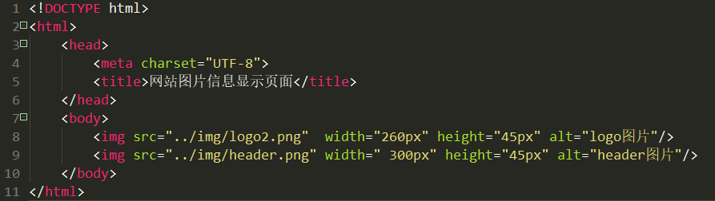

**列表**：

`<ul>`定义无序列表

type 符号的类型，取值:dis表示实心圆，square表示方块、circle表示空心圆

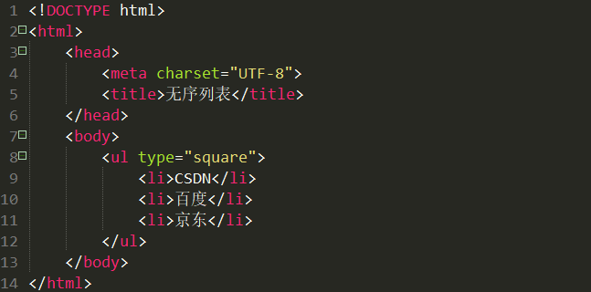

`<o1>`定义有序列表

type列表类型，取值:A、a、I、i、1等，表示顺序,start属性：开始序号;reversed：逆序;type为a：表示字母排序

`<a>`标签是超链接，是在html页面提供一种可以访问其他位置的实现方式。

- href:用于确定需要显示页面的路径(URL)
- target:确定以何种方式打开href所设置的页面。常用取值:_blank,_  self等

​        _blank: 在**新窗口**中打开href确定的页面。

​        _self默认: 使用href确定的页面**替换**当前页面。

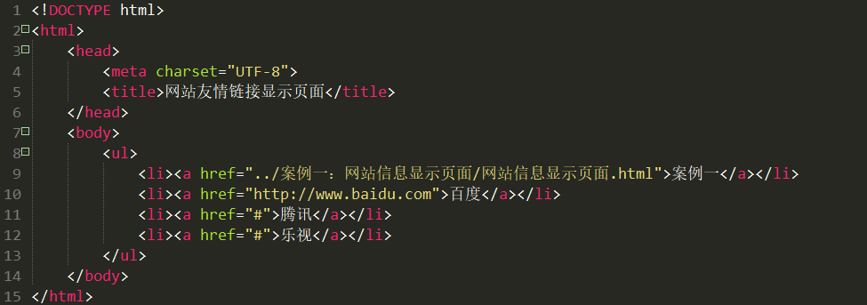

**表格标签**

HTML表格由`<table>标签以及一个或多个<tr>, <th>`或`<td>标签组成`。

- **<table>是父标签，相当于整个表格的容器**。

1.    border表格边框的宽度。
2.   width表格的宽度。
3.   **cellpadding**单元边沿与其内容之间的空白
4.   **cellspacing**单元格之间的空白
5.   bgcolor表格的背景颜色。

- `<tr>标签用于定义行`
- `<td>标签用于定义表格的单元格(一个列)`

1.   **colspan单元格可横跨的列数。**
2.   **rowspan单元格可横跨的行数。**
3.   align单元格内容的水平对齐方式，取值:left左、right右、center居中。
4.   nowrap单元格中的内容是否折行。

- `<th>`标签用于定义表头。单元格内的内容默认居中、加粗

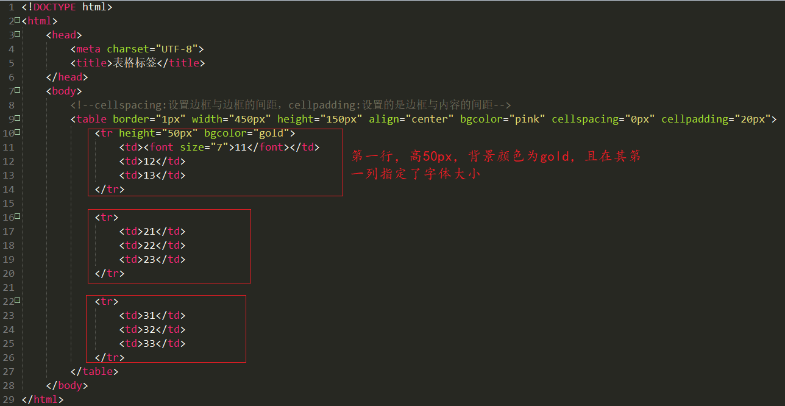

效果如下：


说明一下表格的跨行跨列操作：

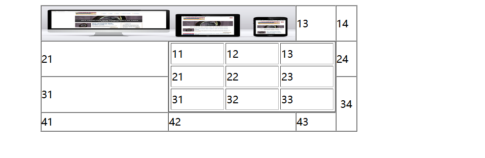

第一行：

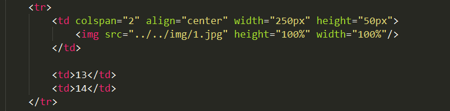

合并第一二列，所以colspan=2

第二行：

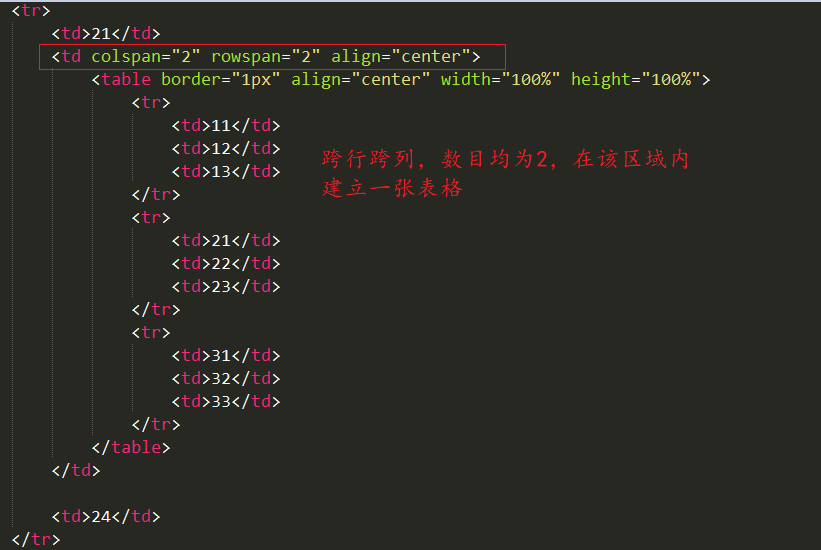


第三行：

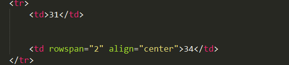

注意，跨行操作后在另一行不要去创建该行，比如，34行跨行为2，那么44对应位置不要创建

第四行：

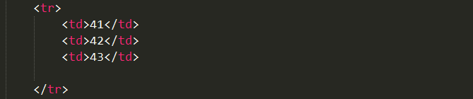

### 1.2 frameset

`<frameset>`标签，是**多个窗口页面整合在一起的一个集合(框架集)**。每一个页面(框架)都是单独文档，需要**使用子标签<frame>来确定页面的位置**。<frameset>通过列和行来确定整体布局，使用**cols确定列数，使用rows确定行数。多个<frameset>可以嵌套使用**。

-  <frameset>和<body>两个不能共存。
-  rows属性和cols属性取值:值1，值2,值3,....一个值表示一行(列)，多值使用逗号分隔，
-  值可以是10px, 10%等，**最后一个值如果不想计算可以使用\*匹配剩余量**。

<frame>标签，用于**设置<frameset>框架集中的一个页面(框架)**。

在 HTML 中，<frame> 标签没有结束标签。

- src属性:确定页面的路径
- noresize属性:框架分隔先不能移动
- **target属性:确定需要显示的页面在何处显示**

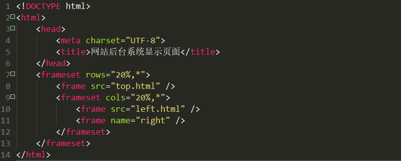

top.html

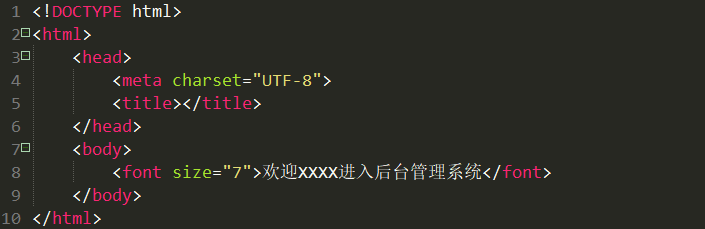

left.html

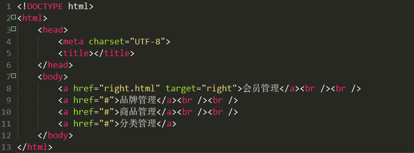

right.html

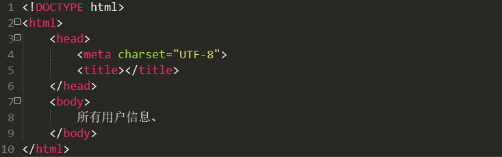

### 1.3 div+css

div就是html一个普通标签，==进行区域划分==。特性:==独自占一行==。独自不能实现复杂效果。必须==结合CSS样式进行渲染。==

`<div>`可定义文档中的==分区或节(divisio/section )==

`<div>`标签可以把文档分割为==独立的、不同的部分==。它可以用作严格的组织工具，并且不使用任何格式与其关联。

CSS通常称为CSS样式或==层叠样式表==，主要==用于设置HTM L页面中的文本内容(字体、大小、对其方式等)、图片的外形(高宽、边框样式、边距等)以及版面的布局等外观显示样式==。CSS可以使HTML页面更好看，CSS色系的搭配可以让用户更舒服，CSS+DIV布局更佳灵活，更容易绘制出用户需要的结构。

#### 1.3.1 css样式规则

`选择器{属性1:属性值;属性2:属性值二}`

引入css样式，既可以嵌入html文档中，也可以是单独的一个文件，如果是单独的文件，则必须以==.css为扩展名==，css与html的结合有3种形式：

- 行内样式
  - 通过标签的style属性来设置元素的样式

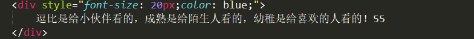

- 内部样式
  - 内部样式又称为内嵌式，是将CSS代码集中写在HTML文档的`<head>`头部标签体中，并且使用`<style>`标签定义
  - 给当前html文件中的多个标签设置样式
  - 内嵌式CSS样式只对其所在的HTML页面有效

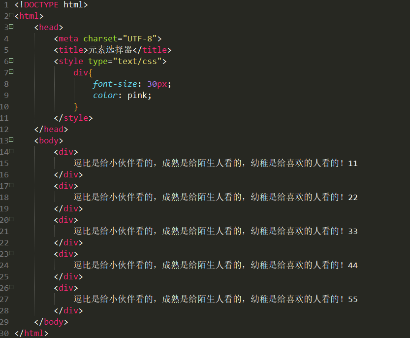

- 外部样式

其中`rel`表示样式表，`type=text/css`表示css类型，`href`代表css文件位置

```html
<link rel="stylesheet" type="text/css" href="css/demo.css"/>
```

#### 1.3.2 选择器

##### 1.3.2.1 元素/标签选择器

标记选择器是指用HTM L标记名称作为选择器，按标记名称分类，为页面中某一类标记指定统一的CSS样式

`标记名{属性1:属性值1;属性2:属性值2;属性3:属性值3;}`

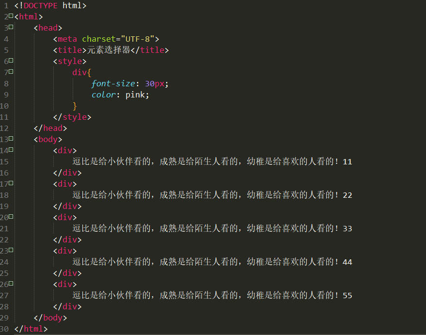

##### 1.3.2.2 ID选择器

使用“#”进行标识，后面紧跟id名，其基本语法格式如下:

`#id名{属性1:属性值1;属性2:属性值2;属性3:属性值3;`

该语法中，id名即为**HTML元素的id属性值**，大多数HTM L元素**都可以定义id属性**，**元素的id**值是**唯一的**，只能对应于文档中某一个具体的元素。

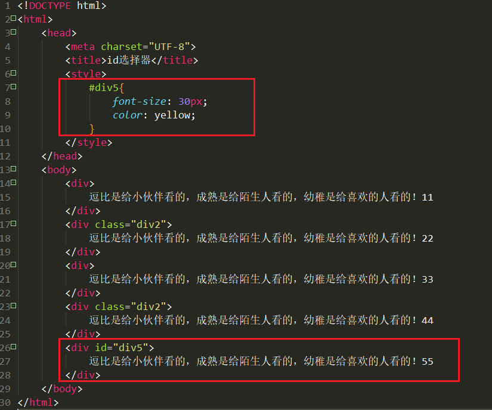

##### 1.3.2.3 类选择器

使用“.”(英文点号)进行标识，后面紧跟类名，其基本语法格式如下:

`.类名{属性1:属性值1;属性2:属性值2;属性3:属性值3;}`

该语法中，类名即为HTML元素的==class属性值==，大多数HTML元素都可以定义class属性。类选择器最大的优势是可以==为元素对象定义单独或相同的样式==。

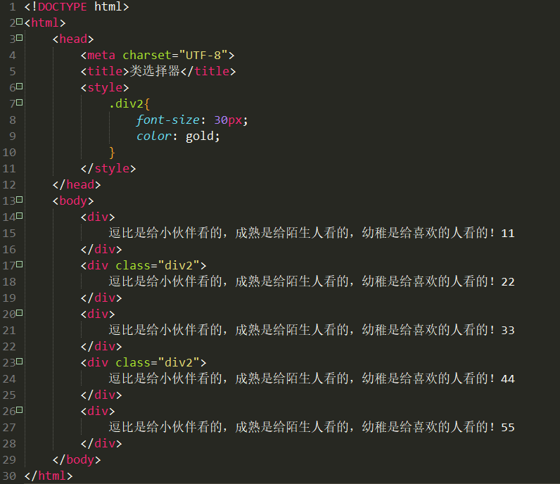

## 二、JavaScript

- ECMAScript：规定了js基础语法核心知识
- Web APIs
- - DOM：页面文档对象模型
  - BOM：浏览器对象模型

### 2.1 常识

```javascript
document.write('要输出的内容');
// 向body输出内容
// 如果输出的内容是标签，也会被解析成网页元素
```

```javascript
alert('要输出的内容')
// 页面弹出警告对话框
```

```javascript
console.log('控制台打印')
// 控制台输出语法，程序员调试使用
```

#### 2.1.1 变量

```javascript
// 声明
let 变量名
//
let age = 18
let i = 1, name = 'nihao'
```

#### 2.1.2 数组

```javascript
let arr = ['你好'，'再见']
console.log(names[0])
console.log(names[1])
console.log(names.length)

// 创建数组的三种方法
var myCars=new Array();
myCars[0]="Saab";      
myCars[1]="Volvo";
myCars[2]="BMW";

//
var myCars=new Array("Saab","Volvo","BMW");

//
var myCars=["Saab","Volvo","BMW"];

var y=myCars.indexOf("Volvo")   // "Volvo" 值的索引值

// 你可以在数组中有不同的变量类型
```

#### 2.1.3 数据类型

##### 1. 基础数据类型

``` javascript
// js是弱数据类型  变量到底属于哪种类型 只有赋值之后才能确认
// 数字类型 number  
let score = 100
let price = 1.23

// 字符串类型
// 单引号或双引号  没什么区别
// 反引号也行
let user = '小明'
let name = "nihao"
let st = ''
let sr = '123'

```

模板字符串

```javascript
// 在``下用${}包住变量
document.write(`大家好，我叫${name},今年${age}岁`)
```

布尔类型：==true，false==

未定义类型（undefined）：即==只声明不赋值的情况==

==null：空类型==，如果存放对象，对象没有准备好，则可赋值为null

`typeof`可以检测数据类型 

隐式转换：

- +号两边只要有一个是字符串，都会把另外一个转换成字符串
- 除了+以外的算术运算符，比如-*/等会把数据转换为数字类型
- +号作为正号解析可以转换成Number

显式转换：

```javascript
Number('10') // 只能放数字类型的字符，不能放abc这样的 否则返回NaN
parseInt('10')
parseInt('10.9999') // 只截取整数部分
parseFloat('10.9999')
parseFloat('10.9999aaa')  //可以过滤以数字开头的非数字类型的字符

String(10)
let age=18
age.toString()
age.toString(2) //转换为二进制
```

##### 2. 引用数据类型


#### 2.1.4 运算符

其他不提

`== `：左右两边是否相等

`===`:左右两边是否类型和值都相等

`!==`:左右两边是否不全等

`&&,||,!`分别代表与或非，短路只存在`&&`和`||`中

```javascript
&& 左边为false就短路，不再计算右边
|| 左边为true就短路
```

`false 数字0 '' undefined null`都是假的

#### 2.1.5 条件、分支、循环语句

略

#### 2.1.6 函数

```javascript
function functionname()
{
    // 执行代码
}


function myFunction(var1,var2)
{
    // 代码
}

// 带有返回值的函数
function myFunction(a,b)
{
    return a*b;
}
```


