## 一、树  
## 1.1 树的概念  
定义  
树(Tree)是由一个或多个结点组成的有限集合T，其中有一个特定的称为根的结点；其余结点可分为m(m≥0)个互不相交的有限集T1,T2,T3 ,…,Tm，每一个集合本身又是一棵树，且称为根的子树。
## 1.2 相关术语  
结点的度：结点所拥有的子树的个数。  
树的度：树的所有结点中**最大的度数**；  
叶结点（Leaf）：度为0的结点；  
父结点（Parent）：有子树的结点是其子树的根节点的父结点；  
子结点/孩子结点（Child）：若A结点是B结点的父结点，则称B结点是A结点的子结点；  
兄弟结点（Sibling）：具有同一个父结点的各结点彼此是兄弟结点；  
路径和路径长度：从结点n1到nk的路径为一个结点序列n1，n2，...，nk。ni是ni+1的父结点。路径所包含边的个数为路径的长度；  
祖先结点（Ancestor）：沿树根到某一结点路径上的所有结点都是这个结点的祖先结点；  
子孙结点（Descendant）：某一结点的子树中的所有结点是这个结点的子孙；  
结点的层次（Level）：**规定根结点的层数为1**，其他任一结点的层数是其父结点的层数加1；  
树的深度（Depth）：树中所有结点中的最大层次是这棵树的深度；  
有序树和无序树：如果一棵树中结点的各个子树从左到右是有次序的，即若交换了某个结点各个子树的相对位置，则构成不同的树，称这棵树为有序树，反之为无序树。  
森林：零棵或有限棵不相交的树的集合称为森林。自然界中树和森林是不同的概念，但在数据结构中，树和森林只有很小的差别。任何一棵树，删去根节点就变成了森林。  
## 二、二叉树  
## 2.1 定义  
二叉树是一种重要的树形结构，其结构定义为：二叉树是n(n≥0)个结点的有限集，它或为空树(n=0)，或由一个根结点和两棵分别称为根的左子树和右子树的、互不相交的二叉树组成。当集合为空时，称该二叉树为空二叉树。在二叉树中，一个元素也称作一个节点。
二叉树有五种基本形态：空树；只含根节点；左子树为空树；右子树为空树；左右子树均不为空。
二叉树是有序树，即若将其左、右子树颠倒，就会成为另一棵不同的二叉树。  
### 2.1.1 满二叉树  
在一棵二叉树中，如果所有分支节点都存在左子树和右子树，并且所有叶子节点都在同一层，这样的一颗二叉树称作满二叉树。  
### 2.1.2 完全二叉树  
一棵深度为k的有n个节点的二叉树，对树种的结点按从上到下，从左到右的顺序进行编号，如果编号为i的结点与**满二叉树的结点**在二叉树中的位置相同，那么这棵树为完全二叉树。  
特点：叶子节点只能出现在最下层和次下层；且最下层的叶子节点集中在树的左边。  
显然，一棵满二叉树必定是一棵完全二叉树，而完全二叉树未必是满二叉树。  
## 2.2 性质  
### 2.2.1 性质一（最多节点数）  
一棵非空二叉树的第i层上最多有个节点。  
### 2.2.2 性质二（最多总结点数）  
一棵深度为k的二叉树中，最多个节点。（等比数列求和而已）  
### 2.2.3 性质三（叶子结点数=度为2的结点数+1）  
对于一棵非空的二叉树，如果叶子结点数为，度为2的节点数为，则有，证明如下：  
总结点数，二叉树只有三个度的取值，分别为0，1，2  
总分支数，因为除了根节点，每个节点都有唯一的进入分支。  
总分支数还等于，因为度为1的有一个分支，度为2的有两个分支。    
故而，  
也就是说，**叶子结点数与度为1的结点数无关。等于度为2的结点数加1。**  

**推广到m叉树的叶子结点数**  
总结点数  
总分支数   
所以  
### 2.2.4 性质四（深度） 
具有n个节点的完全二叉树的深度k为或  
第一个值的证明  
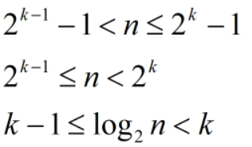  
第二个值的证明：  
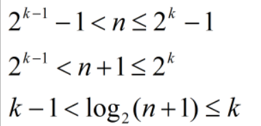  
### 2.2.5 性质五（父子节点编号推导）  
  
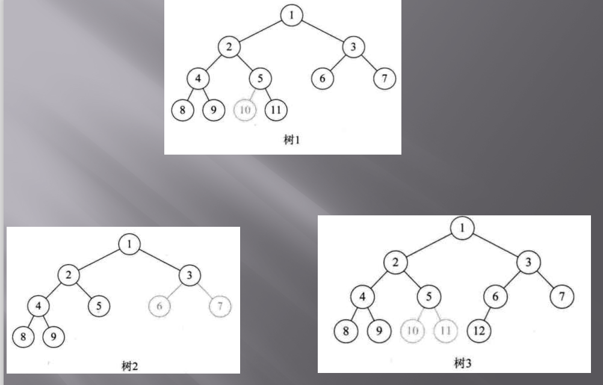  
## 三、二叉树的存储  
### 3.1 二叉树的顺序存储结构  
  
  
### 3.2 二叉树的链式存储结构  
#### 3.2.1 二叉链表表示法  
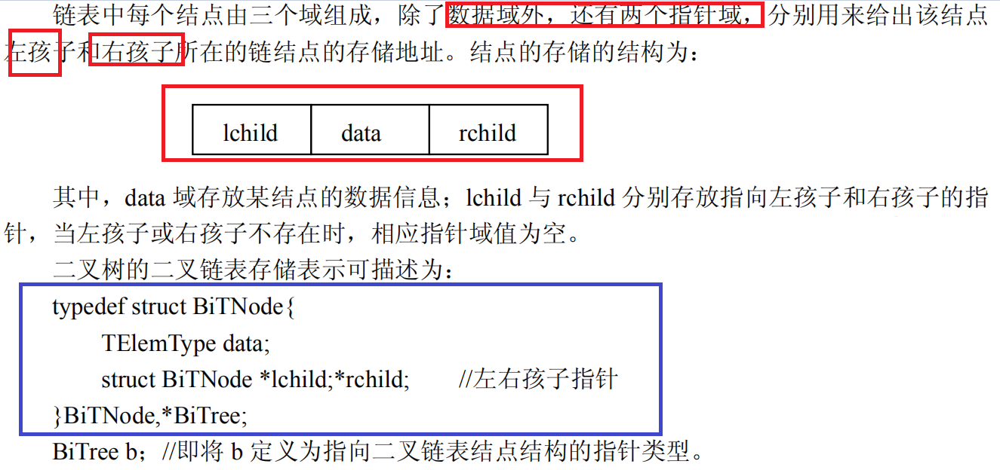  
  
若一个二叉树含有n个节点，则它的二叉链表必有2n个指针域，其中必有n+1个空链域(因为有n-1个节点有进入分支)。  
  
#### 3.2.2 三叉链表表示法  
  
## 四、二叉树的遍历  
### 4.1 二叉树遍历规则：  
所有三种的遍历都是：先左子树深入，无法深入再返回至右子树，以此循环  
  
每一个节点都经过了三次：先左边进入，再左边返回，再右边返回  
  
按照在第几次访问得到三种遍历方式：先序遍历、中序遍历、后序遍历。  
  
还有一种不常用的遍历：层次遍历，即从上到下按照层次遍历。  
  
算法利用迭代思想  
  
### 4.2 先序遍历  
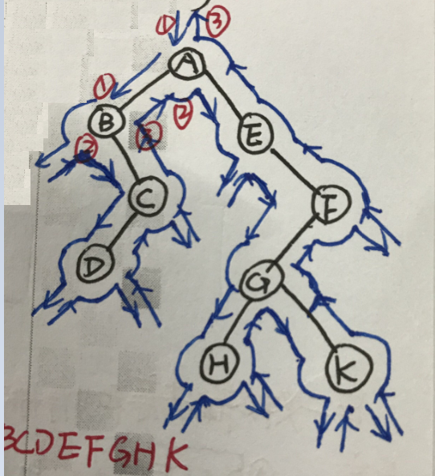  
访问根节点；  
  
先序遍历根节点的左子树；  
  
先序遍历根节点的右子树。  
  
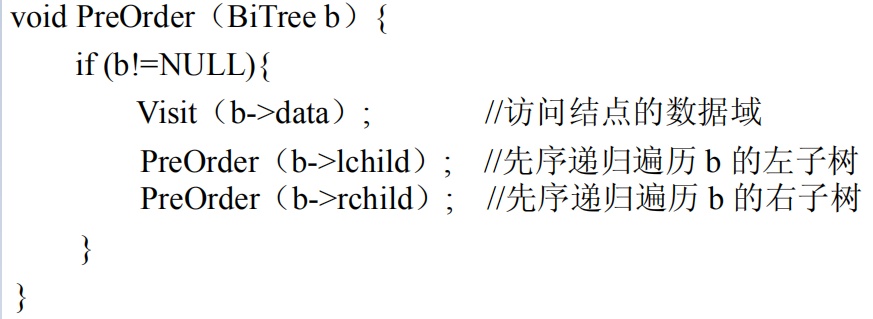  
### 4.3 中序遍历  
  
### 4.4 后序遍历  
  
### 4.5 层次遍历  
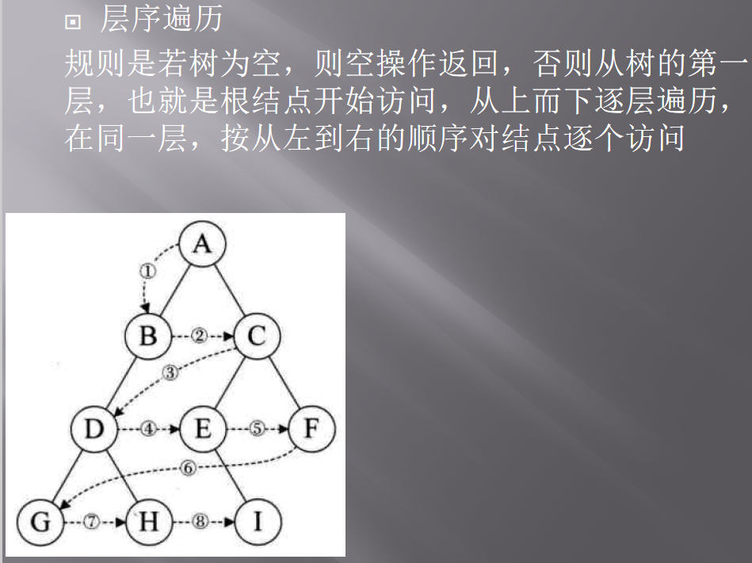  

## 五、树与森林  
### 5.1 树的存储结构  
#### 5.1.1 双亲表示法  
  
C++描述如下：  
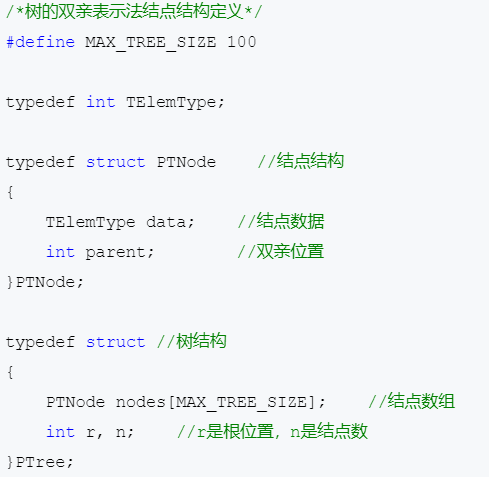  
优点：parent指针域指向数组下标，所以找双亲结点的时间复杂度为O(1),向上一直找到根节点也快  
缺点：由上向下找就十分慢，若要找结点的孩子或者兄弟，要遍历整个树  
#### 5.1.2 孩子链表表示法  
孩子链表主体是一个与结点个数一样大小的一维数组，数组的每一个元素都有两个域组成，一个域用来存放结点信息，另一个用来存放指针，该指针指向由该节点孩子组成的单链表的首位置。  
单链表的结构也由两个域组成，一个存放孩子节点在一维数组中的序号，另一个是指针域，指向下一个孩子。  
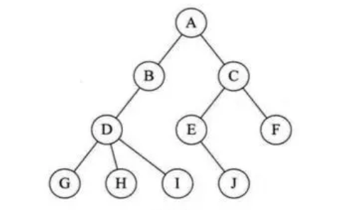  
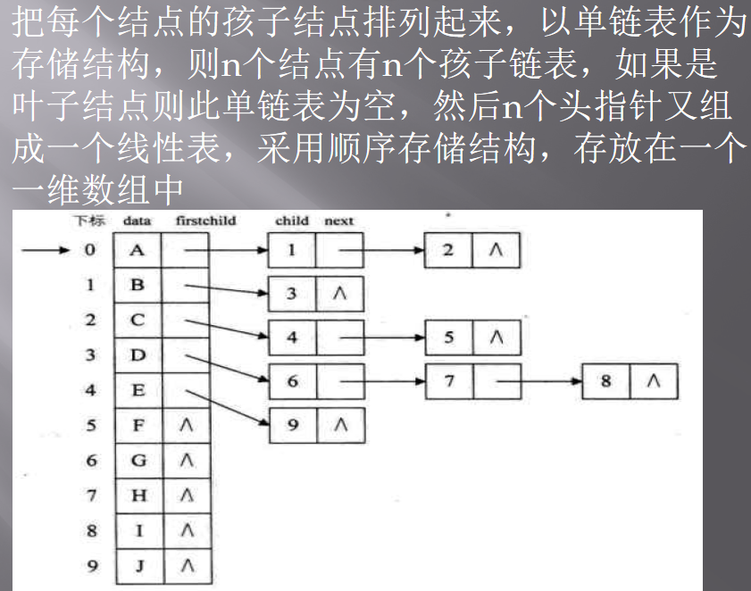  
C++描述如下：  
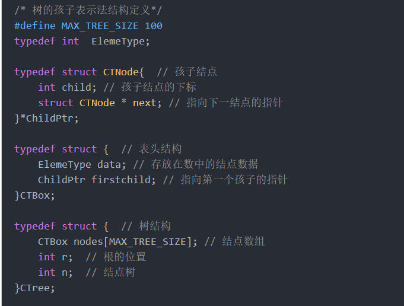  
很显然，这是HashMap的数据结构。  
#### 5.1.3 孩子兄弟表示法  
  