# 图论应用  
## 一、最小生成树  
### 1.1 最小生成树的概念  
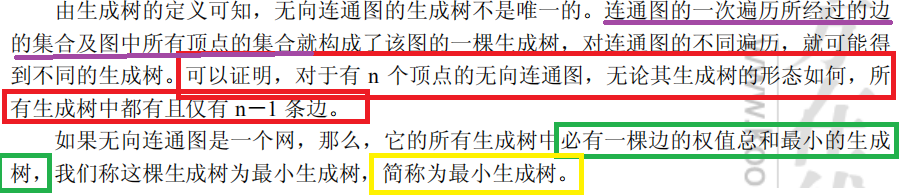  
### 1.2 普里姆(Prim)算法  
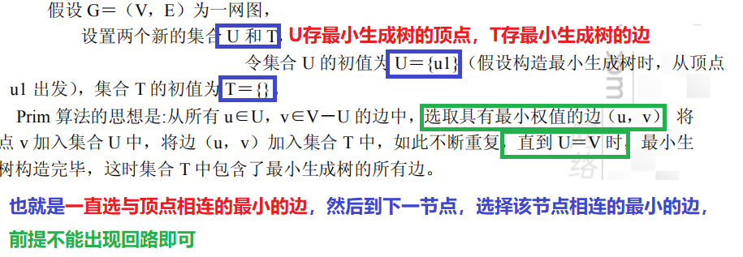  
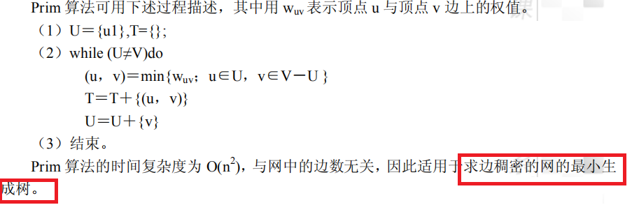  

### 1.3 卡鲁斯卡尔(Kruskal)算法---加边法  
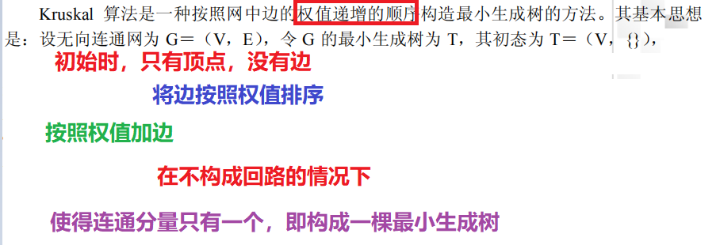  
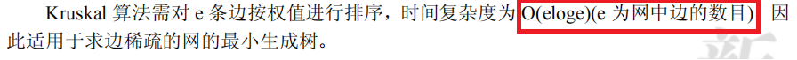  
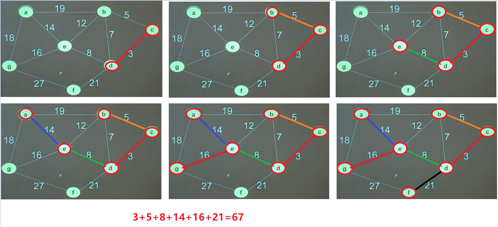
## 二、拓扑排序  
### 2.1 AOV(Activity On Vertex Network)网  
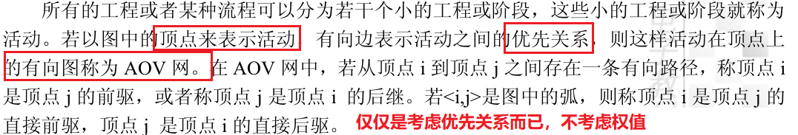  
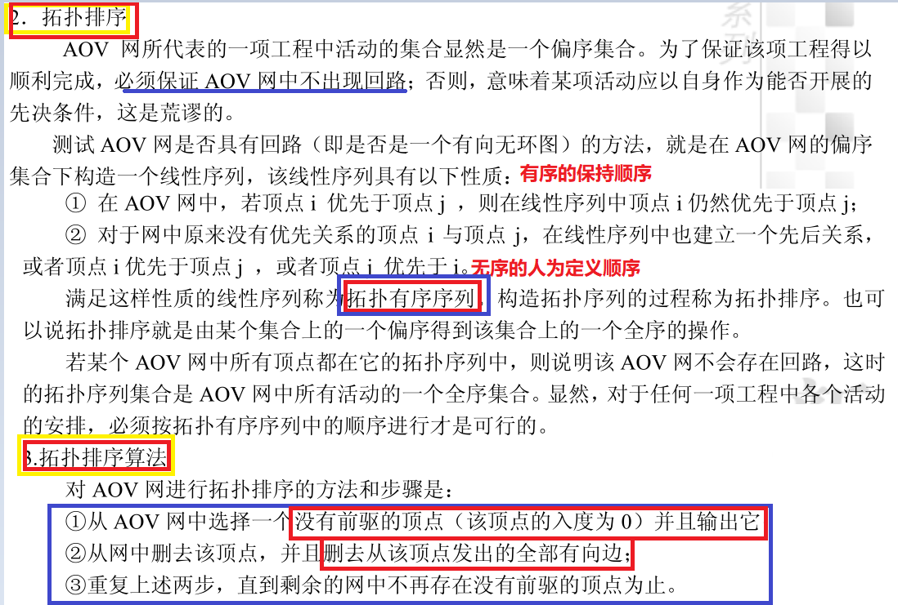  
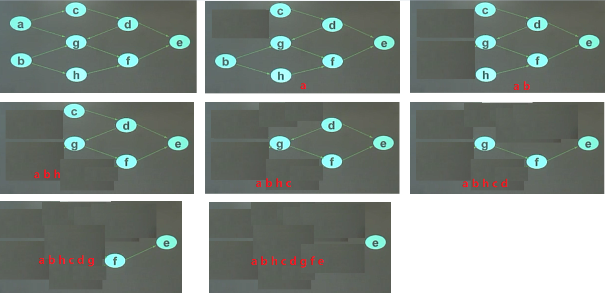  
## 三、关键路径  
### 3.1 AOE网  
若在带权的有向图中，以**顶点表示事件**，以**有向边表示活动**，**边上的权值表示活动的开销（如该活动持续的时间）**，则此带权的有向图称为AOE网。  
  
### 3.2 关键路径与关键活动  
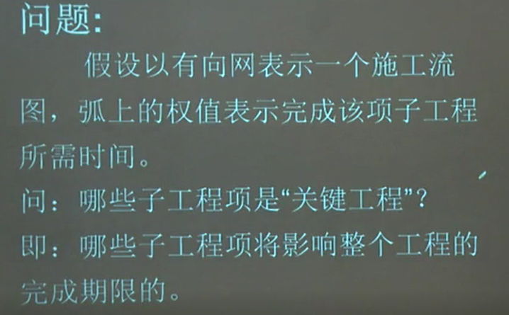  
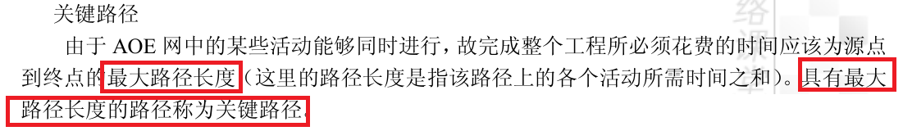  
关键活动:  **该活动的最早开始时间=活动的最晚开始时间**
### 3.3 事件的最早发生时间  
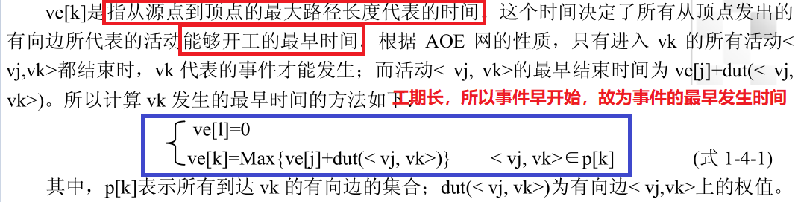  
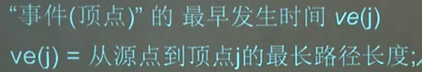  
### 3.4 事件的最晚发生时间  
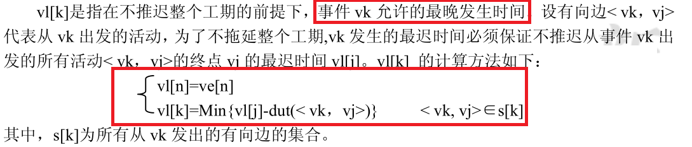  
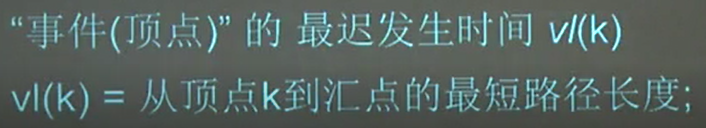  
### 3.5 活动发生的最早和最晚发生时间  
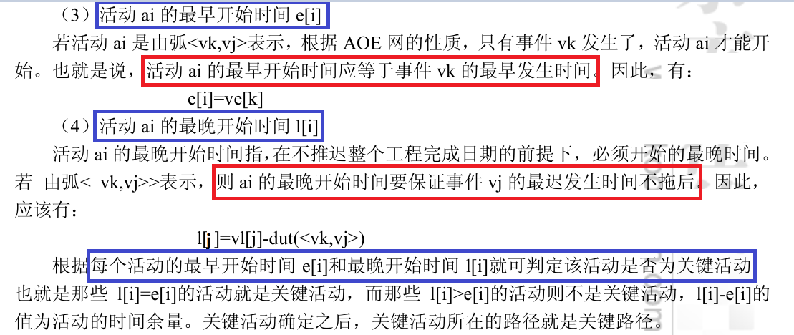  
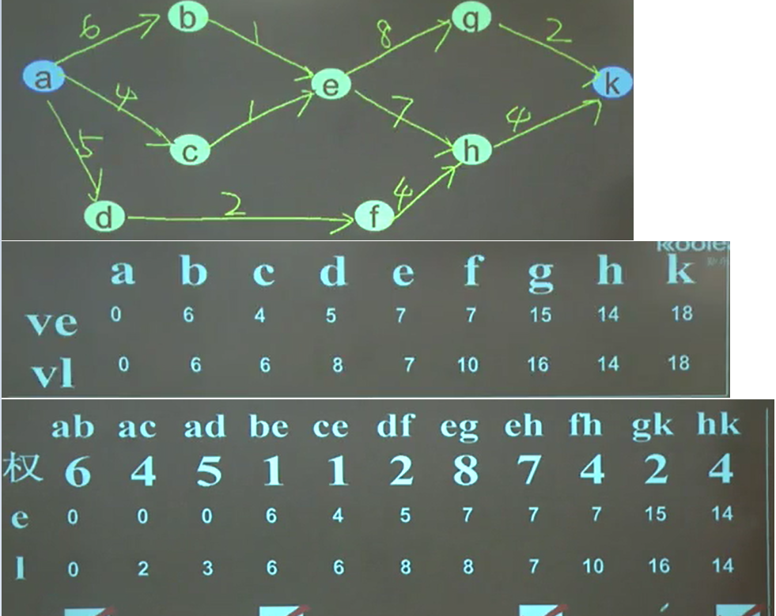  
## 四、最短路径  