# 排序  
## 一、插入排序  
### 1.1 直接插入排序  
复杂度O(N^2)
  
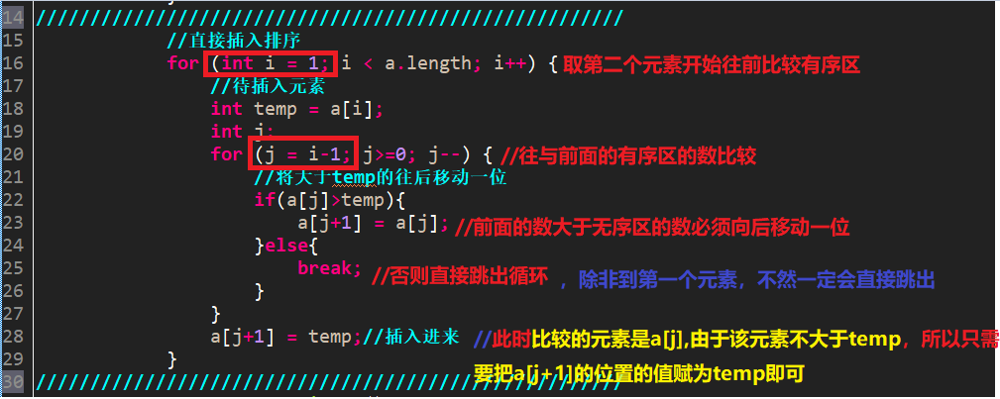  
### 1.2 二分法插入排序  
  
  
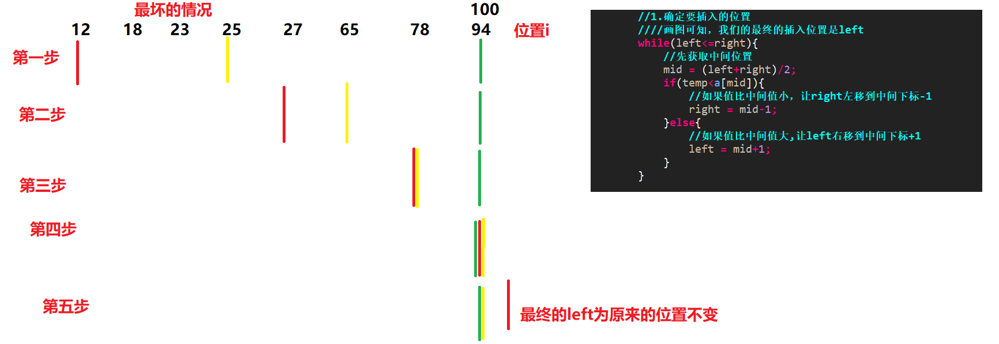  
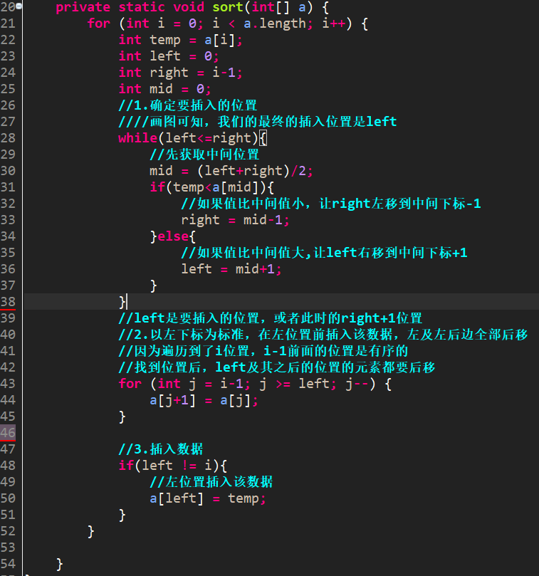
### 1.3 希尔排序  
希尔排序（shell sort）这个排序方法又称为缩小增量排序，是1959年D·L·Shell提出来的。该方法的基本思想是：设待排序元素序列有n个元素，<font color=red >首先取一个整数increment（小于n）作为间隔将全部元素分为increment个子序列，所有距离为increment的元素放在同一个子序列中，在每一个子序列中分别实行直接插入排序。</font><font color=blue>然后缩小间隔increment</font>，重复上述子序列划分和排序工作。<font color=blue>直到最后取increment=1，将所有元素放在同一个子序列中排序为止</font>。   
由于开始时，increment的取值较大，每个子序列中的元素较少，排序速度较快，到排序后期increment取值逐渐变小，子序列中元素个数逐渐增多，但由于前面工作的基础，大多数元素已经基本有序，所以排序速度仍然很快。   
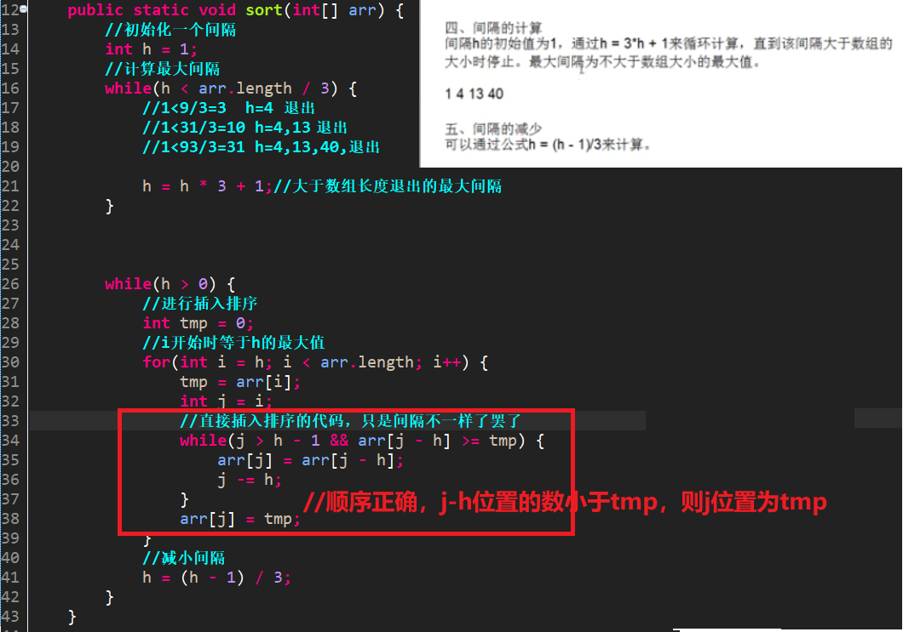  
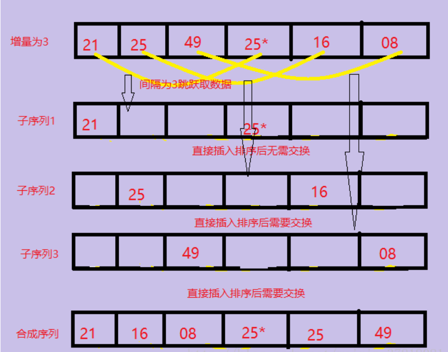  
  


## 二、选择排序  
### 2.1 简单选择排序  
  
### 2.2 堆排序  
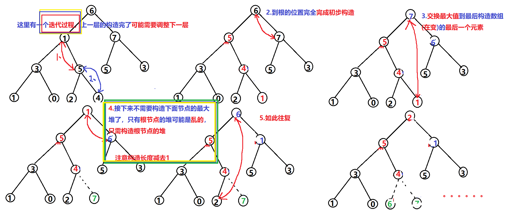  
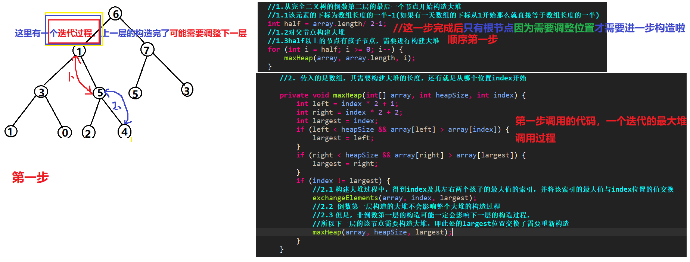  
  
```java
package cn.scct.sort;

//堆排序
public class HeapSort {   //(1)
		public static void main(String[] args) {
			HeapSort heapSort = new HeapSort();

			int[] array = { 19, 8, 27, 6, 35,56,12,23,11,1,34,9,232,323,21,77,3,0,23,76,4,68,97,356, 14, 3, 12, 1, 0, 9, 10, 7 };

			System.out.println("Before heap:");
			heapSort.printArray(array);

			heapSort.heapSort(array);

			System.out.println("After heap sort:");
			heapSort.printArray(array);
		}

		public void heapSort(int[] array) {
			if (array == null || array.length <= 1) {
				return;
			}
			//1.从完全二叉树的倒数第二层的最后一个节点开始构造大堆
			//1.1该元素的下标为数组长度的一半-1(如果有一天数组的下标从1开始那么就直接等于数组长度的一半)
			int half = array.length/ 2-1;
			//1.2对父节点构建大堆
			//1.3half以上的节点有孩子节点，需要进行构建大堆
			for (int i = half; i >= 0; i--) {
				maxHeap(array, array.length, i);
			}

			for (int i = array.length - 1; i >= 1; i--) {
				//3.1 最大的在0位置，那么开始沉降，这样每交换一次最大的值就丢到最后了
				exchangeElements(array, 0, i);
				//3.2 交换后构建的数组的大堆长度每次都要减去1
				//3.3 从位置0开始，因为只有此处的大堆可能是乱的
				maxHeap(array, i, 0);
			}
		}

        //2. 传入的是数组，其需要构建大堆的长度，还有就是从哪个位置index开始
		
		private void maxHeap(int[] array, int heapSize, int index) {
			int left = index * 2 + 1;
			int right = index * 2 + 2;
			int largest = index;
			if (left < heapSize && array[left] > array[index]) {
				largest = left;
			}
			if (right < heapSize && array[right] > array[largest]) {
				largest = right;
			}
			if (index != largest) {
				//2.1 构建大堆过程中，得到index及其左右两个孩子的最大值的索引，并将该索引的最大值与index位置的值交换
				exchangeElements(array, index, largest);
                //2.2 倒数第一层构造的大堆不会影响整个大堆的构造过程
				//2.3 但是，非倒数第一层的构造可能一定会影响下一层的构造过程，
				//所以下一层的该节点需要构造大堆，即此处的largest位置交换了需要重新构造
				maxHeap(array, heapSize, largest);
			}
		}
		
        //按照固定格式打印数组	
		public void printArray(int[] array) {  
            System.out.print("{");  
            for (int i = 0; i < array.length; i++) {  
                System.out.print(array[i]);  
                if (i < array.length - 1) {  
                    System.out.print(", ");  
                }  
            }  
            System.out.println("}");  
        }  
		
		//交换元素
		public void exchangeElements(int[] array, int index1, int index2) {  
            int temp = array[index1];  
            array[index1] = array[index2];  
            array[index2] = temp;  
        }  
	}
```  

## 三、交换排序  
### 3.1 快速排序  
**大于的放右边，小于的放左边，关键是找到界点（中间数）的位置。**  
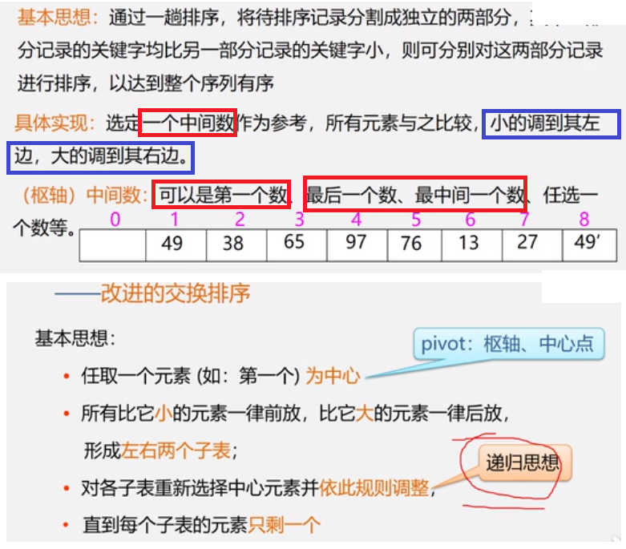  
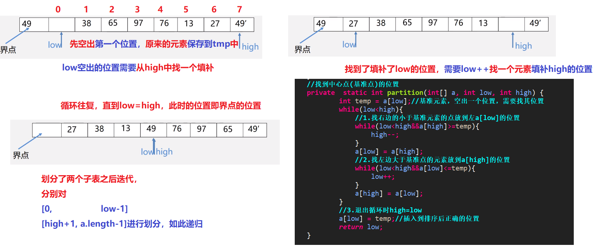  
```java
package cn.scct.sort;

public class QuickSort {
	
	public static void quickSort(int[] a, int low, int high) {
	//是一个递归的过程  判断界点两边  
		if(low<high){
			int pivot = partition(a,low,high);
			quickSort(a, 0, pivot-1);
			quickSort(a,pivot+1,high);
		}
	}
	//找到中心点(基准点)的位置	
	private  static int partition(int[] a, int low, int high) {
			int temp = a[low];//基准元素，空出一个位置，需要找其位置
			while(low<high){
				//1.找右边的小于基准元素的点放到左a[low]的位置
				while(low<high&&a[high]>=temp){
					high--;
				}
				a[low] = a[high];
				//2.找左边大于基准点的元素放到a[high]的位置
				while(low<high&&a[low]<=temp){
					low++;
				}
				a[high] = a[low];
			}
			//3.退出循环时high=low
			a[low] = temp;//插入到排序后正确的位置
			return low;		
	}


	public static void main(String[] args){
		int [] a = new int[25];
		for (int i = 0; i < 25; i++) {
			a[i]=(int) (Math.random()*100);		
		}
		System.out.print("排序前：");
		for (int i = 0; i < a.length; i++) {
			System.out.print(a[i]+", ");	
		}
		System.out.println(" ");
		QuickSort.quickSort(a, 0, a.length-1);
		System.out.print("排序后：");
		for (int i = 0; i < a.length; i++) {
			System.out.print(a[i]+", ");	
		}
	}
}
```
## 四、归并排序  
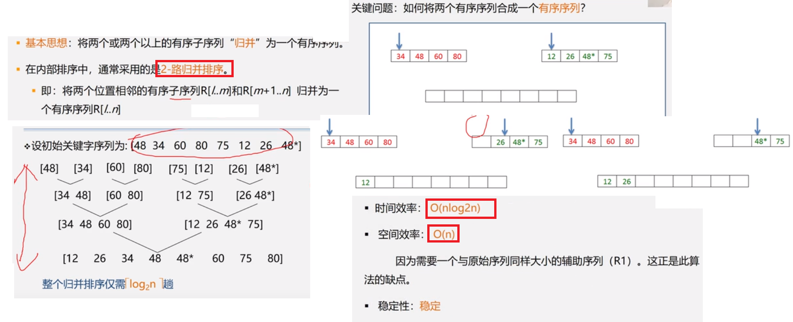  
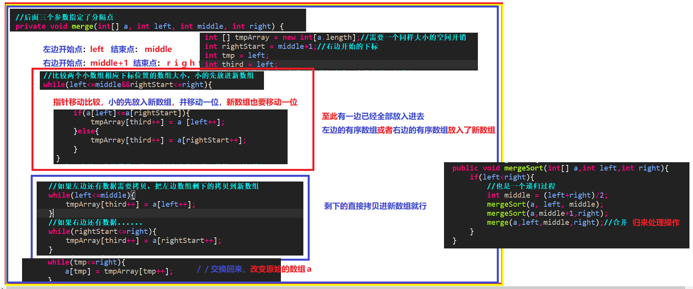  
```java  
package cn.scct.sort;

public class MergeSort {
	public void mergeSort(int[] a,int left,int right){
		if(left<right){
			//也是一个递归过程  
			int middle = (left+right)/2;
			mergeSort(a, left, middle);
			mergeSort(a,middle+1,right);
			merge(a,left,middle,right);//合并
		}
	}

	//后面三个参数指定了分隔点  
	private void merge(int[] a, int left, int middle, int right) {
		int [] tmpArray = new int[a.length];//需要一个同样大小的空间开销
		int rightStart = middle+1;//右边开始的下标
		int tmp = left;
		int third = left;
		////////////////////////////////////////////////////
		//比较两个小数组相应下标位置的数组大小，小的先放进新数组
		while(left<=middle&&rightStart<=right){
			if(a[left]<=a[rightStart]){
				tmpArray[third++] = a [left++];//小的先进入数组并移动一位，新数组也要移动一位
			}else{
				tmpArray[third++] = a[rightStart++];//小的先进入数组并移动一位，新数组也要移动一位
			}
		}
		//////////////////////////////////////////////////
		//如果左边还有数据需要拷贝，把左边数组剩下的拷贝到新数组
		while(left<=middle){
			tmpArray[third++] = a[left++];
		}
		//如果右边还有数据......
		while(rightStart<=right){
			tmpArray[third++] = a[rightStart++];
		}
		//////////////////////////////////////////////////
		while(tmp<=right){
			a[tmp] = tmpArray[tmp++];
		}
	}
	
	public static void main(String[] args){
		MergeSort mergeSort = new MergeSort();
		int [] a = new int[]{90,3,2,67,44,-9,87,65,11,9,2,8};
		mergeSort.mergeSort(a, 0, a.length-1);
		for(int n:a){
			System.out.print(" "+n);
		}
	}
}
```  
## 五、基数排序  
  
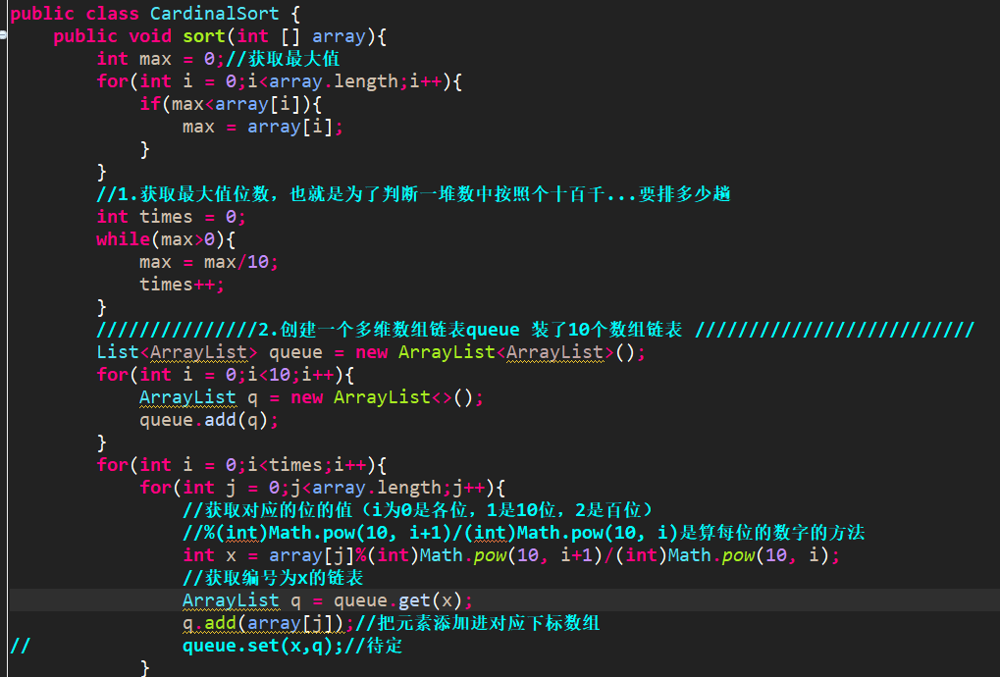  
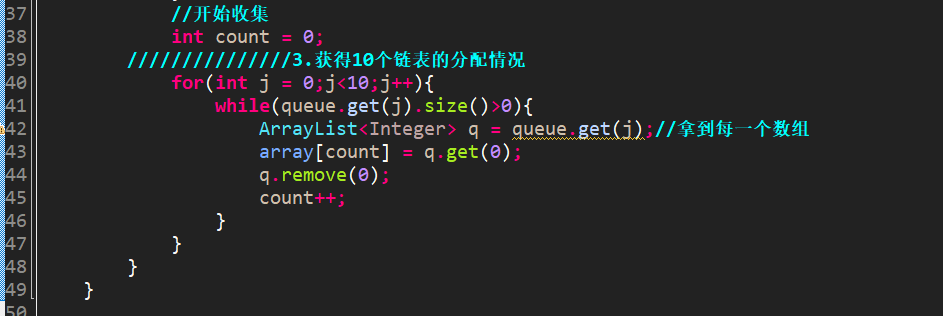  
```java  
package cn.scct.sort;


import java.util.ArrayList;
import java.util.List;

public class CardinalSort {
	public void sort(int [] array){
		int max = 0;//获取最大值
		for(int i = 0;i<array.length;i++){
			if(max<array[i]){
				max = array[i];
			}
		}
		//1.获取最大值位数，也就是为了判断一堆数中按照个十百千...要排多少趟
		int times = 0;
		while(max>0){
			max = max/10;
			times++;
		}
		///////////////2.创建一个多维数组链表queue 装了10个数组链表  //////////////////////////
		List<ArrayList> queue = new ArrayList<ArrayList>();
		for(int i = 0;i<10;i++){
			ArrayList q = new ArrayList<>();
			queue.add(q);
		}
		for(int i = 0;i<times;i++){
			for(int j = 0;j<array.length;j++){
				//获取对应的位的值（i为0是各位，1是10位，2是百位）
				//%(int)Math.pow(10, i+1)/(int)Math.pow(10, i)是算每位的数字的方法
				int x = array[j]%(int)Math.pow(10, i+1)/(int)Math.pow(10, i);
				//获取编号为x的链表
				ArrayList q = queue.get(x);
				q.add(array[j]);//把元素添加进对应下标数组
//				queue.set(x,q);//待定
			}
			//开始收集
			int count = 0;
		///////////////3.获得10个链表的分配情况
			for(int j = 0;j<10;j++){
				while(queue.get(j).size()>0){
					ArrayList<Integer> q = queue.get(j);//拿到每一个数组
					array[count] = q.get(0);
					q.remove(0);
					count++;
				}
			}
		}
	}
	
	public static void main(String[] args){
		CardinalSort basicSort = new CardinalSort();
		int [] a = {136,2,6,8,9,2,8,11,23,56,34,90,89,29,145,209,320,78,3};
		basicSort.sort(a);
		for(int n:a){
			System.out.print(" "+n);
		}
	}
}
```