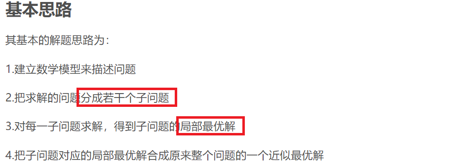
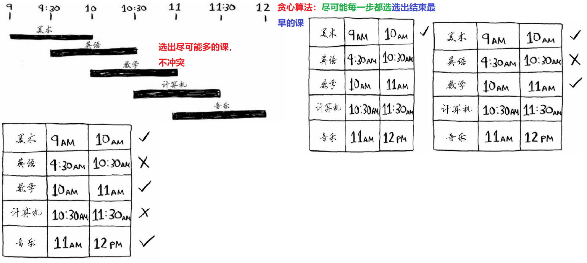
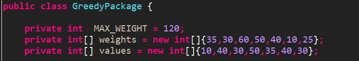
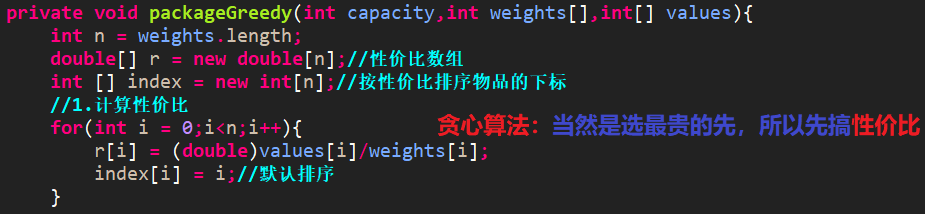
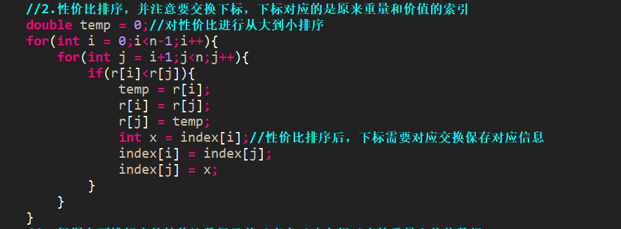
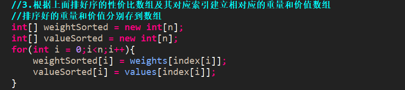
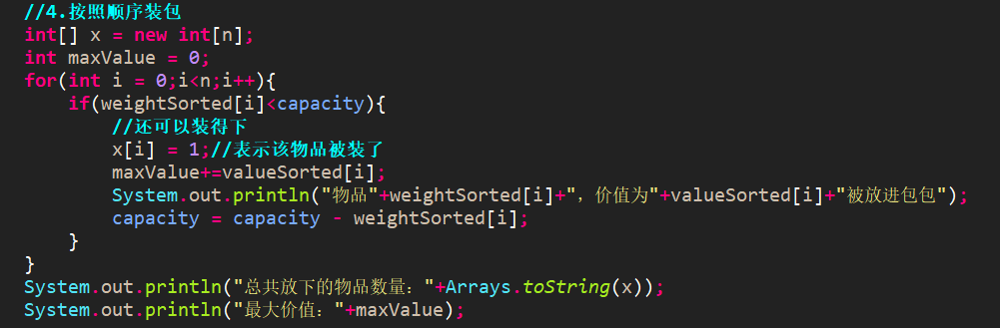
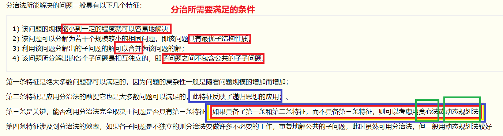

# 贪心和分治  
## 一、贪心算法  
 贪婪算法(贪心算法)是指在对问题进行求解时，在每一步选择中都采取最好或者最优(即最有利)的选择，从而希望能够导致结果是最好或者最优的算法。  
贪婪算法所得到的结果往往不是最优的结果(有时候会是最优解)，但是都是相对近似(接近)最优解的结果。  
贪婪算法并没有固定的算法解决框架，算法的关键是贪婪策略的选择，根据不同的问题选择不同的策略。  
必须注意的是策略的选择**必须具备无后效性**，即某个状态的选择不会影响到之前的状态，只与当前状态有关，所以对采用的贪婪的策略一定要仔细分析其是否满足无后效性。  
  
  
### 1.1 背包问题  
  
  
  
  
  
## 二、分治算法  
分治法的设计思想是：  
分–将问题分解为规模更小的子问题；  
治–将这些规模更小的子问题逐个击破；  
合–将已解决的子问题合并，最终得出“母”问题的解；  
一个先自顶向下，再自底向上的过程。  
  
### 2.1分治经典例题  
#### 2.1.1 二分搜索技术  
#### 2.1.2 大整数的乘法  
#### 2.1.3 Strassen矩阵乘法  
#### 2.1.4 棋盘覆盖  
#### 2.1.5 合并排序  
#### 2.1.6 线性时间选择  
#### 2.1.7 最接近点对问题  
#### 2.1.8 快速排序  
#### 2.1.9 循环赛日程表  